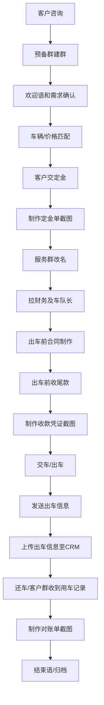

# 01_订单生命周期

> 财务规则抽取阶段。本文只抽取已发现文件中的流程规则，不做经营分析、不统计营业额、不输出经营建议。

## 证据来源

| 来源文件 | 来源表格/位置 | 可提取证据 | 可信度 |
|---|---|---|---|
| `C:\Users\Admin\Desktop\芒果客服绩效考核表.xlsx` | `模板页` | 预备群建群、欢迎语、回复时效、定金单、服务群改名、拉财务及车队长、合同、尾款、收款凭证、出车信息、CRM、对账单、结束语 | 高：表内为客服绩效考核模板，直接列明流程节点 |
| `C:\Users\Admin\Desktop\毕飞飞\表格资料\定金单.xlsx` | `Sheet1`、`Sheet1 (2)` | 群备注、用车时间、车型、单价、说明、定金收款金额、押金、尾款、收款方式、客户归属、销售、备注 | 高：业务使用中的定金单结构 |
| `C:\Users\Admin\Desktop\毕飞飞\客户账单复盘\客户账单整理2026.5.30.xlsx` 等客户账单文件 | 多个客户账单整理表 | 客户编号、用车记录、对账单类字段 | 中：用于复盘/账单整理，完整性无法确认 |
| `C:\Users\Admin\Desktop\绩效登记表(5).xlsx` | `财务部`、`销售部`、`业务部` | 定金单尾款计算错误、收款凭证错误、客户编号错误、出车条错误、未及时回复、未落实违章等异常记录 | 中：为违规登记，能证明异常类型，不能证明全量流程 |

## 标准流程

## 节点规则

| 节点 | 已发现规则 | 来源 | 可信度 |
|---|---|---|---|
| 预备群建群 | 每日工作开始至少建预备群 5 个 | `芒果客服绩效考核表.xlsx` / `模板页` / “预备群建群率” | 高 |
| 欢迎语 | 拉入客户并给出需求后 30 秒内发送欢迎语 | `芒果客服绩效考核表.xlsx` / `模板页` / “欢迎语发送时间” | 高 |
| 咨询回复 | 客户咨询信息 3 分钟内回复，有问必答 | `芒果客服绩效考核表.xlsx` / `模板页` / “信息回复时间” | 高 |
| 车辆匹配 | 客户咨询车辆的笔记及对应价格需准确匹配 | `芒果客服绩效考核表.xlsx` / `模板页` / “车辆匹配笔记精准度” | 高 |
| 沟通群改名 | 确定用车咨询后 2 分钟内变更群名 | `芒果客服绩效考核表.xlsx` / `模板页` / “沟通群变更群名” | 高 |
| 定金单 | 客户交过定金后 10 分钟内做出定金单发至群中 | `芒果客服绩效考核表.xlsx` / `模板页` / “制作订金单截图” | 高 |
| 服务群改名 | 收完定金后 2 分钟内变更群名 | `芒果客服绩效考核表.xlsx` / `模板页` / “服务群变更群名” | 高 |
| 拉财务和车队长 | 收到定金后 2 分钟内拉财务及车队长 | `芒果客服绩效考核表.xlsx` / `模板页` / “拉工作人员动作” | 高 |
| 合同 | 索要客户身份信息必须在业务员进群前执行，每台车必须签订租车合同 | `芒果客服绩效考核表.xlsx` / `模板页` / “出车前合同制作” | 高 |
| 尾款 | 签订完合同必须要出车前收尾款 | `芒果客服绩效考核表.xlsx` / `模板页` / “收尾款” | 高 |
| 收款凭证 | 收到尾款后 10 分钟内做出收款凭证发至群中 | `芒果客服绩效考核表.xlsx` / `模板页` / “制作收款凭证截图” | 高 |
| 出车信息 | 出车后 10 分钟内将出车信息编辑好发送至出车群 | `芒果客服绩效考核表.xlsx` / `模板页` / “出车信息发送” | 高 |
| CRM | 当日下班前必须把当日出车信息上传至 CRM | `芒果客服绩效考核表.xlsx` / `模板页` / “上传出车信息至CRM” | 高 |
| 对账单 | 客户群收到用车记录后，10 分钟内做出对账单发至群中 | `芒果客服绩效考核表.xlsx` / `模板页` / “制作对账单截图” | 高 |
| 结束语 | 财务未发结束语 1 分钟内补发结束语 | `芒果客服绩效考核表.xlsx` / `模板页` / “结束语” | 高 |

## 特殊流程

| 特殊流程 | 触发条件 | 已发现处理方式 | 来源 | 可信度 |
|---|---|---|---|---|
| 婚车全包订单 | 定金单“说明”出现“婚车全包价格” | 定金单仍记录用车时间、车型、单价、定金、押金、尾款、收款方式 | `定金单.xlsx` / `Sheet1` | 中 |
| 待定车辆 | 定金单存在“待定车辆”区域或车型/单价待定 | 仅能确认存在待定状态；后续锁车规则无法确认 | `定金单.xlsx` / `Sheet1 (2)` | 中 |
| 账上余额抵扣 | 定金单“收款方式”出现“账上余额” | 可作为定金/尾款来源之一；余额来源和审批规则无法确认 | `定金单.xlsx` / `Sheet1` | 中 |
| 同行/挂靠车辆 | 车型或记录中出现“外调”“挂靠”“同行结算”“挂靠结算” | 进入结算/付款流程；具体审批规则无法确认 | `收支明细表2026年6月..xlsx`、`李楠.xlsx`、日收支明细 | 中 |

## 异常流程

| 异常 | 说明 | 来源 | 可信度 |
|---|---|---|---|
| 定金单尾款计算错误 | 违规表出现“LN00135定金单尾款计算错误” | `绩效登记表(5).xlsx` / `财务部` | 中 |
| 收款凭证错误 | 违规表出现“收款话术金额错误”“收款凭证限制公里数错误”“收款凭证收款方式错误”“收款凭证客户编号错误” | `绩效登记表(5).xlsx` / `财务部` | 中 |
| 未及时处理补款 | 违规表出现“KGK00008系统未补款”“00292 APP 未及时补款” | `绩效登记表(5).xlsx` / `财务部` | 中 |
| 出车条错误 | 违规表出现“出车群发出车条未标记外调车辆外调车”“定金条时间没写”“用车记录编号错误，用车时间错误” | `绩效登记表(5).xlsx` / `销售部`、`业务部` | 中 |
| 违章未落实 | 违规表出现“未落实违章情况，未及时在群里汇报” | `绩效登记表(5).xlsx` / `业务部` | 中 |

## 需要人工介入的节点

| 节点 | 人工介入原因 | 来源 |
|---|---|---|
| 车辆/价格匹配 | 客服绩效要求车辆笔记及价格准确匹配，错误会影响后续报价 | `芒果客服绩效考核表.xlsx` |
| 定金单复核 | 定金、押金、尾款、收款方式均在定金单中人工登记，且存在尾款计算错误记录 | `定金单.xlsx`、`绩效登记表(5).xlsx` |
| 合同和身份信息 | 文件明确要求业务员进群前索要身份信息，每台车必须签合同 | `芒果客服绩效考核表.xlsx` |
| 尾款和收款凭证 | 文件明确要求出车前收尾款并制作凭证，且存在凭证错误记录 | `芒果客服绩效考核表.xlsx`、`绩效登记表(5).xlsx` |
| CRM 上传 | 当日下班前上传出车信息至 CRM，系统字段和口径无法确认 | `芒果客服绩效考核表.xlsx` |
| 对账单 | 客户群收到用车记录后制作对账单，账单口径需人工核验 | `芒果客服绩效考核表.xlsx` |

## 无法确认

- 客户咨询前的获客渠道、线索分配规则：无法确认。
- 锁车的审批人和锁车成功标准：无法确认。
- 合同模板版本及合同字段是否与财务表完全一致：无法确认。
- 订单归档到哪个系统或文件夹：无法确认。
- CRM 的字段结构、订单状态枚举、系统权限：无法确认。
