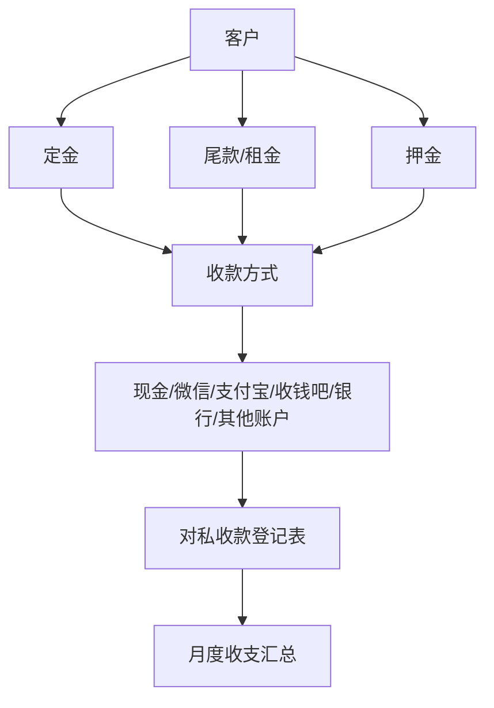
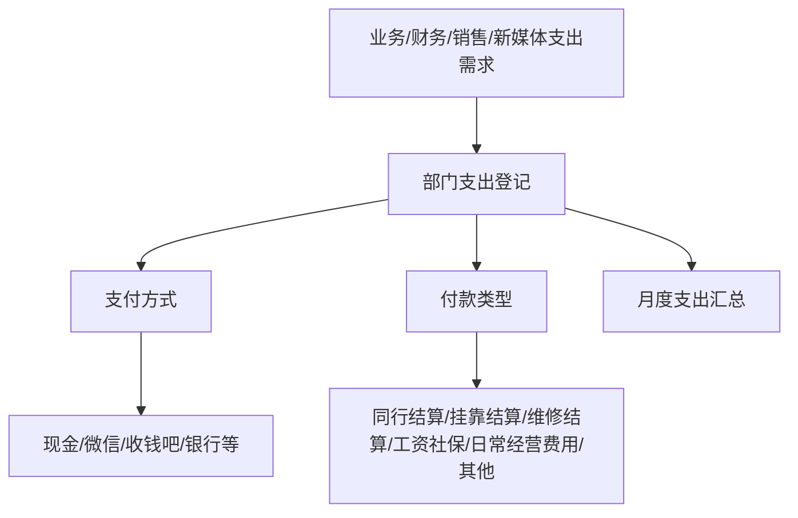
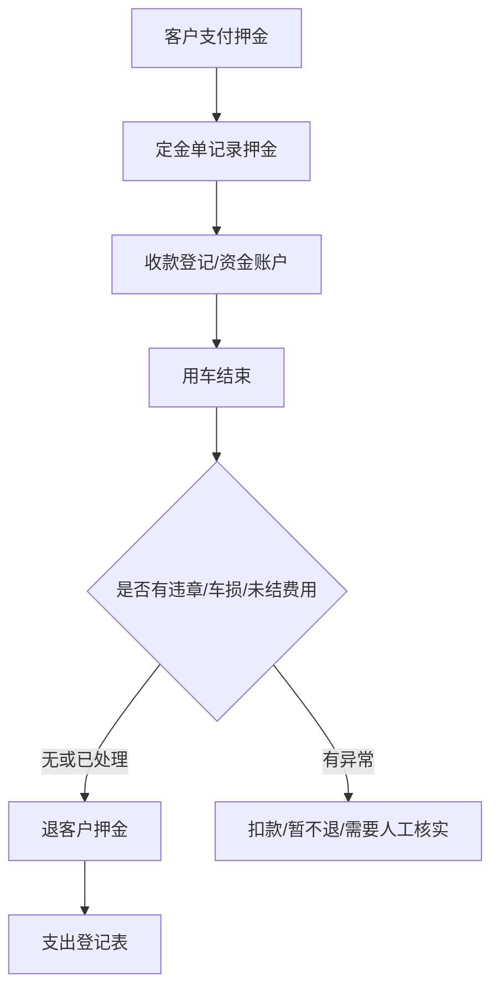

# 02_资金流向图

> 仅抽取资金流规则和已发现字段，不统计金额、不计算利润、不输出经营建议。

## 证据来源

| 来源文件 | 来源表格/位置 | 证据 | 可信度 |
|---|---|---|---|
| `C:\Users\Admin\Desktop\财务部资料\收支表\收支明细表2026年6月..xlsx` | `对私收支汇总表` | 项目、期初余额、本期收款金额、本期支出金额、余额；公式按收款方式/支付方式汇总 | 高 |
| 同上 | `对私收款登记表` | 日期、客户编号、收款方式、收款类型、金额、摘要、备注 | 高 |
| 同上 | `对私支出登记表` | 日期、客户编号、支付方式、付款类型、金额、报销摘要、备注 | 高 |
| `C:\Users\Admin\Desktop\财务部资料\芒果账务核对群批款流程\2026年6月每日收支明细\2026年6月2日收支明细.xlsx` | `总表`、`业务部`、`财务部`、`销售部`、`新媒体` | 每日微信收支登记、部门支出登记、付款类型 | 高 |
| `C:\Users\Admin\Desktop\毕飞飞\表格资料\定金单.xlsx` | `Sheet1`、`Sheet1 (2)` | 定金收款金额、押金、尾款、收款方式 | 高 |
| `C:\Users\Admin\Desktop\毕飞飞\回单\账户交易明细_*.xlsx`、`C:\Users\Admin\Documents\账户交易明细2月_*.xlsx` 等 | 银行/账户交易导出 | 原始账户交易明细候选 | 中：账户主体和覆盖范围需核实 |

## 收款流程

| 规则名称 | 触发条件 | 记录方式 | 证据来源 | 可信度 |
|---|---|---|---|---|
| 定金收款登记 | 客户交定金 | 定金单记录“定金收款金额”“收款方式”；收款登记表记录“收款类型” | `定金单.xlsx`；`收支明细表2026年6月..xlsx` / `对私收款登记表` | 高 |
| 租金/尾款收款登记 | 客户支付租金、尾款、补款 | 收款登记表用“客户编号、收款方式、收款类型、金额、摘要”记录；摘要中出现租金/回车补款 | `收支明细表2026年6月..xlsx` / `对私收款登记表` | 高 |
| 其他收款 | 进入老板银行卡、老板微信等非标准渠道 | `其他收款` 表记录日期、客户编号/空值、账户、摘要 | `收支明细表2026年6月..xlsx` / `其他收款` | 中 |

## 付款流程

| 规则名称 | 触发条件 | 记录方式 | 证据来源 | 可信度 |
|---|---|---|---|---|
| 支出登记 | 发生付款、报销、结算 | 支出登记表记录日期、客户编号或责任人、支付方式、付款类型、金额、报销摘要、备注 | `收支明细表2026年6月..xlsx` / `对私支出登记表` | 高 |
| 部门支出登记 | 部门发生支出 | 日收支文件按业务部、财务部、销售部、新媒体拆分 | `2026年6月2日收支明细.xlsx` / `业务部`、`财务部`、`销售部`、`新媒体` | 高 |
| 挂靠/同行/维修付款 | 付款类型或摘要出现挂靠结算、同行结算、维修结算 | 进入支出登记，摘要说明车辆或客户编号 | 多个日收支明细；`收支明细表2026年6月..xlsx` | 中 |

## 押金流程

| 规则名称 | 触发条件 | 记录方式 | 证据来源 | 可信度 |
|---|---|---|---|---|
| 押金收取 | 订单需押金 | 定金单记录“押金”字段；金额可能为 0 | `定金单.xlsx` | 高 |
| 违章押金退款 | 还车后退违章押金 | 支出登记表付款类型出现“退客户押金”，摘要出现“退某车违章押金” | `收支明细表2026年6月..xlsx` / `对私支出登记表` | 高 |
| 押金退款及时性 | 押金退款未及时会进入违规记录 | 违规事件出现“LS01180违章押金退款不及时” | `绩效登记表(5).xlsx` / `财务部` | 中 |

## 退款流程

| 退款类型 | 已发现记录方式 | 证据来源 | 可信度 |
|---|---|---|---|
| 退客户押金 | 支出登记表付款类型为“退客户押金”，摘要说明退车辆押金或违章押金 | `收支明细表2026年6月..xlsx` / `对私支出登记表` | 高 |
| 退费用/退回采购款 | 支出登记表摘要可出现“退回购买沙发费用”等 | 日收支明细 | 中 |
| 租金退款 | 未发现明确统一字段或规则 | 无法确认 | 无法确认 |

## 月度汇总规则

| 规则名称 | 计算逻辑 | 来源 | 可信度 |
|---|---|---|---|
| 按收付款方式汇总 | `本期收款金额 = SUMIF(收款登记表!收款方式, 项目, 金额)`；`本期支出金额 = SUMIF(支出登记表!支付方式, 项目, 金额)` | `收支明细表2026年6月..xlsx` / `对私收支汇总表` 公式 | 高 |
| 账户余额 | `余额 = 期初余额 + 本期收款金额 - 本期支出金额` | `收支明细表2026年6月..xlsx` / `对私收支汇总表` 公式 | 高 |
| 按收款/付款类型汇总 | 收款汇总和支出汇总用 `SUMIF(收款类型/付款类型, 类型, 金额)` | `收支明细表2026年6月..xlsx` / `对私收支汇总表` 公式 | 高 |

## 特殊情况

| 情况 | 已发现证据 | 处理规则 | 可信度 |
|---|---|---|---|
| 账上余额支付 | 定金单收款方式出现“账上余额” | 可作为定金/尾款来源；账上余额形成规则无法确认 | 中 |
| 老板银行卡/老板微信收款 | `其他收款` 表出现老板银行卡、老板微信 | 作为其他收款记录；是否进入统一账户余额无法确认 | 中 |
| 收钱吧预授权 | 月度汇总项目出现“收钱吧预授权” | 存在资金项目；使用条件和结算规则无法确认 | 中 |
| 同行/挂靠结算 | 支出表中出现同行结算、挂靠结算 | 作为付款类型登记；审批规则无法确认 | 中 |

## 无法确认

- 对公账户全量流水是否完整：无法确认。
- 微信、支付宝、POS、收钱吧、现金之间是否存在内部转账剔除规则：无法确认。
- 定金转尾款、押金转租金、押金抵扣车损的具体审批规则：无法确认。
- 退款是否必须经过审批、由谁审批：无法确认。
- “利润”资金归集路径：无法确认；本文不做利润分析。
