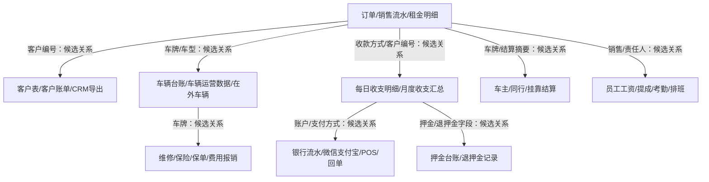

# 芒果租车财务数据资产清单

> 信息采集模式：本清单只盘点本地文件资产和数据结构，不统计利润、不统计营业额、不计算KPI、不输出经营结论。

## 盘点范围与结论

- 扫描范围：`Desktop`、`Documents`、`Downloads`、`Documents\WPSDrive`、`Documents\KingsoftData`。
- 明确排除：`C:\Users\Admin\Documents\WXWork` 和企业微信缓存。
- 输出时间：2026-06-03 23:41:25。
- 候选文件总数：759。
- 可结构化读取文件：571；需要人工核实/转换：188。
- WXWork路径命中数：0。
- 当前工作区 `C:\Users\Admin\Documents\财务数据清洗` 初始为空，本文件为本次盘点生成。

## 文件类型分布

| 类型 | 文件数 |
|---|---:|
| .xlsx | 571 |
| .pdf | 76 |
| .xls | 33 |
| .jpg | 28 |
| .docx | 20 |
| .png | 16 |
| .pptx | 7 |
| .et | 3 |
| .doc | 2 |
| .zip | 2 |
| .md | 1 |

## 主要目录分布

| 目录/来源 | 文件数 |
|---|---:|
| 财务部资料 | 400 |
| 毕飞飞 | 106 |
| 保险 | 45 |
| Downloads | 40 |
| 自有车辆11月以前数据 | 25 |
| 图片 | 23 |
| 谢欣男 | 18 |
| 收支表 | 10 |
| 赛博坦克（云A5VA45）车辆运行统计表 | 8 |
| 陈芋岑 | 6 |
| 王怡 | 5 |
| 直播部流水 | 2 |
| 云A00U54(交强保单)(1).pdf | 1 |
| 3月工资发放明细.xlsx | 1 |
| 微信图片_2026-05-18_022243_634.png | 1 |
| 挂靠车成本表.xlsx | 1 |
| E300台账.xlsx | 1 |
| 盐の车辆财务中台.xlsx | 1 |
| 奔驰G63-云A6800L-租金明细.xlsx | 1 |
| 微信图片_20260410122230_150_3769.jpg | 1 |
| 账户交易明细_20260316190656936369_1773658914998.xlsx | 1 |
| 微信图片_20260309002659_838_10.png | 1 |
| 客户账单整理(1).xlsx | 1 |
| 在外车辆.xlsx | 1 |
| 收款凭证.pptx | 1 |
| Documents\账户交易明细2月_20260306145651938445_1772780071317.xlsx | 1 |
| 账户交易明细对账单2月_A-MPBTC26030614543133004601_1772780075246.pdf | 1 |
| 统一交易回单2月_20260306145651938451_1772780077525.pdf | 1 |
| 对账单-最终.20250614005225374.xlsx | 1 |
| 对账明细表-最终.pptx | 1 |

## 数据分类

### 收入类
- 文件数：505
- 代表文件：收支明细表2026年6月..xlsx；2026年4月流水统计表.xlsx；定金单.xlsx；2026年6月2日收支明细.xlsx；2026年6月1日收支明细.xlsx；收支明细表2026年5月..xlsx；2026年5月31日收支明细.xlsx；2026年5月30日收支明细  .xlsx；客户账单整理2026.5.30.xlsx；2026年5月29日收支明细   .xlsx；2026年5月28日收支明细  .xlsx；2026年5月27日收支明细   .xlsx；2026年5月26日收支明细   .xlsx；2026年5月25日收支明细   .xlsx；2026年5月24日收支明细   .xlsx；2026年5月22日收支明细  .xlsx；2026年5月23日收支明细   .xlsx；2026年5月21日收支明细  .xlsx；2026年5月20日收支明细  .xlsx；2026年5月19日收支明细  .xlsx；……

### 成本类
- 文件数：566
- 代表文件：收支明细表2026年6月..xlsx；2026年4月流水统计表.xlsx；定金单.xlsx；2026年6月2日收支明细.xlsx；2026年6月1日收支明细.xlsx；收支明细表2026年5月..xlsx；2026年5月31日收支明细.xlsx；2026年5月30日收支明细  .xlsx；客户账单整理2026.5.30.xlsx；2026年5月29日收支明细   .xlsx；2026年5月28日收支明细  .xlsx；2026年5月27日收支明细   .xlsx；3月工资发放明细.xlsx；2026年5月26日收支明细   .xlsx；2026年5月25日收支明细   .xlsx；2026年5月24日收支明细   .xlsx；2026年5月22日收支明细  .xlsx；2026年5月23日收支明细   .xlsx；2026年5月21日收支明细  .xlsx；2026年5月20日收支明细  .xlsx；……

### 资金类
- 文件数：555
- 代表文件：收支明细表2026年6月..xlsx；2026年4月流水统计表.xlsx；定金单.xlsx；2026年6月2日收支明细.xlsx；2026年6月1日收支明细.xlsx；收支明细表2026年5月..xlsx；2026年5月31日收支明细.xlsx；2026年5月30日收支明细  .xlsx；2026年5月29日收支明细   .xlsx；2026年5月28日收支明细  .xlsx；2026年5月27日收支明细   .xlsx；2026年5月26日收支明细   .xlsx；2026年5月25日收支明细   .xlsx；2026年5月24日收支明细   .xlsx；2026年5月22日收支明细  .xlsx；2026年5月23日收支明细   .xlsx；2026年5月21日收支明细  .xlsx；2026年5月20日收支明细  .xlsx；2026年5月19日收支明细  .xlsx；2026年5月18日收支明细  .xlsx；……

### 押金类
- 文件数：421
- 代表文件：收支明细表2026年6月..xlsx；2026年4月流水统计表.xlsx；定金单.xlsx；2026年6月2日收支明细.xlsx；2026年6月1日收支明细.xlsx；2026年5月31日收支明细.xlsx；2026年5月30日收支明细  .xlsx；客户账单整理2026.5.30.xlsx；2026年5月29日收支明细   .xlsx；2026年5月28日收支明细  .xlsx；2026年5月27日收支明细   .xlsx；2026年5月26日收支明细   .xlsx；2026年5月25日收支明细   .xlsx；2026年5月24日收支明细   .xlsx；2026年5月22日收支明细  .xlsx；2026年5月23日收支明细   .xlsx；2026年5月21日收支明细  .xlsx；2026年5月20日收支明细  .xlsx；2026年5月19日收支明细  .xlsx；2026年5月18日收支明细  .xlsx；……

### 车辆类
- 文件数：442
- 代表文件：2026年4月流水统计表.xlsx；定金单.xlsx；2026年6月2日收支明细.xlsx；2026年5月31日收支明细.xlsx；2026年5月30日收支明细  .xlsx；2026年5月28日收支明细  .xlsx；2026年5月27日收支明细   .xlsx；云A00U54(交强保单)(1).pdf；2026年5月26日收支明细   .xlsx；2026年5月25日收支明细   .xlsx；2026年5月24日收支明细   .xlsx；2026年5月22日收支明细  .xlsx；2026年5月23日收支明细   .xlsx；2026年5月21日收支明细  .xlsx；2026年5月19日收支明细  .xlsx；财务保险柜身份证借用管理表.xlsx；2026年5月18日收支明细  .xlsx；2026年5月17日收支明细 .xlsx；2026年5月16日收支明细  .xlsx；2026年5月15日收支明细  .xlsx；……

### 客户类
- 文件数：539
- 代表文件：收支明细表2026年6月..xlsx；2026年4月流水统计表.xlsx；定金单.xlsx；2026年6月2日收支明细.xlsx；2026年6月1日收支明细.xlsx；收支明细表2026年5月..xlsx；2026年5月31日收支明细.xlsx；2026年5月30日收支明细  .xlsx；客户账单整理2026.5.30.xlsx；2026年5月29日收支明细   .xlsx；2026年5月28日收支明细  .xlsx；2026年5月27日收支明细   .xlsx；2026年5月26日收支明细   .xlsx；2026年5月25日收支明细   .xlsx；2026年5月24日收支明细   .xlsx；2026年5月22日收支明细  .xlsx；2026年5月23日收支明细   .xlsx；2026年5月21日收支明细  .xlsx；2026年5月20日收支明细  .xlsx；2026年5月19日收支明细  .xlsx；……

### 员工类
- 文件数：111
- 代表文件：收支明细表2026年5月..xlsx；3月工资发放明细.xlsx；2026年5月20日收支明细  .xlsx；3月工资发放明细.xlsx；2026年5月18日收支明细  .xlsx；2026年5月13日收支明细   .xlsx；2026年5月3日收支明细   .xlsx；2026年5月1日收支明细       .xlsx；2026年4月19日收支明细     .xlsx；2026年4月17日收支明细       .xlsx；2026年4月16日收支明细       .xlsx；2026年4月15日收支明细      .xlsx；2026年4月2日收支明细      .xlsx；2026年3月29日收支明细     .xlsx；2026年3月18日收支明细   .xlsx；2026年3月17日收支明细   .xlsx；2026年3月16日收支明细  .xlsx；2026年2月23日收支明细  .xlsx；2026年2月16日收支明细 .xlsx；2026年2月15日收支明细 .xlsx；……

### 其他类
- 文件数：31
- 代表文件：dzfp_26532000000789176866_云南盛安混凝土有限公司_20260518161805.pdf；dzfp_26532000000530615986_四川明欣药业有限责任公司_20260406144153.pdf；GPT 智能助手知识指令文档 – 芒果租车.docx；租车毛利表（导出） (15).xls；交易查询，昆明芒果汽车服务有限公司，871916911210000，人民币，20241104-20251104，共7笔，20251104205259.xlsx；财务试岗考核.docx；印章使用登记表1.xlsx；昆明芒果汽车服务有限公司基本存款账户信息.pdf；芒果租车4至7月安装清单(1).xlsGPS核对.xls；财务部KPI红黄牌机制.docx；财务支出签字流程.docx；租车毛利表（导出） (14).xls；租车毛利表（导出） (13).xls；租车毛利表（导出） (12).xls；租车毛利表（导出） (11).xls；租车毛利表（导出） (10).xls；租车毛利表（导出） (9).xls；租车毛利表（导出） (8).xls；租车毛利表（导出） (7).xls；租车毛利表（导出） (6).xls；……

## 数据关联关系图

### 关联字段命中情况

| 关联字段 | 命中文件数 | 代表文件 |
|---|---:|---|
| 客户编号 | 501 | 收支明细表2026年6月..xlsx；2026年4月流水统计表.xlsx；定金单.xlsx；2026年6月2日收支明细.xlsx；2026年6月1日收支明细.xlsx；收支明细表2026年5月..xlsx；2026年5月31日收支明细.xlsx；2026年5月30日收支明细  .xlsx；…… |
| 车牌/车型 | 317 | 2026年4月流水统计表.xlsx；定金单.xlsx；2026年5月31日收支明细.xlsx；2026年5月30日收支明细  .xlsx；客户账单整理2026.5.30.xlsx；2026年5月28日收支明细  .xlsx；2026年5月26日收支明细   .xlsx；2026年5月25日收支明细   .xlsx；…… |
| 收付款方式 | 410 | 收支明细表2026年6月..xlsx；定金单.xlsx；2026年6月2日收支明细.xlsx；2026年6月1日收支明细.xlsx；收支明细表2026年5月..xlsx；2026年5月31日收支明细.xlsx；2026年5月30日收支明细  .xlsx；2026年5月29日收支明细   .xlsx；…… |
| 员工/销售 | 441 | 2026年4月流水统计表.xlsx；定金单.xlsx；2026年6月2日收支明细.xlsx；2026年6月1日收支明细.xlsx；2026年5月31日收支明细.xlsx；2026年5月30日收支明细  .xlsx；2026年5月29日收支明细   .xlsx；2026年5月28日收支明细  .xlsx；…… |
| 押金状态 | 419 | 收支明细表2026年6月..xlsx；2026年4月流水统计表.xlsx；定金单.xlsx；2026年6月2日收支明细.xlsx；2026年6月1日收支明细.xlsx；2026年5月31日收支明细.xlsx；2026年5月30日收支明细  .xlsx；客户账单整理2026.5.30.xlsx；…… |

## 缺失项与无法确认事项

- 完整订单主表：无法确认是否存在覆盖全部历史订单的唯一订单表；已发现销售流水、客户账单、租金明细、收支表，但是否完整需要人工核实。
- 客户主数据：已发现客户/客户账单类文件，但客户编号、姓名、联系方式、来源渠道是否统一，无法确认。
- 车辆主数据：已发现车辆台账、在外车辆、车辆运营/租金明细，但自有车、挂靠车、同行车边界是否完整，无法确认。
- 原始资金流水：已发现部分账户交易明细、回单、收支登记表；是否覆盖全部银行、微信、支付宝、POS、收钱吧、对公账户，无法确认。
- 押金闭环：已发现押金/退客户押金字段和押金车台账候选，但车辆押金、违章押金、已退/未退状态是否可逐单对应，无法确认。
- 车主/同行结算：日收支明细中出现挂靠结算、同行结算，是否存在完整车主结算主表，无法确认。
- 员工工资/提成：已发现工资、薪资、提成、考勤/排班候选文件，但是否能与具体订单/业绩一一对应，无法确认。
- 维护人和版本规则：除路径可见的目录名外，谁负责维护、哪个文件为最终版本，无法确认，需要人工核实。

## 可能重复统计/重复文件风险

- 日收支明细与月度收支汇总并存：同一收支可能同时存在于每日文件和月度汇总文件，不能直接相加，需要先确定主数据口径。
- 销售流水、客户账单、租金明细、收支登记表之间可能记录同一笔订单/收款，需用客户编号、车牌、日期、金额、摘要人工核验。
- 桌面与下载中存在同名同大小发票/回单/PDF副本，不能视为多笔凭证。
- 表名含“最终”“副本”“(1)”或日期版本的文件较多，最终版本无法确认。

| 重复组 | 数量 | 路径 |
|---|---:|---|
| 9月流水表.xlsx / 89394字节 | 2 | C:\Users\Admin\Desktop\毕飞飞\流水\9月流水表.xlsx C:\Users\Admin\Desktop\毕飞飞\表格资料\9月流水表.xlsx |
| 8月流水表1(最新).xlsx / 130130字节 | 2 | C:\Users\Admin\Desktop\毕飞飞\流水\8月流水表1(最新).xlsx C:\Users\Admin\Desktop\毕飞飞\表格资料\8月流水表1(最新).xlsx |
| 8月流水表最新.xlsx / 126964字节 | 2 | C:\Users\Admin\Desktop\毕飞飞\流水\8月流水表最新.xlsx C:\Users\Admin\Desktop\毕飞飞\表格资料\8月流水表最新.xlsx |
| 2025.8.3收支表.xlsx / 16591字节 | 2 | C:\Users\Admin\Desktop\2025.8.3收支表.xlsx C:\Users\Admin\Desktop\财务部资料\芒果账务核对群批款流程\2025.8月每日收支明细\2025.8.3收支表.xlsx |
| 2025.7.29日收支明细.xlsx / 330831字节 | 2 | C:\Users\Admin\Desktop\2025.7.29日收支明细.xlsx C:\Users\Admin\Desktop\财务部资料\芒果账务核对群批款流程\2025.7月每日收支明细\2025.7.29日收支明细.xlsx |
| 收支明细表7月.xlsx / 21235784字节 | 2 | C:\Users\Admin\Desktop\王怡\王怡\收支明细表7月.xlsx C:\Users\Admin\Desktop\谢欣男\王怡\收支明细表7月.xlsx |
| 收支明细表6月.xlsx / 4835324字节 | 2 | C:\Users\Admin\Desktop\王怡\王怡\收支明细表6月.xlsx C:\Users\Admin\Desktop\谢欣男\王怡\收支明细表6月.xlsx |
| 收支明细账（3月11至4月21）.xlsx / 380976字节 | 2 | C:\Users\Admin\Desktop\王怡\王怡\收支明细账（3月11至4月21）.xlsx C:\Users\Admin\Desktop\谢欣男\王怡\收支明细账（3月11至4月21）.xlsx |
| 5月收支表.xlsx / 147635字节 | 2 | C:\Users\Admin\Desktop\王怡\王怡\5月收支表.xlsx C:\Users\Admin\Desktop\谢欣男\王怡\5月收支表.xlsx |
| 财务收支明细表（4月21至5月13）.xlsx / 53113字节 | 2 | C:\Users\Admin\Desktop\王怡\王怡\财务收支明细表（4月21至5月13）.xlsx C:\Users\Admin\Desktop\谢欣男\王怡\财务收支明细表（4月21至5月13）.xlsx |

## 文件盘点

| 文件名 | 路径 | 最后修改时间 | 类型 | 数据量 | 涉及内容 | 可信度 | 备注 |
|---|---|---|---|---|---|---|---|
| 收支明细表2026年6月..xlsx | C:\Users\Admin\Desktop\财务部资料\收支表\收支明细表2026年6月..xlsx | 2026-06-03 23:36:36 | .xlsx | 对私收支汇总表：100行 x 26列；对私收款登记表：435行 x 13列；对私支出登记表：478行 x 10列；其他收款：32行 x 4列；WpsReserved_CellImgList：1行 x 1列 | 收支/资金流水；订单/租金/业绩；定金/尾款/押金；客户/客户编号/账单；费用/报销/结算；工作表：对私收支汇总表、对私收款登记表、对私支出登记表、其他收款、WpsReserved_CellImgList | 中等：人工维护或业务整理表，需要与原始凭证/流水交叉核验 | 疑似维护人/来源：财务部资料，需要人工核实 |
| 2026年4月流水统计表.xlsx | C:\Users\Admin\Desktop\毕飞飞\流水\2026年4月流水统计表.xlsx | 2026-06-03 21:23:28 | .xlsx | 苏鑫：1048528行 x 16384列；余晓果：104行 x 16列；资程竣：15行 x 16列；李家宝：209行 x 34列；卡谷卡：26行 x 16列；另有3个工作表未展开 | 收支/资金流水；订单/租金/业绩；定金/尾款/押金；车辆/车牌/运营；客户/客户编号/账单；员工/工资/提成/考勤；费用/报销/结算；工作表：苏鑫、余晓果、资程竣、李家宝、卡谷卡 | 中等：人工维护或业务整理表，需要与原始凭证/流水交叉核验 | 疑似维护人/来源：毕飞飞，需要人工核实 |
| 定金单.xlsx | C:\Users\Admin\Desktop\毕飞飞\表格资料\定金单.xlsx | 2026-06-03 02:11:18 | .xlsx | Sheet1：25行 x 12列；Sheet1 (2)：25行 x 12列；Sheet2：1行 x 1列 | 收支/资金流水；定金/尾款/押金；车辆/车牌/运营；客户/客户编号/账单；员工/工资/提成/考勤；费用/报销/结算；工作表：Sheet1、Sheet1 (2)、Sheet2 | 中等：人工维护或业务整理表，需要与原始凭证/流水交叉核验 | 疑似维护人/来源：毕飞飞，需要人工核实 |
| 2026年6月2日收支明细.xlsx | C:\Users\Admin\Desktop\财务部资料\芒果账务核对群批款流程\2026年6月每日收支明细\2026年6月2日收支明细.xlsx | 2026-06-03 00:16:09 | .xlsx | 总表：58行 x 13列；业务部：15行 x 7列；财务部：25行 x 7列；销售部：7行 x 7列；新媒体：7行 x 7列；另有3个工作表未展开 | 收支/资金流水；定金/尾款/押金；车辆/车牌/运营；客户/客户编号/账单；费用/报销/结算；工作表：总表、业务部、财务部、销售部、新媒体 | 中等：人工维护或业务整理表，需要与原始凭证/流水交叉核验 | 疑似维护人/来源：财务部资料，需要人工核实 |
| 2026年6月1日收支明细.xlsx | C:\Users\Admin\Desktop\财务部资料\芒果账务核对群批款流程\2026年6月每日收支明细\2026年6月1日收支明细.xlsx | 2026-06-02 01:44:06 | .xlsx | 总表：49行 x 13列；业务部：23行 x 7列；财务部：15行 x 7列；销售部：7行 x 7列；新媒体：7行 x 7列；另有3个工作表未展开 | 收支/资金流水；订单/租金/业绩；定金/尾款/押金；客户/客户编号/账单；费用/报销/结算；工作表：总表、业务部、财务部、销售部、新媒体 | 中等：人工维护或业务整理表，需要与原始凭证/流水交叉核验 | 疑似维护人/来源：财务部资料，需要人工核实 |
| 收支明细表2026年5月..xlsx | C:\Users\Admin\Desktop\财务部资料\收支表\收支明细表2026年5月..xlsx | 2026-06-01 15:26:52 | .xlsx | 对私收支汇总表：100行 x 26列；对私收款登记表：434行 x 13列；对私支出登记表：478行 x 10列；其他收款：32行 x 4列；WpsReserved_CellImgList：1行 x 1列 | 收支/资金流水；定金/尾款/押金；客户/客户编号/账单；员工/工资/提成/考勤；费用/报销/结算；工作表：对私收支汇总表、对私收款登记表、对私支出登记表、其他收款、WpsReserved_CellImgList | 中等：人工维护或业务整理表，需要与原始凭证/流水交叉核验 | 疑似维护人/来源：财务部资料，需要人工核实 |
| 2026年5月31日收支明细.xlsx | C:\Users\Admin\Desktop\财务部资料\芒果账务核对群批款流程\2026年5月每日收支明细\2026年5月31日收支明细.xlsx | 2026-06-01 02:18:44 | .xlsx | 总表：51行 x 13列；业务部：23行 x 7列；财务部：15行 x 7列；销售部：4行 x 7列；新媒体：7行 x 7列；另有3个工作表未展开 | 收支/资金流水；定金/尾款/押金；车辆/车牌/运营；客户/客户编号/账单；费用/报销/结算；工作表：总表、业务部、财务部、销售部、新媒体 | 中等：人工维护或业务整理表，需要与原始凭证/流水交叉核验 | 疑似维护人/来源：财务部资料，需要人工核实 |
| 2026年5月30日收支明细  .xlsx | C:\Users\Admin\Desktop\财务部资料\芒果账务核对群批款流程\2026年5月每日收支明细\2026年5月30日收支明细  .xlsx | 2026-05-31 00:53:21 | .xlsx | 总表：53行 x 13列；业务部：23行 x 7列；财务部：15行 x 7列；销售部：4行 x 7列；新媒体：7行 x 7列；另有3个工作表未展开 | 收支/资金流水；定金/尾款/押金；车辆/车牌/运营；客户/客户编号/账单；费用/报销/结算；工作表：总表、业务部、财务部、销售部、新媒体 | 中等：人工维护或业务整理表，需要与原始凭证/流水交叉核验 | 疑似维护人/来源：财务部资料，需要人工核实 |
| 客户账单整理2026.5.30.xlsx | C:\Users\Admin\Desktop\毕飞飞\客户账单复盘\客户账单整理2026.5.30.xlsx | 2026-05-30 17:55:34 | .xlsx | 汇总表：1697行 x 11列；LS00663：38行 x 13列；LS00605：36行 x 12列；LS00854：16行 x 13列；LN00135：19行 x 13列；另有3个工作表未展开 | 订单/租金/业绩；定金/尾款/押金；车辆/车牌/运营；客户/客户编号/账单；费用/报销/结算；工作表：汇总表、LS00663、LS00605、LS00854、LN00135 | 中等：人工维护或业务整理表，需要与原始凭证/流水交叉核验 | 疑似维护人/来源：毕飞飞，需要人工核实 |
| 2026年5月29日收支明细   .xlsx | C:\Users\Admin\Desktop\财务部资料\芒果账务核对群批款流程\2026年5月每日收支明细\2026年5月29日收支明细   .xlsx | 2026-05-30 02:32:37 | .xlsx | 总表：54行 x 13列；业务部：23行 x 7列；财务部：15行 x 7列；销售部：4行 x 7列；新媒体：7行 x 7列；另有3个工作表未展开 | 收支/资金流水；定金/尾款/押金；客户/客户编号/账单；员工/工资/提成/考勤；费用/报销/结算；工作表：总表、业务部、财务部、销售部、新媒体 | 中等：人工维护或业务整理表，需要与原始凭证/流水交叉核验 | 疑似维护人/来源：财务部资料，需要人工核实 |
| 2026年5月28日收支明细  .xlsx | C:\Users\Admin\Desktop\财务部资料\芒果账务核对群批款流程\2026年5月每日收支明细\2026年5月28日收支明细  .xlsx | 2026-05-29 01:12:35 | .xlsx | 总表：45行 x 13列；业务部：23行 x 7列；财务部：15行 x 7列；销售部：4行 x 7列；新媒体：7行 x 7列；另有3个工作表未展开 | 收支/资金流水；定金/尾款/押金；车辆/车牌/运营；客户/客户编号/账单；费用/报销/结算；工作表：总表、业务部、财务部、销售部、新媒体 | 中等：人工维护或业务整理表，需要与原始凭证/流水交叉核验 | 疑似维护人/来源：财务部资料，需要人工核实 |
| 2026年5月27日收支明细   .xlsx | C:\Users\Admin\Desktop\财务部资料\芒果账务核对群批款流程\2026年5月每日收支明细\2026年5月27日收支明细   .xlsx | 2026-05-28 00:59:19 | .xlsx | 总表：45行 x 13列；业务部：23行 x 7列；财务部：15行 x 7列；销售部：4行 x 7列；新媒体：8行 x 7列；另有3个工作表未展开 | 收支/资金流水；定金/尾款/押金；车辆/车牌/运营；客户/客户编号/账单；费用/报销/结算；工作表：总表、业务部、财务部、销售部、新媒体 | 中等：人工维护或业务整理表，需要与原始凭证/流水交叉核验 | 疑似维护人/来源：财务部资料，需要人工核实 |
| 云A00U54(交强保单)(1).pdf | C:\Users\Admin\Desktop\云A00U54(交强保单)(1).pdf | 2026-05-27 14:50:33 | .pdf | 未结构化读取；文件大小 309700 字节 | 车辆/车牌/运营 | 无法确认：文件未结构化读取，需要人工核实/转换 | 非结构化或凭证类文件，未做OCR/正文解析；本机用户Admin目录来源，维护人无法确认，需要人工核实 |
| 3月工资发放明细.xlsx | C:\Users\Admin\Desktop\毕飞飞\表格资料\3月工资发放明细.xlsx | 2026-05-27 14:32:41 | .xlsx | 3月：31行 x 4列；4月：29行 x 17列 | 收支/资金流水；员工/工资/提成/考勤；工作表：3月、4月 | 中等：人工维护或业务整理表，需要与原始凭证/流水交叉核验 | 疑似维护人/来源：毕飞飞，需要人工核实 |
| 2026年5月26日收支明细   .xlsx | C:\Users\Admin\Desktop\财务部资料\芒果账务核对群批款流程\2026年5月每日收支明细\2026年5月26日收支明细   .xlsx | 2026-05-27 01:25:42 | .xlsx | 总表：48行 x 13列；业务部：23行 x 7列；财务部：15行 x 7列；销售部：4行 x 7列；新媒体：8行 x 7列；另有3个工作表未展开 | 收支/资金流水；定金/尾款/押金；车辆/车牌/运营；客户/客户编号/账单；费用/报销/结算；工作表：总表、业务部、财务部、销售部、新媒体 | 中等：人工维护或业务整理表，需要与原始凭证/流水交叉核验 | 疑似维护人/来源：财务部资料，需要人工核实 |
| 2026年5月25日收支明细   .xlsx | C:\Users\Admin\Desktop\财务部资料\芒果账务核对群批款流程\2026年5月每日收支明细\2026年5月25日收支明细   .xlsx | 2026-05-26 00:40:24 | .xlsx | 总表：57行 x 13列；业务部：23行 x 7列；财务部：16行 x 7列；销售部：4行 x 7列；新媒体：8行 x 7列；另有3个工作表未展开 | 收支/资金流水；定金/尾款/押金；车辆/车牌/运营；客户/客户编号/账单；费用/报销/结算；工作表：总表、业务部、财务部、销售部、新媒体 | 中等：人工维护或业务整理表，需要与原始凭证/流水交叉核验 | 疑似维护人/来源：财务部资料，需要人工核实 |
| 2026年5月24日收支明细   .xlsx | C:\Users\Admin\Desktop\财务部资料\芒果账务核对群批款流程\2026年5月每日收支明细\2026年5月24日收支明细   .xlsx | 2026-05-25 00:28:17 | .xlsx | 总表：59行 x 13列；业务部：23行 x 7列；财务部：16行 x 7列；销售部：4行 x 7列；新媒体：5行 x 7列；另有3个工作表未展开 | 收支/资金流水；定金/尾款/押金；车辆/车牌/运营；客户/客户编号/账单；费用/报销/结算；工作表：总表、业务部、财务部、销售部、新媒体 | 中等：人工维护或业务整理表，需要与原始凭证/流水交叉核验 | 疑似维护人/来源：财务部资料，需要人工核实 |
| 2026年5月22日收支明细  .xlsx | C:\Users\Admin\Desktop\财务部资料\芒果账务核对群批款流程\2026年5月每日收支明细\2026年5月22日收支明细  .xlsx | 2026-05-24 16:45:14 | .xlsx | 总表：61行 x 13列；业务部：13行 x 7列；财务部：16行 x 7列；销售部：6行 x 7列；新媒体：6行 x 7列；另有3个工作表未展开 | 收支/资金流水；定金/尾款/押金；车辆/车牌/运营；客户/客户编号/账单；费用/报销/结算；工作表：总表、业务部、财务部、销售部、新媒体 | 中等：人工维护或业务整理表，需要与原始凭证/流水交叉核验 | 疑似维护人/来源：财务部资料，需要人工核实 |
| 2026年5月23日收支明细   .xlsx | C:\Users\Admin\Desktop\财务部资料\芒果账务核对群批款流程\2026年5月每日收支明细\2026年5月23日收支明细   .xlsx | 2026-05-24 02:56:49 | .xlsx | 总表：60行 x 13列；业务部：13行 x 7列；财务部：16行 x 7列；销售部：4行 x 7列；新媒体：5行 x 7列；另有3个工作表未展开 | 收支/资金流水；定金/尾款/押金；车辆/车牌/运营；客户/客户编号/账单；费用/报销/结算；工作表：总表、业务部、财务部、销售部、新媒体 | 中等：人工维护或业务整理表，需要与原始凭证/流水交叉核验 | 疑似维护人/来源：财务部资料，需要人工核实 |
| 2026年5月21日收支明细  .xlsx | C:\Users\Admin\Desktop\财务部资料\芒果账务核对群批款流程\2026年5月每日收支明细\2026年5月21日收支明细  .xlsx | 2026-05-22 01:27:21 | .xlsx | 总表：42行 x 13列；业务部：13行 x 7列；财务部：16行 x 7列；销售部：6行 x 7列；新媒体：6行 x 7列；另有3个工作表未展开 | 收支/资金流水；定金/尾款/押金；车辆/车牌/运营；客户/客户编号/账单；费用/报销/结算；工作表：总表、业务部、财务部、销售部、新媒体 | 中等：人工维护或业务整理表，需要与原始凭证/流水交叉核验 | 疑似维护人/来源：财务部资料，需要人工核实 |
| 2026年5月20日收支明细  .xlsx | C:\Users\Admin\Desktop\财务部资料\芒果账务核对群批款流程\2026年5月每日收支明细\2026年5月20日收支明细  .xlsx | 2026-05-21 01:19:01 | .xlsx | 总表：50行 x 13列；业务部：14行 x 7列；财务部：16行 x 7列；销售部：6行 x 7列；新媒体：6行 x 7列；另有3个工作表未展开 | 收支/资金流水；定金/尾款/押金；客户/客户编号/账单；员工/工资/提成/考勤；费用/报销/结算；工作表：总表、业务部、财务部、销售部、新媒体 | 中等：人工维护或业务整理表，需要与原始凭证/流水交叉核验 | 疑似维护人/来源：财务部资料，需要人工核实 |
| 2026年5月19日收支明细  .xlsx | C:\Users\Admin\Desktop\财务部资料\芒果账务核对群批款流程\2026年5月每日收支明细\2026年5月19日收支明细  .xlsx | 2026-05-20 00:52:31 | .xlsx | 总表：57行 x 13列；业务部：17行 x 7列；财务部：16行 x 7列；销售部：7行 x 7列；新媒体：6行 x 7列；另有3个工作表未展开 | 收支/资金流水；定金/尾款/押金；车辆/车牌/运营；客户/客户编号/账单；费用/报销/结算；工作表：总表、业务部、财务部、销售部、新媒体 | 中等：人工维护或业务整理表，需要与原始凭证/流水交叉核验 | 疑似维护人/来源：财务部资料，需要人工核实 |
| 3月工资发放明细.xlsx | C:\Users\Admin\Desktop\3月工资发放明细.xlsx | 2026-05-19 19:06:36 | .xlsx | 3月：31行 x 4列；4月：29行 x 17列 | 收支/资金流水；员工/工资/提成/考勤；工作表：3月、4月 | 中等：人工维护或业务整理表，需要与原始凭证/流水交叉核验 | 本机用户Admin目录来源，维护人无法确认，需要人工核实 |
| 财务保险柜身份证借用管理表.xlsx | C:\Users\Admin\Desktop\毕飞飞\财务保险柜身份证借用管理表.xlsx | 2026-05-19 16:32:40 | .xlsx | Sheet1：35行 x 6列 | 费用/报销/结算；工作表：Sheet1 | 无法确认：需人工核实来源和维护规则 | 疑似维护人/来源：毕飞飞，需要人工核实 |
| 2026年5月18日收支明细  .xlsx | C:\Users\Admin\Desktop\财务部资料\芒果账务核对群批款流程\2026年5月每日收支明细\2026年5月18日收支明细  .xlsx | 2026-05-19 02:02:29 | .xlsx | 总表：56行 x 13列；业务部：7行 x 7列；财务部：16行 x 7列；销售部：7行 x 7列；新媒体：6行 x 7列；另有3个工作表未展开 | 收支/资金流水；定金/尾款/押金；车辆/车牌/运营；客户/客户编号/账单；员工/工资/提成/考勤；费用/报销/结算；工作表：总表、业务部、财务部、销售部、新媒体 | 中等：人工维护或业务整理表，需要与原始凭证/流水交叉核验 | 疑似维护人/来源：财务部资料，需要人工核实 |
| 账户交易明细_20260518162690599574_1779092952312.xlsx | C:\Users\Admin\Desktop\毕飞飞\回单\账户交易明细_20260518162690599574_1779092952312.xlsx | 2026-05-18 16:30:10 | .xlsx | 回单交易明细：9行 x 8列 | 收支/资金流水；客户/客户编号/账单；费用/报销/结算；工作表：回单交易明细 | 较高：疑似银行/账户交易原始导出或回单，但仍需与账户主体核验 | 疑似维护人/来源：毕飞飞，需要人工核实 |
| 账户交易明细对账单_A-MPBTC26051816291333041351_1779092957114.pdf | C:\Users\Admin\Desktop\毕飞飞\流水\账户交易明细对账单_A-MPBTC26051816291333041351_1779092957114.pdf | 2026-05-18 16:29:49 | .pdf | 未结构化读取；文件大小 187269 字节 | 收支/资金流水；客户/客户编号/账单 | 无法确认：文件未结构化读取，需要人工核实/转换 | 非结构化或凭证类文件，未做OCR/正文解析；疑似维护人/来源：毕飞飞，需要人工核实 |
| 统一交易回单_20260518162690679303_1779092961515.pdf | C:\Users\Admin\Desktop\毕飞飞\流水\统一交易回单_20260518162690679303_1779092961515.pdf | 2026-05-18 16:29:39 | .pdf | 未结构化读取；文件大小 1328383 字节 | 收支/资金流水 | 无法确认：文件未结构化读取，需要人工核实/转换 | 非结构化或凭证类文件，未做OCR/正文解析；疑似维护人/来源：毕飞飞，需要人工核实 |
| dzfp_26532000000789176866_云南盛安混凝土有限公司_20260518161805.pdf | C:\Users\Admin\Desktop\毕飞飞\发票\dzfp_26532000000789176866_云南盛安混凝土有限公司_20260518161805.pdf | 2026-05-18 16:18:00 | .pdf | 未结构化读取；文件大小 145941 字节 | 无法确认，需要人工核实 | 无法确认：文件未结构化读取，需要人工核实/转换 | 非结构化或凭证类文件，未做OCR/正文解析；疑似维护人/来源：毕飞飞，需要人工核实 |
| 2026年5月17日收支明细 .xlsx | C:\Users\Admin\Desktop\财务部资料\芒果账务核对群批款流程\2026年5月每日收支明细\2026年5月17日收支明细 .xlsx | 2026-05-18 02:54:26 | .xlsx | 总表：44行 x 13列；业务部：7行 x 7列；财务部：16行 x 7列；销售部：7行 x 7列；新媒体：6行 x 7列；另有3个工作表未展开 | 收支/资金流水；定金/尾款/押金；车辆/车牌/运营；客户/客户编号/账单；费用/报销/结算；工作表：总表、业务部、财务部、销售部、新媒体 | 中等：人工维护或业务整理表，需要与原始凭证/流水交叉核验 | 疑似维护人/来源：财务部资料，需要人工核实 |
| 微信图片_2026-05-18_022243_634.png | C:\Users\Admin\Desktop\微信图片_2026-05-18_022243_634.png | 2026-05-18 02:22:46 | .png | 未结构化读取；文件大小 95969 字节 | 无法确认，需要人工核实 | 无法确认：文件未结构化读取，需要人工核实/转换 | 非结构化或凭证类文件，未做OCR/正文解析；本机用户Admin目录来源，维护人无法确认，需要人工核实 |
| 2026年5月16日收支明细  .xlsx | C:\Users\Admin\Desktop\财务部资料\芒果账务核对群批款流程\2026年5月每日收支明细\2026年5月16日收支明细  .xlsx | 2026-05-17 20:44:12 | .xlsx | 总表：47行 x 13列；业务部：7行 x 7列；财务部：16行 x 7列；销售部：7行 x 7列；新媒体：6行 x 7列；另有3个工作表未展开 | 收支/资金流水；定金/尾款/押金；车辆/车牌/运营；客户/客户编号/账单；费用/报销/结算；工作表：总表、业务部、财务部、销售部、新媒体 | 中等：人工维护或业务整理表，需要与原始凭证/流水交叉核验 | 疑似维护人/来源：财务部资料，需要人工核实 |
| 2026年5月15日收支明细  .xlsx | C:\Users\Admin\Desktop\财务部资料\芒果账务核对群批款流程\2026年5月每日收支明细\2026年5月15日收支明细  .xlsx | 2026-05-16 04:19:06 | .xlsx | 总表：54行 x 13列；业务部：9行 x 7列；财务部：16行 x 7列；销售部：7行 x 7列；新媒体：6行 x 7列；另有3个工作表未展开 | 收支/资金流水；定金/尾款/押金；客户/客户编号/账单；费用/报销/结算；工作表：总表、业务部、财务部、销售部、新媒体 | 中等：人工维护或业务整理表，需要与原始凭证/流水交叉核验 | 疑似维护人/来源：财务部资料，需要人工核实 |
| 挂靠车成本表.xlsx | C:\Users\Admin\Desktop\挂靠车成本表.xlsx | 2026-05-16 00:51:50 | .xlsx | Sheet1：307行 x 25列 | 收支/资金流水；订单/租金/业绩；车辆/车牌/运营；客户/客户编号/账单；费用/报销/结算；工作表：Sheet1 | 无法确认：需人工核实来源和维护规则 | 本机用户Admin目录来源，维护人无法确认，需要人工核实 |
| 2026年3月流水统计表.xlsx | C:\Users\Admin\Desktop\毕飞飞\流水\2026年3月流水统计表.xlsx | 2026-05-16 00:49:01 | .xlsx | 苏鑫：1048528行 x 16384列；余晓果：140行 x 17列；资程竣：53行 x 16列；李家宝：16行 x 15列；卡谷卡：29行 x 14列；另有3个工作表未展开 | 收支/资金流水；订单/租金/业绩；车辆/车牌/运营；客户/客户编号/账单；员工/工资/提成/考勤；费用/报销/结算；工作表：苏鑫、余晓果、资程竣、李家宝、卡谷卡 | 中等：人工维护或业务整理表，需要与原始凭证/流水交叉核验 | 疑似维护人/来源：毕飞飞，需要人工核实 |
| 2026年5月14日收支明细  .xlsx | C:\Users\Admin\Desktop\财务部资料\芒果账务核对群批款流程\2026年5月每日收支明细\2026年5月14日收支明细  .xlsx | 2026-05-15 03:36:03 | .xlsx | 总表：56行 x 13列；业务部：9行 x 7列；财务部：20行 x 7列；销售部：8行 x 7列；新媒体：6行 x 7列；另有3个工作表未展开 | 收支/资金流水；定金/尾款/押金；客户/客户编号/账单；员工/工资/提成/考勤；费用/报销/结算；工作表：总表、业务部、财务部、销售部、新媒体 | 中等：人工维护或业务整理表，需要与原始凭证/流水交叉核验 | 疑似维护人/来源：财务部资料，需要人工核实 |
| 2026年5月13日收支明细   .xlsx | C:\Users\Admin\Desktop\财务部资料\芒果账务核对群批款流程\2026年5月每日收支明细\2026年5月13日收支明细   .xlsx | 2026-05-14 15:05:37 | .xlsx | 总表：52行 x 13列；业务部：9行 x 7列；财务部：20行 x 7列；销售部：8行 x 7列；新媒体：6行 x 7列；另有3个工作表未展开 | 收支/资金流水；定金/尾款/押金；客户/客户编号/账单；员工/工资/提成/考勤；费用/报销/结算；工作表：总表、业务部、财务部、销售部、新媒体 | 中等：人工维护或业务整理表，需要与原始凭证/流水交叉核验 | 疑似维护人/来源：财务部资料，需要人工核实 |
| E300台账.xlsx | C:\Users\Admin\Desktop\E300台账.xlsx | 2026-05-13 17:47:39 | .xlsx | 总表：154行 x 15列；5月：12行 x 14列；6月：12行 x 11列；7月：7行 x 11列；8月：7行 x 11列；另有3个工作表未展开 | 订单/租金/业绩；车辆/车牌/运营；客户/客户编号/账单；员工/工资/提成/考勤；费用/报销/结算；工作表：总表、5月、6月、7月、8月 | 中等：人工维护或业务整理表，需要与原始凭证/流水交叉核验 | 本机用户Admin目录来源，维护人无法确认，需要人工核实 |
| 2026年5月12日收支明细   .xlsx | C:\Users\Admin\Desktop\财务部资料\芒果账务核对群批款流程\2026年5月每日收支明细\2026年5月12日收支明细   .xlsx | 2026-05-13 01:14:54 | .xlsx | 总表：58行 x 13列；业务部：14行 x 7列；财务部：20行 x 7列；销售部：8行 x 7列；新媒体：6行 x 7列；另有3个工作表未展开 | 收支/资金流水；定金/尾款/押金；车辆/车牌/运营；客户/客户编号/账单；费用/报销/结算；工作表：总表、业务部、财务部、销售部、新媒体 | 中等：人工维护或业务整理表，需要与原始凭证/流水交叉核验 | 疑似维护人/来源：财务部资料，需要人工核实 |
| 2026年5月11日收支明细   .xlsx | C:\Users\Admin\Desktop\财务部资料\芒果账务核对群批款流程\2026年5月每日收支明细\2026年5月11日收支明细   .xlsx | 2026-05-12 00:36:37 | .xlsx | 总表：53行 x 13列；业务部：14行 x 7列；财务部：17行 x 7列；销售部：8行 x 7列；新媒体：6行 x 7列；另有3个工作表未展开 | 收支/资金流水；定金/尾款/押金；客户/客户编号/账单；费用/报销/结算；工作表：总表、业务部、财务部、销售部、新媒体 | 中等：人工维护或业务整理表，需要与原始凭证/流水交叉核验 | 疑似维护人/来源：财务部资料，需要人工核实 |
| 2026年5月10日收支明细   .xlsx | C:\Users\Admin\Desktop\财务部资料\芒果账务核对群批款流程\2026年5月每日收支明细\2026年5月10日收支明细   .xlsx | 2026-05-11 01:54:40 | .xlsx | 总表：60行 x 13列；业务部：21行 x 7列；财务部：13行 x 7列；销售部：5行 x 7列；新媒体：6行 x 7列；另有3个工作表未展开 | 收支/资金流水；定金/尾款/押金；车辆/车牌/运营；客户/客户编号/账单；费用/报销/结算；工作表：总表、业务部、财务部、销售部、新媒体 | 中等：人工维护或业务整理表，需要与原始凭证/流水交叉核验 | 疑似维护人/来源：财务部资料，需要人工核实 |
| 2026年5月9日收支明细  .xlsx | C:\Users\Admin\Desktop\财务部资料\芒果账务核对群批款流程\2026年5月每日收支明细\2026年5月9日收支明细  .xlsx | 2026-05-10 18:13:24 | .xlsx | 总表：62行 x 13列；业务部：21行 x 7列；财务部：13行 x 7列；销售部：7行 x 7列；新媒体：6行 x 7列；另有3个工作表未展开 | 收支/资金流水；车辆/车牌/运营；客户/客户编号/账单；员工/工资/提成/考勤；费用/报销/结算；工作表：总表、业务部、财务部、销售部、新媒体 | 中等：人工维护或业务整理表，需要与原始凭证/流水交叉核验 | 疑似维护人/来源：财务部资料，需要人工核实 |
| 2026年5月8日收支明细  .xlsx | C:\Users\Admin\Desktop\财务部资料\芒果账务核对群批款流程\2026年5月每日收支明细\2026年5月8日收支明细  .xlsx | 2026-05-08 23:22:24 | .xlsx | 总表：46行 x 13列；业务部：10行 x 7列；财务部：15行 x 7列；销售部：7行 x 7列；新媒体：6行 x 7列；另有3个工作表未展开 | 收支/资金流水；定金/尾款/押金；客户/客户编号/账单；费用/报销/结算；工作表：总表、业务部、财务部、销售部、新媒体 | 中等：人工维护或业务整理表，需要与原始凭证/流水交叉核验 | 疑似维护人/来源：财务部资料，需要人工核实 |
| 在外车辆截止2025(1).xlsx表头.xlsx | C:\Users\Admin\Desktop\毕飞飞\表格资料\在外车辆截止2025(1).xlsx表头.xlsx | 2026-05-08 19:52:29 | .xlsx | Sheet1：88行 x 15列；欠款登记表：37行 x 10列 | 收支/资金流水；订单/租金/业绩；车辆/车牌/运营；客户/客户编号/账单；费用/报销/结算；工作表：Sheet1、欠款登记表 | 无法确认：需人工核实来源和维护规则 | 疑似维护人/来源：毕飞飞，需要人工核实 |
| 2026年5月7日收支明细  .xlsx | C:\Users\Admin\Desktop\财务部资料\芒果账务核对群批款流程\2026年5月每日收支明细\2026年5月7日收支明细  .xlsx | 2026-05-08 01:08:47 | .xlsx | 总表：46行 x 13列；业务部：10行 x 7列；财务部：20行 x 7列；销售部：7行 x 7列；新媒体：6行 x 7列；另有3个工作表未展开 | 收支/资金流水；定金/尾款/押金；客户/客户编号/账单；费用/报销/结算；工作表：总表、业务部、财务部、销售部、新媒体 | 中等：人工维护或业务整理表，需要与原始凭证/流水交叉核验 | 疑似维护人/来源：财务部资料，需要人工核实 |
| 2026年5月6日收支明细  .xlsx | C:\Users\Admin\Desktop\财务部资料\芒果账务核对群批款流程\2026年5月每日收支明细\2026年5月6日收支明细  .xlsx | 2026-05-07 01:44:04 | .xlsx | 总表：54行 x 13列；业务部：10行 x 7列；财务部：20行 x 7列；销售部：8行 x 7列；新媒体：6行 x 7列；另有3个工作表未展开 | 收支/资金流水；定金/尾款/押金；客户/客户编号/账单；费用/报销/结算；工作表：总表、业务部、财务部、销售部、新媒体 | 中等：人工维护或业务整理表，需要与原始凭证/流水交叉核验 | 疑似维护人/来源：财务部资料，需要人工核实 |
| 2026年5月5日收支明细 .xlsx | C:\Users\Admin\Desktop\财务部资料\芒果账务核对群批款流程\2026年5月每日收支明细\2026年5月5日收支明细 .xlsx | 2026-05-06 17:18:08 | .xlsx | 总表：62行 x 13列；业务部：11行 x 7列；财务部：20行 x 7列；销售部：8行 x 7列；新媒体：6行 x 7列；另有3个工作表未展开 | 收支/资金流水；定金/尾款/押金；客户/客户编号/账单；费用/报销/结算；工作表：总表、业务部、财务部、销售部、新媒体 | 中等：人工维护或业务整理表，需要与原始凭证/流水交叉核验 | 疑似维护人/来源：财务部资料，需要人工核实 |
| 2026年5月4日收支明细  .xlsx | C:\Users\Admin\Desktop\财务部资料\芒果账务核对群批款流程\2026年5月每日收支明细\2026年5月4日收支明细  .xlsx | 2026-05-06 01:37:50 | .xlsx | 总表：53行 x 13列；业务部：13行 x 7列；财务部：20行 x 7列；销售部：9行 x 7列；新媒体：6行 x 7列；另有3个工作表未展开 | 收支/资金流水；定金/尾款/押金；车辆/车牌/运营；客户/客户编号/账单；费用/报销/结算；工作表：总表、业务部、财务部、销售部、新媒体 | 中等：人工维护或业务整理表，需要与原始凭证/流水交叉核验 | 疑似维护人/来源：财务部资料，需要人工核实 |
| 2026年5月3日收支明细   .xlsx | C:\Users\Admin\Desktop\财务部资料\芒果账务核对群批款流程\2026年5月每日收支明细\2026年5月3日收支明细   .xlsx | 2026-05-05 01:27:25 | .xlsx | 总表：49行 x 13列；业务部：13行 x 7列；财务部：20行 x 7列；销售部：9行 x 7列；新媒体：6行 x 7列；另有3个工作表未展开 | 收支/资金流水；定金/尾款/押金；车辆/车牌/运营；客户/客户编号/账单；员工/工资/提成/考勤；费用/报销/结算；工作表：总表、业务部、财务部、销售部、新媒体 | 中等：人工维护或业务整理表，需要与原始凭证/流水交叉核验 | 疑似维护人/来源：财务部资料，需要人工核实 |
| 2026年5月2日收支明细   .xlsx | C:\Users\Admin\Desktop\财务部资料\芒果账务核对群批款流程\2026年5月每日收支明细\2026年5月2日收支明细   .xlsx | 2026-05-03 01:29:01 | .xlsx | 总表：51行 x 13列；业务部：13行 x 7列；财务部：21行 x 7列；销售部：9行 x 7列；新媒体：6行 x 7列；另有3个工作表未展开 | 收支/资金流水；定金/尾款/押金；客户/客户编号/账单；费用/报销/结算；工作表：总表、业务部、财务部、销售部、新媒体 | 中等：人工维护或业务整理表，需要与原始凭证/流水交叉核验 | 疑似维护人/来源：财务部资料，需要人工核实 |
| 2026年5月1日收支明细       .xlsx | C:\Users\Admin\Desktop\财务部资料\芒果账务核对群批款流程\2026年5月每日收支明细\2026年5月1日收支明细       .xlsx | 2026-05-02 02:43:48 | .xlsx | 总表：56行 x 13列；业务部：13行 x 7列；财务部：21行 x 7列；销售部：9行 x 7列；新媒体：6行 x 7列；另有3个工作表未展开 | 收支/资金流水；定金/尾款/押金；车辆/车牌/运营；客户/客户编号/账单；员工/工资/提成/考勤；费用/报销/结算；工作表：总表、业务部、财务部、销售部、新媒体 | 中等：人工维护或业务整理表，需要与原始凭证/流水交叉核验 | 疑似维护人/来源：财务部资料，需要人工核实 |
| 2026年4月30日收支明细       .xlsx | C:\Users\Admin\Desktop\财务部资料\芒果账务核对群批款流程\2026年4月每日收支明细表\2026年4月30日收支明细       .xlsx | 2026-05-01 02:01:35 | .xlsx | 总表：56行 x 13列；业务部：13行 x 7列；财务部：21行 x 7列；销售部：9行 x 7列；新媒体：6行 x 7列；另有3个工作表未展开 | 收支/资金流水；订单/租金/业绩；定金/尾款/押金；车辆/车牌/运营；客户/客户编号/账单；费用/报销/结算；工作表：总表、业务部、财务部、销售部、新媒体 | 中等：人工维护或业务整理表，需要与原始凭证/流水交叉核验 | 疑似维护人/来源：财务部资料，需要人工核实 |
| 收支明细表2026年4月(1).20260408180109527.xlsx | C:\Users\Admin\Desktop\财务部资料\收支表\收支明细表2026年4月(1).20260408180109527.xlsx | 2026-05-01 00:16:05 | .xlsx | 对私收支汇总表：100行 x 26列；对私收款登记表：429行 x 13列；对私支出登记表：474行 x 8列；其他收款：32行 x 4列；WpsReserved_CellImgList：1行 x 1列 | 收支/资金流水；客户/客户编号/账单；员工/工资/提成/考勤；费用/报销/结算；工作表：对私收支汇总表、对私收款登记表、对私支出登记表、其他收款、WpsReserved_CellImgList | 中等：人工维护或业务整理表，需要与原始凭证/流水交叉核验 | 疑似维护人/来源：财务部资料，需要人工核实 |
| 2026年4月29日收支明细       .xlsx | C:\Users\Admin\Desktop\财务部资料\芒果账务核对群批款流程\2026年4月每日收支明细表\2026年4月29日收支明细       .xlsx | 2026-04-30 01:04:57 | .xlsx | 总表：64行 x 13列；业务部：13行 x 7列；财务部：21行 x 7列；销售部：11行 x 7列；新媒体：6行 x 7列；另有3个工作表未展开 | 收支/资金流水；定金/尾款/押金；车辆/车牌/运营；客户/客户编号/账单；费用/报销/结算；工作表：总表、业务部、财务部、销售部、新媒体 | 中等：人工维护或业务整理表，需要与原始凭证/流水交叉核验 | 疑似维护人/来源：财务部资料，需要人工核实 |
| 2026年4月27日收支明细      .xlsx | C:\Users\Admin\Desktop\财务部资料\芒果账务核对群批款流程\2026年4月每日收支明细表\2026年4月27日收支明细      .xlsx | 2026-04-29 02:16:14 | .xlsx | 总表：49行 x 13列；业务部：13行 x 7列；财务部：17行 x 7列；新媒体：6行 x 7列；人事部：5行 x 7列；另有3个工作表未展开 | 收支/资金流水；定金/尾款/押金；车辆/车牌/运营；客户/客户编号/账单；费用/报销/结算；工作表：总表、业务部、财务部、新媒体、人事部 | 中等：人工维护或业务整理表，需要与原始凭证/流水交叉核验 | 疑似维护人/来源：财务部资料，需要人工核实 |
| 2026年4月28日收支明细       .xlsx | C:\Users\Admin\Desktop\财务部资料\芒果账务核对群批款流程\2026年4月每日收支明细表\2026年4月28日收支明细       .xlsx | 2026-04-29 02:15:06 | .xlsx | 总表：54行 x 13列；业务部：13行 x 7列；财务部：17行 x 7列；新媒体：6行 x 7列；人事部：5行 x 7列；另有3个工作表未展开 | 收支/资金流水；定金/尾款/押金；客户/客户编号/账单；费用/报销/结算；工作表：总表、业务部、财务部、新媒体、人事部 | 中等：人工维护或业务整理表，需要与原始凭证/流水交叉核验 | 疑似维护人/来源：财务部资料，需要人工核实 |
| 2026年4月26日收支明细       .xlsx | C:\Users\Admin\Desktop\财务部资料\芒果账务核对群批款流程\2026年4月每日收支明细表\2026年4月26日收支明细       .xlsx | 2026-04-27 01:05:15 | .xlsx | 总表：46行 x 13列；业务部：13行 x 7列；财务部：17行 x 7列；新媒体：6行 x 7列；人事部：5行 x 7列；另有3个工作表未展开 | 收支/资金流水；定金/尾款/押金；车辆/车牌/运营；客户/客户编号/账单；费用/报销/结算；工作表：总表、业务部、财务部、新媒体、人事部 | 中等：人工维护或业务整理表，需要与原始凭证/流水交叉核验 | 疑似维护人/来源：财务部资料，需要人工核实 |
| 2026年4月25日收支明细       .xlsx | C:\Users\Admin\Desktop\财务部资料\芒果账务核对群批款流程\2026年4月每日收支明细表\2026年4月25日收支明细       .xlsx | 2026-04-26 01:09:36 | .xlsx | 总表：63行 x 13列；业务部：13行 x 7列；财务部：19行 x 7列；新媒体：9行 x 7列；人事部：6行 x 7列；另有3个工作表未展开 | 收支/资金流水；定金/尾款/押金；车辆/车牌/运营；客户/客户编号/账单；费用/报销/结算；工作表：总表、业务部、财务部、新媒体、人事部 | 中等：人工维护或业务整理表，需要与原始凭证/流水交叉核验 | 疑似维护人/来源：财务部资料，需要人工核实 |
| 客户账单整理2026.4.21.xlsx | C:\Users\Admin\Desktop\毕飞飞\客户账单复盘\客户账单整理2026.4.21.xlsx | 2026-04-25 11:57:25 | .xlsx | 汇总表：1697行 x 11列；LS00663：38行 x 12列；LS00605：36行 x 12列；LS00854：16行 x 13列；LN00135：19行 x 13列；另有3个工作表未展开 | 订单/租金/业绩；定金/尾款/押金；车辆/车牌/运营；客户/客户编号/账单；费用/报销/结算；工作表：汇总表、LS00663、LS00605、LS00854、LN00135 | 中等：人工维护或业务整理表，需要与原始凭证/流水交叉核验 | 疑似维护人/来源：毕飞飞，需要人工核实 |
| 2026年4月24日收支明细      .xlsx | C:\Users\Admin\Desktop\财务部资料\芒果账务核对群批款流程\2026年4月每日收支明细表\2026年4月24日收支明细      .xlsx | 2026-04-25 01:14:48 | .xlsx | 总表：57行 x 13列；业务部：13行 x 7列；财务部：19行 x 7列；新媒体：9行 x 7列；人事部：6行 x 7列；另有3个工作表未展开 | 收支/资金流水；定金/尾款/押金；客户/客户编号/账单；费用/报销/结算；工作表：总表、业务部、财务部、新媒体、人事部 | 中等：人工维护或业务整理表，需要与原始凭证/流水交叉核验 | 疑似维护人/来源：财务部资料，需要人工核实 |
| 2026年4月23日收支明细     .xlsx | C:\Users\Admin\Desktop\财务部资料\芒果账务核对群批款流程\2026年4月每日收支明细表\2026年4月23日收支明细     .xlsx | 2026-04-24 02:15:57 | .xlsx | 总表：57行 x 13列；业务部：13行 x 7列；财务部：20行 x 7列；新媒体：9行 x 7列；人事部：6行 x 7列；另有3个工作表未展开 | 收支/资金流水；定金/尾款/押金；客户/客户编号/账单；费用/报销/结算；工作表：总表、业务部、财务部、新媒体、人事部 | 中等：人工维护或业务整理表，需要与原始凭证/流水交叉核验 | 疑似维护人/来源：财务部资料，需要人工核实 |
| 2026年4月22日收支明细    .xlsx | C:\Users\Admin\Desktop\财务部资料\芒果账务核对群批款流程\2026年4月每日收支明细表\2026年4月22日收支明细    .xlsx | 2026-04-23 01:29:38 | .xlsx | 总表：57行 x 13列；业务部：13行 x 7列；财务部：20行 x 7列；新媒体：9行 x 7列；人事部：6行 x 7列；另有3个工作表未展开 | 收支/资金流水；定金/尾款/押金；车辆/车牌/运营；客户/客户编号/账单；费用/报销/结算；工作表：总表、业务部、财务部、新媒体、人事部 | 中等：人工维护或业务整理表，需要与原始凭证/流水交叉核验 | 疑似维护人/来源：财务部资料，需要人工核实 |
| 2026年4月21日收支明细     .xlsx | C:\Users\Admin\Desktop\财务部资料\芒果账务核对群批款流程\2026年4月每日收支明细表\2026年4月21日收支明细     .xlsx | 2026-04-22 00:17:00 | .xlsx | 总表：52行 x 13列；业务部：13行 x 7列；财务部：20行 x 7列；新媒体：9行 x 7列；人事部：6行 x 7列；另有3个工作表未展开 | 收支/资金流水；定金/尾款/押金；客户/客户编号/账单；员工/工资/提成/考勤；费用/报销/结算；工作表：总表、业务部、财务部、新媒体、人事部 | 中等：人工维护或业务整理表，需要与原始凭证/流水交叉核验 | 疑似维护人/来源：财务部资料，需要人工核实 |
| 2026年4月20日收支明细     .xlsx | C:\Users\Admin\Desktop\财务部资料\芒果账务核对群批款流程\2026年4月每日收支明细表\2026年4月20日收支明细     .xlsx | 2026-04-21 01:39:11 | .xlsx | 总表：57行 x 13列；业务部：13行 x 7列；财务部：20行 x 7列；新媒体：9行 x 7列；人事部：6行 x 7列；另有3个工作表未展开 | 收支/资金流水；定金/尾款/押金；车辆/车牌/运营；客户/客户编号/账单；费用/报销/结算；工作表：总表、业务部、财务部、新媒体、人事部 | 中等：人工维护或业务整理表，需要与原始凭证/流水交叉核验 | 疑似维护人/来源：财务部资料，需要人工核实 |
| 2026年4月19日收支明细     .xlsx | C:\Users\Admin\Desktop\财务部资料\芒果账务核对群批款流程\2026年4月每日收支明细表\2026年4月19日收支明细     .xlsx | 2026-04-21 01:34:22 | .xlsx | 总表：56行 x 13列；业务部：15行 x 7列；财务部：20行 x 7列；新媒体：9行 x 7列；人事部：6行 x 7列；另有3个工作表未展开 | 收支/资金流水；定金/尾款/押金；车辆/车牌/运营；客户/客户编号/账单；员工/工资/提成/考勤；费用/报销/结算；工作表：总表、业务部、财务部、新媒体、人事部 | 中等：人工维护或业务整理表，需要与原始凭证/流水交叉核验 | 疑似维护人/来源：财务部资料，需要人工核实 |
| 2026年4月18日收支明细        .xlsx | C:\Users\Admin\Desktop\财务部资料\芒果账务核对群批款流程\2026年4月每日收支明细表\2026年4月18日收支明细        .xlsx | 2026-04-19 02:50:25 | .xlsx | 总表：64行 x 13列；业务部：13行 x 7列；财务部：20行 x 7列；新媒体：9行 x 7列；人事部：6行 x 7列；另有3个工作表未展开 | 收支/资金流水；定金/尾款/押金；车辆/车牌/运营；客户/客户编号/账单；费用/报销/结算；工作表：总表、业务部、财务部、新媒体、人事部 | 中等：人工维护或业务整理表，需要与原始凭证/流水交叉核验 | 疑似维护人/来源：财务部资料，需要人工核实 |
| 微信图片_20260417185550_164_3524.jpg | C:\Users\Admin\Desktop\图片\微信图片_20260417185550_164_3524.jpg | 2026-04-18 01:59:22 | .jpg | 未结构化读取；文件大小 91836 字节 | 无法确认，需要人工核实 | 无法确认：文件未结构化读取，需要人工核实/转换 | 非结构化或凭证类文件，未做OCR/正文解析；本机用户Admin目录来源，维护人无法确认，需要人工核实 |
| 2026年4月17日收支明细       .xlsx | C:\Users\Admin\Desktop\财务部资料\芒果账务核对群批款流程\2026年4月每日收支明细表\2026年4月17日收支明细       .xlsx | 2026-04-18 01:58:20 | .xlsx | 总表：54行 x 13列；业务部：14行 x 7列；财务部：20行 x 7列；新媒体：9行 x 7列；人事部：7行 x 7列；另有3个工作表未展开 | 收支/资金流水；定金/尾款/押金；车辆/车牌/运营；客户/客户编号/账单；员工/工资/提成/考勤；费用/报销/结算；工作表：总表、业务部、财务部、新媒体、人事部 | 中等：人工维护或业务整理表，需要与原始凭证/流水交叉核验 | 疑似维护人/来源：财务部资料，需要人工核实 |
| 微信图片_20260416182139_113_3366.jpg | C:\Users\Admin\Desktop\图片\微信图片_20260416182139_113_3366.jpg | 2026-04-18 00:46:16 | .jpg | 未结构化读取；文件大小 85170 字节 | 无法确认，需要人工核实 | 无法确认：文件未结构化读取，需要人工核实/转换 | 非结构化或凭证类文件，未做OCR/正文解析；本机用户Admin目录来源，维护人无法确认，需要人工核实 |
| 微信图片_20260417091255_139_3366.jpg | C:\Users\Admin\Desktop\图片\微信图片_20260417091255_139_3366.jpg | 2026-04-18 00:46:09 | .jpg | 未结构化读取；文件大小 87740 字节 | 无法确认，需要人工核实 | 无法确认：文件未结构化读取，需要人工核实/转换 | 非结构化或凭证类文件，未做OCR/正文解析；本机用户Admin目录来源，维护人无法确认，需要人工核实 |
| 微信图片_20260417151610_11_3856.jpg | C:\Users\Admin\Desktop\图片\微信图片_20260417151610_11_3856.jpg | 2026-04-18 00:43:54 | .jpg | 未结构化读取；文件大小 183713 字节 | 无法确认，需要人工核实 | 无法确认：文件未结构化读取，需要人工核实/转换 | 非结构化或凭证类文件，未做OCR/正文解析；本机用户Admin目录来源，维护人无法确认，需要人工核实 |
| 微信图片_20260417151515_10_3856.jpg | C:\Users\Admin\Desktop\图片\微信图片_20260417151515_10_3856.jpg | 2026-04-18 00:43:51 | .jpg | 未结构化读取；文件大小 165890 字节 | 无法确认，需要人工核实 | 无法确认：文件未结构化读取，需要人工核实/转换 | 非结构化或凭证类文件，未做OCR/正文解析；本机用户Admin目录来源，维护人无法确认，需要人工核实 |
| 盐の车辆财务中台.xlsx | C:\Users\Admin\Desktop\盐の车辆财务中台.xlsx | 2026-04-17 18:09:22 | .xlsx | 111：6行 x 5列；车型参数表（车队长）：168行 x 42列；出车交付中心ing_1：7行 x 14列；智能表1：6行 x 5列；订单结算主表（销售&车队长&财务）：624行 x 59列；另有3个工作表未展开 | 收支/资金流水；订单/租金/业绩；定金/尾款/押金；车辆/车牌/运营；客户/客户编号/账单；员工/工资/提成/考勤；费用/报销/结算；工作表：111、车型参数表（车队长）、出车交付中心ing_1、智能表1、订单结算主表（销售&车队长&财务） | 无法确认：需人工核实来源和维护规则 | 本机用户Admin目录来源，维护人无法确认，需要人工核实 |
| 2026年4月16日收支明细       .xlsx | C:\Users\Admin\Desktop\财务部资料\芒果账务核对群批款流程\2026年4月每日收支明细表\2026年4月16日收支明细       .xlsx | 2026-04-17 00:49:26 | .xlsx | 总表：54行 x 13列；业务部：9行 x 7列；财务部：20行 x 7列；新媒体：9行 x 7列；人事部：7行 x 7列；另有3个工作表未展开 | 收支/资金流水；定金/尾款/押金；车辆/车牌/运营；客户/客户编号/账单；员工/工资/提成/考勤；费用/报销/结算；工作表：总表、业务部、财务部、新媒体、人事部 | 中等：人工维护或业务整理表，需要与原始凭证/流水交叉核验 | 疑似维护人/来源：财务部资料，需要人工核实 |
| 微信图片_20260416155024_187_3725.png | C:\Users\Admin\Desktop\图片\微信图片_20260416155024_187_3725.png | 2026-04-17 00:24:38 | .png | 未结构化读取；文件大小 16240 字节 | 无法确认，需要人工核实 | 无法确认：文件未结构化读取，需要人工核实/转换 | 非结构化或凭证类文件，未做OCR/正文解析；本机用户Admin目录来源，维护人无法确认，需要人工核实 |
| 微信图片_20260416165438_2801_2264.jpg | C:\Users\Admin\Desktop\图片\微信图片_20260416165438_2801_2264.jpg | 2026-04-17 00:23:51 | .jpg | 未结构化读取；文件大小 181013 字节 | 无法确认，需要人工核实 | 无法确认：文件未结构化读取，需要人工核实/转换 | 非结构化或凭证类文件，未做OCR/正文解析；本机用户Admin目录来源，维护人无法确认，需要人工核实 |
| 微信图片_20260416212947_17_3848.jpg | C:\Users\Admin\Desktop\图片\微信图片_20260416212947_17_3848.jpg | 2026-04-17 00:22:17 | .jpg | 未结构化读取；文件大小 193611 字节 | 无法确认，需要人工核实 | 无法确认：文件未结构化读取，需要人工核实/转换 | 非结构化或凭证类文件，未做OCR/正文解析；本机用户Admin目录来源，维护人无法确认，需要人工核实 |
| 微信图片_20260416220001_525_2964.png | C:\Users\Admin\Desktop\图片\微信图片_20260416220001_525_2964.png | 2026-04-17 00:15:54 | .png | 未结构化读取；文件大小 152419 字节 | 无法确认，需要人工核实 | 无法确认：文件未结构化读取，需要人工核实/转换 | 非结构化或凭证类文件，未做OCR/正文解析；本机用户Admin目录来源，维护人无法确认，需要人工核实 |
| 微信图片_20260416195436_219_3153.png | C:\Users\Admin\Desktop\图片\微信图片_20260416195436_219_3153.png | 2026-04-17 00:14:30 | .png | 未结构化读取；文件大小 17757 字节 | 无法确认，需要人工核实 | 无法确认：文件未结构化读取，需要人工核实/转换 | 非结构化或凭证类文件，未做OCR/正文解析；本机用户Admin目录来源，维护人无法确认，需要人工核实 |
| 微信图片_20260417000904_1048_2334.png | C:\Users\Admin\Desktop\图片\微信图片_20260417000904_1048_2334.png | 2026-04-17 00:13:47 | .png | 未结构化读取；文件大小 16314 字节 | 无法确认，需要人工核实 | 无法确认：文件未结构化读取，需要人工核实/转换 | 非结构化或凭证类文件，未做OCR/正文解析；本机用户Admin目录来源，维护人无法确认，需要人工核实 |
| 微信图片_20260417000645_797_392.jpg | C:\Users\Admin\Desktop\图片\微信图片_20260417000645_797_392.jpg | 2026-04-17 00:12:55 | .jpg | 未结构化读取；文件大小 184517 字节 | 无法确认，需要人工核实 | 无法确认：文件未结构化读取，需要人工核实/转换 | 非结构化或凭证类文件，未做OCR/正文解析；本机用户Admin目录来源，维护人无法确认，需要人工核实 |
| 自营订单_2026-Q1_昆明芒果汽车服务有限公司_涉税信息_20260416182048.xlsx | C:\Users\Admin\Downloads\自营订单_2026-Q1_昆明芒果汽车服务有限公司_涉税信息_20260416182048.xlsx | 2026-04-16 18:21:07 | .xlsx | 涉税报送订单-正向：1行 x 1列；涉税报送订单-退款：1行 x 1列 | 订单/租金/业绩；工作表：涉税报送订单-正向、涉税报送订单-退款 | 无法确认：需人工核实来源和维护规则 | Downloads目录来源，维护人无法确认，需要人工核实 |
| 2026年4月15日收支明细      .xlsx | C:\Users\Admin\Desktop\财务部资料\芒果账务核对群批款流程\2026年4月每日收支明细表\2026年4月15日收支明细      .xlsx | 2026-04-16 02:52:15 | .xlsx | 总表：54行 x 13列；业务部：16行 x 7列；财务部：21行 x 7列；新媒体：9行 x 7列；人事部：7行 x 7列；另有2个工作表未展开 | 收支/资金流水；定金/尾款/押金；客户/客户编号/账单；员工/工资/提成/考勤；费用/报销/结算；工作表：总表、业务部、财务部、新媒体、人事部 | 中等：人工维护或业务整理表，需要与原始凭证/流水交叉核验 | 疑似维护人/来源：财务部资料，需要人工核实 |
| 2026年4月14日收支明细      .xlsx | C:\Users\Admin\Desktop\财务部资料\芒果账务核对群批款流程\2026年4月每日收支明细表\2026年4月14日收支明细      .xlsx | 2026-04-15 01:03:44 | .xlsx | 总表：66行 x 9列；业务部：16行 x 7列；财务部：21行 x 7列；新媒体：9行 x 7列；人事部：7行 x 7列；另有2个工作表未展开 | 收支/资金流水；定金/尾款/押金；车辆/车牌/运营；客户/客户编号/账单；费用/报销/结算；工作表：总表、业务部、财务部、新媒体、人事部 | 中等：人工维护或业务整理表，需要与原始凭证/流水交叉核验 | 疑似维护人/来源：财务部资料，需要人工核实 |
| 2026年4月13日收支明细      .xlsx | C:\Users\Admin\Desktop\财务部资料\芒果账务核对群批款流程\2026年4月每日收支明细表\2026年4月13日收支明细      .xlsx | 2026-04-14 00:55:07 | .xlsx | 总表：44行 x 9列；业务部：16行 x 7列；财务部：16行 x 7列；新媒体：9行 x 7列；人事部：7行 x 7列；另有2个工作表未展开 | 收支/资金流水；定金/尾款/押金；客户/客户编号/账单；费用/报销/结算；工作表：总表、业务部、财务部、新媒体、人事部 | 中等：人工维护或业务整理表，需要与原始凭证/流水交叉核验 | 疑似维护人/来源：财务部资料，需要人工核实 |
| 微信图片_20260220163502_43_3350.jpg | C:\Users\Admin\Desktop\图片\微信图片_20260220163502_43_3350.jpg | 2026-04-13 13:51:25 | .jpg | 未结构化读取；文件大小 74160 字节 | 无法确认，需要人工核实 | 无法确认：文件未结构化读取，需要人工核实/转换 | 非结构化或凭证类文件，未做OCR/正文解析；本机用户Admin目录来源，维护人无法确认，需要人工核实 |
| 微信图片_20260303191033_79_3350.jpg | C:\Users\Admin\Desktop\图片\微信图片_20260303191033_79_3350.jpg | 2026-04-13 13:50:39 | .jpg | 未结构化读取；文件大小 171218 字节 | 无法确认，需要人工核实 | 无法确认：文件未结构化读取，需要人工核实/转换 | 非结构化或凭证类文件，未做OCR/正文解析；本机用户Admin目录来源，维护人无法确认，需要人工核实 |
| 微信图片_20260221175231_12_3387.png | C:\Users\Admin\Desktop\图片\微信图片_20260221175231_12_3387.png | 2026-04-13 13:44:53 | .png | 未结构化读取；文件大小 328683 字节 | 无法确认，需要人工核实 | 无法确认：文件未结构化读取，需要人工核实/转换 | 非结构化或凭证类文件，未做OCR/正文解析；本机用户Admin目录来源，维护人无法确认，需要人工核实 |
| 微信图片_20260221175230_11_3387.png | C:\Users\Admin\Desktop\图片\微信图片_20260221175230_11_3387.png | 2026-04-13 13:44:51 | .png | 未结构化读取；文件大小 199042 字节 | 无法确认，需要人工核实 | 无法确认：文件未结构化读取，需要人工核实/转换 | 非结构化或凭证类文件，未做OCR/正文解析；本机用户Admin目录来源，维护人无法确认，需要人工核实 |
| 微信图片_20260303102345_33_3387.jpg | C:\Users\Admin\Desktop\图片\微信图片_20260303102345_33_3387.jpg | 2026-04-13 13:44:08 | .jpg | 未结构化读取；文件大小 465315 字节 | 无法确认，需要人工核实 | 无法确认：文件未结构化读取，需要人工核实/转换 | 非结构化或凭证类文件，未做OCR/正文解析；本机用户Admin目录来源，维护人无法确认，需要人工核实 |
| 微信图片_20260222183735_27_3387.jpg | C:\Users\Admin\Desktop\图片\微信图片_20260222183735_27_3387.jpg | 2026-04-13 13:44:01 | .jpg | 未结构化读取；文件大小 181652 字节 | 无法确认，需要人工核实 | 无法确认：文件未结构化读取，需要人工核实/转换 | 非结构化或凭证类文件，未做OCR/正文解析；本机用户Admin目录来源，维护人无法确认，需要人工核实 |
| 微信图片_20260217183245_7_3327.jpg | C:\Users\Admin\Desktop\图片\微信图片_20260217183245_7_3327.jpg | 2026-04-13 13:38:18 | .jpg | 未结构化读取；文件大小 170069 字节 | 无法确认，需要人工核实 | 无法确认：文件未结构化读取，需要人工核实/转换 | 非结构化或凭证类文件，未做OCR/正文解析；本机用户Admin目录来源，维护人无法确认，需要人工核实 |
| 微信图片_20260228094028_76_3327.jpg | C:\Users\Admin\Desktop\图片\微信图片_20260228094028_76_3327.jpg | 2026-04-13 13:37:34 | .jpg | 未结构化读取；文件大小 504940 字节 | 无法确认，需要人工核实 | 无法确认：文件未结构化读取，需要人工核实/转换 | 非结构化或凭证类文件，未做OCR/正文解析；本机用户Admin目录来源，维护人无法确认，需要人工核实 |
| 微信图片_20260402231245_13_3711.jpg | C:\Users\Admin\Desktop\图片\微信图片_20260402231245_13_3711.jpg | 2026-04-13 13:33:41 | .jpg | 未结构化读取；文件大小 189384 字节 | 无法确认，需要人工核实 | 无法确认：文件未结构化读取，需要人工核实/转换 | 非结构化或凭证类文件，未做OCR/正文解析；本机用户Admin目录来源，维护人无法确认，需要人工核实 |
| 微信图片_20260411223000_152_3711.jpg | C:\Users\Admin\Desktop\图片\微信图片_20260411223000_152_3711.jpg | 2026-04-13 13:32:57 | .jpg | 未结构化读取；文件大小 86525 字节 | 无法确认，需要人工核实 | 无法确认：文件未结构化读取，需要人工核实/转换 | 非结构化或凭证类文件，未做OCR/正文解析；本机用户Admin目录来源，维护人无法确认，需要人工核实 |
| 微信图片_20260404223420_123_3711.jpg | C:\Users\Admin\Desktop\图片\微信图片_20260404223420_123_3711.jpg | 2026-04-13 13:32:52 | .jpg | 未结构化读取；文件大小 86192 字节 | 无法确认，需要人工核实 | 无法确认：文件未结构化读取，需要人工核实/转换 | 非结构化或凭证类文件，未做OCR/正文解析；本机用户Admin目录来源，维护人无法确认，需要人工核实 |
| 2026年4月12日收支明细      .xlsx | C:\Users\Admin\Desktop\财务部资料\芒果账务核对群批款流程\2026年4月每日收支明细表\2026年4月12日收支明细      .xlsx | 2026-04-13 00:54:59 | .xlsx | 总表：57行 x 9列；业务部：33行 x 7列；财务部：20行 x 7列；新媒体：9行 x 7列；人事部：7行 x 7列；另有2个工作表未展开 | 收支/资金流水；定金/尾款/押金；车辆/车牌/运营；客户/客户编号/账单；费用/报销/结算；工作表：总表、业务部、财务部、新媒体、人事部 | 中等：人工维护或业务整理表，需要与原始凭证/流水交叉核验 | 疑似维护人/来源：财务部资料，需要人工核实 |
| 奔驰G63-云A6800L-租金明细.xlsx | C:\Users\Admin\Desktop\奔驰G63-云A6800L-租金明细.xlsx | 2026-04-12 11:39:49 | .xlsx | 汇总表：2行 x 10列；明细表：170行 x 17列 | 订单/租金/业绩；车辆/车牌/运营；客户/客户编号/账单；员工/工资/提成/考勤；费用/报销/结算；工作表：汇总表、明细表 | 无法确认：需人工核实来源和维护规则 | 本机用户Admin目录来源，维护人无法确认，需要人工核实 |
| 2026年4月11日收支明细      .xlsx | C:\Users\Admin\Desktop\财务部资料\芒果账务核对群批款流程\2026年4月每日收支明细表\2026年4月11日收支明细      .xlsx | 2026-04-12 00:27:07 | .xlsx | 总表：60行 x 9列；业务部：35行 x 7列；财务部：20行 x 7列；新媒体：9行 x 7列；人事部：7行 x 7列；另有2个工作表未展开 | 收支/资金流水；定金/尾款/押金；车辆/车牌/运营；客户/客户编号/账单；费用/报销/结算；工作表：总表、业务部、财务部、新媒体、人事部 | 中等：人工维护或业务整理表，需要与原始凭证/流水交叉核验 | 疑似维护人/来源：财务部资料，需要人工核实 |
| 卡谷卡2025年3-12月流水表.xlsx | C:\Users\Admin\Desktop\毕飞飞\流水\卡谷卡2025年3-12月流水表.xlsx | 2026-04-11 22:52:30 | .xlsx | 卡谷卡流水表：344行 x 14列 | 收支/资金流水；订单/租金/业绩；定金/尾款/押金；车辆/车牌/运营；客户/客户编号/账单；员工/工资/提成/考勤；费用/报销/结算；工作表：卡谷卡流水表 | 无法确认：需人工核实来源和维护规则 | 疑似维护人/来源：毕飞飞，需要人工核实 |
| 2026年4月10日收支明细      .xlsx | C:\Users\Admin\Desktop\财务部资料\芒果账务核对群批款流程\2026年4月每日收支明细表\2026年4月10日收支明细      .xlsx | 2026-04-11 01:38:57 | .xlsx | 总表：75行 x 9列；业务部：35行 x 7列；财务部：20行 x 7列；新媒体：9行 x 7列；人事部：7行 x 7列；另有2个工作表未展开 | 收支/资金流水；定金/尾款/押金；客户/客户编号/账单；费用/报销/结算；工作表：总表、业务部、财务部、新媒体、人事部 | 中等：人工维护或业务整理表，需要与原始凭证/流水交叉核验 | 疑似维护人/来源：财务部资料，需要人工核实 |
| 微信图片_20260410122230_150_3769.jpg | C:\Users\Admin\Desktop\微信图片_20260410122230_150_3769.jpg | 2026-04-10 14:20:49 | .jpg | 未结构化读取；文件大小 107851 字节 | 无法确认，需要人工核实 | 无法确认：文件未结构化读取，需要人工核实/转换 | 非结构化或凭证类文件，未做OCR/正文解析；本机用户Admin目录来源，维护人无法确认，需要人工核实 |
| 2026年4月9日收支明细      .xlsx | C:\Users\Admin\Desktop\财务部资料\芒果账务核对群批款流程\2026年4月每日收支明细表\2026年4月9日收支明细      .xlsx | 2026-04-10 01:09:45 | .xlsx | 总表：52行 x 9列；业务部：15行 x 7列；财务部：20行 x 7列；新媒体：9行 x 7列；人事部：7行 x 7列；另有2个工作表未展开 | 收支/资金流水；定金/尾款/押金；车辆/车牌/运营；客户/客户编号/账单；员工/工资/提成/考勤；费用/报销/结算；工作表：总表、业务部、财务部、新媒体、人事部 | 中等：人工维护或业务整理表，需要与原始凭证/流水交叉核验 | 疑似维护人/来源：财务部资料，需要人工核实 |
| 2026年4月8日收支明细      .xlsx | C:\Users\Admin\Desktop\财务部资料\芒果账务核对群批款流程\2026年4月每日收支明细表\2026年4月8日收支明细      .xlsx | 2026-04-09 01:35:40 | .xlsx | 总表：52行 x 9列；业务部：15行 x 7列；财务部：15行 x 7列；新媒体：9行 x 7列；人事部：7行 x 7列；另有2个工作表未展开 | 收支/资金流水；定金/尾款/押金；客户/客户编号/账单；员工/工资/提成/考勤；费用/报销/结算；工作表：总表、业务部、财务部、新媒体、人事部 | 中等：人工维护或业务整理表，需要与原始凭证/流水交叉核验 | 疑似维护人/来源：财务部资料，需要人工核实 |
| 2026年4月7日收支明细      .xlsx | C:\Users\Admin\Desktop\财务部资料\芒果账务核对群批款流程\2026年4月每日收支明细表\2026年4月7日收支明细      .xlsx | 2026-04-08 01:10:14 | .xlsx | 总表：64行 x 9列；业务部：15行 x 7列；财务部：15行 x 7列；新媒体：9行 x 7列；人事部：7行 x 7列；另有2个工作表未展开 | 收支/资金流水；定金/尾款/押金；车辆/车牌/运营；客户/客户编号/账单；费用/报销/结算；工作表：总表、业务部、财务部、新媒体、人事部 | 中等：人工维护或业务整理表，需要与原始凭证/流水交叉核验 | 疑似维护人/来源：财务部资料，需要人工核实 |
| 2026年4月5日+6日收支明细      .xlsx | C:\Users\Admin\Desktop\财务部资料\芒果账务核对群批款流程\2026年4月每日收支明细表\2026年4月5日+6日收支明细      .xlsx | 2026-04-07 01:17:59 | .xlsx | 总表：61行 x 9列；业务部：15行 x 7列；财务部：14行 x 7列；新媒体：9行 x 7列；人事部：7行 x 7列；另有2个工作表未展开 | 收支/资金流水；定金/尾款/押金；车辆/车牌/运营；客户/客户编号/账单；费用/报销/结算；工作表：总表、业务部、财务部、新媒体、人事部 | 中等：人工维护或业务整理表，需要与原始凭证/流水交叉核验 | 疑似维护人/来源：财务部资料，需要人工核实 |
| dzfp_26532000000530615986_四川明欣药业有限责任公司_20260406144153.pdf | C:\Users\Admin\Desktop\毕飞飞\发票\dzfp_26532000000530615986_四川明欣药业有限责任公司_20260406144153.pdf | 2026-04-06 14:43:15 | .pdf | 未结构化读取；文件大小 147091 字节 | 无法确认，需要人工核实 | 无法确认：文件未结构化读取，需要人工核实/转换 | 非结构化或凭证类文件，未做OCR/正文解析；疑似维护人/来源：毕飞飞，需要人工核实 |
| 车辆维修、整备管理相关表格（分报备、登记）.docx | C:\Users\Admin\Downloads\车辆维修、整备管理相关表格（分报备、登记）.docx | 2026-04-05 20:29:52 | .docx | 未结构化读取；文件大小 5144 字节 | 车辆/车牌/运营；费用/报销/结算 | 无法确认：文件未结构化读取，需要人工核实/转换 | 非结构化或凭证类文件，未做OCR/正文解析；Downloads目录来源，维护人无法确认，需要人工核实 |
| 车辆维修、整备管理相关表格（分报备、登记）.md | C:\Users\Admin\Downloads\车辆维修、整备管理相关表格（分报备、登记）.md | 2026-04-05 20:29:38 | .md | 未结构化读取；文件大小 1569 字节 | 车辆/车牌/运营；费用/报销/结算 | 无法确认：文件未结构化读取，需要人工核实/转换 | 非结构化或凭证类文件，未做OCR/正文解析；Downloads目录来源，维护人无法确认，需要人工核实 |
| 2026年4月4日收支明细      .xlsx | C:\Users\Admin\Desktop\财务部资料\芒果账务核对群批款流程\2026年4月每日收支明细表\2026年4月4日收支明细      .xlsx | 2026-04-05 01:06:45 | .xlsx | 总表：68行 x 9列；业务部：15行 x 7列；财务部：14行 x 7列；新媒体：9行 x 7列；人事部：7行 x 7列；另有2个工作表未展开 | 收支/资金流水；定金/尾款/押金；车辆/车牌/运营；客户/客户编号/账单；费用/报销/结算；工作表：总表、业务部、财务部、新媒体、人事部 | 中等：人工维护或业务整理表，需要与原始凭证/流水交叉核验 | 疑似维护人/来源：财务部资料，需要人工核实 |
| 2026年4月3日收支明细       .xlsx | C:\Users\Admin\Desktop\财务部资料\芒果账务核对群批款流程\2026年4月每日收支明细表\2026年4月3日收支明细       .xlsx | 2026-04-04 02:09:29 | .xlsx | 总表：68行 x 9列；业务部：13行 x 7列；财务部：16行 x 7列；新媒体：10行 x 7列；AI小组：7行 x 7列；另有2个工作表未展开 | 收支/资金流水；定金/尾款/押金；车辆/车牌/运营；客户/客户编号/账单；费用/报销/结算；工作表：总表、业务部、财务部、新媒体、AI小组 | 中等：人工维护或业务整理表，需要与原始凭证/流水交叉核验 | 疑似维护人/来源：财务部资料，需要人工核实 |
| 统一交易回单_20260403171668538497_1775207481794.pdf | C:\Users\Admin\Desktop\毕飞飞\回单\统一交易回单_20260403171668538497_1775207481794.pdf | 2026-04-03 17:12:18 | .pdf | 未结构化读取；文件大小 4313156 字节 | 收支/资金流水 | 无法确认：文件未结构化读取，需要人工核实/转换 | 非结构化或凭证类文件，未做OCR/正文解析；疑似维护人/来源：毕飞飞，需要人工核实 |
| 账户交易明细对账单_A-MPBTC26040317111493885731_1775207479869.pdf | C:\Users\Admin\Desktop\毕飞飞\回单\账户交易明细对账单_A-MPBTC26040317111493885731_1775207479869.pdf | 2026-04-03 17:11:59 | .pdf | 未结构化读取；文件大小 391214 字节 | 收支/资金流水；客户/客户编号/账单 | 无法确认：文件未结构化读取，需要人工核实/转换 | 非结构化或凭证类文件，未做OCR/正文解析；疑似维护人/来源：毕飞飞，需要人工核实 |
| 账户交易明细_20260403171668528490_1775207473554.xlsx | C:\Users\Admin\Desktop\毕飞飞\回单\账户交易明细_20260403171668528490_1775207473554.xlsx | 2026-04-03 17:11:43 | .xlsx | 回单交易明细：27行 x 8列 | 收支/资金流水；客户/客户编号/账单；费用/报销/结算；工作表：回单交易明细 | 较高：疑似银行/账户交易原始导出或回单，但仍需与账户主体核验 | 疑似维护人/来源：毕飞飞，需要人工核实 |
| 赛博坦克（云A5VA45）车辆运行统计表 - 副本.xlsx | C:\Users\Admin\Desktop\赛博坦克（云A5VA45）车辆运行统计表\赛博坦克（云A5VA45）车辆运行统计表 - 副本.xlsx | 2026-04-03 03:19:37 | .xlsx | Sheet1：67行 x 26列 | 收支/资金流水；订单/租金/业绩；定金/尾款/押金；车辆/车牌/运营；客户/客户编号/账单；员工/工资/提成/考勤；费用/报销/结算；工作表：Sheet1 | 中等：人工维护或业务整理表，需要与原始凭证/流水交叉核验 | 本机用户Admin目录来源，维护人无法确认，需要人工核实 |
| 2026年4月2日收支明细      .xlsx | C:\Users\Admin\Desktop\财务部资料\芒果账务核对群批款流程\2026年4月每日收支明细表\2026年4月2日收支明细      .xlsx | 2026-04-03 00:43:04 | .xlsx | 总表：62行 x 9列；业务部：13行 x 7列；财务部：19行 x 7列；新媒体：10行 x 7列；AI小组：7行 x 7列；另有2个工作表未展开 | 收支/资金流水；定金/尾款/押金；车辆/车牌/运营；客户/客户编号/账单；员工/工资/提成/考勤；费用/报销/结算；工作表：总表、业务部、财务部、新媒体、AI小组 | 中等：人工维护或业务整理表，需要与原始凭证/流水交叉核验 | 疑似维护人/来源：财务部资料，需要人工核实 |
| 2026年4月1日收支明细     .xlsx | C:\Users\Admin\Desktop\财务部资料\芒果账务核对群批款流程\2026年4月每日收支明细表\2026年4月1日收支明细     .xlsx | 2026-04-02 01:42:27 | .xlsx | 总表：67行 x 9列；业务部：15行 x 7列；财务部：19行 x 7列；新媒体：11行 x 7列；AI小组：11行 x 7列；另有2个工作表未展开 | 收支/资金流水；订单/租金/业绩；定金/尾款/押金；车辆/车牌/运营；客户/客户编号/账单；员工/工资/提成/考勤；费用/报销/结算；工作表：总表、业务部、财务部、新媒体、AI小组 | 中等：人工维护或业务整理表，需要与原始凭证/流水交叉核验 | 疑似维护人/来源：财务部资料，需要人工核实 |
| 2026年3月31日收支明细     .xlsx | C:\Users\Admin\Desktop\财务部资料\芒果账务核对群批款流程\2026年3月每日收支明细\2026年3月31日收支明细     .xlsx | 2026-04-01 01:28:30 | .xlsx | 总表：64行 x 9列；业务部：15行 x 7列；财务部：19行 x 7列；新媒体：11行 x 7列；人事部：11行 x 7列；另有2个工作表未展开 | 收支/资金流水；定金/尾款/押金；车辆/车牌/运营；客户/客户编号/账单；员工/工资/提成/考勤；费用/报销/结算；工作表：总表、业务部、财务部、新媒体、人事部 | 中等：人工维护或业务整理表，需要与原始凭证/流水交叉核验 | 疑似维护人/来源：财务部资料，需要人工核实 |
| 收支明细表2026年3月.xlsx | C:\Users\Admin\Desktop\财务部资料\收支表\收支明细表2026年3月.xlsx | 2026-04-01 00:59:33 | .xlsx | 对私收支汇总表：100行 x 26列；对私收款登记表：522行 x 13列；对私支出登记表：425行 x 8列；其他收款：32行 x 4列；WpsReserved_CellImgList：1行 x 1列 | 收支/资金流水；订单/租金/业绩；定金/尾款/押金；车辆/车牌/运营；客户/客户编号/账单；费用/报销/结算；工作表：对私收支汇总表、对私收款登记表、对私支出登记表、其他收款、WpsReserved_CellImgList | 中等：人工维护或业务整理表，需要与原始凭证/流水交叉核验 | 疑似维护人/来源：财务部资料，需要人工核实 |
| 2026年3月30日收支明细     .xlsx | C:\Users\Admin\Desktop\财务部资料\芒果账务核对群批款流程\2026年3月每日收支明细\2026年3月30日收支明细     .xlsx | 2026-03-31 01:36:58 | .xlsx | 总表：49行 x 9列；业务部：15行 x 7列；财务部：17行 x 7列；新媒体：11行 x 7列；人事部：11行 x 7列；另有2个工作表未展开 | 收支/资金流水；定金/尾款/押金；车辆/车牌/运营；客户/客户编号/账单；费用/报销/结算；工作表：总表、业务部、财务部、新媒体、人事部 | 中等：人工维护或业务整理表，需要与原始凭证/流水交叉核验 | 疑似维护人/来源：财务部资料，需要人工核实 |
| 2026年3月29日收支明细     .xlsx | C:\Users\Admin\Desktop\财务部资料\芒果账务核对群批款流程\2026年3月每日收支明细\2026年3月29日收支明细     .xlsx | 2026-03-30 01:39:29 | .xlsx | 总表：45行 x 9列；业务部：16行 x 7列；财务部：17行 x 7列；新媒体：11行 x 7列；人事部：11行 x 7列；另有2个工作表未展开 | 收支/资金流水；定金/尾款/押金；车辆/车牌/运营；客户/客户编号/账单；员工/工资/提成/考勤；费用/报销/结算；工作表：总表、业务部、财务部、新媒体、人事部 | 中等：人工维护或业务整理表，需要与原始凭证/流水交叉核验 | 疑似维护人/来源：财务部资料，需要人工核实 |
| 2026年3月28日收支明细     .xlsx | C:\Users\Admin\Desktop\财务部资料\芒果账务核对群批款流程\2026年3月每日收支明细\2026年3月28日收支明细     .xlsx | 2026-03-29 01:06:25 | .xlsx | 总表：47行 x 9列；业务部：16行 x 7列；财务部：18行 x 7列；新媒体：11行 x 7列 | 收支/资金流水；定金/尾款/押金；客户/客户编号/账单；费用/报销/结算；工作表：总表、业务部、财务部、新媒体 | 中等：人工维护或业务整理表，需要与原始凭证/流水交叉核验 | 疑似维护人/来源：财务部资料，需要人工核实 |
| 宝马M4云A00U74.xlsx | C:\Users\Admin\Desktop\自有车辆11月以前数据\宝马M4云A00U74.xlsx | 2026-03-28 01:29:22 | .xlsx | Sheet1：70行 x 18列 | 收支/资金流水；订单/租金/业绩；定金/尾款/押金；车辆/车牌/运营；客户/客户编号/账单；员工/工资/提成/考勤；费用/报销/结算；工作表：Sheet1 | 无法确认：需人工核实来源和维护规则 | 疑似维护人/来源：自有车辆11月以前数据，需要人工核实 |
| 2026年3月27日收支明细      .xlsx | C:\Users\Admin\Desktop\财务部资料\芒果账务核对群批款流程\2026年3月每日收支明细\2026年3月27日收支明细      .xlsx | 2026-03-28 01:29:02 | .xlsx | 总表：49行 x 9列；业务部：16行 x 7列；财务部：19行 x 7列；新媒体：12行 x 7列 | 收支/资金流水；定金/尾款/押金；客户/客户编号/账单；员工/工资/提成/考勤；费用/报销/结算；工作表：总表、业务部、财务部、新媒体 | 中等：人工维护或业务整理表，需要与原始凭证/流水交叉核验 | 疑似维护人/来源：财务部资料，需要人工核实 |
| 昆明某公司赵某车辆租赁合同纠纷一审民事判决书.doc | C:\Users\Admin\Downloads\昆明某公司赵某车辆租赁合同纠纷一审民事判决书.doc | 2026-03-27 15:10:31 | .doc | 未结构化读取；文件大小 10240 字节 | 车辆/车牌/运营 | 无法确认：文件未结构化读取，需要人工核实/转换 | 非结构化或凭证类文件，未做OCR/正文解析；Downloads目录来源，维护人无法确认，需要人工核实 |
| 昆明某公司毕某车辆租赁合同纠纷一审民事判决书.doc | C:\Users\Admin\Downloads\昆明某公司毕某车辆租赁合同纠纷一审民事判决书.doc | 2026-03-27 15:04:44 | .doc | 未结构化读取；文件大小 17408 字节 | 车辆/车牌/运营 | 无法确认：文件未结构化读取，需要人工核实/转换 | 非结构化或凭证类文件，未做OCR/正文解析；Downloads目录来源，维护人无法确认，需要人工核实 |
| 2026年3月26日收支明细      .xlsx | C:\Users\Admin\Desktop\财务部资料\芒果账务核对群批款流程\2026年3月每日收支明细\2026年3月26日收支明细      .xlsx | 2026-03-27 00:52:53 | .xlsx | 总表：47行 x 9列；业务部：16行 x 7列；财务部：19行 x 7列；总经办：12行 x 7列 | 收支/资金流水；定金/尾款/押金；客户/客户编号/账单；费用/报销/结算；工作表：总表、业务部、财务部、总经办 | 中等：人工维护或业务整理表，需要与原始凭证/流水交叉核验 | 疑似维护人/来源：财务部资料，需要人工核实 |
| 2026年3月25日收支明细     .xlsx | C:\Users\Admin\Desktop\财务部资料\芒果账务核对群批款流程\2026年3月每日收支明细\2026年3月25日收支明细     .xlsx | 2026-03-26 01:01:24 | .xlsx | 总表：53行 x 9列；业务部：17行 x 7列；财务部：21行 x 7列；销售：12行 x 7列 | 收支/资金流水；定金/尾款/押金；客户/客户编号/账单；费用/报销/结算；工作表：总表、业务部、财务部、销售 | 中等：人工维护或业务整理表，需要与原始凭证/流水交叉核验 | 疑似维护人/来源：财务部资料，需要人工核实 |
| 2026年3月24日收支明细    .xlsx | C:\Users\Admin\Desktop\财务部资料\芒果账务核对群批款流程\2026年3月每日收支明细\2026年3月24日收支明细    .xlsx | 2026-03-26 00:54:28 | .xlsx | 总表：53行 x 9列；业务部：17行 x 7列；财务部：21行 x 7列；销售：12行 x 7列 | 收支/资金流水；定金/尾款/押金；客户/客户编号/账单；员工/工资/提成/考勤；费用/报销/结算；工作表：总表、业务部、财务部、销售 | 中等：人工维护或业务整理表，需要与原始凭证/流水交叉核验 | 疑似维护人/来源：财务部资料，需要人工核实 |
| 2026年3月24日收支明细    .xlsx | C:\Users\Admin\Downloads\2026年3月24日收支明细    .xlsx | 2026-03-25 02:42:08 | .xlsx | 总表：53行 x 9列；业务部：17行 x 7列；财务部：21行 x 7列；销售：12行 x 7列 | 收支/资金流水；定金/尾款/押金；客户/客户编号/账单；员工/工资/提成/考勤；费用/报销/结算；工作表：总表、业务部、财务部、销售 | 无法确认：需人工核实来源和维护规则 | Downloads目录来源，维护人无法确认，需要人工核实 |
| 2026年3月23日收支明细    .xlsx | C:\Users\Admin\Desktop\财务部资料\芒果账务核对群批款流程\2026年3月每日收支明细\2026年3月23日收支明细    .xlsx | 2026-03-24 02:07:07 | .xlsx | 总表：43行 x 9列；业务部：12行 x 7列；财务部：13行 x 7列；销售：12行 x 7列 | 收支/资金流水；定金/尾款/押金；车辆/车牌/运营；客户/客户编号/账单；费用/报销/结算；工作表：总表、业务部、财务部、销售 | 中等：人工维护或业务整理表，需要与原始凭证/流水交叉核验 | 疑似维护人/来源：财务部资料，需要人工核实 |
| 2026年3月22日收支明细   .xlsx | C:\Users\Admin\Desktop\财务部资料\芒果账务核对群批款流程\2026年3月每日收支明细\2026年3月22日收支明细   .xlsx | 2026-03-23 01:12:05 | .xlsx | 总表：56行 x 9列；业务部：13行 x 7列；财务部：13行 x 7列；销售：12行 x 7列 | 收支/资金流水；定金/尾款/押金；车辆/车牌/运营；客户/客户编号/账单；员工/工资/提成/考勤；费用/报销/结算；工作表：总表、业务部、财务部、销售 | 中等：人工维护或业务整理表，需要与原始凭证/流水交叉核验 | 疑似维护人/来源：财务部资料，需要人工核实 |
| 2026年3月21日收支明细   .xlsx | C:\Users\Admin\Desktop\财务部资料\芒果账务核对群批款流程\2026年3月每日收支明细\2026年3月21日收支明细   .xlsx | 2026-03-22 00:32:04 | .xlsx | 总表：56行 x 9列；业务部：18行 x 7列；财务部：17行 x 7列；销售：12行 x 7列 | 收支/资金流水；定金/尾款/押金；车辆/车牌/运营；客户/客户编号/账单；费用/报销/结算；工作表：总表、业务部、财务部、销售 | 中等：人工维护或业务整理表，需要与原始凭证/流水交叉核验 | 疑似维护人/来源：财务部资料，需要人工核实 |
| 2026年3月20日收支明细   .xlsx | C:\Users\Admin\Desktop\财务部资料\芒果账务核对群批款流程\2026年3月每日收支明细\2026年3月20日收支明细   .xlsx | 2026-03-20 22:35:31 | .xlsx | 总表：53行 x 9列；业务部：13行 x 7列；财务部：15行 x 7列；销售：12行 x 7列 | 收支/资金流水；定金/尾款/押金；客户/客户编号/账单；员工/工资/提成/考勤；费用/报销/结算；工作表：总表、业务部、财务部、销售 | 中等：人工维护或业务整理表，需要与原始凭证/流水交叉核验 | 疑似维护人/来源：财务部资料，需要人工核实 |
| 云A8BB44.xlsx | C:\Users\Admin\Desktop\自有车辆11月以前数据\云A8BB44.xlsx | 2026-03-20 15:40:50 | .xlsx | Sheet1：23行 x 18列 | 收支/资金流水；订单/租金/业绩；定金/尾款/押金；车辆/车牌/运营；客户/客户编号/账单；员工/工资/提成/考勤；费用/报销/结算；工作表：Sheet1 | 无法确认：需人工核实来源和维护规则 | 疑似维护人/来源：自有车辆11月以前数据，需要人工核实 |
| 白色迈巴赫(1).xlsx | C:\Users\Admin\Desktop\自有车辆11月以前数据\白色迈巴赫(1).xlsx | 2026-03-20 11:09:59 | .xlsx | Sheet1：48行 x 18列 | 收支/资金流水；订单/租金/业绩；定金/尾款/押金；车辆/车牌/运营；客户/客户编号/账单；员工/工资/提成/考勤；费用/报销/结算；工作表：Sheet1 | 无法确认：需人工核实来源和维护规则 | 疑似维护人/来源：自有车辆11月以前数据，需要人工核实 |
| 奔驰G900.xlsx | C:\Users\Admin\Desktop\自有车辆11月以前数据\奔驰G900.xlsx | 2026-03-20 11:09:17 | .xlsx | Sheet1：97行 x 18列 | 收支/资金流水；订单/租金/业绩；定金/尾款/押金；车辆/车牌/运营；客户/客户编号/账单；员工/工资/提成/考勤；费用/报销/结算；工作表：Sheet1 | 无法确认：需人工核实来源和维护规则 | 疑似维护人/来源：自有车辆11月以前数据，需要人工核实 |
| 奔驰G63.xlsx | C:\Users\Admin\Desktop\自有车辆11月以前数据\奔驰G63.xlsx | 2026-03-20 10:36:18 | .xlsx | Sheet1：136行 x 18列 | 收支/资金流水；订单/租金/业绩；定金/尾款/押金；车辆/车牌/运营；客户/客户编号/账单；员工/工资/提成/考勤；费用/报销/结算；工作表：Sheet1 | 无法确认：需人工核实来源和维护规则 | 疑似维护人/来源：自有车辆11月以前数据，需要人工核实 |
| 2026年3月19日收支明细   .xlsx | C:\Users\Admin\Desktop\财务部资料\芒果账务核对群批款流程\2026年3月每日收支明细\2026年3月19日收支明细   .xlsx | 2026-03-20 01:31:26 | .xlsx | 总表：57行 x 9列；业务部：15行 x 7列；财务部：16行 x 7列；销售：12行 x 7列 | 收支/资金流水；定金/尾款/押金；客户/客户编号/账单；费用/报销/结算；工作表：总表、业务部、财务部、销售 | 中等：人工维护或业务整理表，需要与原始凭证/流水交叉核验 | 疑似维护人/来源：财务部资料，需要人工核实 |
| 2026年3月18日收支明细   .xlsx | C:\Users\Admin\Desktop\财务部资料\芒果账务核对群批款流程\2026年3月每日收支明细\2026年3月18日收支明细   .xlsx | 2026-03-19 01:17:08 | .xlsx | 总表：51行 x 9列；业务部：15行 x 7列；财务部：15行 x 7列；销售：12行 x 7列 | 收支/资金流水；定金/尾款/押金；客户/客户编号/账单；员工/工资/提成/考勤；费用/报销/结算；工作表：总表、业务部、财务部、销售 | 中等：人工维护或业务整理表，需要与原始凭证/流水交叉核验 | 疑似维护人/来源：财务部资料，需要人工核实 |
| 2026年3月17日收支明细   .xlsx | C:\Users\Admin\Desktop\财务部资料\芒果账务核对群批款流程\2026年3月每日收支明细\2026年3月17日收支明细   .xlsx | 2026-03-18 00:30:57 | .xlsx | 总表：58行 x 9列；业务部：15行 x 7列；财务部：15行 x 7列；销售：12行 x 7列 | 收支/资金流水；定金/尾款/押金；客户/客户编号/账单；员工/工资/提成/考勤；费用/报销/结算；工作表：总表、业务部、财务部、销售 | 中等：人工维护或业务整理表，需要与原始凭证/流水交叉核验 | 疑似维护人/来源：财务部资料，需要人工核实 |
| 2026年3月16日收支明细  .xlsx | C:\Users\Admin\Desktop\财务部资料\芒果账务核对群批款流程\2026年3月每日收支明细\2026年3月16日收支明细  .xlsx | 2026-03-17 02:23:37 | .xlsx | 总表：58行 x 9列；业务部：15行 x 7列；财务部：13行 x 7列；新媒体：12行 x 7列；销售：12行 x 7列 | 收支/资金流水；定金/尾款/押金；客户/客户编号/账单；员工/工资/提成/考勤；费用/报销/结算；工作表：总表、业务部、财务部、新媒体、销售 | 中等：人工维护或业务整理表，需要与原始凭证/流水交叉核验 | 疑似维护人/来源：财务部资料，需要人工核实 |
| 账户交易明细_20260316190656936369_1773658914998.xlsx | C:\Users\Admin\Desktop\账户交易明细_20260316190656936369_1773658914998.xlsx | 2026-03-16 19:02:06 | .xlsx | 回单交易明细：15行 x 8列 | 收支/资金流水；客户/客户编号/账单；费用/报销/结算；工作表：回单交易明细 | 较高：疑似银行/账户交易原始导出或回单，但仍需与账户主体核验 | 本机用户Admin目录来源，维护人无法确认，需要人工核实 |
| 2026年3月15日收支明细   .xlsx | C:\Users\Admin\Desktop\财务部资料\芒果账务核对群批款流程\2026年3月每日收支明细\2026年3月15日收支明细   .xlsx | 2026-03-16 02:41:02 | .xlsx | 总表：53行 x 9列；业务部：18行 x 7列；财务部：13行 x 7列 | 收支/资金流水；定金/尾款/押金；客户/客户编号/账单；费用/报销/结算；工作表：总表、业务部、财务部 | 中等：人工维护或业务整理表，需要与原始凭证/流水交叉核验 | 疑似维护人/来源：财务部资料，需要人工核实 |
| 2026年2月流水统计表.xlsx | C:\Users\Admin\Desktop\毕飞飞\流水\2026年2月流水统计表.xlsx | 2026-03-15 17:34:48 | .xlsx | 苏鑫：1048530行 x 16384列；张博：1048571行 x 16384列；余晓果：191行 x 17列；卡谷卡：20行 x 14列；蔡雪：1048570行 x 48列；另有3个工作表未展开 | 收支/资金流水；订单/租金/业绩；车辆/车牌/运营；客户/客户编号/账单；员工/工资/提成/考勤；费用/报销/结算；工作表：苏鑫、张博、余晓果、卡谷卡、蔡雪 | 中等：人工维护或业务整理表，需要与原始凭证/流水交叉核验 | 疑似维护人/来源：毕飞飞，需要人工核实 |
| 2026年3月14日收支明细  .xlsx | C:\Users\Admin\Desktop\财务部资料\芒果账务核对群批款流程\2026年3月每日收支明细\2026年3月14日收支明细  .xlsx | 2026-03-15 02:27:55 | .xlsx | 总表：41行 x 9列；业务部：20行 x 7列；财务部：13行 x 7列 | 收支/资金流水；定金/尾款/押金；车辆/车牌/运营；客户/客户编号/账单；费用/报销/结算；工作表：总表、业务部、财务部 | 中等：人工维护或业务整理表，需要与原始凭证/流水交叉核验 | 疑似维护人/来源：财务部资料，需要人工核实 |
| 2026年3月13日收支明细 .xlsx | C:\Users\Admin\Desktop\财务部资料\芒果账务核对群批款流程\2026年3月每日收支明细\2026年3月13日收支明细 .xlsx | 2026-03-14 02:02:21 | .xlsx | 总表：49行 x 9列；业务部：20行 x 7列；财务部：13行 x 7列 | 收支/资金流水；定金/尾款/押金；车辆/车牌/运营；客户/客户编号/账单；费用/报销/结算；工作表：总表、业务部、财务部 | 中等：人工维护或业务整理表，需要与原始凭证/流水交叉核验 | 疑似维护人/来源：财务部资料，需要人工核实 |
| 2026年3月12日收支明细  .xlsx | C:\Users\Admin\Desktop\财务部资料\芒果账务核对群批款流程\2026年3月每日收支明细\2026年3月12日收支明细  .xlsx | 2026-03-13 02:39:43 | .xlsx | 总表：31行 x 9列；业务部：21行 x 7列；财务部：9行 x 7列 | 收支/资金流水；定金/尾款/押金；客户/客户编号/账单；费用/报销/结算；工作表：总表、业务部、财务部 | 中等：人工维护或业务整理表，需要与原始凭证/流水交叉核验 | 疑似维护人/来源：财务部资料，需要人工核实 |
| 2026年3月11日收支明细  .xlsx | C:\Users\Admin\Desktop\财务部资料\芒果账务核对群批款流程\2026年3月每日收支明细\2026年3月11日收支明细  .xlsx | 2026-03-12 02:05:37 | .xlsx | 总表：31行 x 9列；业务部：21行 x 7列；财务部：9行 x 7列 | 收支/资金流水；定金/尾款/押金；客户/客户编号/账单；费用/报销/结算；工作表：总表、业务部、财务部 | 中等：人工维护或业务整理表，需要与原始凭证/流水交叉核验 | 疑似维护人/来源：财务部资料，需要人工核实 |
| 2026年3月10日收支明细 .xlsx | C:\Users\Admin\Desktop\财务部资料\芒果账务核对群批款流程\2026年3月每日收支明细\2026年3月10日收支明细 .xlsx | 2026-03-11 02:41:42 | .xlsx | 总表：52行 x 9列；业务部：21行 x 7列；财务部：9行 x 7列 | 收支/资金流水；定金/尾款/押金；车辆/车牌/运营；客户/客户编号/账单；费用/报销/结算；工作表：总表、业务部、财务部 | 中等：人工维护或业务整理表，需要与原始凭证/流水交叉核验 | 疑似维护人/来源：财务部资料，需要人工核实 |
| 2026年3月9日收支明细 .xlsx | C:\Users\Admin\Desktop\财务部资料\芒果账务核对群批款流程\2026年3月每日收支明细\2026年3月9日收支明细 .xlsx | 2026-03-10 00:01:30 | .xlsx | 总表：53行 x 9列；业务部：10行 x 7列；财务部：18行 x 7列 | 收支/资金流水；定金/尾款/押金；客户/客户编号/账单；费用/报销/结算；工作表：总表、业务部、财务部 | 中等：人工维护或业务整理表，需要与原始凭证/流水交叉核验 | 疑似维护人/来源：财务部资料，需要人工核实 |
| 2026年3月8日收支明细 .xlsx | C:\Users\Admin\Desktop\财务部资料\芒果账务核对群批款流程\2026年3月每日收支明细\2026年3月8日收支明细 .xlsx | 2026-03-09 01:56:02 | .xlsx | 总表：43行 x 9列；业务部：15行 x 7列；财务部：29行 x 7列 | 收支/资金流水；定金/尾款/押金；车辆/车牌/运营；客户/客户编号/账单；费用/报销/结算；工作表：总表、业务部、财务部 | 中等：人工维护或业务整理表，需要与原始凭证/流水交叉核验 | 疑似维护人/来源：财务部资料，需要人工核实 |
| 微信图片_20260309002659_838_10.png | C:\Users\Admin\Desktop\微信图片_20260309002659_838_10.png | 2026-03-09 00:29:21 | .png | 未结构化读取；文件大小 4606431 字节 | 无法确认，需要人工核实 | 无法确认：文件未结构化读取，需要人工核实/转换 | 非结构化或凭证类文件，未做OCR/正文解析；本机用户Admin目录来源，维护人无法确认，需要人工核实 |
| 蔡雪11月-2月车辆流水统计表.xlsx | C:\Users\Admin\Desktop\毕飞飞\流水\蔡雪11月-2月车辆流水统计表.xlsx | 2026-03-08 19:32:15 | .xlsx | Sheet1：37行 x 18列 | 收支/资金流水；订单/租金/业绩；定金/尾款/押金；车辆/车牌/运营；客户/客户编号/账单；员工/工资/提成/考勤；工作表：Sheet1 | 中等：人工维护或业务整理表，需要与原始凭证/流水交叉核验 | 疑似维护人/来源：毕飞飞，需要人工核实 |
| 卡谷卡2025年3-12月流水表.xlsx | C:\Users\Admin\Downloads\卡谷卡2025年3-12月流水表.xlsx | 2026-03-08 19:24:06 | .xlsx | 卡谷卡流水表：330行 x 16列 | 收支/资金流水；订单/租金/业绩；定金/尾款/押金；车辆/车牌/运营；客户/客户编号/账单；员工/工资/提成/考勤；费用/报销/结算；工作表：卡谷卡流水表 | 无法确认：需人工核实来源和维护规则 | Downloads目录来源，维护人无法确认，需要人工核实 |
| 销冠2025年1月-2026年2月销售统计表.xlsx | C:\Users\Admin\Desktop\毕飞飞\流水\销冠2025年1月-2026年2月销售统计表.xlsx | 2026-03-08 19:08:25 | .xlsx | Sheet1：330行 x 18列 | 收支/资金流水；订单/租金/业绩；定金/尾款/押金；车辆/车牌/运营；客户/客户编号/账单；员工/工资/提成/考勤；费用/报销/结算；工作表：Sheet1 | 无法确认：需人工核实来源和维护规则 | 疑似维护人/来源：毕飞飞，需要人工核实 |
| 2026年3月7日收支明细  .xlsx | C:\Users\Admin\Desktop\财务部资料\芒果账务核对群批款流程\2026年3月每日收支明细\2026年3月7日收支明细  .xlsx | 2026-03-08 01:24:57 | .xlsx | 总表：45行 x 9列；业务部：15行 x 7列；财务部：29行 x 7列；人事部：5行 x 7列；新媒体：4行 x 7列 | 收支/资金流水；定金/尾款/押金；车辆/车牌/运营；客户/客户编号/账单；费用/报销/结算；工作表：总表、业务部、财务部、人事部、新媒体 | 中等：人工维护或业务整理表，需要与原始凭证/流水交叉核验 | 疑似维护人/来源：财务部资料，需要人工核实 |
| 客户账单整理(1).xlsx | C:\Users\Admin\Desktop\客户账单整理(1).xlsx | 2026-03-07 18:52:44 | .xlsx | 汇总表：1540行 x 11列；LS00663：38行 x 12列；LS00605：36行 x 12列；LS00854：16行 x 13列；LN00135：19行 x 13列；另有3个工作表未展开 | 订单/租金/业绩；定金/尾款/押金；车辆/车牌/运营；客户/客户编号/账单；费用/报销/结算；工作表：汇总表、LS00663、LS00605、LS00854、LN00135 | 中等：人工维护或业务整理表，需要与原始凭证/流水交叉核验 | 本机用户Admin目录来源，维护人无法确认，需要人工核实 |
| 2026年3月6日收支明细  .xlsx | C:\Users\Admin\Desktop\财务部资料\芒果账务核对群批款流程\2026年3月每日收支明细\2026年3月6日收支明细  .xlsx | 2026-03-07 00:50:35 | .xlsx | 总表：80行 x 9列；业务部：15行 x 7列；财务部：32行 x 7列；销售：5行 x 7列；人事部：5行 x 7列；另有2个工作表未展开 | 收支/资金流水；定金/尾款/押金；车辆/车牌/运营；客户/客户编号/账单；费用/报销/结算；工作表：总表、业务部、财务部、销售、人事部 | 中等：人工维护或业务整理表，需要与原始凭证/流水交叉核验 | 疑似维护人/来源：财务部资料，需要人工核实 |
| 在外车辆.xlsx | C:\Users\Admin\Desktop\在外车辆.xlsx | 2026-03-07 00:36:41 | .xlsx | Sheet1：45行 x 17列；Sheet2：36行 x 16列；Sheet3：34行 x 15列；Sheet4：30行 x 16列；Sheet5：35行 x 18列；另有3个工作表未展开 | 收支/资金流水；订单/租金/业绩；车辆/车牌/运营；工作表：Sheet1、Sheet2、Sheet3、Sheet4、Sheet5 | 无法确认：需人工核实来源和维护规则 | 本机用户Admin目录来源，维护人无法确认，需要人工核实 |
| 2026年3月5日收支明细  .xlsx | C:\Users\Admin\Desktop\财务部资料\芒果账务核对群批款流程\2026年3月每日收支明细\2026年3月5日收支明细  .xlsx | 2026-03-06 20:12:03 | .xlsx | 总表：80行 x 9列；业务部：15行 x 7列；财务部：32行 x 7列；销售：5行 x 7列；人事部：4行 x 7列；另有1个工作表未展开 | 收支/资金流水；定金/尾款/押金；车辆/车牌/运营；客户/客户编号/账单；费用/报销/结算；工作表：总表、业务部、财务部、销售、人事部 | 中等：人工维护或业务整理表，需要与原始凭证/流水交叉核验 | 疑似维护人/来源：财务部资料，需要人工核实 |
| 收款凭证.pptx | C:\Users\Admin\Desktop\收款凭证.pptx | 2026-03-06 20:11:45 | .pptx | 未结构化读取；文件大小 5416553 字节 | 收支/资金流水 | 无法确认：文件未结构化读取，需要人工核实/转换 | 非结构化或凭证类文件，未做OCR/正文解析；本机用户Admin目录来源，维护人无法确认，需要人工核实 |
| 定金单-最终.pptx | C:\Users\Admin\Desktop\财务部资料\账单模版\定金单-最终.pptx | 2026-03-06 20:11:33 | .pptx | 未结构化读取；文件大小 5376590 字节 | 定金/尾款/押金；客户/客户编号/账单 | 无法确认：文件未结构化读取，需要人工核实/转换 | 非结构化或凭证类文件，未做OCR/正文解析；疑似维护人/来源：财务部资料，需要人工核实 |
| 工作簿2.xlsx | C:\Users\Admin\Desktop\财务部资料\芒果账务核对群批款流程\2026年1月每日收支明细\工作簿2.xlsx | 2026-03-06 20:11:29 | .xlsx | Sheet1：1048576行 x 18列 | 收支/资金流水；订单/租金/业绩；定金/尾款/押金；车辆/车牌/运营；客户/客户编号/账单；员工/工资/提成/考勤；费用/报销/结算；工作表：Sheet1 | 中等：人工维护或业务整理表，需要与原始凭证/流水交叉核验 | 疑似维护人/来源：财务部资料，需要人工核实 |
| 法拉利F8 云AF4670车辆维修说明文件.docx | C:\Users\Admin\Desktop\财务部资料\芒果账务核对群批款流程\法拉利F8 云AF4670车辆维修说明文件.docx | 2026-03-06 20:11:25 | .docx | 未结构化读取；文件大小 12076 字节 | 车辆/车牌/运营；费用/报销/结算 | 无法确认：文件未结构化读取，需要人工核实/转换 | 非结构化或凭证类文件，未做OCR/正文解析；疑似维护人/来源：财务部资料，需要人工核实 |
| 账户交易明细2月_20260306145651938445_1772780071317.xlsx | C:\Users\Admin\Documents\账户交易明细2月_20260306145651938445_1772780071317.xlsx | 2026-03-06 14:55:26 | .xlsx | 回单交易明细：5行 x 8列 | 收支/资金流水；定金/尾款/押金；车辆/车牌/运营；客户/客户编号/账单；工作表：回单交易明细 | 较高：疑似银行/账户交易原始导出或回单，但仍需与账户主体核验 | 本机用户Admin目录来源，维护人无法确认，需要人工核实 |
| 账户交易明细对账单2月_A-MPBTC26030614543133004601_1772780075246.pdf | C:\Users\Admin\Desktop\账户交易明细对账单2月_A-MPBTC26030614543133004601_1772780075246.pdf | 2026-03-06 14:55:17 | .pdf | 未结构化读取；文件大小 178173 字节 | 收支/资金流水；客户/客户编号/账单 | 无法确认：文件未结构化读取，需要人工核实/转换 | 非结构化或凭证类文件，未做OCR/正文解析；本机用户Admin目录来源，维护人无法确认，需要人工核实 |
| 统一交易回单2月_20260306145651938451_1772780077525.pdf | C:\Users\Admin\Desktop\统一交易回单2月_20260306145651938451_1772780077525.pdf | 2026-03-06 14:55:03 | .pdf | 未结构化读取；文件大小 663886 字节 | 收支/资金流水 | 无法确认：文件未结构化读取，需要人工核实/转换 | 非结构化或凭证类文件，未做OCR/正文解析；本机用户Admin目录来源，维护人无法确认，需要人工核实 |
| 2026年3月4日收支明细  .xlsx | C:\Users\Admin\Desktop\财务部资料\芒果账务核对群批款流程\2026年3月每日收支明细\2026年3月4日收支明细  .xlsx | 2026-03-05 00:55:28 | .xlsx | 总表：80行 x 9列；业务部：15行 x 7列；财务部：32行 x 7列；销售：5行 x 7列；人事部：4行 x 7列；另有1个工作表未展开 | 收支/资金流水；定金/尾款/押金；车辆/车牌/运营；客户/客户编号/账单；费用/报销/结算；工作表：总表、业务部、财务部、销售、人事部 | 中等：人工维护或业务整理表，需要与原始凭证/流水交叉核验 | 疑似维护人/来源：财务部资料，需要人工核实 |
| 2026年3月3日收支明细  .xlsx | C:\Users\Admin\Desktop\财务部资料\芒果账务核对群批款流程\2026年3月每日收支明细\2026年3月3日收支明细  .xlsx | 2026-03-04 00:57:33 | .xlsx | 总表：79行 x 9列；业务部：15行 x 7列；财务部：32行 x 7列；销售：5行 x 7列；人事部：4行 x 7列；另有1个工作表未展开 | 收支/资金流水；定金/尾款/押金；客户/客户编号/账单；员工/工资/提成/考勤；费用/报销/结算；工作表：总表、业务部、财务部、销售、人事部 | 中等：人工维护或业务整理表，需要与原始凭证/流水交叉核验 | 疑似维护人/来源：财务部资料，需要人工核实 |
| 2026年3月2日收支明细  .xlsx | C:\Users\Admin\Desktop\财务部资料\芒果账务核对群批款流程\2026年3月每日收支明细\2026年3月2日收支明细  .xlsx | 2026-03-03 00:53:12 | .xlsx | 总表：68行 x 9列；业务部：15行 x 7列；财务部：12行 x 7列；销售：5行 x 7列；人事部：4行 x 7列；另有1个工作表未展开 | 收支/资金流水；定金/尾款/押金；车辆/车牌/运营；客户/客户编号/账单；费用/报销/结算；工作表：总表、业务部、财务部、销售、人事部 | 中等：人工维护或业务整理表，需要与原始凭证/流水交叉核验 | 疑似维护人/来源：财务部资料，需要人工核实 |
| 对账单-最终.20250614005225374.xlsx | C:\Users\Admin\Desktop\对账单-最终.20250614005225374.xlsx | 2026-03-02 17:12:15 | .xlsx | Sheet1：60行 x 65列；Sheet3：16行 x 26列；00663：42行 x 37列；00605：46行 x 12列；00015：25行 x 13列；另有3个工作表未展开 | 订单/租金/业绩；定金/尾款/押金；车辆/车牌/运营；客户/客户编号/账单；费用/报销/结算；工作表：Sheet1、Sheet3、00663、00605、00015 | 无法确认：需人工核实来源和维护规则 | 本机用户Admin目录来源，维护人无法确认，需要人工核实 |
| 对账明细表-最终.pptx | C:\Users\Admin\Desktop\对账明细表-最终.pptx | 2026-03-02 17:11:39 | .pptx | 未结构化读取；文件大小 6090550 字节 | 无法确认，需要人工核实 | 无法确认：文件未结构化读取，需要人工核实/转换 | 非结构化或凭证类文件，未做OCR/正文解析；本机用户Admin目录来源，维护人无法确认，需要人工核实 |
| 租车订单明细_20231001.xlsx | C:\Users\Admin\Desktop\租车订单明细_20231001.xlsx | 2026-03-02 17:11:31 | .xlsx | Sheet1：119行 x 12列；Sheet2：120行 x 13列 | 订单/租金/业绩；定金/尾款/押金；车辆/车牌/运营；费用/报销/结算；工作表：Sheet1、Sheet2 | 无法确认：需人工核实来源和维护规则 | 本机用户Admin目录来源，维护人无法确认，需要人工核实 |
| 2026年3月1日收支明细  .xlsx | C:\Users\Admin\Desktop\财务部资料\芒果账务核对群批款流程\2026年3月每日收支明细\2026年3月1日收支明细  .xlsx | 2026-03-02 00:28:43 | .xlsx | 总表：68行 x 9列；业务部：15行 x 7列；财务部：12行 x 7列；销售：5行 x 7列；人事部：4行 x 7列；另有1个工作表未展开 | 收支/资金流水；定金/尾款/押金；车辆/车牌/运营；客户/客户编号/账单；员工/工资/提成/考勤；费用/报销/结算；工作表：总表、业务部、财务部、销售、人事部 | 中等：人工维护或业务整理表，需要与原始凭证/流水交叉核验 | 疑似维护人/来源：财务部资料，需要人工核实 |
| 微信图片_20260214162530_300_320.png | C:\Users\Admin\Desktop\陈芋岑\身份证\微信图片_20260214162530_300_320.png | 2026-03-01 20:51:49 | .png | 未结构化读取；文件大小 548237 字节 | 无法确认，需要人工核实 | 无法确认：文件未结构化读取，需要人工核实/转换 | 非结构化或凭证类文件，未做OCR/正文解析；疑似维护人/来源：陈芋岑，需要人工核实 |
| 微信图片_20260301204837_2230_6.jpg | C:\Users\Admin\Desktop\陈芋岑\身份证\微信图片_20260301204837_2230_6.jpg | 2026-03-01 20:49:25 | .jpg | 未结构化读取；文件大小 410398 字节 | 无法确认，需要人工核实 | 无法确认：文件未结构化读取，需要人工核实/转换 | 非结构化或凭证类文件，未做OCR/正文解析；疑似维护人/来源：陈芋岑，需要人工核实 |
| 微信图片_20260301204838_2231_6.jpg | C:\Users\Admin\Desktop\陈芋岑\身份证\微信图片_20260301204838_2231_6.jpg | 2026-03-01 20:49:25 | .jpg | 未结构化读取；文件大小 437565 字节 | 无法确认，需要人工核实 | 无法确认：文件未结构化读取，需要人工核实/转换 | 非结构化或凭证类文件，未做OCR/正文解析；疑似维护人/来源：陈芋岑，需要人工核实 |
| 微信图片_20260301204839_2232_6.jpg | C:\Users\Admin\Desktop\陈芋岑\身份证\微信图片_20260301204839_2232_6.jpg | 2026-03-01 20:49:25 | .jpg | 未结构化读取；文件大小 633067 字节 | 无法确认，需要人工核实 | 无法确认：文件未结构化读取，需要人工核实/转换 | 非结构化或凭证类文件，未做OCR/正文解析；疑似维护人/来源：陈芋岑，需要人工核实 |
| 收支明细表2026年2月.xlsx | C:\Users\Admin\Desktop\财务部资料\收支表\收支明细表2026年2月.xlsx | 2026-03-01 09:16:50 | .xlsx | 对私收支汇总表：100行 x 26列；对私收款登记表：522行 x 13列；对私支出登记表：559行 x 10列；其他收款：41行 x 5列；WpsReserved_CellImgList：1行 x 1列 | 收支/资金流水；订单/租金/业绩；定金/尾款/押金；客户/客户编号/账单；员工/工资/提成/考勤；费用/报销/结算；工作表：对私收支汇总表、对私收款登记表、对私支出登记表、其他收款、WpsReserved_CellImgList | 中等：人工维护或业务整理表，需要与原始凭证/流水交叉核验 | 疑似维护人/来源：财务部资料，需要人工核实 |
| 2026年2月27日收支明细  .xlsx | C:\Users\Admin\Desktop\财务部资料\芒果账务核对群批款流程\2026年2月每日收支明细\2026年2月27日收支明细  .xlsx | 2026-03-01 09:07:15 | .xlsx | 总表：49行 x 9列；业务部：9行 x 7列；财务部：12行 x 7列；新媒体：5行 x 7列 | 收支/资金流水；定金/尾款/押金；客户/客户编号/账单；费用/报销/结算；工作表：总表、业务部、财务部、新媒体 | 中等：人工维护或业务整理表，需要与原始凭证/流水交叉核验 | 疑似维护人/来源：财务部资料，需要人工核实 |
| 2026年2月28日收支明细  .xlsx | C:\Users\Admin\Desktop\财务部资料\芒果账务核对群批款流程\2026年2月每日收支明细\2026年2月28日收支明细  .xlsx | 2026-03-01 00:58:07 | .xlsx | 总表：51行 x 9列；业务部：9行 x 7列；财务部：12行 x 7列；销售：5行 x 7列；人事部：3行 x 7列 | 收支/资金流水；定金/尾款/押金；客户/客户编号/账单；费用/报销/结算；工作表：总表、业务部、财务部、销售、人事部 | 中等：人工维护或业务整理表，需要与原始凭证/流水交叉核验 | 疑似维护人/来源：财务部资料，需要人工核实 |
| 收支明细表2026年2月.xlsx | C:\Users\Admin\Downloads\收支明细表2026年2月.xlsx | 2026-02-28 17:16:34 | .xlsx | 对私收支汇总表：100行 x 26列；对私收款登记表：522行 x 13列；对私支出登记表：559行 x 10列；其他收款：40行 x 5列；WpsReserved_CellImgList：1行 x 1列 | 收支/资金流水；订单/租金/业绩；定金/尾款/押金；客户/客户编号/账单；员工/工资/提成/考勤；费用/报销/结算；工作表：对私收支汇总表、对私收款登记表、对私支出登记表、其他收款、WpsReserved_CellImgList | 中等：人工维护或业务整理表，需要与原始凭证/流水交叉核验 | Downloads目录来源，维护人无法确认，需要人工核实 |
| 2026年2月26日收支明细  .xlsx | C:\Users\Admin\Desktop\财务部资料\芒果账务核对群批款流程\2026年2月每日收支明细\2026年2月26日收支明细  .xlsx | 2026-02-27 01:18:55 | .xlsx | 总表：31行 x 9列；业务部：9行 x 7列；财务部：5行 x 7列；销售：5行 x 7列 | 收支/资金流水；定金/尾款/押金；车辆/车牌/运营；客户/客户编号/账单；费用/报销/结算；工作表：总表、业务部、财务部、销售 | 中等：人工维护或业务整理表，需要与原始凭证/流水交叉核验 | 疑似维护人/来源：财务部资料，需要人工核实 |
| 2026年2月25日收支明细  .xlsx | C:\Users\Admin\Desktop\财务部资料\芒果账务核对群批款流程\2026年2月每日收支明细\2026年2月25日收支明细  .xlsx | 2026-02-26 00:57:43 | .xlsx | 总表：68行 x 9列；业务部：13行 x 7列；财务部：24行 x 7列；销售：5行 x 7列 | 收支/资金流水；定金/尾款/押金；车辆/车牌/运营；客户/客户编号/账单；费用/报销/结算；工作表：总表、业务部、财务部、销售 | 中等：人工维护或业务整理表，需要与原始凭证/流水交叉核验 | 疑似维护人/来源：财务部资料，需要人工核实 |
| 客户账单整理..20260127233635967.xlsx | C:\Users\Admin\Desktop\客户账单整理..20260127233635967.xlsx | 2026-02-25 12:58:33 | .xlsx | 汇总表：1540行 x 11列；LS00663：38行 x 12列；LS00605：36行 x 12列；LS00854：16行 x 13列；LN00135：19行 x 13列；另有3个工作表未展开 | 订单/租金/业绩；定金/尾款/押金；车辆/车牌/运营；客户/客户编号/账单；费用/报销/结算；工作表：汇总表、LS00663、LS00605、LS00854、LN00135 | 中等：人工维护或业务整理表，需要与原始凭证/流水交叉核验 | 本机用户Admin目录来源，维护人无法确认，需要人工核实 |
| 2026年2月24日收支明细  .xlsx | C:\Users\Admin\Desktop\财务部资料\芒果账务核对群批款流程\2026年2月每日收支明细\2026年2月24日收支明细  .xlsx | 2026-02-25 00:43:49 | .xlsx | 总表：67行 x 9列；业务部：13行 x 7列；财务部：15行 x 7列；销售：5行 x 7列 | 收支/资金流水；定金/尾款/押金；车辆/车牌/运营；客户/客户编号/账单；费用/报销/结算；工作表：总表、业务部、财务部、销售 | 中等：人工维护或业务整理表，需要与原始凭证/流水交叉核验 | 疑似维护人/来源：财务部资料，需要人工核实 |
| 微信图片_20260224214806_722_2334.png | C:\Users\Admin\Desktop\陈芋岑\微信图片_20260224214806_722_2334.png | 2026-02-24 23:42:23 | .png | 未结构化读取；文件大小 17690 字节 | 无法确认，需要人工核实 | 无法确认：文件未结构化读取，需要人工核实/转换 | 非结构化或凭证类文件，未做OCR/正文解析；疑似维护人/来源：陈芋岑，需要人工核实 |
| 盐の车辆财务中台.xlsx | C:\Users\Admin\Desktop\陈芋岑\盐の车辆财务中台.xlsx | 2026-02-24 18:30:25 | .xlsx | 111：1行 x 1列；车型参数表（车队长）：1行 x 1列；出车交付中心ing_1：1行 x 1列；智能表1：1行 x 1列；订单结算主表（销售&车队长&财务）：1行 x 1列；另有3个工作表未展开 | 车辆/车牌/运营；工作表：111、车型参数表（车队长）、出车交付中心ing_1、智能表1、订单结算主表（销售&车队长&财务） | 无法确认：需人工核实来源和维护规则 | 疑似维护人/来源：陈芋岑，需要人工核实 |
| 2026年2月23日收支明细  .xlsx | C:\Users\Admin\Desktop\财务部资料\芒果账务核对群批款流程\2026年2月每日收支明细\2026年2月23日收支明细  .xlsx | 2026-02-24 01:14:53 | .xlsx | 总表：52行 x 9列；业务部：13行 x 7列；财务部：15行 x 7列；销售：5行 x 7列 | 收支/资金流水；定金/尾款/押金；车辆/车牌/运营；客户/客户编号/账单；员工/工资/提成/考勤；费用/报销/结算；工作表：总表、业务部、财务部、销售 | 中等：人工维护或业务整理表，需要与原始凭证/流水交叉核验 | 疑似维护人/来源：财务部资料，需要人工核实 |
| 2026年2月22日收支明细 .xlsx | C:\Users\Admin\Desktop\财务部资料\芒果账务核对群批款流程\2026年2月每日收支明细\2026年2月22日收支明细 .xlsx | 2026-02-23 01:37:48 | .xlsx | 总表：39行 x 9列；业务部：3行 x 7列；财务部：3行 x 7列；销售：3行 x 7列 | 收支/资金流水；客户/客户编号/账单；员工/工资/提成/考勤；费用/报销/结算；工作表：总表、业务部、财务部、销售 | 中等：人工维护或业务整理表，需要与原始凭证/流水交叉核验 | 疑似维护人/来源：财务部资料，需要人工核实 |
| 2026年2月21日收支明细 .xlsx | C:\Users\Admin\Desktop\财务部资料\芒果账务核对群批款流程\2026年2月每日收支明细\2026年2月21日收支明细 .xlsx | 2026-02-22 03:18:01 | .xlsx | 总表：52行 x 9列；业务部：20行 x 8列；财务部：15行 x 8列；销售：5行 x 7列 | 收支/资金流水；定金/尾款/押金；客户/客户编号/账单；员工/工资/提成/考勤；费用/报销/结算；工作表：总表、业务部、财务部、销售 | 中等：人工维护或业务整理表，需要与原始凭证/流水交叉核验 | 疑似维护人/来源：财务部资料，需要人工核实 |
| 2026年2月19+20日收支明细 .xlsx | C:\Users\Admin\Desktop\财务部资料\芒果账务核对群批款流程\2026年2月每日收支明细\2026年2月19+20日收支明细 .xlsx | 2026-02-21 00:21:14 | .xlsx | 总表：64行 x 9列；业务部：4行 x 8列；财务部：2行 x 7列；销售：5行 x 7列 | 收支/资金流水；客户/客户编号/账单；员工/工资/提成/考勤；费用/报销/结算；工作表：总表、业务部、财务部、销售 | 中等：人工维护或业务整理表，需要与原始凭证/流水交叉核验 | 疑似维护人/来源：财务部资料，需要人工核实 |
| 2026年2月18收支明细 .xlsx | C:\Users\Admin\Desktop\财务部资料\芒果账务核对群批款流程\2026年2月每日收支明细\2026年2月18收支明细 .xlsx | 2026-02-19 02:18:31 | .xlsx | 总表：36行 x 9列；业务部：10行 x 8列；财务部：15行 x 8列；销售：5行 x 7列 | 收支/资金流水；定金/尾款/押金；车辆/车牌/运营；客户/客户编号/账单；费用/报销/结算；工作表：总表、业务部、财务部、销售 | 中等：人工维护或业务整理表，需要与原始凭证/流水交叉核验 | 疑似维护人/来源：财务部资料，需要人工核实 |
| 2026年2月17日收支明细 .xlsx | C:\Users\Admin\Desktop\财务部资料\芒果账务核对群批款流程\2026年2月每日收支明细\2026年2月17日收支明细 .xlsx | 2026-02-18 02:10:11 | .xlsx | 总表：28行 x 9列；业务部：6行 x 8列；财务部：7行 x 8列；销售：5行 x 7列 | 收支/资金流水；定金/尾款/押金；客户/客户编号/账单；费用/报销/结算；工作表：总表、业务部、财务部、销售 | 中等：人工维护或业务整理表，需要与原始凭证/流水交叉核验 | 疑似维护人/来源：财务部资料，需要人工核实 |
| 2026年2月16日收支明细 .xlsx | C:\Users\Admin\Desktop\财务部资料\芒果账务核对群批款流程\2026年2月每日收支明细\2026年2月16日收支明细 .xlsx | 2026-02-17 06:26:55 | .xlsx | 总表：31行 x 9列；业务部：11行 x 8列；财务部：4行 x 8列；销售：5行 x 7列 | 收支/资金流水；定金/尾款/押金；客户/客户编号/账单；员工/工资/提成/考勤；费用/报销/结算；工作表：总表、业务部、财务部、销售 | 中等：人工维护或业务整理表，需要与原始凭证/流水交叉核验 | 疑似维护人/来源：财务部资料，需要人工核实 |
| 2026年2月15日收支明细 .xlsx | C:\Users\Admin\Desktop\财务部资料\芒果账务核对群批款流程\2026年2月每日收支明细\2026年2月15日收支明细 .xlsx | 2026-02-16 16:52:12 | .xlsx | 总表：48行 x 9列；业务部：11行 x 8列；财务部：4行 x 8列；销售：5行 x 7列 | 收支/资金流水；定金/尾款/押金；客户/客户编号/账单；员工/工资/提成/考勤；费用/报销/结算；工作表：总表、业务部、财务部、销售 | 中等：人工维护或业务整理表，需要与原始凭证/流水交叉核验 | 疑似维护人/来源：财务部资料，需要人工核实 |
| 2026年2月13+14日收支明细     .xlsx | C:\Users\Admin\Desktop\财务部资料\芒果账务核对群批款流程\2026年2月每日收支明细\2026年2月13+14日收支明细     .xlsx | 2026-02-15 00:46:20 | .xlsx | 总表：95行 x 9列；业务部：20行 x 8列；财务部：15行 x 8列；销售：5行 x 7列 | 收支/资金流水；定金/尾款/押金；客户/客户编号/账单；员工/工资/提成/考勤；费用/报销/结算；工作表：总表、业务部、财务部、销售 | 中等：人工维护或业务整理表，需要与原始凭证/流水交叉核验 | 疑似维护人/来源：财务部资料，需要人工核实 |
| 2026年2月12日收支明细     .xlsx | C:\Users\Admin\Desktop\财务部资料\芒果账务核对群批款流程\2026年2月每日收支明细\2026年2月12日收支明细     .xlsx | 2026-02-13 01:41:40 | .xlsx | 总表：52行 x 9列；业务部：9行 x 8列；财务部：12行 x 8列；销售：5行 x 7列 | 收支/资金流水；订单/租金/业绩；定金/尾款/押金；车辆/车牌/运营；客户/客户编号/账单；员工/工资/提成/考勤；费用/报销/结算；工作表：总表、业务部、财务部、销售 | 中等：人工维护或业务整理表，需要与原始凭证/流水交叉核验 | 疑似维护人/来源：财务部资料，需要人工核实 |
| 2026年2月11日收支明细     .xlsx | C:\Users\Admin\Desktop\财务部资料\芒果账务核对群批款流程\2026年2月每日收支明细\2026年2月11日收支明细     .xlsx | 2026-02-12 00:52:15 | .xlsx | 总表：58行 x 9列；业务部：15行 x 8列；财务部：14行 x 8列；销售：5行 x 7列 | 收支/资金流水；定金/尾款/押金；客户/客户编号/账单；员工/工资/提成/考勤；费用/报销/结算；工作表：总表、业务部、财务部、销售 | 中等：人工维护或业务整理表，需要与原始凭证/流水交叉核验 | 疑似维护人/来源：财务部资料，需要人工核实 |
| 2025芒果租车板车费用核对11月-2026年1月.xls | C:\Users\Admin\Desktop\毕飞飞\表格资料\2025芒果租车板车费用核对11月-2026年1月.xls | 2026-02-11 23:21:04 | .xls | 未结构化读取；文件大小 70656 字节 | 费用/报销/结算 | 无法确认：文件未结构化读取，需要人工核实/转换 | 旧版Excel/WPS格式，未做结构化读取；疑似维护人/来源：毕飞飞，需要人工核实 |
| 2026年2月10日收支明细     .xlsx | C:\Users\Admin\Desktop\财务部资料\芒果账务核对群批款流程\2026年2月每日收支明细\2026年2月10日收支明细     .xlsx | 2026-02-11 01:11:37 | .xlsx | 总表：69行 x 9列；业务部：13行 x 7列；财务部：12行 x 7列；销售：5行 x 7列 | 收支/资金流水；定金/尾款/押金；车辆/车牌/运营；客户/客户编号/账单；费用/报销/结算；工作表：总表、业务部、财务部、销售 | 中等：人工维护或业务整理表，需要与原始凭证/流水交叉核验 | 疑似维护人/来源：财务部资料，需要人工核实 |
| 2026年2月9日收支明细     .xlsx | C:\Users\Admin\Desktop\财务部资料\芒果账务核对群批款流程\2026年2月每日收支明细\2026年2月9日收支明细     .xlsx | 2026-02-10 01:42:35 | .xlsx | 总表：47行 x 9列；业务部：7行 x 7列；财务部：8行 x 7列；销售：4行 x 7列 | 收支/资金流水；定金/尾款/押金；车辆/车牌/运营；客户/客户编号/账单；费用/报销/结算；工作表：总表、业务部、财务部、销售 | 中等：人工维护或业务整理表，需要与原始凭证/流水交叉核验 | 疑似维护人/来源：财务部资料，需要人工核实 |
| 2026年2月8日收支明细     .xlsx | C:\Users\Admin\Desktop\财务部资料\芒果账务核对群批款流程\2026年2月每日收支明细\2026年2月8日收支明细     .xlsx | 2026-02-09 01:31:08 | .xlsx | 总表：59行 x 9列；业务部：15行 x 7列；财务部：8行 x 7列；销售：4行 x 7列 | 收支/资金流水；定金/尾款/押金；车辆/车牌/运营；客户/客户编号/账单；员工/工资/提成/考勤；费用/报销/结算；工作表：总表、业务部、财务部、销售 | 中等：人工维护或业务整理表，需要与原始凭证/流水交叉核验 | 疑似维护人/来源：财务部资料，需要人工核实 |
| 2026年2月7日收支明细     .xlsx | C:\Users\Admin\Desktop\财务部资料\芒果账务核对群批款流程\2026年2月每日收支明细\2026年2月7日收支明细     .xlsx | 2026-02-08 01:20:26 | .xlsx | 总表：37行 x 9列；业务部：9行 x 7列；财务部：5行 x 7列；销售：4行 x 7列 | 收支/资金流水；定金/尾款/押金；车辆/车牌/运营；客户/客户编号/账单；费用/报销/结算；工作表：总表、业务部、财务部、销售 | 中等：人工维护或业务整理表，需要与原始凭证/流水交叉核验 | 疑似维护人/来源：财务部资料，需要人工核实 |
| 2026年2月6日收支明细     .xlsx | C:\Users\Admin\Desktop\财务部资料\芒果账务核对群批款流程\2026年2月每日收支明细\2026年2月6日收支明细     .xlsx | 2026-02-07 01:17:00 | .xlsx | 总表：51行 x 9列；业务部：11行 x 7列；财务部：12行 x 7列；销售：4行 x 7列 | 收支/资金流水；定金/尾款/押金；车辆/车牌/运营；客户/客户编号/账单；费用/报销/结算；工作表：总表、业务部、财务部、销售 | 中等：人工维护或业务整理表，需要与原始凭证/流水交叉核验 | 疑似维护人/来源：财务部资料，需要人工核实 |
| 2026年2月5日收支明细     .xlsx | C:\Users\Admin\Desktop\财务部资料\芒果账务核对群批款流程\2026年2月每日收支明细\2026年2月5日收支明细     .xlsx | 2026-02-06 00:53:09 | .xlsx | 总表：48行 x 9列；业务部：10行 x 7列；财务部：6行 x 7列；销售：4行 x 7列 | 收支/资金流水；定金/尾款/押金；客户/客户编号/账单；员工/工资/提成/考勤；费用/报销/结算；工作表：总表、业务部、财务部、销售 | 中等：人工维护或业务整理表，需要与原始凭证/流水交叉核验 | 疑似维护人/来源：财务部资料，需要人工核实 |
| 2026年2月4日收支明细     .xlsx | C:\Users\Admin\Desktop\财务部资料\芒果账务核对群批款流程\2026年2月每日收支明细\2026年2月4日收支明细     .xlsx | 2026-02-05 01:54:27 | .xlsx | 总表：55行 x 9列；业务部：16行 x 7列；财务部：5行 x 7列；销售：4行 x 7列 | 收支/资金流水；订单/租金/业绩；定金/尾款/押金；客户/客户编号/账单；费用/报销/结算；工作表：总表、业务部、财务部、销售 | 中等：人工维护或业务整理表，需要与原始凭证/流水交叉核验 | 疑似维护人/来源：财务部资料，需要人工核实 |
| 202602020005_金文礼-业务员的报销.pdf | C:\Users\Admin\Desktop\毕飞飞\202602020005_金文礼-业务员的报销.pdf | 2026-02-05 00:18:33 | .pdf | 未结构化读取；文件大小 156797 字节 | 费用/报销/结算 | 无法确认：文件未结构化读取，需要人工核实/转换 | 非结构化或凭证类文件，未做OCR/正文解析；疑似维护人/来源：毕飞飞，需要人工核实 |
| 2026年1月流水统计表(1).xlsx | C:\Users\Admin\Desktop\毕飞飞\流水\2026年1月流水统计表(1).xlsx | 2026-02-04 19:37:50 | .xlsx | 苏鑫：1048576行 x 16384列；张博：1048575行 x 16384列；余晓果：143行 x 17列；卡谷卡：23行 x 14列；销冠：39行 x 14列；另有3个工作表未展开 | 收支/资金流水；订单/租金/业绩；车辆/车牌/运营；客户/客户编号/账单；员工/工资/提成/考勤；费用/报销/结算；工作表：苏鑫、张博、余晓果、卡谷卡、销冠 | 中等：人工维护或业务整理表，需要与原始凭证/流水交叉核验 | 疑似维护人/来源：毕飞飞，需要人工核实 |
| 2026年2月3日收支明细     .xlsx | C:\Users\Admin\Desktop\财务部资料\芒果账务核对群批款流程\2026年2月每日收支明细\2026年2月3日收支明细     .xlsx | 2026-02-04 01:30:21 | .xlsx | 总表：48行 x 9列；业务部：8行 x 7列；财务部：10行 x 7列；销售：4行 x 7列 | 收支/资金流水；定金/尾款/押金；车辆/车牌/运营；客户/客户编号/账单；费用/报销/结算；工作表：总表、业务部、财务部、销售 | 中等：人工维护或业务整理表，需要与原始凭证/流水交叉核验 | 疑似维护人/来源：财务部资料，需要人工核实 |
| 12月流水表.xlsx（原始）.xlsx | C:\Users\Admin\Desktop\毕飞飞\流水\12月流水表.xlsx（原始）.xlsx | 2026-02-03 18:18:04 | .xlsx | 直播部：7行 x 3列；销售部：12行 x 3列；卡谷卡：28行 x 17列；销冠：30行 x 14列；康爽：5行 x 15列；另有3个工作表未展开 | 收支/资金流水；订单/租金/业绩；定金/尾款/押金；车辆/车牌/运营；客户/客户编号/账单；员工/工资/提成/考勤；费用/报销/结算；工作表：直播部、销售部、卡谷卡、销冠、康爽 | 无法确认：需人工核实来源和维护规则 | 疑似维护人/来源：毕飞飞，需要人工核实 |
| 2026年2月2日收支明细     .xlsx | C:\Users\Admin\Desktop\财务部资料\芒果账务核对群批款流程\2026年2月每日收支明细\2026年2月2日收支明细     .xlsx | 2026-02-03 00:53:17 | .xlsx | 总表：32行 x 9列；业务部：7行 x 7列；财务部：5行 x 7列；销售：4行 x 7列 | 收支/资金流水；定金/尾款/押金；车辆/车牌/运营；客户/客户编号/账单；费用/报销/结算；工作表：总表、业务部、财务部、销售 | 中等：人工维护或业务整理表，需要与原始凭证/流水交叉核验 | 疑似维护人/来源：财务部资料，需要人工核实 |
| 12月流水表.xlsx | C:\Users\Admin\Desktop\毕飞飞\流水\12月流水表.xlsx | 2026-02-02 18:48:26 | .xlsx | 直播部：7行 x 3列；销售部：12行 x 3列；卡谷卡：28行 x 17列；销冠：30行 x 14列；康爽：5行 x 15列；另有3个工作表未展开 | 收支/资金流水；订单/租金/业绩；定金/尾款/押金；车辆/车牌/运营；客户/客户编号/账单；员工/工资/提成/考勤；费用/报销/结算；工作表：直播部、销售部、卡谷卡、销冠、康爽 | 无法确认：需人工核实来源和维护规则 | 疑似维护人/来源：毕飞飞，需要人工核实 |
| 2026年2月1日收支明细     .xlsx | C:\Users\Admin\Desktop\财务部资料\芒果账务核对群批款流程\2026年2月每日收支明细\2026年2月1日收支明细     .xlsx | 2026-02-02 02:09:59 | .xlsx | 总表：48行 x 9列；业务部：9行 x 7列；财务部：6行 x 7列；销售：4行 x 7列 | 收支/资金流水；定金/尾款/押金；车辆/车牌/运营；客户/客户编号/账单；员工/工资/提成/考勤；费用/报销/结算；工作表：总表、业务部、财务部、销售 | 中等：人工维护或业务整理表，需要与原始凭证/流水交叉核验 | 疑似维护人/来源：财务部资料，需要人工核实 |
| 客户账单整理..xlsx | C:\Users\Admin\Desktop\客户账单整理..xlsx | 2026-02-01 19:52:58 | .xlsx | 汇总表：1530行 x 11列；LS00663：38行 x 12列；LS00605：36行 x 12列；LS00854：16行 x 13列；LN00135：19行 x 13列；另有3个工作表未展开 | 订单/租金/业绩；定金/尾款/押金；车辆/车牌/运营；客户/客户编号/账单；费用/报销/结算；工作表：汇总表、LS00663、LS00605、LS00854、LN00135 | 中等：人工维护或业务整理表，需要与原始凭证/流水交叉核验 | 本机用户Admin目录来源，维护人无法确认，需要人工核实 |
| 2026年1月28、29日收支明细    .xlsx | C:\Users\Admin\Desktop\财务部资料\芒果账务核对群批款流程\2026年1月每日收支明细\2026年1月28、29日收支明细    .xlsx | 2026-02-01 00:52:43 | .xlsx | 总表：60行 x 10列；业务部：13行 x 7列；财务部：14行 x 7列；行政人事部：4行 x 7列 | 收支/资金流水；定金/尾款/押金；客户/客户编号/账单；员工/工资/提成/考勤；费用/报销/结算；工作表：总表、业务部、财务部、行政人事部 | 中等：人工维护或业务整理表，需要与原始凭证/流水交叉核验 | 疑似维护人/来源：财务部资料，需要人工核实 |
| 2026年1月31日收支明细     .xlsx | C:\Users\Admin\Desktop\财务部资料\芒果账务核对群批款流程\2026年1月每日收支明细\2026年1月31日收支明细     .xlsx | 2026-02-01 00:49:54 | .xlsx | 总表：59行 x 9列；业务部：17行 x 7列；财务部：6行 x 7列；销售：3行 x 7列；人事：3行 x 7列 | 收支/资金流水；定金/尾款/押金；车辆/车牌/运营；客户/客户编号/账单；费用/报销/结算；工作表：总表、业务部、财务部、销售、人事 | 中等：人工维护或业务整理表，需要与原始凭证/流水交叉核验 | 疑似维护人/来源：财务部资料，需要人工核实 |
| 2026年1月30日收支明细    .xlsx | C:\Users\Admin\Desktop\财务部资料\芒果账务核对群批款流程\2026年1月每日收支明细\2026年1月30日收支明细    .xlsx | 2026-01-31 02:02:55 | .xlsx | 总表：46行 x 9列；业务部：11行 x 7列；财务部：4行 x 7列 | 收支/资金流水；定金/尾款/押金；车辆/车牌/运营；客户/客户编号/账单；工作表：总表、业务部、财务部 | 中等：人工维护或业务整理表，需要与原始凭证/流水交叉核验 | 疑似维护人/来源：财务部资料，需要人工核实 |
| 流水明细2026-01-29_2026-01-29.zip | C:\Users\Admin\Downloads\流水明细2026-01-29_2026-01-29.zip | 2026-01-29 20:50:30 | .zip | 未结构化读取；文件大小 6691 字节 | 收支/资金流水 | 无法确认：文件未结构化读取，需要人工核实/转换 | 非结构化或凭证类文件，未做OCR/正文解析；Downloads目录来源，维护人无法确认，需要人工核实 |
| 收支明细表2026年1月..20260128022316036.xlsx | C:\Users\Admin\Desktop\收支表\收支明细表2026年1月..20260128022316036.xlsx | 2026-01-29 20:40:07 | .xlsx | 对私收支汇总表：100行 x 26列；对私收款登记表：614行 x 13列；对私支出登记表：565行 x 8列；其他收款：29行 x 12列；WpsReserved_CellImgList：1行 x 1列 | 收支/资金流水；订单/租金/业绩；定金/尾款/押金；车辆/车牌/运营；客户/客户编号/账单；员工/工资/提成/考勤；费用/报销/结算；工作表：对私收支汇总表、对私收款登记表、对私支出登记表、其他收款、WpsReserved_CellImgList | 中等：人工维护或业务整理表，需要与原始凭证/流水交叉核验 | 本机用户Admin目录来源，维护人无法确认，需要人工核实 |
| 2026年1月27日收支明细    - .xlsx | C:\Users\Admin\Desktop\财务部资料\芒果账务核对群批款流程\2026年1月每日收支明细\2026年1月27日收支明细    - .xlsx | 2026-01-28 02:08:50 | .xlsx | 总表：45行 x 9列；业务部：7行 x 7列；财务部：5行 x 7列；行政人事部：3行 x 7列 | 收支/资金流水；定金/尾款/押金；客户/客户编号/账单；费用/报销/结算；工作表：总表、业务部、财务部、行政人事部 | 中等：人工维护或业务整理表，需要与原始凭证/流水交叉核验 | 疑似维护人/来源：财务部资料，需要人工核实 |
| 2026年1月26日收支明细   .xlsx | C:\Users\Admin\Desktop\财务部资料\芒果账务核对群批款流程\2026年1月每日收支明细\2026年1月26日收支明细   .xlsx | 2026-01-27 02:08:07 | .xlsx | 总表：45行 x 9列；业务部：6行 x 7列；财务部：7行 x 7列 | 收支/资金流水；订单/租金/业绩；定金/尾款/押金；客户/客户编号/账单；员工/工资/提成/考勤；费用/报销/结算；工作表：总表、业务部、财务部 | 中等：人工维护或业务整理表，需要与原始凭证/流水交叉核验 | 疑似维护人/来源：财务部资料，需要人工核实 |
| 2026年1月25日收支明细   .xlsx | C:\Users\Admin\Desktop\财务部资料\芒果账务核对群批款流程\2026年1月每日收支明细\2026年1月25日收支明细   .xlsx | 2026-01-26 01:46:11 | .xlsx | 总表：52行 x 9列；业务部：11行 x 7列；财务部：5行 x 7列；销售部：5行 x 7列；人事部：5行 x 7列；另有1个工作表未展开 | 收支/资金流水；定金/尾款/押金；车辆/车牌/运营；客户/客户编号/账单；费用/报销/结算；工作表：总表、业务部、财务部、销售部、人事部 | 中等：人工维护或业务整理表，需要与原始凭证/流水交叉核验 | 疑似维护人/来源：财务部资料，需要人工核实 |
| 2026年1月24日收支明细   .xlsx | C:\Users\Admin\Desktop\财务部资料\芒果账务核对群批款流程\2026年1月每日收支明细\2026年1月24日收支明细   .xlsx | 2026-01-25 01:24:40 | .xlsx | 总表：32行 x 9列；业务部：6行 x 7列；财务部：7行 x 7列 | 收支/资金流水；定金/尾款/押金；车辆/车牌/运营；客户/客户编号/账单；员工/工资/提成/考勤；费用/报销/结算；工作表：总表、业务部、财务部 | 中等：人工维护或业务整理表，需要与原始凭证/流水交叉核验 | 疑似维护人/来源：财务部资料，需要人工核实 |
| 2026年1月23日收支明细   .xlsx | C:\Users\Admin\Desktop\财务部资料\芒果账务核对群批款流程\2026年1月每日收支明细\2026年1月23日收支明细   .xlsx | 2026-01-24 02:10:41 | .xlsx | 总表：47行 x 9列；业务部：10行 x 7列；财务部：5行 x 7列；总经办：3行 x 7列；人事部：4行 x 7列 | 收支/资金流水；定金/尾款/押金；车辆/车牌/运营；客户/客户编号/账单；费用/报销/结算；工作表：总表、业务部、财务部、总经办、人事部 | 中等：人工维护或业务整理表，需要与原始凭证/流水交叉核验 | 疑似维护人/来源：财务部资料，需要人工核实 |
| 2026年1月22日收支明细   .xlsx | C:\Users\Admin\Desktop\财务部资料\芒果账务核对群批款流程\2026年1月每日收支明细\2026年1月22日收支明细   .xlsx | 2026-01-23 02:17:13 | .xlsx | 总表：45行 x 9列；业务部：11行 x 7列；财务部：4行 x 7列；新媒体：3行 x 7列 | 收支/资金流水；定金/尾款/押金；客户/客户编号/账单；费用/报销/结算；工作表：总表、业务部、财务部、新媒体 | 中等：人工维护或业务整理表，需要与原始凭证/流水交叉核验 | 疑似维护人/来源：财务部资料，需要人工核实 |
| 2026年1月21日收支明细   .xlsx | C:\Users\Admin\Desktop\财务部资料\芒果账务核对群批款流程\2026年1月每日收支明细\2026年1月21日收支明细   .xlsx | 2026-01-22 01:48:29 | .xlsx | 总表：36行 x 9列；业务部：5行 x 7列；财务部：7行 x 7列 | 收支/资金流水；定金/尾款/押金；客户/客户编号/账单；员工/工资/提成/考勤；费用/报销/结算；工作表：总表、业务部、财务部 | 中等：人工维护或业务整理表，需要与原始凭证/流水交叉核验 | 疑似维护人/来源：财务部资料，需要人工核实 |
| 2026年1月20日收支明细   .xlsx | C:\Users\Admin\Desktop\财务部资料\芒果账务核对群批款流程\2026年1月每日收支明细\2026年1月20日收支明细   .xlsx | 2026-01-21 03:26:24 | .xlsx | 总表：56行 x 9列；财务部：10行 x 7列；业务部：12行 x 7列；新媒体：4行 x 7列 | 收支/资金流水；定金/尾款/押金；客户/客户编号/账单；费用/报销/结算；工作表：总表、财务部、业务部、新媒体 | 中等：人工维护或业务整理表，需要与原始凭证/流水交叉核验 | 疑似维护人/来源：财务部资料，需要人工核实 |
| 2026年1月19日收支明细  .xlsx | C:\Users\Admin\Desktop\财务部资料\芒果账务核对群批款流程\2026年1月每日收支明细\2026年1月19日收支明细  .xlsx | 2026-01-20 01:44:28 | .xlsx | 总表：44行 x 9列；业务部：10行 x 7列；财务部：9行 x 7列；销售：3行 x 7列 | 收支/资金流水；定金/尾款/押金；车辆/车牌/运营；客户/客户编号/账单；费用/报销/结算；工作表：总表、业务部、财务部、销售 | 中等：人工维护或业务整理表，需要与原始凭证/流水交叉核验 | 疑似维护人/来源：财务部资料，需要人工核实 |
| 2026年1月18日收支明细  .xlsx | C:\Users\Admin\Desktop\财务部资料\芒果账务核对群批款流程\2026年1月每日收支明细\2026年1月18日收支明细  .xlsx | 2026-01-19 00:44:36 | .xlsx | 总表：51行 x 9列；业务部：16行 x 7列；财务部：6行 x 7列；新媒体：3行 x 7列；销售：4行 x 7列 | 收支/资金流水；客户/客户编号/账单；员工/工资/提成/考勤；费用/报销/结算；工作表：总表、业务部、财务部、新媒体、销售 | 中等：人工维护或业务整理表，需要与原始凭证/流水交叉核验 | 疑似维护人/来源：财务部资料，需要人工核实 |
| 2026年1月17日收支明细  .xlsx | C:\Users\Admin\Desktop\财务部资料\芒果账务核对群批款流程\2026年1月每日收支明细\2026年1月17日收支明细  .xlsx | 2026-01-18 00:46:55 | .xlsx | 总表：47行 x 9列；业务部：16行 x 7列；财务部：6行 x 7列；新媒体：9行 x 7列；销售：4行 x 7列；另有2个工作表未展开 | 收支/资金流水；定金/尾款/押金；车辆/车牌/运营；客户/客户编号/账单；员工/工资/提成/考勤；费用/报销/结算；工作表：总表、业务部、财务部、新媒体、销售 | 中等：人工维护或业务整理表，需要与原始凭证/流水交叉核验 | 疑似维护人/来源：财务部资料，需要人工核实 |
| 公司车辆运行统计表（3月）截止2025年12月.20250515183313900.20250910002910121.xls | C:\Users\Admin\Desktop\财务部资料\车辆运行统计表2025年\公司车辆运行统计表（3月）截止2025年12月.20250515183313900.20250910002910121.xls | 2026-01-17 21:40:31 | .xls | 未结构化读取；文件大小 2006016 字节 | 车辆/车牌/运营 | 无法确认：文件未结构化读取，需要人工核实/转换 | 旧版Excel/WPS格式，未做结构化读取；疑似维护人/来源：财务部资料，需要人工核实 |
| 2026年1月16日收支明细  .xlsx | C:\Users\Admin\Desktop\财务部资料\芒果账务核对群批款流程\2026年1月每日收支明细\2026年1月16日收支明细  .xlsx | 2026-01-17 02:41:45 | .xlsx | 总表：55行 x 9列；业务部：11行 x 7列；财务部：7行 x 7列；新媒体：9行 x 7列；销售：6行 x 7列；另有2个工作表未展开 | 收支/资金流水；定金/尾款/押金；车辆/车牌/运营；客户/客户编号/账单；员工/工资/提成/考勤；费用/报销/结算；工作表：总表、业务部、财务部、新媒体、销售 | 中等：人工维护或业务整理表，需要与原始凭证/流水交叉核验 | 疑似维护人/来源：财务部资料，需要人工核实 |
| 2026年1月13日收支明细   .xlsx | C:\Users\Admin\Desktop\财务部资料\芒果账务核对群批款流程\2026年1月每日收支明细\2026年1月13日收支明细   .xlsx | 2026-01-17 02:34:15 | .xlsx | 总表：54行 x 9列；业务部：12行 x 7列；财务部：15行 x 7列；新媒体：3行 x 7列 | 收支/资金流水；车辆/车牌/运营；客户/客户编号/账单；费用/报销/结算；工作表：总表、业务部、财务部、新媒体 | 中等：人工维护或业务整理表，需要与原始凭证/流水交叉核验 | 疑似维护人/来源：财务部资料，需要人工核实 |
| 2026年1月12日收支明细   .xlsx | C:\Users\Admin\Desktop\财务部资料\芒果账务核对群批款流程\2026年1月每日收支明细\2026年1月12日收支明细   .xlsx | 2026-01-17 02:34:13 | .xlsx | 总表：36行 x 9列；业务部：10行 x 7列；财务部：7行 x 7列 | 收支/资金流水；定金/尾款/押金；车辆/车牌/运营；客户/客户编号/账单；费用/报销/结算；工作表：总表、业务部、财务部 | 中等：人工维护或业务整理表，需要与原始凭证/流水交叉核验 | 疑似维护人/来源：财务部资料，需要人工核实 |
| 2026年1月14日收支明细   .xlsx | C:\Users\Admin\Desktop\财务部资料\芒果账务核对群批款流程\2026年1月每日收支明细\2026年1月14日收支明细   .xlsx | 2026-01-17 02:34:09 | .xlsx | 总表：41行 x 9列；业务部：10行 x 7列；财务部：8行 x 7列 | 收支/资金流水；定金/尾款/押金；客户/客户编号/账单；员工/工资/提成/考勤；费用/报销/结算；工作表：总表、业务部、财务部 | 中等：人工维护或业务整理表，需要与原始凭证/流水交叉核验 | 疑似维护人/来源：财务部资料，需要人工核实 |
| 2026年1月15日收支明细  .xlsx | C:\Users\Admin\Desktop\财务部资料\芒果账务核对群批款流程\2026年1月每日收支明细\2026年1月15日收支明细  .xlsx | 2026-01-17 02:33:47 | .xlsx | 总表：37行 x 9列；业务部：7行 x 7列；财务部：4行 x 7列；新媒体：3行 x 7列；销售：3行 x 7列 | 收支/资金流水；定金/尾款/押金；车辆/车牌/运营；客户/客户编号/账单；员工/工资/提成/考勤；费用/报销/结算；工作表：总表、业务部、财务部、新媒体、销售 | 中等：人工维护或业务整理表，需要与原始凭证/流水交叉核验 | 疑似维护人/来源：财务部资料，需要人工核实 |
| 2026年1月10日收支明细    .xlsx | C:\Users\Admin\Desktop\财务部资料\芒果账务核对群批款流程\2026年1月每日收支明细\2026年1月10日收支明细    .xlsx | 2026-01-17 02:32:54 | .xlsx | 总表：52行 x 9列；业务部：15行 x 7列；财务部：5行 x 7列 | 收支/资金流水；定金/尾款/押金；车辆/车牌/运营；客户/客户编号/账单；费用/报销/结算；工作表：总表、业务部、财务部 | 中等：人工维护或业务整理表，需要与原始凭证/流水交叉核验 | 疑似维护人/来源：财务部资料，需要人工核实 |
| 2026年1月11日收支明细    .xlsx | C:\Users\Admin\Desktop\财务部资料\芒果账务核对群批款流程\2026年1月每日收支明细\2026年1月11日收支明细    .xlsx | 2026-01-17 02:32:48 | .xlsx | 总表：51行 x 9列；业务部：11行 x 7列；财务部：7行 x 7列；总经办：3行 x 7列 | 收支/资金流水；定金/尾款/押金；车辆/车牌/运营；客户/客户编号/账单；费用/报销/结算；工作表：总表、业务部、财务部、总经办 | 中等：人工维护或业务整理表，需要与原始凭证/流水交叉核验 | 疑似维护人/来源：财务部资料，需要人工核实 |
| 12月工资(2).xlsx | C:\Users\Admin\Desktop\财务部资料\车辆运行统计表2025年\12月工资(2).xlsx | 2026-01-16 01:01:03 | .xlsx | 主页：26行 x 17列；工资表：33行 x 25列；工资条：83行 x 16384列；查询：29行 x 16384列；说明：17行 x 4列；另有1个工作表未展开 | 定金/尾款/押金；车辆/车牌/运营；员工/工资/提成/考勤；工作表：主页、工资表、工资条、查询、说明 | 中等：人工维护或业务整理表，需要与原始凭证/流水交叉核验 | 疑似维护人/来源：财务部资料，需要人工核实 |
| 公司车辆运行统计表（3月）截止2025年12月.20250515183313900.xls.761283A6D3BCE994EDFEF137C1BFEB3F.20250910002910121.et | C:\Users\Admin\Desktop\财务部资料\车辆运行统计表2025年\公司车辆运行统计表（3月）截止2025年12月.20250515183313900.xls.761283A6D3BCE994EDFEF137C1BFEB3F.20250910002910121.et | 2026-01-13 12:14:19 | .et | 未结构化读取；文件大小 1994240 字节 | 车辆/车牌/运营 | 无法确认：文件未结构化读取，需要人工核实/转换 | 旧版Excel/WPS格式，未做结构化读取；疑似维护人/来源：财务部资料，需要人工核实 |
| 2026年1月9日收支明细    .xlsx | C:\Users\Admin\Desktop\财务部资料\芒果账务核对群批款流程\2026年1月每日收支明细\2026年1月9日收支明细    .xlsx | 2026-01-10 01:41:50 | .xlsx | 总表：48行 x 9列；业务部：7行 x 7列；财务部：7行 x 7列；新媒体：3行 x 7列；人事：4行 x 7列；另有1个工作表未展开 | 收支/资金流水；定金/尾款/押金；客户/客户编号/账单；费用/报销/结算；工作表：总表、业务部、财务部、新媒体、人事 | 中等：人工维护或业务整理表，需要与原始凭证/流水交叉核验 | 疑似维护人/来源：财务部资料，需要人工核实 |
| 客户账单整理..xlsx | C:\Users\Admin\Desktop\财务部资料\客户账单整理..xlsx | 2026-01-09 20:57:06 | .xlsx | 汇总表：1530行 x 11列；LS00663：38行 x 12列；LS00605：36行 x 12列；LS00854：16行 x 13列；LN00135：19行 x 13列；另有3个工作表未展开 | 订单/租金/业绩；定金/尾款/押金；车辆/车牌/运营；客户/客户编号/账单；费用/报销/结算；工作表：汇总表、LS00663、LS00605、LS00854、LN00135 | 中等：人工维护或业务整理表，需要与原始凭证/流水交叉核验 | 疑似维护人/来源：财务部资料，需要人工核实 |
| 收支明细表2026年1月..xlsx | C:\Users\Admin\Desktop\财务部资料\收支明细表2026年1月..xlsx | 2026-01-09 20:56:31 | .xlsx | 对私收支汇总表：100行 x 26列；对私收款登记表：599行 x 13列；对私支出登记表：560行 x 8列 | 收支/资金流水；订单/租金/业绩；定金/尾款/押金；车辆/车牌/运营；客户/客户编号/账单；费用/报销/结算；工作表：对私收支汇总表、对私收款登记表、对私支出登记表 | 中等：人工维护或业务整理表，需要与原始凭证/流水交叉核验 | 疑似维护人/来源：财务部资料，需要人工核实 |
| 挂靠车辆账单11月.xlsx | C:\Users\Admin\Desktop\财务部资料\挂靠车辆账单11月.xlsx | 2026-01-09 20:53:06 | .xlsx | 汇总表：1行 x 1列；云A29ZR1：24行 x 11列；云A3H73B：26行 x 10列；云A00KG0：24行 x 10列；云A9940U：25行 x 11列；另有3个工作表未展开 | 订单/租金/业绩；车辆/车牌/运营；客户/客户编号/账单；员工/工资/提成/考勤；费用/报销/结算；工作表：汇总表、云A29ZR1、云A3H73B、云A00KG0、云A9940U | 无法确认：需人工核实来源和维护规则 | 疑似维护人/来源：财务部资料，需要人工核实 |
| E300台账.xlsx | C:\Users\Admin\Desktop\财务部资料\E300台账.xlsx | 2026-01-09 20:24:47 | .xlsx | 总表：111行 x 15列；5月：12行 x 14列；6月：12行 x 11列；7月：7行 x 11列；8月：7行 x 11列；另有3个工作表未展开 | 订单/租金/业绩；车辆/车牌/运营；客户/客户编号/账单；员工/工资/提成/考勤；费用/报销/结算；工作表：总表、5月、6月、7月、8月 | 中等：人工维护或业务整理表，需要与原始凭证/流水交叉核验 | 疑似维护人/来源：财务部资料，需要人工核实 |
| 2026年1月7日收支明细    .xlsx | C:\Users\Admin\Desktop\财务部资料\芒果账务核对群批款流程\2026年1月每日收支明细\2026年1月7日收支明细    .xlsx | 2026-01-09 18:08:56 | .xlsx | 总表：49行 x 9列；业务部：16行 x 7列；财务部：5行 x 7列；新媒体：3行 x 7列 | 收支/资金流水；定金/尾款/押金；车辆/车牌/运营；客户/客户编号/账单；员工/工资/提成/考勤；费用/报销/结算；工作表：总表、业务部、财务部、新媒体 | 中等：人工维护或业务整理表，需要与原始凭证/流水交叉核验 | 疑似维护人/来源：财务部资料，需要人工核实 |
| 11月流水表.xlsx | C:\Users\Admin\Desktop\财务部资料\11月流水表.xlsx | 2026-01-09 18:08:51 | .xlsx | 直播部：7行 x 3列；销售部：12行 x 3列；卡谷卡：39行 x 16列；销冠：53行 x 14列；康爽：5行 x 14列；另有3个工作表未展开 | 收支/资金流水；订单/租金/业绩；定金/尾款/押金；车辆/车牌/运营；客户/客户编号/账单；员工/工资/提成/考勤；费用/报销/结算；工作表：直播部、销售部、卡谷卡、销冠、康爽 | 无法确认：需人工核实来源和维护规则 | 疑似维护人/来源：财务部资料，需要人工核实 |
| 12月流水表.xlsx | C:\Users\Admin\Desktop\财务部资料\12月流水表.xlsx | 2026-01-09 18:08:39 | .xlsx | 直播部：7行 x 3列；销售部：12行 x 3列；卡谷卡：28行 x 17列；销冠：30行 x 14列；康爽：5行 x 15列；另有3个工作表未展开 | 收支/资金流水；订单/租金/业绩；定金/尾款/押金；车辆/车牌/运营；客户/客户编号/账单；员工/工资/提成/考勤；费用/报销/结算；工作表：直播部、销售部、卡谷卡、销冠、康爽 | 无法确认：需人工核实来源和维护规则 | 疑似维护人/来源：财务部资料，需要人工核实 |
| 2026年1月8日收支明细    .xlsx | C:\Users\Admin\Desktop\财务部资料\芒果账务核对群批款流程\2026年1月每日收支明细\2026年1月8日收支明细    .xlsx | 2026-01-09 18:08:04 | .xlsx | 总表：34行 x 9列；业务部：4行 x 7列；财务部：8行 x 7列 | 收支/资金流水；定金/尾款/押金；客户/客户编号/账单；费用/报销/结算；工作表：总表、业务部、财务部 | 中等：人工维护或业务整理表，需要与原始凭证/流水交叉核验 | 疑似维护人/来源：财务部资料，需要人工核实 |
| 公司车辆运行统计表（3月）.20250515183313900.xls.761283A6D3BCE994EDFEF137C1BFEB3F.20250910002910121.et | C:\Users\Admin\Desktop\财务部资料\车辆运行统计表2025年\公司车辆运行统计表（3月）.20250515183313900.xls.761283A6D3BCE994EDFEF137C1BFEB3F.20250910002910121.et | 2026-01-09 18:06:55 | .et | 未结构化读取；文件大小 1994240 字节 | 车辆/车牌/运营 | 无法确认：文件未结构化读取，需要人工核实/转换 | 旧版Excel/WPS格式，未做结构化读取；疑似维护人/来源：财务部资料，需要人工核实 |
| 2026年1月6日收支明细    .xlsx | C:\Users\Admin\Desktop\财务部资料\芒果账务核对群批款流程\2026年1月每日收支明细\2026年1月6日收支明细    .xlsx | 2026-01-07 01:26:04 | .xlsx | 总表：62行 x 9列；业务部：15行 x 7列；财务部：20行 x 7列 | 收支/资金流水；订单/租金/业绩；定金/尾款/押金；客户/客户编号/账单；员工/工资/提成/考勤；费用/报销/结算；工作表：总表、业务部、财务部 | 中等：人工维护或业务整理表，需要与原始凭证/流水交叉核验 | 疑似维护人/来源：财务部资料，需要人工核实 |
| 收支明细表2026年1月.20260106214121334.xlsx | C:\Users\Admin\Desktop\毕飞飞\流水\收支明细表2026年1月.20260106214121334.xlsx | 2026-01-07 01:17:16 | .xlsx | 对私收支汇总表：100行 x 26列；对私收款登记表：600行 x 13列；对私支出登记表：560行 x 8列 | 收支/资金流水；订单/租金/业绩；定金/尾款/押金；车辆/车牌/运营；客户/客户编号/账单；费用/报销/结算；工作表：对私收支汇总表、对私收款登记表、对私支出登记表 | 中等：人工维护或业务整理表，需要与原始凭证/流水交叉核验 | 疑似维护人/来源：毕飞飞，需要人工核实 |
| 11月流水表.xlsx | C:\Users\Admin\Desktop\毕飞飞\流水\11月流水表.xlsx | 2026-01-06 10:08:10 | .xlsx | 直播部：7行 x 3列；销售部：12行 x 3列；卡谷卡：39行 x 16列；销冠：53行 x 14列；康爽：5行 x 14列；另有3个工作表未展开 | 收支/资金流水；订单/租金/业绩；定金/尾款/押金；车辆/车牌/运营；客户/客户编号/账单；员工/工资/提成/考勤；费用/报销/结算；工作表：直播部、销售部、卡谷卡、销冠、康爽 | 无法确认：需人工核实来源和维护规则 | 疑似维护人/来源：毕飞飞，需要人工核实 |
| 2026年1月5日收支明细    .xlsx | C:\Users\Admin\Desktop\财务部资料\芒果账务核对群批款流程\2026年1月每日收支明细\2026年1月5日收支明细    .xlsx | 2026-01-06 01:11:04 | .xlsx | 总表：46行 x 9列；业务部：11行 x 7列；财务部：8行 x 7列 | 收支/资金流水；订单/租金/业绩；定金/尾款/押金；车辆/车牌/运营；客户/客户编号/账单；费用/报销/结算；工作表：总表、业务部、财务部 | 中等：人工维护或业务整理表，需要与原始凭证/流水交叉核验 | 疑似维护人/来源：财务部资料，需要人工核实 |
| 202601040007_MANGO［芒果］宁立功的报销.pdf | C:\Users\Admin\Desktop\202601040007_MANGO［芒果］宁立功的报销.pdf | 2026-01-05 19:35:58 | .pdf | 未结构化读取；文件大小 103475 字节 | 费用/报销/结算 | 无法确认：文件未结构化读取，需要人工核实/转换 | 非结构化或凭证类文件，未做OCR/正文解析；本机用户Admin目录来源，维护人无法确认，需要人工核实 |
| 2026年1月4日收支明细     .xlsx | C:\Users\Admin\Desktop\财务部资料\芒果账务核对群批款流程\2026年1月每日收支明细\2026年1月4日收支明细     .xlsx | 2026-01-05 00:18:02 | .xlsx | 总表：48行 x 9列；业务部：15行 x 7列；财务部：8行 x 7列 | 收支/资金流水；定金/尾款/押金；车辆/车牌/运营；客户/客户编号/账单；员工/工资/提成/考勤；费用/报销/结算；工作表：总表、业务部、财务部 | 中等：人工维护或业务整理表，需要与原始凭证/流水交叉核验 | 疑似维护人/来源：财务部资料，需要人工核实 |
| 2026年1月3日收支明细     .xlsx | C:\Users\Admin\Desktop\财务部资料\芒果账务核对群批款流程\2026年1月每日收支明细\2026年1月3日收支明细     .xlsx | 2026-01-04 01:05:14 | .xlsx | 总表：43行 x 9列；业务部：8行 x 7列；财务部：7行 x 7列 | 收支/资金流水；定金/尾款/押金；车辆/车牌/运营；客户/客户编号/账单；费用/报销/结算；工作表：总表、业务部、财务部 | 中等：人工维护或业务整理表，需要与原始凭证/流水交叉核验 | 疑似维护人/来源：财务部资料，需要人工核实 |
| 202601010006_施嘉祥-业务员的报销.pdf | C:\Users\Admin\Desktop\毕飞飞\202601010006_施嘉祥-业务员的报销.pdf | 2026-01-04 00:42:27 | .pdf | 未结构化读取；文件大小 204606 字节 | 费用/报销/结算 | 无法确认：文件未结构化读取，需要人工核实/转换 | 非结构化或凭证类文件，未做OCR/正文解析；疑似维护人/来源：毕飞飞，需要人工核实 |
| 2026年1月2日收支明细     .xlsx | C:\Users\Admin\Desktop\财务部资料\芒果账务核对群批款流程\2026年1月每日收支明细\2026年1月2日收支明细     .xlsx | 2026-01-03 00:35:26 | .xlsx | 总表：45行 x 9列；业务部：6行 x 7列；财务部：12行 x 7列 | 收支/资金流水；定金/尾款/押金；客户/客户编号/账单；费用/报销/结算；工作表：总表、业务部、财务部 | 中等：人工维护或业务整理表，需要与原始凭证/流水交叉核验 | 疑似维护人/来源：财务部资料，需要人工核实 |
| 统一交易回单_20260102182616569244_1767349713153.pdf | C:\Users\Admin\Documents\统一交易回单_20260102182616569244_1767349713153.pdf | 2026-01-02 18:29:09 | .pdf | 未结构化读取；文件大小 3317806 字节 | 收支/资金流水 | 无法确认：文件未结构化读取，需要人工核实/转换 | 非结构化或凭证类文件，未做OCR/正文解析；本机用户Admin目录来源，维护人无法确认，需要人工核实 |
| 账户交易明细对账单_A-MPBTC26010218282575773401_1767349709188.pdf | C:\Users\Admin\Documents\账户交易明细对账单_A-MPBTC26010218282575773401_1767349709188.pdf | 2026-01-02 18:29:05 | .pdf | 未结构化读取；文件大小 375183 字节 | 收支/资金流水；客户/客户编号/账单 | 无法确认：文件未结构化读取，需要人工核实/转换 | 非结构化或凭证类文件，未做OCR/正文解析；本机用户Admin目录来源，维护人无法确认，需要人工核实 |
| 账户交易明细_20260102182616569241_1767349704088.xlsx | C:\Users\Admin\Desktop\毕飞飞\账户交易明细_20260102182616569241_1767349704088.xlsx | 2026-01-02 18:28:57 | .xlsx | 回单交易明细：21行 x 8列 | 收支/资金流水；客户/客户编号/账单；工作表：回单交易明细 | 较高：疑似银行/账户交易原始导出或回单，但仍需与账户主体核验 | 疑似维护人/来源：毕飞飞，需要人工核实 |
| 2026年1月1日收支明细     .xlsx | C:\Users\Admin\Desktop\财务部资料\芒果账务核对群批款流程\2026年1月每日收支明细\2026年1月1日收支明细     .xlsx | 2026-01-02 00:24:12 | .xlsx | 总表：54行 x 9列；业务部：12行 x 7列；财务部：12行 x 7列 | 收支/资金流水；定金/尾款/押金；车辆/车牌/运营；客户/客户编号/账单；费用/报销/结算；工作表：总表、业务部、财务部 | 中等：人工维护或业务整理表，需要与原始凭证/流水交叉核验 | 疑似维护人/来源：财务部资料，需要人工核实 |
| 2025年12月31日收支明细     .xlsx | C:\Users\Admin\Desktop\财务部资料\芒果账务核对群批款流程\2025年12月每日收支明细\2025年12月31日收支明细     .xlsx | 2026-01-01 00:35:34 | .xlsx | 总表：52行 x 9列；业务部：14行 x 7列；财务部：9行 x 7列 | 收支/资金流水；定金/尾款/押金；车辆/车牌/运营；客户/客户编号/账单；费用/报销/结算；工作表：总表、业务部、财务部 | 中等：人工维护或业务整理表，需要与原始凭证/流水交叉核验 | 疑似维护人/来源：财务部资料，需要人工核实 |
| 收支明细表12月- - 副本.xlsx | C:\Users\Admin\Desktop\自有车辆11月以前数据\收支明细表12月- - 副本.xlsx | 2026-01-01 00:18:30 | .xlsx | 对私收支汇总表：100行 x 26列；对私收款登记表：603行 x 13列；对私支出登记表：560行 x 15列 | 收支/资金流水；订单/租金/业绩；定金/尾款/押金；车辆/车牌/运营；客户/客户编号/账单；费用/报销/结算；工作表：对私收支汇总表、对私收款登记表、对私支出登记表 | 中等：人工维护或业务整理表，需要与原始凭证/流水交叉核验 | 疑似维护人/来源：自有车辆11月以前数据，需要人工核实 |
| 收支明细表12月- - 副本.xlsx | C:\Users\Admin\Desktop\财务部资料\收支表\收支明细表12月- - 副本.xlsx | 2026-01-01 00:18:05 | .xlsx | 对私收支汇总表：100行 x 26列；对私收款登记表：603行 x 13列；对私支出登记表：560行 x 15列 | 收支/资金流水；订单/租金/业绩；定金/尾款/押金；客户/客户编号/账单；费用/报销/结算；工作表：对私收支汇总表、对私收款登记表、对私支出登记表 | 中等：人工维护或业务整理表，需要与原始凭证/流水交叉核验 | 疑似维护人/来源：财务部资料，需要人工核实 |
| 202512300016_凡则赛-业务员的报销.pdf | C:\Users\Admin\Desktop\202512300016_凡则赛-业务员的报销.pdf | 2025-12-31 22:19:50 | .pdf | 未结构化读取；文件大小 187306 字节 | 费用/报销/结算 | 无法确认：文件未结构化读取，需要人工核实/转换 | 非结构化或凭证类文件，未做OCR/正文解析；本机用户Admin目录来源，维护人无法确认，需要人工核实 |
| 2025年12月30日收支明细     .xlsx | C:\Users\Admin\Desktop\财务部资料\芒果账务核对群批款流程\2025年12月每日收支明细\2025年12月30日收支明细     .xlsx | 2025-12-31 01:59:40 | .xlsx | 总表：51行 x 9列；业务部：8行 x 7列；财务部：11行 x 7列；销售部：4行 x 7列 | 收支/资金流水；定金/尾款/押金；车辆/车牌/运营；客户/客户编号/账单；员工/工资/提成/考勤；费用/报销/结算；工作表：总表、业务部、财务部、销售部 | 中等：人工维护或业务整理表，需要与原始凭证/流水交叉核验 | 疑似维护人/来源：财务部资料，需要人工核实 |
| 2025年12月29日收支明细    .xlsx | C:\Users\Admin\Desktop\财务部资料\芒果账务核对群批款流程\2025年12月每日收支明细\2025年12月29日收支明细    .xlsx | 2025-12-30 02:10:47 | .xlsx | 总表：53行 x 9列；业务部：15行 x 7列；财务部：8行 x 7列；新媒体：4行 x 7列 | 收支/资金流水；定金/尾款/押金；车辆/车牌/运营；客户/客户编号/账单；员工/工资/提成/考勤；费用/报销/结算；工作表：总表、业务部、财务部、新媒体 | 中等：人工维护或业务整理表，需要与原始凭证/流水交叉核验 | 疑似维护人/来源：财务部资料，需要人工核实 |
| 宝马M5云AG0Q94.xlsx | C:\Users\Admin\Desktop\自有车辆11月以前数据\宝马M5云AG0Q94.xlsx | 2025-12-29 22:22:14 | .xlsx | Sheet1：42行 x 18列 | 收支/资金流水；订单/租金/业绩；定金/尾款/押金；车辆/车牌/运营；客户/客户编号/账单；员工/工资/提成/考勤；费用/报销/结算；工作表：Sheet1 | 无法确认：需人工核实来源和维护规则 | 疑似维护人/来源：自有车辆11月以前数据，需要人工核实 |
| 霸王龙云A04U00.xlsx | C:\Users\Admin\Desktop\自有车辆11月以前数据\霸王龙云A04U00.xlsx | 2025-12-29 21:47:48 | .xlsx | Sheet1：47行 x 18列 | 收支/资金流水；订单/租金/业绩；定金/尾款/押金；车辆/车牌/运营；客户/客户编号/账单；员工/工资/提成/考勤；费用/报销/结算；工作表：Sheet1 | 无法确认：需人工核实来源和维护规则 | 疑似维护人/来源：自有车辆11月以前数据，需要人工核实 |
| 云A00U48.xlsx | C:\Users\Admin\Desktop\自有车辆11月以前数据\云A00U48.xlsx | 2025-12-29 21:39:48 | .xlsx | Sheet1：70行 x 18列 | 收支/资金流水；订单/租金/业绩；定金/尾款/押金；车辆/车牌/运营；客户/客户编号/账单；员工/工资/提成/考勤；费用/报销/结算；工作表：Sheet1 | 无法确认：需人工核实来源和维护规则 | 疑似维护人/来源：自有车辆11月以前数据，需要人工核实 |
| 云AF9027.xlsx | C:\Users\Admin\Desktop\自有车辆11月以前数据\云AF9027.xlsx | 2025-12-29 21:28:44 | .xlsx | Sheet1：85行 x 18列 | 收支/资金流水；订单/租金/业绩；定金/尾款/押金；车辆/车牌/运营；客户/客户编号/账单；员工/工资/提成/考勤；费用/报销/结算；工作表：Sheet1 | 无法确认：需人工核实来源和维护规则 | 疑似维护人/来源：自有车辆11月以前数据，需要人工核实 |
| 云A40U00 .xlsx | C:\Users\Admin\Desktop\自有车辆11月以前数据\云A40U00 .xlsx | 2025-12-29 21:19:18 | .xlsx | Sheet1：27行 x 18列 | 收支/资金流水；订单/租金/业绩；定金/尾款/押金；车辆/车牌/运营；客户/客户编号/账单；员工/工资/提成/考勤；费用/报销/结算；工作表：Sheet1 | 无法确认：需人工核实来源和维护规则 | 疑似维护人/来源：自有车辆11月以前数据，需要人工核实 |
| 宝马M3 .xlsx | C:\Users\Admin\Desktop\自有车辆11月以前数据\宝马M3 .xlsx | 2025-12-29 19:48:49 | .xlsx | Sheet1：7行 x 22列 | 收支/资金流水；订单/租金/业绩；定金/尾款/押金；车辆/车牌/运营；客户/客户编号/账单；员工/工资/提成/考勤；费用/报销/结算；工作表：Sheet1 | 无法确认：需人工核实来源和维护规则 | 疑似维护人/来源：自有车辆11月以前数据，需要人工核实 |
| 云A00D94.xlsx | C:\Users\Admin\Desktop\自有车辆11月以前数据\云A00D94.xlsx | 2025-12-29 19:35:06 | .xlsx | Sheet1：33行 x 18列 | 收支/资金流水；订单/租金/业绩；定金/尾款/押金；车辆/车牌/运营；客户/客户编号/账单；员工/工资/提成/考勤；费用/报销/结算；工作表：Sheet1 | 无法确认：需人工核实来源和维护规则 | 疑似维护人/来源：自有车辆11月以前数据，需要人工核实 |
| 云AF5F41.xlsx | C:\Users\Admin\Desktop\自有车辆11月以前数据\云AF5F41.xlsx | 2025-12-29 19:21:29 | .xlsx | Sheet1：41行 x 18列 | 收支/资金流水；订单/租金/业绩；定金/尾款/押金；车辆/车牌/运营；客户/客户编号/账单；员工/工资/提成/考勤；费用/报销/结算；工作表：Sheet1 | 无法确认：需人工核实来源和维护规则 | 疑似维护人/来源：自有车辆11月以前数据，需要人工核实 |
| 云A6E57E.xlsx | C:\Users\Admin\Desktop\自有车辆11月以前数据\云A6E57E.xlsx | 2025-12-29 19:15:17 | .xlsx | Sheet1：34行 x 18列 | 收支/资金流水；订单/租金/业绩；定金/尾款/押金；车辆/车牌/运营；客户/客户编号/账单；员工/工资/提成/考勤；费用/报销/结算；工作表：Sheet1 | 无法确认：需人工核实来源和维护规则 | 疑似维护人/来源：自有车辆11月以前数据，需要人工核实 |
| 奔驰C63.xlsx | C:\Users\Admin\Desktop\自有车辆11月以前数据\奔驰C63.xlsx | 2025-12-29 18:51:31 | .xlsx | Sheet1：58行 x 18列 | 收支/资金流水；订单/租金/业绩；定金/尾款/押金；车辆/车牌/运营；客户/客户编号/账单；员工/工资/提成/考勤；费用/报销/结算；工作表：Sheet1 | 无法确认：需人工核实来源和维护规则 | 疑似维护人/来源：自有车辆11月以前数据，需要人工核实 |
| 2025年12月28日收支明细   .xlsx | C:\Users\Admin\Desktop\财务部资料\芒果账务核对群批款流程\2025年12月每日收支明细\2025年12月28日收支明细   .xlsx | 2025-12-29 02:16:15 | .xlsx | 总表：42行 x 9列；业务部：16行 x 7列；财务部：6行 x 7列 | 收支/资金流水；定金/尾款/押金；车辆/车牌/运营；客户/客户编号/账单；费用/报销/结算；工作表：总表、业务部、财务部 | 中等：人工维护或业务整理表，需要与原始凭证/流水交叉核验 | 疑似维护人/来源：财务部资料，需要人工核实 |
| 奔驰S400.xlsx | C:\Users\Admin\Desktop\自有车辆11月以前数据\奔驰S400.xlsx | 2025-12-29 01:29:29 | .xlsx | Sheet1：1048569行 x 18列 | 收支/资金流水；订单/租金/业绩；定金/尾款/押金；车辆/车牌/运营；客户/客户编号/账单；员工/工资/提成/考勤；费用/报销/结算；工作表：Sheet1 | 无法确认：需人工核实来源和维护规则 | 疑似维护人/来源：自有车辆11月以前数据，需要人工核实 |
| 云AAE697.xlsx | C:\Users\Admin\Desktop\自有车辆11月以前数据\云AAE697.xlsx | 2025-12-28 23:21:39 | .xlsx | Sheet1：20行 x 18列 | 收支/资金流水；订单/租金/业绩；定金/尾款/押金；车辆/车牌/运营；客户/客户编号/账单；员工/工资/提成/考勤；费用/报销/结算；工作表：Sheet1 | 无法确认：需人工核实来源和维护规则 | 疑似维护人/来源：自有车辆11月以前数据，需要人工核实 |
| 白色迈巴赫.xlsx | C:\Users\Admin\Desktop\自有车辆11月以前数据\白色迈巴赫.xlsx | 2025-12-28 23:13:41 | .xlsx | Sheet1：48行 x 18列 | 收支/资金流水；订单/租金/业绩；定金/尾款/押金；车辆/车牌/运营；客户/客户编号/账单；员工/工资/提成/考勤；费用/报销/结算；工作表：Sheet1 | 无法确认：需人工核实来源和维护规则 | 疑似维护人/来源：自有车辆11月以前数据，需要人工核实 |
| 2025年12月27日收支明细   .xlsx | C:\Users\Admin\Desktop\财务部资料\芒果账务核对群批款流程\2025年12月每日收支明细\2025年12月27日收支明细   .xlsx | 2025-12-28 02:08:09 | .xlsx | 总表：59行 x 9列；业务部：16行 x 7列；财务部：6行 x 7列；总经办：4行 x 7列 | 收支/资金流水；客户/客户编号/账单；员工/工资/提成/考勤；费用/报销/结算；工作表：总表、业务部、财务部、总经办 | 中等：人工维护或业务整理表，需要与原始凭证/流水交叉核验 | 疑似维护人/来源：财务部资料，需要人工核实 |
| 兰博基尼570.xlsx | C:\Users\Admin\Desktop\自有车辆11月以前数据\兰博基尼570.xlsx | 2025-12-27 23:47:05 | .xlsx | Sheet1：139行 x 18列 | 收支/资金流水；订单/租金/业绩；定金/尾款/押金；车辆/车牌/运营；客户/客户编号/账单；员工/工资/提成/考勤；费用/报销/结算；工作表：Sheet1 | 无法确认：需人工核实来源和维护规则 | 疑似维护人/来源：自有车辆11月以前数据，需要人工核实 |
| 兰博基尼580-2.xlsx | C:\Users\Admin\Desktop\自有车辆11月以前数据\兰博基尼580-2.xlsx | 2025-12-27 22:52:04 | .xlsx | Sheet1：173行 x 18列 | 收支/资金流水；订单/租金/业绩；定金/尾款/押金；车辆/车牌/运营；客户/客户编号/账单；员工/工资/提成/考勤；费用/报销/结算；工作表：Sheet1 | 无法确认：需人工核实来源和维护规则 | 疑似维护人/来源：自有车辆11月以前数据，需要人工核实 |
| 兰博基尼610.xlsx | C:\Users\Admin\Desktop\自有车辆11月以前数据\兰博基尼610.xlsx | 2025-12-27 22:37:24 | .xlsx | Sheet1：154行 x 18列 | 收支/资金流水；订单/租金/业绩；定金/尾款/押金；车辆/车牌/运营；客户/客户编号/账单；员工/工资/提成/考勤；费用/报销/结算；工作表：Sheet1 | 无法确认：需人工核实来源和维护规则 | 疑似维护人/来源：自有车辆11月以前数据，需要人工核实 |
| 2025年12月26日收支明细   .xlsx | C:\Users\Admin\Desktop\财务部资料\芒果账务核对群批款流程\2025年12月每日收支明细\2025年12月26日收支明细   .xlsx | 2025-12-27 01:56:39 | .xlsx | 总表：44行 x 9列；业务部：7行 x 7列；财务部：10行 x 7列 | 收支/资金流水；定金/尾款/押金；客户/客户编号/账单；费用/报销/结算；工作表：总表、业务部、财务部 | 中等：人工维护或业务整理表，需要与原始凭证/流水交叉核验 | 疑似维护人/来源：财务部资料，需要人工核实 |
| 兰博基尼大牛.xlsx | C:\Users\Admin\Desktop\自有车辆11月以前数据\兰博基尼大牛.xlsx | 2025-12-26 21:11:06 | .xlsx | Sheet1：143行 x 18列 | 收支/资金流水；订单/租金/业绩；定金/尾款/押金；车辆/车牌/运营；客户/客户编号/账单；员工/工资/提成/考勤；费用/报销/结算；工作表：Sheet1 | 无法确认：需人工核实来源和维护规则 | 疑似维护人/来源：自有车辆11月以前数据，需要人工核实 |
| 2025年12月25日收支明细  .xlsx | C:\Users\Admin\Desktop\财务部资料\芒果账务核对群批款流程\2025年12月每日收支明细\2025年12月25日收支明细  .xlsx | 2025-12-26 01:40:28 | .xlsx | 总表：58行 x 9列；业务部：19行 x 7列；财务部：5行 x 7列；行政：4行 x 7列 | 收支/资金流水；定金/尾款/押金；车辆/车牌/运营；客户/客户编号/账单；员工/工资/提成/考勤；费用/报销/结算；工作表：总表、业务部、财务部、行政 | 中等：人工维护或业务整理表，需要与原始凭证/流水交叉核验 | 疑似维护人/来源：财务部资料，需要人工核实 |
| 收支明细表6月(截止6.28 ).20250614021645465(14).xlsx | C:\Users\Admin\Desktop\财务部资料\收支表\收支明细表6月(截止6.28 ).20250614021645465(14).xlsx | 2025-12-25 17:13:38 | .xlsx | 对私收支汇总表：116行 x 26列；对私收款登记表：530行 x 15列；对私支出登记表：404行 x 7列；对公户收支表：28行 x 14列 | 收支/资金流水；订单/租金/业绩；定金/尾款/押金；车辆/车牌/运营；客户/客户编号/账单；费用/报销/结算；工作表：对私收支汇总表、对私收款登记表、对私支出登记表、对公户收支表 | 中等：人工维护或业务整理表，需要与原始凭证/流水交叉核验 | 疑似维护人/来源：财务部资料，需要人工核实 |
| 2025年12月24日收支明细     .xlsx | C:\Users\Admin\Desktop\财务部资料\芒果账务核对群批款流程\2025年12月每日收支明细\2025年12月24日收支明细     .xlsx | 2025-12-25 02:49:11 | .xlsx | 总表：52行 x 9列；业务部：13行 x 7列；财务部：8行 x 7列；行政：4行 x 7列 | 收支/资金流水；定金/尾款/押金；客户/客户编号/账单；费用/报销/结算；工作表：总表、业务部、财务部、行政 | 中等：人工维护或业务整理表，需要与原始凭证/流水交叉核验 | 疑似维护人/来源：财务部资料，需要人工核实 |
| 2025年12月23日收支明细     .xlsx | C:\Users\Admin\Desktop\财务部资料\芒果账务核对群批款流程\2025年12月每日收支明细\2025年12月23日收支明细     .xlsx | 2025-12-24 02:16:03 | .xlsx | 总表：48行 x 9列；业务部：8行 x 7列；财务部：14行 x 7列 | 收支/资金流水；定金/尾款/押金；客户/客户编号/账单；员工/工资/提成/考勤；费用/报销/结算；工作表：总表、业务部、财务部 | 中等：人工维护或业务整理表，需要与原始凭证/流水交叉核验 | 疑似维护人/来源：财务部资料，需要人工核实 |
| 兰博基尼urus.xlsx | C:\Users\Admin\Desktop\自有车辆11月以前数据\兰博基尼urus.xlsx | 2025-12-23 23:51:09 | .xlsx | Sheet1：120行 x 18列 | 收支/资金流水；订单/租金/业绩；定金/尾款/押金；车辆/车牌/运营；客户/客户编号/账单；员工/工资/提成/考勤；费用/报销/结算；工作表：Sheet1 | 无法确认：需人工核实来源和维护规则 | 疑似维护人/来源：自有车辆11月以前数据，需要人工核实 |
| 202512230007_芒果租车 车队长13033333824的同行付款申请.pdf | C:\Users\Admin\Downloads\202512230007_芒果租车 车队长13033333824的同行付款申请.pdf | 2025-12-23 21:58:09 | .pdf | 未结构化读取；文件大小 115106 字节 | 收支/资金流水；费用/报销/结算 | 无法确认：文件未结构化读取，需要人工核实/转换 | 非结构化或凭证类文件，未做OCR/正文解析；Downloads目录来源，维护人无法确认，需要人工核实 |
| 法拉利F8.xlsx | C:\Users\Admin\Desktop\自有车辆11月以前数据\法拉利F8.xlsx | 2025-12-23 01:35:38 | .xlsx | Sheet1：90行 x 18列；Sheet2：1行 x 1列；Sheet3：1行 x 1列 | 收支/资金流水；订单/租金/业绩；定金/尾款/押金；车辆/车牌/运营；客户/客户编号/账单；员工/工资/提成/考勤；费用/报销/结算；工作表：Sheet1、Sheet2、Sheet3 | 无法确认：需人工核实来源和维护规则 | 疑似维护人/来源：自有车辆11月以前数据，需要人工核实 |
| 2025年12月22日收支明细    .xlsx | C:\Users\Admin\Desktop\财务部资料\芒果账务核对群批款流程\2025年12月每日收支明细\2025年12月22日收支明细    .xlsx | 2025-12-23 01:23:19 | .xlsx | 总表：39行 x 9列；业务部：5行 x 7列；财务部：11行 x 7列 | 收支/资金流水；定金/尾款/押金；车辆/车牌/运营；客户/客户编号/账单；费用/报销/结算；工作表：总表、业务部、财务部 | 中等：人工维护或业务整理表，需要与原始凭证/流水交叉核验 | 疑似维护人/来源：财务部资料，需要人工核实 |
| 2025年12月21日收支明细     .xlsx | C:\Users\Admin\Desktop\财务部资料\芒果账务核对群批款流程\2025年12月每日收支明细\2025年12月21日收支明细     .xlsx | 2025-12-22 02:17:50 | .xlsx | 总表：35行 x 9列；业务部：5行 x 7列；财务部：5行 x 7列；新媒体：4行 x 7列 | 收支/资金流水；定金/尾款/押金；车辆/车牌/运营；客户/客户编号/账单；费用/报销/结算；工作表：总表、业务部、财务部、新媒体 | 中等：人工维护或业务整理表，需要与原始凭证/流水交叉核验 | 疑似维护人/来源：财务部资料，需要人工核实 |
| 2025年12月20日收支明细    .xlsx | C:\Users\Admin\Desktop\财务部资料\芒果账务核对群批款流程\2025年12月每日收支明细\2025年12月20日收支明细    .xlsx | 2025-12-21 01:39:52 | .xlsx | 总表：31行 x 9列；业务部：5行 x 7列；财务部：5行 x 7列；新媒体：4行 x 7列 | 收支/资金流水；定金/尾款/押金；车辆/车牌/运营；客户/客户编号/账单；费用/报销/结算；工作表：总表、业务部、财务部、新媒体 | 中等：人工维护或业务整理表，需要与原始凭证/流水交叉核验 | 疑似维护人/来源：财务部资料，需要人工核实 |
| 2025年12月19日收支明细    .xlsx | C:\Users\Admin\Desktop\财务部资料\芒果账务核对群批款流程\2025年12月每日收支明细\2025年12月19日收支明细    .xlsx | 2025-12-20 01:06:09 | .xlsx | 总表：41行 x 9列；业务部：11行 x 7列；财务部：9行 x 7列；新媒体：3行 x 7列 | 收支/资金流水；定金/尾款/押金；客户/客户编号/账单；费用/报销/结算；工作表：总表、业务部、财务部、新媒体 | 中等：人工维护或业务整理表，需要与原始凭证/流水交叉核验 | 疑似维护人/来源：财务部资料，需要人工核实 |
| 2025年12月18日收支明细   .xlsx | C:\Users\Admin\Desktop\财务部资料\芒果账务核对群批款流程\2025年12月每日收支明细\2025年12月18日收支明细   .xlsx | 2025-12-19 01:58:10 | .xlsx | 总表：45行 x 9列；业务部：11行 x 7列；财务部：5行 x 7列 | 收支/资金流水；客户/客户编号/账单；费用/报销/结算；工作表：总表、业务部、财务部 | 中等：人工维护或业务整理表，需要与原始凭证/流水交叉核验 | 疑似维护人/来源：财务部资料，需要人工核实 |
| 2025年12月17日收支明细   .xlsx | C:\Users\Admin\Desktop\财务部资料\芒果账务核对群批款流程\2025年12月每日收支明细\2025年12月17日收支明细   .xlsx | 2025-12-18 02:05:16 | .xlsx | 总表：47行 x 9列；业务部：7行 x 7列；财务部：10行 x 7列；新媒体：5行 x 7列；销售部：4行 x 7列 | 收支/资金流水；定金/尾款/押金；客户/客户编号/账单；员工/工资/提成/考勤；费用/报销/结算；工作表：总表、业务部、财务部、新媒体、销售部 | 中等：人工维护或业务整理表，需要与原始凭证/流水交叉核验 | 疑似维护人/来源：财务部资料，需要人工核实 |
| 财务微信收支登记表.xlsx | C:\Users\Admin\Desktop\财务微信收支登记表.xlsx | 2025-12-17 18:54:19 | .xlsx | 智能表1：1行 x 1列 | 收支/资金流水；工作表：智能表1 | 无法确认：需人工核实来源和维护规则 | 本机用户Admin目录来源，维护人无法确认，需要人工核实 |
| 2025年12月16日收支明细   .xlsx | C:\Users\Admin\Desktop\财务部资料\芒果账务核对群批款流程\2025年12月每日收支明细\2025年12月16日收支明细   .xlsx | 2025-12-17 00:18:19 | .xlsx | 总表：55行 x 9列；业务部：8行 x 7列；财务部：14行 x 7列；新媒体：9行 x 7列；销售部：7行 x 7列；另有1个工作表未展开 | 收支/资金流水；定金/尾款/押金；客户/客户编号/账单；员工/工资/提成/考勤；费用/报销/结算；工作表：总表、业务部、财务部、新媒体、销售部 | 中等：人工维护或业务整理表，需要与原始凭证/流水交叉核验 | 疑似维护人/来源：财务部资料，需要人工核实 |
| 2025年12月15日收支明细   .xlsx | C:\Users\Admin\Desktop\财务部资料\芒果账务核对群批款流程\2025年12月每日收支明细\2025年12月15日收支明细   .xlsx | 2025-12-16 02:02:48 | .xlsx | 总表：65行 x 9列；业务部：13行 x 7列；财务部：6行 x 7列；新媒体：9行 x 7列；销售部：7行 x 7列；另有1个工作表未展开 | 收支/资金流水；定金/尾款/押金；客户/客户编号/账单；员工/工资/提成/考勤；费用/报销/结算；工作表：总表、业务部、财务部、新媒体、销售部 | 中等：人工维护或业务整理表，需要与原始凭证/流水交叉核验 | 疑似维护人/来源：财务部资料，需要人工核实 |
| 2025年12月14日收支明细    .xlsx | C:\Users\Admin\Desktop\财务部资料\芒果账务核对群批款流程\2025年12月每日收支明细\2025年12月14日收支明细    .xlsx | 2025-12-15 02:17:36 | .xlsx | 总表：40行 x 9列；业务部：4行 x 7列；财务部：5行 x 7列 | 收支/资金流水；订单/租金/业绩；定金/尾款/押金；车辆/车牌/运营；客户/客户编号/账单；费用/报销/结算；工作表：总表、业务部、财务部 | 中等：人工维护或业务整理表，需要与原始凭证/流水交叉核验 | 疑似维护人/来源：财务部资料，需要人工核实 |
| 2025年12月13日收支明细    .xlsx | C:\Users\Admin\Desktop\财务部资料\芒果账务核对群批款流程\2025年12月每日收支明细\2025年12月13日收支明细    .xlsx | 2025-12-14 00:48:14 | .xlsx | 总表：64行 x 9列；业务部：16行 x 7列；财务部：8行 x 7列；新媒体：4行 x 7列 | 收支/资金流水；订单/租金/业绩；定金/尾款/押金；客户/客户编号/账单；费用/报销/结算；工作表：总表、业务部、财务部、新媒体 | 中等：人工维护或业务整理表，需要与原始凭证/流水交叉核验 | 疑似维护人/来源：财务部资料，需要人工核实 |
| 2025年12月12日收支明细    .xlsx | C:\Users\Admin\Desktop\财务部资料\芒果账务核对群批款流程\2025年12月每日收支明细\2025年12月12日收支明细    .xlsx | 2025-12-13 01:49:26 | .xlsx | 总表：56行 x 9列；业务部：12行 x 7列；财务部：6行 x 7列 | 收支/资金流水；定金/尾款/押金；车辆/车牌/运营；客户/客户编号/账单；费用/报销/结算；工作表：总表、业务部、财务部 | 中等：人工维护或业务整理表，需要与原始凭证/流水交叉核验 | 疑似维护人/来源：财务部资料，需要人工核实 |
| 2025年12月11日收支明细    .xlsx | C:\Users\Admin\Desktop\财务部资料\芒果账务核对群批款流程\2025年12月每日收支明细\2025年12月11日收支明细    .xlsx | 2025-12-12 02:35:13 | .xlsx | 总表：67行 x 9列；业务部：17行 x 7列；财务部：12行 x 7列 | 收支/资金流水；定金/尾款/押金；车辆/车牌/运营；客户/客户编号/账单；费用/报销/结算；工作表：总表、业务部、财务部 | 中等：人工维护或业务整理表，需要与原始凭证/流水交叉核验 | 疑似维护人/来源：财务部资料，需要人工核实 |
| 2025年12月10日收支明细   .xlsx | C:\Users\Admin\Desktop\财务部资料\芒果账务核对群批款流程\2025年12月每日收支明细\2025年12月10日收支明细   .xlsx | 2025-12-11 01:41:35 | .xlsx | 总表：64行 x 9列；业务部：13行 x 7列；财务部：8行 x 7列；销售部：4行 x 7列 | 收支/资金流水；定金/尾款/押金；车辆/车牌/运营；客户/客户编号/账单；员工/工资/提成/考勤；费用/报销/结算；工作表：总表、业务部、财务部、销售部 | 中等：人工维护或业务整理表，需要与原始凭证/流水交叉核验 | 疑似维护人/来源：财务部资料，需要人工核实 |
| 2025年12月9日收支明细  .xlsx | C:\Users\Admin\Desktop\财务部资料\芒果账务核对群批款流程\2025年12月每日收支明细\2025年12月9日收支明细  .xlsx | 2025-12-11 01:23:47 | .xlsx | 总表：66行 x 9列；业务部：13行 x 7列；财务部：14行 x 7列；销售部：4行 x 7列 | 收支/资金流水；订单/租金/业绩；定金/尾款/押金；客户/客户编号/账单；员工/工资/提成/考勤；费用/报销/结算；工作表：总表、业务部、财务部、销售部 | 中等：人工维护或业务整理表，需要与原始凭证/流水交叉核验 | 疑似维护人/来源：财务部资料，需要人工核实 |
| 2025年12月8日收支明细 .xlsx | C:\Users\Admin\Desktop\财务部资料\芒果账务核对群批款流程\2025年12月每日收支明细\2025年12月8日收支明细 .xlsx | 2025-12-09 02:07:12 | .xlsx | 总表：64行 x 9列；业务部：9行 x 7列；财务部：10行 x 7列；人事行政部：4行 x 7列；总经办：4行 x 7列 | 收支/资金流水；定金/尾款/押金；车辆/车牌/运营；客户/客户编号/账单；员工/工资/提成/考勤；费用/报销/结算；工作表：总表、业务部、财务部、人事行政部、总经办 | 中等：人工维护或业务整理表，需要与原始凭证/流水交叉核验 | 疑似维护人/来源：财务部资料，需要人工核实 |
| 2025年12月6日收支明细.xlsx | C:\Users\Admin\Desktop\财务部资料\芒果账务核对群批款流程\2025年12月每日收支明细\2025年12月6日收支明细.xlsx | 2025-12-08 01:54:19 | .xlsx | 总表：57行 x 9列；业务部：19行 x 7列；财务部：4行 x 7列；Sheet1：1行 x 1列 | 收支/资金流水；定金/尾款/押金；车辆/车牌/运营；客户/客户编号/账单；费用/报销/结算；工作表：总表、业务部、财务部、Sheet1 | 中等：人工维护或业务整理表，需要与原始凭证/流水交叉核验 | 疑似维护人/来源：财务部资料，需要人工核实 |
| 2025年12月7日收支明细.xlsx | C:\Users\Admin\Desktop\财务部资料\芒果账务核对群批款流程\2025年12月每日收支明细\2025年12月7日收支明细.xlsx | 2025-12-08 01:53:59 | .xlsx | 总表：61行 x 9列；业务部：10行 x 7列；财务部：6行 x 7列；人事行政部：5行 x 7列 | 收支/资金流水；定金/尾款/押金；车辆/车牌/运营；客户/客户编号/账单；费用/报销/结算；工作表：总表、业务部、财务部、人事行政部 | 中等：人工维护或业务整理表，需要与原始凭证/流水交叉核验 | 疑似维护人/来源：财务部资料，需要人工核实 |
| 2025年12月5日收支明细.xlsx | C:\Users\Admin\Desktop\财务部资料\芒果账务核对群批款流程\2025年12月每日收支明细\2025年12月5日收支明细.xlsx | 2025-12-06 18:48:58 | .xlsx | 总表：56行 x 9列；业务部：17行 x 7列；财务部：8行 x 7列；销售部：5行 x 7列；新媒体：5行 x 7列 | 收支/资金流水；定金/尾款/押金；客户/客户编号/账单；费用/报销/结算；工作表：总表、业务部、财务部、销售部、新媒体 | 中等：人工维护或业务整理表，需要与原始凭证/流水交叉核验 | 疑似维护人/来源：财务部资料，需要人工核实 |
| 2025年12月4日收支明细  .xlsx | C:\Users\Admin\Desktop\财务部资料\芒果账务核对群批款流程\2025年12月每日收支明细\2025年12月4日收支明细  .xlsx | 2025-12-05 01:43:53 | .xlsx | 总表：51行 x 9列；业务部：13行 x 7列；财务部：5行 x 7列；销售部：5行 x 7列；新媒体：5行 x 7列 | 收支/资金流水；定金/尾款/押金；车辆/车牌/运营；客户/客户编号/账单；员工/工资/提成/考勤；费用/报销/结算；工作表：总表、业务部、财务部、销售部、新媒体 | 中等：人工维护或业务整理表，需要与原始凭证/流水交叉核验 | 疑似维护人/来源：财务部资料，需要人工核实 |
| 2025年12月3日收支明细  .xlsx | C:\Users\Admin\Desktop\财务部资料\芒果账务核对群批款流程\2025年12月每日收支明细\2025年12月3日收支明细  .xlsx | 2025-12-04 01:22:44 | .xlsx | 总表：41行 x 9列；业务部：6行 x 7列；财务部：10行 x 7列；销售部：4行 x 7列 | 收支/资金流水；定金/尾款/押金；客户/客户编号/账单；费用/报销/结算；工作表：总表、业务部、财务部、销售部 | 中等：人工维护或业务整理表，需要与原始凭证/流水交叉核验 | 疑似维护人/来源：财务部资料，需要人工核实 |
| 统一交易回单_20251203133600764274_1764739924197.pdf | C:\Users\Admin\Desktop\毕飞飞\统一交易回单_20251203133600764274_1764739924197.pdf | 2025-12-03 13:32:38 | .pdf | 未结构化读取；文件大小 2986508 字节 | 收支/资金流水 | 无法确认：文件未结构化读取，需要人工核实/转换 | 非结构化或凭证类文件，未做OCR/正文解析；疑似维护人/来源：毕飞飞，需要人工核实 |
| 账户交易明细对账单_A-MPBTC25120313315213616341_1764739916057.pdf | C:\Users\Admin\Desktop\毕飞飞\账户交易明细对账单_A-MPBTC25120313315213616341_1764739916057.pdf | 2025-12-03 13:32:30 | .pdf | 未结构化读取；文件大小 373409 字节 | 收支/资金流水；客户/客户编号/账单 | 无法确认：文件未结构化读取，需要人工核实/转换 | 非结构化或凭证类文件，未做OCR/正文解析；疑似维护人/来源：毕飞飞，需要人工核实 |
| 账户交易明细_20251203133600764271_1764739909159.xlsx | C:\Users\Admin\Desktop\毕飞飞\账户交易明细_20251203133600764271_1764739909159.xlsx | 2025-12-03 13:32:15 | .xlsx | 回单交易明细：19行 x 8列 | 收支/资金流水；定金/尾款/押金；客户/客户编号/账单；费用/报销/结算；工作表：回单交易明细 | 较高：疑似银行/账户交易原始导出或回单，但仍需与账户主体核验 | 疑似维护人/来源：毕飞飞，需要人工核实 |
| 2025年12月2日收支明细  .xlsx | C:\Users\Admin\Desktop\财务部资料\芒果账务核对群批款流程\2025年12月每日收支明细\2025年12月2日收支明细  .xlsx | 2025-12-03 00:21:30 | .xlsx | 总表：41行 x 9列；业务部：5行 x 7列；财务部：9行 x 7列 | 收支/资金流水；定金/尾款/押金；客户/客户编号/账单；费用/报销/结算；工作表：总表、业务部、财务部 | 中等：人工维护或业务整理表，需要与原始凭证/流水交叉核验 | 疑似维护人/来源：财务部资料，需要人工核实 |
| 2025年12月1日收支明细       .xlsx | C:\Users\Admin\Desktop\财务部资料\芒果账务核对群批款流程\2025年12月每日收支明细\2025年12月1日收支明细       .xlsx | 2025-12-02 01:39:11 | .xlsx | 总表：52行 x 9列；业务部：12行 x 7列；财务部：6行 x 7列；人事行政：5行 x 7列；新媒体：5行 x 7列 | 收支/资金流水；定金/尾款/押金；客户/客户编号/账单；费用/报销/结算；工作表：总表、业务部、财务部、人事行政、新媒体 | 中等：人工维护或业务整理表，需要与原始凭证/流水交叉核验 | 疑似维护人/来源：财务部资料，需要人工核实 |
| 2025年11月30日收支明细       .xlsx | C:\Users\Admin\Desktop\财务部资料\芒果账务核对群批款流程\2025.11月每日收支明细\2025年11月30日收支明细       .xlsx | 2025-12-01 01:03:38 | .xlsx | 总表：43行 x 9列；业务部：5行 x 7列；财务部：9行 x 7列 | 收支/资金流水；定金/尾款/押金；车辆/车牌/运营；客户/客户编号/账单；费用/报销/结算；工作表：总表、业务部、财务部 | 中等：人工维护或业务整理表，需要与原始凭证/流水交叉核验 | 疑似维护人/来源：财务部资料，需要人工核实 |
| 收支明细表10月- .xlsx | C:\Users\Admin\Desktop\财务部资料\收支表\收支明细表10月- .xlsx | 2025-12-01 00:22:04 | .xlsx | 对私收支汇总表：101行 x 26列；对私收款登记表：577行 x 13列；对私支出登记表：555行 x 9列；对公户收支表：28行 x 14列 | 收支/资金流水；订单/租金/业绩；定金/尾款/押金；车辆/车牌/运营；客户/客户编号/账单；费用/报销/结算；工作表：对私收支汇总表、对私收款登记表、对私支出登记表、对公户收支表 | 中等：人工维护或业务整理表，需要与原始凭证/流水交叉核验 | 疑似维护人/来源：财务部资料，需要人工核实 |
| 收支明细表11月- .xlsx | C:\Users\Admin\Desktop\财务部资料\收支表\收支明细表11月- .xlsx | 2025-12-01 00:21:23 | .xlsx | 对私收支汇总表：101行 x 26列；对私收款登记表：589行 x 13列；对私支出登记表：561行 x 8列；对公户收支表：28行 x 14列 | 收支/资金流水；订单/租金/业绩；定金/尾款/押金；车辆/车牌/运营；客户/客户编号/账单；费用/报销/结算；工作表：对私收支汇总表、对私收款登记表、对私支出登记表、对公户收支表 | 中等：人工维护或业务整理表，需要与原始凭证/流水交叉核验 | 疑似维护人/来源：财务部资料，需要人工核实 |
| 收支明细表11月- .20251023013343951.xlsx | C:\Users\Admin\Desktop\财务部资料\收支表\收支明细表11月- .20251023013343951.xlsx | 2025-11-30 23:35:00 | .xlsx | 对私收支汇总表：101行 x 26列；对私收款登记表：589行 x 13列；对私支出登记表：561行 x 8列；对公户收支表：28行 x 14列 | 收支/资金流水；订单/租金/业绩；定金/尾款/押金；车辆/车牌/运营；客户/客户编号/账单；费用/报销/结算；工作表：对私收支汇总表、对私收款登记表、对私支出登记表、对公户收支表 | 中等：人工维护或业务整理表，需要与原始凭证/流水交叉核验 | 疑似维护人/来源：财务部资料，需要人工核实 |
| 2025年11月29日收支明细        .xlsx | C:\Users\Admin\Desktop\财务部资料\芒果账务核对群批款流程\2025.11月每日收支明细\2025年11月29日收支明细        .xlsx | 2025-11-30 00:34:49 | .xlsx | 总表：69行 x 9列；业务部：13行 x 7列；财务部：11行 x 7列；销售部：4行 x 7列 | 收支/资金流水；定金/尾款/押金；客户/客户编号/账单；费用/报销/结算；工作表：总表、业务部、财务部、销售部 | 中等：人工维护或业务整理表，需要与原始凭证/流水交叉核验 | 疑似维护人/来源：财务部资料，需要人工核实 |
| 2025年11月28日收支明细        .xlsx | C:\Users\Admin\Desktop\财务部资料\芒果账务核对群批款流程\2025.11月每日收支明细\2025年11月28日收支明细        .xlsx | 2025-11-29 02:03:18 | .xlsx | 总表：57行 x 9列；业务部：6行 x 7列；财务部：14行 x 7列；销售部：4行 x 7列 | 收支/资金流水；定金/尾款/押金；车辆/车牌/运营；客户/客户编号/账单；费用/报销/结算；工作表：总表、业务部、财务部、销售部 | 中等：人工维护或业务整理表，需要与原始凭证/流水交叉核验 | 疑似维护人/来源：财务部资料，需要人工核实 |
| 2025年11月27日收支明细       .xlsx | C:\Users\Admin\Desktop\财务部资料\芒果账务核对群批款流程\2025.11月每日收支明细\2025年11月27日收支明细       .xlsx | 2025-11-28 02:10:20 | .xlsx | 总表：52行 x 9列；业务部：6行 x 7列；财务部：8行 x 7列；人事行政部：6行 x 7列 | 收支/资金流水；定金/尾款/押金；车辆/车牌/运营；客户/客户编号/账单；员工/工资/提成/考勤；费用/报销/结算；工作表：总表、业务部、财务部、人事行政部 | 中等：人工维护或业务整理表，需要与原始凭证/流水交叉核验 | 疑似维护人/来源：财务部资料，需要人工核实 |
| 2025年11月26日收支明细      .xlsx | C:\Users\Admin\Desktop\财务部资料\芒果账务核对群批款流程\2025.11月每日收支明细\2025年11月26日收支明细      .xlsx | 2025-11-27 02:38:03 | .xlsx | 总表：60行 x 9列；业务部：10行 x 7列；财务部：8行 x 7列；总经办：4行 x 7列；新媒体：4行 x 7列 | 收支/资金流水；定金/尾款/押金；车辆/车牌/运营；客户/客户编号/账单；费用/报销/结算；工作表：总表、业务部、财务部、总经办、新媒体 | 中等：人工维护或业务整理表，需要与原始凭证/流水交叉核验 | 疑似维护人/来源：财务部资料，需要人工核实 |
| 2025年11月25日收支明细     .xlsx | C:\Users\Admin\Desktop\财务部资料\芒果账务核对群批款流程\2025.11月每日收支明细\2025年11月25日收支明细     .xlsx | 2025-11-26 01:57:15 | .xlsx | 总表：63行 x 9列；业务部：14行 x 7列；财务部：9行 x 7列；总经办：4行 x 7列；新媒体：4行 x 7列 | 收支/资金流水；订单/租金/业绩；定金/尾款/押金；车辆/车牌/运营；客户/客户编号/账单；费用/报销/结算；工作表：总表、业务部、财务部、总经办、新媒体 | 中等：人工维护或业务整理表，需要与原始凭证/流水交叉核验 | 疑似维护人/来源：财务部资料，需要人工核实 |
| 小阶段账单.xlsx | C:\Users\Admin\Desktop\毕飞飞\表格资料\小阶段账单.xlsx | 2025-11-25 17:50:49 | .xlsx | 01142：45行 x 13列；00590：24行 x 13列；00915：30行 x 13列；00121：16行 x 12列；00974：1行 x 1列；另有1个工作表未展开 | 订单/租金/业绩；定金/尾款/押金；车辆/车牌/运营；客户/客户编号/账单；费用/报销/结算；工作表：01142、00590、00915、00121、00974 | 无法确认：需人工核实来源和维护规则 | 疑似维护人/来源：毕飞飞，需要人工核实 |
| 2025年11月24日收支明细      .xlsx | C:\Users\Admin\Desktop\财务部资料\芒果账务核对群批款流程\2025.11月每日收支明细\2025年11月24日收支明细      .xlsx | 2025-11-25 01:27:54 | .xlsx | 总表：46行 x 9列；业务部：10行 x 7列；财务部：9行 x 7列；销售部：4行 x 7列 | 收支/资金流水；定金/尾款/押金；车辆/车牌/运营；客户/客户编号/账单；员工/工资/提成/考勤；费用/报销/结算；工作表：总表、业务部、财务部、销售部 | 中等：人工维护或业务整理表，需要与原始凭证/流水交叉核验 | 疑似维护人/来源：财务部资料，需要人工核实 |
| 2025年11月23日收支明细     .xlsx | C:\Users\Admin\Desktop\财务部资料\芒果账务核对群批款流程\2025.11月每日收支明细\2025年11月23日收支明细     .xlsx | 2025-11-24 01:20:42 | .xlsx | 总表：50行 x 9列；业务部：6行 x 7列；财务部：10行 x 7列；销售部：4行 x 7列 | 收支/资金流水；定金/尾款/押金；客户/客户编号/账单；费用/报销/结算；工作表：总表、业务部、财务部、销售部 | 中等：人工维护或业务整理表，需要与原始凭证/流水交叉核验 | 疑似维护人/来源：财务部资料，需要人工核实 |
| 2025年11月22日收支明细      .xlsx | C:\Users\Admin\Desktop\财务部资料\芒果账务核对群批款流程\2025.11月每日收支明细\2025年11月22日收支明细      .xlsx | 2025-11-23 00:18:42 | .xlsx | 总表：54行 x 9列；业务部：4行 x 7列；财务部：8行 x 7列；新媒体：10行 x 7列；销售部：10行 x 7列 | 收支/资金流水；定金/尾款/押金；车辆/车牌/运营；客户/客户编号/账单；员工/工资/提成/考勤；费用/报销/结算；工作表：总表、业务部、财务部、新媒体、销售部 | 中等：人工维护或业务整理表，需要与原始凭证/流水交叉核验 | 疑似维护人/来源：财务部资料，需要人工核实 |
| 2025年11月21日收支明细      .xlsx | C:\Users\Admin\Desktop\财务部资料\芒果账务核对群批款流程\2025.11月每日收支明细\2025年11月21日收支明细      .xlsx | 2025-11-22 02:29:25 | .xlsx | 总表：54行 x 9列；业务部：10行 x 7列；财务部：12行 x 7列；新媒体：5行 x 7列；销售部：5行 x 7列 | 收支/资金流水；定金/尾款/押金；车辆/车牌/运营；客户/客户编号/账单；费用/报销/结算；工作表：总表、业务部、财务部、新媒体、销售部 | 中等：人工维护或业务整理表，需要与原始凭证/流水交叉核验 | 疑似维护人/来源：财务部资料，需要人工核实 |
| GPT 智能助手知识指令文档 – 芒果租车.docx | C:\Users\Admin\Desktop\GPT 智能助手知识指令文档 – 芒果租车.docx | 2025-11-22 01:47:52 | .docx | 未结构化读取；文件大小 81165 字节 | 无法确认，需要人工核实 | 无法确认：文件未结构化读取，需要人工核实/转换 | 非结构化或凭证类文件，未做OCR/正文解析；本机用户Admin目录来源，维护人无法确认，需要人工核实 |
| 2025年11月20日收支明细     .xlsx | C:\Users\Admin\Desktop\财务部资料\芒果账务核对群批款流程\2025.11月每日收支明细\2025年11月20日收支明细     .xlsx | 2025-11-21 19:51:03 | .xlsx | 总表：41行 x 9列；业务部：8行 x 7列；财务部：11行 x 7列；新媒体：4行 x 7列 | 收支/资金流水；定金/尾款/押金；车辆/车牌/运营；客户/客户编号/账单；费用/报销/结算；工作表：总表、业务部、财务部、新媒体 | 中等：人工维护或业务整理表，需要与原始凭证/流水交叉核验 | 疑似维护人/来源：财务部资料，需要人工核实 |
| 2025年11月19日收支明细     .xlsx | C:\Users\Admin\Desktop\财务部资料\芒果账务核对群批款流程\2025.11月每日收支明细\2025年11月19日收支明细     .xlsx | 2025-11-21 19:50:59 | .xlsx | 总表：47行 x 9列；业务部：4行 x 7列；财务部：11行 x 7列；新媒体：4行 x 7列 | 收支/资金流水；定金/尾款/押金；车辆/车牌/运营；客户/客户编号/账单；员工/工资/提成/考勤；费用/报销/结算；工作表：总表、业务部、财务部、新媒体 | 中等：人工维护或业务整理表，需要与原始凭证/流水交叉核验 | 疑似维护人/来源：财务部资料，需要人工核实 |
| 2025年11月18日收支明细    .xlsx | C:\Users\Admin\Desktop\财务部资料\芒果账务核对群批款流程\2025.11月每日收支明细\2025年11月18日收支明细    .xlsx | 2025-11-19 02:38:57 | .xlsx | 总表：51行 x 9列；业务部：13行 x 7列；财务部：7行 x 7列；人事部：4行 x 7列 | 收支/资金流水；定金/尾款/押金；客户/客户编号/账单；费用/报销/结算；工作表：总表、业务部、财务部、人事部 | 中等：人工维护或业务整理表，需要与原始凭证/流水交叉核验 | 疑似维护人/来源：财务部资料，需要人工核实 |
| 2025年11月17日收支明细   .xlsx | C:\Users\Admin\Desktop\财务部资料\芒果账务核对群批款流程\2025.11月每日收支明细\2025年11月17日收支明细   .xlsx | 2025-11-18 02:15:12 | .xlsx | 总表：51行 x 9列；业务部：6行 x 7列；财务部：10行 x 7列；新媒体：4行 x 7列 | 收支/资金流水；定金/尾款/押金；车辆/车牌/运营；客户/客户编号/账单；员工/工资/提成/考勤；费用/报销/结算；工作表：总表、业务部、财务部、新媒体 | 中等：人工维护或业务整理表，需要与原始凭证/流水交叉核验 | 疑似维护人/来源：财务部资料，需要人工核实 |
| 2025年11月16日收支明细   .xlsx | C:\Users\Admin\Desktop\财务部资料\芒果账务核对群批款流程\2025.11月每日收支明细\2025年11月16日收支明细   .xlsx | 2025-11-17 01:05:17 | .xlsx | 总表：64行 x 9列；业务部：13行 x 7列；财务部：9行 x 7列；新媒体：10行 x 7列；销售部：6行 x 7列；另有1个工作表未展开 | 收支/资金流水；客户/客户编号/账单；员工/工资/提成/考勤；费用/报销/结算；工作表：总表、业务部、财务部、新媒体、销售部 | 中等：人工维护或业务整理表，需要与原始凭证/流水交叉核验 | 疑似维护人/来源：财务部资料，需要人工核实 |
| 2025年11月14日收支明细   .xlsx | C:\Users\Admin\Desktop\财务部资料\芒果账务核对群批款流程\2025.11月每日收支明细\2025年11月14日收支明细   .xlsx | 2025-11-17 00:50:11 | .xlsx | 总表：53行 x 9列；业务部：9行 x 7列；财务部：8行 x 7列 | 收支/资金流水；订单/租金/业绩；定金/尾款/押金；客户/客户编号/账单；费用/报销/结算；工作表：总表、业务部、财务部 | 中等：人工维护或业务整理表，需要与原始凭证/流水交叉核验 | 疑似维护人/来源：财务部资料，需要人工核实 |
| 2025年11月15日收支明细   .xlsx | C:\Users\Admin\Desktop\财务部资料\芒果账务核对群批款流程\2025.11月每日收支明细\2025年11月15日收支明细   .xlsx | 2025-11-17 00:48:34 | .xlsx | 总表：51行 x 9列；业务部：6行 x 7列；财务部：6行 x 7列；销售部：6行 x 7列 | 收支/资金流水；客户/客户编号/账单；员工/工资/提成/考勤；费用/报销/结算；工作表：总表、业务部、财务部、销售部 | 中等：人工维护或业务整理表，需要与原始凭证/流水交叉核验 | 疑似维护人/来源：财务部资料，需要人工核实 |
| 租车毛利表（导出） (15).xls | C:\Users\Admin\Downloads\租车毛利表（导出） (15).xls | 2025-11-16 23:15:30 | .xls | 未结构化读取；文件大小 2653696 字节 | 无法确认，需要人工核实 | 无法确认：文件未结构化读取，需要人工核实/转换 | 旧版Excel/WPS格式，未做结构化读取；Downloads目录来源，维护人无法确认，需要人工核实 |
| 10月流水表.xlsx | C:\Users\Admin\Desktop\毕飞飞\流水\10月流水表.xlsx | 2025-11-16 17:52:09 | .xlsx | 汇总表直播部：4行 x 3列；汇总表销售部：7行 x 3列；卡谷卡：37行 x 16列；销冠：39行 x 14列；龙顺：195行 x 15列；另有3个工作表未展开 | 收支/资金流水；订单/租金/业绩；定金/尾款/押金；车辆/车牌/运营；客户/客户编号/账单；员工/工资/提成/考勤；费用/报销/结算；工作表：汇总表直播部、汇总表销售部、卡谷卡、销冠、龙顺 | 无法确认：需人工核实来源和维护规则 | 疑似维护人/来源：毕飞飞，需要人工核实 |
| 客户累计消费金额.xlsx | C:\Users\Admin\Desktop\客户累计消费金额.xlsx | 2025-11-15 23:29:17 | .xlsx | Sheet1：1530行 x 11列 | 客户/客户编号/账单；工作表：Sheet1 | 无法确认：需人工核实来源和维护规则 | 本机用户Admin目录来源，维护人无法确认，需要人工核实 |
| 2025年11月13日收支明细   .xlsx | C:\Users\Admin\Desktop\财务部资料\芒果账务核对群批款流程\2025.11月每日收支明细\2025年11月13日收支明细   .xlsx | 2025-11-13 23:09:51 | .xlsx | 总表：55行 x 9列；业务部：9行 x 7列；财务部：12行 x 7列；销售部：7行 x 7列 | 收支/资金流水；定金/尾款/押金；车辆/车牌/运营；客户/客户编号/账单；费用/报销/结算；工作表：总表、业务部、财务部、销售部 | 中等：人工维护或业务整理表，需要与原始凭证/流水交叉核验 | 疑似维护人/来源：财务部资料，需要人工核实 |
| 2025年11月12日收支明细   .xlsx | C:\Users\Admin\Desktop\财务部资料\芒果账务核对群批款流程\2025.11月每日收支明细\2025年11月12日收支明细   .xlsx | 2025-11-13 02:09:42 | .xlsx | 总表：55行 x 9列；业务部：6行 x 7列；财务部：9行 x 7列；销售部：4行 x 7列 | 收支/资金流水；定金/尾款/押金；客户/客户编号/账单；员工/工资/提成/考勤；费用/报销/结算；工作表：总表、业务部、财务部、销售部 | 中等：人工维护或业务整理表，需要与原始凭证/流水交叉核验 | 疑似维护人/来源：财务部资料，需要人工核实 |
| 2025年11月11日收支明细   .xlsx | C:\Users\Admin\Desktop\财务部资料\芒果账务核对群批款流程\2025.11月每日收支明细\2025年11月11日收支明细   .xlsx | 2025-11-12 02:17:35 | .xlsx | 总表：69行 x 9列；业务部：15行 x 7列；财务部：17行 x 7列 | 收支/资金流水；定金/尾款/押金；客户/客户编号/账单；费用/报销/结算；工作表：总表、业务部、财务部 | 中等：人工维护或业务整理表，需要与原始凭证/流水交叉核验 | 疑似维护人/来源：财务部资料，需要人工核实 |
| 5a6f361d6f2542f197f467c58be6f8bf.pdf | C:\Users\Admin\Desktop\保险\5a6f361d6f2542f197f467c58be6f8bf.pdf | 2025-11-11 20:36:49 | .pdf | 未结构化读取；文件大小 1586272 字节 | 费用/报销/结算 | 无法确认：文件未结构化读取，需要人工核实/转换 | 非结构化或凭证类文件，未做OCR/正文解析；疑似维护人/来源：保险，需要人工核实 |
| 2ec18760cad5415d933a1bbd3156ecda.pdf | C:\Users\Admin\Desktop\保险\2ec18760cad5415d933a1bbd3156ecda.pdf | 2025-11-11 20:19:52 | .pdf | 未结构化读取；文件大小 651248 字节 | 费用/报销/结算 | 无法确认：文件未结构化读取，需要人工核实/转换 | 非结构化或凭证类文件，未做OCR/正文解析；疑似维护人/来源：保险，需要人工核实 |
| 0297a84d28c94e839e1614d719a19b02.pdf | C:\Users\Admin\Desktop\保险\0297a84d28c94e839e1614d719a19b02.pdf | 2025-11-11 20:19:12 | .pdf | 未结构化读取；文件大小 270376 字节 | 费用/报销/结算 | 无法确认：文件未结构化读取，需要人工核实/转换 | 非结构化或凭证类文件，未做OCR/正文解析；疑似维护人/来源：保险，需要人工核实 |
| 微信图片_20250814164601_8_146.jpg | C:\Users\Admin\Desktop\保险\微信图片_20250814164601_8_146.jpg | 2025-11-11 19:53:37 | .jpg | 未结构化读取；文件大小 898533 字节 | 费用/报销/结算 | 无法确认：文件未结构化读取，需要人工核实/转换 | 非结构化或凭证类文件，未做OCR/正文解析；疑似维护人/来源：保险，需要人工核实 |
| 2025年11月10日收支明细  .xlsx | C:\Users\Admin\Desktop\财务部资料\芒果账务核对群批款流程\2025.11月每日收支明细\2025年11月10日收支明细  .xlsx | 2025-11-11 02:30:07 | .xlsx | 总表：57行 x 9列；业务部：11行 x 7列；财务部：14行 x 7列；新媒体：4行 x 7列 | 收支/资金流水；定金/尾款/押金；车辆/车牌/运营；客户/客户编号/账单；费用/报销/结算；工作表：总表、业务部、财务部、新媒体 | 中等：人工维护或业务整理表，需要与原始凭证/流水交叉核验 | 疑似维护人/来源：财务部资料，需要人工核实 |
| 收支明细表9月截止- .xlsx | C:\Users\Admin\Desktop\财务部资料\收支表\收支明细表9月截止- .xlsx | 2025-11-10 12:18:55 | .xlsx | 对私收支汇总表：101行 x 26列；对私收款登记表：527行 x 13列；对私支出登记表：564行 x 10列；对公户收支表：28行 x 14列 | 收支/资金流水；订单/租金/业绩；定金/尾款/押金；车辆/车牌/运营；客户/客户编号/账单；费用/报销/结算；工作表：对私收支汇总表、对私收款登记表、对私支出登记表、对公户收支表 | 中等：人工维护或业务整理表，需要与原始凭证/流水交叉核验 | 疑似维护人/来源：财务部资料，需要人工核实 |
| 2025年11月9日收支明细  .xlsx | C:\Users\Admin\Desktop\财务部资料\芒果账务核对群批款流程\2025.11月每日收支明细\2025年11月9日收支明细  .xlsx | 2025-11-10 02:41:34 | .xlsx | 总表：52行 x 9列；业务部：14行 x 7列；财务部：8行 x 7列 | 收支/资金流水；定金/尾款/押金；车辆/车牌/运营；客户/客户编号/账单；费用/报销/结算；工作表：总表、业务部、财务部 | 中等：人工维护或业务整理表，需要与原始凭证/流水交叉核验 | 疑似维护人/来源：财务部资料，需要人工核实 |
| 2025年11月8日收支明细 .xlsx | C:\Users\Admin\Desktop\财务部资料\芒果账务核对群批款流程\2025.11月每日收支明细\2025年11月8日收支明细 .xlsx | 2025-11-09 02:57:34 | .xlsx | 总表：60行 x 9列；业务部：4行 x 7列；财务部：9行 x 7列 | 收支/资金流水；订单/租金/业绩；定金/尾款/押金；车辆/车牌/运营；客户/客户编号/账单；费用/报销/结算；工作表：总表、业务部、财务部 | 中等：人工维护或业务整理表，需要与原始凭证/流水交叉核验 | 疑似维护人/来源：财务部资料，需要人工核实 |
| 2025年11月7日收支明细 .xlsx | C:\Users\Admin\Desktop\财务部资料\芒果账务核对群批款流程\2025.11月每日收支明细\2025年11月7日收支明细 .xlsx | 2025-11-08 02:56:27 | .xlsx | 总表：54行 x 9列；业务部：6行 x 7列；财务部：13行 x 7列；总经办：6行 x 7列 | 收支/资金流水；定金/尾款/押金；车辆/车牌/运营；客户/客户编号/账单；费用/报销/结算；工作表：总表、业务部、财务部、总经办 | 中等：人工维护或业务整理表，需要与原始凭证/流水交叉核验 | 疑似维护人/来源：财务部资料，需要人工核实 |
| 报销单(4).docx | C:\Users\Admin\Downloads\报销单(4).docx | 2025-11-08 01:46:49 | .docx | 未结构化读取；文件大小 2121659 字节 | 费用/报销/结算 | 无法确认：文件未结构化读取，需要人工核实/转换 | 非结构化或凭证类文件，未做OCR/正文解析；Downloads目录来源，维护人无法确认，需要人工核实 |
| 2025年11月6日收支明细 .xlsx | C:\Users\Admin\Desktop\财务部资料\芒果账务核对群批款流程\2025.11月每日收支明细\2025年11月6日收支明细 .xlsx | 2025-11-07 01:07:31 | .xlsx | 总表：63行 x 9列；业务部：9行 x 7列；财务部：13行 x 7列；新媒体：4行 x 7列；销售部：4行 x 7列 | 收支/资金流水；定金/尾款/押金；车辆/车牌/运营；客户/客户编号/账单；费用/报销/结算；工作表：总表、业务部、财务部、新媒体、销售部 | 中等：人工维护或业务整理表，需要与原始凭证/流水交叉核验 | 疑似维护人/来源：财务部资料，需要人工核实 |
| 2025年11月5日收支明细.xlsx | C:\Users\Admin\Desktop\财务部资料\芒果账务核对群批款流程\2025.11月每日收支明细\2025年11月5日收支明细.xlsx | 2025-11-06 01:14:55 | .xlsx | 总表：61行 x 9列；业务部：11行 x 7列；财务部：13行 x 7列；新媒体：4行 x 7列 | 收支/资金流水；定金/尾款/押金；车辆/车牌/运营；客户/客户编号/账单；费用/报销/结算；工作表：总表、业务部、财务部、新媒体 | 中等：人工维护或业务整理表，需要与原始凭证/流水交叉核验 | 疑似维护人/来源：财务部资料，需要人工核实 |
| 云A00U74(交强保单)(1).pdf | C:\Users\Admin\Desktop\保险\云A00U74(交强保单)(1).pdf | 2025-11-05 11:50:10 | .pdf | 未结构化读取；文件大小 308086 字节 | 车辆/车牌/运营；费用/报销/结算 | 无法确认：文件未结构化读取，需要人工核实/转换 | 非结构化或凭证类文件，未做OCR/正文解析；疑似维护人/来源：保险，需要人工核实 |
| 2025年11月4日收支明细.xlsx | C:\Users\Admin\Desktop\财务部资料\芒果账务核对群批款流程\2025.11月每日收支明细\2025年11月4日收支明细.xlsx | 2025-11-04 23:22:11 | .xlsx | 总表：53行 x 9列；业务部：5行 x 7列；财务部：16行 x 7列 | 收支/资金流水；订单/租金/业绩；定金/尾款/押金；车辆/车牌/运营；客户/客户编号/账单；费用/报销/结算；工作表：总表、业务部、财务部 | 中等：人工维护或业务整理表，需要与原始凭证/流水交叉核验 | 疑似维护人/来源：财务部资料，需要人工核实 |
| 交易查询，昆明芒果汽车服务有限公司，871916911210000，人民币，20241104-20251104，共7笔，20251104205259.xlsx | C:\Users\Admin\Desktop\交易查询，昆明芒果汽车服务有限公司，871916911210000，人民币，20241104-20251104，共7笔，20251104205259.xlsx | 2025-11-04 20:53:04 | .xlsx | sheet1：0行 x 0列 | 工作表：sheet1 | 较高：疑似银行/账户交易原始导出或回单，但仍需与账户主体核验 | 本机用户Admin目录来源，维护人无法确认，需要人工核实 |
| 对账单，昆明芒果汽车服务有限公司，871916911210000，人民币，2025年05月-2025年10月.pdf | C:\Users\Admin\Desktop\毕飞飞\回单\对账单，昆明芒果汽车服务有限公司，871916911210000，人民币，2025年05月-2025年10月.pdf | 2025-11-04 20:43:34 | .pdf | 未结构化读取；文件大小 132219 字节 | 收支/资金流水；客户/客户编号/账单 | 无法确认：文件未结构化读取，需要人工核实/转换 | 非结构化或凭证类文件，未做OCR/正文解析；疑似维护人/来源：毕飞飞，需要人工核实 |
| 批量回单打印，昆明芒果汽车服务有限公司，871916911210000，20250801-20251104，共5笔.pdf | C:\Users\Admin\Desktop\毕飞飞\回单\批量回单打印，昆明芒果汽车服务有限公司，871916911210000，20250801-20251104，共5笔.pdf | 2025-11-04 20:38:34 | .pdf | 未结构化读取；文件大小 124701 字节 | 收支/资金流水 | 无法确认：文件未结构化读取，需要人工核实/转换 | 非结构化或凭证类文件，未做OCR/正文解析；疑似维护人/来源：毕飞飞，需要人工核实 |
| 批量回单打印，昆明芒果汽车服务有限公司，871916911210000，20250501-20250801，共3笔.pdf | C:\Users\Admin\Desktop\毕飞飞\回单\批量回单打印，昆明芒果汽车服务有限公司，871916911210000，20250501-20250801，共3笔.pdf | 2025-11-04 20:37:35 | .pdf | 未结构化读取；文件大小 122852 字节 | 收支/资金流水 | 无法确认：文件未结构化读取，需要人工核实/转换 | 非结构化或凭证类文件，未做OCR/正文解析；疑似维护人/来源：毕飞飞，需要人工核实 |
| 账户交易明细_20251104202587156196_1762259115152 - 副本.xlsx | C:\Users\Admin\Desktop\毕飞飞\图片资料\账户交易明细_20251104202587156196_1762259115152 - 副本.xlsx | 2025-11-04 20:26:21 | .xlsx | 回单交易明细：23行 x 8列 | 收支/资金流水；定金/尾款/押金；客户/客户编号/账单；工作表：回单交易明细 | 较高：疑似银行/账户交易原始导出或回单，但仍需与账户主体核验 | 疑似维护人/来源：毕飞飞，需要人工核实 |
| 账户交易明细_20251104202587156196_1762259115152.xlsx | C:\Users\Admin\Desktop\毕飞飞\图片资料\账户交易明细_20251104202587156196_1762259115152.xlsx | 2025-11-04 20:26:21 | .xlsx | 回单交易明细：23行 x 8列 | 收支/资金流水；定金/尾款/押金；客户/客户编号/账单；工作表：回单交易明细 | 较高：疑似银行/账户交易原始导出或回单，但仍需与账户主体核验 | 疑似维护人/来源：毕飞飞，需要人工核实 |
| 账户交易明细对账单_A-MPBTC25110420251678200711_1762259122020.pdf | C:\Users\Admin\Desktop\毕飞飞\图片资料\账户交易明细对账单_A-MPBTC25110420251678200711_1762259122020.pdf | 2025-11-04 20:26:10 | .pdf | 未结构化读取；文件大小 375505 字节 | 收支/资金流水；客户/客户编号/账单 | 无法确认：文件未结构化读取，需要人工核实/转换 | 非结构化或凭证类文件，未做OCR/正文解析；疑似维护人/来源：毕飞飞，需要人工核实 |
| 统一交易回单_20251104202587146531_1762259123468 - 副本.pdf | C:\Users\Admin\Desktop\毕飞飞\图片资料\统一交易回单_20251104202587146531_1762259123468 - 副本.pdf | 2025-11-04 20:26:00 | .pdf | 未结构化读取；文件大小 3649424 字节 | 收支/资金流水 | 无法确认：文件未结构化读取，需要人工核实/转换 | 非结构化或凭证类文件，未做OCR/正文解析；疑似维护人/来源：毕飞飞，需要人工核实 |
| 统一交易回单_20251104202587146531_1762259123468.pdf | C:\Users\Admin\Desktop\毕飞飞\图片资料\统一交易回单_20251104202587146531_1762259123468.pdf | 2025-11-04 20:26:00 | .pdf | 未结构化读取；文件大小 3649424 字节 | 收支/资金流水 | 无法确认：文件未结构化读取，需要人工核实/转换 | 非结构化或凭证类文件，未做OCR/正文解析；疑似维护人/来源：毕飞飞，需要人工核实 |
| 2025年11月3日收支明细.xlsx | C:\Users\Admin\Desktop\财务部资料\芒果账务核对群批款流程\2025.11月每日收支明细\2025年11月3日收支明细.xlsx | 2025-11-03 23:56:43 | .xlsx | 总表：48行 x 9列；业务部：6行 x 7列；财务部：6行 x 7列 | 收支/资金流水；定金/尾款/押金；客户/客户编号/账单；费用/报销/结算；工作表：总表、业务部、财务部 | 中等：人工维护或业务整理表，需要与原始凭证/流水交叉核验 | 疑似维护人/来源：财务部资料，需要人工核实 |
| 2025年11月2日收支明细.xlsx | C:\Users\Admin\Desktop\财务部资料\芒果账务核对群批款流程\2025.11月每日收支明细\2025年11月2日收支明细.xlsx | 2025-11-03 01:32:02 | .xlsx | 总表：52行 x 9列；业务部：5行 x 7列；财务部：7行 x 7列 | 收支/资金流水；订单/租金/业绩；定金/尾款/押金；车辆/车牌/运营；客户/客户编号/账单；费用/报销/结算；工作表：总表、业务部、财务部 | 中等：人工维护或业务整理表，需要与原始凭证/流水交叉核验 | 疑似维护人/来源：财务部资料，需要人工核实 |
| 报销单docx.docx | C:\Users\Admin\Desktop\财务部资料\报销单docx.docx | 2025-11-02 20:49:38 | .docx | 未结构化读取；文件大小 2121659 字节 | 费用/报销/结算 | 无法确认：文件未结构化读取，需要人工核实/转换 | 非结构化或凭证类文件，未做OCR/正文解析；疑似维护人/来源：财务部资料，需要人工核实 |
| 收支明细表10月- .20251023013343951.xlsx | C:\Users\Admin\Desktop\财务部资料\收支表\收支明细表10月- .20251023013343951.xlsx | 2025-11-02 18:33:19 | .xlsx | 对私收支汇总表：101行 x 26列；对私收款登记表：577行 x 13列；对私支出登记表：555行 x 9列；对公户收支表：28行 x 14列 | 收支/资金流水；订单/租金/业绩；定金/尾款/押金；车辆/车牌/运营；客户/客户编号/账单；费用/报销/结算；工作表：对私收支汇总表、对私收款登记表、对私支出登记表、对公户收支表 | 中等：人工维护或业务整理表，需要与原始凭证/流水交叉核验 | 疑似维护人/来源：财务部资料，需要人工核实 |
| 2025年11月1日收支明细 (1).xlsx | C:\Users\Admin\Desktop\财务部资料\芒果账务核对群批款流程\2025.11月每日收支明细\2025年11月1日收支明细 (1).xlsx | 2025-11-02 00:37:08 | .xlsx | 总表：61行 x 9列；业务部：17行 x 7列；财务部：7行 x 7列 | 收支/资金流水；订单/租金/业绩；定金/尾款/押金；车辆/车牌/运营；客户/客户编号/账单；费用/报销/结算；工作表：总表、业务部、财务部 | 中等：人工维护或业务整理表，需要与原始凭证/流水交叉核验 | 疑似维护人/来源：财务部资料，需要人工核实 |
| 2025年10月31日收支明细 .xlsx | C:\Users\Admin\Desktop\财务部资料\芒果账务核对群批款流程\2025.10月每日收支明细\2025年10月31日收支明细 .xlsx | 2025-11-01 00:03:59 | .xlsx | 总表：56行 x 9列；业务部：9行 x 7列；财务部：8行 x 7列 | 收支/资金流水；订单/租金/业绩；定金/尾款/押金；车辆/车牌/运营；客户/客户编号/账单；费用/报销/结算；工作表：总表、业务部、财务部 | 中等：人工维护或业务整理表，需要与原始凭证/流水交叉核验 | 疑似维护人/来源：财务部资料，需要人工核实 |
| 2025年10月30日收支明细   (1).xlsx | C:\Users\Admin\Desktop\财务部资料\芒果账务核对群批款流程\2025.10月每日收支明细\2025年10月30日收支明细   (1).xlsx | 2025-10-31 01:09:21 | .xlsx | 总表：59行 x 9列；业务部：9行 x 7列；财务部：12行 x 7列 | 收支/资金流水；定金/尾款/押金；客户/客户编号/账单；费用/报销/结算；工作表：总表、业务部、财务部 | 中等：人工维护或业务整理表，需要与原始凭证/流水交叉核验 | 疑似维护人/来源：财务部资料，需要人工核实 |
| 龙顺_商业险(1).pdf | C:\Users\Admin\Desktop\保险\龙顺_商业险(1).pdf | 2025-10-30 09:28:07 | .pdf | 未结构化读取；文件大小 1581395 字节 | 费用/报销/结算 | 无法确认：文件未结构化读取，需要人工核实/转换 | 非结构化或凭证类文件，未做OCR/正文解析；疑似维护人/来源：保险，需要人工核实 |
| 龙顺_交强险(1).pdf | C:\Users\Admin\Desktop\保险\龙顺_交强险(1).pdf | 2025-10-30 09:28:07 | .pdf | 未结构化读取；文件大小 877612 字节 | 费用/报销/结算 | 无法确认：文件未结构化读取，需要人工核实/转换 | 非结构化或凭证类文件，未做OCR/正文解析；疑似维护人/来源：保险，需要人工核实 |
| 2025年10月29日收支明细   (1).xlsx | C:\Users\Admin\Desktop\财务部资料\芒果账务核对群批款流程\2025.10月每日收支明细\2025年10月29日收支明细   (1).xlsx | 2025-10-30 01:37:14 | .xlsx | 总表：46行 x 9列；业务部：6行 x 7列；财务部：13行 x 7列 | 收支/资金流水；定金/尾款/押金；客户/客户编号/账单；费用/报销/结算；工作表：总表、业务部、财务部 | 中等：人工维护或业务整理表，需要与原始凭证/流水交叉核验 | 疑似维护人/来源：财务部资料，需要人工核实 |
| AC-AP-01 Payment Request付款申请（500以上）大写金额有公式不需填写不要私自改公式.xlsx | C:\Users\Admin\Desktop\AC-AP-01 Payment Request付款申请（500以上）大写金额有公式不需填写不要私自改公式.xlsx | 2025-10-29 22:05:01 | .xlsx | 1：73行 x 32列 | 收支/资金流水；工作表：1 | 无法确认：需人工核实来源和维护规则 | 本机用户Admin目录来源，维护人无法确认，需要人工核实 |
| 2025年10月28日收支明细   .xlsx | C:\Users\Admin\Desktop\财务部资料\芒果账务核对群批款流程\2025.10月每日收支明细\2025年10月28日收支明细   .xlsx | 2025-10-29 00:56:35 | .xlsx | 总表：57行 x 9列；业务部：12行 x 7列；财务部：13行 x 7列 | 收支/资金流水；定金/尾款/押金；车辆/车牌/运营；客户/客户编号/账单；费用/报销/结算；工作表：总表、业务部、财务部 | 中等：人工维护或业务整理表，需要与原始凭证/流水交叉核验 | 疑似维护人/来源：财务部资料，需要人工核实 |
| 2025年10月27日收支明细   .xlsx | C:\Users\Admin\Desktop\财务部资料\芒果账务核对群批款流程\2025.10月每日收支明细\2025年10月27日收支明细   .xlsx | 2025-10-28 02:43:59 | .xlsx | 总表：56行 x 9列；业务部：10行 x 7列；财务部：8行 x 7列 | 收支/资金流水；定金/尾款/押金；车辆/车牌/运营；客户/客户编号/账单；费用/报销/结算；工作表：总表、业务部、财务部 | 中等：人工维护或业务整理表，需要与原始凭证/流水交叉核验 | 疑似维护人/来源：财务部资料，需要人工核实 |
| 财务部排班表10.27-11.02 .xlsx | C:\Users\Admin\Desktop\财务部排班表10.27-11.02 .xlsx | 2025-10-28 02:28:58 | .xlsx | 销售排班表：7行 x 11列 | 员工/工资/提成/考勤；工作表：销售排班表 | 无法确认：需人工核实来源和维护规则 | 本机用户Admin目录来源，维护人无法确认，需要人工核实 |
| 2025年10月26日收支明细   .xlsx | C:\Users\Admin\Desktop\财务部资料\芒果账务核对群批款流程\2025.10月每日收支明细\2025年10月26日收支明细   .xlsx | 2025-10-27 02:11:54 | .xlsx | 总表：60行 x 9列；业务部：8行 x 7列；财务部：10行 x 7列；总经办：4行 x 7列 | 收支/资金流水；定金/尾款/押金；车辆/车牌/运营；客户/客户编号/账单；费用/报销/结算；工作表：总表、业务部、财务部、总经办 | 中等：人工维护或业务整理表，需要与原始凭证/流水交叉核验 | 疑似维护人/来源：财务部资料，需要人工核实 |
| 2025年10月25日收支明细   .xlsx | C:\Users\Admin\Desktop\财务部资料\芒果账务核对群批款流程\2025.10月每日收支明细\2025年10月25日收支明细   .xlsx | 2025-10-26 02:10:20 | .xlsx | 总表：50行 x 9列；业务部：4行 x 7列；财务部：10行 x 7列；总经办：5行 x 7列 | 收支/资金流水；订单/租金/业绩；定金/尾款/押金；客户/客户编号/账单；员工/工资/提成/考勤；费用/报销/结算；工作表：总表、业务部、财务部、总经办 | 中等：人工维护或业务整理表，需要与原始凭证/流水交叉核验 | 疑似维护人/来源：财务部资料，需要人工核实 |
| 赛博坦克维修报价单.pdf | C:\Users\Admin\Desktop\赛博坦克维修报价单.pdf | 2025-10-25 22:36:08 | .pdf | 未结构化读取；文件大小 3760988 字节 | 车辆/车牌/运营；费用/报销/结算 | 无法确认：文件未结构化读取，需要人工核实/转换 | 非结构化或凭证类文件，未做OCR/正文解析；本机用户Admin目录来源，维护人无法确认，需要人工核实 |
| 2025年10月24日收支明细  .xlsx | C:\Users\Admin\Desktop\财务部资料\芒果账务核对群批款流程\2025.10月每日收支明细\2025年10月24日收支明细  .xlsx | 2025-10-25 01:55:08 | .xlsx | 总表：53行 x 9列；业务部：4行 x 7列；财务部：12行 x 7列 | 收支/资金流水；定金/尾款/押金；客户/客户编号/账单；费用/报销/结算；工作表：总表、业务部、财务部 | 中等：人工维护或业务整理表，需要与原始凭证/流水交叉核验 | 疑似维护人/来源：财务部资料，需要人工核实 |
| 账户交易明细对账单1.pdf | C:\Users\Admin\Desktop\毕飞飞\回单\账户交易明细对账单1.pdf | 2025-10-24 14:34:49 | .pdf | 未结构化读取；文件大小 3522765 字节 | 收支/资金流水；客户/客户编号/账单 | 无法确认：文件未结构化读取，需要人工核实/转换 | 非结构化或凭证类文件，未做OCR/正文解析；疑似维护人/来源：毕飞飞，需要人工核实 |
| 账户交易明细3xlsx.xlsx | C:\Users\Admin\Desktop\毕飞飞\回单\账户交易明细3xlsx.xlsx | 2025-10-24 14:34:35 | .xlsx | 回单交易明细：284行 x 8列 | 收支/资金流水；客户/客户编号/账单；工作表：回单交易明细 | 较高：疑似银行/账户交易原始导出或回单，但仍需与账户主体核验 | 疑似维护人/来源：毕飞飞，需要人工核实 |
| 账户交易明细_2.xlsx | C:\Users\Admin\Desktop\毕飞飞\回单\账户交易明细_2.xlsx | 2025-10-24 14:34:19 | .xlsx | 回单交易明细：284行 x 8列 | 收支/资金流水；客户/客户编号/账单；工作表：回单交易明细 | 较高：疑似银行/账户交易原始导出或回单，但仍需与账户主体核验 | 疑似维护人/来源：毕飞飞，需要人工核实 |
| 账户交易明细1xlsx.xlsx | C:\Users\Admin\Desktop\毕飞飞\回单\账户交易明细1xlsx.xlsx | 2025-10-24 14:34:02 | .xlsx | 回单交易明细：284行 x 8列 | 收支/资金流水；客户/客户编号/账单；工作表：回单交易明细 | 较高：疑似银行/账户交易原始导出或回单，但仍需与账户主体核验 | 疑似维护人/来源：毕飞飞，需要人工核实 |
| 2025年10月23日收支明细 .xlsx | C:\Users\Admin\Desktop\财务部资料\芒果账务核对群批款流程\2025.10月每日收支明细\2025年10月23日收支明细 .xlsx | 2025-10-24 02:31:00 | .xlsx | 总表：51行 x 9列；业务部：7行 x 7列；财务部：9行 x 7列；直播部：4行 x 7列 | 收支/资金流水；定金/尾款/押金；车辆/车牌/运营；客户/客户编号/账单；费用/报销/结算；工作表：总表、业务部、财务部、直播部 | 中等：人工维护或业务整理表，需要与原始凭证/流水交叉核验 | 疑似维护人/来源：财务部资料，需要人工核实 |
| 云A-07U00 交强.pdf | C:\Users\Admin\Desktop\保险\云A-07U00 交强.pdf | 2025-10-23 17:11:10 | .pdf | 未结构化读取；文件大小 274370 字节 | 费用/报销/结算 | 无法确认：文件未结构化读取，需要人工核实/转换 | 非结构化或凭证类文件，未做OCR/正文解析；疑似维护人/来源：保险，需要人工核实 |
| 65203080220250025014_云A07U00商业险(2).pdf | C:\Users\Admin\Desktop\保险\65203080220250025014_云A07U00商业险(2).pdf | 2025-10-23 12:31:34 | .pdf | 未结构化读取；文件大小 1581181 字节 | 费用/报销/结算 | 无法确认：文件未结构化读取，需要人工核实/转换 | 非结构化或凭证类文件，未做OCR/正文解析；疑似维护人/来源：保险，需要人工核实 |
| 收支明细表10月- .xlsx | C:\Users\Admin\Desktop\谢欣男\收支明细表10月- .xlsx | 2025-10-23 01:34:18 | .xlsx | 对私收支汇总表：101行 x 26列；对私收款登记表：529行 x 13列；对私支出登记表：558行 x 9列；对公户收支表：28行 x 14列 | 收支/资金流水；订单/租金/业绩；定金/尾款/押金；车辆/车牌/运营；客户/客户编号/账单；费用/报销/结算；工作表：对私收支汇总表、对私收款登记表、对私支出登记表、对公户收支表 | 中等：人工维护或业务整理表，需要与原始凭证/流水交叉核验 | 疑似维护人/来源：谢欣男，需要人工核实 |
| 2025年10月22日收支明细.xlsx | C:\Users\Admin\Desktop\财务部资料\芒果账务核对群批款流程\2025.10月每日收支明细\2025年10月22日收支明细.xlsx | 2025-10-23 00:05:40 | .xlsx | 总表：47行 x 9列；业务部：5行 x 7列；财务部：5行 x 7列；销售部：3行 x 7列；直播部：3行 x 7列 | 收支/资金流水；定金/尾款/押金；客户/客户编号/账单；费用/报销/结算；工作表：总表、业务部、财务部、销售部、直播部 | 中等：人工维护或业务整理表，需要与原始凭证/流水交叉核验 | 疑似维护人/来源：财务部资料，需要人工核实 |
| 2025年10月21日收支明细      .xlsx | C:\Users\Admin\Desktop\财务部资料\芒果账务核对群批款流程\2025.10月每日收支明细\2025年10月21日收支明细      .xlsx | 2025-10-22 02:05:02 | .xlsx | 总表：69行 x 9列；业务部：8行 x 7列；财务部：17行 x 7列；新媒体：5行 x 7列 | 收支/资金流水；定金/尾款/押金；车辆/车牌/运营；客户/客户编号/账单；费用/报销/结算；工作表：总表、业务部、财务部、新媒体 | 中等：人工维护或业务整理表，需要与原始凭证/流水交叉核验 | 疑似维护人/来源：财务部资料，需要人工核实 |
| 客户账单整理..20251021182332050.xlsx | C:\Users\Admin\Desktop\客户账单整理..20251021182332050.xlsx | 2025-10-22 01:26:02 | .xlsx | 汇总表：1530行 x 11列；LS00663：38行 x 12列；LS00605：36行 x 12列；LS00854：16行 x 13列；LN00135：19行 x 13列；另有3个工作表未展开 | 订单/租金/业绩；定金/尾款/押金；车辆/车牌/运营；客户/客户编号/账单；费用/报销/结算；工作表：汇总表、LS00663、LS00605、LS00854、LN00135 | 中等：人工维护或业务整理表，需要与原始凭证/流水交叉核验 | 本机用户Admin目录来源，维护人无法确认，需要人工核实 |
| 收款凭证.docx | C:\Users\Admin\Desktop\收款凭证.docx | 2025-10-22 01:24:04 | .docx | 未结构化读取；文件大小 11862 字节 | 收支/资金流水 | 无法确认：文件未结构化读取，需要人工核实/转换 | 非结构化或凭证类文件，未做OCR/正文解析；本机用户Admin目录来源，维护人无法确认，需要人工核实 |
| 2025年10月20日收支明细     .xlsx | C:\Users\Admin\Desktop\财务部资料\芒果账务核对群批款流程\2025.10月每日收支明细\2025年10月20日收支明细     .xlsx | 2025-10-21 02:25:29 | .xlsx | 总表：59行 x 9列；业务部：13行 x 7列；财务部：12行 x 7列 | 收支/资金流水；定金/尾款/押金；客户/客户编号/账单；费用/报销/结算；工作表：总表、业务部、财务部 | 中等：人工维护或业务整理表，需要与原始凭证/流水交叉核验 | 疑似维护人/来源：财务部资料，需要人工核实 |
| 2025年10月19日收支明细    .xlsx | C:\Users\Admin\Desktop\财务部资料\芒果账务核对群批款流程\2025.10月每日收支明细\2025年10月19日收支明细    .xlsx | 2025-10-20 01:22:04 | .xlsx | 总表：57行 x 9列；业务部：7行 x 7列；财务部：9行 x 7列；新媒体：6行 x 7列 | 收支/资金流水；定金/尾款/押金；车辆/车牌/运营；客户/客户编号/账单；费用/报销/结算；工作表：总表、业务部、财务部、新媒体 | 中等：人工维护或业务整理表，需要与原始凭证/流水交叉核验 | 疑似维护人/来源：财务部资料，需要人工核实 |
| 2025年10月18日收支明细    .xlsx | C:\Users\Admin\Desktop\财务部资料\芒果账务核对群批款流程\2025.10月每日收支明细\2025年10月18日收支明细    .xlsx | 2025-10-19 01:26:44 | .xlsx | 总表：50行 x 9列；业务部：7行 x 7列；财务部：10行 x 7列；新媒体：6行 x 7列 | 收支/资金流水；定金/尾款/押金；客户/客户编号/账单；员工/工资/提成/考勤；费用/报销/结算；工作表：总表、业务部、财务部、新媒体 | 中等：人工维护或业务整理表，需要与原始凭证/流水交叉核验 | 疑似维护人/来源：财务部资料，需要人工核实 |
| 2025年10月17日收支明细    .xlsx | C:\Users\Admin\Desktop\财务部资料\芒果账务核对群批款流程\2025.10月每日收支明细\2025年10月17日收支明细    .xlsx | 2025-10-18 00:39:23 | .xlsx | 总表：70行 x 9列；业务部：4行 x 7列；财务部：20行 x 7列；新媒体：6行 x 7列 | 收支/资金流水；定金/尾款/押金；客户/客户编号/账单；费用/报销/结算；工作表：总表、业务部、财务部、新媒体 | 中等：人工维护或业务整理表，需要与原始凭证/流水交叉核验 | 疑似维护人/来源：财务部资料，需要人工核实 |
| 2025年10月16日收支明细    .xlsx | C:\Users\Admin\Desktop\财务部资料\芒果账务核对群批款流程\2025.10月每日收支明细\2025年10月16日收支明细    .xlsx | 2025-10-17 03:18:50 | .xlsx | 总表：77行 x 9列；业务部：6行 x 7列；财务部：35行 x 7列；新媒体：6行 x 7列 | 收支/资金流水；定金/尾款/押金；客户/客户编号/账单；员工/工资/提成/考勤；费用/报销/结算；工作表：总表、业务部、财务部、新媒体 | 中等：人工维护或业务整理表，需要与原始凭证/流水交叉核验 | 疑似维护人/来源：财务部资料，需要人工核实 |
| 2025年10月15日收支明细   .xlsx | C:\Users\Admin\Desktop\财务部资料\芒果账务核对群批款流程\2025.10月每日收支明细\2025年10月15日收支明细   .xlsx | 2025-10-16 02:02:50 | .xlsx | 总表：54行 x 9列；业务部：16行 x 7列；财务部：16行 x 7列；Sheet1：4行 x 7列 | 收支/资金流水；定金/尾款/押金；客户/客户编号/账单；费用/报销/结算；工作表：总表、业务部、财务部、Sheet1 | 中等：人工维护或业务整理表，需要与原始凭证/流水交叉核验 | 疑似维护人/来源：财务部资料，需要人工核实 |
| 2025年10月14日收支明细   .xlsx | C:\Users\Admin\Desktop\财务部资料\芒果账务核对群批款流程\2025.10月每日收支明细\2025年10月14日收支明细   .xlsx | 2025-10-15 00:10:41 | .xlsx | 总表：68行 x 9列；业务部：13行 x 7列；财务部：12行 x 7列；Sheet1：4行 x 7列 | 收支/资金流水；定金/尾款/押金；客户/客户编号/账单；费用/报销/结算；工作表：总表、业务部、财务部、Sheet1 | 中等：人工维护或业务整理表，需要与原始凭证/流水交叉核验 | 疑似维护人/来源：财务部资料，需要人工核实 |
| 2025年10月13日收支明细   .xlsx | C:\Users\Admin\Desktop\财务部资料\芒果账务核对群批款流程\2025.10月每日收支明细\2025年10月13日收支明细   .xlsx | 2025-10-14 00:39:19 | .xlsx | 总表：53行 x 9列；业务部：5行 x 7列；财务部：12行 x 7列；Sheet1：4行 x 7列 | 收支/资金流水；定金/尾款/押金；车辆/车牌/运营；客户/客户编号/账单；费用/报销/结算；工作表：总表、业务部、财务部、Sheet1 | 中等：人工维护或业务整理表，需要与原始凭证/流水交叉核验 | 疑似维护人/来源：财务部资料，需要人工核实 |
| 2025年10月12日收支明细   .xlsx | C:\Users\Admin\Desktop\财务部资料\芒果账务核对群批款流程\2025.10月每日收支明细\2025年10月12日收支明细   .xlsx | 2025-10-13 00:59:14 | .xlsx | 总表：68行 x 9列；业务部：15行 x 7列；财务部：16行 x 7列；Sheet1：4行 x 7列 | 收支/资金流水；客户/客户编号/账单；费用/报销/结算；工作表：总表、业务部、财务部、Sheet1 | 中等：人工维护或业务整理表，需要与原始凭证/流水交叉核验 | 疑似维护人/来源：财务部资料，需要人工核实 |
| 考勤表.xlsx | C:\Users\Admin\Desktop\考勤表.xlsx | 2025-10-12 23:59:57 | .xlsx | Sheet1：1994行 x 45列；Sheet2：1行 x 1列；Sheet3：1行 x 1列 | 员工/工资/提成/考勤；工作表：Sheet1、Sheet2、Sheet3 | 无法确认：需人工核实来源和维护规则 | 本机用户Admin目录来源，维护人无法确认，需要人工核实 |
| 9月流水表.xlsx | C:\Users\Admin\Desktop\毕飞飞\流水\9月流水表.xlsx | 2025-10-12 21:51:09 | .xlsx | 汇总表直播部：4行 x 3列；汇总表销售部：7行 x 3列；卡谷卡：34行 x 16列；销冠：23行 x 14列；龙顺：165行 x 14列；另有3个工作表未展开 | 收支/资金流水；订单/租金/业绩；定金/尾款/押金；车辆/车牌/运营；客户/客户编号/账单；员工/工资/提成/考勤；费用/报销/结算；工作表：汇总表直播部、汇总表销售部、卡谷卡、销冠、龙顺 | 无法确认：需人工核实来源和维护规则 | 疑似维护人/来源：毕飞飞，需要人工核实 |
| 9月流水表.xlsx | C:\Users\Admin\Desktop\毕飞飞\表格资料\9月流水表.xlsx | 2025-10-12 21:51:09 | .xlsx | 汇总表直播部：4行 x 3列；汇总表销售部：7行 x 3列；卡谷卡：34行 x 16列；销冠：23行 x 14列；龙顺：165行 x 14列；另有3个工作表未展开 | 收支/资金流水；订单/租金/业绩；定金/尾款/押金；车辆/车牌/运营；客户/客户编号/账单；员工/工资/提成/考勤；费用/报销/结算；工作表：汇总表直播部、汇总表销售部、卡谷卡、销冠、龙顺 | 无法确认：需人工核实来源和维护规则 | 疑似维护人/来源：毕飞飞，需要人工核实 |
| 2025年10月11日收支明细   .xlsx | C:\Users\Admin\Desktop\财务部资料\芒果账务核对群批款流程\2025.10月每日收支明细\2025年10月11日收支明细   .xlsx | 2025-10-12 01:30:53 | .xlsx | 总表：56行 x 9列；业务部：8行 x 7列；财务部：6行 x 7列；Sheet1：4行 x 7列 | 收支/资金流水；订单/租金/业绩；定金/尾款/押金；车辆/车牌/运营；客户/客户编号/账单；费用/报销/结算；工作表：总表、业务部、财务部、Sheet1 | 中等：人工维护或业务整理表，需要与原始凭证/流水交叉核验 | 疑似维护人/来源：财务部资料，需要人工核实 |
| 员工考勤表1·0.xlsx | C:\Users\Admin\Desktop\员工考勤表1·0.xlsx | 2025-10-11 21:00:07 | .xlsx | 8月：1986行 x 44列；9月：1986行 x 44列 | 员工/工资/提成/考勤；工作表：8月、9月 | 无法确认：需人工核实来源和维护规则 | 本机用户Admin目录来源，维护人无法确认，需要人工核实 |
| 9月考勤.xlsx | C:\Users\Admin\Desktop\9月考勤.xlsx | 2025-10-11 20:43:56 | .xlsx | 月度汇总表_20250901_20250930：57行 x 47列；Sheet1：15行 x 47列 | 员工/工资/提成/考勤；工作表：月度汇总表_20250901_20250930、Sheet1 | 无法确认：需人工核实来源和维护规则 | 本机用户Admin目录来源，维护人无法确认，需要人工核实 |
| 考勤机打卡记录.xlsx | C:\Users\Admin\Desktop\考勤机打卡记录.xlsx | 2025-10-11 20:43:09 | .xlsx | Sheet1：15行 x 47列；Sheet2：1行 x 1列；Sheet3：1行 x 1列 | 员工/工资/提成/考勤；工作表：Sheet1、Sheet2、Sheet3 | 无法确认：需人工核实来源和维护规则 | 本机用户Admin目录来源，维护人无法确认，需要人工核实 |
| 2025年10月10日收支明细  .xlsx | C:\Users\Admin\Desktop\财务部资料\芒果账务核对群批款流程\2025.10月每日收支明细\2025年10月10日收支明细  .xlsx | 2025-10-11 02:22:33 | .xlsx | 总表：46行 x 9列；业务部：4行 x 7列；财务部：7行 x 7列 | 收支/资金流水；定金/尾款/押金；车辆/车牌/运营；客户/客户编号/账单；费用/报销/结算；工作表：总表、业务部、财务部 | 中等：人工维护或业务整理表，需要与原始凭证/流水交叉核验 | 疑似维护人/来源：财务部资料，需要人工核实 |
| 2025年10月9日收支明细 .xlsx | C:\Users\Admin\Desktop\财务部资料\芒果账务核对群批款流程\2025.10月每日收支明细\2025年10月9日收支明细 .xlsx | 2025-10-10 01:53:04 | .xlsx | 总表：46行 x 9列；业务部：5行 x 7列；财务部：5行 x 7列 | 收支/资金流水；定金/尾款/押金；车辆/车牌/运营；客户/客户编号/账单；费用/报销/结算；工作表：总表、业务部、财务部 | 中等：人工维护或业务整理表，需要与原始凭证/流水交叉核验 | 疑似维护人/来源：财务部资料，需要人工核实 |
| 2025年10月8日收支明细 - .xlsx | C:\Users\Admin\Desktop\财务部资料\芒果账务核对群批款流程\2025.10月每日收支明细\2025年10月8日收支明细 - .xlsx | 2025-10-09 01:33:39 | .xlsx | 总表：58行 x 9列；业务部：10行 x 7列；财务部：11行 x 7列；直播部：4行 x 7列 | 收支/资金流水；客户/客户编号/账单；费用/报销/结算；工作表：总表、业务部、财务部、直播部 | 中等：人工维护或业务整理表，需要与原始凭证/流水交叉核验 | 疑似维护人/来源：财务部资料，需要人工核实 |
| 自有车辆盈利分析表.xlsx截止9月.xlsx | C:\Users\Admin\Desktop\毕飞飞\表格资料\自有车辆盈利分析表.xlsx截止9月.xlsx | 2025-10-08 15:01:52 | .xlsx | 汇总表：178行 x 11列；自有车辆汇总表：30行 x 5列；包月情况汇总表：32行 x 9列；兰博基尼urus（云A02U00）：20行 x 13列；法拉利F8（云AF4670）：20行 x 13列；另有3个工作表未展开 | 订单/租金/业绩；定金/尾款/押金；车辆/车牌/运营；客户/客户编号/账单；费用/报销/结算；工作表：汇总表、自有车辆汇总表、包月情况汇总表、兰博基尼urus（云A02U00）、法拉利F8（云AF4670） | 无法确认：需人工核实来源和维护规则 | 疑似维护人/来源：毕飞飞，需要人工核实 |
| 2025年10月7日收支明细.xlsx | C:\Users\Admin\Desktop\财务部资料\芒果账务核对群批款流程\2025.10月每日收支明细\2025年10月7日收支明细.xlsx | 2025-10-08 00:40:45 | .xlsx | 总表：61行 x 9列；业务部：8行 x 7列；财务部：7行 x 7列；直播部：5行 x 7列；总经办：3行 x 7列 | 收支/资金流水；定金/尾款/押金；车辆/车牌/运营；客户/客户编号/账单；费用/报销/结算；工作表：总表、业务部、财务部、直播部、总经办 | 中等：人工维护或业务整理表，需要与原始凭证/流水交叉核验 | 疑似维护人/来源：财务部资料，需要人工核实 |
| 2025年10月6日收支明细.xlsx | C:\Users\Admin\Desktop\财务部资料\芒果账务核对群批款流程\2025.10月每日收支明细\2025年10月6日收支明细.xlsx | 2025-10-07 01:02:08 | .xlsx | 总表：54行 x 9列；业务部：10行 x 7列；财务部：3行 x 7列；销售部：3行 x 7列；总经办：5行 x 7列 | 收支/资金流水；定金/尾款/押金；车辆/车牌/运营；客户/客户编号/账单；费用/报销/结算；工作表：总表、业务部、财务部、销售部、总经办 | 中等：人工维护或业务整理表，需要与原始凭证/流水交叉核验 | 疑似维护人/来源：财务部资料，需要人工核实 |
| 2025年10月5日收支明细.xlsx | C:\Users\Admin\Desktop\财务部资料\芒果账务核对群批款流程\2025.10月每日收支明细\2025年10月5日收支明细.xlsx | 2025-10-06 01:56:51 | .xlsx | 总表：55行 x 9列；业务部：8行 x 7列；财务部：8行 x 7列；销售部：6行 x 7列 | 收支/资金流水；定金/尾款/押金；车辆/车牌/运营；客户/客户编号/账单；员工/工资/提成/考勤；费用/报销/结算；工作表：总表、业务部、财务部、销售部 | 中等：人工维护或业务整理表，需要与原始凭证/流水交叉核验 | 疑似维护人/来源：财务部资料，需要人工核实 |
| 毕飞飞账单复盘(9.7).xlsx | C:\Users\Admin\Desktop\毕飞飞\客户账单复盘\毕飞飞账单复盘(9.7).xlsx | 2025-10-06 01:06:15 | .xlsx | LS01099：21行 x 13列；LS01098：21行 x 13列；LS01097：21行 x 12列；LS01096：21行 x 12列；LS01095：21行 x 12列；另有3个工作表未展开 | 订单/租金/业绩；定金/尾款/押金；车辆/车牌/运营；客户/客户编号/账单；费用/报销/结算；工作表：LS01099、LS01098、LS01097、LS01096、LS01095 | 无法确认：需人工核实来源和维护规则 | 疑似维护人/来源：毕飞飞，需要人工核实 |
| 裴整理账单.xlsx | C:\Users\Admin\Desktop\毕飞飞\表格资料\裴整理账单.xlsx | 2025-10-05 19:34:14 | .xlsx | LS00699：24行 x 12列；LS00698：24行 x 12列；LS00697：24行 x 12列；LS00696：24行 x 12列；LS00695：24行 x 12列；另有3个工作表未展开 | 订单/租金/业绩；定金/尾款/押金；车辆/车牌/运营；客户/客户编号/账单；费用/报销/结算；工作表：LS00699、LS00698、LS00697、LS00696、LS00695 | 无法确认：需人工核实来源和维护规则 | 疑似维护人/来源：毕飞飞，需要人工核实 |
| 客户账单整理.xlsx新.20251005184344715.xlsx | C:\Users\Admin\Desktop\谢欣男\客户账单整理.xlsx新.20251005184344715.xlsx | 2025-10-05 18:46:01 | .xlsx | 汇总表：1421行 x 12列；LS00663：38行 x 12列；LS00605：36行 x 12列；LS00854：16行 x 13列；LN00100：28行 x 12列；另有3个工作表未展开 | 订单/租金/业绩；定金/尾款/押金；车辆/车牌/运营；客户/客户编号/账单；费用/报销/结算；工作表：汇总表、LS00663、LS00605、LS00854、LN00100 | 中等：人工维护或业务整理表，需要与原始凭证/流水交叉核验 | 疑似维护人/来源：谢欣男，需要人工核实 |
| 自有车辆盈利分析表(6).xlsx | C:\Users\Admin\Desktop\谢欣男\自有车辆盈利分析表(6).xlsx | 2025-10-05 00:44:49 | .xlsx | 汇总表：136行 x 11列；自有车辆汇总表：30行 x 5列；包月情况汇总表：32行 x 9列；兰博基尼urus（云A02U00）：20行 x 13列；法拉利F8（云AF4670）：20行 x 13列；另有3个工作表未展开 | 订单/租金/业绩；定金/尾款/押金；车辆/车牌/运营；客户/客户编号/账单；费用/报销/结算；工作表：汇总表、自有车辆汇总表、包月情况汇总表、兰博基尼urus（云A02U00）、法拉利F8（云AF4670） | 无法确认：需人工核实来源和维护规则 | 疑似维护人/来源：谢欣男，需要人工核实 |
| 2025年10月4日收支明细.xlsx | C:\Users\Admin\Desktop\财务部资料\芒果账务核对群批款流程\2025.10月每日收支明细\2025年10月4日收支明细.xlsx | 2025-10-05 00:38:57 | .xlsx | 总表：74行 x 9列；业务部：15行 x 7列；财务部：11行 x 7列；Sheet4：1行 x 1列 | 收支/资金流水；定金/尾款/押金；车辆/车牌/运营；客户/客户编号/账单；费用/报销/结算；工作表：总表、业务部、财务部、Sheet4 | 中等：人工维护或业务整理表，需要与原始凭证/流水交叉核验 | 疑似维护人/来源：财务部资料，需要人工核实 |
| 2025年10月3日收支明细.xlsx | C:\Users\Admin\Desktop\财务部资料\芒果账务核对群批款流程\2025.10月每日收支明细\2025年10月3日收支明细.xlsx | 2025-10-04 01:07:11 | .xlsx | 总表：74行 x 9列；业务部：27行 x 7列；财务部：5行 x 7列；销售部：5行 x 7列 | 收支/资金流水；定金/尾款/押金；车辆/车牌/运营；客户/客户编号/账单；费用/报销/结算；工作表：总表、业务部、财务部、销售部 | 中等：人工维护或业务整理表，需要与原始凭证/流水交叉核验 | 疑似维护人/来源：财务部资料，需要人工核实 |
| 谢欣男账单复盘9.18(1)(1)(1)(1).xlsx | C:\Users\Admin\Downloads\谢欣男账单复盘9.18(1)(1)(1)(1).xlsx | 2025-10-03 13:00:09 | .xlsx | XG00057：15行 x 12列；LS0001（未完成）：79行 x 15列；LS00002：21行 x 12列；LS00004：16行 x 18列；LS00006：16行 x 14列；另有3个工作表未展开 | 收支/资金流水；订单/租金/业绩；定金/尾款/押金；车辆/车牌/运营；客户/客户编号/账单；费用/报销/结算；工作表：XG00057、LS0001（未完成）、LS00002、LS00004、LS00006 | 无法确认：需人工核实来源和维护规则 | 疑似维护人/来源：谢欣男，需要人工核实 |
| 谢欣男账单复盘9.18(1)(1)(1).xlsx | C:\Users\Admin\Downloads\谢欣男账单复盘9.18(1)(1)(1).xlsx | 2025-10-03 13:00:09 | .xlsx | XG00057：15行 x 12列；LS0001（未完成）：79行 x 15列；LS00002：21行 x 12列；LS00004：16行 x 18列；LS00006：16行 x 14列；另有3个工作表未展开 | 收支/资金流水；订单/租金/业绩；定金/尾款/押金；车辆/车牌/运营；客户/客户编号/账单；费用/报销/结算；工作表：XG00057、LS0001（未完成）、LS00002、LS00004、LS00006 | 无法确认：需人工核实来源和维护规则 | 疑似维护人/来源：谢欣男，需要人工核实 |
| 2025年10月2日收支明细表.xlsx | C:\Users\Admin\Desktop\财务部资料\芒果账务核对群批款流程\2025.10月每日收支明细\2025年10月2日收支明细表.xlsx | 2025-10-03 01:45:00 | .xlsx | 总表：74行 x 9列；业务部：11行 x 7列；财务部：5行 x 7列；销售部：3行 x 7列；总经办：3行 x 7列 | 收支/资金流水；定金/尾款/押金；车辆/车牌/运营；客户/客户编号/账单；费用/报销/结算；工作表：总表、业务部、财务部、销售部、总经办 | 中等：人工维护或业务整理表，需要与原始凭证/流水交叉核验 | 疑似维护人/来源：财务部资料，需要人工核实 |
| 账户交易明细对账单_A-MPBTC25100209433917912441_1759369423367.pdf | C:\Users\Admin\Documents\账户交易明细对账单_A-MPBTC25100209433917912441_1759369423367.pdf | 2025-10-02 09:51:35 | .pdf | 未结构化读取；文件大小 390002 字节 | 收支/资金流水；客户/客户编号/账单 | 无法确认：文件未结构化读取，需要人工核实/转换 | 非结构化或凭证类文件，未做OCR/正文解析；本机用户Admin目录来源，维护人无法确认，需要人工核实 |
| 2025年10月1日收支明细.xlsx | C:\Users\Admin\Desktop\财务部资料\芒果账务核对群批款流程\2025.10月每日收支明细\2025年10月1日收支明细.xlsx | 2025-10-02 00:46:52 | .xlsx | 总表：73行 x 9列；业务部：9行 x 7列；财务部：6行 x 7列；销售部：7行 x 7列；总经办：3行 x 7列 | 收支/资金流水；定金/尾款/押金；车辆/车牌/运营；客户/客户编号/账单；费用/报销/结算；工作表：总表、业务部、财务部、销售部、总经办 | 中等：人工维护或业务整理表，需要与原始凭证/流水交叉核验 | 疑似维护人/来源：财务部资料，需要人工核实 |
| 收支明细表9月 .xlsx | C:\Users\Admin\Desktop\收支表\收支明细表9月 .xlsx | 2025-10-01 01:08:17 | .xlsx | 对私收支汇总表：101行 x 26列；对私收款登记表：527行 x 13列；对私支出登记表：564行 x 10列；对公户收支表：28行 x 14列 | 收支/资金流水；订单/租金/业绩；定金/尾款/押金；车辆/车牌/运营；客户/客户编号/账单；费用/报销/结算；工作表：对私收支汇总表、对私收款登记表、对私支出登记表、对公户收支表 | 中等：人工维护或业务整理表，需要与原始凭证/流水交叉核验 | 本机用户Admin目录来源，维护人无法确认，需要人工核实 |
| 2025年9月30日收支明细.xlsx | C:\Users\Admin\Desktop\财务部资料\芒果账务核对群批款流程\2025.9月每日收支明细\2025年9月30日收支明细.xlsx | 2025-10-01 01:03:20 | .xlsx | 总表：88行 x 9列；业务部：19行 x 7列；财务部：8行 x 7列；销售部：3行 x 7列；总经办：5行 x 7列 | 收支/资金流水；定金/尾款/押金；车辆/车牌/运营；客户/客户编号/账单；员工/工资/提成/考勤；费用/报销/结算；工作表：总表、业务部、财务部、销售部、总经办 | 中等：人工维护或业务整理表，需要与原始凭证/流水交叉核验 | 疑似维护人/来源：财务部资料，需要人工核实 |
| 2025年9月29日收支明细.xlsx | C:\Users\Admin\Desktop\财务部资料\芒果账务核对群批款流程\2025.9月每日收支明细\2025年9月29日收支明细.xlsx | 2025-09-30 00:46:36 | .xlsx | 总表：78行 x 9列；业务部：11行 x 7列；财务部：3行 x 7列；销售部：7行 x 7列；总经办：3行 x 7列 | 收支/资金流水；订单/租金/业绩；定金/尾款/押金；客户/客户编号/账单；员工/工资/提成/考勤；费用/报销/结算；工作表：总表、业务部、财务部、销售部、总经办 | 中等：人工维护或业务整理表，需要与原始凭证/流水交叉核验 | 疑似维护人/来源：财务部资料，需要人工核实 |
| 毕飞飞账单复盘(9.7).xlsx | C:\Users\Admin\Downloads\毕飞飞账单复盘(9.7).xlsx | 2025-09-29 14:23:42 | .xlsx | LS01099：21行 x 13列；LS01098：21行 x 13列；LS01097：21行 x 12列；LS01096：21行 x 12列；LS01095：21行 x 12列；另有3个工作表未展开 | 订单/租金/业绩；定金/尾款/押金；车辆/车牌/运营；客户/客户编号/账单；费用/报销/结算；工作表：LS01099、LS01098、LS01097、LS01096、LS01095 | 无法确认：需人工核实来源和维护规则 | 疑似维护人/来源：毕飞飞，需要人工核实 |
| 富滇银行统一电子回单.pdf集蚂蚁.pdf | C:\Users\Admin\Desktop\毕飞飞\图片资料\富滇银行统一电子回单.pdf集蚂蚁.pdf | 2025-09-29 13:55:53 | .pdf | 未结构化读取；文件大小 2351449 字节 | 收支/资金流水 | 无法确认：文件未结构化读取，需要人工核实/转换 | 非结构化或凭证类文件，未做OCR/正文解析；疑似维护人/来源：毕飞飞，需要人工核实 |
| 2025年9月28日收支明细.xlsx | C:\Users\Admin\Desktop\财务部资料\芒果账务核对群批款流程\2025.9月每日收支明细\2025年9月28日收支明细.xlsx | 2025-09-29 00:49:21 | .xlsx | 总表：57行 x 9列；业务部：3行 x 7列；财务部：3行 x 7列；直播部：5行 x 7列 | 收支/资金流水；订单/租金/业绩；定金/尾款/押金；客户/客户编号/账单；费用/报销/结算；工作表：总表、业务部、财务部、直播部 | 中等：人工维护或业务整理表，需要与原始凭证/流水交叉核验 | 疑似维护人/来源：财务部资料，需要人工核实 |
| 谢欣男账单复盘9.18(1)(1)(1).xlsx | C:\Users\Admin\Desktop\谢欣男\谢欣男账单复盘9.18(1)(1)(1).xlsx | 2025-09-29 00:04:13 | .xlsx | XG00057：15行 x 12列；LS0001（未完成）：79行 x 15列；LS00002：21行 x 12列；LS00004：16行 x 18列；LS00006：16行 x 14列；另有3个工作表未展开 | 收支/资金流水；订单/租金/业绩；定金/尾款/押金；车辆/车牌/运营；客户/客户编号/账单；费用/报销/结算；工作表：XG00057、LS0001（未完成）、LS00002、LS00004、LS00006 | 无法确认：需人工核实来源和维护规则 | 疑似维护人/来源：谢欣男，需要人工核实 |
| 客户账单整理.xlsx新.xlsx | C:\Users\Admin\Desktop\毕飞飞\表格资料\客户账单整理.xlsx新.xlsx | 2025-09-28 20:43:35 | .xlsx | 汇总表：1143行 x 11列；LS00663：38行 x 12列；LS00605：36行 x 12列；LS00854：16行 x 13列；LN00100：28行 x 12列；另有3个工作表未展开 | 订单/租金/业绩；定金/尾款/押金；车辆/车牌/运营；客户/客户编号/账单；费用/报销/结算；工作表：汇总表、LS00663、LS00605、LS00854、LN00100 | 中等：人工维护或业务整理表，需要与原始凭证/流水交叉核验 | 疑似维护人/来源：毕飞飞，需要人工核实 |
| 自有车辆盈利分析表.xlsx截止8月.xlsx | C:\Users\Admin\Desktop\毕飞飞\表格资料\自有车辆盈利分析表.xlsx截止8月.xlsx | 2025-09-28 14:05:25 | .xlsx | 汇总表：136行 x 11列；自有车辆汇总表：30行 x 5列；包月情况汇总表：32行 x 9列；兰博基尼urus（云A02U00）：20行 x 13列；法拉利F8（云AF4670）：20行 x 13列；另有3个工作表未展开 | 订单/租金/业绩；定金/尾款/押金；车辆/车牌/运营；客户/客户编号/账单；费用/报销/结算；工作表：汇总表、自有车辆汇总表、包月情况汇总表、兰博基尼urus（云A02U00）、法拉利F8（云AF4670） | 无法确认：需人工核实来源和维护规则 | 疑似维护人/来源：毕飞飞，需要人工核实 |
| 2025年9月27日收支明细.xlsx | C:\Users\Admin\Desktop\财务部资料\芒果账务核对群批款流程\2025.9月每日收支明细\2025年9月27日收支明细.xlsx | 2025-09-28 01:29:17 | .xlsx | 总表：56行 x 9列；业务部：6行 x 7列；财务部：7行 x 7列；销售部：3行 x 7列；总经办：3行 x 7列 | 收支/资金流水；定金/尾款/押金；车辆/车牌/运营；客户/客户编号/账单；费用/报销/结算；工作表：总表、业务部、财务部、销售部、总经办 | 中等：人工维护或业务整理表，需要与原始凭证/流水交叉核验 | 疑似维护人/来源：财务部资料，需要人工核实 |
| 收支明细表8月 - .xlsx | C:\Users\Admin\Desktop\收支表\收支明细表8月 - .xlsx | 2025-09-27 19:22:33 | .xlsx | 对私收支汇总表：121行 x 26列；对私收款登记表：606行 x 13列；对私支出登记表：566行 x 10列；对公户收支表：28行 x 14列 | 收支/资金流水；订单/租金/业绩；定金/尾款/押金；车辆/车牌/运营；客户/客户编号/账单；费用/报销/结算；工作表：对私收支汇总表、对私收款登记表、对私支出登记表、对公户收支表 | 中等：人工维护或业务整理表，需要与原始凭证/流水交叉核验 | 本机用户Admin目录来源，维护人无法确认，需要人工核实 |
| 钥匙管理台账.xlsx空.xlsx | C:\Users\Admin\Desktop\毕飞飞\表格资料\钥匙管理台账.xlsx空.xlsx | 2025-09-27 16:44:07 | .xlsx | Sheet1：60行 x 4列；Sheet2：1行 x 1列；Sheet3：1行 x 1列 | 车辆/车牌/运营；工作表：Sheet1、Sheet2、Sheet3 | 中等：人工维护或业务整理表，需要与原始凭证/流水交叉核验 | 疑似维护人/来源：毕飞飞，需要人工核实 |
| 2025年9月26日收支明细 .xlsx | C:\Users\Admin\Desktop\财务部资料\芒果账务核对群批款流程\2025.9月每日收支明细\2025年9月26日收支明细 .xlsx | 2025-09-27 01:55:13 | .xlsx | 总表：71行 x 9列；业务部：8行 x 7列；财务部：7行 x 7列；总经办：5行 x 7列 | 收支/资金流水；定金/尾款/押金；客户/客户编号/账单；员工/工资/提成/考勤；费用/报销/结算；工作表：总表、业务部、财务部、总经办 | 中等：人工维护或业务整理表，需要与原始凭证/流水交叉核验 | 疑似维护人/来源：财务部资料，需要人工核实 |
| 财务试岗考核.docx | C:\Users\Admin\Desktop\谢欣男\财务试岗考核.docx | 2025-09-26 18:57:56 | .docx | 未结构化读取；文件大小 16490 字节 | 无法确认，需要人工核实 | 无法确认：文件未结构化读取，需要人工核实/转换 | 非结构化或凭证类文件，未做OCR/正文解析；疑似维护人/来源：谢欣男，需要人工核实 |
| 2025年9月25日收支明细.xlsx | C:\Users\Admin\Desktop\财务部资料\芒果账务核对群批款流程\2025.9月每日收支明细\2025年9月25日收支明细.xlsx | 2025-09-26 00:24:47 | .xlsx | 总表：44行 x 9列；业务部：7行 x 7列；财务部：5行 x 7列；直播部：3行 x 7列 | 收支/资金流水；订单/租金/业绩；定金/尾款/押金；车辆/车牌/运营；客户/客户编号/账单；费用/报销/结算；工作表：总表、业务部、财务部、直播部 | 中等：人工维护或业务整理表，需要与原始凭证/流水交叉核验 | 疑似维护人/来源：财务部资料，需要人工核实 |
| 2025年9月24日收支明细.xlsx | C:\Users\Admin\Desktop\财务部资料\芒果账务核对群批款流程\2025.9月每日收支明细\2025年9月24日收支明细.xlsx | 2025-09-25 00:27:19 | .xlsx | 总表：56行 x 9列；业务部：13行 x 7列；财务部：6行 x 7列 | 收支/资金流水；定金/尾款/押金；车辆/车牌/运营；客户/客户编号/账单；员工/工资/提成/考勤；费用/报销/结算；工作表：总表、业务部、财务部 | 中等：人工维护或业务整理表，需要与原始凭证/流水交叉核验 | 疑似维护人/来源：财务部资料，需要人工核实 |
| 滴滴代驾费用台账.xlsx | C:\Users\Admin\Desktop\财务部资料\滴滴代驾费用台账.xlsx | 2025-09-25 00:03:26 | .xlsx | Sheet1：38行 x 9列 | 收支/资金流水；车辆/车牌/运营；客户/客户编号/账单；费用/报销/结算；工作表：Sheet1 | 中等：人工维护或业务整理表，需要与原始凭证/流水交叉核验 | 疑似维护人/来源：财务部资料，需要人工核实 |
| 自有车辆盈利分析表.xlsx | C:\Users\Admin\Desktop\毕飞飞\表格资料\自有车辆盈利分析表.xlsx | 2025-09-24 20:04:42 | .xlsx | 汇总表：23行 x 11列；自有车辆汇总表：30行 x 5列；包月情况汇总表：17行 x 6列；兰博基尼urus（云A02U00）：20行 x 13列；法拉利F8（云AF4670）：20行 x 13列；另有3个工作表未展开 | 订单/租金/业绩；定金/尾款/押金；车辆/车牌/运营；客户/客户编号/账单；费用/报销/结算；工作表：汇总表、自有车辆汇总表、包月情况汇总表、兰博基尼urus（云A02U00）、法拉利F8（云AF4670） | 无法确认：需人工核实来源和维护规则 | 疑似维护人/来源：毕飞飞，需要人工核实 |
| 2025年9月23日收支明细.xlsx | C:\Users\Admin\Desktop\财务部资料\芒果账务核对群批款流程\2025.9月每日收支明细\2025年9月23日收支明细.xlsx | 2025-09-24 01:03:59 | .xlsx | 总表：75行 x 9列；业务部：25行 x 7列；财务部：7行 x 7列；销售部：5行 x 7列；行政部：3行 x 7列；另有1个工作表未展开 | 收支/资金流水；订单/租金/业绩；定金/尾款/押金；车辆/车牌/运营；客户/客户编号/账单；员工/工资/提成/考勤；费用/报销/结算；工作表：总表、业务部、财务部、销售部、行政部 | 中等：人工维护或业务整理表，需要与原始凭证/流水交叉核验 | 疑似维护人/来源：财务部资料，需要人工核实 |
| 2025年9月22日收支明细.xlsx | C:\Users\Admin\Desktop\财务部资料\芒果账务核对群批款流程\2025.9月每日收支明细\2025年9月22日收支明细.xlsx | 2025-09-23 00:21:02 | .xlsx | 总表：61行 x 9列；业务部：12行 x 7列；财务部：6行 x 7列；销售部：6行 x 7列；行政部：3行 x 7列；另有1个工作表未展开 | 收支/资金流水；定金/尾款/押金；客户/客户编号/账单；员工/工资/提成/考勤；费用/报销/结算；工作表：总表、业务部、财务部、销售部、行政部 | 中等：人工维护或业务整理表，需要与原始凭证/流水交叉核验 | 疑似维护人/来源：财务部资料，需要人工核实 |
| 9月工资表.xlsx | C:\Users\Admin\Desktop\9月工资表.xlsx | 2025-09-22 21:16:12 | .xlsx | 汇总表：27行 x 17列；李俊良：17行 x 15列；周浩：15行 x 15列；卡谷卡：8行 x 15列；刘德川：15行 x 15列；另有3个工作表未展开 | 员工/工资/提成/考勤；工作表：汇总表、李俊良、周浩、卡谷卡、刘德川 | 中等：人工维护或业务整理表，需要与原始凭证/流水交叉核验 | 本机用户Admin目录来源，维护人无法确认，需要人工核实 |
| 云A0BJ61(交强保单)(1).pdf | C:\Users\Admin\Desktop\保险\云A0BJ61(交强保单)(1).pdf | 2025-09-22 20:24:33 | .pdf | 未结构化读取；文件大小 308271 字节 | 车辆/车牌/运营；费用/报销/结算 | 无法确认：文件未结构化读取，需要人工核实/转换 | 非结构化或凭证类文件，未做OCR/正文解析；疑似维护人/来源：保险，需要人工核实 |
| 2025年9月21日收支明细.xlsx | C:\Users\Admin\Desktop\财务部资料\芒果账务核对群批款流程\2025.9月每日收支明细\2025年9月21日收支明细.xlsx | 2025-09-22 00:55:52 | .xlsx | 总表：50行 x 9列；业务部：9行 x 7列；财务部：7行 x 7列 | 收支/资金流水；定金/尾款/押金；车辆/车牌/运营；客户/客户编号/账单；费用/报销/结算；工作表：总表、业务部、财务部 | 中等：人工维护或业务整理表，需要与原始凭证/流水交叉核验 | 疑似维护人/来源：财务部资料，需要人工核实 |
| 滴滴代驾费用台账.xlsx | C:\Users\Admin\Desktop\毕飞飞\表格资料\滴滴代驾费用台账.xlsx | 2025-09-21 09:35:32 | .xlsx | Sheet1：38行 x 8列 | 收支/资金流水；车辆/车牌/运营；客户/客户编号/账单；费用/报销/结算；工作表：Sheet1 | 中等：人工维护或业务整理表，需要与原始凭证/流水交叉核验 | 疑似维护人/来源：毕飞飞，需要人工核实 |
| 2025年9月20日收支明细.xlsx | C:\Users\Admin\Desktop\财务部资料\芒果账务核对群批款流程\2025.9月每日收支明细\2025年9月20日收支明细.xlsx | 2025-09-21 01:50:03 | .xlsx | 总表：65行 x 9列；业务部：13行 x 7列；财务部：5行 x 7列 | 收支/资金流水；订单/租金/业绩；定金/尾款/押金；客户/客户编号/账单；费用/报销/结算；工作表：总表、业务部、财务部 | 中等：人工维护或业务整理表，需要与原始凭证/流水交叉核验 | 疑似维护人/来源：财务部资料，需要人工核实 |
| 2025年9月19日收支明细.xlsx | C:\Users\Admin\Desktop\财务部资料\芒果账务核对群批款流程\2025.9月每日收支明细\2025年9月19日收支明细.xlsx | 2025-09-20 00:26:35 | .xlsx | 总表：69行 x 9列；财务部：6行 x 7列；业务部：18行 x 7列；销售部：2行 x 7列 | 收支/资金流水；定金/尾款/押金；车辆/车牌/运营；客户/客户编号/账单；员工/工资/提成/考勤；费用/报销/结算；工作表：总表、财务部、业务部、销售部 | 中等：人工维护或业务整理表，需要与原始凭证/流水交叉核验 | 疑似维护人/来源：财务部资料，需要人工核实 |
| 公司车辆运行统计表（3月）.20250515183313900.xls.761283A6D3BCE994EDFEF137C1BFEB3F.20250910002910121.et | C:\Users\Admin\Desktop\毕飞飞\表格资料\公司车辆运行统计表（3月）.20250515183313900.xls.761283A6D3BCE994EDFEF137C1BFEB3F.20250910002910121.et | 2025-09-19 12:13:53 | .et | 未结构化读取；文件大小 1211904 字节 | 车辆/车牌/运营 | 无法确认：文件未结构化读取，需要人工核实/转换 | 旧版Excel/WPS格式，未做结构化读取；疑似维护人/来源：毕飞飞，需要人工核实 |
| 自有车辆.xlsx | C:\Users\Admin\Desktop\毕飞飞\表格资料\自有车辆.xlsx | 2025-09-19 11:11:57 | .xlsx | 汇总表：3行 x 11列；自有车辆汇总表：30行 x 5列；包月情况汇总表：2行 x 6列；兰博基尼urus（云A02U00）：36行 x 13列；法拉利F8（云AF4670）：36行 x 13列；另有3个工作表未展开 | 订单/租金/业绩；定金/尾款/押金；车辆/车牌/运营；客户/客户编号/账单；费用/报销/结算；工作表：汇总表、自有车辆汇总表、包月情况汇总表、兰博基尼urus（云A02U00）、法拉利F8（云AF4670） | 无法确认：需人工核实来源和维护规则 | 疑似维护人/来源：毕飞飞，需要人工核实 |
| 2025年9月18日收支明细表.xlsx | C:\Users\Admin\Desktop\财务部资料\芒果账务核对群批款流程\2025.9月每日收支明细\2025年9月18日收支明细表.xlsx | 2025-09-19 00:58:38 | .xlsx | 总表：60行 x 9列；财务部：8行 x 7列；业务部：16行 x 7列；销售部：3行 x 7列 | 收支/资金流水；定金/尾款/押金；车辆/车牌/运营；客户/客户编号/账单；费用/报销/结算；工作表：总表、财务部、业务部、销售部 | 中等：人工维护或业务整理表，需要与原始凭证/流水交叉核验 | 疑似维护人/来源：财务部资料，需要人工核实 |
| 2025年9月17日收支明细.xlsx | C:\Users\Admin\Desktop\财务部资料\芒果账务核对群批款流程\2025.9月每日收支明细\2025年9月17日收支明细.xlsx | 2025-09-18 00:36:04 | .xlsx | 总表：85行 x 9列；业务部：13行 x 7列；财务部：27行 x 7列 | 收支/资金流水；定金/尾款/押金；客户/客户编号/账单；费用/报销/结算；工作表：总表、业务部、财务部 | 中等：人工维护或业务整理表，需要与原始凭证/流水交叉核验 | 疑似维护人/来源：财务部资料，需要人工核实 |
| 印章使用登记表1.xlsx | C:\Users\Admin\Desktop\财务部资料\印章使用登记表1.xlsx | 2025-09-17 21:24:26 | .xlsx | Sheet1：22行 x 10列 | 工作表：Sheet1 | 无法确认：需人工核实来源和维护规则 | 疑似维护人/来源：财务部资料，需要人工核实 |
| 2025年9月16日收支明细.xlsx | C:\Users\Admin\Desktop\财务部资料\芒果账务核对群批款流程\2025.9月每日收支明细\2025年9月16日收支明细.xlsx | 2025-09-16 23:50:55 | .xlsx | 总表：53行 x 9列；业务部：6行 x 7列；财务部：20行 x 7列 | 收支/资金流水；客户/客户编号/账单；员工/工资/提成/考勤；费用/报销/结算；工作表：总表、业务部、财务部 | 中等：人工维护或业务整理表，需要与原始凭证/流水交叉核验 | 疑似维护人/来源：财务部资料，需要人工核实 |
| 客户账单整理(3).xlsx新.20250909210630051.xlsx | C:\Users\Admin\Desktop\毕飞飞\客户账单复盘\客户账单整理(3).xlsx新.20250909210630051.xlsx | 2025-09-16 23:34:36 | .xlsx | 汇总表：1058行 x 11列；LS00663：38行 x 12列；LS00605：36行 x 12列；LS00854：16行 x 13列；LN00100：28行 x 12列；另有3个工作表未展开 | 订单/租金/业绩；定金/尾款/押金；车辆/车牌/运营；客户/客户编号/账单；费用/报销/结算；工作表：汇总表、LS00663、LS00605、LS00854、LN00100 | 中等：人工维护或业务整理表，需要与原始凭证/流水交叉核验 | 疑似维护人/来源：毕飞飞，需要人工核实 |
| 2025年9月15日收支明细.xlsx | C:\Users\Admin\Desktop\财务部资料\芒果账务核对群批款流程\2025.9月每日收支明细\2025年9月15日收支明细.xlsx | 2025-09-16 21:47:05 | .xlsx | 总表：63行 x 9列；业务部：12行 x 7列；财务部：17行 x 7列 | 收支/资金流水；定金/尾款/押金；车辆/车牌/运营；客户/客户编号/账单；费用/报销/结算；工作表：总表、业务部、财务部 | 中等：人工维护或业务整理表，需要与原始凭证/流水交叉核验 | 疑似维护人/来源：财务部资料，需要人工核实 |
| 8月流水表1(删减打印).xlsx | C:\Users\Admin\Desktop\毕飞飞\表格资料\8月流水表1(删减打印).xlsx | 2025-09-16 01:33:28 | .xlsx | 汇总表直播部：5行 x 3列；汇总表销售部：6行 x 3列；卡谷卡：29行 x 15列；杨然：4行 x 14列；销冠：35行 x 27列；另有3个工作表未展开 | 收支/资金流水；订单/租金/业绩；定金/尾款/押金；车辆/车牌/运营；客户/客户编号/账单；员工/工资/提成/考勤；费用/报销/结算；工作表：汇总表直播部、汇总表销售部、卡谷卡、杨然、销冠 | 无法确认：需人工核实来源和维护规则 | 疑似维护人/来源：毕飞飞，需要人工核实 |
| 杨金辉8月提成收入.xlsx | C:\Users\Admin\Desktop\毕飞飞\表格资料\杨金辉8月提成收入.xlsx | 2025-09-15 22:49:16 | .xlsx | Sheet1：69行 x 9列；Sheet2：1行 x 1列；Sheet3：1行 x 1列 | 车辆/车牌/运营；客户/客户编号/账单；员工/工资/提成/考勤；费用/报销/结算；工作表：Sheet1、Sheet2、Sheet3 | 中等：人工维护或业务整理表，需要与原始凭证/流水交叉核验 | 疑似维护人/来源：毕飞飞，需要人工核实 |
| 2025年9月14日收支明细.xlsx | C:\Users\Admin\Desktop\财务部资料\芒果账务核对群批款流程\2025.9月每日收支明细\2025年9月14日收支明细.xlsx | 2025-09-14 23:37:24 | .xlsx | 总表：46行 x 9列；业务部：6行 x 7列；财务部：7行 x 7列 | 收支/资金流水；定金/尾款/押金；车辆/车牌/运营；客户/客户编号/账单；费用/报销/结算；工作表：总表、业务部、财务部 | 中等：人工维护或业务整理表，需要与原始凭证/流水交叉核验 | 疑似维护人/来源：财务部资料，需要人工核实 |
| 试岗员工丁俊敏盘的账单..xlsx | C:\Users\Admin\Desktop\毕飞飞\表格资料\试岗员工丁俊敏盘的账单..xlsx | 2025-09-14 20:49:27 | .xlsx | LS00649：23行 x 12列；LS00648(问：23行 x 13列；LS00647：24行 x 13列；LS00646：24行 x 13列；LS00645：24行 x 12列；另有3个工作表未展开 | 订单/租金/业绩；定金/尾款/押金；车辆/车牌/运营；客户/客户编号/账单；员工/工资/提成/考勤；费用/报销/结算；工作表：LS00649、LS00648(问、LS00647、LS00646、LS00645 | 无法确认：需人工核实来源和维护规则 | 疑似维护人/来源：毕飞飞，需要人工核实 |
| 8月工资表1(1).xlsx主播+销售.xlsx | C:\Users\Admin\Desktop\毕飞飞\表格资料\8月工资表1(1).xlsx主播+销售.xlsx | 2025-09-14 20:46:19 | .xlsx | 汇总表：27行 x 17列；李俊良：17行 x 15列；周浩：15行 x 15列；卡谷卡：7行 x 15列；杨然：7行 x 15列；另有3个工作表未展开 | 员工/工资/提成/考勤；工作表：汇总表、李俊良、周浩、卡谷卡、杨然 | 中等：人工维护或业务整理表，需要与原始凭证/流水交叉核验 | 疑似维护人/来源：毕飞飞，需要人工核实 |
| 8月流水表1(最新).xlsx | C:\Users\Admin\Desktop\毕飞飞\流水\8月流水表1(最新).xlsx | 2025-09-14 20:45:49 | .xlsx | 汇总表直播部：5行 x 3列；汇总表销售部：6行 x 3列；卡谷卡：28行 x 27列；杨然：4行 x 27列；销冠：35行 x 27列；另有3个工作表未展开 | 收支/资金流水；订单/租金/业绩；定金/尾款/押金；车辆/车牌/运营；客户/客户编号/账单；员工/工资/提成/考勤；费用/报销/结算；工作表：汇总表直播部、汇总表销售部、卡谷卡、杨然、销冠 | 无法确认：需人工核实来源和维护规则 | 疑似维护人/来源：毕飞飞，需要人工核实 |
| 8月流水表1(最新).xlsx | C:\Users\Admin\Desktop\毕飞飞\表格资料\8月流水表1(最新).xlsx | 2025-09-14 20:45:49 | .xlsx | 汇总表直播部：5行 x 3列；汇总表销售部：6行 x 3列；卡谷卡：28行 x 27列；杨然：4行 x 27列；销冠：35行 x 27列；另有3个工作表未展开 | 收支/资金流水；订单/租金/业绩；定金/尾款/押金；车辆/车牌/运营；客户/客户编号/账单；员工/工资/提成/考勤；费用/报销/结算；工作表：汇总表直播部、汇总表销售部、卡谷卡、杨然、销冠 | 无法确认：需人工核实来源和维护规则 | 疑似维护人/来源：毕飞飞，需要人工核实 |
| 2025年9月13日收支明细.xlsx | C:\Users\Admin\Desktop\财务部资料\芒果账务核对群批款流程\2025.9月每日收支明细\2025年9月13日收支明细.xlsx | 2025-09-14 00:14:30 | .xlsx | 总表：42行 x 9列；业务部：7行 x 7列；财务部：10行 x 7列 | 收支/资金流水；定金/尾款/押金；车辆/车牌/运营；客户/客户编号/账单；费用/报销/结算；工作表：总表、业务部、财务部 | 中等：人工维护或业务整理表，需要与原始凭证/流水交叉核验 | 疑似维护人/来源：财务部资料，需要人工核实 |
| 2025年9月12日收支明细.xlsx | C:\Users\Admin\Desktop\财务部资料\芒果账务核对群批款流程\2025.9月每日收支明细\2025年9月12日收支明细.xlsx | 2025-09-13 00:09:13 | .xlsx | 总表：46行 x 9列；业务部：5行 x 7列；财务部：8行 x 7列 | 收支/资金流水；定金/尾款/押金；车辆/车牌/运营；客户/客户编号/账单；费用/报销/结算；工作表：总表、业务部、财务部 | 中等：人工维护或业务整理表，需要与原始凭证/流水交叉核验 | 疑似维护人/来源：财务部资料，需要人工核实 |
| 报销单(新).docx | C:\Users\Admin\Desktop\毕飞飞\表格资料\报销单(新).docx | 2025-09-12 21:23:27 | .docx | 未结构化读取；文件大小 2121652 字节 | 费用/报销/结算 | 无法确认：文件未结构化读取，需要人工核实/转换 | 非结构化或凭证类文件，未做OCR/正文解析；疑似维护人/来源：毕飞飞，需要人工核实 |
| 2025年9月11日收支明细.xlsx | C:\Users\Admin\Desktop\财务部资料\芒果账务核对群批款流程\2025.9月每日收支明细\2025年9月11日收支明细.xlsx | 2025-09-12 01:47:56 | .xlsx | 总表：68行 x 9列；业务部：19行 x 7列；财务部：10行 x 7列 | 收支/资金流水；定金/尾款/押金；车辆/车牌/运营；客户/客户编号/账单；费用/报销/结算；工作表：总表、业务部、财务部 | 中等：人工维护或业务整理表，需要与原始凭证/流水交叉核验 | 疑似维护人/来源：财务部资料，需要人工核实 |
| 8月流水表最新.xlsx | C:\Users\Admin\Desktop\毕飞飞\流水\8月流水表最新.xlsx | 2025-09-11 20:53:06 | .xlsx | 汇总表直播部：5行 x 3列；汇总表销售部：6行 x 3列；卡谷卡：28行 x 27列；杨然：4行 x 27列；销冠：35行 x 27列；另有3个工作表未展开 | 收支/资金流水；订单/租金/业绩；定金/尾款/押金；车辆/车牌/运营；客户/客户编号/账单；员工/工资/提成/考勤；费用/报销/结算；工作表：汇总表直播部、汇总表销售部、卡谷卡、杨然、销冠 | 无法确认：需人工核实来源和维护规则 | 疑似维护人/来源：毕飞飞，需要人工核实 |
| 8月流水表最新.xlsx | C:\Users\Admin\Desktop\毕飞飞\表格资料\8月流水表最新.xlsx | 2025-09-11 20:53:06 | .xlsx | 汇总表直播部：5行 x 3列；汇总表销售部：6行 x 3列；卡谷卡：28行 x 27列；杨然：4行 x 27列；销冠：35行 x 27列；另有3个工作表未展开 | 收支/资金流水；订单/租金/业绩；定金/尾款/押金；车辆/车牌/运营；客户/客户编号/账单；员工/工资/提成/考勤；费用/报销/结算；工作表：汇总表直播部、汇总表销售部、卡谷卡、杨然、销冠 | 无法确认：需人工核实来源和维护规则 | 疑似维护人/来源：毕飞飞，需要人工核实 |
| 2025年9月10日收支明细.xlsx | C:\Users\Admin\Desktop\财务部资料\芒果账务核对群批款流程\2025.9月每日收支明细\2025年9月10日收支明细.xlsx | 2025-09-10 22:37:01 | .xlsx | 总表：43行 x 9列；业务部：9行 x 7列；财务部：5行 x 7列 | 收支/资金流水；定金/尾款/押金；车辆/车牌/运营；客户/客户编号/账单；费用/报销/结算；工作表：总表、业务部、财务部 | 中等：人工维护或业务整理表，需要与原始凭证/流水交叉核验 | 疑似维护人/来源：财务部资料，需要人工核实 |
| 公司车辆运行统计表（3月）.20250515183313900.xls | C:\Users\Admin\Desktop\谢欣男\公司车辆运行统计表（3月）.20250515183313900.xls | 2025-09-10 09:33:54 | .xls | 未结构化读取；文件大小 1190400 字节 | 车辆/车牌/运营 | 无法确认：文件未结构化读取，需要人工核实/转换 | 旧版Excel/WPS格式，未做结构化读取；疑似维护人/来源：谢欣男，需要人工核实 |
| 2025年9月9日收支明细.xlsx | C:\Users\Admin\Desktop\财务部资料\芒果账务核对群批款流程\2025.9月每日收支明细\2025年9月9日收支明细.xlsx | 2025-09-10 00:20:13 | .xlsx | 总表：50行 x 9列；业务部：7行 x 7列；财务部：11行 x 7列 | 收支/资金流水；定金/尾款/押金；客户/客户编号/账单；费用/报销/结算；工作表：总表、业务部、财务部 | 中等：人工维护或业务整理表，需要与原始凭证/流水交叉核验 | 疑似维护人/来源：财务部资料，需要人工核实 |
| 云AF5F41.xlsx8月台账.xlsx | C:\Users\Admin\Desktop\毕飞飞\表格资料\云AF5F41.xlsx8月台账.xlsx | 2025-09-09 21:51:09 | .xlsx | Sheet1：7行 x 11列 | 订单/租金/业绩；车辆/车牌/运营；客户/客户编号/账单；员工/工资/提成/考勤；费用/报销/结算；工作表：Sheet1 | 中等：人工维护或业务整理表，需要与原始凭证/流水交叉核验 | 疑似维护人/来源：毕飞飞，需要人工核实 |
| 新员工盘的账单.xlsx | C:\Users\Admin\Desktop\谢欣男\新员工盘的账单.xlsx | 2025-09-09 13:20:46 | .xlsx | LS00649：23行 x 12列；LS00648(问：23行 x 13列；LS00647：24行 x 13列；LS00646：24行 x 13列；LS00645：24行 x 12列；另有3个工作表未展开 | 订单/租金/业绩；定金/尾款/押金；车辆/车牌/运营；客户/客户编号/账单；员工/工资/提成/考勤；费用/报销/结算；工作表：LS00649、LS00648(问、LS00647、LS00646、LS00645 | 无法确认：需人工核实来源和维护规则 | 疑似维护人/来源：谢欣男，需要人工核实 |
| 客户账单整理(3).xlsx新.xlsx | C:\Users\Admin\Desktop\毕飞飞\表格资料\客户账单整理(3).xlsx新.xlsx | 2025-09-09 01:20:42 | .xlsx | 汇总表：949行 x 11列；LS00663：38行 x 12列；LS00605：42行 x 12列；LS00854：16行 x 13列；LN00100：28行 x 12列；另有3个工作表未展开 | 订单/租金/业绩；定金/尾款/押金；车辆/车牌/运营；客户/客户编号/账单；费用/报销/结算；工作表：汇总表、LS00663、LS00605、LS00854、LN00100 | 中等：人工维护或业务整理表，需要与原始凭证/流水交叉核验 | 疑似维护人/来源：毕飞飞，需要人工核实 |
| 2025年9月8日收支明细.xlsx | C:\Users\Admin\Desktop\财务部资料\芒果账务核对群批款流程\2025.9月每日收支明细\2025年9月8日收支明细.xlsx | 2025-09-09 01:14:07 | .xlsx | 总表：62行 x 9列；业务部：15行 x 7列；财务部：18行 x 7列 | 收支/资金流水；定金/尾款/押金；车辆/车牌/运营；客户/客户编号/账单；费用/报销/结算；工作表：总表、业务部、财务部 | 中等：人工维护或业务整理表，需要与原始凭证/流水交叉核验 | 疑似维护人/来源：财务部资料，需要人工核实 |
| 客户账单整理(2).xlsx不是最新版.xlsx | C:\Users\Admin\Desktop\毕飞飞\表格资料\客户账单整理(2).xlsx不是最新版.xlsx | 2025-09-08 21:44:56 | .xlsx | 汇总表：908行 x 11列；LS00663：38行 x 12列；LS00605：42行 x 12列；LS00854：16行 x 12列；LN00100：28行 x 12列；另有3个工作表未展开 | 订单/租金/业绩；定金/尾款/押金；车辆/车牌/运营；客户/客户编号/账单；费用/报销/结算；工作表：汇总表、LS00663、LS00605、LS00854、LN00100 | 中等：人工维护或业务整理表，需要与原始凭证/流水交叉核验 | 疑似维护人/来源：毕飞飞，需要人工核实 |
| 2025年9月7日收支明细.xlsx | C:\Users\Admin\Desktop\财务部资料\芒果账务核对群批款流程\2025.9月每日收支明细\2025年9月7日收支明细.xlsx | 2025-09-08 01:19:17 | .xlsx | 总表：53行 x 9列；业务部：17行 x 7列；财务部：5行 x 7列 | 收支/资金流水；定金/尾款/押金；车辆/车牌/运营；客户/客户编号/账单；费用/报销/结算；工作表：总表、业务部、财务部 | 中等：人工维护或业务整理表，需要与原始凭证/流水交叉核验 | 疑似维护人/来源：财务部资料，需要人工核实 |
| 8月流水表.xlsx | C:\Users\Admin\Desktop\毕飞飞\表格资料\8月流水表.xlsx | 2025-09-07 20:12:46 | .xlsx | 汇总表直播部：5行 x 3列；汇总表销售部：7行 x 3列；卡谷卡：28行 x 27列；杨然：4行 x 27列；销冠：35行 x 27列；另有3个工作表未展开 | 收支/资金流水；订单/租金/业绩；定金/尾款/押金；车辆/车牌/运营；客户/客户编号/账单；员工/工资/提成/考勤；费用/报销/结算；工作表：汇总表直播部、汇总表销售部、卡谷卡、杨然、销冠 | 无法确认：需人工核实来源和维护规则 | 疑似维护人/来源：毕飞飞，需要人工核实 |
| 2025年9月6日收支明细.xlsx | C:\Users\Admin\Desktop\财务部资料\芒果账务核对群批款流程\2025.9月每日收支明细\2025年9月6日收支明细.xlsx | 2025-09-07 00:23:47 | .xlsx | 总表：50行 x 9列；业务部：11行 x 7列；财务部：12行 x 7列 | 收支/资金流水；订单/租金/业绩；定金/尾款/押金；客户/客户编号/账单；费用/报销/结算；工作表：总表、业务部、财务部 | 中等：人工维护或业务整理表，需要与原始凭证/流水交叉核验 | 疑似维护人/来源：财务部资料，需要人工核实 |
| 00590.xlsx | C:\Users\Admin\Desktop\毕飞飞\客户账单复盘\00590.xlsx | 2025-09-06 20:54:05 | .xlsx | Sheet1：147行 x 13列 | 订单/租金/业绩；定金/尾款/押金；车辆/车牌/运营；客户/客户编号/账单；费用/报销/结算；工作表：Sheet1 | 无法确认：需人工核实来源和维护规则 | 疑似维护人/来源：毕飞飞，需要人工核实 |
| 2025年9月5日收支明细表.xlsx | C:\Users\Admin\Desktop\财务部资料\芒果账务核对群批款流程\2025.9月每日收支明细\2025年9月5日收支明细表.xlsx | 2025-09-06 00:42:04 | .xlsx | Sheet1：65行 x 9列；Sheet2：1行 x 1列；Sheet3：1行 x 1列 | 收支/资金流水；客户/客户编号/账单；工作表：Sheet1、Sheet2、Sheet3 | 中等：人工维护或业务整理表，需要与原始凭证/流水交叉核验 | 疑似维护人/来源：财务部资料，需要人工核实 |
| 工作台账毕飞飞1.xlsx | C:\Users\Admin\Desktop\毕飞飞\客户账单复盘\工作台账毕飞飞1.xlsx | 2025-09-05 18:46:14 | .xlsx | Sheet1：1000行 x 6列 | 收支/资金流水；车辆/车牌/运营；客户/客户编号/账单；工作表：Sheet1 | 中等：人工维护或业务整理表，需要与原始凭证/流水交叉核验 | 疑似维护人/来源：毕飞飞，需要人工核实 |
| 2025年9月3日收支明细.xlsx | C:\Users\Admin\Desktop\财务部资料\芒果账务核对群批款流程\2025.9月每日收支明细\2025年9月3日收支明细.xlsx | 2025-09-05 18:45:33 | .xlsx | 总表：65行 x 9列；财务部：13行 x 7列；业务部：10行 x 7列 | 收支/资金流水；订单/租金/业绩；定金/尾款/押金；车辆/车牌/运营；客户/客户编号/账单；费用/报销/结算；工作表：总表、财务部、业务部 | 中等：人工维护或业务整理表，需要与原始凭证/流水交叉核验 | 疑似维护人/来源：财务部资料，需要人工核实 |
| 谢欣男账单复盘9.5(1).xlsx | C:\Users\Admin\Desktop\毕飞飞\表格资料\谢欣男账单复盘9.5(1).xlsx | 2025-09-05 18:43:59 | .xlsx | XG00057：15行 x 12列；LS0001（未完成）：79行 x 15列；LS00002：21行 x 12列；LS00004：16行 x 18列；LS00006：16行 x 14列；另有3个工作表未展开 | 收支/资金流水；订单/租金/业绩；定金/尾款/押金；车辆/车牌/运营；客户/客户编号/账单；费用/报销/结算；工作表：XG00057、LS0001（未完成）、LS00002、LS00004、LS00006 | 无法确认：需人工核实来源和维护规则 | 疑似维护人/来源：毕飞飞，需要人工核实 |
| 2025年9月4日收支明细表.xlsx | C:\Users\Admin\Desktop\财务部资料\芒果账务核对群批款流程\2025.9月每日收支明细\2025年9月4日收支明细表.xlsx | 2025-09-05 00:55:51 | .xlsx | Sheet1：58行 x 9列；Sheet2：1行 x 1列；Sheet3：1行 x 1列 | 收支/资金流水；客户/客户编号/账单；工作表：Sheet1、Sheet2、Sheet3 | 中等：人工维护或业务整理表，需要与原始凭证/流水交叉核验 | 疑似维护人/来源：财务部资料，需要人工核实 |
| 客户账单整理.xlsx | C:\Users\Admin\Desktop\毕飞飞\表格资料\客户账单整理.xlsx | 2025-09-04 01:33:31 | .xlsx | 汇总表：949行 x 11列；LS00663：38行 x 12列；LS00605：42行 x 12列；LS00854：16行 x 13列；LN00100：28行 x 12列；另有3个工作表未展开 | 订单/租金/业绩；定金/尾款/押金；车辆/车牌/运营；客户/客户编号/账单；费用/报销/结算；工作表：汇总表、LS00663、LS00605、LS00854、LN00100 | 中等：人工维护或业务整理表，需要与原始凭证/流水交叉核验 | 疑似维护人/来源：毕飞飞，需要人工核实 |
| 施嘉祥2025年8月15号-31号报销.xlsx | C:\Users\Admin\Desktop\毕飞飞\表格资料\施嘉祥2025年8月15号-31号报销.xlsx | 2025-09-03 17:19:23 | .xlsx | Sheet1：133行 x 9列；Sheet2：24行 x 1列；Sheet3：1行 x 1列；Sheet4：1行 x 1列 | 车辆/车牌/运营；客户/客户编号/账单；费用/报销/结算；工作表：Sheet1、Sheet2、Sheet3、Sheet4 | 无法确认：需人工核实来源和维护规则 | 疑似维护人/来源：毕飞飞，需要人工核实 |
| 毕飞飞账单复盘.xlsx | C:\Users\Admin\Desktop\毕飞飞\毕飞飞账单复盘.xlsx | 2025-09-03 11:58:49 | .xlsx | LS01099：21行 x 13列；LS01098：21行 x 13列；LS01097：21行 x 12列；LS01096：21行 x 12列；LS01095：21行 x 12列；另有3个工作表未展开 | 订单/租金/业绩；定金/尾款/押金；车辆/车牌/运营；客户/客户编号/账单；费用/报销/结算；工作表：LS01099、LS01098、LS01097、LS01096、LS01095 | 无法确认：需人工核实来源和维护规则 | 疑似维护人/来源：毕飞飞，需要人工核实 |
| 2025年9月2日收支明细.xlsx | C:\Users\Admin\Desktop\财务部资料\芒果账务核对群批款流程\2025.9月每日收支明细\2025年9月2日收支明细.xlsx | 2025-09-03 00:47:39 | .xlsx | 总表：73行 x 9列；业务部：24行 x 7列；财务部：6行 x 7列 | 收支/资金流水；定金/尾款/押金；车辆/车牌/运营；客户/客户编号/账单；员工/工资/提成/考勤；费用/报销/结算；工作表：总表、业务部、财务部 | 中等：人工维护或业务整理表，需要与原始凭证/流水交叉核验 | 疑似维护人/来源：财务部资料，需要人工核实 |
| 2025年9月1日收支明细表.xlsx | C:\Users\Admin\Desktop\财务部资料\芒果账务核对群批款流程\2025.9月每日收支明细\2025年9月1日收支明细表.xlsx | 2025-09-02 01:08:00 | .xlsx | 总表：49行 x 9列；业务部：7行 x 7列；财务部：7行 x 7列；销售部：5行 x 7列 | 收支/资金流水；订单/租金/业绩；定金/尾款/押金；车辆/车牌/运营；客户/客户编号/账单；费用/报销/结算；工作表：总表、业务部、财务部、销售部 | 中等：人工维护或业务整理表，需要与原始凭证/流水交叉核验 | 疑似维护人/来源：财务部资料，需要人工核实 |
| 2025年8月31日收支明细表.xlsx | C:\Users\Admin\Desktop\财务部资料\芒果账务核对群批款流程\2025.8月每日收支明细\2025年8月31日收支明细表.xlsx | 2025-09-01 01:24:19 | .xlsx | 总表：58行 x 9列；业务部：3行 x 7列；财务部：12行 x 7列；销售部：2行 x 7列 | 收支/资金流水；定金/尾款/押金；客户/客户编号/账单；费用/报销/结算；工作表：总表、业务部、财务部、销售部 | 中等：人工维护或业务整理表，需要与原始凭证/流水交叉核验 | 疑似维护人/来源：财务部资料，需要人工核实 |
| 收支明细表8月2 - .xlsx | C:\Users\Admin\Desktop\财务部资料\收支表\收支明细表8月2 - .xlsx | 2025-09-01 01:20:45 | .xlsx | 对私收支汇总表：121行 x 26列；对私收款登记表：606行 x 13列；对私支出登记表：566行 x 10列；对公户收支表：28行 x 14列 | 收支/资金流水；订单/租金/业绩；定金/尾款/押金；车辆/车牌/运营；客户/客户编号/账单；费用/报销/结算；工作表：对私收支汇总表、对私收款登记表、对私支出登记表、对公户收支表 | 中等：人工维护或业务整理表，需要与原始凭证/流水交叉核验 | 疑似维护人/来源：财务部资料，需要人工核实 |
| 2025年8月30日收支明细2.xlsx | C:\Users\Admin\Desktop\财务部资料\芒果账务核对群批款流程\2025.8月每日收支明细\2025年8月30日收支明细2.xlsx | 2025-08-31 02:43:50 | .xlsx | 总表：63行 x 9列；业务部：9行 x 7列；财务部：8行 x 7列；销售：6行 x 7列 | 收支/资金流水；订单/租金/业绩；定金/尾款/押金；客户/客户编号/账单；员工/工资/提成/考勤；费用/报销/结算；工作表：总表、业务部、财务部、销售 | 中等：人工维护或业务整理表，需要与原始凭证/流水交叉核验 | 疑似维护人/来源：财务部资料，需要人工核实 |
| 李浩然8月业绩总汇.xlsx | C:\Users\Admin\Desktop\谢欣男\李浩然8月业绩总汇.xlsx | 2025-08-31 02:12:18 | .xlsx | Sheet1：26行 x 9列 | 订单/租金/业绩；车辆/车牌/运营；客户/客户编号/账单；工作表：Sheet1 | 无法确认：需人工核实来源和维护规则 | 疑似维护人/来源：谢欣男，需要人工核实 |
| 2025年8月29日收支明细.xlsx | C:\Users\Admin\Desktop\财务部资料\芒果账务核对群批款流程\2025.8月每日收支明细\2025年8月29日收支明细.xlsx | 2025-08-30 02:26:31 | .xlsx | 总表：69行 x 9列；业务部：13行 x 7列；人事部：3行 x 7列；财务部：6行 x 7列 | 收支/资金流水；定金/尾款/押金；车辆/车牌/运营；客户/客户编号/账单；员工/工资/提成/考勤；费用/报销/结算；工作表：总表、业务部、人事部、财务部 | 中等：人工维护或业务整理表，需要与原始凭证/流水交叉核验 | 疑似维护人/来源：财务部资料，需要人工核实 |
| 2025年8月28日收支明细.xlsx | C:\Users\Admin\Desktop\财务部资料\芒果账务核对群批款流程\2025.8月每日收支明细\2025年8月28日收支明细.xlsx | 2025-08-29 01:06:14 | .xlsx | 总表：62行 x 9列；业务部：15行 x 7列；直播部：7行 x 7列；财务部：3行 x 7列 | 收支/资金流水；订单/租金/业绩；定金/尾款/押金；车辆/车牌/运营；客户/客户编号/账单；员工/工资/提成/考勤；费用/报销/结算；工作表：总表、业务部、直播部、财务部 | 中等：人工维护或业务整理表，需要与原始凭证/流水交叉核验 | 疑似维护人/来源：财务部资料，需要人工核实 |
| 2025年8月27日收支明细.xlsx | C:\Users\Admin\Desktop\财务部资料\芒果账务核对群批款流程\2025.8月每日收支明细\2025年8月27日收支明细.xlsx | 2025-08-29 00:30:22 | .xlsx | 汇总表：59行 x 9列；财务部：7行 x 7列；业务部：11行 x 7列 | 收支/资金流水；定金/尾款/押金；客户/客户编号/账单；员工/工资/提成/考勤；费用/报销/结算；工作表：汇总表、财务部、业务部 | 中等：人工维护或业务整理表，需要与原始凭证/流水交叉核验 | 疑似维护人/来源：财务部资料，需要人工核实 |
| 昆明芒果汽车服务有限公司基本存款账户信息.pdf | C:\Users\Admin\Desktop\谢欣男\昆明芒果汽车服务有限公司基本存款账户信息.pdf | 2025-08-28 18:12:22 | .pdf | 未结构化读取；文件大小 3405759 字节 | 无法确认，需要人工核实 | 无法确认：文件未结构化读取，需要人工核实/转换 | 非结构化或凭证类文件，未做OCR/正文解析；疑似维护人/来源：谢欣男，需要人工核实 |
| 绩效登记表(4)(2)(1).xlsx | C:\Users\Admin\Desktop\毕飞飞\客户账单复盘\绩效登记表(4)(2)(1).xlsx | 2025-08-28 03:37:13 | .xlsx | 汇总表：40行 x 19列；余额：25行 x 6列；财务部：27行 x 12列；销售部：35行 x 12列；业务部：34行 x 12列；另有1个工作表未展开 | 收支/资金流水；订单/租金/业绩；定金/尾款/押金；车辆/车牌/运营；客户/客户编号/账单；员工/工资/提成/考勤；费用/报销/结算；工作表：汇总表、余额、财务部、销售部、业务部 | 无法确认：需人工核实来源和维护规则 | 疑似维护人/来源：毕飞飞，需要人工核实 |
| 报销单(4).docx | C:\Users\Admin\Desktop\谢欣男\报销单(4).docx | 2025-08-28 03:14:19 | .docx | 未结构化读取；文件大小 2121653 字节 | 费用/报销/结算 | 无法确认：文件未结构化读取，需要人工核实/转换 | 非结构化或凭证类文件，未做OCR/正文解析；疑似维护人/来源：谢欣男，需要人工核实 |
| 2025年8月26日收支明细.xlsx | C:\Users\Admin\Desktop\财务部资料\芒果账务核对群批款流程\2025.8月每日收支明细\2025年8月26日收支明细.xlsx | 2025-08-28 03:10:47 | .xlsx | 总表：65行 x 9列；财务部：8行 x 7列；业务部：21行 x 7列 | 收支/资金流水；订单/租金/业绩；定金/尾款/押金；客户/客户编号/账单；费用/报销/结算；工作表：总表、财务部、业务部 | 中等：人工维护或业务整理表，需要与原始凭证/流水交叉核验 | 疑似维护人/来源：财务部资料，需要人工核实 |
| 企业微信截图_17562188577852.png | C:\Users\Admin\Documents\企业微信截图_17562188577852.png | 2025-08-27 01:05:38 | .png | 未结构化读取；文件大小 12966 字节 | 无法确认，需要人工核实 | 无法确认：文件未结构化读取，需要人工核实/转换 | 非结构化或凭证类文件，未做OCR/正文解析；本机用户Admin目录来源，维护人无法确认，需要人工核实 |
| 云A00Q94(交强保单)(1).pdf | C:\Users\Admin\Desktop\保险\云A00Q94(交强保单)(1).pdf | 2025-08-26 18:25:59 | .pdf | 未结构化读取；文件大小 309568 字节 | 车辆/车牌/运营；费用/报销/结算 | 无法确认：文件未结构化读取，需要人工核实/转换 | 非结构化或凭证类文件，未做OCR/正文解析；疑似维护人/来源：保险，需要人工核实 |
| 云A00Q94龙顺 商业险(1).pdf | C:\Users\Admin\Desktop\保险\云A00Q94龙顺 商业险(1).pdf | 2025-08-26 17:17:15 | .pdf | 未结构化读取；文件大小 1580964 字节 | 费用/报销/结算 | 无法确认：文件未结构化读取，需要人工核实/转换 | 非结构化或凭证类文件，未做OCR/正文解析；疑似维护人/来源：保险，需要人工核实 |
| 龙顺 商业险(1).pdf | C:\Users\Admin\Desktop\保险\龙顺 商业险(1).pdf | 2025-08-26 17:00:41 | .pdf | 未结构化读取；文件大小 1580038 字节 | 费用/报销/结算 | 无法确认：文件未结构化读取，需要人工核实/转换 | 非结构化或凭证类文件，未做OCR/正文解析；疑似维护人/来源：保险，需要人工核实 |
| 钥匙领用登记表(2).docx | C:\Users\Admin\Desktop\毕飞飞\客户账单复盘\钥匙领用登记表(2).docx | 2025-08-26 12:43:02 | .docx | 未结构化读取；文件大小 31490 字节 | 客户/客户编号/账单 | 无法确认：文件未结构化读取，需要人工核实/转换 | 非结构化或凭证类文件，未做OCR/正文解析；疑似维护人/来源：毕飞飞，需要人工核实 |
| 在外车辆截止2025(1).xlsx | C:\Users\Admin\Desktop\财务部资料\在外车辆截止2025(1).xlsx | 2025-08-26 03:22:25 | .xlsx | Sheet1：79行 x 15列 | 收支/资金流水；订单/租金/业绩；车辆/车牌/运营；客户/客户编号/账单；费用/报销/结算；工作表：Sheet1 | 无法确认：需人工核实来源和维护规则 | 疑似维护人/来源：财务部资料，需要人工核实 |
| 2025年8月24日-25日收支明细.xlsx | C:\Users\Admin\Desktop\财务部资料\芒果账务核对群批款流程\2025.8月每日收支明细\2025年8月24日-25日收支明细.xlsx | 2025-08-26 02:25:58 | .xlsx | 总表：79行 x 9列；财务部：19行 x 7列；业务部：13行 x 7列；直播部：5行 x 7列 | 收支/资金流水；定金/尾款/押金；车辆/车牌/运营；客户/客户编号/账单；员工/工资/提成/考勤；费用/报销/结算；工作表：总表、财务部、业务部、直播部 | 中等：人工维护或业务整理表，需要与原始凭证/流水交叉核验 | 疑似维护人/来源：财务部资料，需要人工核实 |
| 2025年8月23日收支明细(1).xlsx | C:\Users\Admin\Desktop\财务部资料\芒果账务核对群批款流程\2025.8月每日收支明细\2025年8月23日收支明细(1).xlsx | 2025-08-24 01:10:55 | .xlsx | 总表：42行 x 9列；财务部：12行 x 7列 | 收支/资金流水；订单/租金/业绩；定金/尾款/押金；车辆/车牌/运营；客户/客户编号/账单；费用/报销/结算；工作表：总表、财务部 | 中等：人工维护或业务整理表，需要与原始凭证/流水交叉核验 | 疑似维护人/来源：财务部资料，需要人工核实 |
| 2025年8月22日收支明细.xlsx | C:\Users\Admin\Desktop\财务部资料\芒果账务核对群批款流程\2025.8月每日收支明细\2025年8月22日收支明细.xlsx | 2025-08-23 00:11:54 | .xlsx | 总表：54行 x 9列；财务部：5行 x 7列；业务部：14行 x 7列；销售部：4行 x 7列 | 收支/资金流水；订单/租金/业绩；定金/尾款/押金；车辆/车牌/运营；客户/客户编号/账单；员工/工资/提成/考勤；费用/报销/结算；工作表：总表、财务部、业务部、销售部 | 中等：人工维护或业务整理表，需要与原始凭证/流水交叉核验 | 疑似维护人/来源：财务部资料，需要人工核实 |
| 微信图片_20250822201720_84_413.jpg | C:\Users\Admin\Desktop\谢欣男\王怡\微信图片_20250822201720_84_413.jpg | 2025-08-22 20:33:13 | .jpg | 未结构化读取；文件大小 547325 字节 | 无法确认，需要人工核实 | 无法确认：文件未结构化读取，需要人工核实/转换 | 非结构化或凭证类文件，未做OCR/正文解析；疑似维护人/来源：王怡，需要人工核实 |
| 2025年8月21收支明细.xlsx | C:\Users\Admin\Desktop\财务部资料\芒果账务核对群批款流程\2025.8月每日收支明细\2025年8月21收支明细.xlsx | 2025-08-22 01:04:54 | .xlsx | 总表：60行 x 9列；财务部：8行 x 7列；业务部：13行 x 7列；销售部：5行 x 7列 | 收支/资金流水；订单/租金/业绩；定金/尾款/押金；客户/客户编号/账单；费用/报销/结算；工作表：总表、财务部、业务部、销售部 | 中等：人工维护或业务整理表，需要与原始凭证/流水交叉核验 | 疑似维护人/来源：财务部资料，需要人工核实 |
| 2025.8.19收支明细表.xlsx | C:\Users\Admin\Desktop\财务部资料\芒果账务核对群批款流程\2025.8月每日收支明细\2025.8.19收支明细表.xlsx | 2025-08-21 19:21:45 | .xlsx | 总表：70行 x 9列；财务部：21行 x 7列；业务部：9行 x 7列；新媒体部门：4行 x 7列 | 收支/资金流水；订单/租金/业绩；定金/尾款/押金；客户/客户编号/账单；员工/工资/提成/考勤；费用/报销/结算；工作表：总表、财务部、业务部、新媒体部门 | 中等：人工维护或业务整理表，需要与原始凭证/流水交叉核验 | 疑似维护人/来源：财务部资料，需要人工核实 |
| 毕飞飞账单复盘.xlsx | C:\Users\Admin\Desktop\毕飞飞\客户账单复盘\毕飞飞账单复盘.xlsx | 2025-08-21 16:41:19 | .xlsx | LS01099：21行 x 13列；LS01098：21行 x 13列；LS01097：21行 x 12列；LS01096：21行 x 12列；LS01095：21行 x 12列；另有3个工作表未展开 | 订单/租金/业绩；定金/尾款/押金；车辆/车牌/运营；客户/客户编号/账单；费用/报销/结算；工作表：LS01099、LS01098、LS01097、LS01096、LS01095 | 无法确认：需人工核实来源和维护规则 | 疑似维护人/来源：毕飞飞，需要人工核实 |
| 2025.8.20收支明细表.xlsx | C:\Users\Admin\Desktop\财务部资料\芒果账务核对群批款流程\2025.8月每日收支明细\2025.8.20收支明细表.xlsx | 2025-08-21 09:52:12 | .xlsx | 总表：52行 x 9列；财务部：7行 x 7列；业务部：14行 x 7列 | 收支/资金流水；定金/尾款/押金；客户/客户编号/账单；员工/工资/提成/考勤；费用/报销/结算；工作表：总表、财务部、业务部 | 中等：人工维护或业务整理表，需要与原始凭证/流水交叉核验 | 疑似维护人/来源：财务部资料，需要人工核实 |
| 2025.8.18收支明细表.xlsx | C:\Users\Admin\Desktop\财务部资料\芒果账务核对群批款流程\2025.8月每日收支明细\2025.8.18收支明细表.xlsx | 2025-08-21 09:50:39 | .xlsx | 总表：57行 x 9列；财务部：14行 x 7列；业务部：7行 x 7列；新媒体部门：4行 x 7列 | 收支/资金流水；订单/租金/业绩；定金/尾款/押金；客户/客户编号/账单；员工/工资/提成/考勤；费用/报销/结算；工作表：总表、财务部、业务部、新媒体部门 | 中等：人工维护或业务整理表，需要与原始凭证/流水交叉核验 | 疑似维护人/来源：财务部资料，需要人工核实 |
| 2025.8.17收支明细表.xlsx | C:\Users\Admin\Desktop\财务部资料\芒果账务核对群批款流程\2025.8月每日收支明细\2025.8.17收支明细表.xlsx | 2025-08-19 03:44:40 | .xlsx | 总表：68行 x 9列；财务部：18行 x 7列；业务部：12行 x 7列 | 收支/资金流水；客户/客户编号/账单；员工/工资/提成/考勤；费用/报销/结算；工作表：总表、财务部、业务部 | 中等：人工维护或业务整理表，需要与原始凭证/流水交叉核验 | 疑似维护人/来源：财务部资料，需要人工核实 |
| 工作台账毕飞飞1.xlsx | C:\Users\Admin\Desktop\毕飞飞\表格资料\工作台账毕飞飞1.xlsx | 2025-08-18 02:15:39 | .xlsx | Sheet1：612行 x 6列 | 收支/资金流水；车辆/车牌/运营；客户/客户编号/账单；工作表：Sheet1 | 中等：人工维护或业务整理表，需要与原始凭证/流水交叉核验 | 疑似维护人/来源：毕飞飞，需要人工核实 |
| 2025.8.16收支明细表.xlsx | C:\Users\Admin\Desktop\财务部资料\芒果账务核对群批款流程\2025.8月每日收支明细\2025.8.16收支明细表.xlsx | 2025-08-17 02:47:30 | .xlsx | 总表：58行 x 9列；财务部：5行 x 7列；业务部：8行 x 7列 | 收支/资金流水；订单/租金/业绩；定金/尾款/押金；客户/客户编号/账单；费用/报销/结算；工作表：总表、财务部、业务部 | 中等：人工维护或业务整理表，需要与原始凭证/流水交叉核验 | 疑似维护人/来源：财务部资料，需要人工核实 |
| 云A40U00龙顺(1).pdf | C:\Users\Admin\Desktop\保险\云A40U00龙顺(1).pdf | 2025-08-16 09:47:04 | .pdf | 未结构化读取；文件大小 258822 字节 | 费用/报销/结算 | 无法确认：文件未结构化读取，需要人工核实/转换 | 非结构化或凭证类文件，未做OCR/正文解析；疑似维护人/来源：保险，需要人工核实 |
| 2025.8.15收支明细表.xlsx | C:\Users\Admin\Desktop\财务部资料\芒果账务核对群批款流程\2025.8月每日收支明细\2025.8.15收支明细表.xlsx | 2025-08-16 02:32:40 | .xlsx | 总表：86行 x 9列；财务部：21行 x 7列；业务部：17行 x 7列；直播部：4行 x 7列 | 收支/资金流水；定金/尾款/押金；车辆/车牌/运营；客户/客户编号/账单；费用/报销/结算；工作表：总表、财务部、业务部、直播部 | 中等：人工维护或业务整理表，需要与原始凭证/流水交叉核验 | 疑似维护人/来源：财务部资料，需要人工核实 |
| 7月工资表2.xlsx | C:\Users\Admin\Desktop\毕飞飞\表格资料\7月工资表2.xlsx | 2025-08-15 23:56:48 | .xlsx | 汇总表：27行 x 17列；李俊良：11行 x 15列；周浩：9行 x 15列；卡谷卡：3行 x 15列；刘德川：9行 x 15列；另有3个工作表未展开 | 员工/工资/提成/考勤；工作表：汇总表、李俊良、周浩、卡谷卡、刘德川 | 中等：人工维护或业务整理表，需要与原始凭证/流水交叉核验 | 疑似维护人/来源：毕飞飞，需要人工核实 |
| 7月工资表1.xlsx | C:\Users\Admin\Desktop\毕飞飞\表格资料\7月工资表1.xlsx | 2025-08-15 23:56:40 | .xlsx | 汇总表：27行 x 17列；李俊良：11行 x 15列；周浩：9行 x 15列；卡谷卡：3行 x 15列；刘德川：9行 x 15列；另有3个工作表未展开 | 员工/工资/提成/考勤；工作表：汇总表、李俊良、周浩、卡谷卡、刘德川 | 中等：人工维护或业务整理表，需要与原始凭证/流水交叉核验 | 疑似维护人/来源：毕飞飞，需要人工核实 |
| 报销单(4)(1).docx | C:\Users\Admin\Desktop\报销单(4)(1).docx | 2025-08-15 22:05:08 | .docx | 未结构化读取；文件大小 2095189 字节 | 费用/报销/结算 | 无法确认：文件未结构化读取，需要人工核实/转换 | 非结构化或凭证类文件，未做OCR/正文解析；本机用户Admin目录来源，维护人无法确认，需要人工核实 |
| 工作台账毕飞飞1.20250815110001958.xlsx | C:\Users\Admin\Desktop\毕飞飞\表格资料\工作台账毕飞飞1.20250815110001958.xlsx | 2025-08-15 20:18:41 | .xlsx | Sheet1：612行 x 6列 | 收支/资金流水；车辆/车牌/运营；客户/客户编号/账单；工作表：Sheet1 | 中等：人工维护或业务整理表，需要与原始凭证/流水交叉核验 | 疑似维护人/来源：毕飞飞，需要人工核实 |
| 浙G3R05N.pdf | C:\Users\Admin\Desktop\保险\浙G3R05N.pdf | 2025-08-15 19:15:56 | .pdf | 未结构化读取；文件大小 254696 字节 | 费用/报销/结算 | 无法确认：文件未结构化读取，需要人工核实/转换 | 非结构化或凭证类文件，未做OCR/正文解析；疑似维护人/来源：保险，需要人工核实 |
| 云A00Q74.pdf | C:\Users\Admin\Desktop\保险\云A00Q74.pdf | 2025-08-15 19:08:41 | .pdf | 未结构化读取；文件大小 1586754 字节 | 费用/报销/结算 | 无法确认：文件未结构化读取，需要人工核实/转换 | 非结构化或凭证类文件，未做OCR/正文解析；疑似维护人/来源：保险，需要人工核实 |
| 报销3.jpg | C:\Users\Admin\Desktop\毕飞飞\图片资料\报销3.jpg | 2025-08-15 19:08:06 | .jpg | 未结构化读取；文件大小 429962 字节 | 费用/报销/结算 | 无法确认：文件未结构化读取，需要人工核实/转换 | 非结构化或凭证类文件，未做OCR/正文解析；疑似维护人/来源：毕飞飞，需要人工核实 |
| 报销2.jpg | C:\Users\Admin\Desktop\毕飞飞\图片资料\报销2.jpg | 2025-08-15 19:07:41 | .jpg | 未结构化读取；文件大小 429975 字节 | 费用/报销/结算 | 无法确认：文件未结构化读取，需要人工核实/转换 | 非结构化或凭证类文件，未做OCR/正文解析；疑似维护人/来源：毕飞飞，需要人工核实 |
| 报销1.jpg | C:\Users\Admin\Desktop\毕飞飞\图片资料\报销1.jpg | 2025-08-15 19:07:35 | .jpg | 未结构化读取；文件大小 510179 字节 | 费用/报销/结算 | 无法确认：文件未结构化读取，需要人工核实/转换 | 非结构化或凭证类文件，未做OCR/正文解析；疑似维护人/来源：毕飞飞，需要人工核实 |
| 云AF4670商业险.pdf | C:\Users\Admin\Desktop\保险\云AF4670商业险.pdf | 2025-08-15 18:12:47 | .pdf | 未结构化读取；文件大小 1586132 字节 | 费用/报销/结算 | 无法确认：文件未结构化读取，需要人工核实/转换 | 非结构化或凭证类文件，未做OCR/正文解析；疑似维护人/来源：保险，需要人工核实 |
| 龙顺_云AF5F41_商业险2025(1).pdf | C:\Users\Admin\Desktop\保险\龙顺_云AF5F41_商业险2025(1).pdf | 2025-08-15 12:45:04 | .pdf | 未结构化读取；文件大小 821178 字节 | 费用/报销/结算 | 无法确认：文件未结构化读取，需要人工核实/转换 | 非结构化或凭证类文件，未做OCR/正文解析；疑似维护人/来源：保险，需要人工核实 |
| 云A1744R(交强保单)(1).pdf | C:\Users\Admin\Desktop\保险\云A1744R(交强保单)(1).pdf | 2025-08-15 12:38:54 | .pdf | 未结构化读取；文件大小 226480 字节 | 车辆/车牌/运营；费用/报销/结算 | 无法确认：文件未结构化读取，需要人工核实/转换 | 非结构化或凭证类文件，未做OCR/正文解析；疑似维护人/来源：保险，需要人工核实 |
| 报销单.docx | C:\Users\Admin\Desktop\谢欣男\报销单.docx | 2025-08-15 12:21:17 | .docx | 未结构化读取；文件大小 2095216 字节 | 费用/报销/结算 | 无法确认：文件未结构化读取，需要人工核实/转换 | 非结构化或凭证类文件，未做OCR/正文解析；疑似维护人/来源：谢欣男，需要人工核实 |
| 云A40U00(交强保单)(1).pdf | C:\Users\Admin\Desktop\保险\云A40U00(交强保单)(1).pdf | 2025-08-15 12:00:46 | .pdf | 未结构化读取；文件大小 227199 字节 | 车辆/车牌/运营；费用/报销/结算 | 无法确认：文件未结构化读取，需要人工核实/转换 | 非结构化或凭证类文件，未做OCR/正文解析；疑似维护人/来源：保险，需要人工核实 |
| 云A6876Y 商业险(1).pdf | C:\Users\Admin\Desktop\保险\云A6876Y 商业险(1).pdf | 2025-08-15 11:38:19 | .pdf | 未结构化读取；文件大小 1583355 字节 | 费用/报销/结算 | 无法确认：文件未结构化读取，需要人工核实/转换 | 非结构化或凭证类文件，未做OCR/正文解析；疑似维护人/来源：保险，需要人工核实 |
| 2025.8.14收支明细表.xlsx | C:\Users\Admin\Desktop\财务部资料\芒果账务核对群批款流程\2025.8月每日收支明细\2025.8.14收支明细表.xlsx | 2025-08-15 01:56:56 | .xlsx | 总表：60行 x 9列；财务部：14行 x 7列；业务部：5行 x 7列 | 收支/资金流水；定金/尾款/押金；客户/客户编号/账单；员工/工资/提成/考勤；费用/报销/结算；工作表：总表、财务部、业务部 | 中等：人工维护或业务整理表，需要与原始凭证/流水交叉核验 | 疑似维护人/来源：财务部资料，需要人工核实 |
| 阳光财险_云H188R3_龙顺_1246305072025042768_交强电子保单.pdf | C:\Users\Admin\Desktop\保险\阳光财险_云H188R3_龙顺_1246305072025042768_交强电子保单.pdf | 2025-08-14 10:10:11 | .pdf | 未结构化读取；文件大小 1033292 字节 | 车辆/车牌/运营；费用/报销/结算 | 无法确认：文件未结构化读取，需要人工核实/转换 | 非结构化或凭证类文件，未做OCR/正文解析；疑似维护人/来源：保险，需要人工核实 |
| 阳光财险_云H188R3_龙顺_1246305282025019344_商业电子保单.pdf | C:\Users\Admin\Desktop\保险\阳光财险_云H188R3_龙顺_1246305282025019344_商业电子保单.pdf | 2025-08-14 10:10:11 | .pdf | 未结构化读取；文件大小 934840 字节 | 车辆/车牌/运营；费用/报销/结算 | 无法确认：文件未结构化读取，需要人工核实/转换 | 非结构化或凭证类文件，未做OCR/正文解析；疑似维护人/来源：保险，需要人工核实 |
| 2025.8.13收支明细表.xlsx | C:\Users\Admin\Desktop\财务部资料\芒果账务核对群批款流程\2025.8月每日收支明细\2025.8.13收支明细表.xlsx | 2025-08-14 02:16:41 | .xlsx | 总表：48行 x 9列；财务部：9行 x 7列；业务部：7行 x 7列 | 收支/资金流水；定金/尾款/押金；车辆/车牌/运营；客户/客户编号/账单；员工/工资/提成/考勤；费用/报销/结算；工作表：总表、财务部、业务部 | 中等：人工维护或业务整理表，需要与原始凭证/流水交叉核验 | 疑似维护人/来源：财务部资料，需要人工核实 |
| 紫金财险_云A04U00_龙顺_20590A53410025001HZD_交强电子保单(1).pdf | C:\Users\Admin\Desktop\保险\紫金财险_云A04U00_龙顺_20590A53410025001HZD_交强电子保单(1).pdf | 2025-08-13 18:40:15 | .pdf | 未结构化读取；文件大小 302022 字节 | 车辆/车牌/运营；费用/报销/结算 | 无法确认：文件未结构化读取，需要人工核实/转换 | 非结构化或凭证类文件，未做OCR/正文解析；疑似维护人/来源：保险，需要人工核实 |
| 2025.8.12收支明细表.xlsx | C:\Users\Admin\Desktop\财务部资料\芒果账务核对群批款流程\2025.8月每日收支明细\2025.8.12收支明细表.xlsx | 2025-08-13 02:05:56 | .xlsx | 总表：62行 x 9列；财务部：22行 x 7列；业务部：6行 x 7列；行政人事部：3行 x 7列 | 收支/资金流水；定金/尾款/押金；车辆/车牌/运营；客户/客户编号/账单；费用/报销/结算；工作表：总表、财务部、业务部、行政人事部 | 中等：人工维护或业务整理表，需要与原始凭证/流水交叉核验 | 疑似维护人/来源：财务部资料，需要人工核实 |
| 2025.8.12收支明细表.xlsx | C:\Users\Admin\Desktop\2025.8.12收支明细表.xlsx | 2025-08-13 02:01:04 | .xlsx | 总表：62行 x 9列；财务部：22行 x 7列；业务部：6行 x 7列；行政人事部：3行 x 7列 | 收支/资金流水；定金/尾款/押金；车辆/车牌/运营；客户/客户编号/账单；费用/报销/结算；工作表：总表、财务部、业务部、行政人事部 | 中等：人工维护或业务整理表，需要与原始凭证/流水交叉核验 | 本机用户Admin目录来源，维护人无法确认，需要人工核实 |
| 金文礼报销.png | C:\Users\Admin\Desktop\毕飞飞\图片资料\金文礼报销.png | 2025-08-12 17:59:52 | .png | 未结构化读取；文件大小 34331 字节 | 费用/报销/结算 | 无法确认：文件未结构化读取，需要人工核实/转换 | 非结构化或凭证类文件，未做OCR/正文解析；疑似维护人/来源：毕飞飞，需要人工核实 |
| 龙顺 (车牌号：云A6800L，商业险保单号：P2503003530398860000000522)(1).pdf | C:\Users\Admin\Desktop\保险\龙顺 (车牌号：云A6800L，商业险保单号：P2503003530398860000000522)(1).pdf | 2025-08-12 16:49:08 | .pdf | 未结构化读取；文件大小 501702 字节 | 车辆/车牌/运营；费用/报销/结算 | 无法确认：文件未结构化读取，需要人工核实/转换 | 非结构化或凭证类文件，未做OCR/正文解析；疑似维护人/来源：保险，需要人工核实 |
| 龙顺 (车牌号：云A1744R，商业险保单号：P2503003530326550000002444).pdf | C:\Users\Admin\Desktop\保险\龙顺 (车牌号：云A1744R，商业险保单号：P2503003530326550000002444).pdf | 2025-08-12 16:49:08 | .pdf | 未结构化读取；文件大小 500676 字节 | 车辆/车牌/运营；费用/报销/结算 | 无法确认：文件未结构化读取，需要人工核实/转换 | 非结构化或凭证类文件，未做OCR/正文解析；疑似维护人/来源：保险，需要人工核实 |
| 龙顺 (车牌号：云AG0Q94，商业险保单号：P2503003530398190000000523).pdf | C:\Users\Admin\Desktop\保险\龙顺 (车牌号：云AG0Q94，商业险保单号：P2503003530398190000000523).pdf | 2025-08-12 16:49:08 | .pdf | 未结构化读取；文件大小 501445 字节 | 车辆/车牌/运营；费用/报销/结算 | 无法确认：文件未结构化读取，需要人工核实/转换 | 非结构化或凭证类文件，未做OCR/正文解析；疑似维护人/来源：保险，需要人工核实 |
| 云A00U48_交强_20590A530000250011SU(1).pdf | C:\Users\Admin\Desktop\保险\云A00U48_交强_20590A530000250011SU(1).pdf | 2025-08-12 16:49:07 | .pdf | 未结构化读取；文件大小 302025 字节 | 费用/报销/结算 | 无法确认：文件未结构化读取，需要人工核实/转换 | 非结构化或凭证类文件，未做OCR/正文解析；疑似维护人/来源：保险，需要人工核实 |
| 2025年  月份费用报销明细.xlsx | C:\Users\Admin\Downloads\2025年  月份费用报销明细.xlsx | 2025-08-12 10:47:06 | .xlsx | 报销：126行 x 10列；收送车：55行 x 9列；Sheet3：1行 x 1列；Sheet4：1行 x 1列 | 车辆/车牌/运营；客户/客户编号/账单；费用/报销/结算；工作表：报销、收送车、Sheet3、Sheet4 | 无法确认：需人工核实来源和维护规则 | Downloads目录来源，维护人无法确认，需要人工核实 |
| 凡则赛报销.png | C:\Users\Admin\Desktop\毕飞飞\图片资料\凡则赛报销.png | 2025-08-12 10:45:55 | .png | 未结构化读取；文件大小 135504 字节 | 费用/报销/结算 | 无法确认：文件未结构化读取，需要人工核实/转换 | 非结构化或凭证类文件，未做OCR/正文解析；疑似维护人/来源：毕飞飞，需要人工核实 |
| 2025.8.11收支表.xlsx | C:\Users\Admin\Desktop\财务部资料\芒果账务核对群批款流程\2025.8月每日收支明细\2025.8.11收支表.xlsx | 2025-08-12 01:59:00 | .xlsx | 汇总表：72行 x 9列；业务部：9行 x 7列；财务部：22行 x 7列 | 收支/资金流水；定金/尾款/押金；客户/客户编号/账单；费用/报销/结算；工作表：汇总表、业务部、财务部 | 中等：人工维护或业务整理表，需要与原始凭证/流水交叉核验 | 疑似维护人/来源：财务部资料，需要人工核实 |
| 李梓源2025年7月份报销表.xlsx | C:\Users\Admin\Desktop\毕飞飞\表格资料\李梓源2025年7月份报销表.xlsx | 2025-08-11 23:40:52 | .xlsx | Sheet1：133行 x 10列；Sheet2：24行 x 1列；Sheet3：1行 x 1列；Sheet4：1行 x 1列 | 车辆/车牌/运营；客户/客户编号/账单；费用/报销/结算；工作表：Sheet1、Sheet2、Sheet3、Sheet4 | 无法确认：需人工核实来源和维护规则 | 疑似维护人/来源：毕飞飞，需要人工核实 |
| 殷然州7月份报销明细表.xlsx核对后.xlsx | C:\Users\Admin\Desktop\毕飞飞\表格资料\殷然州7月份报销明细表.xlsx核对后.xlsx | 2025-08-11 23:40:27 | .xlsx | Sheet1 (2)：128行 x 10列；Sheet2：24行 x 1列；Sheet3：1行 x 1列；Sheet4：1行 x 1列 | 车辆/车牌/运营；客户/客户编号/账单；费用/报销/结算；工作表：Sheet1 (2)、Sheet2、Sheet3、Sheet4 | 无法确认：需人工核实来源和维护规则 | 疑似维护人/来源：毕飞飞，需要人工核实 |
| 殷然州报销.png | C:\Users\Admin\Desktop\毕飞飞\图片资料\殷然州报销.png | 2025-08-11 23:04:45 | .png | 未结构化读取；文件大小 277997 字节 | 费用/报销/结算 | 无法确认：文件未结构化读取，需要人工核实/转换 | 非结构化或凭证类文件，未做OCR/正文解析；疑似维护人/来源：毕飞飞，需要人工核实 |
| 李心诚报销.png | C:\Users\Admin\Desktop\毕飞飞\图片资料\李心诚报销.png | 2025-08-11 14:13:19 | .png | 未结构化读取；文件大小 69793 字节 | 费用/报销/结算 | 无法确认：文件未结构化读取，需要人工核实/转换 | 非结构化或凭证类文件，未做OCR/正文解析；疑似维护人/来源：毕飞飞，需要人工核实 |
| 2025.8.10收支表.xlsx | C:\Users\Admin\Desktop\财务部资料\芒果账务核对群批款流程\2025.8月每日收支明细\2025.8.10收支表.xlsx | 2025-08-11 02:12:42 | .xlsx | 汇总表：60行 x 9列；业务部：11行 x 7列；财务部：4行 x 7列 | 收支/资金流水；订单/租金/业绩；定金/尾款/押金；车辆/车牌/运营；客户/客户编号/账单；员工/工资/提成/考勤；费用/报销/结算；工作表：汇总表、业务部、财务部 | 中等：人工维护或业务整理表，需要与原始凭证/流水交叉核验 | 疑似维护人/来源：财务部资料，需要人工核实 |
| 云A6E57E(交强保单).pdf | C:\Users\Admin\Desktop\保险\云A6E57E(交强保单).pdf | 2025-08-10 15:19:54 | .pdf | 未结构化读取；文件大小 227742 字节 | 车辆/车牌/运营；费用/报销/结算 | 无法确认：文件未结构化读取，需要人工核实/转换 | 非结构化或凭证类文件，未做OCR/正文解析；疑似维护人/来源：保险，需要人工核实 |
| 销售部后期定金情况汇总表(1).xlsx财务(1)(1)(1).xlsx | C:\Users\Admin\Desktop\谢欣男\销售部后期定金情况汇总表(1).xlsx财务(1)(1)(1).xlsx | 2025-08-10 09:50:22 | .xlsx | Sheet2：36行 x 12列 | 收支/资金流水；定金/尾款/押金；车辆/车牌/运营；客户/客户编号/账单；员工/工资/提成/考勤；费用/报销/结算；工作表：Sheet2 | 无法确认：需人工核实来源和维护规则 | 疑似维护人/来源：谢欣男，需要人工核实 |
| 2025.8.9收支表.xlsx | C:\Users\Admin\Desktop\财务部资料\芒果账务核对群批款流程\2025.8月每日收支明细\2025.8.9收支表.xlsx | 2025-08-10 02:09:07 | .xlsx | 汇总表：59行 x 9列；业务部：8行 x 7列；财务部：12行 x 7列 | 收支/资金流水；定金/尾款/押金；客户/客户编号/账单；员工/工资/提成/考勤；费用/报销/结算；工作表：汇总表、业务部、财务部 | 中等：人工维护或业务整理表，需要与原始凭证/流水交叉核验 | 疑似维护人/来源：财务部资料，需要人工核实 |
| 杨再聪_湘AU00Y0_亚太财险_交强险_06021506027108062025007659.pdf | C:\Users\Admin\Desktop\保险\杨再聪_湘AU00Y0_亚太财险_交强险_06021506027108062025007659.pdf | 2025-08-09 23:19:24 | .pdf | 未结构化读取；文件大小 496995 字节 | 费用/报销/结算 | 无法确认：文件未结构化读取，需要人工核实/转换 | 非结构化或凭证类文件，未做OCR/正文解析；疑似维护人/来源：保险，需要人工核实 |
| 2025.8.8收支表.xlsx | C:\Users\Admin\Desktop\财务部资料\芒果账务核对群批款流程\2025.8月每日收支明细\2025.8.8收支表.xlsx | 2025-08-09 02:31:52 | .xlsx | 汇总表：70行 x 9列；业务部：6行 x 7列；财务部：21行 x 7列；直播部：4行 x 7列 | 收支/资金流水；订单/租金/业绩；定金/尾款/押金；车辆/车牌/运营；客户/客户编号/账单；费用/报销/结算；工作表：汇总表、业务部、财务部、直播部 | 中等：人工维护或业务整理表，需要与原始凭证/流水交叉核验 | 疑似维护人/来源：财务部资料，需要人工核实 |
| 2025.8.7收支表.xlsx | C:\Users\Admin\Desktop\财务部资料\芒果账务核对群批款流程\2025.8月每日收支明细\2025.8.7收支表.xlsx | 2025-08-08 02:10:30 | .xlsx | 汇总表：64行 x 9列；业务部：4行 x 7列；财务部：14行 x 7列 | 收支/资金流水；定金/尾款/押金；客户/客户编号/账单；费用/报销/结算；工作表：汇总表、业务部、财务部 | 中等：人工维护或业务整理表，需要与原始凭证/流水交叉核验 | 疑似维护人/来源：财务部资料，需要人工核实 |
| 2025.8.6收支表.xlsx | C:\Users\Admin\Desktop\财务部资料\芒果账务核对群批款流程\2025.8月每日收支明细\2025.8.6收支表.xlsx | 2025-08-07 02:03:01 | .xlsx | 汇总表：78行 x 9列；业务部：5行 x 7列；财务部：20行 x 7列 | 收支/资金流水；定金/尾款/押金；车辆/车牌/运营；客户/客户编号/账单；费用/报销/结算；工作表：汇总表、业务部、财务部 | 中等：人工维护或业务整理表，需要与原始凭证/流水交叉核验 | 疑似维护人/来源：财务部资料，需要人工核实 |
| 2025.8.5收支表.xlsx | C:\Users\Admin\Desktop\财务部资料\芒果账务核对群批款流程\2025.8月每日收支明细\2025.8.5收支表.xlsx | 2025-08-06 02:51:36 | .xlsx | 汇总表：71行 x 9列；业务部：8行 x 7列；财务部：19行 x 7列；销售部：3行 x 7列；行政部：3行 x 7列 | 收支/资金流水；定金/尾款/押金；车辆/车牌/运营；客户/客户编号/账单；员工/工资/提成/考勤；费用/报销/结算；工作表：汇总表、业务部、财务部、销售部、行政部 | 中等：人工维护或业务整理表，需要与原始凭证/流水交叉核验 | 疑似维护人/来源：财务部资料，需要人工核实 |
| 2025.8.4收支表.xlsx | C:\Users\Admin\Desktop\财务部资料\芒果账务核对群批款流程\2025.8月每日收支明细\2025.8.4收支表.xlsx | 2025-08-05 13:59:17 | .xlsx | 汇总表：65行 x 9列；业务部：10行 x 7列；财务部：7行 x 7列；销售部：3行 x 7列；直播部：3行 x 7列 | 收支/资金流水；定金/尾款/押金；客户/客户编号/账单；费用/报销/结算；工作表：汇总表、业务部、财务部、销售部、直播部 | 中等：人工维护或业务整理表，需要与原始凭证/流水交叉核验 | 疑似维护人/来源：财务部资料，需要人工核实 |
| 收支明细表7月.xlsx | C:\Users\Admin\Desktop\财务部资料\收支表\收支明细表7月.xlsx | 2025-08-05 11:47:12 | .xlsx | 对私收支汇总表：120行 x 26列；对私收款登记表：706行 x 15列；对私支出登记表：394行 x 8列；对公户收支表：28行 x 14列 | 收支/资金流水；订单/租金/业绩；定金/尾款/押金；车辆/车牌/运营；客户/客户编号/账单；费用/报销/结算；工作表：对私收支汇总表、对私收款登记表、对私支出登记表、对公户收支表 | 中等：人工维护或业务整理表，需要与原始凭证/流水交叉核验 | 疑似维护人/来源：财务部资料，需要人工核实 |
| 2025.8.3收支表.xlsx | C:\Users\Admin\Desktop\2025.8.3收支表.xlsx | 2025-08-04 02:38:37 | .xlsx | 汇总表：46行 x 9列；业务部：3行 x 7列；财务部：5行 x 7列 | 收支/资金流水；定金/尾款/押金；客户/客户编号/账单；员工/工资/提成/考勤；费用/报销/结算；工作表：汇总表、业务部、财务部 | 无法确认：需人工核实来源和维护规则 | 本机用户Admin目录来源，维护人无法确认，需要人工核实 |
| 2025.8.3收支表.xlsx | C:\Users\Admin\Desktop\财务部资料\芒果账务核对群批款流程\2025.8月每日收支明细\2025.8.3收支表.xlsx | 2025-08-04 02:38:37 | .xlsx | 汇总表：46行 x 9列；业务部：3行 x 7列；财务部：5行 x 7列 | 收支/资金流水；定金/尾款/押金；客户/客户编号/账单；员工/工资/提成/考勤；费用/报销/结算；工作表：汇总表、业务部、财务部 | 中等：人工维护或业务整理表，需要与原始凭证/流水交叉核验 | 疑似维护人/来源：财务部资料，需要人工核实 |
| 2025.8.2日收支明细.xlsx | C:\Users\Admin\Desktop\财务部资料\芒果账务核对群批款流程\2025.8月每日收支明细\2025.8.2日收支明细.xlsx | 2025-08-03 02:40:25 | .xlsx | 汇总表：63行 x 9列；业务部：10行 x 7列；财务部：16行 x 7列 | 收支/资金流水；定金/尾款/押金；车辆/车牌/运营；客户/客户编号/账单；费用/报销/结算；工作表：汇总表、业务部、财务部 | 中等：人工维护或业务整理表，需要与原始凭证/流水交叉核验 | 疑似维护人/来源：财务部资料，需要人工核实 |
| 租车预订单（导出） (1).xls | C:\Users\Admin\Downloads\租车预订单（导出） (1).xls | 2025-08-02 05:21:41 | .xls | 未结构化读取；文件大小 1990144 字节 | 订单/租金/业绩 | 无法确认：文件未结构化读取，需要人工核实/转换 | 旧版Excel/WPS格式，未做结构化读取；Downloads目录来源，维护人无法确认，需要人工核实 |
| 租车预订单（导出）.xls | C:\Users\Admin\Downloads\租车预订单（导出）.xls | 2025-08-02 05:20:53 | .xls | 未结构化读取；文件大小 1990144 字节 | 订单/租金/业绩 | 无法确认：文件未结构化读取，需要人工核实/转换 | 旧版Excel/WPS格式，未做结构化读取；Downloads目录来源，维护人无法确认，需要人工核实 |
| 2025.8.1日收支明细.xlsx | C:\Users\Admin\Desktop\财务部资料\芒果账务核对群批款流程\2025.8月每日收支明细\2025.8.1日收支明细.xlsx | 2025-08-02 03:26:01 | .xlsx | 汇总表：70行 x 9列；业务部：9行 x 7列；财务部：17行 x 7列；直播部：3行 x 7列 | 收支/资金流水；定金/尾款/押金；客户/客户编号/账单；费用/报销/结算；工作表：汇总表、业务部、财务部、直播部 | 中等：人工维护或业务整理表，需要与原始凭证/流水交叉核验 | 疑似维护人/来源：财务部资料，需要人工核实 |
| 收支明细表7月.xlsx | C:\Users\Admin\Desktop\收支表\收支明细表7月.xlsx | 2025-08-01 14:10:11 | .xlsx | 对私收支汇总表：120行 x 26列；对私收款登记表：706行 x 15列；对私支出登记表：394行 x 8列；对公户收支表：28行 x 14列 | 收支/资金流水；订单/租金/业绩；定金/尾款/押金；车辆/车牌/运营；客户/客户编号/账单；费用/报销/结算；工作表：对私收支汇总表、对私收款登记表、对私支出登记表、对公户收支表 | 中等：人工维护或业务整理表，需要与原始凭证/流水交叉核验 | 本机用户Admin目录来源，维护人无法确认，需要人工核实 |
| 2025.7.31日收支明细.xlsx | C:\Users\Admin\Desktop\财务部资料\芒果账务核对群批款流程\2025.7月每日收支明细\2025.7.31日收支明细.xlsx | 2025-08-01 02:11:15 | .xlsx | 汇总表：83行 x 9列；业务部：10行 x 7列；财务部：15行 x 7列 | 收支/资金流水；定金/尾款/押金；客户/客户编号/账单；员工/工资/提成/考勤；费用/报销/结算；工作表：汇总表、业务部、财务部 | 中等：人工维护或业务整理表，需要与原始凭证/流水交叉核验 | 疑似维护人/来源：财务部资料，需要人工核实 |
| 2025.7.30日收支明细.xlsx | C:\Users\Admin\Desktop\财务部资料\芒果账务核对群批款流程\2025.7月每日收支明细\2025.7.30日收支明细.xlsx | 2025-07-31 02:26:07 | .xlsx | 汇总表：68行 x 9列；业务部：3行 x 7列；财务部：17行 x 7列 | 收支/资金流水；定金/尾款/押金；客户/客户编号/账单；员工/工资/提成/考勤；费用/报销/结算；工作表：汇总表、业务部、财务部 | 中等：人工维护或业务整理表，需要与原始凭证/流水交叉核验 | 疑似维护人/来源：财务部资料，需要人工核实 |
| 芒果租车4至7月安装清单(1).xlsGPS核对.xls | C:\Users\Admin\Desktop\毕飞飞\表格资料\芒果租车4至7月安装清单(1).xlsGPS核对.xls | 2025-07-31 00:59:48 | .xls | 未结构化读取；文件大小 25600 字节 | 无法确认，需要人工核实 | 无法确认：文件未结构化读取，需要人工核实/转换 | 旧版Excel/WPS格式，未做结构化读取；疑似维护人/来源：毕飞飞，需要人工核实 |
| 资程竣工资表1(1)(2).xlsx核对.xlsx | C:\Users\Admin\Desktop\毕飞飞\表格资料\资程竣工资表1(1)(2).xlsx核对.xlsx | 2025-07-31 00:58:28 | .xlsx | Sheet1：36行 x 8列 | 车辆/车牌/运营；客户/客户编号/账单；员工/工资/提成/考勤；工作表：Sheet1 | 中等：人工维护或业务整理表，需要与原始凭证/流水交叉核验 | 疑似维护人/来源：毕飞飞，需要人工核实 |
| 2025.7.29日收支明细.xlsx | C:\Users\Admin\Desktop\2025.7.29日收支明细.xlsx | 2025-07-30 02:23:59 | .xlsx | 汇总表：76行 x 9列；业务部：4行 x 7列；财务部：21行 x 7列 | 收支/资金流水；定金/尾款/押金；客户/客户编号/账单；费用/报销/结算；工作表：汇总表、业务部、财务部 | 无法确认：需人工核实来源和维护规则 | 本机用户Admin目录来源，维护人无法确认，需要人工核实 |
| 2025.7.29日收支明细.xlsx | C:\Users\Admin\Desktop\财务部资料\芒果账务核对群批款流程\2025.7月每日收支明细\2025.7.29日收支明细.xlsx | 2025-07-30 02:23:59 | .xlsx | 汇总表：76行 x 9列；业务部：4行 x 7列；财务部：21行 x 7列 | 收支/资金流水；定金/尾款/押金；客户/客户编号/账单；费用/报销/结算；工作表：汇总表、业务部、财务部 | 中等：人工维护或业务整理表，需要与原始凭证/流水交叉核验 | 疑似维护人/来源：财务部资料，需要人工核实 |
| 2025.7.28收支明细表.xlsx新.xlsx | C:\Users\Admin\Desktop\财务部资料\芒果账务核对群批款流程\2025.7月每日收支明细\2025.7.28收支明细表.xlsx新.xlsx | 2025-07-30 02:19:14 | .xlsx | 总表：63行 x 11列；业务部：10行 x 7列；财务部：15行 x 7列；销售部：4行 x 7列；直播部：4行 x 7列；另有1个工作表未展开 | 收支/资金流水；定金/尾款/押金；客户/客户编号/账单；费用/报销/结算；工作表：总表、业务部、财务部、销售部、直播部 | 中等：人工维护或业务整理表，需要与原始凭证/流水交叉核验 | 疑似维护人/来源：财务部资料，需要人工核实 |
| daf5fb0d0acaa4539200c960fa7132da(1).pdf | C:\Users\Admin\Desktop\保险\daf5fb0d0acaa4539200c960fa7132da(1).pdf | 2025-07-29 16:41:28 | .pdf | 未结构化读取；文件大小 648488 字节 | 费用/报销/结算 | 无法确认：文件未结构化读取，需要人工核实/转换 | 非结构化或凭证类文件，未做OCR/正文解析；疑似维护人/来源：保险，需要人工核实 |
| 财务部交班记录表.xlsx | C:\Users\Admin\Desktop\毕飞飞\表格资料\财务部交班记录表.xlsx | 2025-07-29 02:40:30 | .xlsx | 工作表1：468行 x 17列 | 收支/资金流水；定金/尾款/押金；客户/客户编号/账单；费用/报销/结算；工作表：工作表1 | 无法确认：需人工核实来源和维护规则 | 疑似维护人/来源：毕飞飞，需要人工核实 |
| 2025.7.27收支明细表.xlsx新.xlsx | C:\Users\Admin\Desktop\财务部资料\芒果账务核对群批款流程\2025.7月每日收支明细\2025.7.27收支明细表.xlsx新.xlsx | 2025-07-28 02:02:47 | .xlsx | 总表：65行 x 11列；业务部：4行 x 7列；财务部：17行 x 7列；销售部：4行 x 7列；直播部：4行 x 7列；另有1个工作表未展开 | 收支/资金流水；订单/租金/业绩；定金/尾款/押金；车辆/车牌/运营；客户/客户编号/账单；费用/报销/结算；工作表：总表、业务部、财务部、销售部、直播部 | 中等：人工维护或业务整理表，需要与原始凭证/流水交叉核验 | 疑似维护人/来源：财务部资料，需要人工核实 |
| 财务部KPI红黄牌机制.docx | C:\Users\Admin\Desktop\毕飞飞\表格资料\财务部KPI红黄牌机制.docx | 2025-07-28 00:17:45 | .docx | 未结构化读取；文件大小 11336 字节 | 无法确认，需要人工核实 | 无法确认：文件未结构化读取，需要人工核实/转换 | 非结构化或凭证类文件，未做OCR/正文解析；疑似维护人/来源：毕飞飞，需要人工核实 |
| 2025.7.26收支明细表.xlsx新.xlsx | C:\Users\Admin\Desktop\财务部资料\芒果账务核对群批款流程\2025.7月每日收支明细\2025.7.26收支明细表.xlsx新.xlsx | 2025-07-27 02:37:25 | .xlsx | 总表：71行 x 9列；业务部：4行 x 7列；财务部：18行 x 7列；销售部：4行 x 7列；直播部：4行 x 7列；另有1个工作表未展开 | 收支/资金流水；订单/租金/业绩；定金/尾款/押金；车辆/车牌/运营；客户/客户编号/账单；费用/报销/结算；工作表：总表、业务部、财务部、销售部、直播部 | 中等：人工维护或业务整理表，需要与原始凭证/流水交叉核验 | 疑似维护人/来源：财务部资料，需要人工核实 |
| 在外车辆截止2025(1).20250726092130654.xlsx | C:\Users\Admin\Desktop\毕飞飞\表格资料\在外车辆截止2025(1).20250726092130654.xlsx | 2025-07-26 13:27:53 | .xlsx | Sheet1：74行 x 15列 | 收支/资金流水；订单/租金/业绩；车辆/车牌/运营；客户/客户编号/账单；费用/报销/结算；工作表：Sheet1 | 无法确认：需人工核实来源和维护规则 | 疑似维护人/来源：毕飞飞，需要人工核实 |
| 2025.7.25收支明细表.xlsx | C:\Users\Admin\Desktop\财务部资料\芒果账务核对群批款流程\2025.7月每日收支明细\2025.7.25收支明细表.xlsx | 2025-07-26 02:24:21 | .xlsx | 总表：64行 x 7列；业务部：5行 x 7列；财务部：20行 x 7列；销售部：4行 x 7列；直播部：4行 x 7列；另有1个工作表未展开 | 收支/资金流水；订单/租金/业绩；定金/尾款/押金；客户/客户编号/账单；员工/工资/提成/考勤；费用/报销/结算；工作表：总表、业务部、财务部、销售部、直播部 | 中等：人工维护或业务整理表，需要与原始凭证/流水交叉核验 | 疑似维护人/来源：财务部资料，需要人工核实 |
| 微信+支付宝收支明细7.18-7.25.xlsx | C:\Users\Admin\Desktop\毕飞飞\表格资料\微信+支付宝收支明细7.18-7.25.xlsx | 2025-07-26 01:11:28 | .xlsx | 总表：63行 x 15列；业务部：13行 x 7列；财务部：27行 x 7列；销售部：6行 x 7列；直播部：3行 x 7列；另有1个工作表未展开 | 收支/资金流水；订单/租金/业绩；定金/尾款/押金；车辆/车牌/运营；客户/客户编号/账单；员工/工资/提成/考勤；费用/报销/结算；工作表：总表、业务部、财务部、销售部、直播部 | 无法确认：需人工核实来源和维护规则 | 疑似维护人/来源：毕飞飞，需要人工核实 |
| 5月收支表（1）.xlsx | C:\Users\Admin\Desktop\毕飞飞\表格资料\5月收支表（1）.xlsx | 2025-07-25 21:13:57 | .xlsx | 对私收支汇总表：111行 x 11列；对私收款登记表：529行 x 15列；对私支出登记表：389行 x 14列；对公户收支表：28行 x 14列 | 收支/资金流水；订单/租金/业绩；定金/尾款/押金；车辆/车牌/运营；客户/客户编号/账单；费用/报销/结算；工作表：对私收支汇总表、对私收款登记表、对私支出登记表、对公户收支表 | 无法确认：需人工核实来源和维护规则 | 疑似维护人/来源：毕飞飞，需要人工核实 |
| 5月收支表.xlsx | C:\Users\Admin\Desktop\收支表\5月收支表.xlsx | 2025-07-25 11:28:08 | .xlsx | 对私收支汇总表：111行 x 11列；对私收款登记表：529行 x 15列；对私支出登记表：389行 x 14列；对公户收支表：28行 x 14列 | 收支/资金流水；订单/租金/业绩；定金/尾款/押金；车辆/车牌/运营；客户/客户编号/账单；费用/报销/结算；工作表：对私收支汇总表、对私收款登记表、对私支出登记表、对公户收支表 | 无法确认：需人工核实来源和维护规则 | 本机用户Admin目录来源，维护人无法确认，需要人工核实 |
| 收支明细表6月 (1).xlsx | C:\Users\Admin\Desktop\收支表\收支明细表6月 (1).xlsx | 2025-07-25 11:27:51 | .xlsx | 对私收支汇总表：116行 x 26列；对私收款登记表：530行 x 15列；对私支出登记表：422行 x 8列；对公户收支表：28行 x 14列 | 收支/资金流水；订单/租金/业绩；定金/尾款/押金；车辆/车牌/运营；客户/客户编号/账单；费用/报销/结算；工作表：对私收支汇总表、对私收款登记表、对私支出登记表、对公户收支表 | 中等：人工维护或业务整理表，需要与原始凭证/流水交叉核验 | 本机用户Admin目录来源，维护人无法确认，需要人工核实 |
| 2025.7.23-24收支明细表.xlsx | C:\Users\Admin\Desktop\财务部资料\芒果账务核对群批款流程\2025.7月每日收支明细\2025.7.23-24收支明细表.xlsx | 2025-07-25 03:19:35 | .xlsx | 总表：103行 x 7列；业务部：13行 x 7列；财务部：27行 x 7列；销售部：6行 x 7列；直播部：3行 x 7列；另有1个工作表未展开 | 收支/资金流水；订单/租金/业绩；定金/尾款/押金；车辆/车牌/运营；客户/客户编号/账单；员工/工资/提成/考勤；费用/报销/结算；工作表：总表、业务部、财务部、销售部、直播部 | 中等：人工维护或业务整理表，需要与原始凭证/流水交叉核验 | 疑似维护人/来源：财务部资料，需要人工核实 |
| 流水明细2025-07-01_2025-07-23.zip | C:\Users\Admin\Downloads\流水明细2025-07-01_2025-07-23.zip | 2025-07-23 23:53:20 | .zip | 未结构化读取；文件大小 124397 字节 | 收支/资金流水 | 无法确认：文件未结构化读取，需要人工核实/转换 | 非结构化或凭证类文件，未做OCR/正文解析；Downloads目录来源，维护人无法确认，需要人工核实 |
| 2025.7.22收支明细(1).xlsx | C:\Users\Admin\Desktop\财务部资料\芒果账务核对群批款流程\2025.7月每日收支明细\2025.7.22收支明细(1).xlsx | 2025-07-23 01:50:28 | .xlsx | 总表：61行 x 7列；业务部：13行 x 7列；财务部：5行 x 7列；销售部：6行 x 7列；直播部：2行 x 7列；另有1个工作表未展开 | 收支/资金流水；订单/租金/业绩；定金/尾款/押金；客户/客户编号/账单；员工/工资/提成/考勤；费用/报销/结算；工作表：总表、业务部、财务部、销售部、直播部 | 中等：人工维护或业务整理表，需要与原始凭证/流水交叉核验 | 疑似维护人/来源：财务部资料，需要人工核实 |
| 董凯华6月报销.xlsx | C:\Users\Admin\Desktop\毕飞飞\表格资料\董凯华6月报销.xlsx | 2025-07-22 17:51:10 | .xlsx | Sheet1：26行 x 8列 | 车辆/车牌/运营；客户/客户编号/账单；费用/报销/结算；工作表：Sheet1 | 无法确认：需人工核实来源和维护规则 | 疑似维护人/来源：毕飞飞，需要人工核实 |
| 工作台账毕飞飞1(1).xlsx | C:\Users\Admin\Downloads\工作台账毕飞飞1(1).xlsx | 2025-07-22 17:49:46 | .xlsx | Sheet1：514行 x 6列 | 收支/资金流水；车辆/车牌/运营；客户/客户编号/账单；工作表：Sheet1 | 中等：人工维护或业务整理表，需要与原始凭证/流水交叉核验 | 疑似维护人/来源：毕飞飞，需要人工核实 |
| 2025.7.21收支明细.xlsx | C:\Users\Admin\Desktop\财务部资料\芒果账务核对群批款流程\2025.7月每日收支明细\2025.7.21收支明细.xlsx | 2025-07-22 01:54:31 | .xlsx | 总表：63行 x 7列；业务部：6行 x 7列；财务部：16行 x 7列；直播部：4行 x 7列；销售部：5行 x 7列；另有2个工作表未展开 | 收支/资金流水；订单/租金/业绩；定金/尾款/押金；车辆/车牌/运营；客户/客户编号/账单；员工/工资/提成/考勤；费用/报销/结算；工作表：总表、业务部、财务部、直播部、销售部 | 中等：人工维护或业务整理表，需要与原始凭证/流水交叉核验 | 疑似维护人/来源：财务部资料，需要人工核实 |
| 2025.7.20收支明细.xlsx | C:\Users\Admin\Desktop\财务部资料\芒果账务核对群批款流程\2025.7月每日收支明细\2025.7.20收支明细.xlsx | 2025-07-21 02:09:49 | .xlsx | 总表：65行 x 7列；业务部：6行 x 7列；财务部：12行 x 7列；直播部：2行 x 7列；行政部：2行 x 7列 | 收支/资金流水；订单/租金/业绩；定金/尾款/押金；客户/客户编号/账单；费用/报销/结算；工作表：总表、业务部、财务部、直播部、行政部 | 中等：人工维护或业务整理表，需要与原始凭证/流水交叉核验 | 疑似维护人/来源：财务部资料，需要人工核实 |
| 2025.7.19收支明细xlsx.xlsx | C:\Users\Admin\Desktop\财务部资料\芒果账务核对群批款流程\2025.7月每日收支明细\2025.7.19收支明细xlsx.xlsx | 2025-07-20 01:20:38 | .xlsx | 总表：55行 x 7列；财务部：8行 x 7列；销售部：4行 x 7列；直播部：6行 x 7列；业务部：2行 x 7列；另有1个工作表未展开 | 收支/资金流水；订单/租金/业绩；定金/尾款/押金；客户/客户编号/账单；费用/报销/结算；工作表：总表、财务部、销售部、直播部、业务部 | 中等：人工维护或业务整理表，需要与原始凭证/流水交叉核验 | 疑似维护人/来源：财务部资料，需要人工核实 |
| 2025.7.18收支明细.xlsx | C:\Users\Admin\Desktop\财务部资料\芒果账务核对群批款流程\2025.7月每日收支明细\2025.7.18收支明细.xlsx | 2025-07-19 01:26:03 | .xlsx | 总表：63行 x 7列；业务部：5行 x 7列；财务部：9行 x 7列；销售部：6行 x 7列；行政部：2行 x 7列；另有1个工作表未展开 | 收支/资金流水；订单/租金/业绩；定金/尾款/押金；客户/客户编号/账单；费用/报销/结算；工作表：总表、业务部、财务部、销售部、行政部 | 中等：人工维护或业务整理表，需要与原始凭证/流水交叉核验 | 疑似维护人/来源：财务部资料，需要人工核实 |
| 2025.7.17收支明细表.xlsx | C:\Users\Admin\Desktop\财务部资料\芒果账务核对群批款流程\2025.7月每日收支明细\2025.7.17收支明细表.xlsx | 2025-07-18 01:39:03 | .xlsx | 总表：43行 x 7列；财务部：6行 x 7列；业务部：2行 x 7列；行政部：2行 x 7列；直播部：2行 x 7列；另有1个工作表未展开 | 收支/资金流水；订单/租金/业绩；定金/尾款/押金；车辆/车牌/运营；客户/客户编号/账单；费用/报销/结算；工作表：总表、财务部、业务部、行政部、直播部 | 中等：人工维护或业务整理表，需要与原始凭证/流水交叉核验 | 疑似维护人/来源：财务部资料，需要人工核实 |
| 多多7月流水.xlsx | C:\Users\Admin\Desktop\直播部流水\多多7月流水.xlsx | 2025-07-17 18:03:31 | .xlsx | Sheet1：5行 x 9列 | 收支/资金流水；订单/租金/业绩；车辆/车牌/运营；客户/客户编号/账单；员工/工资/提成/考勤；工作表：Sheet1 | 无法确认：需人工核实来源和维护规则 | 疑似维护人/来源：直播部流水，需要人工核实 |
| 2025.7.16收支明细.xlsx | C:\Users\Admin\Desktop\财务部资料\芒果账务核对群批款流程\2025.7月每日收支明细\2025.7.16收支明细.xlsx | 2025-07-17 02:52:16 | .xlsx | 总表：57行 x 7列；财务部：10行 x 7列；销售部：4行 x 7列；业务部：2行 x 7列；直播部：2行 x 7列；另有1个工作表未展开 | 收支/资金流水；订单/租金/业绩；定金/尾款/押金；客户/客户编号/账单；费用/报销/结算；工作表：总表、财务部、销售部、业务部、直播部 | 中等：人工维护或业务整理表，需要与原始凭证/流水交叉核验 | 疑似维护人/来源：财务部资料，需要人工核实 |
| 2025.7.15收支明细.xlsx | C:\Users\Admin\Desktop\财务部资料\芒果账务核对群批款流程\2025.7月每日收支明细\2025.7.15收支明细.xlsx | 2025-07-16 03:10:57 | .xlsx | 总表：59行 x 7列；财务部：11行 x 7列；业务部：6行 x 7列；直播部：4行 x 7列；行政部：2行 x 7列；另有2个工作表未展开 | 收支/资金流水；订单/租金/业绩；定金/尾款/押金；客户/客户编号/账单；员工/工资/提成/考勤；费用/报销/结算；工作表：总表、财务部、业务部、直播部、行政部 | 中等：人工维护或业务整理表，需要与原始凭证/流水交叉核验 | 疑似维护人/来源：财务部资料，需要人工核实 |
| 杨然.卡谷卡6月流水.xlsx | C:\Users\Admin\Desktop\直播部流水\杨然.卡谷卡6月流水.xlsx | 2025-07-15 20:55:52 | .xlsx | 杨然：16行 x 8列；卡谷卡：26行 x 8列 | 收支/资金流水；订单/租金/业绩；车辆/车牌/运营；客户/客户编号/账单；员工/工资/提成/考勤；工作表：杨然、卡谷卡 | 无法确认：需人工核实来源和维护规则 | 疑似维护人/来源：直播部流水，需要人工核实 |
| 工作台账毕飞飞1.xlsx | C:\Users\Admin\Downloads\工作台账毕飞飞1.xlsx | 2025-07-15 17:28:59 | .xlsx | Sheet1：192行 x 6列 | 收支/资金流水；车辆/车牌/运营；客户/客户编号/账单；工作表：Sheet1 | 中等：人工维护或业务整理表，需要与原始凭证/流水交叉核验 | 疑似维护人/来源：毕飞飞，需要人工核实 |
| 核对收支明细表3月+4月.xlsx | C:\Users\Admin\Desktop\毕飞飞\表格资料\核对收支明细表3月+4月.xlsx | 2025-07-15 11:20:30 | .xlsx | 日记账：1693行 x 21列；使用说明：2行 x 1列 | 收支/资金流水；工作表：日记账、使用说明 | 中等：人工维护或业务整理表，需要与原始凭证/流水交叉核验 | 疑似维护人/来源：毕飞飞，需要人工核实 |
| 2025.7.13-2025.7.14收支明细.xlsx | C:\Users\Admin\Desktop\财务部资料\芒果账务核对群批款流程\2025.7月每日收支明细\2025.7.13-2025.7.14收支明细.xlsx | 2025-07-15 02:11:17 | .xlsx | 总表：61行 x 7列；财务部：14行 x 7列；业务部：6行 x 7列；总经办：3行 x 7列；直播部：2行 x 7列；另有2个工作表未展开 | 收支/资金流水；订单/租金/业绩；定金/尾款/押金；车辆/车牌/运营；客户/客户编号/账单；员工/工资/提成/考勤；费用/报销/结算；工作表：总表、财务部、业务部、总经办、直播部 | 中等：人工维护或业务整理表，需要与原始凭证/流水交叉核验 | 疑似维护人/来源：财务部资料，需要人工核实 |
| 路特斯ETC费用明细.xlsx | C:\Users\Admin\Desktop\毕飞飞\表格资料\路特斯ETC费用明细.xlsx | 2025-07-14 11:04:36 | .xlsx | Sheet1：202行 x 12列 | 订单/租金/业绩；定金/尾款/押金；车辆/车牌/运营；费用/报销/结算；工作表：Sheet1 | 无法确认：需人工核实来源和维护规则 | 疑似维护人/来源：毕飞飞，需要人工核实 |
| ETC费用.xlsx | C:\Users\Admin\Desktop\ETC费用.xlsx | 2025-07-14 03:02:59 | .xlsx | Sheet1：147行 x 3列；Sheet2：1行 x 1列；Sheet3：1行 x 1列 | 车辆/车牌/运营；费用/报销/结算；工作表：Sheet1、Sheet2、Sheet3 | 无法确认：需人工核实来源和维护规则 | 本机用户Admin目录来源，维护人无法确认，需要人工核实 |
| 2025年1-4月份费用报销明细(1).xlsx | C:\Users\Admin\Desktop\毕飞飞\表格资料\2025年1-4月份费用报销明细(1).xlsx | 2025-07-14 03:02:21 | .xlsx | Sheet1：133行 x 9列；Sheet2：24行 x 1列；Sheet3：1行 x 1列；Sheet4：1行 x 1列 | 车辆/车牌/运营；客户/客户编号/账单；费用/报销/结算；工作表：Sheet1、Sheet2、Sheet3、Sheet4 | 无法确认：需人工核实来源和维护规则 | 疑似维护人/来源：毕飞飞，需要人工核实 |
| 2025.7.12收支明细.xlsx | C:\Users\Admin\Desktop\财务部资料\芒果账务核对群批款流程\2025.7月每日收支明细\2025.7.12收支明细.xlsx | 2025-07-12 23:53:51 | .xlsx | 总表：45行 x 7列；财务部：4行 x 7列；业务部：2行 x 7列；行政部：2行 x 7列；直播部：2行 x 7列 | 收支/资金流水；订单/租金/业绩；定金/尾款/押金；客户/客户编号/账单；费用/报销/结算；工作表：总表、财务部、业务部、行政部、直播部 | 中等：人工维护或业务整理表，需要与原始凭证/流水交叉核验 | 疑似维护人/来源：财务部资料，需要人工核实 |
| 收支明细表7月.xlsx | C:\Users\Admin\Desktop\王怡\王怡\收支明细表7月.xlsx | 2025-07-12 11:40:06 | .xlsx | 对私收支汇总表：119行 x 26列；对私收款登记表：545行 x 15列；对私支出登记表：403行 x 8列；对公户收支表：28行 x 14列 | 收支/资金流水；订单/租金/业绩；定金/尾款/押金；车辆/车牌/运营；客户/客户编号/账单；费用/报销/结算；工作表：对私收支汇总表、对私收款登记表、对私支出登记表、对公户收支表 | 中等：人工维护或业务整理表，需要与原始凭证/流水交叉核验 | 疑似维护人/来源：王怡，需要人工核实 |
| 收支明细表7月.xlsx | C:\Users\Admin\Desktop\谢欣男\王怡\收支明细表7月.xlsx | 2025-07-12 11:40:06 | .xlsx | 对私收支汇总表：119行 x 26列；对私收款登记表：545行 x 15列；对私支出登记表：403行 x 8列；对公户收支表：28行 x 14列 | 收支/资金流水；订单/租金/业绩；定金/尾款/押金；车辆/车牌/运营；客户/客户编号/账单；费用/报销/结算；工作表：对私收支汇总表、对私收款登记表、对私支出登记表、对公户收支表 | 中等：人工维护或业务整理表，需要与原始凭证/流水交叉核验 | 疑似维护人/来源：王怡，需要人工核实 |
| 收支明细表6月.xlsx | C:\Users\Admin\Desktop\王怡\王怡\收支明细表6月.xlsx | 2025-07-12 11:36:49 | .xlsx | 对私收支汇总表：116行 x 26列；对私收款登记表：530行 x 15列；对私支出登记表：422行 x 8列；对公户收支表：28行 x 14列 | 收支/资金流水；订单/租金/业绩；定金/尾款/押金；车辆/车牌/运营；客户/客户编号/账单；费用/报销/结算；工作表：对私收支汇总表、对私收款登记表、对私支出登记表、对公户收支表 | 中等：人工维护或业务整理表，需要与原始凭证/流水交叉核验 | 疑似维护人/来源：王怡，需要人工核实 |
| 收支明细表6月.xlsx | C:\Users\Admin\Desktop\谢欣男\王怡\收支明细表6月.xlsx | 2025-07-12 11:36:49 | .xlsx | 对私收支汇总表：116行 x 26列；对私收款登记表：530行 x 15列；对私支出登记表：422行 x 8列；对公户收支表：28行 x 14列 | 收支/资金流水；订单/租金/业绩；定金/尾款/押金；车辆/车牌/运营；客户/客户编号/账单；费用/报销/结算；工作表：对私收支汇总表、对私收款登记表、对私支出登记表、对公户收支表 | 中等：人工维护或业务整理表，需要与原始凭证/流水交叉核验 | 疑似维护人/来源：王怡，需要人工核实 |
| 收支明细账（3月11至4月21）.xlsx | C:\Users\Admin\Desktop\王怡\王怡\收支明细账（3月11至4月21）.xlsx | 2025-07-12 11:31:58 | .xlsx | 日记账：1693行 x 21列 | 收支/资金流水；工作表：日记账 | 无法确认：需人工核实来源和维护规则 | 疑似维护人/来源：王怡，需要人工核实 |
| 收支明细账（3月11至4月21）.xlsx | C:\Users\Admin\Desktop\谢欣男\王怡\收支明细账（3月11至4月21）.xlsx | 2025-07-12 11:31:58 | .xlsx | 日记账：1693行 x 21列 | 收支/资金流水；工作表：日记账 | 无法确认：需人工核实来源和维护规则 | 疑似维护人/来源：王怡，需要人工核实 |
| 5月收支表.xlsx | C:\Users\Admin\Desktop\王怡\王怡\5月收支表.xlsx | 2025-07-12 11:28:26 | .xlsx | 对私收支汇总表：111行 x 11列；对私收款登记表：529行 x 15列；对私支出登记表：389行 x 14列；对公户收支表：28行 x 14列 | 收支/资金流水；订单/租金/业绩；定金/尾款/押金；车辆/车牌/运营；客户/客户编号/账单；费用/报销/结算；工作表：对私收支汇总表、对私收款登记表、对私支出登记表、对公户收支表 | 无法确认：需人工核实来源和维护规则 | 疑似维护人/来源：王怡，需要人工核实 |
| 5月收支表.xlsx | C:\Users\Admin\Desktop\谢欣男\王怡\5月收支表.xlsx | 2025-07-12 11:28:26 | .xlsx | 对私收支汇总表：111行 x 11列；对私收款登记表：529行 x 15列；对私支出登记表：389行 x 14列；对公户收支表：28行 x 14列 | 收支/资金流水；订单/租金/业绩；定金/尾款/押金；车辆/车牌/运营；客户/客户编号/账单；费用/报销/结算；工作表：对私收支汇总表、对私收款登记表、对私支出登记表、对公户收支表 | 无法确认：需人工核实来源和维护规则 | 疑似维护人/来源：王怡，需要人工核实 |
| 2025.7.11收支明细.xlsx | C:\Users\Admin\Desktop\财务部资料\芒果账务核对群批款流程\2025.7月每日收支明细\2025.7.11收支明细.xlsx | 2025-07-12 03:23:31 | .xlsx | 总表：68行 x 24列；业务部：12行 x 7列；财务部：7行 x 7列；行政部：2行 x 7列；直播部：2行 x 7列；另有1个工作表未展开 | 收支/资金流水；订单/租金/业绩；定金/尾款/押金；客户/客户编号/账单；员工/工资/提成/考勤；费用/报销/结算；工作表：总表、业务部、财务部、行政部、直播部 | 中等：人工维护或业务整理表，需要与原始凭证/流水交叉核验 | 疑似维护人/来源：财务部资料，需要人工核实 |
| 云AG0Q94(交强保单).pdf | C:\Users\Admin\Desktop\保险\云AG0Q94(交强保单).pdf | 2025-07-11 20:30:58 | .pdf | 未结构化读取；文件大小 225839 字节 | 车辆/车牌/运营；费用/报销/结算 | 无法确认：文件未结构化读取，需要人工核实/转换 | 非结构化或凭证类文件，未做OCR/正文解析；疑似维护人/来源：保险，需要人工核实 |
| 财务收支明细表截止2025.5.24.18.03.xlsx | C:\Users\Admin\Desktop\收支表\财务收支明细表截止2025.5.24.18.03.xlsx | 2025-07-11 19:41:43 | .xlsx | 对私收支汇总表：65行 x 13列；对私收款登记表：415行 x 15列；对私支出登记表：300行 x 7列；对公户收支表：28行 x 14列 | 收支/资金流水；订单/租金/业绩；定金/尾款/押金；车辆/车牌/运营；客户/客户编号/账单；费用/报销/结算；工作表：对私收支汇总表、对私收款登记表、对私支出登记表、对公户收支表 | 中等：人工维护或业务整理表，需要与原始凭证/流水交叉核验 | 本机用户Admin目录来源，维护人无法确认，需要人工核实 |
| 2025.7.10收支明细.xlsx | C:\Users\Admin\Desktop\财务部资料\芒果账务核对群批款流程\2025.7月每日收支明细\2025.7.10收支明细.xlsx | 2025-07-11 03:28:44 | .xlsx | 总表：48行 x 7列；业务部：7行 x 7列；财务部：2行 x 7列；行政部：2行 x 7列；直播部：2行 x 7列；另有1个工作表未展开 | 收支/资金流水；订单/租金/业绩；定金/尾款/押金；车辆/车牌/运营；客户/客户编号/账单；员工/工资/提成/考勤；费用/报销/结算；工作表：总表、业务部、财务部、行政部、直播部 | 中等：人工维护或业务整理表，需要与原始凭证/流水交叉核验 | 疑似维护人/来源：财务部资料，需要人工核实 |
| 2025.7.9收支明细.xlsx | C:\Users\Admin\Desktop\财务部资料\芒果账务核对群批款流程\2025.7月每日收支明细\2025.7.9收支明细.xlsx | 2025-07-10 00:07:40 | .xlsx | 总表：41行 x 7列；业务部：9行 x 7列；财务部：2行 x 7列；行政部：2行 x 7列；直播部：2行 x 7列；另有1个工作表未展开 | 收支/资金流水；订单/租金/业绩；定金/尾款/押金；客户/客户编号/账单；员工/工资/提成/考勤；费用/报销/结算；工作表：总表、业务部、财务部、行政部、直播部 | 中等：人工维护或业务整理表，需要与原始凭证/流水交叉核验 | 疑似维护人/来源：财务部资料，需要人工核实 |
| 2025.7.8收支明细.xlsx | C:\Users\Admin\Desktop\财务部资料\芒果账务核对群批款流程\2025.7月每日收支明细\2025.7.8收支明细.xlsx | 2025-07-08 22:13:44 | .xlsx | 总表：52行 x 7列；业务部：11行 x 7列；财务部：8行 x 7列；行政部：2行 x 7列；直播部：4行 x 7列 | 收支/资金流水；订单/租金/业绩；定金/尾款/押金；车辆/车牌/运营；客户/客户编号/账单；费用/报销/结算；工作表：总表、业务部、财务部、行政部、直播部 | 中等：人工维护或业务整理表，需要与原始凭证/流水交叉核验 | 疑似维护人/来源：财务部资料，需要人工核实 |
| 云A6800L(交强保单).pdf | C:\Users\Admin\Desktop\保险\云A6800L(交强保单).pdf | 2025-07-08 19:49:34 | .pdf | 未结构化读取；文件大小 227294 字节 | 车辆/车牌/运营；费用/报销/结算 | 无法确认：文件未结构化读取，需要人工核实/转换 | 非结构化或凭证类文件，未做OCR/正文解析；疑似维护人/来源：保险，需要人工核实 |
| 云A6876Y(交强保单).pdf | C:\Users\Admin\Desktop\保险\云A6876Y(交强保单).pdf | 2025-07-08 18:03:02 | .pdf | 未结构化读取；文件大小 227499 字节 | 车辆/车牌/运营；费用/报销/结算 | 无法确认：文件未结构化读取，需要人工核实/转换 | 非结构化或凭证类文件，未做OCR/正文解析；疑似维护人/来源：保险，需要人工核实 |
| 2025.7.7收支明细.xlsx | C:\Users\Admin\Desktop\财务部资料\芒果账务核对群批款流程\2025.7月每日收支明细\2025.7.7收支明细.xlsx | 2025-07-08 00:18:27 | .xlsx | 总表：57行 x 8列；财务部：6行 x 7列；业务部：10行 x 7列；行政部：2行 x 7列 | 收支/资金流水；定金/尾款/押金；车辆/车牌/运营；客户/客户编号/账单；员工/工资/提成/考勤；费用/报销/结算；工作表：总表、财务部、业务部、行政部 | 中等：人工维护或业务整理表，需要与原始凭证/流水交叉核验 | 疑似维护人/来源：财务部资料，需要人工核实 |
| 2025.6.3-2025.6.7收支账务核对.xlsx | C:\Users\Admin\Desktop\财务部资料\芒果账务核对群批款流程\2025.6.3-2025.6.7收支账务核对.xlsx | 2025-07-06 23:54:45 | .xlsx | 总表：137行 x 7列；业务部：16行 x 7列；财务部：18行 x 7列；行政部：3行 x 7列 | 收支/资金流水；定金/尾款/押金；客户/客户编号/账单；员工/工资/提成/考勤；费用/报销/结算；工作表：总表、业务部、财务部、行政部 | 无法确认：需人工核实来源和维护规则 | 疑似维护人/来源：财务部资料，需要人工核实 |
| 公司车辆运行统计表（3月）.20250515183313900.xls | C:\Users\Admin\Desktop\财务部资料\公司车辆运行统计表（3月）.20250515183313900.xls | 2025-07-05 04:08:03 | .xls | 未结构化读取；文件大小 883200 字节 | 车辆/车牌/运营 | 无法确认：文件未结构化读取，需要人工核实/转换 | 旧版Excel/WPS格式，未做结构化读取；疑似维护人/来源：财务部资料，需要人工核实 |
| 销售部后期定金情况汇总表(1).xlsx财务(1)(1).xlsx | C:\Users\Admin\Desktop\财务部资料\销售部后期定金情况汇总表(1).xlsx财务(1)(1).xlsx | 2025-07-04 03:22:36 | .xlsx | Sheet2：34行 x 12列 | 收支/资金流水；定金/尾款/押金；车辆/车牌/运营；客户/客户编号/账单；员工/工资/提成/考勤；费用/报销/结算；工作表：Sheet2 | 无法确认：需人工核实来源和维护规则 | 疑似维护人/来源：财务部资料，需要人工核实 |
| 云A6E57E龙顺.pdf | C:\Users\Admin\Desktop\保险\云A6E57E龙顺.pdf | 2025-07-04 00:08:23 | .pdf | 未结构化读取；文件大小 258800 字节 | 费用/报销/结算 | 无法确认：文件未结构化读取，需要人工核实/转换 | 非结构化或凭证类文件，未做OCR/正文解析；疑似维护人/来源：保险，需要人工核实 |
| 云A00U74商业.pdf | C:\Users\Admin\Desktop\保险\云A00U74商业.pdf | 2025-07-03 23:58:08 | .pdf | 未结构化读取；文件大小 1585833 字节 | 费用/报销/结算 | 无法确认：文件未结构化读取，需要人工核实/转换 | 非结构化或凭证类文件，未做OCR/正文解析；疑似维护人/来源：保险，需要人工核实 |
| 5月报销1.xlsx | C:\Users\Admin\Desktop\5月报销1.xlsx | 2025-07-03 14:45:40 | .xlsx | Sheet1：127行 x 10列；Sheet2：1行 x 1列；Sheet3：1行 x 1列 | 车辆/车牌/运营；客户/客户编号/账单；费用/报销/结算；工作表：Sheet1、Sheet2、Sheet3 | 无法确认：需人工核实来源和维护规则 | 本机用户Admin目录来源，维护人无法确认，需要人工核实 |
| 财务会计1.xlsx | C:\Users\Admin\Desktop\财务会计1.xlsx | 2025-07-03 14:35:36 | .xlsx | 同行结款：53行 x 7列；挂靠车辆结款：33行 x 6列；自有车辆维护：1行 x 1列；费用报销：708行 x 23列；员工扣款：12行 x 7列；另有3个工作表未展开 | 收支/资金流水；车辆/车牌/运营；客户/客户编号/账单；费用/报销/结算；工作表：同行结款、挂靠车辆结款、自有车辆维护、费用报销、员工扣款 | 无法确认：需人工核实来源和维护规则 | 本机用户Admin目录来源，维护人无法确认，需要人工核实 |
| 2025.6.30账务核对后.xlsx | C:\Users\Admin\Desktop\财务部资料\芒果账务核对群批款流程\2025.6.30账务核对后.xlsx | 2025-07-03 01:31:09 | .xlsx | 总表：76行 x 15列；业务部：14行 x 7列；行政部：4行 x 7列；直播部：6行 x 7列；财务部：12行 x 7列；另有1个工作表未展开 | 收支/资金流水；订单/租金/业绩；定金/尾款/押金；客户/客户编号/账单；员工/工资/提成/考勤；费用/报销/结算；工作表：总表、业务部、行政部、直播部、财务部 | 无法确认：需人工核实来源和维护规则 | 疑似维护人/来源：财务部资料，需要人工核实 |
| 财务会计.xlsx | C:\Users\Admin\Desktop\财务部资料\财务会计.xlsx | 2025-07-02 18:00:55 | .xlsx | 同行结款：53行 x 7列；挂靠车辆结款：33行 x 6列；自有车辆维护：1行 x 1列；费用报销：708行 x 23列；员工扣款：12行 x 7列；另有3个工作表未展开 | 收支/资金流水；车辆/车牌/运营；客户/客户编号/账单；费用/报销/结算；工作表：同行结款、挂靠车辆结款、自有车辆维护、费用报销、员工扣款 | 无法确认：需人工核实来源和维护规则 | 疑似维护人/来源：财务部资料，需要人工核实 |
| 报销单.docx | C:\Users\Admin\Desktop\财务部资料\报销单.docx | 2025-07-01 15:34:21 | .docx | 未结构化读取；文件大小 2124497 字节 | 费用/报销/结算 | 无法确认：文件未结构化读取，需要人工核实/转换 | 非结构化或凭证类文件，未做OCR/正文解析；疑似维护人/来源：财务部资料，需要人工核实 |
| 收支明细表6月(从6月28交接后).20250614021645465(14) (1).xlsx | C:\Users\Admin\Desktop\财务部资料\收支表\收支明细表6月(从6月28交接后).20250614021645465(14) (1).xlsx | 2025-07-01 02:45:57 | .xlsx | 对私收支汇总表：116行 x 26列；对私收款登记表：530行 x 15列；对私支出登记表：404行 x 8列；对公户收支表：28行 x 14列 | 收支/资金流水；订单/租金/业绩；定金/尾款/押金；车辆/车牌/运营；客户/客户编号/账单；费用/报销/结算；工作表：对私收支汇总表、对私收款登记表、对私支出登记表、对公户收支表 | 中等：人工维护或业务整理表，需要与原始凭证/流水交叉核验 | 疑似维护人/来源：财务部资料，需要人工核实 |
| 6月29日至30日收支登记表分部门.xlsx | C:\Users\Admin\Desktop\财务部资料\芒果账务核对群批款流程\6月29日至30日收支登记表分部门.xlsx | 2025-07-01 01:20:14 | .xlsx | 总表：45行 x 8列；业务部：15行 x 7列；财务部：7行 x 7列；行政部：6行 x 7列；直播部：6行 x 7列 | 收支/资金流水；定金/尾款/押金；车辆/车牌/运营；客户/客户编号/账单；员工/工资/提成/考勤；费用/报销/结算；工作表：总表、业务部、财务部、行政部、直播部 | 无法确认：需人工核实来源和维护规则 | 疑似维护人/来源：财务部资料，需要人工核实 |
| 财务支出签字流程.docx | C:\Users\Admin\Desktop\财务部资料\芒果账务核对群批款流程\财务支出签字流程.docx | 2025-07-01 00:45:44 | .docx | 未结构化读取；文件大小 11501 字节 | 无法确认，需要人工核实 | 无法确认：文件未结构化读取，需要人工核实/转换 | 非结构化或凭证类文件，未做OCR/正文解析；疑似维护人/来源：财务部资料，需要人工核实 |
| 收支明细表6月(1).20250614021645465.xlsx | C:\Users\Admin\Desktop\收支明细表6月(1).20250614021645465.xlsx | 2025-06-28 02:15:18 | .xlsx | 对私收支汇总表：116行 x 26列；对私收款登记表：530行 x 15列；对私支出登记表：395行 x 14列；对公户收支表：28行 x 14列 | 收支/资金流水；订单/租金/业绩；定金/尾款/押金；车辆/车牌/运营；客户/客户编号/账单；费用/报销/结算；工作表：对私收支汇总表、对私收款登记表、对私支出登记表、对公户收支表 | 中等：人工维护或业务整理表，需要与原始凭证/流水交叉核验 | 本机用户Admin目录来源，维护人无法确认，需要人工核实 |
| 收支明细表6月(1).20250614021645465(14).xlsx | C:\Users\Admin\Downloads\收支明细表6月(1).20250614021645465(14).xlsx | 2025-06-28 02:15:18 | .xlsx | 对私收支汇总表：116行 x 26列；对私收款登记表：530行 x 15列；对私支出登记表：395行 x 14列；对公户收支表：28行 x 14列 | 收支/资金流水；订单/租金/业绩；定金/尾款/押金；车辆/车牌/运营；客户/客户编号/账单；费用/报销/结算；工作表：对私收支汇总表、对私收款登记表、对私支出登记表、对公户收支表 | 中等：人工维护或业务整理表，需要与原始凭证/流水交叉核验 | Downloads目录来源，维护人无法确认，需要人工核实 |
| 挂靠车辆结算清单(1).xls | C:\Users\Admin\Desktop\挂靠车辆结算清单(1).xls | 2025-06-27 18:43:23 | .xls | 未结构化读取；文件大小 163840 字节 | 车辆/车牌/运营；费用/报销/结算 | 无法确认：文件未结构化读取，需要人工核实/转换 | 旧版Excel/WPS格式，未做结构化读取；本机用户Admin目录来源，维护人无法确认，需要人工核实 |
| 工资表5.16版.xlsx | C:\Users\Admin\Desktop\财务部资料\工资表\工资表5.16版.xlsx | 2025-06-27 18:43:05 | .xlsx | 龙顺：364行 x 19列；陈盐盐：24行 x 17列；李强：372行 x 18列；余晓果：116行 x 17列；李楠：44行 x 18列；另有3个工作表未展开 | 收支/资金流水；订单/租金/业绩；定金/尾款/押金；车辆/车牌/运营；客户/客户编号/账单；员工/工资/提成/考勤；费用/报销/结算；工作表：龙顺、陈盐盐、李强、余晓果、李楠 | 中等：人工维护或业务整理表，需要与原始凭证/流水交叉核验 | 疑似维护人/来源：财务部资料，需要人工核实 |
| 财务收支明细表截止2025.5.25.18.03.xlsx | C:\Users\Admin\Desktop\财务收支明细表截止2025.5.25.18.03.xlsx | 2025-06-21 02:53:08 | .xlsx | 对私收支汇总表：111行 x 11列；对私收款登记表：529行 x 15列；对私支出登记表：389行 x 14列；对公户收支表：28行 x 14列 | 收支/资金流水；订单/租金/业绩；定金/尾款/押金；车辆/车牌/运营；客户/客户编号/账单；费用/报销/结算；工作表：对私收支汇总表、对私收款登记表、对私支出登记表、对公户收支表 | 中等：人工维护或业务整理表，需要与原始凭证/流水交叉核验 | 本机用户Admin目录来源，维护人无法确认，需要人工核实 |
| 客户账单整理.xlsx | C:\Users\Admin\Desktop\客户账单整理.xlsx | 2025-06-21 02:52:53 | .xlsx | 汇总表：50行 x 7列；LS00663：38行 x 12列；LS00605：42行 x 12列；LS00854：16行 x 12列；LN00100：28行 x 12列；另有3个工作表未展开 | 订单/租金/业绩；定金/尾款/押金；车辆/车牌/运营；客户/客户编号/账单；费用/报销/结算；工作表：汇总表、LS00663、LS00605、LS00854、LN00100 | 中等：人工维护或业务整理表，需要与原始凭证/流水交叉核验 | 本机用户Admin目录来源，维护人无法确认，需要人工核实 |
| 云A8BB44交强险.pdf | C:\Users\Admin\Desktop\保险\云A8BB44交强险.pdf | 2025-06-17 22:07:19 | .pdf | 未结构化读取；文件大小 900817 字节 | 费用/报销/结算 | 无法确认：文件未结构化读取，需要人工核实/转换 | 非结构化或凭证类文件，未做OCR/正文解析；疑似维护人/来源：保险，需要人工核实 |
| 云A8BB44商业险.pdf | C:\Users\Admin\Desktop\保险\云A8BB44商业险.pdf | 2025-06-17 22:07:19 | .pdf | 未结构化读取；文件大小 1587385 字节 | 费用/报销/结算 | 无法确认：文件未结构化读取，需要人工核实/转换 | 非结构化或凭证类文件，未做OCR/正文解析；疑似维护人/来源：保险，需要人工核实 |
| 一、5月工资表（2025.6.13）.xlsx | C:\Users\Admin\Desktop\一、5月工资表（2025.6.13）.xlsx | 2025-06-17 01:15:55 | .xlsx | 工资组成：39行 x 17列；休息（请假）天数：16行 x 1列；违规扣款（业务部、销售部、摄影、运营、主播、交付中心）：108行 x 4列；奖励（业务部、摄影、销售、运营、主播）：46行 x 1列；销售工资结构：24行 x 8列；另有3个工作表未展开 | 员工/工资/提成/考勤；工作表：工资组成、休息（请假）天数、违规扣款（业务部、销售部、摄影、运营、主播、交付中心）、奖励（业务部、摄影、销售、运营、主播）、销售工资结构 | 中等：人工维护或业务整理表，需要与原始凭证/流水交叉核验 | 本机用户Admin目录来源，维护人无法确认，需要人工核实 |
| 李楠.xlsx | C:\Users\Admin\Desktop\财务部资料\员工提成表\李楠.xlsx | 2025-06-17 01:15:51 | .xlsx | 9月：48行 x 14列；10月：33行 x 15列；11月：63行 x 15列；12月：55行 x 15列；1月：58行 x 15列；另有3个工作表未展开 | 订单/租金/业绩；车辆/车牌/运营；客户/客户编号/账单；员工/工资/提成/考勤；费用/报销/结算；工作表：9月、10月、11月、12月、1月 | 中等：人工维护或业务整理表，需要与原始凭证/流水交叉核验 | 疑似维护人/来源：财务部资料，需要人工核实 |
| 李浩然5月报销.xlsx | C:\Users\Admin\Desktop\李浩然5月报销.xlsx | 2025-06-14 15:25:03 | .xlsx | 李浩然5月报销：21行 x 9列 | 车辆/车牌/运营；客户/客户编号/账单；费用/报销/结算；工作表：李浩然5月报销 | 无法确认：需人工核实来源和维护规则 | 本机用户Admin目录来源，维护人无法确认，需要人工核实 |
| 收支明细表6月(1).xlsx | C:\Users\Admin\Desktop\收支明细表6月(1).xlsx | 2025-06-14 02:19:17 | .xlsx | 对私收支汇总表：116行 x 26列；对私收款登记表：527行 x 15列；对私支出登记表：387行 x 14列；对公户收支表：28行 x 14列 | 收支/资金流水；订单/租金/业绩；定金/尾款/押金；车辆/车牌/运营；客户/客户编号/账单；费用/报销/结算；工作表：对私收支汇总表、对私收款登记表、对私支出登记表、对公户收支表 | 中等：人工维护或业务整理表，需要与原始凭证/流水交叉核验 | 本机用户Admin目录来源，维护人无法确认，需要人工核实 |
| 5月工资表.xlsx | C:\Users\Admin\Desktop\5月工资表.xlsx | 2025-06-13 01:34:04 | .xlsx | 王瑞杰：1行 x 1列；李楠：1行 x 1列；袁涛：1行 x 1列；邵富磊：1行 x 1列；李浩然：21行 x 16列；另有3个工作表未展开 | 员工/工资/提成/考勤；费用/报销/结算；工作表：王瑞杰、李楠、袁涛、邵富磊、李浩然 | 中等：人工维护或业务整理表，需要与原始凭证/流水交叉核验 | 本机用户Admin目录来源，维护人无法确认，需要人工核实 |
| 21a0268cd7093a48215c6080c1181345.pdf | C:\Users\Admin\Desktop\保险\21a0268cd7093a48215c6080c1181345.pdf | 2025-06-11 20:42:09 | .pdf | 未结构化读取；文件大小 1084585 字节 | 费用/报销/结算 | 无法确认：文件未结构化读取，需要人工核实/转换 | 非结构化或凭证类文件，未做OCR/正文解析；疑似维护人/来源：保险，需要人工核实 |
| 云AAE697交强.pdf | C:\Users\Admin\Desktop\保险\云AAE697交强.pdf | 2025-06-10 11:41:32 | .pdf | 未结构化读取；文件大小 900451 字节 | 费用/报销/结算 | 无法确认：文件未结构化读取，需要人工核实/转换 | 非结构化或凭证类文件，未做OCR/正文解析；疑似维护人/来源：保险，需要人工核实 |
| 云AAE697商业.pdf | C:\Users\Admin\Desktop\保险\云AAE697商业.pdf | 2025-06-10 11:41:32 | .pdf | 未结构化读取；文件大小 1587556 字节 | 费用/报销/结算 | 无法确认：文件未结构化读取，需要人工核实/转换 | 非结构化或凭证类文件，未做OCR/正文解析；疑似维护人/来源：保险，需要人工核实 |
| 在外车辆截止2025.5.25.xlsx | C:\Users\Admin\Downloads\在外车辆截止2025.5.25.xlsx | 2025-06-10 00:47:42 | .xlsx | Sheet1：40行 x 15列；Sheet2：20行 x 5列 | 收支/资金流水；订单/租金/业绩；车辆/车牌/运营；客户/客户编号/账单；费用/报销/结算；工作表：Sheet1、Sheet2 | 无法确认：需人工核实来源和维护规则 | Downloads目录来源，维护人无法确认，需要人工核实 |
| 云A00D94交强.pdf | C:\Users\Admin\Desktop\保险\云A00D94交强.pdf | 2025-06-09 18:43:23 | .pdf | 未结构化读取；文件大小 900874 字节 | 费用/报销/结算 | 无法确认：文件未结构化读取，需要人工核实/转换 | 非结构化或凭证类文件，未做OCR/正文解析；疑似维护人/来源：保险，需要人工核实 |
| 云A00D94商业.pdf | C:\Users\Admin\Desktop\保险\云A00D94商业.pdf | 2025-06-09 18:43:23 | .pdf | 未结构化读取；文件大小 1587447 字节 | 费用/报销/结算 | 无法确认：文件未结构化读取，需要人工核实/转换 | 非结构化或凭证类文件，未做OCR/正文解析；疑似维护人/来源：保险，需要人工核实 |
| 收款凭证.pptx | C:\Users\Admin\Desktop\财务部资料\账单模版\收款凭证.pptx | 2025-06-09 00:58:35 | .pptx | 未结构化读取；文件大小 5357236 字节 | 收支/资金流水；客户/客户编号/账单 | 无法确认：文件未结构化读取，需要人工核实/转换 | 非结构化或凭证类文件，未做OCR/正文解析；疑似维护人/来源：财务部资料，需要人工核实 |
| 对账明细表-最终.pptx | C:\Users\Admin\Desktop\财务部资料\账单模版\对账明细表-最终.pptx | 2025-06-09 00:56:41 | .pptx | 未结构化读取；文件大小 6041974 字节 | 客户/客户编号/账单 | 无法确认：文件未结构化读取，需要人工核实/转换 | 非结构化或凭证类文件，未做OCR/正文解析；疑似维护人/来源：财务部资料，需要人工核实 |
| 李浩然(1).xlsx | C:\Users\Admin\Desktop\财务部资料\员工提成表\李浩然(1).xlsx | 2025-06-06 20:56:15 | .xlsx | Sheet1：1140行 x 18列；Sheet2：1行 x 1列；Sheet3：1行 x 1列 | 车辆/车牌/运营；客户/客户编号/账单；员工/工资/提成/考勤；费用/报销/结算；工作表：Sheet1、Sheet2、Sheet3 | 中等：人工维护或业务整理表，需要与原始凭证/流水交叉核验 | 疑似维护人/来源：财务部资料，需要人工核实 |
| 工资表.xlsx | C:\Users\Admin\Desktop\财务部资料\工资表\工资表.xlsx | 2025-06-06 20:44:55 | .xlsx | 资程竣：117行 x 35列；李强：3行 x 16列；卢旺权：129行 x 36列；李浩然：431行 x 31列；袁涛：315行 x 20列；另有3个工作表未展开 | 车辆/车牌/运营；员工/工资/提成/考勤；费用/报销/结算；工作表：资程竣、李强、卢旺权、李浩然、袁涛 | 中等：人工维护或业务整理表，需要与原始凭证/流水交叉核验 | 疑似维护人/来源：财务部资料，需要人工核实 |
| 公司车辆运行统计表（2月）2025.3.3.xls | C:\Users\Admin\Desktop\财务部资料\车辆运行统计表2025年\公司车辆运行统计表（2月）2025.3.3.xls | 2025-06-06 12:50:10 | .xls | 未结构化读取；文件大小 182201856 字节 | 车辆/车牌/运营 | 无法确认：文件未结构化读取，需要人工核实/转换 | 旧版Excel/WPS格式，未做结构化读取；疑似维护人/来源：财务部资料，需要人工核实 |
| 李浩然5月预支工资合计.xlsx | C:\Users\Admin\Desktop\李浩然5月预支工资合计.xlsx | 2025-06-04 18:23:22 | .xlsx | Sheet1：19行 x 3列 | 员工/工资/提成/考勤；工作表：Sheet1 | 中等：人工维护或业务整理表，需要与原始凭证/流水交叉核验 | 本机用户Admin目录来源，维护人无法确认，需要人工核实 |
| 收支明细表6月.xlsx | C:\Users\Admin\Desktop\收支明细表6月.xlsx | 2025-06-04 01:08:30 | .xlsx | 对私收支汇总表：111行 x 17列；对私收款登记表：528行 x 15列；对私支出登记表：388行 x 14列；对公户收支表：28行 x 14列 | 收支/资金流水；订单/租金/业绩；定金/尾款/押金；车辆/车牌/运营；客户/客户编号/账单；费用/报销/结算；工作表：对私收支汇总表、对私收款登记表、对私支出登记表、对公户收支表 | 中等：人工维护或业务整理表，需要与原始凭证/流水交叉核验 | 本机用户Admin目录来源，维护人无法确认，需要人工核实 |
| 公司车辆运行统计表（3月）.20250515183313900.xls | C:\Users\Admin\Desktop\财务部资料\车辆运行统计表2025年\公司车辆运行统计表（3月）.20250515183313900.xls | 2025-06-03 15:14:55 | .xls | 未结构化读取；文件大小 711680 字节 | 车辆/车牌/运营 | 无法确认：文件未结构化读取，需要人工核实/转换 | 旧版Excel/WPS格式，未做结构化读取；疑似维护人/来源：财务部资料，需要人工核实 |
| 公司车辆运行统计表（1月）试岗杨梦雨.xls | C:\Users\Admin\Desktop\财务部资料\车辆运行统计表2025年\公司车辆运行统计表（1月）试岗杨梦雨.xls | 2025-06-01 02:06:04 | .xls | 未结构化读取；文件大小 449569792 字节 | 车辆/车牌/运营 | 无法确认：文件未结构化读取，需要人工核实/转换 | 旧版Excel/WPS格式，未做结构化读取；疑似维护人/来源：财务部资料，需要人工核实 |
| 费用明细报销单.xlsx | C:\Users\Admin\Desktop\费用明细报销单.xlsx | 2025-05-31 16:38:22 | .xlsx | Sheet1：34行 x 11列 | 收支/资金流水；费用/报销/结算；工作表：Sheet1 | 无法确认：需人工核实来源和维护规则 | 本机用户Admin目录来源，维护人无法确认，需要人工核实 |
| 报销申请管理（导出）.xls | C:\Users\Admin\Downloads\报销申请管理（导出）.xls | 2025-05-30 16:53:54 | .xls | 未结构化读取；文件大小 1387008 字节 | 费用/报销/结算 | 无法确认：文件未结构化读取，需要人工核实/转换 | 旧版Excel/WPS格式，未做结构化读取；Downloads目录来源，维护人无法确认，需要人工核实 |
| 租车毛利表（导出） (14).xls | C:\Users\Admin\Downloads\租车毛利表（导出） (14).xls | 2025-05-30 11:13:15 | .xls | 未结构化读取；文件大小 1650688 字节 | 无法确认，需要人工核实 | 无法确认：文件未结构化读取，需要人工核实/转换 | 旧版Excel/WPS格式，未做结构化读取；Downloads目录来源，维护人无法确认，需要人工核实 |
| 租车毛利表（导出） (13).xls | C:\Users\Admin\Downloads\租车毛利表（导出） (13).xls | 2025-05-30 00:07:42 | .xls | 未结构化读取；文件大小 1354752 字节 | 无法确认，需要人工核实 | 无法确认：文件未结构化读取，需要人工核实/转换 | 旧版Excel/WPS格式，未做结构化读取；Downloads目录来源，维护人无法确认，需要人工核实 |
| 押金汇总表（导出） (1).xls | C:\Users\Admin\Downloads\押金汇总表（导出） (1).xls | 2025-05-29 23:36:45 | .xls | 未结构化读取；文件大小 1352192 字节 | 定金/尾款/押金 | 无法确认：文件未结构化读取，需要人工核实/转换 | 旧版Excel/WPS格式，未做结构化读取；Downloads目录来源，维护人无法确认，需要人工核实 |
| 赛博坦克（云A5VA45）车辆运行统计表原本.xlsx | C:\Users\Admin\Desktop\赛博坦克（云A5VA45）车辆运行统计表\赛博坦克（云A5VA45）车辆运行统计表原本.xlsx | 2025-05-28 23:44:17 | .xlsx | Sheet1：70行 x 26列 | 收支/资金流水；订单/租金/业绩；定金/尾款/押金；车辆/车牌/运营；客户/客户编号/账单；员工/工资/提成/考勤；费用/报销/结算；工作表：Sheet1 | 中等：人工维护或业务整理表，需要与原始凭证/流水交叉核验 | 本机用户Admin目录来源，维护人无法确认，需要人工核实 |
| 赛博坦克（云A5VA45）车辆运行统计表2025.5.28.xlsx | C:\Users\Admin\Desktop\赛博坦克（云A5VA45）车辆运行统计表\赛博坦克（云A5VA45）车辆运行统计表2025.5.28.xlsx | 2025-05-28 23:15:22 | .xlsx | Sheet1：62行 x 26列 | 收支/资金流水；订单/租金/业绩；定金/尾款/押金；车辆/车牌/运营；客户/客户编号/账单；员工/工资/提成/考勤；费用/报销/结算；工作表：Sheet1 | 中等：人工维护或业务整理表，需要与原始凭证/流水交叉核验 | 本机用户Admin目录来源，维护人无法确认，需要人工核实 |
| 对账单-最终.xlsx | C:\Users\Admin\Desktop\财务部资料\账单模版\对账单-最终.xlsx | 2025-05-26 10:53:27 | .xlsx | Sheet1：39行 x 56列；00663账单：36行 x 12列；Sheet3：38行 x 12列 | 订单/租金/业绩；定金/尾款/押金；车辆/车牌/运营；客户/客户编号/账单；费用/报销/结算；工作表：Sheet1、00663账单、Sheet3 | 无法确认：需人工核实来源和维护规则 | 疑似维护人/来源：财务部资料，需要人工核实 |
| 对账单-最终.xlsx | C:\Users\Admin\Desktop\财务部资料\定金单\对账单-最终.xlsx | 2025-05-22 23:10:26 | .xlsx | Sheet1：13行 x 41列；Sheet2：23行 x 12列；mrc：23行 x 12列 | 订单/租金/业绩；定金/尾款/押金；车辆/车牌/运营；客户/客户编号/账单；费用/报销/结算；工作表：Sheet1、Sheet2、mrc | 中等：人工维护或业务整理表，需要与原始凭证/流水交叉核验 | 疑似维护人/来源：财务部资料，需要人工核实 |
| 租车毛利表（导出） (12).xls | C:\Users\Admin\Downloads\租车毛利表（导出） (12).xls | 2025-05-22 18:48:25 | .xls | 未结构化读取；文件大小 1816064 字节 | 无法确认，需要人工核实 | 无法确认：文件未结构化读取，需要人工核实/转换 | 旧版Excel/WPS格式，未做结构化读取；Downloads目录来源，维护人无法确认，需要人工核实 |
| 签收表.xlsx | C:\Users\Admin\Desktop\财务部资料\工资表\签收表.xlsx | 2025-05-22 01:14:57 | .xlsx | Sheet1：6行 x 6列；Sheet2：1行 x 1列；Sheet3：1行 x 1列 | 员工/工资/提成/考勤；工作表：Sheet1、Sheet2、Sheet3 | 中等：人工维护或业务整理表，需要与原始凭证/流水交叉核验 | 疑似维护人/来源：财务部资料，需要人工核实 |
| 收支明细账 - 副本.xlsx | C:\Users\Admin\Desktop\财务部资料\收支表\收支明细账 - 副本.xlsx | 2025-05-21 18:17:12 | .xlsx | 日记账：1693行 x 21列；使用说明：2行 x 1列 | 收支/资金流水；工作表：日记账、使用说明 | 无法确认：需人工核实来源和维护规则 | 疑似维护人/来源：财务部资料，需要人工核实 |
| 财务收支明细表2025.4.21-2025.5.13.xlsx | C:\Users\Admin\Desktop\收支表\财务收支明细表2025.4.21-2025.5.13.xlsx | 2025-05-21 18:16:42 | .xlsx | 4月：181行 x 19列；5月：251行 x 19列 | 收支/资金流水；工作表：4月、5月 | 中等：人工维护或业务整理表，需要与原始凭证/流水交叉核验 | 本机用户Admin目录来源，维护人无法确认，需要人工核实 |
| 财务收支明细表（4月21至5月13）.xlsx | C:\Users\Admin\Desktop\王怡\王怡\财务收支明细表（4月21至5月13）.xlsx | 2025-05-21 18:16:42 | .xlsx | 4月：181行 x 19列；5月：251行 x 19列 | 收支/资金流水；工作表：4月、5月 | 中等：人工维护或业务整理表，需要与原始凭证/流水交叉核验 | 疑似维护人/来源：王怡，需要人工核实 |
| 财务收支明细表（4月21至5月13）.xlsx | C:\Users\Admin\Desktop\谢欣男\王怡\财务收支明细表（4月21至5月13）.xlsx | 2025-05-21 18:16:42 | .xlsx | 4月：181行 x 19列；5月：251行 x 19列 | 收支/资金流水；工作表：4月、5月 | 中等：人工维护或业务整理表，需要与原始凭证/流水交叉核验 | 疑似维护人/来源：王怡，需要人工核实 |
| 财务收支明细表1.xlsx | C:\Users\Admin\Desktop\财务部资料\收支表\财务收支明细表1.xlsx | 2025-05-21 18:16:42 | .xlsx | 4月：181行 x 19列；5月：251行 x 19列 | 收支/资金流水；工作表：4月、5月 | 中等：人工维护或业务整理表，需要与原始凭证/流水交叉核验 | 疑似维护人/来源：财务部资料，需要人工核实 |
| 收支明细账2025.3.13-2025.4.21.xlsx | C:\Users\Admin\Desktop\收支表\收支明细账2025.3.13-2025.4.21.xlsx | 2025-05-21 18:16:12 | .xlsx | 日记账：1693行 x 21列；使用说明：2行 x 1列 | 收支/资金流水；工作表：日记账、使用说明 | 无法确认：需人工核实来源和维护规则 | 本机用户Admin目录来源，维护人无法确认，需要人工核实 |
| 收支明细账.xlsx | C:\Users\Admin\Desktop\财务部资料\收支表\收支明细账.xlsx | 2025-05-21 18:16:12 | .xlsx | 日记账：1693行 x 21列；使用说明：2行 x 1列 | 收支/资金流水；工作表：日记账、使用说明 | 无法确认：需人工核实来源和维护规则 | 疑似维护人/来源：财务部资料，需要人工核实 |
| 财务收支明细表2025.05.18.xlsx | C:\Users\Admin\Desktop\财务收支明细表2025.05.18.xlsx | 2025-05-21 18:13:40 | .xlsx | 对私收支汇总表：65行 x 11列；对私收款登记表：359行 x 13列；对私支出登记表：273行 x 7列；对公户收支表：28行 x 14列 | 收支/资金流水；订单/租金/业绩；定金/尾款/押金；车辆/车牌/运营；客户/客户编号/账单；费用/报销/结算；工作表：对私收支汇总表、对私收款登记表、对私支出登记表、对公户收支表 | 中等：人工维护或业务整理表，需要与原始凭证/流水交叉核验 | 本机用户Admin目录来源，维护人无法确认，需要人工核实 |
| 租车毛利表（导出） (11).xls | C:\Users\Admin\Downloads\租车毛利表（导出） (11).xls | 2025-05-20 17:21:48 | .xls | 未结构化读取；文件大小 1627322 字节 | 无法确认，需要人工核实 | 无法确认：文件未结构化读取，需要人工核实/转换 | 旧版Excel/WPS格式，未做结构化读取；Downloads目录来源，维护人无法确认，需要人工核实 |
| 租车毛利表（导出） (10).xls | C:\Users\Admin\Downloads\租车毛利表（导出） (10).xls | 2025-05-20 17:18:12 | .xls | 未结构化读取；文件大小 1354752 字节 | 无法确认，需要人工核实 | 无法确认：文件未结构化读取，需要人工核实/转换 | 旧版Excel/WPS格式，未做结构化读取；Downloads目录来源，维护人无法确认，需要人工核实 |
| 租车毛利表（导出） (9).xls | C:\Users\Admin\Downloads\租车毛利表（导出） (9).xls | 2025-05-20 17:04:20 | .xls | 未结构化读取；文件大小 1356800 字节 | 无法确认，需要人工核实 | 无法确认：文件未结构化读取，需要人工核实/转换 | 旧版Excel/WPS格式，未做结构化读取；Downloads目录来源，维护人无法确认，需要人工核实 |
| 财务收支明细表1(16).xlsx | C:\Users\Admin\Desktop\财务收支明细表1(16).xlsx | 2025-05-20 00:28:45 | .xlsx | 4月：181行 x 19列；5月：381行 x 19列 | 收支/资金流水；工作表：4月、5月 | 中等：人工维护或业务整理表，需要与原始凭证/流水交叉核验 | 本机用户Admin目录来源，维护人无法确认，需要人工核实 |
| 收款群消息模板及催款话术.docx | C:\Users\Admin\Desktop\财务部资料\账单模版\收款群消息模板及催款话术.docx | 2025-05-19 16:20:26 | .docx | 未结构化读取；文件大小 13421 字节 | 收支/资金流水；客户/客户编号/账单 | 无法确认：文件未结构化读取，需要人工核实/转换 | 非结构化或凭证类文件，未做OCR/正文解析；疑似维护人/来源：财务部资料，需要人工核实 |
| 部门绩效表（绩效汇总表5-15）.xlsx | C:\Users\Admin\Desktop\财务部资料\工资表\部门绩效表（绩效汇总表5-15）.xlsx | 2025-05-16 17:16:55 | .xlsx | 龙顺：364行 x 19列；陈盐盐：24行 x 17列；李强：372行 x 18列；余晓果：116行 x 17列；李楠：44行 x 18列；另有3个工作表未展开 | 收支/资金流水；订单/租金/业绩；定金/尾款/押金；车辆/车牌/运营；客户/客户编号/账单；员工/工资/提成/考勤；费用/报销/结算；工作表：龙顺、陈盐盐、李强、余晓果、李楠 | 中等：人工维护或业务整理表，需要与原始凭证/流水交叉核验 | 疑似维护人/来源：财务部资料，需要人工核实 |
| 收款收据单1.xlsx | C:\Users\Admin\Desktop\财务部资料\账单模版\收款收据单1.xlsx | 2025-05-16 17:10:29 | .xlsx | Sheet1：40行 x 15列；Sheet2：1行 x 1列；Sheet3：1行 x 1列 | 收支/资金流水；客户/客户编号/账单；工作表：Sheet1、Sheet2、Sheet3 | 无法确认：需人工核实来源和维护规则 | 疑似维护人/来源：财务部资料，需要人工核实 |
| 公司车辆运行统计表（3月）.20250515183534536.xls | C:\Users\Admin\Desktop\财务部资料\车辆运行统计表2025年\公司车辆运行统计表（3月）.20250515183534536.xls | 2025-05-16 10:46:51 | .xls | 未结构化读取；文件大小 591872 字节 | 车辆/车牌/运营 | 无法确认：文件未结构化读取，需要人工核实/转换 | 旧版Excel/WPS格式，未做结构化读取；疑似维护人/来源：财务部资料，需要人工核实 |
| 财务数据.xlsx | C:\Users\Admin\Desktop\财务数据.xlsx | 2025-05-16 10:44:30 | .xlsx | Sheet1：29行 x 12列；Sheet2：1行 x 1列；Sheet3：1行 x 1列 | 收支/资金流水；订单/租金/业绩；定金/尾款/押金；车辆/车牌/运营；客户/客户编号/账单；员工/工资/提成/考勤；工作表：Sheet1、Sheet2、Sheet3 | 无法确认：需人工核实来源和维护规则 | 本机用户Admin目录来源，维护人无法确认，需要人工核实 |
| 预支、报销情况表.xlsx | C:\Users\Admin\Desktop\财务部资料\工资表\员工工资预支情况\预支、报销情况表.xlsx | 2025-05-15 00:19:31 | .xlsx | 李强：7行 x 5列；王乾坤：10行 x 6列；余晓果：3行 x 5列；党文清：5行 x 5列；周浩：8行 x 6列；另有3个工作表未展开 | 员工/工资/提成/考勤；费用/报销/结算；工作表：李强、王乾坤、余晓果、党文清、周浩 | 中等：人工维护或业务整理表，需要与原始凭证/流水交叉核验 | 疑似维护人/来源：财务部资料，需要人工核实 |
| 邮驿付收入明细2025.3.22-2025.4.21.xlsx | C:\Users\Admin\Desktop\收支表\邮驿付收入明细2025.3.22-2025.4.21.xlsx | 2025-05-12 01:39:04 | .xlsx | 3.22：15行 x 8列；3.23：35行 x 8列；3.24：29986行 x 16列；3.25：155行 x 8列；3.26：24行 x 8列；另有3个工作表未展开 | 收支/资金流水；工作表：3.22、3.23、3.24、3.25、3.26 | 无法确认：需人工核实来源和维护规则 | 本机用户Admin目录来源，维护人无法确认，需要人工核实 |
| 租车毛利表（导出） (8).xls | C:\Users\Admin\Downloads\租车毛利表（导出） (8).xls | 2025-05-08 20:22:47 | .xls | 未结构化读取；文件大小 1570816 字节 | 无法确认，需要人工核实 | 无法确认：文件未结构化读取，需要人工核实/转换 | 旧版Excel/WPS格式，未做结构化读取；Downloads目录来源，维护人无法确认，需要人工核实 |
| 租车毛利表（导出） (7).xls | C:\Users\Admin\Downloads\租车毛利表（导出） (7).xls | 2025-05-08 20:14:45 | .xls | 未结构化读取；文件大小 1570816 字节 | 无法确认，需要人工核实 | 无法确认：文件未结构化读取，需要人工核实/转换 | 旧版Excel/WPS格式，未做结构化读取；Downloads目录来源，维护人无法确认，需要人工核实 |
| 4月银行流水.xlsx | C:\Users\Admin\Documents\4月银行流水.xlsx | 2025-05-07 16:13:07 | .xlsx | 回单交易明细：28行 x 8列 | 收支/资金流水；工作表：回单交易明细 | 较高：疑似银行/账户交易原始导出或回单，但仍需与账户主体核验 | 本机用户Admin目录来源，维护人无法确认，需要人工核实 |
| 通用结算单明细表1.xlsx | C:\Users\Admin\Desktop\财务部资料\账单模版\通用结算单明细表1.xlsx | 2025-04-28 00:36:37 | .xlsx | Sheet1：50行 x 9列 | 车辆/车牌/运营；客户/客户编号/账单；费用/报销/结算；工作表：Sheet1 | 无法确认：需人工核实来源和维护规则 | 疑似维护人/来源：财务部资料，需要人工核实 |
| 租车毛利表（导出） (6).xls | C:\Users\Admin\Downloads\租车毛利表（导出） (6).xls | 2025-04-22 22:37:06 | .xls | 未结构化读取；文件大小 1447424 字节 | 无法确认，需要人工核实 | 无法确认：文件未结构化读取，需要人工核实/转换 | 旧版Excel/WPS格式，未做结构化读取；Downloads目录来源，维护人无法确认，需要人工核实 |
| 龙顺 交强险.pdf | C:\Users\Admin\Desktop\保险\龙顺 交强险.pdf | 2025-04-21 20:11:37 | .pdf | 未结构化读取；文件大小 898472 字节 | 费用/报销/结算 | 无法确认：文件未结构化读取，需要人工核实/转换 | 非结构化或凭证类文件，未做OCR/正文解析；疑似维护人/来源：保险，需要人工核实 |
| 租车毛利表（导出） (5).xls | C:\Users\Admin\Downloads\租车毛利表（导出） (5).xls | 2025-04-17 16:32:59 | .xls | 未结构化读取；文件大小 1419776 字节 | 无法确认，需要人工核实 | 无法确认：文件未结构化读取，需要人工核实/转换 | 旧版Excel/WPS格式，未做结构化读取；Downloads目录来源，维护人无法确认，需要人工核实 |
| 微信图片_20250417144522 (1).jpg | C:\Users\Admin\Desktop\微信图片_20250417144522 (1).jpg | 2025-04-17 14:45:27 | .jpg | 未结构化读取；文件大小 978013 字节 | 无法确认，需要人工核实 | 无法确认：文件未结构化读取，需要人工核实/转换 | 非结构化或凭证类文件，未做OCR/正文解析；本机用户Admin目录来源，维护人无法确认，需要人工核实 |
| 出纳day1考试题.docx | C:\Users\Admin\Desktop\财务部资料\试岗资料\出纳day1考试题.docx | 2025-04-15 23:45:07 | .docx | 未结构化读取；文件大小 43546 字节 | 无法确认，需要人工核实 | 无法确认：文件未结构化读取，需要人工核实/转换 | 非结构化或凭证类文件，未做OCR/正文解析；疑似维护人/来源：财务部资料，需要人工核实 |
| 出纳day1考核表.xlsx | C:\Users\Admin\Desktop\财务部资料\试岗资料\出纳day1考核表.xlsx | 2025-04-15 23:45:07 | .xlsx | Sheet1：2行 x 10列 | 工作表：Sheet1 | 无法确认：需人工核实来源和维护规则 | 疑似维护人/来源：财务部资料，需要人工核实 |
| 出纳day1任务包.docx | C:\Users\Admin\Desktop\财务部资料\试岗资料\出纳day1任务包.docx | 2025-04-15 23:45:07 | .docx | 未结构化读取；文件大小 44923 字节 | 无法确认，需要人工核实 | 无法确认：文件未结构化读取，需要人工核实/转换 | 非结构化或凭证类文件，未做OCR/正文解析；疑似维护人/来源：财务部资料，需要人工核实 |
| 财务试岗考核资料.docx | C:\Users\Admin\Desktop\财务部资料\试岗资料\财务试岗考核资料.docx | 2025-04-15 23:12:00 | .docx | 未结构化读取；文件大小 38065 字节 | 无法确认，需要人工核实 | 无法确认：文件未结构化读取，需要人工核实/转换 | 非结构化或凭证类文件，未做OCR/正文解析；疑似维护人/来源：财务部资料，需要人工核实 |
| 芒果客服绩效考核表.xlsx | C:\Users\Admin\Desktop\芒果客服绩效考核表.xlsx | 2025-04-14 19:18:05 | .xlsx | 模板页：34行 x 8列；使用说明：42行 x 40列 | 客户/客户编号/账单；员工/工资/提成/考勤；工作表：模板页、使用说明 | 无法确认：需人工核实来源和维护规则 | 本机用户Admin目录来源，维护人无法确认，需要人工核实 |
| 租车毛利表（导出） (4).xls | C:\Users\Admin\Downloads\租车毛利表（导出） (4).xls | 2025-04-12 20:29:01 | .xls | 未结构化读取；文件大小 1418240 字节 | 无法确认，需要人工核实 | 无法确认：文件未结构化读取，需要人工核实/转换 | 旧版Excel/WPS格式，未做结构化读取；Downloads目录来源，维护人无法确认，需要人工核实 |
| 财务.xlsx | C:\Users\Admin\Desktop\财务部资料\财务.xlsx | 2025-04-12 19:34:19 | .xlsx | Sheet1：4行 x 27列 | 收支/资金流水；订单/租金/业绩；定金/尾款/押金；车辆/车牌/运营；客户/客户编号/账单；员工/工资/提成/考勤；费用/报销/结算；工作表：Sheet1 | 无法确认：需人工核实来源和维护规则 | 疑似维护人/来源：财务部资料，需要人工核实 |
| 统一交易回单_20250410161481802204_1744273059543.pdf | C:\Users\Admin\Documents\统一交易回单_20250410161481802204_1744273059543.pdf | 2025-04-10 16:17:43 | .pdf | 未结构化读取；文件大小 1161764 字节 | 收支/资金流水 | 无法确认：文件未结构化读取，需要人工核实/转换 | 非结构化或凭证类文件，未做OCR/正文解析；本机用户Admin目录来源，维护人无法确认，需要人工核实 |
| 租车毛利表（导出） (3).xls | C:\Users\Admin\Downloads\租车毛利表（导出） (3).xls | 2025-04-06 01:55:54 | .xls | 未结构化读取；文件大小 1546752 字节 | 无法确认，需要人工核实 | 无法确认：文件未结构化读取，需要人工核实/转换 | 旧版Excel/WPS格式，未做结构化读取；Downloads目录来源，维护人无法确认，需要人工核实 |
| 租车毛利表（导出） (2).xls | C:\Users\Admin\Downloads\租车毛利表（导出） (2).xls | 2025-04-04 17:08:37 | .xls | 未结构化读取；文件大小 1366528 字节 | 无法确认，需要人工核实 | 无法确认：文件未结构化读取，需要人工核实/转换 | 旧版Excel/WPS格式，未做结构化读取；Downloads目录来源，维护人无法确认，需要人工核实 |
| 租车毛利表（导出） (1).xls | C:\Users\Admin\Downloads\租车毛利表（导出） (1).xls | 2025-04-04 16:57:43 | .xls | 未结构化读取；文件大小 1365504 字节 | 无法确认，需要人工核实 | 无法确认：文件未结构化读取，需要人工核实/转换 | 旧版Excel/WPS格式，未做结构化读取；Downloads目录来源，维护人无法确认，需要人工核实 |
| 芒果租车APP使用指南.pptx | C:\Users\Admin\Desktop\芒果租车APP使用指南.pptx | 2025-03-31 23:44:40 | .pptx | 未结构化读取；文件大小 7868697 字节 | 无法确认，需要人工核实 | 无法确认：文件未结构化读取，需要人工核实/转换 | 非结构化或凭证类文件，未做OCR/正文解析；本机用户Admin目录来源，维护人无法确认，需要人工核实 |
| 租车毛利表（导出）.xls | C:\Users\Admin\Downloads\租车毛利表（导出）.xls | 2025-03-31 00:17:17 | .xls | 未结构化读取；文件大小 1503744 字节 | 无法确认，需要人工核实 | 无法确认：文件未结构化读取，需要人工核实/转换 | 旧版Excel/WPS格式，未做结构化读取；Downloads目录来源，维护人无法确认，需要人工核实 |
| 25年价格表芒果租车（修改3）1.xlsx | C:\Users\Admin\Desktop\25年价格表芒果租车（修改3）1.xlsx | 2025-03-22 23:44:07 | .xlsx | 标记车型版本：51行 x 12列；按价格排序全黑字体：88行 x 19列；按车名排序全黑字体：51行 x 12列 | 工作表：标记车型版本、按价格排序全黑字体、按车名排序全黑字体 | 无法确认：需人工核实来源和维护规则 | 本机用户Admin目录来源，维护人无法确认，需要人工核实 |
| 收支登记.xlsx | C:\Users\Admin\Desktop\财务部资料\收支表\收支登记.xlsx | 2025-03-17 23:26:24 | .xlsx | 定金收取：18行 x 14列；账单明细：2行 x 15列；流水台账：138行 x 7列；Sheet2：153行 x 12列；3.17：48行 x 8列 | 收支/资金流水；订单/租金/业绩；定金/尾款/押金；车辆/车牌/运营；客户/客户编号/账单；费用/报销/结算；工作表：定金收取、账单明细、流水台账、Sheet2、3.17 | 无法确认：需人工核实来源和维护规则 | 疑似维护人/来源：财务部资料，需要人工核实 |
| PDZA202533020000066368.pdf | C:\Users\Admin\Desktop\保险\PDZA202533020000066368.pdf | 2025-03-13 20:22:40 | .pdf | 未结构化读取；文件大小 500824 字节 | 费用/报销/结算 | 无法确认：文件未结构化读取，需要人工核实/转换 | 非结构化或凭证类文件，未做OCR/正文解析；疑似维护人/来源：保险，需要人工核实 |
| 财务人员导入模板.xls | C:\Users\Admin\Desktop\财务部资料\财务人员导入模板.xls | 2025-03-13 18:55:07 | .xls | 未结构化读取；文件大小 18432 字节 | 无法确认，需要人工核实 | 无法确认：文件未结构化读取，需要人工核实/转换 | 旧版Excel/WPS格式，未做结构化读取；疑似维护人/来源：财务部资料，需要人工核实 |
| 2025.3.11.png | C:\Users\Admin\Desktop\流水台账\2025.3.11.png | 2025-03-11 19:28:32 | .png | 未结构化读取；文件大小 32694 字节 | 收支/资金流水；车辆/车牌/运营 | 无法确认：文件未结构化读取，需要人工核实/转换 | 非结构化或凭证类文件，未做OCR/正文解析；本机用户Admin目录来源，维护人无法确认，需要人工核实 |
| 资程竣工资明细.xlsx | C:\Users\Admin\Desktop\1\资程竣工资明细.xlsx | 2025-03-09 19:36:58 | .xlsx | Sheet1：69行 x 6列 | 客户/客户编号/账单；员工/工资/提成/考勤；工作表：Sheet1 | 中等：人工维护或业务整理表，需要与原始凭证/流水交叉核验 | 本机用户Admin目录来源，维护人无法确认，需要人工核实 |
| 25年价格表芒果租车（修改5）(1).xlsx | C:\Users\Admin\Desktop\财务部资料\账单模版\25年价格表芒果租车（修改5）(1).xlsx | 2025-03-08 18:28:09 | .xlsx | 按价格排序全黑字体：53行 x 25列 | 客户/客户编号/账单；工作表：按价格排序全黑字体 | 无法确认：需人工核实来源和维护规则 | 疑似维护人/来源：财务部资料，需要人工核实 |
| 25年价格表芒果租车（修改3）(1)(1)(2).xlsx | C:\Users\Admin\Desktop\财务部资料\账单模版\25年价格表芒果租车（修改3）(1)(1)(2).xlsx | 2025-03-06 22:00:23 | .xlsx | 标记车型版本：76行 x 12列；按价格排序全黑字体：88行 x 27列；按车名排序全黑字体：51行 x 12列 | 定金/尾款/押金；车辆/车牌/运营；客户/客户编号/账单；工作表：标记车型版本、按价格排序全黑字体、按车名排序全黑字体 | 无法确认：需人工核实来源和维护规则 | 疑似维护人/来源：财务部资料，需要人工核实 |
| 租车收车SOP-企业微信版(1).pdf | C:\Users\Admin\Desktop\赛博坦克（云A5VA45）车辆运行统计表\历史文件\租车收车SOP-企业微信版(1).pdf | 2025-03-03 14:34:07 | .pdf | 未结构化读取；文件大小 945668 字节 | 车辆/车牌/运营 | 无法确认：文件未结构化读取，需要人工核实/转换 | 非结构化或凭证类文件，未做OCR/正文解析；本机用户Admin目录来源，维护人无法确认，需要人工核实 |
| 定金单-最终.docx | C:\Users\Admin\Desktop\财务部资料\定金单\定金单-最终.docx | 2025-03-02 22:26:53 | .docx | 未结构化读取；文件大小 3270636 字节 | 定金/尾款/押金 | 无法确认：文件未结构化读取，需要人工核实/转换 | 非结构化或凭证类文件，未做OCR/正文解析；疑似维护人/来源：财务部资料，需要人工核实 |
| 定金单-最终.pdf | C:\Users\Admin\Desktop\财务部资料\定金单\定金单-最终.pdf | 2025-02-26 00:44:52 | .pdf | 未结构化读取；文件大小 6805852 字节 | 定金/尾款/押金 | 无法确认：文件未结构化读取，需要人工核实/转换 | 非结构化或凭证类文件，未做OCR/正文解析；疑似维护人/来源：财务部资料，需要人工核实 |
| 定金单-最终.pptx | C:\Users\Admin\Desktop\财务部资料\定金单\定金单-最终.pptx | 2025-02-26 00:44:52 | .pptx | 未结构化读取；文件大小 5349531 字节 | 定金/尾款/押金 | 无法确认：文件未结构化读取，需要人工核实/转换 | 非结构化或凭证类文件，未做OCR/正文解析；疑似维护人/来源：财务部资料，需要人工核实 |
| 芒果租车对账明细表.xlsx | C:\Users\Admin\Desktop\财务部资料\账单模版\芒果租车对账明细表.xlsx | 2025-02-25 23:48:02 | .xlsx | 对账单：1048576行 x 18列；收款凭证（普通）：19行 x 21列；收款凭证（特殊）：19行 x 21列；定金收据（普通）：15行 x 25列；定金收据 (特殊)：15行 x 25列 | 收支/资金流水；订单/租金/业绩；定金/尾款/押金；车辆/车牌/运营；客户/客户编号/账单；费用/报销/结算；工作表：对账单、收款凭证（普通）、收款凭证（特殊）、定金收据（普通）、定金收据 (特殊) | 无法确认：需人工核实来源和维护规则 | 疑似维护人/来源：财务部资料，需要人工核实 |
| 销售大表每日汇报25.2.19(1).xlsx | C:\Users\Admin\Desktop\赛博坦克（云A5VA45）车辆运行统计表\历史文件\销售大表每日汇报25.2.19(1).xlsx | 2025-02-24 17:36:34 | .xlsx | Sheet1：352行 x 86列；Sheet2：11行 x 5列；Sheet3：17行 x 5列 | 收支/资金流水；订单/租金/业绩；定金/尾款/押金；车辆/车牌/运营；客户/客户编号/账单；员工/工资/提成/考勤；费用/报销/结算；工作表：Sheet1、Sheet2、Sheet3 | 中等：人工维护或业务整理表，需要与原始凭证/流水交叉核验 | 本机用户Admin目录来源，维护人无法确认，需要人工核实 |
| 销售大表每日汇报25.2.18.xlsx | C:\Users\Admin\Desktop\赛博坦克（云A5VA45）车辆运行统计表\历史文件\销售大表每日汇报25.2.18.xlsx | 2025-02-19 04:40:58 | .xlsx | Sheet1：296行 x 86列；Sheet2：23行 x 5列；Sheet3：17行 x 5列 | 收支/资金流水；订单/租金/业绩；定金/尾款/押金；车辆/车牌/运营；客户/客户编号/账单；员工/工资/提成/考勤；费用/报销/结算；工作表：Sheet1、Sheet2、Sheet3 | 中等：人工维护或业务整理表，需要与原始凭证/流水交叉核验 | 本机用户Admin目录来源，维护人无法确认，需要人工核实 |
| 公司车辆运行统计表（1月脱敏） - 副本.xls | C:\Users\Admin\Desktop\财务部资料\车辆运行统计表2025年\公司车辆运行统计表（1月脱敏） - 副本.xls | 2025-02-19 04:24:45 | .xls | 未结构化读取；文件大小 4638720 字节 | 车辆/车牌/运营 | 无法确认：文件未结构化读取，需要人工核实/转换 | 旧版Excel/WPS格式，未做结构化读取；疑似维护人/来源：财务部资料，需要人工核实 |
| 销售大表每日汇报25.2.17 .xlsx | C:\Users\Admin\Desktop\赛博坦克（云A5VA45）车辆运行统计表\历史文件\销售大表每日汇报25.2.17 .xlsx | 2025-02-17 13:02:18 | .xlsx | Sheet1：254行 x 86列；Sheet2：13行 x 5列；Sheet3：17行 x 5列 | 收支/资金流水；订单/租金/业绩；定金/尾款/押金；车辆/车牌/运营；客户/客户编号/账单；员工/工资/提成/考勤；费用/报销/结算；工作表：Sheet1、Sheet2、Sheet3 | 中等：人工维护或业务整理表，需要与原始凭证/流水交叉核验 | 本机用户Admin目录来源，维护人无法确认，需要人工核实 |
| 销售大表每日汇报25.2.17.xlsx | C:\Users\Admin\Desktop\赛博坦克（云A5VA45）车辆运行统计表\历史文件\销售大表每日汇报25.2.17.xlsx | 2025-02-17 13:02:04 | .xlsx | Sheet1：254行 x 86列；Sheet2：13行 x 5列；Sheet3：17行 x 5列 | 收支/资金流水；订单/租金/业绩；定金/尾款/押金；车辆/车牌/运营；客户/客户编号/账单；员工/工资/提成/考勤；费用/报销/结算；工作表：Sheet1、Sheet2、Sheet3 | 中等：人工维护或业务整理表，需要与原始凭证/流水交叉核验 | 本机用户Admin目录来源，维护人无法确认，需要人工核实 |
| 公司车辆运行统计表（1月脱敏）.xls | C:\Users\Admin\Desktop\财务部资料\车辆运行统计表2025年\公司车辆运行统计表（1月脱敏）.xls | 2025-02-16 21:28:47 | .xls | 未结构化读取；文件大小 4669952 字节 | 车辆/车牌/运营 | 无法确认：文件未结构化读取，需要人工核实/转换 | 旧版Excel/WPS格式，未做结构化读取；疑似维护人/来源：财务部资料，需要人工核实 |
| 微信图片_20250219153504.jpg | C:\Users\Admin\Desktop\微信图片_20250219153504.jpg | 2025-02-13 17:19:32 | .jpg | 未结构化读取；文件大小 2928498 字节 | 无法确认，需要人工核实 | 无法确认：文件未结构化读取，需要人工核实/转换 | 非结构化或凭证类文件，未做OCR/正文解析；本机用户Admin目录来源，维护人无法确认，需要人工核实 |

## 可读取表格结构抽样

> 仅列出结构样例，不做金额汇总。样例用于判断字段关系，不能替代人工复核。

### 收支明细表2026年6月..xlsx
- 路径：`C:\Users\Admin\Desktop\财务部资料\收支表\收支明细表2026年6月..xlsx`
- 分类：收入类、成本类、资金类、押金类、客户类
- 工作表 `对私收支汇总表`：100行 x 26列
  - 样例：芒果租车收支汇总表2026年5月（月度累计数）
  - 样例：项目 \| 期初余额 \| 本期收款金额 \| 本期支出金额 \| 余额
  - 样例：现金 \| 11763.5 \| 2000 \| 6330 \| 7433.5
- 工作表 `对私收款登记表`：435行 x 13列
  - 样例：芒果租车收款登记表
  - 样例：日期 \| 客户编号 \| 收款方式 \| 收款类型 \| 金额 \| 摘要 \| 备注
  - 样例：2026-06-01 00:00:00 \| LS00002 \| 收钱吧 \| 租金 \| 888 \| 宝马M3租金
- 工作表 `对私支出登记表`：478行 x 10列
  - 样例：芒果租车支出登记表
  - 样例：日期 \| 客户编号 \| 支付方式 \| 付款类型 \| 金额 \| 报销摘要 \| 备注
  - 样例：2026-06-01 00:00:00 \| LS01443 \| 收钱吧 \| 退客户押金 \| 3000 \| 退保时捷718违章押金 \| 毕飞飞
- 工作表 `其他收款`：32行 x 4列
  - 样例：2026-04-01 00:00:00 \| 老板银行卡 \| 招商银行（8055）收款34000元
  - 样例：2026-04-03 00:00:00 \| SL00001 \| 老板微信 \| 帕拉梅拉补款3000元
  - 样例：2026-04-04 00:00:00 \| LS00415 \| 老板微信 \| 路虎揽胜5000
- 工作表 `WpsReserved_CellImgList`：1行 x 1列

### 2026年4月流水统计表.xlsx
- 路径：`C:\Users\Admin\Desktop\毕飞飞\流水\2026年4月流水统计表.xlsx`
- 分类：收入类、成本类、资金类、押金类、车辆类、客户类
- 工作表 `苏鑫`：1048528行 x 16384列
  - 样例：苏鑫2026年5月销售流水表
  - 样例：客户编号 \| 车牌 \| 销售 \| 日租成交价 \| 车型选择 \| 出车时间 \| 回车时间 \| 用车天数 \| 补油费 \| 其他费用 \| 其他费用明细 \| 消费总额
  - 样例：KGK00093 \| 云AG7M40 \| 苏鑫-销售客服 \| 1822.2 \| 日产GTR \| 2026/1/7  18:24
- 工作表 `余晓果`：104行 x 16列
  - 样例：余晓果2026年4月销售流水表
  - 样例：客户编号 \| 车牌 \| 销售 \| 日租成交价 \| 车型选择 \| 出车时间 \| 回车时间 \| 用车天数 \| 补油费 \| 其他费用 \| 其他费用明细 \| 消费总额
  - 样例：LS01142 \| 云AL4357 \| 余晓果 \| 1000 \| 宝马X5 \| 2025-09-28 00:06:00 \| 2025-10-28 00:00:00 \| 30 \| 0 \| 0 \| 30000
- 工作表 `资程竣`：15行 x 16列
  - 样例：资程竣2026年3月销售流水表
  - 样例：客户编号 \| 车牌 \| 销售 \| 日租成交价 \| 车型选择 \| 出车时间 \| 回车时间 \| 用车天数 \| 补油费 \| 其他费用 \| 其他费用明细 \| 消费总额
  - 样例：LS00590 \| 云AAE697 \| 资程竣 \| 1600 \| 迈巴赫S480 \| 2026年3月22日 16:14 \| 2026年4月6日 20:32 \| 15.5 \| 395.2 \| 0 \| 机场送车费（优惠） \| 25195.2
- 工作表 `李家宝`：209行 x 34列
  - 样例：李家宝2026年4月销售流水表
  - 样例：客户编号 \| 车牌 \| 销售 \| 日租成交价 \| 车型选择 \| 出车时间 \| 回车时间 \| 用车天数 \| 补油费 \| 其他费用 \| 其他费用明细 \| 消费总额
  - 样例：LS01236 \| 冀B58XA2 \| 李家宝 \| 500 \| 奔驰E300 \| 2026年3月26日 13:44 \| 2026年4月1日 14:49 \| 6.5 \| 0 \| 0 \| 无 \| 3000
- 工作表 `卡谷卡`：26行 x 16列
  - 样例：卡谷卡2026年4月销售流水表
  - 样例：客户编号 \| 车牌 \| 日租成交价 \| 车型选择 \| 出车时间 \| 回车时间 \| 用车天数 \| 补油费 \| 其他费用 \| 其他费用明细 \| 消费总额
  - 样例：KGK00093 \| 云AG7M40 \| 1733.33 \| GTR \| 2026-03-08 18:24:00 \| 2026-04-09 18:24:00 \| 车损未出账单 \| 52000

### 定金单.xlsx
- 路径：`C:\Users\Admin\Desktop\毕飞飞\表格资料\定金单.xlsx`
- 分类：收入类、成本类、资金类、押金类、车辆类、客户类
- 工作表 `Sheet1`：25行 x 12列
  - 样例：截止 \| 2026-06-03 02:11:03 \| 定金单
  - 样例：明日出车 \| 待定车辆
  - 样例：群备注 \| 用车时间 \| 车型 \| 单价 \| 说明 \| 定金收款金额 \| 押金 \| 尾款 \| 收款方式 \| 客户归属 \| 销售 \| 备注
- 工作表 `Sheet1 (2)`：25行 x 12列
  - 样例：截止 \| 2026-06-03 02:11:03 \| 定金单
  - 样例：明日出车 \| 待定车辆
  - 样例：群备注 \| 用车时间 \| 车型 \| 单价 \| 说明 \| 定金收款金额 \| 押金 \| 尾款 \| 收款方式 \| 客户归属 \| 销售 \| 备注
- 工作表 `Sheet2`：1行 x 1列

### 2026年6月2日收支明细.xlsx
- 路径：`C:\Users\Admin\Desktop\财务部资料\芒果账务核对群批款流程\2026年6月每日收支明细\2026年6月2日收支明细.xlsx`
- 分类：收入类、成本类、资金类、押金类、车辆类、客户类
- 工作表 `总表`：58行 x 13列
  - 样例：芒果租车微信收支登记表2026.6.2
  - 样例：日期 \| 客户编号 \| 收款方式 \| 收款类型 \| 收入 \| 支出 \| 余额 \| 摘要 \| 备注
  - 样例：2026/6/1余额 \| 5411.44
- 工作表 `业务部`：15行 x 7列
  - 样例：芒果租车支出登记表
  - 样例：日期 \| 责任人/客户 \| 支付方式 \| 付款类型 \| 金额 \| 报销摘要 \| 备注
  - 样例：2026-06-02 00:00:00 \| 博庆 \| 微信 \| 维修结算 \| 1520 \| 保时捷targa轮胎费用760*2
- 工作表 `财务部`：25行 x 7列
  - 样例：芒果租车支出登记表
  - 样例：日期 \| 责任人/客户 \| 支付方式 \| 付款类型 \| 金额 \| 报销摘要 \| 备注
  - 样例：2026-06-02 00:00:00 \| XG00196 \| 收钱吧 \| 退客户押金 \| 3000 \| 退理想mega违章押金
- 工作表 `销售部`：7行 x 7列
  - 样例：芒果租车支出登记表
  - 样例：日期 \| 责任人/客户 \| 支付方式 \| 付款类型 \| 金额 \| 报销摘要 \| 备注
  - 样例：合计 \| 0
- 工作表 `新媒体`：7行 x 7列
  - 样例：芒果租车支出登记表
  - 样例：日期 \| 责任人/客户 \| 支付方式 \| 付款类型 \| 金额 \| 报销摘要 \| 备注
  - 样例：合计 \| 0

### 2026年6月1日收支明细.xlsx
- 路径：`C:\Users\Admin\Desktop\财务部资料\芒果账务核对群批款流程\2026年6月每日收支明细\2026年6月1日收支明细.xlsx`
- 分类：收入类、成本类、资金类、押金类、客户类
- 工作表 `总表`：49行 x 13列
  - 样例：芒果租车微信收支登记表2026.6.1
  - 样例：日期 \| 客户编号 \| 收款方式 \| 收款类型 \| 收入 \| 支出 \| 余额 \| 摘要 \| 备注
  - 样例：2026/5/31余额 \| 7140.12
- 工作表 `业务部`：23行 x 7列
  - 样例：芒果租车支出登记表
  - 样例：日期 \| 责任人/客户 \| 支付方式 \| 付款类型 \| 金额 \| 报销摘要 \| 备注
  - 样例：2026-06-01 00:00:00 \| 芒果顺丰板合作群 \| 微信 \| 其他 \| 200 \| 保时捷targa板车费用
- 工作表 `财务部`：15行 x 7列
  - 样例：芒果租车支出登记表
  - 样例：日期 \| 责任人/客户 \| 支付方式 \| 付款类型 \| 金额 \| 报销摘要 \| 备注
  - 样例：2026-06-01 00:00:00 \| LS01443 \| 收钱吧 \| 退客户押金 \| 3000 \| 退保时捷718违章押金
- 工作表 `销售部`：7行 x 7列
  - 样例：芒果租车支出登记表
  - 样例：日期 \| 责任人/客户 \| 支付方式 \| 付款类型 \| 金额 \| 报销摘要 \| 备注
  - 样例：合计 \| 0
- 工作表 `新媒体`：7行 x 7列
  - 样例：芒果租车支出登记表
  - 样例：日期 \| 责任人/客户 \| 支付方式 \| 付款类型 \| 金额 \| 报销摘要 \| 备注
  - 样例：合计 \| 0

### 收支明细表2026年5月..xlsx
- 路径：`C:\Users\Admin\Desktop\财务部资料\收支表\收支明细表2026年5月..xlsx`
- 分类：收入类、成本类、资金类、客户类、员工类
- 工作表 `对私收支汇总表`：100行 x 26列
  - 样例：芒果租车收支汇总表2026年5月（月度累计数）
  - 样例：项目 \| 期初余额 \| 本期收款金额 \| 本期支出金额 \| 余额
  - 样例：现金 \| 2763.5 \| 18100 \| 9100 \| 11763.5
- 工作表 `对私收款登记表`：434行 x 13列
  - 样例：芒果租车收款登记表
  - 样例：日期 \| 客户编号 \| 收款方式 \| 收款类型 \| 金额 \| 摘要 \| 备注
  - 样例：2026-05-01 00:00:00 \| XG00188 \| 收钱吧 \| 其他 \| 36396 \| 丰田海狮尾款
- 工作表 `对私支出登记表`：478行 x 10列
  - 样例：芒果租车支出登记表
  - 样例：日期 \| LS01500 \| 支付方式 \| 付款类型 \| 金额 \| 报销摘要 \| 备注
  - 样例：2026-05-01 00:00:00 \| 何坤 \| 微信 \| 工资、社保 \| 2000 \| 预支工资 \| 王怡
- 工作表 `其他收款`：32行 x 4列
  - 样例：2026-04-01 00:00:00 \| 老板银行卡 \| 招商银行（8055）收款34000元
  - 样例：2026-04-03 00:00:00 \| SL00001 \| 老板微信 \| 帕拉梅拉补款3000元
  - 样例：2026-04-04 00:00:00 \| LS00415 \| 老板微信 \| 路虎揽胜5000
- 工作表 `WpsReserved_CellImgList`：1行 x 1列

### 2026年5月31日收支明细.xlsx
- 路径：`C:\Users\Admin\Desktop\财务部资料\芒果账务核对群批款流程\2026年5月每日收支明细\2026年5月31日收支明细.xlsx`
- 分类：收入类、成本类、资金类、押金类、车辆类、客户类
- 工作表 `总表`：51行 x 13列
  - 样例：芒果租车微信收支登记表2026.5.31
  - 样例：日期 \| 客户编号 \| 收款方式 \| 收款类型 \| 收入 \| 支出 \| 余额 \| 摘要 \| 备注
  - 样例：2026/5/29余额 \| 24708.39
- 工作表 `业务部`：23行 x 7列
  - 样例：芒果租车支出登记表
  - 样例：日期 \| 责任人/客户 \| 支付方式 \| 付款类型 \| 金额 \| 报销摘要 \| 备注
  - 样例：龙顺客户00181 \| 微信 \| 其他 \| 29 \| #VALUE! \| 龙顺客户00181  (个人） 奔驰E300 代驾费
- 工作表 `财务部`：15行 x 7列
  - 样例：芒果租车支出登记表
  - 样例：日期 \| 责任人/客户 \| 支付方式 \| 付款类型 \| 金额 \| 报销摘要 \| 备注
  - 样例：2026-05-30 00:00:00 \| KGK00126 \| 收钱吧 \| 退客户押金 \| 234.08 \| 退奔驰C63车辆押金
- 工作表 `销售部`：4行 x 7列
  - 样例：芒果租车支出登记表
  - 样例：日期 \| 责任人/客户 \| 支付方式 \| 付款类型 \| 金额 \| 报销摘要 \| 备注
  - 样例：合计 \| 0
- 工作表 `新媒体`：7行 x 7列
  - 样例：芒果租车支出登记表
  - 样例：日期 \| 责任人/客户 \| 支付方式 \| 付款类型 \| 金额 \| 报销摘要 \| 备注
  - 样例：合计 \| 0

### 2026年5月30日收支明细  .xlsx
- 路径：`C:\Users\Admin\Desktop\财务部资料\芒果账务核对群批款流程\2026年5月每日收支明细\2026年5月30日收支明细  .xlsx`
- 分类：收入类、成本类、资金类、押金类、车辆类、客户类
- 工作表 `总表`：53行 x 13列
  - 样例：芒果租车微信收支登记表2026.5.30
  - 样例：日期 \| 客户编号 \| 收款方式 \| 收款类型 \| 收入 \| 支出 \| 余额 \| 摘要 \| 备注
  - 样例：2026/5/29余额 \| 26237.39
- 工作表 `业务部`：23行 x 7列
  - 样例：芒果租车支出登记表
  - 样例：日期 \| 责任人/客户 \| 支付方式 \| 付款类型 \| 金额 \| 报销摘要 \| 备注
  - 样例：2026-05-30 00:00:00 \| 集蚂蚁代驾 \| 微信 \| 其他 \| 29 \| 李楠客户00054(体系)  宝马M3 云AOBJ61
- 工作表 `财务部`：15行 x 7列
  - 样例：芒果租车支出登记表
  - 样例：日期 \| 责任人/客户 \| 支付方式 \| 付款类型 \| 金额 \| 报销摘要 \| 备注
  - 样例：2026-05-30 00:00:00 \| KGK00126 \| 收钱吧 \| 退客户押金 \| 234.08 \| 退奔驰C63车辆押金
- 工作表 `销售部`：4行 x 7列
  - 样例：芒果租车支出登记表
  - 样例：日期 \| 责任人/客户 \| 支付方式 \| 付款类型 \| 金额 \| 报销摘要 \| 备注
  - 样例：合计 \| 0
- 工作表 `新媒体`：7行 x 7列
  - 样例：芒果租车支出登记表
  - 样例：日期 \| 责任人/客户 \| 支付方式 \| 付款类型 \| 金额 \| 报销摘要 \| 备注
  - 样例：合计 \| 0

### 客户账单整理2026.5.30.xlsx
- 路径：`C:\Users\Admin\Desktop\毕飞飞\客户账单复盘\客户账单整理2026.5.30.xlsx`
- 分类：收入类、成本类、押金类、客户类
- 工作表 `汇总表`：1697行 x 11列
  - 样例：客户账单复盘
  - 样例：序号 \| 客户编号 \| 首次消费时间 \| 累计消费金额（单位：元） \| 累计消费次数 \| 目前是否在用车 \| 备注
  - 样例：1 \| LS00605 \| 2024-11-26 00:00:00 \| 116662 \| 1 \| 否 \| 欠款11666
- 工作表 `LS00663`：38行 x 13列
  - 样例：订单日期 \| 支付金额 (租金+押金) \| 使用车型 \| 单价 (天) \| 用车时长 (天) \| 出车时间 \| 回车时间 \| 扣费金额 \| 超公里数 费用 \| 其他费用 \| 违章押金 \| 合计消费金额
  - 样例：2024-12-18 00:00:00 \| 1000 \| 霸王龙 \| 2500 \| 3 \| 2024-12-24 23:45:00 \| 2024-12-27 12:45:00 \| 350 \| 0 \| 7800 \| 0 \| 15650
  - 样例：2024-12-23 00:00:00 \| 3000 \| 兰博基尼URUS \| 4000 \| 2 \| 2024-12-27 14:20:00 \| 2025-01-10 18:30:00 \| 0 \| 0 \| 0 \| 0 \| 0
- 工作表 `LS00605`：36行 x 12列
  - 样例：订单日期 \| 支付金额 (租金+押金) \| 使用车型 \| 单价 (天) \| 用车时长 (天) \| 出车时间 \| 回车时间 \| 扣费金额 \| 超公里数 费用 \| 其他费用 \| 违章押金 \| 合计消费金额
  - 样例：2024-11-26 00:00:00 \| 1000 \| 奔驰E300 \| 16666 \| 1 \| 2024-12-05 01:48:00 \| 2025-01-04 00:00:00 \| 0 \| 0 \| 0 \| 0 \| 16666
  - 样例：2024-12-04 00:00:00 \| 15666 \| 奔驰E300 \| 16666 \| 1 \| 2025-01-04 00:00:00 \| 2025-02-04 00:00:00 \| 0 \| 0 \| 0 \| 0 \| 16666
- 工作表 `LS00854`：16行 x 13列
  - 样例：订单日期 \| 支付金额 (租金+押金) \| 使用车型 \| 单价 (天) \| 用车时长 (天) \| 出车时间 \| 回车时间 \| 扣费金额 \| 超公里数 费用 \| 其他费用 \| 违章押金 \| 合计消费金额
  - 样例：2025-02-16 00:00:00 \| 1000 \| 埃尔法 \| 28000 \| 1 \| 2025-02-16 00:00:00 \| 2025-03-16 00:00:00 \| 0 \| 0 \| 0 \| 0 \| 28000
  - 样例：2025-02-17 00:00:00 \| 37000 \| 埃尔法 \| 28000 \| 1 \| 2025-03-16 00:00:00 \| 2025-04-16 00:00:00 \| 0 \| 0 \| 0 \| 0 \| 28000
- 工作表 `LN00135`：19行 x 13列
  - 样例：订单日期 \| 支付金额 (租金+押金) \| 使用车型 \| 单价 (天) \| 用车时长 (天) \| 出车时间 \| 回车时间 \| 扣费金额 \| 超公里数 费用 \| 其他费用 \| 违章押金 \| 合计消费金额
  - 样例：2025-08-10 00:00:00 \| 200 \| 兰博基尼570 \| 1399 \| 1 \| 2025/8/10  21:26 \| 2025-08-11 16:46:00 \| 0 \| 0 \| 12 \| 0 \| 1411
  - 样例：2025-08-10 00:00:00 \| 9800 \| 0 \| 0 \| 0 \| 0 \| 0

### 2026年5月29日收支明细   .xlsx
- 路径：`C:\Users\Admin\Desktop\财务部资料\芒果账务核对群批款流程\2026年5月每日收支明细\2026年5月29日收支明细   .xlsx`
- 分类：收入类、成本类、资金类、押金类、客户类
- 工作表 `总表`：54行 x 13列
  - 样例：芒果租车微信收支登记表2026.5.29
  - 样例：日期 \| 客户编号 \| 收款方式 \| 收款类型 \| 收入 \| 支出 \| 余额 \| 摘要 \| 备注
  - 样例：2026/5/28余额 \| 24061.79
- 工作表 `业务部`：23行 x 7列
  - 样例：芒果租车支出登记表
  - 样例：日期 \| 责任人/客户 \| 支付方式 \| 付款类型 \| 金额 \| 报销摘要 \| 备注
  - 样例：2026-05-29 00:00:00 \| 违章查询代理群 \| 微信 \| 其他 \| 80 \| 查询保时捷targa 云E763F8违章情况
- 工作表 `财务部`：15行 x 7列
  - 样例：芒果租车支出登记表
  - 样例：日期 \| 责任人/客户 \| 支付方式 \| 付款类型 \| 金额 \| 报销摘要 \| 备注
  - 样例：2026-05-29 00:00:00 \| XG00189 \| 收钱吧 \| 退客户押金 \| 2850 \| 退奔驰g500违章押金
- 工作表 `销售部`：4行 x 7列
  - 样例：芒果租车支出登记表
  - 样例：日期 \| 责任人/客户 \| 支付方式 \| 付款类型 \| 金额 \| 报销摘要 \| 备注
  - 样例：合计 \| 0
- 工作表 `新媒体`：7行 x 7列
  - 样例：芒果租车支出登记表
  - 样例：日期 \| 责任人/客户 \| 支付方式 \| 付款类型 \| 金额 \| 报销摘要 \| 备注
  - 样例：合计 \| 0

### 2026年5月28日收支明细  .xlsx
- 路径：`C:\Users\Admin\Desktop\财务部资料\芒果账务核对群批款流程\2026年5月每日收支明细\2026年5月28日收支明细  .xlsx`
- 分类：收入类、成本类、资金类、押金类、车辆类、客户类
- 工作表 `总表`：45行 x 13列
  - 样例：芒果租车微信收支登记表2026.5.28
  - 样例：日期 \| 客户编号 \| 收款方式 \| 收款类型 \| 收入 \| 支出 \| 余额 \| 摘要 \| 备注
  - 样例：2026/5/27余额 \| 35193.31
- 工作表 `业务部`：23行 x 7列
  - 样例：芒果租车支出登记表
  - 样例：日期 \| 责任人/客户 \| 支付方式 \| 付款类型 \| 金额 \| 报销摘要 \| 备注
  - 样例：2026-05-28 00:00:00 \| 集蚂蚁代驾 \| 微信 \| 其他 \| 29 \| 龙顺客户01499 (个人）奔驰E300 云AN65G6 收车代驾费
- 工作表 `财务部`：15行 x 7列
  - 样例：芒果租车支出登记表
  - 样例：日期 \| 责任人/客户 \| 支付方式 \| 付款类型 \| 金额 \| 报销摘要 \| 备注
  - 样例：2026-05-28 00:00:00 \| XG00201 \| 微信 \| 退客户押金 \| 14725.88 \| 退宝马M3车辆押金
- 工作表 `销售部`：4行 x 7列
  - 样例：芒果租车支出登记表
  - 样例：日期 \| 责任人/客户 \| 支付方式 \| 付款类型 \| 金额 \| 报销摘要 \| 备注
  - 样例：2026-05-28 00:00:00 \| 李家宝 \| 微信 \| 日常经营费用报销 \| 200 \| 给13033333370充值话费
- 工作表 `新媒体`：7行 x 7列
  - 样例：芒果租车支出登记表
  - 样例：日期 \| 责任人/客户 \| 支付方式 \| 付款类型 \| 金额 \| 报销摘要 \| 备注
  - 样例：合计 \| 0

### 2026年5月27日收支明细   .xlsx
- 路径：`C:\Users\Admin\Desktop\财务部资料\芒果账务核对群批款流程\2026年5月每日收支明细\2026年5月27日收支明细   .xlsx`
- 分类：收入类、成本类、资金类、押金类、车辆类、客户类
- 工作表 `总表`：45行 x 13列
  - 样例：芒果租车微信收支登记表2026.5.27
  - 样例：日期 \| 客户编号 \| 收款方式 \| 收款类型 \| 收入 \| 支出 \| 余额 \| 摘要 \| 备注
  - 样例：2026/5/26余额 \| 26851.06
- 工作表 `业务部`：23行 x 7列
  - 样例：芒果租车支出登记表
  - 样例：日期 \| 责任人/客户 \| 支付方式 \| 付款类型 \| 金额 \| 报销摘要 \| 备注
  - 样例：2026-05-27 00:00:00 \| 众达维修 \| 微信 \| 维修结算 \| 1360 \| 奔驰G350D 云AU444Y 更换冷凝器配套和冷煤
- 工作表 `财务部`：15行 x 7列
  - 样例：芒果租车支出登记表
  - 样例：日期 \| 责任人/客户 \| 支付方式 \| 付款类型 \| 金额 \| 报销摘要 \| 备注
  - 样例：2026-05-27 00:00:00 \| XG00110 \| 收钱吧 \| 退客户押金 \| 3000 \| 退保时捷992违章押金
- 工作表 `销售部`：4行 x 7列
  - 样例：芒果租车支出登记表
  - 样例：日期 \| 责任人/客户 \| 支付方式 \| 付款类型 \| 金额 \| 报销摘要 \| 备注
  - 样例：2026-05-27 00:00:00 \| 李家宝 \| 微信 \| 日常经营费用报销 \| 92 \| 跑腿费报销
- 工作表 `新媒体`：8行 x 7列
  - 样例：芒果租车支出登记表
  - 样例：日期 \| 责任人/客户 \| 支付方式 \| 付款类型 \| 金额 \| 报销摘要 \| 备注
  - 样例：2026-05-27 00:00:00 \| 抖音充值 \| 微信 \| 其他 \| 3000 \| 盐姐账号抖加充值

### 3月工资发放明细.xlsx
- 路径：`C:\Users\Admin\Desktop\毕飞飞\表格资料\3月工资发放明细.xlsx`
- 分类：成本类、员工类
- 工作表 `3月`：31行 x 4列
  - 样例：3月工资发放详情
  - 样例：日期 \| 姓名 \| 金额 \| 余额
  - 样例：126169.74
- 工作表 `4月`：29行 x 17列
  - 样例：4月工资发放详情
  - 样例：日期 \| 姓名 \| 金额 \| 余额
  - 样例：127401.42

### 2026年5月26日收支明细   .xlsx
- 路径：`C:\Users\Admin\Desktop\财务部资料\芒果账务核对群批款流程\2026年5月每日收支明细\2026年5月26日收支明细   .xlsx`
- 分类：收入类、成本类、资金类、押金类、车辆类、客户类
- 工作表 `总表`：48行 x 13列
  - 样例：芒果租车微信收支登记表2026.5.26
  - 样例：日期 \| 客户编号 \| 收款方式 \| 收款类型 \| 收入 \| 支出 \| 余额 \| 摘要 \| 备注
  - 样例：2026/5/25余额 \| 49874.74
- 工作表 `业务部`：23行 x 7列
  - 样例：芒果租车支出登记表
  - 样例：日期 \| 责任人/客户 \| 支付方式 \| 付款类型 \| 金额 \| 报销摘要 \| 备注
  - 样例：2026-05-26 00:00:00 \| 集蚂蚁代驾 \| 微信 \| 其他 \| 29 \| 龙顺客户 01466 (个人)   路虎揽胜 云A40U00 收车代驾费
- 工作表 `财务部`：15行 x 7列
  - 样例：芒果租车支出登记表
  - 样例：日期 \| 责任人/客户 \| 支付方式 \| 付款类型 \| 金额 \| 报销摘要 \| 备注
  - 样例：2026-05-26 00:00:00 \| 莲花物业 \| 微信 \| 其他 \| 1761.74 \| 支付4月电费
- 工作表 `销售部`：4行 x 7列
  - 样例：芒果租车支出登记表
  - 样例：日期 \| 责任人/客户 \| 支付方式 \| 付款类型 \| 金额 \| 报销摘要 \| 备注
  - 样例：合计 \| 0
- 工作表 `新媒体`：8行 x 7列
  - 样例：芒果租车支出登记表
  - 样例：日期 \| 责任人/客户 \| 支付方式 \| 付款类型 \| 金额 \| 报销摘要 \| 备注
  - 样例：合计 \| 0

### 2026年5月25日收支明细   .xlsx
- 路径：`C:\Users\Admin\Desktop\财务部资料\芒果账务核对群批款流程\2026年5月每日收支明细\2026年5月25日收支明细   .xlsx`
- 分类：收入类、成本类、资金类、押金类、车辆类、客户类
- 工作表 `总表`：57行 x 13列
  - 样例：芒果租车微信收支登记表2026.5.25
  - 样例：日期 \| 客户编号 \| 收款方式 \| 收款类型 \| 收入 \| 支出 \| 余额 \| 摘要 \| 备注
  - 样例：2026/5/24余额 \| 59770.93
- 工作表 `业务部`：23行 x 7列
  - 样例：芒果租车支出登记表
  - 样例：日期 \| 责任人/客户 \| 支付方式 \| 付款类型 \| 金额 \| 报销摘要 \| 备注
  - 样例：2026-05-25 00:00:00 \| 集蚂蚁代驾 \| 微信 \| 其他 \| 35 \| 蔡雪客户00020（体系）迈巴赫S480  云AV730U 收车代驾费
- 工作表 `财务部`：16行 x 7列
  - 样例：芒果租车支出登记表
  - 样例：日期 \| 责任人/客户 \| 支付方式 \| 付款类型 \| 金额 \| 报销摘要 \| 备注
  - 样例：2026-05-25 00:00:00 \| XG00199 \| 收钱吧 \| 退客户押金 \| 20000 \| 退保时捷targa车辆押金
- 工作表 `销售部`：4行 x 7列
  - 样例：芒果租车支出登记表
  - 样例：日期 \| 责任人/客户 \| 支付方式 \| 付款类型 \| 金额 \| 报销摘要 \| 备注
  - 样例：合计 \| 0
- 工作表 `新媒体`：8行 x 7列
  - 样例：芒果租车支出登记表
  - 样例：日期 \| 责任人/客户 \| 支付方式 \| 付款类型 \| 金额 \| 报销摘要 \| 备注
  - 样例：2026-05-25 00:00:00 \| 李俊良 \| 微信 \| 日常经营费用报销 \| 144.69 \| 垫付费报销

### 2026年5月24日收支明细   .xlsx
- 路径：`C:\Users\Admin\Desktop\财务部资料\芒果账务核对群批款流程\2026年5月每日收支明细\2026年5月24日收支明细   .xlsx`
- 分类：收入类、成本类、资金类、押金类、车辆类、客户类
- 工作表 `总表`：59行 x 13列
  - 样例：芒果租车微信收支登记表2026.5.24
  - 样例：日期 \| 客户编号 \| 收款方式 \| 收款类型 \| 收入 \| 支出 \| 余额 \| 摘要 \| 备注
  - 样例：2026/5/23余额 \| 6022.93
- 工作表 `业务部`：23行 x 7列
  - 样例：芒果租车支出登记表
  - 样例：日期 \| 责任人/客户 \| 支付方式 \| 付款类型 \| 金额 \| 报销摘要 \| 备注
  - 样例：2026-05-24 00:00:00 \| 集蚂蚁代驾 \| 微信 \| 其他 \| 29 \| 销冠客户00197(个人)  挂靠奔驰E300 云AN65G6 收车代驾费
- 工作表 `财务部`：16行 x 7列
  - 样例：芒果租车支出登记表
  - 样例：日期 \| 责任人/客户 \| 支付方式 \| 付款类型 \| 金额 \| 报销摘要 \| 备注
  - 样例：2026-05-24 00:00:00 \| XG00197 \| 收钱吧 \| 退客户押金 \| 7799 \| 退奔驰E300车辆押金
- 工作表 `销售部`：4行 x 7列
  - 样例：芒果租车支出登记表
  - 样例：日期 \| 责任人/客户 \| 支付方式 \| 付款类型 \| 金额 \| 报销摘要 \| 备注
  - 样例：合计 \| 0
- 工作表 `新媒体`：5行 x 7列
  - 样例：芒果租车支出登记表
  - 样例：日期 \| 责任人/客户 \| 支付方式 \| 付款类型 \| 金额 \| 报销摘要 \| 备注
  - 样例：合计 \| 0

### 2026年5月22日收支明细  .xlsx
- 路径：`C:\Users\Admin\Desktop\财务部资料\芒果账务核对群批款流程\2026年5月每日收支明细\2026年5月22日收支明细  .xlsx`
- 分类：收入类、成本类、资金类、押金类、车辆类、客户类
- 工作表 `总表`：61行 x 13列
  - 样例：芒果租车微信收支登记表2026.5.22
  - 样例：日期 \| 客户编号 \| 收款方式 \| 收款类型 \| 收入 \| 支出 \| 余额 \| 摘要 \| 备注
  - 样例：2026/5/21余额 \| 5706.29
- 工作表 `业务部`：13行 x 7列
  - 样例：芒果租车支出登记表
  - 样例：日期 \| 责任人/客户 \| 支付方式 \| 付款类型 \| 金额 \| 报销摘要 \| 备注
  - 样例：2026-05-22 00:00:00 \| 永卓（同行） \| 微信 \| 同行结算 \| 3720 \| 支付理想L9调车款
- 工作表 `财务部`：16行 x 7列
  - 样例：芒果租车支出登记表
  - 样例：日期 \| 责任人/客户 \| 支付方式 \| 付款类型 \| 金额 \| 报销摘要 \| 备注
  - 样例：2026-05-22 00:00:00 \| XG00197 \| 收钱吧 \| 退客户押金 \| 15205.69 \| 退宝马M4车辆押金
- 工作表 `销售部`：6行 x 7列
  - 样例：芒果租车支出登记表
  - 样例：日期 \| 责任人/客户 \| 支付方式 \| 付款类型 \| 金额 \| 报销摘要 \| 备注
  - 样例：2026-05-22 00:00:00 \| 余晓果 \| 微信 \| 日常经营费用报销 \| 445.01 \| 收送车费用，加油费用报销
- 工作表 `新媒体`：6行 x 7列
  - 样例：芒果租车支出登记表
  - 样例：日期 \| 责任人/客户 \| 支付方式 \| 付款类型 \| 金额 \| 报销摘要 \| 备注
  - 样例：2026-05-23 00:00:00 \| 抖+充值 \| 微信 \| 其他 \| 3000 \| 抖+充值

### 2026年5月23日收支明细   .xlsx
- 路径：`C:\Users\Admin\Desktop\财务部资料\芒果账务核对群批款流程\2026年5月每日收支明细\2026年5月23日收支明细   .xlsx`
- 分类：收入类、成本类、资金类、押金类、车辆类、客户类
- 工作表 `总表`：60行 x 13列
  - 样例：芒果租车微信收支登记表2026.5.23
  - 样例：日期 \| 客户编号 \| 收款方式 \| 收款类型 \| 收入 \| 支出 \| 余额 \| 摘要 \| 备注
  - 样例：2026/5/22余额 \| 8989.85
- 工作表 `业务部`：13行 x 7列
  - 样例：芒果租车支出登记表
  - 样例：日期 \| 责任人/客户 \| 支付方式 \| 付款类型 \| 金额 \| 报销摘要 \| 备注
  - 样例：2026-05-23 00:00:00 \| 集蚂蚁代驾 \| 微信 \| 其他 \| 29 \| 龙顺客户01103(个人)  外调丰田埃尔法 云A27PA9 收车代驾费
- 工作表 `财务部`：16行 x 7列
  - 样例：芒果租车支出登记表
  - 样例：日期 \| 责任人/客户 \| 支付方式 \| 付款类型 \| 金额 \| 报销摘要 \| 备注
  - 样例：2026-05-23 00:00:00 \| LS01124 \| 现金 \| 退客户押金 \| 6900 \| 退宝马M4车辆押金
- 工作表 `销售部`：4行 x 7列
  - 样例：芒果租车支出登记表
  - 样例：日期 \| 责任人/客户 \| 支付方式 \| 付款类型 \| 金额 \| 报销摘要 \| 备注
  - 样例：合计 \| 0
- 工作表 `新媒体`：5行 x 7列
  - 样例：芒果租车支出登记表
  - 样例：日期 \| 责任人/客户 \| 支付方式 \| 付款类型 \| 金额 \| 报销摘要 \| 备注
  - 样例：合计 \| 0

### 2026年5月21日收支明细  .xlsx
- 路径：`C:\Users\Admin\Desktop\财务部资料\芒果账务核对群批款流程\2026年5月每日收支明细\2026年5月21日收支明细  .xlsx`
- 分类：收入类、成本类、资金类、押金类、车辆类、客户类
- 工作表 `总表`：42行 x 13列
  - 样例：芒果租车微信收支登记表2026.5.21
  - 样例：日期 \| 客户编号 \| 收款方式 \| 收款类型 \| 收入 \| 支出 \| 余额 \| 摘要 \| 备注
  - 样例：2026/5/20余额 \| 5780.22
- 工作表 `业务部`：13行 x 7列
  - 样例：芒果租车支出登记表
  - 样例：日期 \| 责任人/客户 \| 支付方式 \| 付款类型 \| 金额 \| 报销摘要 \| 备注
  - 样例：2026-05-21 00:00:00 \| 集蚂蚁代驾 \| 微信 \| 其他 \| 29 \| 龙顺客户01443（个人）保时捷718 云A9R0Y9 收车代驾费
- 工作表 `财务部`：16行 x 7列
  - 样例：芒果租车支出登记表
  - 样例：日期 \| 责任人/客户 \| 支付方式 \| 付款类型 \| 金额 \| 报销摘要 \| 备注
  - 样例：2026-05-21 00:00:00 \| LS01443 \| 收钱吧 \| 退客户押金 \| 3564 \| 退保时捷718车辆押金
- 工作表 `销售部`：6行 x 7列
  - 样例：芒果租车支出登记表
  - 样例：日期 \| 责任人/客户 \| 支付方式 \| 付款类型 \| 金额 \| 报销摘要 \| 备注
  - 样例：合计 \| 0
- 工作表 `新媒体`：6行 x 7列
  - 样例：芒果租车支出登记表
  - 样例：日期 \| 责任人/客户 \| 支付方式 \| 付款类型 \| 金额 \| 报销摘要 \| 备注
  - 样例：合计 \| 0

### 2026年5月20日收支明细  .xlsx
- 路径：`C:\Users\Admin\Desktop\财务部资料\芒果账务核对群批款流程\2026年5月每日收支明细\2026年5月20日收支明细  .xlsx`
- 分类：收入类、成本类、资金类、押金类、客户类、员工类
- 工作表 `总表`：50行 x 13列
  - 样例：芒果租车微信收支登记表2026.5.20
  - 样例：日期 \| 客户编号 \| 收款方式 \| 收款类型 \| 收入 \| 支出 \| 余额 \| 摘要 \| 备注
  - 样例：2026/5/19余额 \| 4433.37
- 工作表 `业务部`：14行 x 7列
  - 样例：芒果租车支出登记表
  - 样例：日期 \| 责任人/客户 \| 支付方式 \| 付款类型 \| 金额 \| 报销摘要 \| 备注
  - 样例：2026-05-20 00:00:00 \| 集蚂蚁代驾 \| 微信 \| 其他 \| 29 \| 销冠客户00195（体系）别克GL8 云D786NC 收车代驾费
- 工作表 `财务部`：16行 x 7列
  - 样例：芒果租车支出登记表
  - 样例：日期 \| 责任人/客户 \| 支付方式 \| 付款类型 \| 金额 \| 报销摘要 \| 备注
  - 样例：2026-05-20 00:00:00 \| LS01207 \| 收钱吧 \| 退客户押金 \| 3000 \| 退宝马M3违章押金
- 工作表 `销售部`：6行 x 7列
  - 样例：芒果租车支出登记表
  - 样例：日期 \| 责任人/客户 \| 支付方式 \| 付款类型 \| 金额 \| 报销摘要 \| 备注
  - 样例：合计 \| 0
- 工作表 `新媒体`：6行 x 7列
  - 样例：芒果租车支出登记表
  - 样例：日期 \| 责任人/客户 \| 支付方式 \| 付款类型 \| 金额 \| 报销摘要 \| 备注
  - 样例：合计 \| 0

### 2026年5月19日收支明细  .xlsx
- 路径：`C:\Users\Admin\Desktop\财务部资料\芒果账务核对群批款流程\2026年5月每日收支明细\2026年5月19日收支明细  .xlsx`
- 分类：收入类、成本类、资金类、押金类、车辆类、客户类
- 工作表 `总表`：57行 x 13列
  - 样例：芒果租车微信收支登记表2026.5.19
  - 样例：日期 \| 客户编号 \| 收款方式 \| 收款类型 \| 收入 \| 支出 \| 余额 \| 摘要 \| 备注
  - 样例：2026/5/18余额 \| 2523.65
- 工作表 `业务部`：17行 x 7列
  - 样例：芒果租车支出登记表
  - 样例：日期 \| 责任人/客户 \| 支付方式 \| 付款类型 \| 金额 \| 报销摘要 \| 备注
  - 样例：2026-05-19 00:00:00 \| 博庆 \| 微信 \| 其他 \| 210 \| 奔驰G900雨刮电机
- 工作表 `财务部`：16行 x 7列
  - 样例：芒果租车支出登记表
  - 样例：日期 \| 责任人/客户 \| 支付方式 \| 付款类型 \| 金额 \| 报销摘要 \| 备注
  - 样例：2026-05-19 00:00:00 \| KGK00070 \| 收钱吧 \| 退客户押金 \| 6238.3 \| 退奔驰E300车辆押金
- 工作表 `销售部`：7行 x 7列
  - 样例：芒果租车支出登记表
  - 样例：日期 \| 责任人/客户 \| 支付方式 \| 付款类型 \| 金额 \| 报销摘要 \| 备注
  - 样例：2026-05-19 00:00:00 \| 徐勤波 \| 微信 \| 日常经营费用报销 \| 19.3 \| 垫付收送车费用
- 工作表 `新媒体`：6行 x 7列
  - 样例：芒果租车支出登记表
  - 样例：日期 \| 责任人/客户 \| 支付方式 \| 付款类型 \| 金额 \| 报销摘要 \| 备注
  - 样例：合计 \| 0

### 3月工资发放明细.xlsx
- 路径：`C:\Users\Admin\Desktop\3月工资发放明细.xlsx`
- 分类：成本类、员工类
- 工作表 `3月`：31行 x 4列
  - 样例：3月工资发放详情
  - 样例：日期 \| 姓名 \| 金额 \| 余额
  - 样例：126169.74
- 工作表 `4月`：29行 x 17列
  - 样例：4月工资发放详情
  - 样例：日期 \| 姓名 \| 金额 \| 余额
  - 样例：127401.42

### 财务保险柜身份证借用管理表.xlsx
- 路径：`C:\Users\Admin\Desktop\毕飞飞\财务保险柜身份证借用管理表.xlsx`
- 分类：成本类、车辆类
- 工作表 `Sheet1`：35行 x 6列
  - 样例：财务保险柜身份证借用管理表
  - 样例：日期 \| 身份证归属 \| 领取人 \| 领取时间 \| 归还人 \| 归还时间
  - 样例：2026-05-19 00:00:00 \| 盐姐 \| 老板 \| 2026-05-19 16:20:00

### 2026年5月18日收支明细  .xlsx
- 路径：`C:\Users\Admin\Desktop\财务部资料\芒果账务核对群批款流程\2026年5月每日收支明细\2026年5月18日收支明细  .xlsx`
- 分类：收入类、成本类、资金类、押金类、车辆类、客户类、员工类
- 工作表 `总表`：56行 x 13列
  - 样例：芒果租车微信收支登记表2026.5.18
  - 样例：日期 \| 客户编号 \| 收款方式 \| 收款类型 \| 收入 \| 支出 \| 余额 \| 摘要 \| 备注
  - 样例：2026/5/17余额 \| 841.3
- 工作表 `业务部`：7行 x 7列
  - 样例：芒果租车支出登记表
  - 样例：日期 \| 责任人/客户 \| 支付方式 \| 付款类型 \| 金额 \| 报销摘要 \| 备注
  - 样例：2026-05-18 00:00:00 \| 同行（山丘） \| 微信 \| 同行结算 \| 1820 \| 坦克300同行调车结款
- 工作表 `财务部`：16行 x 7列
  - 样例：芒果租车支出登记表
  - 样例：日期 \| 责任人/客户 \| 支付方式 \| 付款类型 \| 金额 \| 报销摘要 \| 备注
  - 样例：2026-05-18 00:00:00 \| LS00830 \| 收钱吧 \| 退客户定金 \| 1000 \| 退奔驰威霆定金
- 工作表 `销售部`：7行 x 7列
  - 样例：芒果租车支出登记表
  - 样例：日期 \| 责任人/客户 \| 支付方式 \| 付款类型 \| 金额 \| 报销摘要 \| 备注
  - 样例：2026-05-18 00:00:00 \| 李家宝 \| 微信 \| 日常经营费用报销 \| 332 \| 夜打针看病费用
- 工作表 `新媒体`：6行 x 7列
  - 样例：芒果租车支出登记表
  - 样例：日期 \| 责任人/客户 \| 支付方式 \| 付款类型 \| 金额 \| 报销摘要 \| 备注
  - 样例：合计 \| 0

### 账户交易明细_20260518162690599574_1779092952312.xlsx
- 路径：`C:\Users\Admin\Desktop\毕飞飞\回单\账户交易明细_20260518162690599574_1779092952312.xlsx`
- 分类：成本类、资金类、客户类
- 工作表 `回单交易明细`：9行 x 8列
  - 样例：序号 \| 交易日期 \| 发生额 \| 账户余额 \| 摘要描述 \| 备注 \| 对方账号 \| 对方户名
  - 样例：1 \| 2026-04-26 21:29:46 \| 0.26 \| 46844.15 \| 小额跨行转入 \| 附言：RC0007SRS7-对公验证小额打款，请勿告知他人 \| 110930390610001 \| 北京有竹居网络技术有限公司
  - 样例：2 \| 2026-04-26 20:50:09 \| 0.15 \| 46843.89 \| 小额跨行转入 \| 附言：RC0007SRPY-对公验证小额打款，请勿告知他人 \| 110930390610001 \| 北京有竹居网络技术有限公司

### 2026年5月17日收支明细 .xlsx
- 路径：`C:\Users\Admin\Desktop\财务部资料\芒果账务核对群批款流程\2026年5月每日收支明细\2026年5月17日收支明细 .xlsx`
- 分类：收入类、成本类、资金类、押金类、车辆类、客户类
- 工作表 `总表`：44行 x 13列
  - 样例：芒果租车微信收支登记表2026.5.17
  - 样例：日期 \| 客户编号 \| 收款方式 \| 收款类型 \| 收入 \| 支出 \| 余额 \| 摘要 \| 备注
  - 样例：2026/5/16余额 \| 981.27
- 工作表 `业务部`：7行 x 7列
  - 样例：芒果租车支出登记表
  - 样例：日期 \| 责任人/客户 \| 支付方式 \| 付款类型 \| 金额 \| 报销摘要 \| 备注
  - 样例：2026-05-17 00:00:00 \| 集蚂蚁代驾 \| 微信 \| 其他 \| 29 \| 龙顺客户00196（个人 ) 奔驰E300 云AF5F41 收车代驾费
- 工作表 `财务部`：16行 x 7列
  - 样例：芒果租车支出登记表
  - 样例：日期 \| 责任人/客户 \| 支付方式 \| 付款类型 \| 金额 \| 报销摘要 \| 备注
  - 样例：2026-05-17 00:00:00 \| XG00182 \| 收钱吧 \| 退客户押金 \| 8283.6 \| 退保时捷718车辆押金+违章押金
- 工作表 `销售部`：7行 x 7列
  - 样例：芒果租车支出登记表
  - 样例：日期 \| 责任人/客户 \| 支付方式 \| 付款类型 \| 金额 \| 报销摘要 \| 备注
  - 样例：合计 \| 0
- 工作表 `新媒体`：6行 x 7列
  - 样例：芒果租车支出登记表
  - 样例：日期 \| 责任人/客户 \| 支付方式 \| 付款类型 \| 金额 \| 报销摘要 \| 备注
  - 样例：合计 \| 0

### 2026年5月16日收支明细  .xlsx
- 路径：`C:\Users\Admin\Desktop\财务部资料\芒果账务核对群批款流程\2026年5月每日收支明细\2026年5月16日收支明细  .xlsx`
- 分类：收入类、成本类、资金类、押金类、车辆类、客户类
- 工作表 `总表`：47行 x 13列
  - 样例：芒果租车微信收支登记表2026.5.16
  - 样例：日期 \| 客户编号 \| 收款方式 \| 收款类型 \| 收入 \| 支出 \| 余额 \| 摘要 \| 备注
  - 样例：2026/5/15余额 \| 1113.24
- 工作表 `业务部`：7行 x 7列
  - 样例：芒果租车支出登记表
  - 样例：日期 \| 责任人/客户 \| 支付方式 \| 付款类型 \| 金额 \| 报销摘要 \| 备注
  - 样例：2026-05-16 00:00:00 \| 集蚂蚁代驾 \| 微信 \| 其他 \| 74 \| 龙顺客户00630(个人) 奔驰E300 云D371FH 送车代驾费
- 工作表 `财务部`：16行 x 7列
  - 样例：芒果租车支出登记表
  - 样例：日期 \| 责任人/客户 \| 支付方式 \| 付款类型 \| 金额 \| 报销摘要 \| 备注
  - 样例：2026-05-16 00:00:00 \| LS00177 \| 收钱吧 \| 退客户押金 \| 14003.01 \| 退迈巴赫S480车辆押金
- 工作表 `销售部`：7行 x 7列
  - 样例：芒果租车支出登记表
  - 样例：日期 \| 责任人/客户 \| 支付方式 \| 付款类型 \| 金额 \| 报销摘要 \| 备注
  - 样例：合计 \| 0
- 工作表 `新媒体`：6行 x 7列
  - 样例：芒果租车支出登记表
  - 样例：日期 \| 责任人/客户 \| 支付方式 \| 付款类型 \| 金额 \| 报销摘要 \| 备注
  - 样例：合计 \| 0

### 2026年5月15日收支明细  .xlsx
- 路径：`C:\Users\Admin\Desktop\财务部资料\芒果账务核对群批款流程\2026年5月每日收支明细\2026年5月15日收支明细  .xlsx`
- 分类：收入类、成本类、资金类、押金类、车辆类、客户类
- 工作表 `总表`：54行 x 13列
  - 样例：芒果租车微信收支登记表2026.5.15
  - 样例：日期 \| 客户编号 \| 收款方式 \| 收款类型 \| 收入 \| 支出 \| 余额 \| 摘要 \| 备注
  - 样例：2026/5/14余额 \| 1271.44
- 工作表 `业务部`：9行 x 7列
  - 样例：芒果租车支出登记表
  - 样例：日期 \| 责任人/客户 \| 支付方式 \| 付款类型 \| 金额 \| 报销摘要 \| 备注
  - 样例：2026-05-15 00:00:00 \| 云A73MG5 \| 微信 \| 挂靠结算 \| 3720 \| 挂靠奥迪A6结款
- 工作表 `财务部`：16行 x 7列
  - 样例：芒果租车支出登记表
  - 样例：日期 \| 责任人/客户 \| 支付方式 \| 付款类型 \| 金额 \| 报销摘要 \| 备注
  - 样例：2026-05-15 00:00:00 \| CX00029 \| 收钱吧 \| 退客户押金 \| 3000 \| 退宝马M4违章押金
- 工作表 `销售部`：7行 x 7列
  - 样例：芒果租车支出登记表
  - 样例：日期 \| 责任人/客户 \| 支付方式 \| 付款类型 \| 金额 \| 报销摘要 \| 备注
  - 样例：合计 \| 0
- 工作表 `新媒体`：6行 x 7列
  - 样例：芒果租车支出登记表
  - 样例：日期 \| 责任人/客户 \| 支付方式 \| 付款类型 \| 金额 \| 报销摘要 \| 备注
  - 样例：合计 \| 0

### 挂靠车成本表.xlsx
- 路径：`C:\Users\Admin\Desktop\挂靠车成本表.xlsx`
- 分类：收入类、成本类、资金类、车辆类、客户类
- 工作表 `Sheet1`：307行 x 25列
  - 样例：成本
  - 样例：车牌 \| 车型 \| 调车日期 \| 结束日期 \| 同行名称 \| 成本类型 \| 车辆信息 \| 单价 \| 用车天数 \| 其他费用 \| 付款金额 \| 账单
  - 样例：云A5204P \| 保时捷帕拉梅拉 \| 租金成本-挂靠 \| 保时捷 帕拉梅拉 \| 999.99 \| 1 \| 0 \| 999.99

### 2026年3月流水统计表.xlsx
- 路径：`C:\Users\Admin\Desktop\毕飞飞\流水\2026年3月流水统计表.xlsx`
- 分类：收入类、成本类、资金类、车辆类、客户类
- 工作表 `苏鑫`：1048528行 x 16384列
  - 样例：苏鑫2026年3月销售流水表
  - 样例：客户编号 \| 车牌 \| 销售 \| 日租成交价 \| 车型选择 \| 出车时间 \| 回车时间 \| 用车天数 \| 补油费 \| 其他费用 \| 其他费用明细 \| 消费总额
  - 样例：KGK00093 \| 云AG7M40 \| 苏鑫-销售客服 \| 1822.2 \| 日产GTR \| 2026/1/7  18:24
- 工作表 `余晓果`：140行 x 17列
  - 样例：余晓果2026年3月销售流水表
  - 样例：客户编号 \| 车牌 \| 销售 \| 日租成交价 \| 车型选择 \| 出车时间 \| 回车时间 \| 用车天数 \| 补油费 \| 其他费用 \| 其他费用明细 \| 消费总额
  - 样例：LS01142 \| 云AL4357 \| 余晓果 \| 1000 \| 宝马X5 \| 2025-09-28 00:06:00 \| 2025-10-28 00:00:00 \| 30 \| 0 \| 0 \| 30000
- 工作表 `资程竣`：53行 x 16列
  - 样例：资程竣2026年3月销售流水表
  - 样例：客户编号 \| 车牌 \| 销售 \| 日租成交价 \| 车型选择 \| 出车时间 \| 回车时间 \| 用车天数 \| 补油费 \| 其他费用 \| 其他费用明细 \| 消费总额
  - 样例：XG00160 \| 云AF5F41 \| 资程竣🏎️-车队长 \| 650 \| 新款奔驰E300 \| 2026年3月12日 11:30 \| 2026年3月15日 19:11 \| 4 \| -134.64 \| 972 \| 送车费用明细：加油300高速费155 高铁票145 吃饭23 打车33+16驾驶员送车到大理费用：300 \| 3572
- 工作表 `李家宝`：16行 x 15列
  - 样例：李家宝2026年3月销售流水表
  - 样例：客户编号 \| 车牌 \| 销售 \| 日租成交价 \| 车型选择 \| 出车时间 \| 回车时间 \| 用车天数 \| 补油费 \| 其他费用 \| 其他费用明细 \| 消费总额
  - 样例：LS01438 \| 云D10726 \| 李家宝 \| 999 \| 特斯拉Model X \| 2026年3月24日 02:10 \| 2026年3月24日 22:33 \| 1 \| -37.5 \| 150 \| 机场送车费用 \| 1149
- 工作表 `卡谷卡`：29行 x 14列
  - 样例：卡谷卡2026年3月销售流水表
  - 样例：客户编号 \| 车牌 \| 日租成交价 \| 车型选择 \| 出车时间 \| 回车时间 \| 用车天数 \| 补油费 \| 其他费用 \| 其他费用明细 \| 消费总额 \| 实际天数
  - 样例：KGK00093 \| 云AG7M40 \| 1822.2 \| GTR \| 2026-01-07 18:24:00 \| 2026-02-06 18:24:00 \| 54666 \| 30

### 2026年5月14日收支明细  .xlsx
- 路径：`C:\Users\Admin\Desktop\财务部资料\芒果账务核对群批款流程\2026年5月每日收支明细\2026年5月14日收支明细  .xlsx`
- 分类：收入类、成本类、资金类、押金类、车辆类、客户类
- 工作表 `总表`：56行 x 13列
  - 样例：芒果租车微信收支登记表2026.5.14
  - 样例：日期 \| 客户编号 \| 收款方式 \| 收款类型 \| 收入 \| 支出 \| 余额 \| 摘要 \| 备注
  - 样例：2026/5/13余额 \| 628.73
- 工作表 `业务部`：9行 x 7列
  - 样例：芒果租车支出登记表
  - 样例：日期 \| 责任人/客户 \| 支付方式 \| 付款类型 \| 金额 \| 报销摘要 \| 备注
  - 样例：2026-05-14 00:00:00 \| 云A7J9U8 \| 微信 \| 挂靠结算 \| 7500 \| 挂靠埃尔法结款
- 工作表 `财务部`：20行 x 7列
  - 样例：芒果租车支出登记表
  - 样例：日期 \| 责任人/客户 \| 支付方式 \| 付款类型 \| 金额 \| 报销摘要 \| 备注
  - 样例：2026-05-14 00:00:00 \| XG00190 \| 微信 \| 退客户押金 \| 3000 \| 退奔驰S400违章押金
- 工作表 `销售部`：8行 x 7列
  - 样例：芒果租车支出登记表
  - 样例：日期 \| 责任人/客户 \| 支付方式 \| 付款类型 \| 金额 \| 报销摘要 \| 备注
  - 样例：2026-05-14 00:00:00 \| 余晓果 \| 微信 \| 日常经营费用报销 \| 1900 \| 加油费用报销
- 工作表 `新媒体`：6行 x 7列
  - 样例：芒果租车支出登记表
  - 样例：日期 \| 责任人/客户 \| 支付方式 \| 付款类型 \| 金额 \| 报销摘要 \| 备注
  - 样例：合计 \| 0

### 2026年5月13日收支明细   .xlsx
- 路径：`C:\Users\Admin\Desktop\财务部资料\芒果账务核对群批款流程\2026年5月每日收支明细\2026年5月13日收支明细   .xlsx`
- 分类：收入类、成本类、资金类、押金类、客户类、员工类
- 工作表 `总表`：52行 x 13列
  - 样例：芒果租车微信收支登记表2026.5.13
  - 样例：日期 \| 客户编号 \| 收款方式 \| 收款类型 \| 收入 \| 支出 \| 余额 \| 摘要 \| 备注
  - 样例：2026/5/12余额 \| 3497.4
- 工作表 `业务部`：9行 x 7列
  - 样例：芒果租车支出登记表
  - 样例：日期 \| 责任人/客户 \| 支付方式 \| 付款类型 \| 金额 \| 报销摘要 \| 备注
  - 样例：2026-05-13 00:00:00 \| 集蚂蚁代驾 \| 微信 \| 其他 \| 29 \| XG00191调车 归还同行
- 工作表 `财务部`：20行 x 7列
  - 样例：芒果租车支出登记表
  - 样例：日期 \| 责任人/客户 \| 支付方式 \| 付款类型 \| 金额 \| 报销摘要 \| 备注
  - 样例：XG00185 \| 收钱吧 \| 退客户押金 \| 3000 \| 退宾利慕尚违章押金
- 工作表 `销售部`：8行 x 7列
  - 样例：芒果租车支出登记表
  - 样例：日期 \| 责任人/客户 \| 支付方式 \| 付款类型 \| 金额 \| 报销摘要 \| 备注
  - 样例：余晓果 \| 微信 \| 工资、社保 \| 1500 \| 预支工资
- 工作表 `新媒体`：6行 x 7列
  - 样例：芒果租车支出登记表
  - 样例：日期 \| 责任人/客户 \| 支付方式 \| 付款类型 \| 金额 \| 报销摘要 \| 备注
  - 样例：合计 \| 0

### E300台账.xlsx
- 路径：`C:\Users\Admin\Desktop\E300台账.xlsx`
- 分类：收入类、成本类、车辆类、客户类
- 工作表 `总表`：154行 x 15列
  - 样例：合伙购车运营认购台账
  - 样例：认购品牌 \| 梅赛德斯奔驰 \| 认购车型 \| E300 \| 强制险费用 \| 950
  - 样例：商业险费用 \| 8000 \| 过户 \| 400 \| 运输费用 \| 1200
- 工作表 `5月`：12行 x 14列
  - 样例：序号 \| 购入时间 \| 购买金额 \| 车型 \| 车牌 \| 接单时间 \| 用车客户编号 \| 出车时间 \| 回车时间 \| 单价 \| 用车天数 \| 车辆租金收入
  - 样例：1 \| 2025-05-02 00:00:00 \| 奔驰E300 \| 云AF5F41 \| 2025-05-04 00:00:00 \| 龙顺客户00590(个人) \| 2025-05-05 00:00:00 \| 2025-05-05 00:00:00 \| 799 \| 1小时 \| 0
  - 样例：2 \| LS01056 \| 2025年5月5日 21:44 \| 2025-05-06 18:54:00 \| 799 \| 1 \| 799
- 工作表 `6月`：12行 x 11列
  - 样例：序号 \| 车型 \| 车牌 \| 用车客户编号 \| 出车时间 \| 回车时间 \| 单价 \| 用车天数 \| 车辆租金收入 \| 最终销售金额 \| 备注
  - 样例：1 \| 奔驰E300 \| 云AF5F41 \| LS01056 \| 2025-05-31 20:54:00 \| 2025-06-01 22:00:00 \| 700 \| 1 \| 700 \| 900 \| 曹浩然配驾200元
  - 样例：2 \| LS01056 \| 2025-06-05 13:30:00 \| 2025-06-06 04:00:00 \| 700 \| 1 \| 700 \| 950 \| 李浩然配驾200元，回车补油50元
- 工作表 `7月`：7行 x 11列
  - 样例：序号 \| 车型 \| 车牌 \| 用车客户编号 \| 出车时间 \| 回车时间 \| 单价 \| 用车天数 \| 车辆租金收入 \| 最终销售金额 \| 备注
  - 样例：1 \| 奔驰E300 \| 云AF5F41 \| 龙顺客户01145 (个人) \| 2025-07-07 05:57:00 \| 2025-07-09 21:50:00 \| 799 \| 3 \| 2397 \| 3466 \| 收送车费用600，报销费用569
  - 样例：2 \| 龙顺客户01122(个人) \| 2025-07-11 11:57:00 \| 2025-07-11 21:48:00 \| 799 \| 1 \| 799 \| 1007 \| 配驾费200元
- 工作表 `8月`：7行 x 11列
  - 样例：序号 \| 车型 \| 车牌 \| 用车客户编号 \| 出车时间 \| 回车时间 \| 单价 \| 用车天数 \| 车辆租金收入 \| 最终销售金额 \| 备注
  - 样例：1 \| 奔驰E300 \| 云AF5F41 \| LN00126 \| 2025-07-17 18:10:00 \| 2025-07-31 18:10:00 \| 799 \| 14 \| 11186 \| 11186 \| 无
  - 样例：2 \| LN00126 \| 2025-08-01 18:10:00 \| 2025-08-18 20:47:00 \| 799 \| 18 \| 14382 \| 14412 \| 回车补油30元

### 2026年5月12日收支明细   .xlsx
- 路径：`C:\Users\Admin\Desktop\财务部资料\芒果账务核对群批款流程\2026年5月每日收支明细\2026年5月12日收支明细   .xlsx`
- 分类：收入类、成本类、资金类、押金类、车辆类、客户类
- 工作表 `总表`：58行 x 13列
  - 样例：芒果租车微信收支登记表2026.5.12
  - 样例：日期 \| 客户编号 \| 收款方式 \| 收款类型 \| 收入 \| 支出 \| 余额 \| 摘要 \| 备注
  - 样例：2026/5/11余额 \| 7034.35
- 工作表 `业务部`：14行 x 7列
  - 样例：芒果租车支出登记表
  - 样例：日期 \| 责任人/客户 \| 支付方式 \| 付款类型 \| 金额 \| 报销摘要 \| 备注
  - 样例：2026-05-12 00:00:00 \| 集蚂蚁代驾 \| 微信 \| 其他 \| 42 \| 龙顺客户01490（个人）丰田海狮  甘A9QW57 收车代驾费
- 工作表 `财务部`：20行 x 7列
  - 样例：芒果租车支出登记表
  - 样例：日期 \| 责任人/客户 \| 支付方式 \| 付款类型 \| 金额 \| 报销摘要 \| 备注
  - 样例：2026-05-12 00:00:00 \| LS01045 \| 收钱吧 \| 退客户押金 \| 3000 \| 退奔驰E300违章押金
- 工作表 `销售部`：8行 x 7列
  - 样例：芒果租车支出登记表
  - 样例：日期 \| 责任人/客户 \| 支付方式 \| 付款类型 \| 金额 \| 报销摘要 \| 备注
  - 样例：2026-05-12 00:00:00 \| 李家宝 \| 微信 \| 日常经营费用报销 \| 826 \| 夜看病费用报销
- 工作表 `新媒体`：6行 x 7列
  - 样例：芒果租车支出登记表
  - 样例：日期 \| 责任人/客户 \| 支付方式 \| 付款类型 \| 金额 \| 报销摘要 \| 备注
  - 样例：合计 \| 0

### 2026年5月11日收支明细   .xlsx
- 路径：`C:\Users\Admin\Desktop\财务部资料\芒果账务核对群批款流程\2026年5月每日收支明细\2026年5月11日收支明细   .xlsx`
- 分类：收入类、成本类、资金类、押金类、车辆类、客户类
- 工作表 `总表`：53行 x 13列
  - 样例：芒果租车微信收支登记表2026.5.11
  - 样例：日期 \| 客户编号 \| 收款方式 \| 收款类型 \| 收入 \| 支出 \| 余额 \| 摘要 \| 备注
  - 样例：2026/5/10余额 \| 21858.75
- 工作表 `业务部`：14行 x 7列
  - 样例：芒果租车支出登记表
  - 样例：日期 \| 责任人/客户 \| 支付方式 \| 付款类型 \| 金额 \| 报销摘要 \| 备注
  - 样例：2026-05-11 00:00:00 \| 云A8566S \| 微信 \| 挂靠结算 \| 4620 \| 挂靠宝马M4结款
- 工作表 `财务部`：17行 x 7列
  - 样例：芒果租车支出登记表
  - 样例：日期 \| 责任人/客户 \| 支付方式 \| 付款类型 \| 金额 \| 报销摘要 \| 备注
  - 样例：2026-05-11 00:00:00 \| 毕飞飞 \| 微信 \| 其他 \| 999 \| 退回购买沙发费用
- 工作表 `销售部`：8行 x 7列
  - 样例：芒果租车支出登记表
  - 样例：日期 \| 责任人/客户 \| 支付方式 \| 付款类型 \| 金额 \| 报销摘要 \| 备注
  - 样例：2026-05-11 00:00:00 \| 李家宝 \| 微信 \| 日常经营费用报销 \| 69 \| 保洁费用
- 工作表 `新媒体`：6行 x 7列
  - 样例：芒果租车支出登记表
  - 样例：日期 \| 责任人/客户 \| 支付方式 \| 付款类型 \| 金额 \| 报销摘要 \| 备注
  - 样例：合计 \| 0

### 2026年5月10日收支明细   .xlsx
- 路径：`C:\Users\Admin\Desktop\财务部资料\芒果账务核对群批款流程\2026年5月每日收支明细\2026年5月10日收支明细   .xlsx`
- 分类：收入类、成本类、资金类、押金类、车辆类、客户类
- 工作表 `总表`：60行 x 13列
  - 样例：芒果租车微信收支登记表2026.5.10
  - 样例：日期 \| 客户编号 \| 收款方式 \| 收款类型 \| 收入 \| 支出 \| 余额 \| 摘要 \| 备注
  - 样例：2026/5/9余额 \| 6936.17
- 工作表 `业务部`：21行 x 7列
  - 样例：芒果租车支出登记表
  - 样例：日期 \| 责任人/客户 \| 支付方式 \| 付款类型 \| 金额 \| 报销摘要 \| 备注
  - 样例：2026-05-10 00:00:00 \| 云D786NC \| 微信 \| 挂靠结算 \| 235 \| 挂靠别克GL8结算
- 工作表 `财务部`：13行 x 7列
  - 样例：芒果租车支出登记表
  - 样例：日期 \| 责任人/客户 \| 支付方式 \| 付款类型 \| 金额 \| 报销摘要 \| 备注
  - 样例：2026-05-10 00:00:00 \| KGK00114 \| 收钱吧 \| 退客户押金 \| 3100 \| 退兰博基尼610车辆押金
- 工作表 `销售部`：5行 x 7列
  - 样例：芒果租车支出登记表
  - 样例：日期 \| 责任人/客户 \| 支付方式 \| 付款类型 \| 金额 \| 报销摘要 \| 备注
  - 样例：合计 \| 0
- 工作表 `新媒体`：6行 x 7列
  - 样例：芒果租车支出登记表
  - 样例：日期 \| 责任人/客户 \| 支付方式 \| 付款类型 \| 金额 \| 报销摘要 \| 备注
  - 样例：2026-05-10 00:00:00 \| 抖+充值 \| 微信 \| 其他 \| 3000 \| 抖+充值

### 2026年5月9日收支明细  .xlsx
- 路径：`C:\Users\Admin\Desktop\财务部资料\芒果账务核对群批款流程\2026年5月每日收支明细\2026年5月9日收支明细  .xlsx`
- 分类：收入类、成本类、资金类、车辆类、客户类
- 工作表 `总表`：62行 x 13列
  - 样例：芒果租车微信收支登记表2026.5.9
  - 样例：日期 \| 客户编号 \| 收款方式 \| 收款类型 \| 收入 \| 支出 \| 余额 \| 摘要 \| 备注
  - 样例：2026/5/7余额 \| 100.27
- 工作表 `业务部`：21行 x 7列
  - 样例：芒果租车支出登记表
  - 样例：日期 \| 责任人/客户 \| 支付方式 \| 付款类型 \| 金额 \| 报销摘要 \| 备注
  - 样例：2026-05-09 00:00:00 \| 同行（翔健） \| 微信 \| 同行结算 \| 4800 \| 预付保时捷帕梅3天车款
- 工作表 `财务部`：13行 x 7列
  - 样例：芒果租车支出登记表
  - 样例：日期 \| 责任人/客户 \| 支付方式 \| 付款类型 \| 金额 \| 报销摘要 \| 备注
  - 样例：2026-05-09 00:00:00 \| 毕飞飞 \| 微信 \| 其他 \| 950 \| 财务微信转给毕飞飞（需要实名微信购买）云A1357C买保险
- 工作表 `销售部`：7行 x 7列
  - 样例：芒果租车支出登记表
  - 样例：日期 \| 责任人/客户 \| 支付方式 \| 付款类型 \| 金额 \| 报销摘要 \| 备注
  - 样例：2026-05-09 00:00:00 \| 余晓果 \| 微信 \| 日常经营费用报销 \| 703 \| 收送车费用报销+配件物流费用
- 工作表 `新媒体`：6行 x 7列
  - 样例：芒果租车支出登记表
  - 样例：日期 \| 责任人/客户 \| 支付方式 \| 付款类型 \| 金额 \| 报销摘要 \| 备注
  - 样例：2026-05-09 00:00:00 \| 李俊良 \| 微信 \| 日常经营费用报销 \| 138.26 \| 报销购买直播部物品

### 2026年5月8日收支明细  .xlsx
- 路径：`C:\Users\Admin\Desktop\财务部资料\芒果账务核对群批款流程\2026年5月每日收支明细\2026年5月8日收支明细  .xlsx`
- 分类：收入类、成本类、资金类、押金类、车辆类、客户类
- 工作表 `总表`：46行 x 13列
  - 样例：芒果租车微信收支登记表2026.5.8
  - 样例：日期 \| 客户编号 \| 收款方式 \| 收款类型 \| 收入 \| 支出 \| 余额 \| 摘要 \| 备注
  - 样例：2026/5/7余额 \| 2014.27
- 工作表 `业务部`：10行 x 7列
  - 样例：芒果租车支出登记表
  - 样例：日期 \| 责任人/客户 \| 支付方式 \| 付款类型 \| 金额 \| 报销摘要 \| 备注
  - 样例：2026-05-08 00:00:00 \| 昆明志启聚泽物流 \| 微信 \| 其他 \| 335 \| GTR叶子板运费
- 工作表 `财务部`：15行 x 7列
  - 样例：芒果租车支出登记表
  - 样例：日期 \| 责任人/客户 \| 支付方式 \| 付款类型 \| 金额 \| 报销摘要 \| 备注
  - 样例：2026-05-08 00:00:00 \| LS00402 \| 收钱吧 \| 退客户押金 \| 3000 \| 退奔驰C63违章押金
- 工作表 `销售部`：7行 x 7列
  - 样例：芒果租车支出登记表
  - 样例：日期 \| 责任人/客户 \| 支付方式 \| 付款类型 \| 金额 \| 报销摘要 \| 备注
  - 样例：合计 \| 0
- 工作表 `新媒体`：6行 x 7列
  - 样例：芒果租车支出登记表
  - 样例：日期 \| 责任人/客户 \| 支付方式 \| 付款类型 \| 金额 \| 报销摘要 \| 备注
  - 样例：合计 \| 0

### 在外车辆截止2025(1).xlsx表头.xlsx
- 路径：`C:\Users\Admin\Desktop\毕飞飞\表格资料\在外车辆截止2025(1).xlsx表头.xlsx`
- 分类：成本类、资金类、车辆类、客户类
- 工作表 `Sheet1`：88行 x 15列
  - 样例：截止 \| 2026-05-08 19:52:12 \| 在外车辆表
  - 样例：序号 \| 出车时间 \| 客户编号 \| 车型 \| 车牌 \| 单价 \| 合计收款 \| 在外天数 \| 合计费用 \| 客户余额 \| 欠款跟进
  - 样例：1 \| 2024-03-19 00:00:00 \| 邵磊客户00001（个人） \| 蓝色加长帕拉梅拉 \| 云A00U41 \| 1000 \| 747605 \| 780 \| 780000 \| -32395 \| 包月30000
- 工作表 `欠款登记表`：37行 x 10列
  - 样例：已还车辆欠款登记
  - 样例：序号 \| 出车时间 \| 回车时间 \| 客户编码 \| 车型 \| 车牌 \| 欠款金额 \| 备注
  - 样例：1 \| 2025-02-09 00:00:00 \| 2025-05-01 23:00:00 \| ZCJ00001 \| 奥迪A6L \| 云A38UP9 \| 5080.69 \| =DISPIMG("ID_788BFEE6D83242BDABF7BF69A4EBFEA9",1)

### 2026年5月7日收支明细  .xlsx
- 路径：`C:\Users\Admin\Desktop\财务部资料\芒果账务核对群批款流程\2026年5月每日收支明细\2026年5月7日收支明细  .xlsx`
- 分类：收入类、成本类、资金类、押金类、客户类
- 工作表 `总表`：46行 x 13列
  - 样例：芒果租车微信收支登记表2026.5.7
  - 样例：日期 \| 客户编号 \| 收款方式 \| 收款类型 \| 收入 \| 支出 \| 余额 \| 摘要 \| 备注
  - 样例：2026/5/6余额 \| 5714.27
- 工作表 `业务部`：10行 x 7列
  - 样例：芒果租车支出登记表
  - 样例：日期 \| 责任人/客户 \| 支付方式 \| 付款类型 \| 金额 \| 报销摘要 \| 备注
  - 样例：2026-05-07 00:00:00 \| 达晟租车 \| 微信 \| 同行结算 \| 4500 \| 2026/5/7  宝马7系 900/天  先定5天
- 工作表 `财务部`：20行 x 7列
  - 样例：芒果租车支出登记表
  - 样例：日期 \| 责任人/客户 \| 支付方式 \| 付款类型 \| 金额 \| 报销摘要 \| 备注
  - 样例：2026-05-07 00:00:00 \| LS00899 \| 微信 \| 退客户押金 \| 3000 \| 退兰博基尼大牛违章押金
- 工作表 `销售部`：7行 x 7列
  - 样例：芒果租车支出登记表
  - 样例：日期 \| 责任人/客户 \| 支付方式 \| 付款类型 \| 金额 \| 报销摘要 \| 备注
  - 样例：合计 \| 0
- 工作表 `新媒体`：6行 x 7列
  - 样例：芒果租车支出登记表
  - 样例：日期 \| 责任人/客户 \| 支付方式 \| 付款类型 \| 金额 \| 报销摘要 \| 备注
  - 样例：合计 \| 0

### 2026年5月6日收支明细  .xlsx
- 路径：`C:\Users\Admin\Desktop\财务部资料\芒果账务核对群批款流程\2026年5月每日收支明细\2026年5月6日收支明细  .xlsx`
- 分类：收入类、成本类、资金类、押金类、客户类
- 工作表 `总表`：54行 x 13列
  - 样例：芒果租车微信收支登记表2026.5.6
  - 样例：日期 \| 客户编号 \| 收款方式 \| 收款类型 \| 收入 \| 支出 \| 余额 \| 摘要 \| 备注
  - 样例：2026/5/5余额 \| 12507.95
- 工作表 `业务部`：10行 x 7列
  - 样例：芒果租车支出登记表
  - 样例：日期 \| 责任人/客户 \| 支付方式 \| 付款类型 \| 金额 \| 报销摘要 \| 备注
  - 样例：2026-05-06 00:00:00 \| 滴滴代驾 \| 微信 \| 其他 \| 1120 \| LS00984大理配驾费用280+报销费用840
- 工作表 `财务部`：20行 x 7列
  - 样例：芒果租车支出登记表
  - 样例：日期 \| 责任人/客户 \| 支付方式 \| 付款类型 \| 金额 \| 报销摘要 \| 备注
  - 样例：2026-05-06 00:00:00 \| XG00047 \| 收钱吧 \| 退客户押金 \| 3000 \| 退宝马M4违章押金
- 工作表 `销售部`：8行 x 7列
  - 样例：芒果租车支出登记表
  - 样例：日期 \| 责任人/客户 \| 支付方式 \| 付款类型 \| 金额 \| 报销摘要 \| 备注
  - 样例：2026-05-06 00:00:00 \| 余晓果 \| 微信 \| 日常经营费用报销 \| 509.7 \| 加油费用报销
- 工作表 `新媒体`：6行 x 7列
  - 样例：芒果租车支出登记表
  - 样例：日期 \| 责任人/客户 \| 支付方式 \| 付款类型 \| 金额 \| 报销摘要 \| 备注
  - 样例：合计 \| 0

### 2026年5月5日收支明细 .xlsx
- 路径：`C:\Users\Admin\Desktop\财务部资料\芒果账务核对群批款流程\2026年5月每日收支明细\2026年5月5日收支明细 .xlsx`
- 分类：收入类、成本类、资金类、押金类、客户类
- 工作表 `总表`：62行 x 13列
  - 样例：芒果租车微信收支登记表2026.5.5
  - 样例：日期 \| 客户编号 \| 收款方式 \| 收款类型 \| 收入 \| 支出 \| 余额 \| 摘要 \| 备注
  - 样例：2026/5/4余额 \| 770.93
- 工作表 `业务部`：11行 x 7列
  - 样例：芒果租车支出登记表
  - 样例：日期 \| 责任人/客户 \| 支付方式 \| 付款类型 \| 金额 \| 报销摘要 \| 备注
  - 样例：2026-05-05 00:00:00 \| 集蚂蚁代驾 \| 微信 \| 其他 \| 29 \| 销冠客户00190（体系）奔驰S400 云A1744R 收车代驾费
- 工作表 `财务部`：20行 x 7列
  - 样例：芒果租车支出登记表
  - 样例：日期 \| 责任人/客户 \| 支付方式 \| 付款类型 \| 金额 \| 报销摘要 \| 备注
  - 样例：2026-05-05 00:00:00 \| LS01472 \| 收钱吧 \| 退客户押金 \| 3000 \| 退奔驰C63违章押金
- 工作表 `销售部`：8行 x 7列
  - 样例：芒果租车支出登记表
  - 样例：日期 \| 责任人/客户 \| 支付方式 \| 付款类型 \| 金额 \| 报销摘要 \| 备注
  - 样例：合计 \| 0
- 工作表 `新媒体`：6行 x 7列
  - 样例：芒果租车支出登记表
  - 样例：日期 \| 责任人/客户 \| 支付方式 \| 付款类型 \| 金额 \| 报销摘要 \| 备注
  - 样例：合计 \| 0

### 2026年5月4日收支明细  .xlsx
- 路径：`C:\Users\Admin\Desktop\财务部资料\芒果账务核对群批款流程\2026年5月每日收支明细\2026年5月4日收支明细  .xlsx`
- 分类：收入类、成本类、资金类、押金类、车辆类、客户类
- 工作表 `总表`：53行 x 13列
  - 样例：芒果租车微信收支登记表2026.5.4
  - 样例：日期 \| 客户编号 \| 收款方式 \| 收款类型 \| 收入 \| 支出 \| 余额 \| 摘要 \| 备注
  - 样例：2026/5/3余额 \| 9269.96
- 工作表 `业务部`：13行 x 7列
  - 样例：芒果租车支出登记表
  - 样例：日期 \| 责任人/客户 \| 支付方式 \| 付款类型 \| 金额 \| 报销摘要 \| 备注
  - 样例：2026-05-04 00:00:00 \| 博庆 \| 现金 \| 维修结算 \| 2200 \| 宝马M3 云A0BJ61 换轮胎费用
- 工作表 `财务部`：20行 x 7列
  - 样例：芒果租车支出登记表
  - 样例：日期 \| 责任人/客户 \| 支付方式 \| 付款类型 \| 金额 \| 报销摘要 \| 备注
  - 样例：2026-05-04 00:00:00 \| LS00869 \| 收钱吧 \| 退客户押金 \| 3000 \| 退保时捷992违章押金
- 工作表 `销售部`：9行 x 7列
  - 样例：芒果租车支出登记表
  - 样例：日期 \| 责任人/客户 \| 支付方式 \| 付款类型 \| 金额 \| 报销摘要 \| 备注
  - 样例：2026-05-04 00:00:00 \| 李家宝 \| 微信 \| 日常经营费用报销 \| 298.88 \| 垫付费用报销
- 工作表 `新媒体`：6行 x 7列
  - 样例：芒果租车支出登记表
  - 样例：日期 \| 责任人/客户 \| 支付方式 \| 付款类型 \| 金额 \| 报销摘要 \| 备注
  - 样例：合计 \| 0

### 2026年5月3日收支明细   .xlsx
- 路径：`C:\Users\Admin\Desktop\财务部资料\芒果账务核对群批款流程\2026年5月每日收支明细\2026年5月3日收支明细   .xlsx`
- 分类：收入类、成本类、资金类、押金类、车辆类、客户类、员工类
- 工作表 `总表`：49行 x 13列
  - 样例：芒果租车微信收支登记表2026.5.3
  - 样例：日期 \| 客户编号 \| 收款方式 \| 收款类型 \| 收入 \| 支出 \| 余额 \| 摘要 \| 备注
  - 样例：2026/5/2余额 \| 1419.94
- 工作表 `业务部`：13行 x 7列
  - 样例：芒果租车支出登记表
  - 样例：日期 \| 责任人/客户 \| 支付方式 \| 付款类型 \| 金额 \| 报销摘要 \| 备注
- 工作表 `财务部`：20行 x 7列
  - 样例：芒果租车支出登记表
  - 样例：日期 \| 责任人/客户 \| 支付方式 \| 付款类型 \| 金额 \| 报销摘要 \| 备注
  - 样例：2026-05-03 00:00:00 \| LS01045 \| 收钱吧 \| 退客户押金 \| 6493 \| 退奔驰E300车辆押金
- 工作表 `销售部`：9行 x 7列
  - 样例：芒果租车支出登记表
  - 样例：日期 \| 责任人/客户 \| 支付方式 \| 付款类型 \| 金额 \| 报销摘要 \| 备注
  - 样例：合计 \| 0
- 工作表 `新媒体`：6行 x 7列
  - 样例：芒果租车支出登记表
  - 样例：日期 \| 责任人/客户 \| 支付方式 \| 付款类型 \| 金额 \| 报销摘要 \| 备注
  - 样例：合计 \| 0

### 2026年5月2日收支明细   .xlsx
- 路径：`C:\Users\Admin\Desktop\财务部资料\芒果账务核对群批款流程\2026年5月每日收支明细\2026年5月2日收支明细   .xlsx`
- 分类：收入类、成本类、资金类、押金类、客户类
- 工作表 `总表`：51行 x 13列
  - 样例：芒果租车微信收支登记表2026.5.2
  - 样例：日期 \| 客户编号 \| 收款方式 \| 收款类型 \| 收入 \| 支出 \| 余额 \| 摘要 \| 备注
  - 样例：2026/5/1余额 \| 6636.98
- 工作表 `业务部`：13行 x 7列
  - 样例：芒果租车支出登记表
  - 样例：日期 \| 责任人/客户 \| 支付方式 \| 付款类型 \| 金额 \| 报销摘要 \| 备注
  - 样例：2026-05-02 00:00:00 \| 集蚂蚁代驾 \| 微信 \| 其他 \| 54 \| 顺客户00590（个人）埃尔法 云A7J9U8 收车代驾费
- 工作表 `财务部`：21行 x 7列
  - 样例：芒果租车支出登记表
  - 样例：日期 \| 责任人/客户 \| 支付方式 \| 付款类型 \| 金额 \| 报销摘要 \| 备注
  - 样例：2026-05-02 00:00:00 \| XC00007 \| 收钱吧 \| 退客户押金 \| 2965.93 \| 退路虎揽胜违章押金
- 工作表 `销售部`：9行 x 7列
  - 样例：芒果租车支出登记表
  - 样例：日期 \| 责任人/客户 \| 支付方式 \| 付款类型 \| 金额 \| 报销摘要 \| 备注
  - 样例：合计 \| 0
- 工作表 `新媒体`：6行 x 7列
  - 样例：芒果租车支出登记表
  - 样例：日期 \| 责任人/客户 \| 支付方式 \| 付款类型 \| 金额 \| 报销摘要 \| 备注
  - 样例：合计 \| 0

### 2026年5月1日收支明细       .xlsx
- 路径：`C:\Users\Admin\Desktop\财务部资料\芒果账务核对群批款流程\2026年5月每日收支明细\2026年5月1日收支明细       .xlsx`
- 分类：收入类、成本类、资金类、押金类、车辆类、客户类、员工类
- 工作表 `总表`：56行 x 13列
  - 样例：芒果租车微信收支登记表2026.5.1
  - 样例：日期 \| 客户编号 \| 收款方式 \| 收款类型 \| 收入 \| 支出 \| 余额 \| 摘要 \| 备注
  - 样例：2026/4/30余额 \| 2675.24
- 工作表 `业务部`：13行 x 7列
  - 样例：芒果租车支出登记表
  - 样例：日期 \| 责任人/客户 \| 支付方式 \| 付款类型 \| 金额 \| 报销摘要 \| 备注
  - 样例：2026-05-01 00:00:00 \| 集蚂蚁代驾 \| 微信 \| 其他 \| 29 \| 龙顺客户00551（个人) 丰田埃尔法  云AF9027 收车代驾费
- 工作表 `财务部`：21行 x 7列
  - 样例：芒果租车支出登记表
  - 样例：日期 \| 责任人/客户 \| 支付方式 \| 付款类型 \| 金额 \| 报销摘要 \| 备注
  - 样例：2026-05-01 00:00:00 \| XG00186 \| 收钱吧 \| 退客户押金 \| 6968.98 \| 退奔驰E300车辆押金
- 工作表 `销售部`：9行 x 7列
  - 样例：芒果租车支出登记表
  - 样例：日期 \| 责任人/客户 \| 支付方式 \| 付款类型 \| 金额 \| 报销摘要 \| 备注
  - 样例：合计 \| 0
- 工作表 `新媒体`：6行 x 7列
  - 样例：芒果租车支出登记表
  - 样例：日期 \| 责任人/客户 \| 支付方式 \| 付款类型 \| 金额 \| 报销摘要 \| 备注
  - 样例：合计 \| 0

### 2026年4月30日收支明细       .xlsx
- 路径：`C:\Users\Admin\Desktop\财务部资料\芒果账务核对群批款流程\2026年4月每日收支明细表\2026年4月30日收支明细       .xlsx`
- 分类：收入类、成本类、资金类、押金类、车辆类、客户类
- 工作表 `总表`：56行 x 13列
  - 样例：芒果租车微信收支登记表2026.4.30
  - 样例：日期 \| 客户编号 \| 收款方式 \| 收款类型 \| 收入 \| 支出 \| 余额 \| 摘要 \| 备注
  - 样例：2026/4/29余额 \| 8506.91
- 工作表 `业务部`：13行 x 7列
  - 样例：芒果租车支出登记表
  - 样例：日期 \| 责任人/客户 \| 支付方式 \| 付款类型 \| 金额 \| 报销摘要 \| 备注
  - 样例：2026-04-30 00:00:00 \| 博庆超豪名车维修 \| 微信 \| 维修结算 \| 11388 \| 维修费用结算
- 工作表 `财务部`：21行 x 7列
  - 样例：芒果租车支出登记表
  - 样例：日期 \| 责任人/客户 \| 支付方式 \| 付款类型 \| 金额 \| 报销摘要 \| 备注
  - 样例：2026-04-30 00:00:00 \| LS01443 \| 收钱吧 \| 退客户押金 \| 4000 \| 退宝马M4车辆押金
- 工作表 `销售部`：9行 x 7列
  - 样例：芒果租车支出登记表
  - 样例：日期 \| 责任人/客户 \| 支付方式 \| 付款类型 \| 金额 \| 报销摘要 \| 备注
  - 样例：合计 \| 0
- 工作表 `新媒体`：6行 x 7列
  - 样例：芒果租车支出登记表
  - 样例：日期 \| 责任人/客户 \| 支付方式 \| 付款类型 \| 金额 \| 报销摘要 \| 备注
  - 样例：合计 \| 0

### 收支明细表2026年4月(1).20260408180109527.xlsx
- 路径：`C:\Users\Admin\Desktop\财务部资料\收支表\收支明细表2026年4月(1).20260408180109527.xlsx`
- 分类：收入类、成本类、资金类、客户类
- 工作表 `对私收支汇总表`：100行 x 26列
  - 样例：芒果租车收支汇总表2026年4月（月度累计数）
  - 样例：项目 \| 期初余额 \| 本期收款金额 \| 本期支出金额 \| 余额
  - 样例：现金 \| 107.7 \| 108300 \| 105644.2 \| 2763.5
- 工作表 `对私收款登记表`：429行 x 13列
  - 样例：芒果租车收款登记表
  - 样例：日期 \| 客户编号 \| 收款方式 \| 收款类型 \| 金额 \| 摘要 \| 备注
  - 样例：2026-04-01 00:00:00 \| 销售微信 \| 微信 \| 其他 \| 30000 \| 销售微信充值
- 工作表 `对私支出登记表`：474行 x 8列
  - 样例：芒果租车支出登记表
  - 样例：日期 \| 责任人/客户 \| 支付方式 \| 付款类型 \| 金额 \| 报销摘要 \| 备注
  - 样例：2026-04-01 00:00:00 \| 芒果租车APP云服务器 \| 微信 \| 其他 \| 7743.1 \| 时间：2025/4/18-2026/4/18 （李俊良代付）报销给李俊良 \| 王怡
- 工作表 `其他收款`：32行 x 4列
  - 样例：2026-04-01 00:00:00 \| 老板银行卡 \| 招商银行（8055）收款34000元
  - 样例：2026-04-03 00:00:00 \| SL00001 \| 老板微信 \| 帕拉梅拉补款3000元
  - 样例：2026-04-04 00:00:00 \| LS00415 \| 老板微信 \| 路虎揽胜5000
- 工作表 `WpsReserved_CellImgList`：1行 x 1列

### 2026年4月29日收支明细       .xlsx
- 路径：`C:\Users\Admin\Desktop\财务部资料\芒果账务核对群批款流程\2026年4月每日收支明细表\2026年4月29日收支明细       .xlsx`
- 分类：收入类、成本类、资金类、押金类、车辆类、客户类
- 工作表 `总表`：64行 x 13列
  - 样例：芒果租车微信收支登记表2026.4.29
  - 样例：日期 \| 客户编号 \| 收款方式 \| 收款类型 \| 收入 \| 支出 \| 余额 \| 摘要 \| 备注
  - 样例：2026/4/28余额 \| 9810.81
- 工作表 `业务部`：13行 x 7列
  - 样例：芒果租车支出登记表
  - 样例：日期 \| 责任人/客户 \| 支付方式 \| 付款类型 \| 金额 \| 报销摘要 \| 备注
  - 样例：2026-04-29 00:00:00 \| 集蚂蚁代驾 \| 微信 \| 其他 \| 50 \| 龙顺客户00630(个人) 奔驰E300 云A00KG0 送车代驾费
- 工作表 `财务部`：21行 x 7列
  - 样例：芒果租车支出登记表
  - 样例：日期 \| 责任人/客户 \| 支付方式 \| 付款类型 \| 金额 \| 报销摘要 \| 备注
  - 样例：2026-04-29 00:00:00 \| LS01467 \| 收钱吧 \| 退客户押金 \| 3000 \| 退兰博基尼610违章押金
- 工作表 `销售部`：11行 x 7列
  - 样例：芒果租车支出登记表
  - 样例：日期 \| 责任人/客户 \| 支付方式 \| 付款类型 \| 金额 \| 报销摘要 \| 备注
  - 样例：2026-04-29 00:00:00 \| 余晓果 \| 微信 \| 日常经营费用报销 \| 600 \| 叶律师调取路虎云AJ7U15车主身份证费用
- 工作表 `新媒体`：6行 x 7列
  - 样例：芒果租车支出登记表
  - 样例：日期 \| 责任人/客户 \| 支付方式 \| 付款类型 \| 金额 \| 报销摘要 \| 备注
  - 样例：2026-04-29 00:00:00 \| 饵块 \| 微信 \| 日常经营费用报销 \| 59 \| 剪映续费

### 2026年4月27日收支明细      .xlsx
- 路径：`C:\Users\Admin\Desktop\财务部资料\芒果账务核对群批款流程\2026年4月每日收支明细表\2026年4月27日收支明细      .xlsx`
- 分类：收入类、成本类、资金类、押金类、车辆类、客户类
- 工作表 `总表`：49行 x 13列
  - 样例：芒果租车微信收支登记表2026.4.27
  - 样例：日期 \| 客户编号 \| 收款方式 \| 收款类型 \| 收入 \| 支出 \| 余额 \| 摘要 \| 备注
  - 样例：2026/4/26余额 \| 1403.53
- 工作表 `业务部`：13行 x 7列
  - 样例：芒果租车支出登记表
  - 样例：日期 \| 责任人/客户 \| 支付方式 \| 付款类型 \| 金额 \| 报销摘要 \| 备注
  - 样例：2026-04-27 00:00:00 \| 集蚂蚁代驾 \| 微信 \| 其他 \| 35 \| 卡古卡客户00109 (体系)  奔驰E300 云D371FH 收车代驾费+6元停车费
- 工作表 `财务部`：17行 x 7列
  - 样例：芒果租车支出登记表
  - 样例：日期 \| 责任人/客户 \| 支付方式 \| 付款类型 \| 金额 \| 报销摘要 \| 备注
  - 样例：2026-04-27 00:00:00 \| CX00031 \| 收钱吧 \| 退客户押金 \| 11439.64 \| 退路虎揽胜车辆押金
- 工作表 `新媒体`：6行 x 7列
  - 样例：芒果租车支出登记表
  - 样例：日期 \| 责任人/客户 \| 支付方式 \| 付款类型 \| 金额 \| 报销摘要 \| 备注
  - 样例：2026-04-27 00:00:00 \| 李俊良 \| 微信 \| 日常经营费用报销 \| 127 \| 送车垫付费用报销
- 工作表 `人事部`：5行 x 7列
  - 样例：芒果租车支出登记表
  - 样例：日期 \| 责任人/客户 \| 支付方式 \| 付款类型 \| 金额 \| 报销摘要 \| 备注
  - 样例：合计 \| 0

### 2026年4月28日收支明细       .xlsx
- 路径：`C:\Users\Admin\Desktop\财务部资料\芒果账务核对群批款流程\2026年4月每日收支明细表\2026年4月28日收支明细       .xlsx`
- 分类：收入类、成本类、资金类、押金类、客户类
- 工作表 `总表`：54行 x 13列
  - 样例：芒果租车微信收支登记表2026.4.28
  - 样例：日期 \| 客户编号 \| 收款方式 \| 收款类型 \| 收入 \| 支出 \| 余额 \| 摘要 \| 备注
  - 样例：2026/4/27余额 \| 3363.81
- 工作表 `业务部`：13行 x 7列
  - 样例：芒果租车支出登记表
  - 样例：日期 \| 责任人/客户 \| 支付方式 \| 付款类型 \| 金额 \| 报销摘要 \| 备注
  - 样例：2026-04-28 00:00:00 \| 集蚂蚁代驾 \| 微信 \| 其他 \| 25 \| 龙顺客户00846（个人） 奔驰迈巴赫480 云AV730U 收车代驾费
- 工作表 `财务部`：17行 x 7列
  - 样例：芒果租车支出登记表
  - 样例：日期 \| 责任人/客户 \| 支付方式 \| 付款类型 \| 金额 \| 报销摘要 \| 备注
  - 样例：2026-04-28 00:00:00 \| LS01464 \| 收钱吧 \| 退客户押金 \| 3000 \| 退宝马M2违章押金
- 工作表 `新媒体`：6行 x 7列
  - 样例：芒果租车支出登记表
  - 样例：日期 \| 责任人/客户 \| 支付方式 \| 付款类型 \| 金额 \| 报销摘要 \| 备注
  - 样例：合计 \| 0
- 工作表 `人事部`：5行 x 7列
  - 样例：芒果租车支出登记表
  - 样例：日期 \| 责任人/客户 \| 支付方式 \| 付款类型 \| 金额 \| 报销摘要 \| 备注
  - 样例：合计 \| 0

### 2026年4月26日收支明细       .xlsx
- 路径：`C:\Users\Admin\Desktop\财务部资料\芒果账务核对群批款流程\2026年4月每日收支明细表\2026年4月26日收支明细       .xlsx`
- 分类：收入类、成本类、资金类、押金类、车辆类、客户类
- 工作表 `总表`：46行 x 13列
  - 样例：芒果租车微信收支登记表2026.4.26
  - 样例：日期 \| 客户编号 \| 收款方式 \| 收款类型 \| 收入 \| 支出 \| 余额 \| 摘要 \| 备注
  - 样例：2026/4/25余额 \| 9837.33
- 工作表 `业务部`：13行 x 7列
  - 样例：芒果租车支出登记表
  - 样例：日期 \| 责任人/客户 \| 支付方式 \| 付款类型 \| 金额 \| 报销摘要 \| 备注
  - 样例：2026-04-26 00:00:00 \| 集蚂蚁代驾 \| 微信 \| 其他 \| 100 \| 龙顺客户00901（个人）  奔驰E300 云AF5F41 油费100，代驾费客户自行承担
- 工作表 `财务部`：17行 x 7列
  - 样例：芒果租车支出登记表
  - 样例：日期 \| 责任人/客户 \| 支付方式 \| 付款类型 \| 金额 \| 报销摘要 \| 备注
  - 样例：2026-04-26 00:00:00 \| LS00196 \| 收钱吧 \| 退客户定金 \| 3000 \| 退宝马M4定金
- 工作表 `新媒体`：6行 x 7列
  - 样例：芒果租车支出登记表
  - 样例：日期 \| 责任人/客户 \| 支付方式 \| 付款类型 \| 金额 \| 报销摘要 \| 备注
  - 样例：2026-04-26 00:00:00 \| 抖音充值 \| 微信 \| 其他 \| 5000 \| 公司本地推账号充值
- 工作表 `人事部`：5行 x 7列
  - 样例：芒果租车支出登记表
  - 样例：日期 \| 责任人/客户 \| 支付方式 \| 付款类型 \| 金额 \| 报销摘要 \| 备注
  - 样例：合计 \| 0

### 2026年4月25日收支明细       .xlsx
- 路径：`C:\Users\Admin\Desktop\财务部资料\芒果账务核对群批款流程\2026年4月每日收支明细表\2026年4月25日收支明细       .xlsx`
- 分类：收入类、成本类、资金类、押金类、车辆类、客户类
- 工作表 `总表`：63行 x 13列
  - 样例：芒果租车微信收支登记表2026.4.25
  - 样例：日期 \| 客户编号 \| 收款方式 \| 收款类型 \| 收入 \| 支出 \| 余额 \| 摘要 \| 备注
  - 样例：2026/4/24余额 \| 19724.37
- 工作表 `业务部`：13行 x 7列
  - 样例：芒果租车支出登记表
  - 样例：日期 \| 责任人/客户 \| 支付方式 \| 付款类型 \| 金额 \| 报销摘要 \| 备注
  - 样例：2026-04-25 00:00:00 \| 集蚂蚁代驾 \| 微信 \| 其他 \| 29 \| 龙顺客户01472（个人）奔驰C63 云A00U42 取车代驾费
- 工作表 `财务部`：19行 x 7列
  - 样例：芒果租车支出登记表
  - 样例：日期 \| 责任人/客户 \| 支付方式 \| 付款类型 \| 金额 \| 报销摘要 \| 备注
  - 样例：2026-04-25 00:00:00 \| LS01470 \| 收钱吧 \| 退客户押金 \| 16883.6 \| 退迈巴赫S480车辆押金
- 工作表 `新媒体`：9行 x 7列
  - 样例：芒果租车支出登记表
  - 样例：日期 \| 责任人/客户 \| 支付方式 \| 付款类型 \| 金额 \| 报销摘要 \| 备注
  - 样例：2026-04-25 00:00:00 \| 李俊良 \| 微信 \| 日常经营费用报销 \| 888 \| 给设计师的感谢费
- 工作表 `人事部`：6行 x 7列
  - 样例：芒果租车支出登记表
  - 样例：日期 \| 责任人/客户 \| 支付方式 \| 付款类型 \| 金额 \| 报销摘要 \| 备注
  - 样例：2026-04-25 00:00:00 \| 金丰酒水 \| 微信 \| 其他 \| 410 \| 饮料采购费用

### 客户账单整理2026.4.21.xlsx
- 路径：`C:\Users\Admin\Desktop\毕飞飞\客户账单复盘\客户账单整理2026.4.21.xlsx`
- 分类：收入类、成本类、押金类、客户类
- 工作表 `汇总表`：1697行 x 11列
  - 样例：客户账单复盘
  - 样例：序号 \| 客户编号 \| 首次消费时间 \| 累计消费金额（单位：元） \| 累计消费次数 \| 目前是否在用车 \| 备注
  - 样例：1 \| LS00605 \| 2024-11-26 00:00:00 \| 116662 \| 1 \| 否 \| 欠款11666
- 工作表 `LS00663`：38行 x 12列
  - 样例：订单日期 \| 支付金额 (租金+押金) \| 使用车型 \| 单价 (天) \| 用车时长 (天) \| 出车时间 \| 回车时间 \| 扣费金额 \| 超公里数 费用 \| 其他费用 \| 违章押金 \| 合计消费金额
  - 样例：2024-12-18 00:00:00 \| 1000 \| 霸王龙 \| 2500 \| 3 \| 2024-12-24 23:45:00 \| 2024-12-27 12:45:00 \| 350 \| 0 \| 7800 \| 0 \| 15650
  - 样例：2024-12-23 00:00:00 \| 3000 \| 兰博基尼URUS \| 4000 \| 2 \| 2024-12-27 14:20:00 \| 2025-01-10 18:30:00 \| 0 \| 0 \| 0 \| 0 \| 0
- 工作表 `LS00605`：36行 x 12列
  - 样例：订单日期 \| 支付金额 (租金+押金) \| 使用车型 \| 单价 (天) \| 用车时长 (天) \| 出车时间 \| 回车时间 \| 扣费金额 \| 超公里数 费用 \| 其他费用 \| 违章押金 \| 合计消费金额
  - 样例：2024-11-26 00:00:00 \| 1000 \| 奔驰E300 \| 16666 \| 1 \| 2024-12-05 01:48:00 \| 2025-01-04 00:00:00 \| 0 \| 0 \| 0 \| 0 \| 16666
  - 样例：2024-12-04 00:00:00 \| 15666 \| 奔驰E300 \| 16666 \| 1 \| 2025-01-04 00:00:00 \| 2025-02-04 00:00:00 \| 0 \| 0 \| 0 \| 0 \| 16666
- 工作表 `LS00854`：16行 x 13列
  - 样例：订单日期 \| 支付金额 (租金+押金) \| 使用车型 \| 单价 (天) \| 用车时长 (天) \| 出车时间 \| 回车时间 \| 扣费金额 \| 超公里数 费用 \| 其他费用 \| 违章押金 \| 合计消费金额
  - 样例：2025-02-16 00:00:00 \| 1000 \| 埃尔法 \| 28000 \| 1 \| 2025-02-16 00:00:00 \| 2025-03-16 00:00:00 \| 0 \| 0 \| 0 \| 0 \| 28000
  - 样例：2025-02-17 00:00:00 \| 37000 \| 埃尔法 \| 28000 \| 1 \| 2025-03-16 00:00:00 \| 2025-04-16 00:00:00 \| 0 \| 0 \| 0 \| 0 \| 28000
- 工作表 `LN00135`：19行 x 13列
  - 样例：订单日期 \| 支付金额 (租金+押金) \| 使用车型 \| 单价 (天) \| 用车时长 (天) \| 出车时间 \| 回车时间 \| 扣费金额 \| 超公里数 费用 \| 其他费用 \| 违章押金 \| 合计消费金额
  - 样例：2025-08-10 00:00:00 \| 200 \| 兰博基尼570 \| 1399 \| 1 \| 2025/8/10  21:26 \| 2025-08-11 16:46:00 \| 0 \| 0 \| 12 \| 0 \| 1411
  - 样例：2025-08-10 00:00:00 \| 9800 \| 0 \| 0 \| 0 \| 0 \| 0

### 2026年4月24日收支明细      .xlsx
- 路径：`C:\Users\Admin\Desktop\财务部资料\芒果账务核对群批款流程\2026年4月每日收支明细表\2026年4月24日收支明细      .xlsx`
- 分类：收入类、成本类、资金类、押金类、客户类
- 工作表 `总表`：57行 x 13列
  - 样例：芒果租车微信收支登记表2026.4.24
  - 样例：日期 \| 客户编号 \| 收款方式 \| 收款类型 \| 收入 \| 支出 \| 余额 \| 摘要 \| 备注
  - 样例：2026/4/23余额 \| 8746.13
- 工作表 `业务部`：13行 x 7列
  - 样例：芒果租车支出登记表
  - 样例：日期 \| 责任人/客户 \| 支付方式 \| 付款类型 \| 金额 \| 报销摘要 \| 备注
  - 样例：2026-04-24 00:00:00 \| 集蚂蚁代驾 \| 微信 \| 其他 \| 37 \| 龙顺客户01111(个人)  奔驰E300 云AN65G6 送车代驾费
- 工作表 `财务部`：19行 x 7列
  - 样例：芒果租车支出登记表
  - 样例：日期 \| 责任人/客户 \| 支付方式 \| 付款类型 \| 金额 \| 报销摘要 \| 备注
  - 样例：2026-04-24 00:00:00 \| LS01462 \| 收钱吧 \| 退客户押金 \| 3000 \| 退威霆迈巴赫违章押金
- 工作表 `新媒体`：9行 x 7列
  - 样例：芒果租车支出登记表
  - 样例：日期 \| 责任人/客户 \| 支付方式 \| 付款类型 \| 金额 \| 报销摘要 \| 备注
  - 样例：合计 \| 0
- 工作表 `人事部`：6行 x 7列
  - 样例：芒果租车支出登记表
  - 样例：日期 \| 责任人/客户 \| 支付方式 \| 付款类型 \| 金额 \| 报销摘要 \| 备注
  - 样例：2026-04-24 00:00:00 \| 胡玮宸 \| 微信 \| 日常经营费用报销 \| 563.9 \| 公司手机充值电话费，购买排插

### 2026年4月23日收支明细     .xlsx
- 路径：`C:\Users\Admin\Desktop\财务部资料\芒果账务核对群批款流程\2026年4月每日收支明细表\2026年4月23日收支明细     .xlsx`
- 分类：收入类、成本类、资金类、押金类、客户类
- 工作表 `总表`：57行 x 13列
  - 样例：芒果租车微信收支登记表2026.4.23
  - 样例：日期 \| 客户编号 \| 收款方式 \| 收款类型 \| 收入 \| 支出 \| 余额 \| 摘要 \| 备注
  - 样例：2026/4/22余额 \| 11057.62
- 工作表 `业务部`：13行 x 7列
  - 样例：芒果租车支出登记表
  - 样例：日期 \| 责任人/客户 \| 支付方式 \| 付款类型 \| 金额 \| 报销摘要 \| 备注
  - 样例：2026-04-23 00:00:00 \| 集蚂蚁代驾 \| 微信 \| 其他 \| 35 \| 离职邵磊客户00012（体系）宝马M4 云A00U74  收车代驾费
- 工作表 `财务部`：20行 x 7列
  - 样例：芒果租车支出登记表
  - 样例：日期 \| 责任人/客户 \| 支付方式 \| 付款类型 \| 金额 \| 报销摘要 \| 备注
  - 样例：2026-04-23 00:00:00 \| LS00888 \| 收钱吧 \| 退客户定金 \| 1000 \| 退阿斯顿马丁DBX定金
- 工作表 `新媒体`：9行 x 7列
  - 样例：芒果租车支出登记表
  - 样例：日期 \| 责任人/客户 \| 支付方式 \| 付款类型 \| 金额 \| 报销摘要 \| 备注
  - 样例：合计 \| 0
- 工作表 `人事部`：6行 x 7列
  - 样例：芒果租车支出登记表
  - 样例：日期 \| 责任人/客户 \| 支付方式 \| 付款类型 \| 金额 \| 报销摘要 \| 备注
  - 样例：合计 \| 0

### 2026年4月22日收支明细    .xlsx
- 路径：`C:\Users\Admin\Desktop\财务部资料\芒果账务核对群批款流程\2026年4月每日收支明细表\2026年4月22日收支明细    .xlsx`
- 分类：收入类、成本类、资金类、押金类、车辆类、客户类
- 工作表 `总表`：57行 x 13列
  - 样例：芒果租车微信收支登记表2026.4.22
  - 样例：日期 \| 客户编号 \| 收款方式 \| 收款类型 \| 收入 \| 支出 \| 余额 \| 摘要 \| 备注
  - 样例：2026/4/21余额 \| 6583.72
- 工作表 `业务部`：13行 x 7列
  - 样例：芒果租车支出登记表
  - 样例：日期 \| 责任人/客户 \| 支付方式 \| 付款类型 \| 金额 \| 报销摘要 \| 备注
  - 样例：2026-04-22 00:00:00 \| 李梦杨 \| 微信 \| 日常经营费用报销 \| 52.8 \| 购买红牛费用报销
- 工作表 `财务部`：20行 x 7列
  - 样例：芒果租车支出登记表
  - 样例：日期 \| 责任人/客户 \| 支付方式 \| 付款类型 \| 金额 \| 报销摘要 \| 备注
  - 样例：2026-04-22 00:00:00 \| CX00028 \| 收钱吧 \| 退客户押金 \| 12954.79 \| 退保时捷992车辆押金
- 工作表 `新媒体`：9行 x 7列
  - 样例：芒果租车支出登记表
  - 样例：日期 \| 责任人/客户 \| 支付方式 \| 付款类型 \| 金额 \| 报销摘要 \| 备注
  - 样例：合计 \| 0
- 工作表 `人事部`：6行 x 7列
  - 样例：芒果租车支出登记表
  - 样例：日期 \| 责任人/客户 \| 支付方式 \| 付款类型 \| 金额 \| 报销摘要 \| 备注
  - 样例：合计 \| 0

### 2026年4月21日收支明细     .xlsx
- 路径：`C:\Users\Admin\Desktop\财务部资料\芒果账务核对群批款流程\2026年4月每日收支明细表\2026年4月21日收支明细     .xlsx`
- 分类：收入类、成本类、资金类、押金类、客户类
- 工作表 `总表`：52行 x 13列
  - 样例：芒果租车微信收支登记表2026.4.21
  - 样例：日期 \| 客户编号 \| 收款方式 \| 收款类型 \| 收入 \| 支出 \| 余额 \| 摘要 \| 备注
  - 样例：2026/4/20余额 \| 2782.72
- 工作表 `业务部`：13行 x 7列
  - 样例：芒果租车支出登记表
  - 样例：日期 \| 责任人/客户 \| 支付方式 \| 付款类型 \| 金额 \| 报销摘要 \| 备注
  - 样例：2026-04-21 00:00:00 \| 集蚂蚁代驾 \| 微信 \| 其他 \| 25 \| 送奔驰4*4改装内饰到博庆
- 工作表 `财务部`：20行 x 7列
  - 样例：芒果租车支出登记表
  - 样例：日期 \| 责任人/客户 \| 支付方式 \| 付款类型 \| 金额 \| 报销摘要 \| 备注
  - 样例：2026-04-21 00:00:00 \| LL00022 \| 收钱吧 \| 退客户押金 \| 3000 \| 退奔驰E300违章押金
- 工作表 `新媒体`：9行 x 7列
  - 样例：芒果租车支出登记表
  - 样例：日期 \| 责任人/客户 \| 支付方式 \| 付款类型 \| 金额 \| 报销摘要 \| 备注
  - 样例：合计 \| 0
- 工作表 `人事部`：6行 x 7列
  - 样例：芒果租车支出登记表
  - 样例：日期 \| 责任人/客户 \| 支付方式 \| 付款类型 \| 金额 \| 报销摘要 \| 备注
  - 样例：合计 \| 0

### 2026年4月20日收支明细     .xlsx
- 路径：`C:\Users\Admin\Desktop\财务部资料\芒果账务核对群批款流程\2026年4月每日收支明细表\2026年4月20日收支明细     .xlsx`
- 分类：收入类、成本类、资金类、押金类、车辆类、客户类
- 工作表 `总表`：57行 x 13列
  - 样例：芒果租车微信收支登记表2026.4.20
  - 样例：日期 \| 客户编号 \| 收款方式 \| 收款类型 \| 收入 \| 支出 \| 余额 \| 摘要 \| 备注
  - 样例：2026/4/19余额 \| 7453.88
- 工作表 `业务部`：13行 x 7列
  - 样例：芒果租车支出登记表
  - 样例：日期 \| 责任人/客户 \| 支付方式 \| 付款类型 \| 金额 \| 报销摘要 \| 备注
  - 样例：2026-04-20 00:00:00 \| 集蚂蚁代驾 \| 微信 \| 其他 \| 30 \| 卡古卡客户00109 (体系)  奔驰E300 云D371FH 收车费用
- 工作表 `财务部`：20行 x 7列
  - 样例：芒果租车支出登记表
  - 样例：日期 \| 责任人/客户 \| 支付方式 \| 付款类型 \| 金额 \| 报销摘要 \| 备注
  - 样例：2026-04-18 00:00:00 \| XG00037 \| 收钱吧 \| 退客户押金 \| 7000 \| 退宝马M4车辆押金
- 工作表 `新媒体`：9行 x 7列
  - 样例：芒果租车支出登记表
  - 样例：日期 \| 责任人/客户 \| 支付方式 \| 付款类型 \| 金额 \| 报销摘要 \| 备注
  - 样例：2026-04-20 00:00:00 \| 抖音充值 \| 微信 \| 其他 \| 5000 \| 来客充值
- 工作表 `人事部`：6行 x 7列
  - 样例：芒果租车支出登记表
  - 样例：日期 \| 责任人/客户 \| 支付方式 \| 付款类型 \| 金额 \| 报销摘要 \| 备注
  - 样例：合计 \| 0

### 2026年4月19日收支明细     .xlsx
- 路径：`C:\Users\Admin\Desktop\财务部资料\芒果账务核对群批款流程\2026年4月每日收支明细表\2026年4月19日收支明细     .xlsx`
- 分类：收入类、成本类、资金类、押金类、车辆类、客户类、员工类
- 工作表 `总表`：56行 x 13列
  - 样例：芒果租车微信收支登记表2026.4.19
  - 样例：日期 \| 客户编号 \| 收款方式 \| 收款类型 \| 收入 \| 支出 \| 余额 \| 摘要 \| 备注
  - 样例：2026/4/18余额 \| 19380.62
- 工作表 `业务部`：15行 x 7列
  - 样例：芒果租车支出登记表
  - 样例：日期 \| 责任人/客户 \| 支付方式 \| 付款类型 \| 金额 \| 报销摘要 \| 备注
  - 样例：2026-04-19 00:00:00 \| 集蚂蚁代驾 \| 微信 \| 其他 \| 31 \| 卡古卡客户00109 (体系)  奔驰E300 云D371FH 送车费用
- 工作表 `财务部`：20行 x 7列
  - 样例：芒果租车支出登记表
  - 样例：日期 \| 责任人/客户 \| 支付方式 \| 付款类型 \| 金额 \| 报销摘要 \| 备注
  - 样例：2026-04-19 00:00:00 \| LS01463 \| 收钱吧 \| 退客户押金 \| 15251 \| 退问界M9车辆押金
- 工作表 `新媒体`：9行 x 7列
  - 样例：芒果租车支出登记表
  - 样例：日期 \| 责任人/客户 \| 支付方式 \| 付款类型 \| 金额 \| 报销摘要 \| 备注
  - 样例：2026-04-19 00:00:00 \| 周浩 \| 微信 \| 日常经营费用报销 \| 37 \| 购买会员费用
- 工作表 `人事部`：6行 x 7列
  - 样例：芒果租车支出登记表
  - 样例：日期 \| 责任人/客户 \| 支付方式 \| 付款类型 \| 金额 \| 报销摘要 \| 备注
  - 样例：合计 \| 0

### 2026年4月18日收支明细        .xlsx
- 路径：`C:\Users\Admin\Desktop\财务部资料\芒果账务核对群批款流程\2026年4月每日收支明细表\2026年4月18日收支明细        .xlsx`
- 分类：收入类、成本类、资金类、押金类、车辆类、客户类
- 工作表 `总表`：64行 x 13列
  - 样例：芒果租车微信收支登记表2026.4.18
  - 样例：日期 \| 客户编号 \| 收款方式 \| 收款类型 \| 收入 \| 支出 \| 余额 \| 摘要 \| 备注
  - 样例：2026/4/17余额 \| 18344.48
- 工作表 `业务部`：13行 x 7列
  - 样例：芒果租车支出登记表
  - 样例：日期 \| 责任人/客户 \| 支付方式 \| 付款类型 \| 金额 \| 报销摘要 \| 备注
  - 样例：2026-04-18 00:00:00 \| 众达名车 \| 微信 \| 维修结算 \| 2300 \| 奔驰G350D 云A13RV9 更换断电保护盒
- 工作表 `财务部`：20行 x 7列
  - 样例：芒果租车支出登记表
  - 样例：日期 \| 责任人/客户 \| 支付方式 \| 付款类型 \| 金额 \| 报销摘要 \| 备注
  - 样例：2026-04-18 00:00:00 \| XG00037 \| 收钱吧 \| 退客户押金 \| 7000 \| 退宝马M4车辆押金
- 工作表 `新媒体`：9行 x 7列
  - 样例：芒果租车支出登记表
  - 样例：日期 \| 责任人/客户 \| 支付方式 \| 付款类型 \| 金额 \| 报销摘要 \| 备注
  - 样例：合计 \| 0
- 工作表 `人事部`：6行 x 7列
  - 样例：芒果租车支出登记表
  - 样例：日期 \| 责任人/客户 \| 支付方式 \| 付款类型 \| 金额 \| 报销摘要 \| 备注
  - 样例：合计 \| 0

### 2026年4月17日收支明细       .xlsx
- 路径：`C:\Users\Admin\Desktop\财务部资料\芒果账务核对群批款流程\2026年4月每日收支明细表\2026年4月17日收支明细       .xlsx`
- 分类：收入类、成本类、资金类、押金类、车辆类、客户类、员工类
- 工作表 `总表`：54行 x 13列
  - 样例：芒果租车微信收支登记表2026.4.17
  - 样例：日期 \| 客户编号 \| 收款方式 \| 收款类型 \| 收入 \| 支出 \| 余额 \| 摘要 \| 备注
  - 样例：2026/4/16余额 \| 8209.18
- 工作表 `业务部`：14行 x 7列
  - 样例：芒果租车支出登记表
  - 样例：日期 \| 责任人/客户 \| 支付方式 \| 付款类型 \| 金额 \| 报销摘要 \| 备注
  - 样例：2026-04-17 00:00:00 \| 许译飚 \| 微信 \| 工资、社保 \| 350 \| 发放3月工资
- 工作表 `财务部`：20行 x 7列
  - 样例：芒果租车支出登记表
  - 样例：日期 \| 责任人/客户 \| 支付方式 \| 付款类型 \| 金额 \| 报销摘要 \| 备注
  - 样例：2026-04-17 00:00:00 \| CX00025 \| 收钱吧 \| 退客户押金 \| 3000 \| 退奔驰E300违章押金
- 工作表 `新媒体`：9行 x 7列
  - 样例：芒果租车支出登记表
  - 样例：日期 \| 责任人/客户 \| 支付方式 \| 付款类型 \| 金额 \| 报销摘要 \| 备注
  - 样例：合计 \| 0
- 工作表 `人事部`：7行 x 7列
  - 样例：芒果租车支出登记表
  - 样例：日期 \| 责任人/客户 \| 支付方式 \| 付款类型 \| 金额 \| 报销摘要 \| 备注
  - 样例：2026-04-17 00:00:00 \| boss AI \| 微信 \| 其他 \| 199 \| boss直聘ai辅助软件体验费

### 盐の车辆财务中台.xlsx
- 路径：`C:\Users\Admin\Desktop\盐の车辆财务中台.xlsx`
- 分类：收入类、成本类、资金类、押金类、车辆类、客户类
- 工作表 `111`：6行 x 5列
  - 样例：文本 \| 单选 \| 人员 \| 数字 \| 日期
  - 样例：111
- 工作表 `车型参数表（车队长）`：168行 x 42列
  - 样例：车队长
  - 样例：车辆id \| 车辆ID \| 车牌号 \| 车型名称 \| 车辆分类 \| 油箱容量（L） \| 推荐油号 \| 日租单价 \| 超公里单价 \| 限制km/天 \| 车辆状态 \| 来源
  - 样例：194 \| rmnWe2 \| 云A8A76A \| 奥迪A8 \| 豪华轿车 \| 82 \| 95 \| 1799 \| ¥6.00 \| 300 \| 可调用 \| 同行
- 工作表 `出车交付中心ing_1`：7行 x 14列
  - 样例：交付中心负责人每日下班前至少更新完毕未来3日已收定金车辆（保证有充裕时间协调车辆）  每日出车由当日当班车队长负责更新（出车方式/是否有客诉/客诉原因等信息）  交付进度： 20%以下：已确定好车辆（车况未知） 50%以下：初步确定符合出车标准 80%以下：已整备好：”等待出车“ 100%：成功交付
  - 样例：出车状态 \| 定金单 \| 车型名称 \| 车牌 \| 客户及订单详情 \| 车辆状况 \| 车辆异常说明 \| GPS配备 \| 是否有备用钥匙 \| 客户需求 \| 出车方式 \| 客诉
  - 样例：可出车 \| 2026.1.21奔驰威霆车主服务群 \| 威霆迈巴赫 \| 云EB8888 \| LS01378 \| 符合出车条件,  发动机故障灯 \| 发动机灯亮（正常情况） \| 未配备 \| 否 \| 业务员 \| 否
- 工作表 `智能表1`：6行 x 5列
  - 样例：文本 \| 单选 \| 人员 \| 数字 \| 日期
- 工作表 `订单结算主表（销售&车队长&财务）`：624行 x 59列
  - 样例：订单编号 \| 客户编号 \| 车队长是填写完成 \| 客户群 \| 车牌 \| 客户姓名 \| 联系方式 \| 销售 \| 日租成交价 \| 车辆归属 \| 车队长 \| 车型选择
  - 样例：rxAvXS \| LS01313 \| 2025.11.18兰博基尼580车主服务群01313 \| 云A00U04 \| 夏帆 \| 17028603333 \| 苏鑫-销售客服 \| 3000 \| 自有 \| 何坤-总经理 \| 兰博基尼580
  - 样例：rpeXn5 \| LS01290 \| 2025.11.18迈巴赫S480车主服务群01290 \| 云A48Y00 \| 王春云 \| 13118746662 \| 销冠盐(小小芒【租贵包退】) \| 2200 \| 挂靠 \| MANGO［芒果］宁立功(MANGO［芒果］宁) \| 新款迈巴赫

### 2026年4月16日收支明细       .xlsx
- 路径：`C:\Users\Admin\Desktop\财务部资料\芒果账务核对群批款流程\2026年4月每日收支明细表\2026年4月16日收支明细       .xlsx`
- 分类：收入类、成本类、资金类、押金类、车辆类、客户类、员工类
- 工作表 `总表`：54行 x 13列
  - 样例：芒果租车微信收支登记表2026.4.16
  - 样例：日期 \| 客户编号 \| 收款方式 \| 收款类型 \| 收入 \| 支出 \| 余额 \| 摘要 \| 备注
  - 样例：2026/4/15余额 \| 8033.58
- 工作表 `业务部`：9行 x 7列
  - 样例：芒果租车支出登记表
  - 样例：日期 \| 责任人/客户 \| 支付方式 \| 付款类型 \| 金额 \| 报销摘要 \| 备注
  - 样例：2026-04-16 00:00:00 \| 集蚂蚁代驾 \| 微信 \| 其他 \| 203.5 \| 送曲靖代驾费180元，回程高铁23.5  宝马M2
- 工作表 `财务部`：20行 x 7列
  - 样例：芒果租车支出登记表
  - 样例：日期 \| 责任人/客户 \| 支付方式 \| 付款类型 \| 金额 \| 报销摘要 \| 备注
  - 样例：2026-04-16 00:00:00 \| LS01456 \| 收钱吧 \| 退客户押金 \| 22187.11 \| 退路虎揽胜+埃尔法车辆押金
- 工作表 `新媒体`：9行 x 7列
  - 样例：芒果租车支出登记表
  - 样例：日期 \| 责任人/客户 \| 支付方式 \| 付款类型 \| 金额 \| 报销摘要 \| 备注
  - 样例：合计 \| 0
- 工作表 `人事部`：7行 x 7列
  - 样例：芒果租车支出登记表
  - 样例：日期 \| 责任人/客户 \| 支付方式 \| 付款类型 \| 金额 \| 报销摘要 \| 备注
  - 样例：2026-04-16 00:00:00 \| LS00737 \| 微信 \| 其他 \| 401 \| LS00737预交案件受理费用

### 自营订单_2026-Q1_昆明芒果汽车服务有限公司_涉税信息_20260416182048.xlsx
- 路径：`C:\Users\Admin\Downloads\自营订单_2026-Q1_昆明芒果汽车服务有限公司_涉税信息_20260416182048.xlsx`
- 分类：收入类
- 工作表 `涉税报送订单-正向`：1行 x 1列
  - 样例：收票主体ID
- 工作表 `涉税报送订单-退款`：1行 x 1列

### 2026年4月15日收支明细      .xlsx
- 路径：`C:\Users\Admin\Desktop\财务部资料\芒果账务核对群批款流程\2026年4月每日收支明细表\2026年4月15日收支明细      .xlsx`
- 分类：收入类、成本类、资金类、押金类、客户类、员工类
- 工作表 `总表`：54行 x 13列
  - 样例：芒果租车微信收支登记表2026.4.15
  - 样例：日期 \| 客户编号 \| 收款方式 \| 收款类型 \| 收入 \| 支出 \| 余额 \| 摘要 \| 备注
  - 样例：2026/4/14余额 \| 6788.75
- 工作表 `业务部`：16行 x 7列
  - 样例：芒果租车支出登记表
  - 样例：日期 \| 责任人/客户 \| 支付方式 \| 付款类型 \| 金额 \| 报销摘要 \| 备注
  - 样例：2026-04-15 00:00:00 \| 金文礼 \| 微信 \| 日常经营费用报销 \| 1968.8 \| 收送车费用报销
- 工作表 `财务部`：21行 x 7列
  - 样例：芒果租车支出登记表
  - 样例：日期 \| 责任人/客户 \| 支付方式 \| 付款类型 \| 金额 \| 报销摘要 \| 备注
  - 样例：2026-04-15 00:00:00 \| LS01451 \| 收钱吧 \| 退客户押金 \| 3000 \| 退保时捷992违章押金
- 工作表 `新媒体`：9行 x 7列
  - 样例：芒果租车支出登记表
  - 样例：日期 \| 责任人/客户 \| 支付方式 \| 付款类型 \| 金额 \| 报销摘要 \| 备注
  - 样例：合计 \| 0
- 工作表 `人事部`：7行 x 7列
  - 样例：芒果租车支出登记表
  - 样例：日期 \| 责任人/客户 \| 支付方式 \| 付款类型 \| 金额 \| 报销摘要 \| 备注
  - 样例：合计 \| 0

### 2026年4月14日收支明细      .xlsx
- 路径：`C:\Users\Admin\Desktop\财务部资料\芒果账务核对群批款流程\2026年4月每日收支明细表\2026年4月14日收支明细      .xlsx`
- 分类：收入类、成本类、资金类、押金类、车辆类、客户类
- 工作表 `总表`：66行 x 9列
  - 样例：芒果租车微信收支登记表2026.4.14
  - 样例：日期 \| 客户编号 \| 收款方式 \| 收款类型 \| 收入 \| 支出 \| 余额 \| 摘要 \| 备注
  - 样例：2026/4/13余额 \| 875.69
- 工作表 `业务部`：16行 x 7列
  - 样例：芒果租车支出登记表
  - 样例：日期 \| 责任人/客户 \| 支付方式 \| 付款类型 \| 金额 \| 报销摘要 \| 备注
  - 样例：2026-04-14 00:00:00 \| 云A00Q74 \| 微信 \| 维修结算 \| 1200 \| 4*4购买尾灯
- 工作表 `财务部`：21行 x 7列
  - 样例：芒果租车支出登记表
  - 样例：日期 \| 责任人/客户 \| 支付方式 \| 付款类型 \| 金额 \| 报销摘要 \| 备注
  - 样例：2026-04-14 00:00:00 \| XG00033 \| 收钱吧 \| 退客户押金 \| 1464.29 \| 退路虎揽胜违章押金
- 工作表 `新媒体`：9行 x 7列
  - 样例：芒果租车支出登记表
  - 样例：日期 \| 责任人/客户 \| 支付方式 \| 付款类型 \| 金额 \| 报销摘要 \| 备注
  - 样例：合计 \| 0
- 工作表 `人事部`：7行 x 7列
  - 样例：芒果租车支出登记表
  - 样例：日期 \| 责任人/客户 \| 支付方式 \| 付款类型 \| 金额 \| 报销摘要 \| 备注
  - 样例：合计 \| 0

### 2026年4月13日收支明细      .xlsx
- 路径：`C:\Users\Admin\Desktop\财务部资料\芒果账务核对群批款流程\2026年4月每日收支明细表\2026年4月13日收支明细      .xlsx`
- 分类：收入类、成本类、资金类、押金类、客户类
- 工作表 `总表`：44行 x 9列
  - 样例：芒果租车微信收支登记表2026.4.13
  - 样例：日期 \| 客户编号 \| 收款方式 \| 收款类型 \| 收入 \| 支出 \| 余额 \| 摘要 \| 备注
  - 样例：2026/4/12余额 \| 2034.69
- 工作表 `业务部`：16行 x 7列
  - 样例：芒果租车支出登记表
  - 样例：日期 \| 责任人/客户 \| 支付方式 \| 付款类型 \| 金额 \| 报销摘要 \| 备注
  - 样例：2026-04-13 00:00:00 \| 集蚂蚁代驾 \| 微信 \| 其他 \| 160 \| 龙顺客户01460 路虎揽胜 云A6E57E 代驾费60+100元加油
- 工作表 `财务部`：16行 x 7列
  - 样例：芒果租车支出登记表
  - 样例：日期 \| 责任人/客户 \| 支付方式 \| 付款类型 \| 金额 \| 报销摘要 \| 备注
  - 样例：2026-04-13 00:00:00 \| LS01447 \| 收钱吧 \| 退客户押金 \| 2950 \| 退保时捷718违章押金
- 工作表 `新媒体`：9行 x 7列
  - 样例：芒果租车支出登记表
  - 样例：日期 \| 责任人/客户 \| 支付方式 \| 付款类型 \| 金额 \| 报销摘要 \| 备注
  - 样例：合计 \| 0
- 工作表 `人事部`：7行 x 7列
  - 样例：芒果租车支出登记表
  - 样例：日期 \| 责任人/客户 \| 支付方式 \| 付款类型 \| 金额 \| 报销摘要 \| 备注
  - 样例：合计 \| 0

### 2026年4月12日收支明细      .xlsx
- 路径：`C:\Users\Admin\Desktop\财务部资料\芒果账务核对群批款流程\2026年4月每日收支明细表\2026年4月12日收支明细      .xlsx`
- 分类：收入类、成本类、资金类、押金类、车辆类、客户类
- 工作表 `总表`：57行 x 9列
  - 样例：芒果租车微信收支登记表2026.4.12
  - 样例：日期 \| 客户编号 \| 收款方式 \| 收款类型 \| 收入 \| 支出 \| 余额 \| 摘要 \| 备注
  - 样例：2026/4/11余额 \| 6081.8
- 工作表 `业务部`：33行 x 7列
  - 样例：芒果租车支出登记表
  - 样例：日期 \| 责任人/客户 \| 支付方式 \| 付款类型 \| 金额 \| 报销摘要 \| 备注
  - 样例：2026-04-12 00:00:00 \| 云A5AY94 \| 微信 \| 挂靠结算 \| 279.3 \| 挂靠奔驰C260 3月结款
- 工作表 `财务部`：20行 x 7列
  - 样例：芒果租车支出登记表
  - 样例：日期 \| 责任人/客户 \| 支付方式 \| 付款类型 \| 金额 \| 报销摘要 \| 备注
  - 样例：2026-04-12 00:00:00 \| LS01455 \| 收钱吧 \| 退客户押金 \| 15100 \| 退埃尔法车辆押金
- 工作表 `新媒体`：9行 x 7列
  - 样例：芒果租车支出登记表
  - 样例：日期 \| 责任人/客户 \| 支付方式 \| 付款类型 \| 金额 \| 报销摘要 \| 备注
  - 样例：2026-04-12 00:00:00 \| 官琳 \| 微信 \| 日常经营费用报销 \| 25 \| 送车打车+地铁费用报销
- 工作表 `人事部`：7行 x 7列
  - 样例：芒果租车支出登记表
  - 样例：日期 \| 责任人/客户 \| 支付方式 \| 付款类型 \| 金额 \| 报销摘要 \| 备注
  - 样例：2026-04-12 00:00:00 \| 电信小朱 \| 微信 \| 其他 \| 998 \| 宽带升级

### 奔驰G63-云A6800L-租金明细.xlsx
- 路径：`C:\Users\Admin\Desktop\奔驰G63-云A6800L-租金明细.xlsx`
- 分类：收入类、成本类、车辆类、客户类
- 工作表 `汇总表`：2行 x 10列
  - 样例：车型 \| 车牌 \| 购入日期 \| 购买价格 \| 首次出车日期 \| 合计出车天数 \| 平均日单价 \| 合计租金收入 \| 合计总收入 \| 欠款金额
  - 样例：奔驰G63 \| 云A6800L \| 451 \| 3093.6631642306 \| 1395242.087068 \| 1489052.61 \| 49715.98
- 工作表 `明细表`：170行 x 17列
  - 样例：2024年7月--2025年12月
  - 样例：序号 \| 车型 \| 车牌 \| 用车客户编号 \| 出车时间 \| 回车时间 \| 单价 \| 用车天数 \| 维修费用 \| 保养费用 \| 保险费用 \| 其他费用
  - 样例：1 \| 奔驰G63 \| 云A6800L \| 00077（个人） \| 2024-07-18 00:00:00 \| 45492 \| 3000 \| 1

### 2026年4月11日收支明细      .xlsx
- 路径：`C:\Users\Admin\Desktop\财务部资料\芒果账务核对群批款流程\2026年4月每日收支明细表\2026年4月11日收支明细      .xlsx`
- 分类：收入类、成本类、资金类、押金类、车辆类、客户类
- 工作表 `总表`：60行 x 9列
  - 样例：芒果租车微信收支登记表2026.4.11
  - 样例：日期 \| 客户编号 \| 收款方式 \| 收款类型 \| 收入 \| 支出 \| 余额 \| 摘要 \| 备注
  - 样例：2026/4/10余额 \| 13518.11
- 工作表 `业务部`：35行 x 7列
  - 样例：芒果租车支出登记表
  - 样例：日期 \| 责任人/客户 \| 支付方式 \| 付款类型 \| 金额 \| 报销摘要 \| 备注
  - 样例：2026-04-11 00:00:00 \| 集蚂蚁代驾 \| 微信 \| 其他 \| 328 \| 龙顺客户01339（个人 ) 路虎揽胜 云云A6E57E 送车代驾费
- 工作表 `财务部`：20行 x 7列
  - 样例：芒果租车支出登记表
  - 样例：日期 \| 责任人/客户 \| 支付方式 \| 付款类型 \| 金额 \| 报销摘要 \| 备注
  - 样例：2026-04-11 00:00:00 \| LS01026 \| 收钱吧 \| 退客户押金 \| 16988.2 \| 退宝马M4车辆押金
- 工作表 `新媒体`：9行 x 7列
  - 样例：芒果租车支出登记表
  - 样例：日期 \| 责任人/客户 \| 支付方式 \| 付款类型 \| 金额 \| 报销摘要 \| 备注
  - 样例：2026-04-11 00:00:00 \| 朱圣缘 \| 现金 \| 日常经营费用报销 \| 3900 \| 办公费用报销
- 工作表 `人事部`：7行 x 7列
  - 样例：芒果租车支出登记表
  - 样例：日期 \| 责任人/客户 \| 支付方式 \| 付款类型 \| 金额 \| 报销摘要 \| 备注
  - 样例：2026-04-11 00:00:00 \| 李怡 \| 微信 \| 日常经营费用报销 \| 568.45 \| 办公室物料采购报销

### 卡谷卡2025年3-12月流水表.xlsx
- 路径：`C:\Users\Admin\Desktop\毕飞飞\流水\卡谷卡2025年3-12月流水表.xlsx`
- 分类：收入类、资金类、车辆类、客户类
- 工作表 `卡谷卡流水表`：344行 x 14列
  - 样例：3月车辆运行统计表
  - 样例：序号 \| 出车时间 \| 销售人姓名 \| 客户编号 \| 销售车型 \| 车牌号码 \| 车辆单价 \| 定金 \| 尾款 \| 合计收款 \| 回车时间 \| 用车时长
  - 样例：129 \| 2025-03-12 21:00:00 \| 卡谷卡 \| 卡谷卡客户00001（体系） \| 挂靠小米Su7 \| 云ADK3972 \| 499 \| 2994 \| 5000 \| 7994 \| 2025-03-15 21:30:00 \| 72时30分0秒

### 2026年4月10日收支明细      .xlsx
- 路径：`C:\Users\Admin\Desktop\财务部资料\芒果账务核对群批款流程\2026年4月每日收支明细表\2026年4月10日收支明细      .xlsx`
- 分类：收入类、成本类、资金类、押金类、客户类
- 工作表 `总表`：75行 x 9列
  - 样例：芒果租车微信收支登记表2026.4.10
  - 样例：日期 \| 客户编号 \| 收款方式 \| 收款类型 \| 收入 \| 支出 \| 余额 \| 摘要 \| 备注
  - 样例：2026/4/9余额 \| 16463.53
- 工作表 `业务部`：35行 x 7列
  - 样例：芒果租车支出登记表
  - 样例：日期 \| 责任人/客户 \| 支付方式 \| 付款类型 \| 金额 \| 报销摘要 \| 备注
  - 样例：2026-04-10 00:00:00 \| 施嘉祥 \| 微信 \| 日常经营费用报销 \| 1122 \| 收送车费用报销
- 工作表 `财务部`：20行 x 7列
  - 样例：芒果租车支出登记表
  - 样例：日期 \| 责任人/客户 \| 支付方式 \| 付款类型 \| 金额 \| 报销摘要 \| 备注
  - 样例：2026-04-10 00:00:00 \| 2026.4.10 路虎卫士5.0车主服务群 \| 收钱吧 \| 退客户定金 \| 500 \| 退路虎揽胜5.0定金
- 工作表 `新媒体`：9行 x 7列
  - 样例：芒果租车支出登记表
  - 样例：日期 \| 责任人/客户 \| 支付方式 \| 付款类型 \| 金额 \| 报销摘要 \| 备注
  - 样例：2026-04-10 00:00:00 \| 朱圣缘 \| 微信 \| 其他 \| 1667 \| 采购物料付款申请（采购硬盘）
- 工作表 `人事部`：7行 x 7列
  - 样例：芒果租车支出登记表
  - 样例：日期 \| 责任人/客户 \| 支付方式 \| 付款类型 \| 金额 \| 报销摘要 \| 备注
  - 样例：合计 \| 0

### 2026年4月9日收支明细      .xlsx
- 路径：`C:\Users\Admin\Desktop\财务部资料\芒果账务核对群批款流程\2026年4月每日收支明细表\2026年4月9日收支明细      .xlsx`
- 分类：收入类、成本类、资金类、押金类、车辆类、客户类
- 工作表 `总表`：52行 x 9列
  - 样例：芒果租车微信收支登记表2026.4.9
  - 样例：日期 \| 客户编号 \| 收款方式 \| 收款类型 \| 收入 \| 支出 \| 余额 \| 摘要 \| 备注
  - 样例：2026/4/8余额 \| 6747.43
- 工作表 `业务部`：15行 x 7列
  - 样例：芒果租车支出登记表
  - 样例：日期 \| 责任人/客户 \| 支付方式 \| 付款类型 \| 金额 \| 报销摘要 \| 备注
  - 样例：2026-04-09 00:00:00 \| 集蚂蚁代驾 \| 微信 \| 其他 \| 35 \| 龙顺客户00901（个人）  奔驰E300  桂A7W97S 收车
- 工作表 `财务部`：20行 x 7列
  - 样例：芒果租车支出登记表
  - 样例：日期 \| 责任人/客户 \| 支付方式 \| 付款类型 \| 金额 \| 报销摘要 \| 备注
  - 样例：2026-04-09 00:00:00 \| CX00026 \| 收钱吧 \| 退客户押金 \| 6650.5 \| 退宝马5系车辆押金
- 工作表 `新媒体`：9行 x 7列
  - 样例：芒果租车支出登记表
  - 样例：日期 \| 责任人/客户 \| 支付方式 \| 付款类型 \| 金额 \| 报销摘要 \| 备注
  - 样例：2026-04-09 00:00:00 \| 胡玮宸 \| 现金 \| 其他 \| 1800 \| AI小组现金奖励发放
- 工作表 `人事部`：7行 x 7列
  - 样例：芒果租车支出登记表
  - 样例：日期 \| 责任人/客户 \| 支付方式 \| 付款类型 \| 金额 \| 报销摘要 \| 备注
  - 样例：合计 \| 0

### 2026年4月8日收支明细      .xlsx
- 路径：`C:\Users\Admin\Desktop\财务部资料\芒果账务核对群批款流程\2026年4月每日收支明细表\2026年4月8日收支明细      .xlsx`
- 分类：收入类、成本类、资金类、押金类、客户类
- 工作表 `总表`：52行 x 9列
  - 样例：芒果租车微信收支登记表2026.4.8
  - 样例：日期 \| 客户编号 \| 收款方式 \| 收款类型 \| 收入 \| 支出 \| 余额 \| 摘要 \| 备注
  - 样例：2026/4/7余额 \| 3936.14
- 工作表 `业务部`：15行 x 7列
  - 样例：芒果租车支出登记表
  - 样例：日期 \| 责任人/客户 \| 支付方式 \| 付款类型 \| 金额 \| 报销摘要 \| 备注
  - 样例：2026-04-08 00:00:00 \| 集蚂蚁代驾 \| 微信 \| 其他 \| 38 \| 龙顺客户01147(个人) 保时捷992 云A29ZR1 代驾费29元，停车费9元 收车
- 工作表 `财务部`：15行 x 7列
  - 样例：芒果租车支出登记表
  - 样例：日期 \| 责任人/客户 \| 支付方式 \| 付款类型 \| 金额 \| 报销摘要 \| 备注
  - 样例：2026-04-08 00:00:00 \| LS01444 \| 收钱吧 \| 退客户押金 \| 3000 \| 退奔驰E300违章押金
- 工作表 `新媒体`：9行 x 7列
  - 样例：芒果租车支出登记表
  - 样例：日期 \| 责任人/客户 \| 支付方式 \| 付款类型 \| 金额 \| 报销摘要 \| 备注
  - 样例：合计 \| 0
- 工作表 `人事部`：7行 x 7列
  - 样例：芒果租车支出登记表
  - 样例：日期 \| 责任人/客户 \| 支付方式 \| 付款类型 \| 金额 \| 报销摘要 \| 备注
  - 样例：合计 \| 0

### 2026年4月7日收支明细      .xlsx
- 路径：`C:\Users\Admin\Desktop\财务部资料\芒果账务核对群批款流程\2026年4月每日收支明细表\2026年4月7日收支明细      .xlsx`
- 分类：收入类、成本类、资金类、押金类、车辆类、客户类
- 工作表 `总表`：64行 x 9列
  - 样例：芒果租车微信收支登记表2026.4.7
  - 样例：日期 \| 客户编号 \| 收款方式 \| 收款类型 \| 收入 \| 支出 \| 余额 \| 摘要 \| 备注
  - 样例：2026/4/6余额 \| 3522.16
- 工作表 `业务部`：15行 x 7列
  - 样例：芒果租车支出登记表
  - 样例：日期 \| 责任人/客户 \| 支付方式 \| 付款类型 \| 金额 \| 报销摘要 \| 备注
  - 样例：2026-04-07 00:00:00 \| 资程竣 \| 现金 \| 日常经营费用报销 \| 700 \| 收送车费用报销
- 工作表 `财务部`：15行 x 7列
  - 样例：芒果租车支出登记表
  - 样例：日期 \| 责任人/客户 \| 支付方式 \| 付款类型 \| 金额 \| 报销摘要 \| 备注
  - 样例：2026-04-07 00:00:00 \| XG00178 \| 收钱吧 \| 退客户押金 \| 4806.86 \| 退奔驰E300车辆押金
- 工作表 `新媒体`：9行 x 7列
  - 样例：芒果租车支出登记表
  - 样例：日期 \| 责任人/客户 \| 支付方式 \| 付款类型 \| 金额 \| 报销摘要 \| 备注
  - 样例：2026-04-05 00:00:00 \| 盐 \| 现金 \| 其他 \| 400 \| 微信换现金
- 工作表 `人事部`：7行 x 7列
  - 样例：芒果租车支出登记表
  - 样例：日期 \| 责任人/客户 \| 支付方式 \| 付款类型 \| 金额 \| 报销摘要 \| 备注
  - 样例：合计 \| 0

### 2026年4月5日+6日收支明细      .xlsx
- 路径：`C:\Users\Admin\Desktop\财务部资料\芒果账务核对群批款流程\2026年4月每日收支明细表\2026年4月5日+6日收支明细      .xlsx`
- 分类：收入类、成本类、资金类、押金类、车辆类、客户类
- 工作表 `总表`：61行 x 9列
  - 样例：芒果租车微信收支登记表2026.4.6
  - 样例：日期 \| 客户编号 \| 收款方式 \| 收款类型 \| 收入 \| 支出 \| 余额 \| 摘要 \| 备注
  - 样例：2026/4/4余额 \| 1277.57
- 工作表 `业务部`：15行 x 7列
  - 样例：芒果租车支出登记表
  - 样例：日期 \| 责任人/客户 \| 支付方式 \| 付款类型 \| 金额 \| 报销摘要 \| 备注
  - 样例：2026-04-05 00:00:00 \| 集蚂蚁代驾 \| 微信 \| 其他 \| 56 \| 卡古卡客户00109 (体系)奔驰E300 云A08ES9（云AEP957)换车+停车费6元
- 工作表 `财务部`：14行 x 7列
  - 样例：芒果租车支出登记表
  - 样例：日期 \| 责任人/客户 \| 支付方式 \| 付款类型 \| 金额 \| 报销摘要 \| 备注
  - 样例：2026-04-05 00:00:00 \| LS00671 \| 收钱吧 \| 退客户押金 \| 26825 \| 退兰博基尼urus车辆押金
- 工作表 `新媒体`：9行 x 7列
  - 样例：芒果租车支出登记表
  - 样例：日期 \| 责任人/客户 \| 支付方式 \| 付款类型 \| 金额 \| 报销摘要 \| 备注
  - 样例：2026-04-05 00:00:00 \| 盐 \| 现金 \| 其他 \| 400 \| 微信换现金
- 工作表 `人事部`：7行 x 7列
  - 样例：芒果租车支出登记表
  - 样例：日期 \| 责任人/客户 \| 支付方式 \| 付款类型 \| 金额 \| 报销摘要 \| 备注
  - 样例：合计 \| 0

### 2026年4月4日收支明细      .xlsx
- 路径：`C:\Users\Admin\Desktop\财务部资料\芒果账务核对群批款流程\2026年4月每日收支明细表\2026年4月4日收支明细      .xlsx`
- 分类：收入类、成本类、资金类、押金类、车辆类、客户类
- 工作表 `总表`：68行 x 9列
  - 样例：芒果租车微信收支登记表2026.4.4
  - 样例：日期 \| 客户编号 \| 收款方式 \| 收款类型 \| 收入 \| 支出 \| 余额 \| 摘要 \| 备注
  - 样例：2026/4/3余额 \| 6414.87
- 工作表 `业务部`：15行 x 7列
  - 样例：芒果租车支出登记表
  - 样例：日期 \| 责任人/客户 \| 支付方式 \| 付款类型 \| 金额 \| 报销摘要 \| 备注
  - 样例：2026-04-04 00:00:00 \| 集蚂蚁代驾 \| 微信 \| 其他 \| 37 \| 龙顺客户00671(个人) 兰博基尼urus 云A637K8 送车费用
- 工作表 `财务部`：14行 x 7列
  - 样例：芒果租车支出登记表
  - 样例：日期 \| 责任人/客户 \| 支付方式 \| 付款类型 \| 金额 \| 报销摘要 \| 备注
  - 样例：2026-04-04 00:00:00 \| LS01448 \| 收钱吧 \| 退客户定金 \| 10000 \| 退古斯特三代定金
- 工作表 `新媒体`：9行 x 7列
  - 样例：芒果租车支出登记表
  - 样例：日期 \| 责任人/客户 \| 支付方式 \| 付款类型 \| 金额 \| 报销摘要 \| 备注
  - 样例：合计 \| 0
- 工作表 `人事部`：7行 x 7列
  - 样例：芒果租车支出登记表
  - 样例：日期 \| 责任人/客户 \| 支付方式 \| 付款类型 \| 金额 \| 报销摘要 \| 备注
  - 样例：2026-04-04 00:00:00 \| 企业微信文档 \| 微信 \| 其他 \| 178 \| 企业微信文档高级功能

### 2026年4月3日收支明细       .xlsx
- 路径：`C:\Users\Admin\Desktop\财务部资料\芒果账务核对群批款流程\2026年4月每日收支明细表\2026年4月3日收支明细       .xlsx`
- 分类：收入类、成本类、资金类、押金类、车辆类、客户类
- 工作表 `总表`：68行 x 9列
  - 样例：芒果租车微信收支登记表2026.4.3
  - 样例：日期 \| 客户编号 \| 收款方式 \| 收款类型 \| 收入 \| 支出 \| 余额 \| 摘要 \| 备注
  - 样例：2026/4/2余额 \| 3983.27
- 工作表 `业务部`：13行 x 7列
  - 样例：芒果租车支出登记表
  - 样例：日期 \| 责任人/客户 \| 支付方式 \| 付款类型 \| 金额 \| 报销摘要 \| 备注
  - 样例：2026-04-03 00:00:00 \| 集蚂蚁代驾 \| 微信 \| 其他 \| 35 \| 卡古卡客户00117 (体系)  路虎揽胜 云A40U00 代驾送车费用
- 工作表 `财务部`：16行 x 7列
  - 样例：芒果租车支出登记表
  - 样例：日期 \| 责任人/客户 \| 支付方式 \| 付款类型 \| 金额 \| 报销摘要 \| 备注
  - 样例：2026-04-03 00:00:00 \| XG00175 \| 收钱吧 \| 退客户押金 \| 16440.29 \| 退丰田酷路泽车辆押金
- 工作表 `新媒体`：10行 x 7列
  - 样例：芒果租车支出登记表
  - 样例：日期 \| 责任人/客户 \| 支付方式 \| 付款类型 \| 金额 \| 报销摘要 \| 备注
  - 样例：2026-04-03 00:00:00 \| 周浩 \| 微信 \| 其他 \| 666 \| 发放奖励
- 工作表 `AI小组`：7行 x 7列
  - 样例：芒果租车支出登记表
  - 样例：日期 \| 责任人/客户 \| 支付方式 \| 付款类型 \| 金额 \| 报销摘要 \| 备注
  - 样例：合计 \| 0

### 账户交易明细_20260403171668528490_1775207473554.xlsx
- 路径：`C:\Users\Admin\Desktop\毕飞飞\回单\账户交易明细_20260403171668528490_1775207473554.xlsx`
- 分类：成本类、资金类、客户类
- 工作表 `回单交易明细`：27行 x 8列
  - 样例：序号 \| 交易日期 \| 发生额 \| 账户余额 \| 摘要描述 \| 备注 \| 对方账号 \| 对方户名
  - 样例：1 \| 2026-03-21 18:07:55 \| 10000.00 \| 18669.74 \| 小额跨行转入 \| 备注：小额客户发起的普通贷记往帐;附言：服务费（公司租车费用） \| 53050165763600000893 \| 新平绿能新能源科技有限公司
  - 样例：2 \| 2026-03-21 00:42:40 \| 4.14 \| 8669.74 \| 入息

### 赛博坦克（云A5VA45）车辆运行统计表 - 副本.xlsx
- 路径：`C:\Users\Admin\Desktop\赛博坦克（云A5VA45）车辆运行统计表\赛博坦克（云A5VA45）车辆运行统计表 - 副本.xlsx`
- 分类：收入类、成本类、资金类、车辆类、客户类
- 工作表 `Sheet1`：67行 x 26列
  - 样例：赛博坦克（云A5VA45）车辆运行统计表
  - 样例：序号 \| 出车时间 \| 销售人姓名 \| 客户编号 \| 销售车型 \| 车牌号码 \| 车辆单价 \| 定金 \| 尾款 \| 合计收款 \| 回车时间 \| 用车时长

### 2026年4月2日收支明细      .xlsx
- 路径：`C:\Users\Admin\Desktop\财务部资料\芒果账务核对群批款流程\2026年4月每日收支明细表\2026年4月2日收支明细      .xlsx`
- 分类：收入类、成本类、资金类、押金类、车辆类、客户类、员工类
- 工作表 `总表`：62行 x 9列
  - 样例：芒果租车微信收支登记表2026.4.2
  - 样例：日期 \| 客户编号 \| 收款方式 \| 收款类型 \| 收入 \| 支出 \| 余额 \| 摘要 \| 备注
  - 样例：2026/4/1余额 \| 7396.15
- 工作表 `业务部`：13行 x 7列
  - 样例：芒果租车支出登记表
  - 样例：日期 \| 责任人/客户 \| 支付方式 \| 付款类型 \| 金额 \| 报销摘要 \| 备注
  - 样例：2026-04-02 00:00:00 \| 凡则赛 \| 微信 \| 工资、社保 \| 2500 \| 发放预支工资
- 工作表 `财务部`：19行 x 7列
  - 样例：芒果租车支出登记表
  - 样例：日期 \| 责任人/客户 \| 支付方式 \| 付款类型 \| 金额 \| 报销摘要 \| 备注
  - 样例：2026-04-02 00:00:00 \| 毕飞飞 \| 微信 \| 日常经营费用报销 \| 5.9 \| 报销购买创口贴费用
- 工作表 `新媒体`：10行 x 7列
  - 样例：芒果租车支出登记表
  - 样例：日期 \| 责任人/客户 \| 支付方式 \| 付款类型 \| 金额 \| 报销摘要 \| 备注
  - 样例：合计 \| 0
- 工作表 `AI小组`：7行 x 7列
  - 样例：芒果租车支出登记表
  - 样例：日期 \| 责任人/客户 \| 支付方式 \| 付款类型 \| 金额 \| 报销摘要 \| 备注
  - 样例：合计 \| 0

### 2026年4月1日收支明细     .xlsx
- 路径：`C:\Users\Admin\Desktop\财务部资料\芒果账务核对群批款流程\2026年4月每日收支明细表\2026年4月1日收支明细     .xlsx`
- 分类：收入类、成本类、资金类、押金类、车辆类、客户类
- 工作表 `总表`：67行 x 9列
  - 样例：芒果租车微信收支登记表2026.4.1
  - 样例：日期 \| 客户编号 \| 收款方式 \| 收款类型 \| 收入 \| 支出 \| 余额 \| 摘要 \| 备注
  - 样例：2026/3/31余额 \| 1839.97
- 工作表 `业务部`：15行 x 7列
  - 样例：芒果租车支出登记表
  - 样例：日期 \| 责任人/客户 \| 支付方式 \| 付款类型 \| 金额 \| 报销摘要 \| 备注
  - 样例：2026-04-01 00:00:00 \| 同行（尚卡租车） \| 微信 \| 同行结算 \| 1000 \| 宝马X5云A9Q7N8预付租金 \| =DISPIMG("ID_C14375A8D04E457D856956AF9DEF7862",1)
- 工作表 `财务部`：19行 x 7列
  - 样例：芒果租车支出登记表
  - 样例：日期 \| 责任人/客户 \| 支付方式 \| 付款类型 \| 金额 \| 报销摘要 \| 备注
  - 样例：2026-04-01 00:00:00 \| LS01236 \| 收钱吧 \| 退客户押金 \| 4500 \| 退奔驰E300车辆押金
- 工作表 `新媒体`：11行 x 7列
  - 样例：芒果租车支出登记表
  - 样例：日期 \| 责任人/客户 \| 支付方式 \| 付款类型 \| 金额 \| 报销摘要 \| 备注
  - 样例：2026-04-01 00:00:00 \| 李俊良 \| 微信 \| 日常经营费用报销 \| 3259.47 \| 日常采购，加油费用报销
- 工作表 `AI小组`：11行 x 7列
  - 样例：芒果租车支出登记表
  - 样例：日期 \| 责任人/客户 \| 支付方式 \| 付款类型 \| 金额 \| 报销摘要 \| 备注
  - 样例：2026-04-01 00:00:00 \| 芒果租车APP云服务器 \| 微信 \| 其他 \| 7743.1 \| 时间：2025/4/18-2026/4/18 （李俊良代付）报销给李俊良

### 2026年3月31日收支明细     .xlsx
- 路径：`C:\Users\Admin\Desktop\财务部资料\芒果账务核对群批款流程\2026年3月每日收支明细\2026年3月31日收支明细     .xlsx`
- 分类：收入类、成本类、资金类、押金类、车辆类、客户类
- 工作表 `总表`：64行 x 9列
  - 样例：芒果租车微信收支登记表2026.3.31
  - 样例：日期 \| 客户编号 \| 收款方式 \| 收款类型 \| 收入 \| 支出 \| 余额 \| 摘要 \| 备注
  - 样例：2026/3/30余额 \| 671.97
- 工作表 `业务部`：15行 x 7列
  - 样例：芒果租车支出登记表
  - 样例：日期 \| 责任人/客户 \| 支付方式 \| 付款类型 \| 金额 \| 报销摘要 \| 备注
  - 样例：2026-03-31 00:00:00 \| 同行（创迪） \| 微信 \| 同行结算 \| 3500 \| 问界M9包月尾款
- 工作表 `财务部`：19行 x 7列
  - 样例：芒果租车支出登记表
  - 样例：日期 \| 责任人/客户 \| 支付方式 \| 付款类型 \| 金额 \| 报销摘要 \| 备注
  - 样例：2026-03-31 00:00:00 \| LS01254 \| 收钱吧 \| 退客户押金 \| 5792.1 \| 退奔驰E300车辆押金
- 工作表 `新媒体`：11行 x 7列
  - 样例：芒果租车支出登记表
  - 样例：日期 \| 责任人/客户 \| 支付方式 \| 付款类型 \| 金额 \| 报销摘要 \| 备注
- 工作表 `人事部`：11行 x 7列
  - 样例：芒果租车支出登记表
  - 样例：日期 \| 责任人/客户 \| 支付方式 \| 付款类型 \| 金额 \| 报销摘要 \| 备注

### 收支明细表2026年3月.xlsx
- 路径：`C:\Users\Admin\Desktop\财务部资料\收支表\收支明细表2026年3月.xlsx`
- 分类：收入类、成本类、资金类、押金类、车辆类、客户类
- 工作表 `对私收支汇总表`：100行 x 26列
  - 样例：芒果租车收支汇总表2026年1月（月度累计数）
  - 样例：项目 \| 期初余额 \| 本期收款金额 \| 本期支出金额 \| 余额
  - 样例：现金 \| 991.7 \| 46500 \| 47384 \| 107.699999999997
- 工作表 `对私收款登记表`：522行 x 13列
  - 样例：芒果租车收款登记表
  - 样例：日期 \| 客户编号 \| 收款方式 \| 收款类型 \| 金额 \| 摘要 \| 备注
  - 样例：2026-03-01 00:00:00 \| XG00159 \| 收钱吧 \| 租金 \| 11489 \| 兰博基尼580尾款
- 工作表 `对私支出登记表`：425行 x 8列
  - 样例：芒果租车支出登记表
  - 样例：日期 \| 责任人/客户 \| 支付方式 \| 付款类型 \| 金额 \| 报销摘要 \| 备注
  - 样例：2026-03-01 00:00:00 \| LS01385 \| 收钱吧 \| 退客户押金 \| 8308.67 \| 退奔驰E300车辆押金 \| 陈芋岑
- 工作表 `其他收款`：32行 x 4列
  - 样例：日期 \| 收款金额 \| 收款渠道 \| 收款摘要
  - 样例：2026-03-01 00:00:00 \| 10000 \| 老板微信 \| LS00121
  - 样例：2026-03-02 00:00:00 \| 2000 \| 老板微信 \| LS00415
- 工作表 `WpsReserved_CellImgList`：1行 x 1列

### 2026年3月30日收支明细     .xlsx
- 路径：`C:\Users\Admin\Desktop\财务部资料\芒果账务核对群批款流程\2026年3月每日收支明细\2026年3月30日收支明细     .xlsx`
- 分类：收入类、成本类、资金类、押金类、车辆类、客户类
- 工作表 `总表`：49行 x 9列
  - 样例：芒果租车微信收支登记表2026.3.30
  - 样例：日期 \| 客户编号 \| 收款方式 \| 收款类型 \| 收入 \| 支出 \| 余额 \| 摘要 \| 备注
  - 样例：2026/3/29余额 \| 2271.92
- 工作表 `业务部`：15行 x 7列
  - 样例：芒果租车支出登记表
  - 样例：日期 \| 责任人/客户 \| 支付方式 \| 付款类型 \| 金额 \| 报销摘要 \| 备注
  - 样例：2026-03-30 00:00:00 \| 汇来客 \| 微信 \| 同行结算 \| 17400 \| 奔驰E300云AEP957结款
- 工作表 `财务部`：17行 x 7列
  - 样例：芒果租车支出登记表
  - 样例：日期 \| 责任人/客户 \| 支付方式 \| 付款类型 \| 金额 \| 报销摘要 \| 备注
  - 样例：2026-03-30 00:00:00 \| CX00014 \| 收钱吧 \| 退客户押金 \| 36418 \| 退兰博基尼urus车辆押金
- 工作表 `新媒体`：11行 x 7列
  - 样例：芒果租车支出登记表
  - 样例：日期 \| 责任人/客户 \| 支付方式 \| 付款类型 \| 金额 \| 报销摘要 \| 备注
- 工作表 `人事部`：11行 x 7列
  - 样例：芒果租车支出登记表
  - 样例：日期 \| 责任人/客户 \| 支付方式 \| 付款类型 \| 金额 \| 报销摘要 \| 备注

### 2026年3月29日收支明细     .xlsx
- 路径：`C:\Users\Admin\Desktop\财务部资料\芒果账务核对群批款流程\2026年3月每日收支明细\2026年3月29日收支明细     .xlsx`
- 分类：收入类、成本类、资金类、押金类、车辆类、客户类、员工类
- 工作表 `总表`：45行 x 9列
  - 样例：芒果租车微信收支登记表2026.3.29
  - 样例：日期 \| 客户编号 \| 收款方式 \| 收款类型 \| 收入 \| 支出 \| 余额 \| 摘要 \| 备注
  - 样例：2026/3/28余额 \| 2036.33
- 工作表 `业务部`：16行 x 7列
  - 样例：芒果租车支出登记表
  - 样例：日期 \| 责任人/客户 \| 支付方式 \| 付款类型 \| 金额 \| 报销摘要 \| 备注
  - 样例：2026-03-29 00:00:00 \| 王皓烺 \| 微信 \| 日常经营费用报销 \| 93.4 \| 保时捷718加油费用
- 工作表 `财务部`：17行 x 7列
  - 样例：芒果租车支出登记表
  - 样例：日期 \| 责任人/客户 \| 支付方式 \| 付款类型 \| 金额 \| 报销摘要 \| 备注
  - 样例：2026-03-29 00:00:00 \| XG00089 \| 收钱吧 \| 退客户押金 \| 15365.6 \| 退宝马M3车辆押金
- 工作表 `新媒体`：11行 x 7列
  - 样例：芒果租车支出登记表
  - 样例：日期 \| 责任人/客户 \| 支付方式 \| 付款类型 \| 金额 \| 报销摘要 \| 备注
  - 样例：2026-03-29 00:00:00 \| 李俊良 \| 微信 \| 日常经营费用报销 \| 594.85 \| 垫付费用报销
- 工作表 `人事部`：11行 x 7列
  - 样例：芒果租车支出登记表
  - 样例：日期 \| 责任人/客户 \| 支付方式 \| 付款类型 \| 金额 \| 报销摘要 \| 备注
  - 样例：2026-03-29 00:00:00 \| 覃潇飏 \| 微信 \| 日常经营费用报销 \| 100 \| 西瓜的皮ai图片视频网站积分充值

### 2026年3月28日收支明细     .xlsx
- 路径：`C:\Users\Admin\Desktop\财务部资料\芒果账务核对群批款流程\2026年3月每日收支明细\2026年3月28日收支明细     .xlsx`
- 分类：收入类、成本类、资金类、押金类、车辆类、客户类
- 工作表 `总表`：47行 x 9列
  - 样例：芒果租车微信收支登记表2026.3.28
  - 样例：日期 \| 客户编号 \| 收款方式 \| 收款类型 \| 收入 \| 支出 \| 余额 \| 摘要 \| 备注
  - 样例：2026/3/27余额 \| 6565.28
- 工作表 `业务部`：16行 x 7列
  - 样例：芒果租车支出登记表
  - 样例：日期 \| 责任人/客户 \| 支付方式 \| 付款类型 \| 金额 \| 报销摘要 \| 备注
  - 样例：2026-03-28 00:00:00 \| 集蚂蚁代驾 \| 微信 \| 其他 \| 29 \| 卡古卡客户00109(体系)奔驰E300 云AF5F41 送车代驾费
- 工作表 `财务部`：18行 x 7列
  - 样例：芒果租车支出登记表
  - 样例：日期 \| 责任人/客户 \| 支付方式 \| 付款类型 \| 金额 \| 报销摘要 \| 备注
  - 样例：2026-03-28 00:00:00 \| 2026.1.17奔驰E300车主服务群 \| 收钱吧 \| 退客户定金 \| 288 \| 退奔驰E300定金
- 工作表 `新媒体`：11行 x 7列
  - 样例：芒果租车支出登记表
  - 样例：日期 \| 责任人/客户 \| 支付方式 \| 付款类型 \| 金额 \| 报销摘要 \| 备注

### 宝马M4云A00U74.xlsx
- 路径：`C:\Users\Admin\Desktop\自有车辆11月以前数据\宝马M4云A00U74.xlsx`
- 分类：收入类、成本类、资金类、押金类、车辆类、客户类
- 工作表 `Sheet1`：70行 x 18列
  - 样例：2025年4月--2025年10月销售统计表
  - 样例：序号 \| 出车时间 \| 销售人姓名 \| 客户编号 \| 销售车型 \| 车牌号码 \| 车辆单价 \| 租车成本 \| 合计收款 \| 实际订单天数 \| 最终销售金额 \| 其余费用支出（打车、停车、维修等）
  - 样例：1 \| 2025-04-06 17:45:00 \| 龙顺 \| 龙顺客户00996(个人) \| 宝马M4 \| 云A00U74 \| 1599 \| 0 \| 33198 \| 2 \| 3198 \| 0

### 2026年3月27日收支明细      .xlsx
- 路径：`C:\Users\Admin\Desktop\财务部资料\芒果账务核对群批款流程\2026年3月每日收支明细\2026年3月27日收支明细      .xlsx`
- 分类：收入类、成本类、资金类、押金类、车辆类、客户类
- 工作表 `总表`：49行 x 9列
  - 样例：芒果租车微信收支登记表2026.3.27
  - 样例：日期 \| 客户编号 \| 收款方式 \| 收款类型 \| 收入 \| 支出 \| 余额 \| 摘要 \| 备注
  - 样例：2026/3/26余额 \| 1597.28
- 工作表 `业务部`：16行 x 7列
  - 样例：芒果租车支出登记表
  - 样例：日期 \| 责任人/客户 \| 支付方式 \| 付款类型 \| 金额 \| 报销摘要 \| 备注
  - 样例：2026-03-27 00:00:00 \| 同行（行途） \| 现金 \| 同行结算 \| 11100 \| 奔驰E300云A61BL6挂靠车款
- 工作表 `财务部`：19行 x 7列
  - 样例：芒果租车支出登记表
  - 样例：日期 \| 责任人/客户 \| 支付方式 \| 付款类型 \| 金额 \| 报销摘要 \| 备注
  - 样例：2026-03-27 00:00:00 \| LS00846 \| 收钱吧 \| 退客户押金 \| 35.2 \| 退兰博基尼580违章押金
- 工作表 `新媒体`：12行 x 7列
  - 样例：芒果租车支出登记表
  - 样例：日期 \| 责任人/客户 \| 支付方式 \| 付款类型 \| 金额 \| 报销摘要 \| 备注
  - 样例：2026-03-27 00:00:00 \| 李俊良 \| 收钱吧 \| 其他 \| 5000 \| 退测试支付

### 2026年3月26日收支明细      .xlsx
- 路径：`C:\Users\Admin\Desktop\财务部资料\芒果账务核对群批款流程\2026年3月每日收支明细\2026年3月26日收支明细      .xlsx`
- 分类：收入类、成本类、资金类、押金类、客户类
- 工作表 `总表`：47行 x 9列
  - 样例：芒果租车微信收支登记表2026.3.26
  - 样例：日期 \| 客户编号 \| 收款方式 \| 收款类型 \| 收入 \| 支出 \| 余额 \| 摘要 \| 备注
  - 样例：2026/3/25余额 \| 1679.57
- 工作表 `业务部`：16行 x 7列
  - 样例：芒果租车支出登记表
  - 样例：日期 \| 责任人/客户 \| 支付方式 \| 付款类型 \| 金额 \| 报销摘要 \| 备注
  - 样例：2026-03-26 00:00:00 \| 集蚂蚁代驾 \| 微信 \| 其他 \| 29 \| 龙顺客户00362（个人）奔驰E300 云AN65G6 取车代驾费
- 工作表 `财务部`：19行 x 7列
  - 样例：芒果租车支出登记表
  - 样例：日期 \| 责任人/客户 \| 支付方式 \| 付款类型 \| 金额 \| 报销摘要 \| 备注
  - 样例：2026-03-26 00:00:00 \| XG00159 \| 收钱吧 \| 退客户押金 \| 6178.4 \| 退迈巴赫S480押金
- 工作表 `总经办`：12行 x 7列
  - 样例：芒果租车支出登记表
  - 样例：日期 \| 责任人/客户 \| 支付方式 \| 付款类型 \| 金额 \| 报销摘要 \| 备注
  - 样例：2026-03-26 00:00:00 \| 何坤 \| 微信 \| 日常经营费用报销 \| 1290.86 \| 加油费用报销

### 2026年3月25日收支明细     .xlsx
- 路径：`C:\Users\Admin\Desktop\财务部资料\芒果账务核对群批款流程\2026年3月每日收支明细\2026年3月25日收支明细     .xlsx`
- 分类：收入类、成本类、资金类、押金类、客户类
- 工作表 `总表`：53行 x 9列
  - 样例：芒果租车微信收支登记表2026.3.25
  - 样例：日期 \| 客户编号 \| 收款方式 \| 收款类型 \| 收入 \| 支出 \| 余额 \| 摘要 \| 备注
  - 样例：2026/3/24余额 \| 1749.57
- 工作表 `业务部`：17行 x 7列
  - 样例：芒果租车支出登记表
  - 样例：日期 \| 责任人/客户 \| 支付方式 \| 付款类型 \| 金额 \| 报销摘要 \| 备注
  - 样例：2026-03-25 00:00:00 \| 集蚂蚁代驾 \| 微信 \| 其他 \| 41 \| 龙顺客户00901（个人）奔驰E300 云AF5F41送车代驾费32+9元高速费
- 工作表 `财务部`：21行 x 7列
  - 样例：芒果租车支出登记表
  - 样例：日期 \| 责任人/客户 \| 支付方式 \| 付款类型 \| 金额 \| 报销摘要 \| 备注
  - 样例：2026-03-25 00:00:00 \| LN00049 \| 收钱吧 \| 退客户押金 \| 3000 \| 退迈巴赫违章押金
- 工作表 `销售`：12行 x 7列
  - 样例：芒果租车支出登记表
  - 样例：日期 \| 责任人/客户 \| 支付方式 \| 付款类型 \| 金额 \| 报销摘要 \| 备注

### 2026年3月24日收支明细    .xlsx
- 路径：`C:\Users\Admin\Desktop\财务部资料\芒果账务核对群批款流程\2026年3月每日收支明细\2026年3月24日收支明细    .xlsx`
- 分类：收入类、成本类、资金类、押金类、客户类
- 工作表 `总表`：53行 x 9列
  - 样例：芒果租车微信收支登记表2026.3.24
  - 样例：日期 \| 客户编号 \| 收款方式 \| 收款类型 \| 收入 \| 支出 \| 余额 \| 摘要 \| 备注
  - 样例：2026/3/23余额 \| 1464.37
- 工作表 `业务部`：17行 x 7列
  - 样例：芒果租车支出登记表
  - 样例：日期 \| 责任人/客户 \| 支付方式 \| 付款类型 \| 金额 \| 报销摘要 \| 备注
- 工作表 `财务部`：21行 x 7列
  - 样例：芒果租车支出登记表
  - 样例：日期 \| 责任人/客户 \| 支付方式 \| 付款类型 \| 金额 \| 报销摘要 \| 备注
  - 样例：2026-03-24 00:00:00 \| 陈妍羽 \| 微信 \| 其他 \| 9668.8 \| 奔驰E300 2月分红
- 工作表 `销售`：12行 x 7列
  - 样例：芒果租车支出登记表
  - 样例：日期 \| 责任人/客户 \| 支付方式 \| 付款类型 \| 金额 \| 报销摘要 \| 备注

### 2026年3月24日收支明细    .xlsx
- 路径：`C:\Users\Admin\Downloads\2026年3月24日收支明细    .xlsx`
- 分类：收入类、成本类、资金类、押金类、客户类
- 工作表 `总表`：53行 x 9列
  - 样例：芒果租车微信收支登记表2026.3.24
  - 样例：日期 \| 客户编号 \| 收款方式 \| 收款类型 \| 收入 \| 支出 \| 余额 \| 摘要 \| 备注
  - 样例：2026/3/23余额 \| 1464.37
- 工作表 `业务部`：17行 x 7列
  - 样例：芒果租车支出登记表
  - 样例：日期 \| 责任人/客户 \| 支付方式 \| 付款类型 \| 金额 \| 报销摘要 \| 备注
- 工作表 `财务部`：21行 x 7列
  - 样例：芒果租车支出登记表
  - 样例：日期 \| 责任人/客户 \| 支付方式 \| 付款类型 \| 金额 \| 报销摘要 \| 备注
  - 样例：2026-03-24 00:00:00 \| 陈妍羽 \| 微信 \| 其他 \| 9668.8 \| 奔驰E300 2月分红
- 工作表 `销售`：12行 x 7列
  - 样例：芒果租车支出登记表
  - 样例：日期 \| 责任人/客户 \| 支付方式 \| 付款类型 \| 金额 \| 报销摘要 \| 备注

### 2026年3月23日收支明细    .xlsx
- 路径：`C:\Users\Admin\Desktop\财务部资料\芒果账务核对群批款流程\2026年3月每日收支明细\2026年3月23日收支明细    .xlsx`
- 分类：收入类、成本类、资金类、押金类、车辆类、客户类
- 工作表 `总表`：43行 x 9列
  - 样例：芒果租车微信收支登记表2026.3.23
  - 样例：日期 \| 客户编号 \| 收款方式 \| 收款类型 \| 收入 \| 支出 \| 余额 \| 摘要 \| 备注
  - 样例：2026/3/22余额 \| 3475.03
- 工作表 `业务部`：12行 x 7列
  - 样例：芒果租车支出登记表
  - 样例：日期 \| 责任人/客户 \| 支付方式 \| 付款类型 \| 金额 \| 报销摘要 \| 备注
  - 样例：2026-03-23 00:00:00 \| 昆明东聚轮胎付款合作群 \| 微信 \| 维修结算 \| 3450 \| 支付兰博基尼urus、奔驰G63轮胎款
- 工作表 `财务部`：13行 x 7列
  - 样例：芒果租车支出登记表
  - 样例：日期 \| 责任人/客户 \| 支付方式 \| 付款类型 \| 金额 \| 报销摘要 \| 备注
  - 样例：2026-03-23 00:00:00 \| 2026.3.24 保时捷718车主服务群 \| 收钱吧 \| 退客户定金 \| 300 \| 退保时捷718定金
- 工作表 `销售`：12行 x 7列
  - 样例：芒果租车支出登记表
  - 样例：日期 \| 责任人/客户 \| 支付方式 \| 付款类型 \| 金额 \| 报销摘要 \| 备注

### 2026年3月22日收支明细   .xlsx
- 路径：`C:\Users\Admin\Desktop\财务部资料\芒果账务核对群批款流程\2026年3月每日收支明细\2026年3月22日收支明细   .xlsx`
- 分类：收入类、成本类、资金类、押金类、车辆类、客户类
- 工作表 `总表`：56行 x 9列
  - 样例：芒果租车微信收支登记表2026.3.22
  - 样例：日期 \| 客户编号 \| 收款方式 \| 收款类型 \| 收入 \| 支出 \| 余额 \| 摘要 \| 备注
  - 样例：2026/3/21余额 \| 6854.01
- 工作表 `业务部`：13行 x 7列
  - 样例：芒果租车支出登记表
  - 样例：日期 \| 责任人/客户 \| 支付方式 \| 付款类型 \| 金额 \| 报销摘要 \| 备注
  - 样例：2026-03-21 00:00:00 \| 锦贤（同行） \| 微信 \| 同行结算 \| 1200 \| 宝马M4 7AY2142 1天车款结算
- 工作表 `财务部`：13行 x 7列
  - 样例：芒果租车支出登记表
  - 样例：日期 \| 责任人/客户 \| 支付方式 \| 付款类型 \| 金额 \| 报销摘要 \| 备注
  - 样例：2026-03-22 00:00:00 \| LS00777 \| 收钱吧 \| 退客户押金 \| 6885.56 \| 退路特斯车辆押金
- 工作表 `销售`：12行 x 7列
  - 样例：芒果租车支出登记表
  - 样例：日期 \| 责任人/客户 \| 支付方式 \| 付款类型 \| 金额 \| 报销摘要 \| 备注

### 2026年3月21日收支明细   .xlsx
- 路径：`C:\Users\Admin\Desktop\财务部资料\芒果账务核对群批款流程\2026年3月每日收支明细\2026年3月21日收支明细   .xlsx`
- 分类：收入类、成本类、资金类、押金类、车辆类、客户类
- 工作表 `总表`：56行 x 9列
  - 样例：芒果租车微信收支登记表2026.3.21
  - 样例：日期 \| 客户编号 \| 收款方式 \| 收款类型 \| 收入 \| 支出 \| 余额 \| 摘要 \| 备注
  - 样例：2026/3/20余额 \| 195.99
- 工作表 `业务部`：18行 x 7列
  - 样例：芒果租车支出登记表
  - 样例：日期 \| 责任人/客户 \| 支付方式 \| 付款类型 \| 金额 \| 报销摘要 \| 备注
  - 样例：2026-03-20 00:00:00 \| 集蚂蚁代驾 \| 微信 \| 其他 \| 47 \| 同行锦贤送宝马M4到店云AY2142
- 工作表 `财务部`：17行 x 7列
  - 样例：芒果租车支出登记表
  - 样例：日期 \| 责任人/客户 \| 支付方式 \| 付款类型 \| 金额 \| 报销摘要 \| 备注
  - 样例：2026-03-21 00:00:00 \| CX00019 \| 收钱吧 \| 退客户押金 \| 6745 \| 退奥迪A7车辆押金
- 工作表 `销售`：12行 x 7列
  - 样例：芒果租车支出登记表
  - 样例：日期 \| 责任人/客户 \| 支付方式 \| 付款类型 \| 金额 \| 报销摘要 \| 备注

### 2026年3月20日收支明细   .xlsx
- 路径：`C:\Users\Admin\Desktop\财务部资料\芒果账务核对群批款流程\2026年3月每日收支明细\2026年3月20日收支明细   .xlsx`
- 分类：收入类、成本类、资金类、押金类、车辆类、客户类
- 工作表 `总表`：53行 x 9列
  - 样例：芒果租车微信收支登记表2026.3.20
  - 样例：日期 \| 客户编号 \| 收款方式 \| 收款类型 \| 收入 \| 支出 \| 余额 \| 摘要 \| 备注
  - 样例：2026/3/19余额 \| 483.27
- 工作表 `业务部`：13行 x 7列
  - 样例：芒果租车支出登记表
  - 样例：日期 \| 责任人/客户 \| 支付方式 \| 付款类型 \| 金额 \| 报销摘要 \| 备注
  - 样例：2026-03-20 00:00:00 \| XG00151 \| 微信 \| 其他 \| 29 \| 宝马M4  云A00U74 代驾送车费
- 工作表 `财务部`：15行 x 7列
  - 样例：芒果租车支出登记表
  - 样例：日期 \| 责任人/客户 \| 支付方式 \| 付款类型 \| 金额 \| 报销摘要 \| 备注
  - 样例：2026-03-20 00:00:00 \| 胡玮宸 \| 微信 \| 其他 \| 12832.82 \| 三只猫软件费用+手机费用
- 工作表 `销售`：12行 x 7列
  - 样例：芒果租车支出登记表
  - 样例：日期 \| 责任人/客户 \| 支付方式 \| 付款类型 \| 金额 \| 报销摘要 \| 备注

### 云A8BB44.xlsx
- 路径：`C:\Users\Admin\Desktop\自有车辆11月以前数据\云A8BB44.xlsx`
- 分类：收入类、成本类、资金类、押金类、车辆类、客户类
- 工作表 `Sheet1`：23行 x 18列
  - 样例：2025年4月--2025年6月销售统计表
  - 样例：序号 \| 出车时间 \| 销售人姓名 \| 客户编号 \| 销售车型 \| 车牌号码 \| 车辆单价 \| 租车成本 \| 合计收款 \| 实际订单天数 \| 最终销售金额 \| 其余费用支出（打车、停车、维修等）
  - 样例：2753 \| 2025-04-11 16:00:00 \| 龙顺 \| 龙顺客户00031(个人) \| 迈巴赫S480 \| 云A8BB44 \| 1999 \| 0 \| 7594 \| 6 \| 7594 \| 293

### 白色迈巴赫(1).xlsx
- 路径：`C:\Users\Admin\Desktop\自有车辆11月以前数据\白色迈巴赫(1).xlsx`
- 分类：收入类、成本类、资金类、押金类、车辆类、客户类
- 工作表 `Sheet1`：48行 x 18列
  - 样例：2025年4月--2025年10月销售统计表
  - 样例：序号 \| 出车时间 \| 销售人姓名 \| 客户编号 \| 销售车型 \| 车牌号码 \| 车辆单价 \| 租车成本 \| 合计收款 \| 实际订单天数 \| 最终销售金额 \| 其余费用支出（打车、停车、维修等）
  - 样例：1 \| 2025-04-02 17:40:00 \| 龙顺 \| 龙顺客户00586(个人) \| 迈巴赫S480 \| 粤E8R0V6 \| 2200 \| 0 \| 20000 \| 4 \| 11740.66 \| 2.5

### 奔驰G900.xlsx
- 路径：`C:\Users\Admin\Desktop\自有车辆11月以前数据\奔驰G900.xlsx`
- 分类：收入类、成本类、资金类、押金类、车辆类、客户类
- 工作表 `Sheet1`：97行 x 18列
  - 样例：奔驰G900  2024年7月--2025年10月销售统计表
  - 样例：序号 \| 出车时间 \| 销售人姓名 \| 客户编号 \| 销售车型 \| 车牌号码 \| 车辆单价 \| 租车成本 \| 合计收款 \| 实际订单天数 \| 最终销售金额 \| 其余费用支出（打车、停车、维修等）
  - 样例：1 \| 2024-07-15 00:00:00 \| 龙顺 \| 00203（个人） \| 奔驰G900 \| 云A00Q94 \| 3000 \| 0 \| 0 \| 9 \| 27000

### 奔驰G63.xlsx
- 路径：`C:\Users\Admin\Desktop\自有车辆11月以前数据\奔驰G63.xlsx`
- 分类：收入类、成本类、资金类、押金类、车辆类、客户类
- 工作表 `Sheet1`：136行 x 18列
  - 样例：2024年7月--2025年8月销售统计表
  - 样例：序号 \| 出车时间 \| 销售人姓名 \| 客户编号 \| 销售车型 \| 车牌号码 \| 车辆单价 \| 租车成本 \| 合计收款 \| 实际订单天数 \| 最终销售金额 \| 其余费用支出（打车、停车、维修等）
  - 样例：1 \| 2024-07-18 00:00:00 \| 龙顺 \| 00077（个人） \| 奔驰G63 \| 云A6800L \| 3000 \| 0 \| 0 \| 1 \| 3000

### 2026年3月19日收支明细   .xlsx
- 路径：`C:\Users\Admin\Desktop\财务部资料\芒果账务核对群批款流程\2026年3月每日收支明细\2026年3月19日收支明细   .xlsx`
- 分类：收入类、成本类、资金类、押金类、客户类
- 工作表 `总表`：57行 x 9列
  - 样例：芒果租车微信收支登记表2026.3.19
  - 样例：日期 \| 客户编号 \| 收款方式 \| 收款类型 \| 收入 \| 支出 \| 余额 \| 摘要 \| 备注
  - 样例：2026/3/18余额 \| 325.26
- 工作表 `业务部`：15行 x 7列
  - 样例：芒果租车支出登记表
  - 样例：日期 \| 责任人/客户 \| 支付方式 \| 付款类型 \| 金额 \| 报销摘要 \| 备注
  - 样例：2026-03-19 00:00:00 \| 集蚂蚁代驾 \| 微信 \| 其他 \| 75 \| 龙顺客户01355（个人）奔驰E300 云AF5F41 代驾费一口价60+15高速费 送车
- 工作表 `财务部`：16行 x 7列
  - 样例：芒果租车支出登记表
  - 样例：日期 \| 责任人/客户 \| 支付方式 \| 付款类型 \| 金额 \| 报销摘要 \| 备注
  - 样例：2026-03-19 00:00:00 \| 顺丰 \| 微信 \| 其他 \| 23 \| 坤总快递到付
- 工作表 `销售`：12行 x 7列
  - 样例：芒果租车支出登记表
  - 样例：日期 \| 责任人/客户 \| 支付方式 \| 付款类型 \| 金额 \| 报销摘要 \| 备注

### 2026年3月18日收支明细   .xlsx
- 路径：`C:\Users\Admin\Desktop\财务部资料\芒果账务核对群批款流程\2026年3月每日收支明细\2026年3月18日收支明细   .xlsx`
- 分类：收入类、成本类、资金类、押金类、客户类、员工类
- 工作表 `总表`：51行 x 9列
  - 样例：芒果租车微信收支登记表2026.3.18
  - 样例：日期 \| 客户编号 \| 收款方式 \| 收款类型 \| 收入 \| 支出 \| 余额 \| 摘要 \| 备注
  - 样例：2026/3/17余额 \| 355.22
- 工作表 `业务部`：15行 x 7列
  - 样例：芒果租车支出登记表
  - 样例：日期 \| 责任人/客户 \| 支付方式 \| 付款类型 \| 金额 \| 报销摘要 \| 备注
  - 样例：2026-03-18 00:00:00 \| 集蚂蚁代驾 \| 微信 \| 其他 \| 30 \| 迈巴赫S480 云AV730U LS01000 代驾取车回来检查
- 工作表 `财务部`：15行 x 7列
  - 样例：芒果租车支出登记表
  - 样例：日期 \| 责任人/客户 \| 支付方式 \| 付款类型 \| 金额 \| 报销摘要 \| 备注
  - 样例：2026-03-18 00:00:00 \| LS01421 \| 收钱吧 \| 退客户押金 \| 3000 \| 退宝马M4违章押金
- 工作表 `销售`：12行 x 7列
  - 样例：芒果租车支出登记表
  - 样例：日期 \| 责任人/客户 \| 支付方式 \| 付款类型 \| 金额 \| 报销摘要 \| 备注
  - 样例：2026-03-17 00:00:00 \| 余晓果 \| 微信 \| 工资、社保 \| 206.72 \| 发放2月工资

### 2026年3月17日收支明细   .xlsx
- 路径：`C:\Users\Admin\Desktop\财务部资料\芒果账务核对群批款流程\2026年3月每日收支明细\2026年3月17日收支明细   .xlsx`
- 分类：收入类、成本类、资金类、押金类、客户类、员工类
- 工作表 `总表`：58行 x 9列
  - 样例：芒果租车微信收支登记表2026.3.17
  - 样例：日期 \| 客户编号 \| 收款方式 \| 收款类型 \| 收入 \| 支出 \| 余额 \| 摘要 \| 备注
  - 样例：2026/3/16余额 \| 16597.08
- 工作表 `业务部`：15行 x 7列
  - 样例：芒果租车支出登记表
  - 样例：日期 \| 责任人/客户 \| 支付方式 \| 付款类型 \| 金额 \| 报销摘要 \| 备注
  - 样例：2026-03-17 00:00:00 \| 集蚂蚁代驾 \| 微信 \| 其他 \| 88 \| 卡古卡客户00113 (体系) 保时捷992  云AEH587   送车到定位 + 开客户押金车返回
- 工作表 `财务部`：15行 x 7列
  - 样例：芒果租车支出登记表
  - 样例：日期 \| 责任人/客户 \| 支付方式 \| 付款类型 \| 金额 \| 报销摘要 \| 备注
  - 样例：2026-03-17 00:00:00 \| LS00034 \| 收钱吧 \| 退客户押金 \| 3000 \| 退宝马M4违章押金
- 工作表 `销售`：12行 x 7列
  - 样例：芒果租车支出登记表
  - 样例：日期 \| 责任人/客户 \| 支付方式 \| 付款类型 \| 金额 \| 报销摘要 \| 备注
  - 样例：2026-03-17 00:00:00 \| 余晓果 \| 微信 \| 工资、社保 \| 206.72 \| 发放2月工资

### 2026年3月16日收支明细  .xlsx
- 路径：`C:\Users\Admin\Desktop\财务部资料\芒果账务核对群批款流程\2026年3月每日收支明细\2026年3月16日收支明细  .xlsx`
- 分类：收入类、成本类、资金类、押金类、客户类、员工类
- 工作表 `总表`：58行 x 9列
  - 样例：芒果租车微信收支登记表2026.3.16
  - 样例：日期 \| 客户编号 \| 收款方式 \| 收款类型 \| 收入 \| 支出 \| 余额 \| 摘要 \| 备注
  - 样例：2026/3/15余额 \| 10112.82
- 工作表 `业务部`：15行 x 7列
  - 样例：芒果租车支出登记表
  - 样例：日期 \| 责任人/客户 \| 支付方式 \| 付款类型 \| 金额 \| 报销摘要 \| 备注
  - 样例：2026-03-17 00:00:00 \| 同行（方正） \| 微信 \| 同行结算 \| 20000 \| 路虎揽胜云A9E8H82月车款
- 工作表 `财务部`：13行 x 7列
  - 样例：芒果租车支出登记表
  - 样例：日期 \| 责任人/客户 \| 支付方式 \| 付款类型 \| 金额 \| 报销摘要 \| 备注
  - 样例：2026-03-16 00:00:00 \| LS01355 \| 收钱吧 \| 退客户押金 \| 3000 \| 退奔驰E300违章押金
- 工作表 `新媒体`：12行 x 7列
  - 样例：芒果租车支出登记表
  - 样例：日期 \| 责任人/客户 \| 支付方式 \| 付款类型 \| 金额 \| 报销摘要 \| 备注
  - 样例：2026-03-16 00:00:00 \| 李兴杰 \| 微信 \| 工资、社保 \| 1532.06 \| 发放2月工资
- 工作表 `销售`：12行 x 7列
  - 样例：芒果租车支出登记表
  - 样例：日期 \| 责任人/客户 \| 支付方式 \| 付款类型 \| 金额 \| 报销摘要 \| 备注
  - 样例：2026-03-16 00:00:00 \| 张博 \| 微信 \| 工资、社保 \| 1472.53 \| 发放2月工资

### 账户交易明细_20260316190656936369_1773658914998.xlsx
- 路径：`C:\Users\Admin\Desktop\账户交易明细_20260316190656936369_1773658914998.xlsx`
- 分类：成本类、资金类、客户类
- 工作表 `回单交易明细`：15行 x 8列
  - 样例：序号 \| 交易日期 \| 发生额 \| 账户余额 \| 摘要描述 \| 备注 \| 对方账号 \| 对方户名
  - 样例：1 \| 2026-03-16 18:50:36 \| 19000.00 \| 71387.14 \| 代付 \| 代付-盘锦市-508301072990001-抖音生活服务（商户资金结算）            --抖音生活服务商家提现 \| 99010183800005025 \| 江苏银行平台交易资金户（抖音）
  - 样例：2 \| 2026-03-14 11:06:43 \| 10000.00 \| 52387.14 \| 小额跨行转入 \| 备注：小额客户发起的普通贷记往帐;附言：服务费（公司租车费用） \| 53050165614500001368 \| 玉溪御鼎装饰工程有限公司

### 2026年3月15日收支明细   .xlsx
- 路径：`C:\Users\Admin\Desktop\财务部资料\芒果账务核对群批款流程\2026年3月每日收支明细\2026年3月15日收支明细   .xlsx`
- 分类：收入类、成本类、资金类、客户类
- 工作表 `总表`：53行 x 9列
  - 样例：芒果租车微信收支登记表2026.3.15
  - 样例：日期 \| 客户编号 \| 收款方式 \| 收款类型 \| 收入 \| 支出 \| 余额 \| 摘要 \| 备注
  - 样例：2026/3/14余额 \| 4668.82
- 工作表 `业务部`：18行 x 7列
  - 样例：芒果租车支出登记表
  - 样例：日期 \| 责任人/客户 \| 支付方式 \| 付款类型 \| 金额 \| 报销摘要 \| 备注
  - 样例：2026-03-15 00:00:00 \| 集蚂蚁代驾 \| 微信 \| 其他 \| 29 \| 销冠客户00169（体系） 宝马M4 云A00U74 收车代驾费
- 工作表 `财务部`：13行 x 7列
  - 样例：芒果租车支出登记表
  - 样例：日期 \| 责任人/客户 \| 支付方式 \| 付款类型 \| 金额 \| 报销摘要 \| 备注
  - 样例：2026-03-15 00:00:00 \| 2026.3.19埃尔法车主服务群 \| 收钱吧 \| 退客户定金 \| 1999 \| 退埃尔法定金

### 2026年2月流水统计表.xlsx
- 路径：`C:\Users\Admin\Desktop\毕飞飞\流水\2026年2月流水统计表.xlsx`
- 分类：收入类、成本类、资金类、车辆类、客户类
- 工作表 `苏鑫`：1048530行 x 16384列
  - 样例：苏鑫2026年2月销售流水表
  - 样例：客户编号 \| 车牌 \| 销售 \| 日租成交价 \| 车型选择 \| 出车时间 \| 回车时间 \| 用车天数 \| 补油费 \| 其他费用 \| 其他费用明细 \| 消费总额
  - 样例：LS01323 \| 云A50PU9 \| 苏鑫-销售客服 \| 1200 \| 保时捷卡宴 \| 2026年1月11日 20:45 \| 2026年2月16日 21:00 \| 36.5 \| 195.08 \| 200 \| 补油费用 \| 44195.08
- 工作表 `张博`：1048571行 x 16384列
  - 样例：张博2026年2月销售流水表
  - 样例：客户编号 \| 车牌 \| 销售 \| 日租成交价 \| 车型选择 \| 出车时间 \| 回车时间 \| 用车天数 \| 补油费 \| 其他费用 \| 其他费用明细 \| 消费总额
  - 样例：LS01379 \| 云A1357C \| 张博(zara) \| 2300 \| 迈巴赫S480(白) \| 2026年1月23日 02:26 \| 2026年2月4日 07:00 \| 12.5 \| 148.58 \| 750 \| 送车费300元+282路费油费+168元路费 \| 29648.58
- 工作表 `余晓果`：191行 x 17列
  - 样例：余晓果2026年2月销售流水表
  - 样例：客户编号 \| 车牌 \| 销售 \| 日租成交价 \| 车型选择 \| 出车时间 \| 回车时间 \| 用车天数 \| 补油费 \| 其他费用 \| 其他费用明细 \| 消费总额
  - 样例：LS00590 \| 云A00D94 \| 余晓果 \| 1600 \| 路虎揽胜 \| 2025-09-07 01:08:00 \| 2025-12-01 22:43:00 \| 85 \| 0 \| 0 \| 40000
- 工作表 `卡谷卡`：20行 x 14列
  - 样例：卡谷卡2026年2月销售流水表
  - 样例：客户编号 \| 车牌 \| 日租成交价 \| 车型选择 \| 出车时间 \| 回车时间 \| 用车天数 \| 补油费 \| 其他费用 \| 其他费用明细 \| 消费总额 \| 实际天数
  - 样例：KGK00067 \| 云A64T79 \| 4
- 工作表 `蔡雪`：1048570行 x 48列
  - 样例：蔡雪2026年2月流水
  - 样例：客户编号 \| 车牌 \| 销售 \| 日租成交价 \| 车型选择 \| 出车时间 \| 回车时间 \| 回车km \| 回车油量 \| 验车情况 \| 今日油价 \| 实际行驶公里
  - 样例：CX00013 \| 云A08ES9 \| 555 \| 新款奔驰E300 \| 2026年2月10日 21:25 \| 2026年2月11日 20:35

### 2026年3月14日收支明细  .xlsx
- 路径：`C:\Users\Admin\Desktop\财务部资料\芒果账务核对群批款流程\2026年3月每日收支明细\2026年3月14日收支明细  .xlsx`
- 分类：收入类、成本类、资金类、押金类、车辆类、客户类
- 工作表 `总表`：41行 x 9列
  - 样例：芒果租车微信收支登记表2026.3.14
  - 样例：日期 \| 客户编号 \| 收款方式 \| 收款类型 \| 收入 \| 支出 \| 余额 \| 摘要 \| 备注
  - 样例：2026/3/13余额 \| 102.82
- 工作表 `业务部`：20行 x 7列
  - 样例：芒果租车支出登记表
  - 样例：日期 \| 责任人/客户 \| 支付方式 \| 付款类型 \| 金额 \| 报销摘要 \| 备注
  - 样例：2026-03-14 00:00:00 \| 凡则赛 \| 现金 \| 日常经营费用报销 \| 405 \| 收送车费用报销
- 工作表 `财务部`：13行 x 7列
  - 样例：芒果租车支出登记表
  - 样例：日期 \| 责任人/客户 \| 支付方式 \| 付款类型 \| 金额 \| 报销摘要 \| 备注
  - 样例：2026-03-14 00:00:00 \| YDX00007 \| 收钱吧 \| 退客户押金 \| 2664 \| 退奔驰E300违章押金

### 2026年3月13日收支明细 .xlsx
- 路径：`C:\Users\Admin\Desktop\财务部资料\芒果账务核对群批款流程\2026年3月每日收支明细\2026年3月13日收支明细 .xlsx`
- 分类：收入类、成本类、资金类、押金类、车辆类、客户类
- 工作表 `总表`：49行 x 9列
  - 样例：芒果租车微信收支登记表2026.3.13
  - 样例：日期 \| 客户编号 \| 收款方式 \| 收款类型 \| 收入 \| 支出 \| 余额 \| 摘要 \| 备注
  - 样例：2026/3/12余额 \| 2027.82
- 工作表 `业务部`：20行 x 7列
  - 样例：芒果租车支出登记表
  - 样例：日期 \| 责任人/客户 \| 支付方式 \| 付款类型 \| 金额 \| 报销摘要 \| 备注
  - 样例：2026-03-13 00:00:00 \| 集蚂蚁代驾 \| 微信 \| 其他 \| 35 \| 王琰客户00001(体系) 奔驰G500 云A66V56 收车代驾费+6元停车费
- 工作表 `财务部`：13行 x 7列
  - 样例：芒果租车支出登记表
  - 样例：日期 \| 责任人/客户 \| 支付方式 \| 付款类型 \| 金额 \| 报销摘要 \| 备注
  - 样例：2026-03-13 00:00:00 \| LN00049 \| 收钱吧 \| 退客户押金 \| 17000 \| 退迈巴赫车辆押金

### 2026年3月12日收支明细  .xlsx
- 路径：`C:\Users\Admin\Desktop\财务部资料\芒果账务核对群批款流程\2026年3月每日收支明细\2026年3月12日收支明细  .xlsx`
- 分类：收入类、成本类、资金类、押金类、客户类
- 工作表 `总表`：31行 x 9列
  - 样例：芒果租车微信收支登记表2026.3.12
  - 样例：日期 \| 客户编号 \| 收款方式 \| 收款类型 \| 收入 \| 支出 \| 余额 \| 摘要 \| 备注
  - 样例：2026/3/11余额 \| 2138.76
- 工作表 `业务部`：21行 x 7列
  - 样例：芒果租车支出登记表
  - 样例：日期 \| 责任人/客户 \| 支付方式 \| 付款类型 \| 金额 \| 报销摘要 \| 备注
  - 样例：2026-03-12 00:00:00 \| 集蚂蚁代驾 \| 微信 \| 其他 \| 29 \| 李楠客户00049(体系) 迈巴赫S480 云A1357C  收车代驾费 \| =DISPIMG("ID_71A23591555B4DA1BBAAA76D5C26E095",1)
- 工作表 `财务部`：9行 x 7列
  - 样例：芒果租车支出登记表
  - 样例：日期 \| 责任人/客户 \| 支付方式 \| 付款类型 \| 金额 \| 报销摘要 \| 备注
  - 样例：2026-03-12 00:00:00 \| XG00158 \| 收钱吧 \| 退客户押金 \| 3000 \| 退奥迪A3违章押金

### 2026年3月11日收支明细  .xlsx
- 路径：`C:\Users\Admin\Desktop\财务部资料\芒果账务核对群批款流程\2026年3月每日收支明细\2026年3月11日收支明细  .xlsx`
- 分类：收入类、成本类、资金类、押金类、车辆类、客户类
- 工作表 `总表`：31行 x 9列
  - 样例：芒果租车微信收支登记表2026.3.11
  - 样例：日期 \| 客户编号 \| 收款方式 \| 收款类型 \| 收入 \| 支出 \| 余额 \| 摘要 \| 备注
  - 样例：2026/3/10余额 \| 2698.68
- 工作表 `业务部`：21行 x 7列
  - 样例：芒果租车支出登记表
  - 样例：日期 \| 责任人/客户 \| 支付方式 \| 付款类型 \| 金额 \| 报销摘要 \| 备注
  - 样例：2026-03-11 00:00:00 \| 挂靠岚图梦想家(云AFE9540)车主服务群 \| 微信 \| 挂靠结算 \| 560 \| 挂靠岚图梦想家(云AFE9540)结款 \| =DISPIMG("ID_71A23591555B4DA1BBAAA76D5C26E095",1)
- 工作表 `财务部`：9行 x 7列
  - 样例：芒果租车支出登记表
  - 样例：日期 \| 责任人/客户 \| 支付方式 \| 付款类型 \| 金额 \| 报销摘要 \| 备注
  - 样例：2026-03-11 00:00:00 \| XG00098 \| 收钱吧 \| 退客户押金 \| 3000 \| 退小米su7ultra违章押金

### 2026年3月10日收支明细 .xlsx
- 路径：`C:\Users\Admin\Desktop\财务部资料\芒果账务核对群批款流程\2026年3月每日收支明细\2026年3月10日收支明细 .xlsx`
- 分类：收入类、成本类、资金类、押金类、车辆类、客户类
- 工作表 `总表`：52行 x 9列
  - 样例：芒果租车微信收支登记表2026.3.10
  - 样例：日期 \| 客户编号 \| 收款方式 \| 收款类型 \| 收入 \| 支出 \| 余额 \| 摘要 \| 备注
  - 样例：2026/3/9余额 \| 50204.75
- 工作表 `业务部`：21行 x 7列
  - 样例：芒果租车支出登记表
  - 样例：日期 \| 责任人/客户 \| 支付方式 \| 付款类型 \| 金额 \| 报销摘要 \| 备注
  - 样例：2026-03-10 00:00:00 \| 挂靠路虎揽胜（云D20Z62） \| 微信 \| 挂靠结算 \| 18000 \| 挂靠路虎揽胜（云D20Z62）
- 工作表 `财务部`：9行 x 7列
  - 样例：芒果租车支出登记表
  - 样例：日期 \| 责任人/客户 \| 支付方式 \| 付款类型 \| 金额 \| 报销摘要 \| 备注
  - 样例：2026-03-10 00:00:00 \| LS01213 \| 收钱吧 \| 退客户押金 \| 17000 \| 退路虎揽胜车辆押金

### 2026年3月9日收支明细 .xlsx
- 路径：`C:\Users\Admin\Desktop\财务部资料\芒果账务核对群批款流程\2026年3月每日收支明细\2026年3月9日收支明细 .xlsx`
- 分类：收入类、成本类、资金类、押金类、客户类
- 工作表 `总表`：53行 x 9列
  - 样例：芒果租车微信收支登记表2026.3.9
  - 样例：日期 \| 客户编号 \| 收款方式 \| 收款类型 \| 收入 \| 支出 \| 余额 \| 摘要 \| 备注
  - 样例：2026/3/8余额 \| 7604.73
- 工作表 `业务部`：10行 x 7列
  - 样例：芒果租车支出登记表
  - 样例：日期 \| 责任人/客户 \| 支付方式 \| 付款类型 \| 金额 \| 报销摘要 \| 备注
  - 样例：2026-03-09 00:00:00 \| 同行（佳遊租车） \| 微信 \| 同行结算 \| 7000 \| 考斯特云AN7001 预付调车款 \| =DISPIMG("ID_84E3AE90E96F4AEE85F3D8AA577B0AA6",1)
- 工作表 `财务部`：18行 x 7列
  - 样例：芒果租车支出登记表
  - 样例：日期 \| 责任人/客户 \| 支付方式 \| 付款类型 \| 金额 \| 报销摘要 \| 备注
  - 样例：2026-03-09 00:00:00 \| 毕津瑞起诉群 \| 微信 \| 其他 \| 200 \| 毕津瑞判决公告费

### 2026年3月8日收支明细 .xlsx
- 路径：`C:\Users\Admin\Desktop\财务部资料\芒果账务核对群批款流程\2026年3月每日收支明细\2026年3月8日收支明细 .xlsx`
- 分类：收入类、成本类、资金类、押金类、车辆类、客户类
- 工作表 `总表`：43行 x 9列
  - 样例：芒果租车微信收支登记表2026.3.8
  - 样例：日期 \| 客户编号 \| 收款方式 \| 收款类型 \| 收入 \| 支出 \| 余额 \| 摘要 \| 备注
  - 样例：2026/3/7余额 \| 8734.71
- 工作表 `业务部`：15行 x 7列
  - 样例：芒果租车支出登记表
  - 样例：日期 \| 责任人/客户 \| 支付方式 \| 付款类型 \| 金额 \| 报销摘要 \| 备注
  - 样例：2026-03-08 00:00:00 \| 集蚂蚁代驾 \| 微信 \| 其他 \| 29 \| 给同行送C260回去（从翔）
- 工作表 `财务部`：29行 x 7列
  - 样例：芒果租车支出登记表
  - 样例：日期 \| 责任人/客户 \| 支付方式 \| 付款类型 \| 金额 \| 报销摘要 \| 备注
  - 样例：2026-03-08 00:00:00 \| LS01423 \| 收钱吧 \| 退客户押金 \| 7000 \| 退奔驰E300车辆押金

### 蔡雪11月-2月车辆流水统计表.xlsx
- 路径：`C:\Users\Admin\Desktop\毕飞飞\流水\蔡雪11月-2月车辆流水统计表.xlsx`
- 分类：收入类、资金类、车辆类、客户类
- 工作表 `Sheet1`：37行 x 18列
  - 样例：11月车辆运行统计表
  - 样例：序号 \| 出车时间 \| 销售人姓名 \| 客户编号 \| 销售车型 \| 车牌号码 \| 车辆单价 \| 定金 \| 尾款 \| 合计收款 \| 回车时间 \| 用车时长
  - 样例：252 \| 2025-10-29 12:48:00 \| 蔡雪 \| 蔡雪客户00001 (体系) \| 小米Su7Max \| 云AD02336 \| 699 \| 700 \| 3000 \| 3700 \| 2025-10-30 12:51:00 \| 24时3分0秒

### 卡谷卡2025年3-12月流水表.xlsx
- 路径：`C:\Users\Admin\Downloads\卡谷卡2025年3-12月流水表.xlsx`
- 分类：收入类、资金类、车辆类、客户类
- 工作表 `卡谷卡流水表`：330行 x 16列
  - 样例：3月车辆运行统计表
  - 样例：序号 \| 出车时间 \| 销售人姓名 \| 客户编号 \| 销售车型 \| 车牌号码 \| 车辆单价 \| 定金 \| 尾款 \| 合计收款 \| 回车时间 \| 用车时长
  - 样例：129 \| 2025-03-12 21:00:00 \| 卡谷卡 \| 卡谷卡客户00001（体系） \| 挂靠小米Su7 \| 云ADK3972 \| 499 \| 2994 \| 5000 \| 7994 \| 2025-03-15 21:30:00 \| 72时30分0秒

### 销冠2025年1月-2026年2月销售统计表.xlsx
- 路径：`C:\Users\Admin\Desktop\毕飞飞\流水\销冠2025年1月-2026年2月销售统计表.xlsx`
- 分类：收入类、成本类、资金类、押金类、车辆类、客户类
- 工作表 `Sheet1`：330行 x 18列
  - 样例：2025年1月--2026年2月销售统计表
  - 样例：序号 \| 出车时间 \| 销售人姓名 \| 客户编号 \| 销售车型 \| 车牌号码 \| 车辆单价 \| 租车成本 \| 合计收款 \| 实际订单天数 \| 最终销售金额 \| 其余费用支出（打车、停车、维修等）
  - 样例：1 \| 2025-01-02 12:07:00 \| 销冠 \| 销冠客户00023(个人) \| 挂靠奔驰C级 \| 浙F32SL5 \| 266.666666666667 \| 200 \| 25000 \| 44 \| 17789.9

### 2026年3月7日收支明细  .xlsx
- 路径：`C:\Users\Admin\Desktop\财务部资料\芒果账务核对群批款流程\2026年3月每日收支明细\2026年3月7日收支明细  .xlsx`
- 分类：收入类、成本类、资金类、押金类、车辆类、客户类
- 工作表 `总表`：45行 x 9列
  - 样例：芒果租车微信收支登记表2026.3.7
  - 样例：日期 \| 客户编号 \| 收款方式 \| 收款类型 \| 收入 \| 支出 \| 余额 \| 摘要 \| 备注
  - 样例：2026/3/6余额 \| 5443.34
- 工作表 `业务部`：15行 x 7列
  - 样例：芒果租车支出登记表
  - 样例：日期 \| 责任人/客户 \| 支付方式 \| 付款类型 \| 金额 \| 报销摘要 \| 备注
  - 样例：2026-03-07 00:00:00 \| 集蚂蚁代驾 \| 微信 \| 其他 \| 29 \| 龙顺客户01423 个人）奔驰E300 云A00KG0
- 工作表 `财务部`：29行 x 7列
  - 样例：芒果租车支出登记表
  - 样例：日期 \| 责任人/客户 \| 支付方式 \| 付款类型 \| 金额 \| 报销摘要 \| 备注
  - 样例：2026-03-07 00:00:00 \| LS01278 \| 收钱吧 \| 退客户押金 \| 5802 \| 退奔驰E300车辆押金
- 工作表 `人事部`：5行 x 7列
  - 样例：芒果租车支出登记表
  - 样例：日期 \| 责任人/客户 \| 支付方式 \| 付款类型 \| 金额 \| 报销摘要 \| 备注
  - 样例：2026-03-07 00:00:00 \| 李怡 \| 微信 \| 日常经营费用报销 \| 607 \| 采购物料
- 工作表 `新媒体`：4行 x 7列
  - 样例：芒果租车支出登记表
  - 样例：日期 \| 责任人/客户 \| 支付方式 \| 付款类型 \| 金额 \| 报销摘要 \| 备注
  - 样例：2026-03-07 00:00:00 \| 李俊良 \| 微信 \| 日常经营费用报销 \| 1068.65 \| 新媒体部门物料采购+招聘充值+小红书专业号认证

### 客户账单整理(1).xlsx
- 路径：`C:\Users\Admin\Desktop\客户账单整理(1).xlsx`
- 分类：收入类、成本类、押金类、车辆类、客户类
- 工作表 `汇总表`：1540行 x 11列
  - 样例：客户账单复盘
  - 样例：序号 \| 客户编号 \| 首次消费时间 \| 累计消费金额（单位：元） \| 累计消费次数 \| 目前是否在用车 \| 备注
  - 样例：1 \| LS00605 \| 2024-11-26 00:00:00 \| 116662 \| 1 \| 否 \| 欠款11666
- 工作表 `LS00663`：38行 x 12列
  - 样例：订单日期 \| 支付金额 (租金+押金) \| 使用车型 \| 单价 (天) \| 用车时长 (天) \| 出车时间 \| 回车时间 \| 扣费金额 \| 超公里数 费用 \| 其他费用 \| 违章押金 \| 合计消费金额
  - 样例：2024-12-18 00:00:00 \| 1000 \| 霸王龙 \| 2500 \| 3 \| 2024-12-24 23:45:00 \| 2024-12-27 12:45:00 \| 350 \| 0 \| 7800 \| 0 \| 15650
  - 样例：2024-12-23 00:00:00 \| 3000 \| 兰博基尼URUS \| 4000 \| 2 \| 2024-12-27 14:20:00 \| 2025-01-10 18:30:00 \| 0 \| 0 \| 0 \| 0 \| 0
- 工作表 `LS00605`：36行 x 12列
  - 样例：订单日期 \| 支付金额 (租金+押金) \| 使用车型 \| 单价 (天) \| 用车时长 (天) \| 出车时间 \| 回车时间 \| 扣费金额 \| 超公里数 费用 \| 其他费用 \| 违章押金 \| 合计消费金额
  - 样例：2024-11-26 00:00:00 \| 1000 \| 奔驰E300 \| 16666 \| 1 \| 2024-12-05 01:48:00 \| 2025-01-04 00:00:00 \| 0 \| 0 \| 0 \| 0 \| 16666
  - 样例：2024-12-04 00:00:00 \| 15666 \| 奔驰E300 \| 16666 \| 1 \| 2025-01-04 00:00:00 \| 2025-02-04 00:00:00 \| 0 \| 0 \| 0 \| 0 \| 16666
- 工作表 `LS00854`：16行 x 13列
  - 样例：订单日期 \| 支付金额 (租金+押金) \| 使用车型 \| 单价 (天) \| 用车时长 (天) \| 出车时间 \| 回车时间 \| 扣费金额 \| 超公里数 费用 \| 其他费用 \| 违章押金 \| 合计消费金额
  - 样例：2025-02-16 00:00:00 \| 1000 \| 埃尔法 \| 28000 \| 1 \| 2025-02-16 00:00:00 \| 2025-03-16 00:00:00 \| 0 \| 0 \| 0 \| 0 \| 28000
  - 样例：2025-02-17 00:00:00 \| 37000 \| 埃尔法 \| 28000 \| 1 \| 2025-03-16 00:00:00 \| 2025-04-16 00:00:00 \| 0 \| 0 \| 0 \| 0 \| 28000
- 工作表 `LN00135`：19行 x 13列
  - 样例：订单日期 \| 支付金额 (租金+押金) \| 使用车型 \| 单价 (天) \| 用车时长 (天) \| 出车时间 \| 回车时间 \| 扣费金额 \| 超公里数 费用 \| 其他费用 \| 违章押金 \| 合计消费金额
  - 样例：2025-08-10 00:00:00 \| 200 \| 兰博基尼570 \| 1399 \| 1 \| 2025/8/10  21:26 \| 2025-08-11 16:46:00 \| 0 \| 0 \| 12 \| 0 \| 1411
  - 样例：2025-08-10 00:00:00 \| 9800 \| 0 \| 0 \| 0 \| 0 \| 0

### 2026年3月6日收支明细  .xlsx
- 路径：`C:\Users\Admin\Desktop\财务部资料\芒果账务核对群批款流程\2026年3月每日收支明细\2026年3月6日收支明细  .xlsx`
- 分类：收入类、成本类、资金类、押金类、车辆类、客户类
- 工作表 `总表`：80行 x 9列
  - 样例：芒果租车微信收支登记表2026.3.6
  - 样例：日期 \| 客户编号 \| 收款方式 \| 收款类型 \| 收入 \| 支出 \| 余额 \| 摘要 \| 备注
  - 样例：2026/3/5余额 \| 8696.09
- 工作表 `业务部`：15行 x 7列
  - 样例：芒果租车支出登记表
  - 样例：日期 \| 责任人/客户 \| 支付方式 \| 付款类型 \| 金额 \| 报销摘要 \| 备注
  - 样例：2026-03-06 00:00:00 \| 集蚂蚁代驾 \| 微信 \| 其他 \| 34 \| 多多客户00001（体系)  奔驰E300 云A3P33M 收车代驾费
- 工作表 `财务部`：32行 x 7列
  - 样例：芒果租车支出登记表
  - 样例：日期 \| 责任人/客户 \| 支付方式 \| 付款类型 \| 金额 \| 报销摘要 \| 备注
  - 样例：2026-03-06 00:00:00 \| DD00001 \| 收钱吧 \| 退客户押金 \| 4908.23 \| 退奔驰E300车辆押金
- 工作表 `销售`：5行 x 7列
  - 样例：芒果租车支出登记表
  - 样例：日期 \| 责任人/客户 \| 支付方式 \| 付款类型 \| 金额 \| 报销摘要 \| 备注
  - 样例：合计 \| 0
- 工作表 `人事部`：5行 x 7列
  - 样例：芒果租车支出登记表
  - 样例：日期 \| 责任人/客户 \| 支付方式 \| 付款类型 \| 金额 \| 报销摘要 \| 备注
  - 样例：2026-03-06 00:00:00 \| 李怡 \| 微信 \| 日常经营费用报销 \| 312 \| 购买办公室用办公椅（滚轮款）4张×78

### 在外车辆.xlsx
- 路径：`C:\Users\Admin\Desktop\在外车辆.xlsx`
- 分类：收入类、资金类、车辆类
- 工作表 `Sheet1`：45行 x 17列
  - 样例：余额余额 \| 预订人姓名 \| 车型 \| 车牌号 \| 驾驶方式 \| 提车时间 \| 还车状态 \| 已收款总额 \| 应收款总额 \| 补款总额 \| 补款次数 \| 租金单价
  - 样例：-101983.03 \| 邵磊00001(个) \| 保时捷帕拉梅拉20款行政加长 \| 云A00U41 \| 自驾 \| 2024-03-19 17:50:00 \| 待还车 \| 408016.97 \| 510000 \| 407016.97 \| 2 \| 1000
  - 样例：9005.82 \| 龙顺00618 \| 保时捷帕拉梅拉20款行政加长 \| 云H188R3 \| 自驾 \| 2024-12-09 01:30:00 \| 待还车 \| 238605 \| 229599.18 \| 237671.67 \| 4 \| 933.33
- 工作表 `Sheet2`：36行 x 16列
  - 样例：余额 \| 预订人姓名 \| 车型 \| 车牌号 \| 驾驶方式 \| 提车时间 \| 还车状态 \| 已收款总额 \| 应收款总额 \| 补款总额 \| 补款次数 \| 租金单价
  - 样例：-104983.03 \| 邵磊00001(个) \| 保时捷帕拉梅拉20款行政加长 \| 云A00U41 \| 自驾 \| 2024-03-19 17:50:00 \| 待还车 \| 411016.97 \| 516000 \| 410016.97 \| 3 \| 1000
  - 样例：3405.84 \| 龙顺00618 \| 保时捷帕拉梅拉20款行政加长 \| 云H188R3 \| 自驾 \| 2024-12-09 01:30:00 \| 待还车 \| 238605 \| 235199.16 \| 237671.67 \| 4 \| 933.33
- 工作表 `Sheet3`：34行 x 15列
  - 样例：余额 \| 预订人姓名 \| 车型 \| 车牌号 \| 驾驶方式 \| 提车时间 \| 还车状态 \| 已收款总额 \| 应收款总额 \| 补款总额 \| 补款次数 \| 租金单价
  - 样例：-101983.03 \| 邵磊00001(个) \| 保时捷帕拉梅拉20款行政加长 \| 云A00U41 \| 自驾 \| 2024-03-19 17:50:00 \| 待还车 \| 415016.97 \| 517000 \| 414016.97 \| 4 \| 1000
  - 样例：2472.51 \| 龙顺00618 \| 保时捷帕拉梅拉20款行政加长 \| 云H188R3 \| 自驾 \| 2024-12-09 01:30:00 \| 待还车 \| 238605 \| 236132.49 \| 237671.67 \| 4 \| 933.33
- 工作表 `Sheet4`：30行 x 16列
  - 样例：余额 \| 预订人姓名 \| 车型 \| 车牌号 \| 驾驶方式 \| 提车时间 \| 还车状态 \| 已收款总额 \| 应收款总额 \| 补款总额 \| 补款次数 \| 租金单价
  - 样例：-102983.03 \| 邵磊00001(个) \| 保时捷帕拉梅拉20款行政加长 \| 云A00U41 \| 自驾 \| 2024-03-19 17:50:00 \| 待还车 \| 415016.97 \| 518000 \| 414016.97 \| 4 \| 1000
  - 样例：1539.18 \| 龙顺00618 \| 保时捷帕拉梅拉20款行政加长 \| 云H188R3 \| 自驾 \| 2024-12-09 01:30:00 \| 待还车 \| 238605 \| 237065.82 \| 237671.67 \| 4 \| 933.33
- 工作表 `Sheet5`：35行 x 18列
  - 样例：余额 \| 预订人姓名 \| 车型 \| 车牌号 \| 驾驶方式 \| 提车时间 \| 还车状态 \| 已收款总额 \| 应收款总额 \| 补款总额 \| 补款次数 \| 租金单价
  - 样例：-94983.03 \| 邵磊00001(个) \| 保时捷帕拉梅拉20款行政加长 \| 云A00U41 \| 自驾 \| 2024-03-19 17:50:00 \| 待还车 \| 424016.97 \| 519000 \| 423016.97 \| 5 \| 1000
  - 样例：605.85 \| 龙顺00618 \| 保时捷帕拉梅拉20款行政加长 \| 云H188R3 \| 自驾 \| 2024-12-09 01:30:00 \| 待还车 \| 238605 \| 237999.15 \| 237671.67 \| 4 \| 933.33

### 2026年3月5日收支明细  .xlsx
- 路径：`C:\Users\Admin\Desktop\财务部资料\芒果账务核对群批款流程\2026年3月每日收支明细\2026年3月5日收支明细  .xlsx`
- 分类：收入类、成本类、资金类、押金类、车辆类、客户类
- 工作表 `总表`：80行 x 9列
  - 样例：芒果租车微信收支登记表2026.3.5
  - 样例：日期 \| 客户编号 \| 收款方式 \| 收款类型 \| 收入 \| 支出 \| 余额 \| 摘要 \| 备注
  - 样例：2026/3/4余额 \| 2289.07
- 工作表 `业务部`：15行 x 7列
  - 样例：芒果租车支出登记表
  - 样例：日期 \| 责任人/客户 \| 支付方式 \| 付款类型 \| 金额 \| 报销摘要 \| 备注
  - 样例：2026-03-05 00:00:00 \| 同行（昭永） \| 微信 \| 同行结算 \| 1550 \| 兰德酷路泽（云AX76Y7）同行结算 \| =DISPIMG("ID_1F82271D614040269A159411B6E8BD6E",1)
- 工作表 `财务部`：32行 x 7列
  - 样例：芒果租车支出登记表
  - 样例：日期 \| 责任人/客户 \| 支付方式 \| 付款类型 \| 金额 \| 报销摘要 \| 备注
  - 样例：2026-03-05 00:00:00 \| LS01420 \| 收钱吧 \| 退客户押金 \| 1 \| 退奔驰E300车辆押金
- 工作表 `销售`：5行 x 7列
  - 样例：芒果租车支出登记表
  - 样例：日期 \| 责任人/客户 \| 支付方式 \| 付款类型 \| 金额 \| 报销摘要 \| 备注
  - 样例：合计 \| 0
- 工作表 `人事部`：4行 x 7列
  - 样例：芒果租车支出登记表
  - 样例：日期 \| 责任人/客户 \| 支付方式 \| 付款类型 \| 金额 \| 报销摘要 \| 备注
  - 样例：合计 \| 0

### 工作簿2.xlsx
- 路径：`C:\Users\Admin\Desktop\财务部资料\芒果账务核对群批款流程\2026年1月每日收支明细\工作簿2.xlsx`
- 分类：收入类、成本类、资金类、押金类、车辆类、客户类
- 工作表 `Sheet1`：1048576行 x 18列
  - 样例：2024年7月--2025年8月销售统计表
  - 样例：序号 \| 出车时间 \| 销售人姓名 \| 客户编号 \| 销售车型 \| 车牌号码 \| 车辆单价 \| 租车成本 \| 合计收款 \| 实际订单天数 \| 最终销售金额 \| 其余费用支出（打车、停车、维修等）
  - 样例：1822 \| 2025-01-18 01:41:00 \| 龙顺 \| 龙顺客户00586(个人) \| 兰博基尼580-2 \| 云A00U04 \| 3000 \| 0 \| 26000 \| 1 \| 3000

### 账户交易明细2月_20260306145651938445_1772780071317.xlsx
- 路径：`C:\Users\Admin\Documents\账户交易明细2月_20260306145651938445_1772780071317.xlsx`
- 分类：资金类、押金类、车辆类、客户类
- 工作表 `回单交易明细`：5行 x 8列
  - 样例：序号 \| 交易日期 \| 发生额 \| 账户余额 \| 摘要描述 \| 备注 \| 对方账号 \| 对方户名
  - 样例：1 \| 2026-02-07 20:18:52 \| -1.00 \| 20179.35 \| 手续费 \| 对公电子银行汇款手续费-同城
  - 样例：2 \| 2026-02-07 20:18:52 \| -27000.00 \| 20180.35 \| 单位他行非同客户转账 \| 附言：退车辆押金 \| 73102012010090000945 \| 昆明隆凯建筑工程有限公司

### 2026年3月4日收支明细  .xlsx
- 路径：`C:\Users\Admin\Desktop\财务部资料\芒果账务核对群批款流程\2026年3月每日收支明细\2026年3月4日收支明细  .xlsx`
- 分类：收入类、成本类、资金类、押金类、车辆类、客户类
- 工作表 `总表`：80行 x 9列
  - 样例：芒果租车微信收支登记表2026.3.4
  - 样例：日期 \| 客户编号 \| 收款方式 \| 收款类型 \| 收入 \| 支出 \| 余额 \| 摘要 \| 备注
  - 样例：2026/3/3余额 \| 6380.07
- 工作表 `业务部`：15行 x 7列
  - 样例：芒果租车支出登记表
  - 样例：日期 \| 责任人/客户 \| 支付方式 \| 付款类型 \| 金额 \| 报销摘要 \| 备注
  - 样例：2026-03-04 00:00:00 \| 同行（环游） \| 微信 \| 同行结算 \| 3600 \| 小米su7ultra 云AAA0369结款 \| =DISPIMG("ID_C67F19F8A5414CB4A8ABE821A75DE89A",1)
- 工作表 `财务部`：32行 x 7列
  - 样例：芒果租车支出登记表
  - 样例：日期 \| 责任人/客户 \| 支付方式 \| 付款类型 \| 金额 \| 报销摘要 \| 备注
  - 样例：2026-03-04 00:00:00 \| LS01419 \| 收钱吧 \| 退客户押金 \| 16924.14 \| 退兰博基尼urus车辆押金
- 工作表 `销售`：5行 x 7列
  - 样例：芒果租车支出登记表
  - 样例：日期 \| 责任人/客户 \| 支付方式 \| 付款类型 \| 金额 \| 报销摘要 \| 备注
  - 样例：合计 \| 0
- 工作表 `人事部`：4行 x 7列
  - 样例：芒果租车支出登记表
  - 样例：日期 \| 责任人/客户 \| 支付方式 \| 付款类型 \| 金额 \| 报销摘要 \| 备注
  - 样例：合计 \| 0

### 2026年3月3日收支明细  .xlsx
- 路径：`C:\Users\Admin\Desktop\财务部资料\芒果账务核对群批款流程\2026年3月每日收支明细\2026年3月3日收支明细  .xlsx`
- 分类：收入类、成本类、资金类、押金类、客户类
- 工作表 `总表`：79行 x 9列
  - 样例：芒果租车微信收支登记表2026.3.3
  - 样例：日期 \| 客户编号 \| 收款方式 \| 收款类型 \| 收入 \| 支出 \| 余额 \| 摘要 \| 备注
  - 样例：2026/3/2余额 \| 2005.05
- 工作表 `业务部`：15行 x 7列
  - 样例：芒果租车支出登记表
  - 样例：日期 \| 责任人/客户 \| 支付方式 \| 付款类型 \| 金额 \| 报销摘要 \| 备注
  - 样例：2026-03-03 00:00:00 \| 集蚂蚁代驾 \| 微信 \| 其他 \| 125 \| 代驾费35加停车费90
- 工作表 `财务部`：32行 x 7列
  - 样例：芒果租车支出登记表
  - 样例：日期 \| 责任人/客户 \| 支付方式 \| 付款类型 \| 金额 \| 报销摘要 \| 备注
  - 样例：2026-03-03 00:00:00 \| KGK00102 \| 收钱吧 \| 退客户押金 \| 3000 \| 退奔驰E300违章押金
- 工作表 `销售`：5行 x 7列
  - 样例：芒果租车支出登记表
  - 样例：日期 \| 责任人/客户 \| 支付方式 \| 付款类型 \| 金额 \| 报销摘要 \| 备注
  - 样例：合计 \| 0
- 工作表 `人事部`：4行 x 7列
  - 样例：芒果租车支出登记表
  - 样例：日期 \| 责任人/客户 \| 支付方式 \| 付款类型 \| 金额 \| 报销摘要 \| 备注
  - 样例：合计 \| 0

### 2026年3月2日收支明细  .xlsx
- 路径：`C:\Users\Admin\Desktop\财务部资料\芒果账务核对群批款流程\2026年3月每日收支明细\2026年3月2日收支明细  .xlsx`
- 分类：收入类、成本类、资金类、押金类、车辆类、客户类
- 工作表 `总表`：68行 x 9列
  - 样例：芒果租车微信收支登记表2026.3.2
  - 样例：日期 \| 客户编号 \| 收款方式 \| 收款类型 \| 收入 \| 支出 \| 余额 \| 摘要 \| 备注
  - 样例：2026/3/1余额 \| 2107.05
- 工作表 `业务部`：15行 x 7列
  - 样例：芒果租车支出登记表
  - 样例：日期 \| 责任人/客户 \| 支付方式 \| 付款类型 \| 金额 \| 报销摘要 \| 备注
  - 样例：2026-03-02 00:00:00 \| 集蚂蚁代驾 \| 微信 \| 其他 \| 26 \| 云A3P33M奔驰E300送长仁汽车修理保养
- 工作表 `财务部`：12行 x 7列
  - 样例：芒果租车支出登记表
  - 样例：日期 \| 责任人/客户 \| 支付方式 \| 付款类型 \| 金额 \| 报销摘要 \| 备注
  - 样例：2026-03-02 00:00:00 \| XG00159 \| 收钱吧 \| 退客户押金 \| 8866 \| 退兰博基尼580车辆押金
- 工作表 `销售`：5行 x 7列
  - 样例：芒果租车支出登记表
  - 样例：日期 \| 责任人/客户 \| 支付方式 \| 付款类型 \| 金额 \| 报销摘要 \| 备注
  - 样例：合计 \| 0
- 工作表 `人事部`：4行 x 7列
  - 样例：芒果租车支出登记表
  - 样例：日期 \| 责任人/客户 \| 支付方式 \| 付款类型 \| 金额 \| 报销摘要 \| 备注
  - 样例：合计 \| 0

### 对账单-最终.20250614005225374.xlsx
- 路径：`C:\Users\Admin\Desktop\对账单-最终.20250614005225374.xlsx`
- 分类：收入类、成本类、资金类、押金类、客户类
- 工作表 `Sheet1`：60行 x 65列
  - 样例：订单日期 \| 支付金额 (租金+押金) \| 使用车型 \| 单价 (天) \| 用车时长 (天) \| 出车时间 \| 回车时间 \| 扣费金额 \| 超公里数 费用 \| 其他费用 \| 违章押金
  - 样例：2025-11-07 00:00:00 \| 35526.72 \| 奔驰G63 \| 88888 \| 1 \| 2025-11-07 18:40:00 \| 2025-11-12 17:00:00 \| 0 \| 0 \| 2115.7 \| 0
  - 样例：2025-11-25 00:00:00 \| 5000 \| 奔驰G63 \| 2025-11-13 20:00:00 \| 2025-11-24 20:40:00 \| 0 \| 0 \| 3355.71 \| 0
- 工作表 `Sheet3`：16行 x 26列
  - 样例：订单日期 \| 支付金额 (租金+押金) \| 使用车型 \| 单价 (天) \| 用车时长 (天) \| 出车时间 \| 回车时间 \| 扣费金额 \| 超公里数 费用 \| 其他费用 \| 违章押金 \| 合计消费金额
  - 样例：2025-08-12 00:00:00 \| 100000 \| 迈巴赫 \| 44445 \| 1 \| 2025-07-03 00:00:00 \| 2025-08-03 00:00:00 \| 0 \| 0 \| 0 \| 0 \| 44445
  - 样例：2025-09-17 00:00:00 \| 100000 \| 迈巴赫 \| 44445 \| 1 \| 2025-08-03 00:00:00 \| 2025-09-03 00:00:00 \| 0 \| 0 \| 0 \| 0 \| 44445
- 工作表 `00663`：42行 x 37列
  - 样例：订单日期 \| 支付金额 (租金+押金) \| 使用车型 \| 单价 (天) \| 用车时长 (天) \| 出车时间 \| 回车时间 \| 扣费金额 \| 超公里数 费用 \| 其他费用 \| 违章押金 \| 合计消费金额
  - 样例：2024-12-18 00:00:00 \| 1000 \| 霸王龙 \| 2500 \| 3 \| 2024-12-24 23:45:00 \| 2024-12-27 12:45:00 \| 350 \| 0 \| 7800 \| 0 \| 15650
  - 样例：2024-12-23 00:00:00 \| 3000 \| 兰博基尼URUS \| 4000 \| 2 \| 2024-12-27 14:20:00 \| 2025-01-10 18:30:00 \| 0 \| 0 \| 0 \| 0 \| 0
- 工作表 `00605`：46行 x 12列
  - 样例：订单日期 \| 支付金额 (租金+押金) \| 使用车型 \| 单价 (天) \| 用车时长 (天) \| 出车时间 \| 回车时间 \| 扣费金额 \| 超公里数 费用 \| 其他费用 \| 违章押金 \| 合计消费金额
  - 样例：2024-11-26 00:00:00 \| 1000 \| 奔驰E300 \| 555.5333 \| 210 \| 2024-12-05 01:48:00 \| 2025-07-03 01:48:00 \| 0 \| 0 \| 0 \| 0 \| 116661.993
  - 样例：2024-12-04 00:00:00 \| 15666 \| 奔驰E300 \| 799 \| 5 \| 2025-07-03 01:48:00 \| 2025-07-07 20:01:00 \| 600 \| 0 \| 369.6 \| 0 \| 4964.6
- 工作表 `00015`：25行 x 13列
  - 样例：订单日期 \| 支付金额 (租金+押金) \| 使用车型 \| 单价 (天) \| 用车时长 (天) \| 出车时间 \| 回车时间 \| 扣费金额 \| 超公里数 费用 \| 其他费用 \| 违章押金 \| 合计消费金额
  - 样例：600 \| 红旗H9 \| 9000 \| 1 \| 2024-10-19 00:00:00 \| 2024-11-19 00:00:00 \| 0 \| 0 \| 0 \| 0 \| 9000
  - 样例：2024-10-19 00:00:00 \| 18400 \| 红旗H9 \| 9000 \| 1 \| 2024-11-19 00:00:00 \| 2024-12-19 00:00:00 \| 0 \| 0 \| 0 \| 0 \| 9000

### 租车订单明细_20231001.xlsx
- 路径：`C:\Users\Admin\Desktop\租车订单明细_20231001.xlsx`
- 分类：收入类、成本类、押金类
- 工作表 `Sheet1`：119行 x 12列
  - 样例：订单日期 \| 支付金额 (租金+押金) \| 使用车型 \| 单价 (天) \| 用车时长 (天) \| 出车时间 \| 回车时间 \| 扣费金额 \| 超公里数 费用 \| 其他费用 \| 违章押金 \| 合计消费金额
  - 样例：500 \| 保时捷718 \| 833.33 \| 281 \| 2025-03-28 13:50:00 \| 2026-01-02 18:55:00 \| 13060 \| 0 \| 2217.6 \| 0 \| 249443.33
  - 样例：2025-03-28 00:00:00 \| 17000 \| 迈巴赫S480 \| 45000 \| 1 \| 2025-06-30 00:00:00 \| 2025-07-30 00:00:00 \| 0 \| 0 \| 0 \| 0 \| 45000
- 工作表 `Sheet2`：120行 x 13列
  - 样例：订单日期 \| 支付金额 (租金+押金) \| 使用车型 \| 单价 (天) \| 用车时长 (天) \| 出车时间 \| 回车时间 \| 扣费金额 \| 超公里数 费用 \| 其他费用 \| 违章押金 \| 合计消费金额
  - 样例：500 \| 保时捷718 \| 833.33 \| 281 \| 2025-03-28 13:50:00 \| 2026-01-02 18:55:00 \| 13060 \| 0 \| 2217.6 \| 0 \| 249443.33
  - 样例：2025-03-28 00:00:00 \| 17000 \| 迈巴赫S480 \| 45000 \| 1 \| 2025-06-30 00:00:00 \| 2025-07-30 00:00:00 \| 0 \| 0 \| 0 \| 0 \| 45000

### 2026年3月1日收支明细  .xlsx
- 路径：`C:\Users\Admin\Desktop\财务部资料\芒果账务核对群批款流程\2026年3月每日收支明细\2026年3月1日收支明细  .xlsx`
- 分类：收入类、成本类、资金类、押金类、车辆类、客户类
- 工作表 `总表`：68行 x 9列
  - 样例：芒果租车微信收支登记表2026.3.1
  - 样例：日期 \| 客户编号 \| 收款方式 \| 收款类型 \| 收入 \| 支出 \| 余额 \| 摘要 \| 备注
  - 样例：2026/2/28余额 \| 107.05
- 工作表 `业务部`：15行 x 7列
  - 样例：芒果租车支出登记表
  - 样例：日期 \| 责任人/客户 \| 支付方式 \| 付款类型 \| 金额 \| 报销摘要 \| 备注
  - 样例：2026-03-01 00:00:00 \| 集蚂蚁代驾 \| 微信 \| 其他 \| 26 \| 何坤客户 00070(个人) 奔驰E300  云AF5F41
- 工作表 `财务部`：12行 x 7列
  - 样例：芒果租车支出登记表
  - 样例：日期 \| 责任人/客户 \| 支付方式 \| 付款类型 \| 金额 \| 报销摘要 \| 备注
  - 样例：2026-03-01 00:00:00 \| KGK00109 \| 收钱吧 \| 退客户押金 \| 7000 \| 退保时捷卡宴车辆押金
- 工作表 `销售`：5行 x 7列
  - 样例：芒果租车支出登记表
  - 样例：日期 \| 责任人/客户 \| 支付方式 \| 付款类型 \| 金额 \| 报销摘要 \| 备注
  - 样例：2026-03-01 00:00:00 \| 中国电信 \| 微信 \| 其他 \| 500 \| 15398579081话费充值
- 工作表 `人事部`：4行 x 7列
  - 样例：芒果租车支出登记表
  - 样例：日期 \| 责任人/客户 \| 支付方式 \| 付款类型 \| 金额 \| 报销摘要 \| 备注
  - 样例：合计 \| 0

### 收支明细表2026年2月.xlsx
- 路径：`C:\Users\Admin\Desktop\财务部资料\收支表\收支明细表2026年2月.xlsx`
- 分类：收入类、成本类、资金类、客户类
- 工作表 `对私收支汇总表`：100行 x 26列
  - 样例：芒果租车收支汇总表2026年1月（月度累计数）
  - 样例：项目 \| 期初余额 \| 本期收款金额 \| 本期支出金额 \| 余额
  - 样例：现金 \| 227.7 \| 104368 \| 103604 \| 991.699999999997
- 工作表 `对私收款登记表`：522行 x 13列
  - 样例：芒果租车收款登记表
  - 样例：日期 \| 客户编号 \| 收款方式 \| 收款类型 \| 金额 \| 摘要 \| 备注
  - 样例：2026-02-01 00:00:00 \| LS00974 \| 收钱吧 \| 租金 \| 9000 \| 补款
- 工作表 `对私支出登记表`：559行 x 10列
  - 样例：芒果租车支出登记表
  - 样例：日期 \| 责任人/客户 \| 支付方式 \| 付款类型 \| 金额 \| 报销摘要 \| 备注
  - 样例：2026-02-01 00:00:00 \| 余晓果 \| 微信 \| 日常经营费用报销 \| 300 \| 路虎揽胜加油费用报销
- 工作表 `其他收款`：41行 x 5列
  - 样例：日期 \| 收款金额 \| 收款渠道 \| 收款摘要
  - 样例：2026-01-21 00:00:00 \| 6000 \| 老板微信 \| LS00415路虎揽胜补款
  - 样例：2026-01-22 00:00:00 \| 5000 \| 老板银行卡 \| 奔驰EQS53补款
- 工作表 `WpsReserved_CellImgList`：1行 x 1列

### 2026年2月27日收支明细  .xlsx
- 路径：`C:\Users\Admin\Desktop\财务部资料\芒果账务核对群批款流程\2026年2月每日收支明细\2026年2月27日收支明细  .xlsx`
- 分类：收入类、成本类、资金类、押金类、客户类
- 工作表 `总表`：49行 x 9列
  - 样例：芒果租车微信收支登记表2026.2.27
  - 样例：日期 \| 客户编号 \| 收款方式 \| 收款类型 \| 收入 \| 支出 \| 余额 \| 摘要 \| 备注
  - 样例：2026/2/26余额 \| 3279.72
- 工作表 `业务部`：9行 x 7列
  - 样例：芒果租车支出登记表
  - 样例：日期 \| 责任人/客户 \| 支付方式 \| 付款类型 \| 金额 \| 报销摘要 \| 备注
  - 样例：2026-02-27 00:00:00 \| 滴滴代驾 \| 微信 \| 其他 \| 291.7 \| 销冠客户00159 (体系) 宝马M4 云A00U74 代驾费180+过路费40＋71.7顺风车
- 工作表 `财务部`：12行 x 7列
  - 样例：芒果租车支出登记表
  - 样例：日期 \| 责任人/客户 \| 支付方式 \| 付款类型 \| 金额 \| 报销摘要 \| 备注
  - 样例：2026-02-27 00:00:00 \| LS00196 \| 收钱吧 \| 退客户押金 \| 895.2 \| 退玛莎拉蒂总裁违章押金
- 工作表 `新媒体`：5行 x 7列
  - 样例：芒果租车支出登记表
  - 样例：日期 \| 责任人/客户 \| 支付方式 \| 付款类型 \| 金额 \| 报销摘要 \| 备注
  - 样例：2026-02-27 00:00:00 \| 周浩 \| 微信 \| 日常经营费用报销 \| 39.76 \| 购买剪映会员

### 2026年2月28日收支明细  .xlsx
- 路径：`C:\Users\Admin\Desktop\财务部资料\芒果账务核对群批款流程\2026年2月每日收支明细\2026年2月28日收支明细  .xlsx`
- 分类：收入类、成本类、资金类、押金类、客户类
- 工作表 `总表`：51行 x 9列
  - 样例：芒果租车微信收支登记表2026.2.28
  - 样例：日期 \| 客户编号 \| 收款方式 \| 收款类型 \| 收入 \| 支出 \| 余额 \| 摘要 \| 备注
  - 样例：2026/2/27余额 \| 685.75
- 工作表 `业务部`：9行 x 7列
  - 样例：芒果租车支出登记表
  - 样例：日期 \| 责任人/客户 \| 支付方式 \| 付款类型 \| 金额 \| 报销摘要 \| 备注
  - 样例：2026-02-28 00:00:00 \| 集蚂蚁代驾 \| 微信 \| 其他 \| 75 \| 销冠客户 00155 (个人) 宝马M4  云A8566S 机场一口价65+10元过路费
- 工作表 `财务部`：12行 x 7列
  - 样例：芒果租车支出登记表
  - 样例：日期 \| 责任人/客户 \| 支付方式 \| 付款类型 \| 金额 \| 报销摘要 \| 备注
  - 样例：2026-02-28 00:00:00 \| KGK00104 \| 收钱吧 \| 退客户押金 \| 3000 \| 退兰博基尼urus违章押金
- 工作表 `销售`：5行 x 7列
  - 样例：芒果租车支出登记表
  - 样例：日期 \| 责任人/客户 \| 支付方式 \| 付款类型 \| 金额 \| 报销摘要 \| 备注
  - 样例：2026-02-28 00:00:00 \| 电脑江龙~阿和 \| 微信 \| 其他 \| 20000 \| 电脑尾款
- 工作表 `人事部`：3行 x 7列
  - 样例：芒果租车支出登记表
  - 样例：日期 \| 责任人/客户 \| 支付方式 \| 付款类型 \| 金额 \| 报销摘要 \| 备注
  - 样例：2026-02-28 00:00:00 \| 胡玮宸 \| 微信 \| 日常经营费用报销 \| 478 \| 报销

### 收支明细表2026年2月.xlsx
- 路径：`C:\Users\Admin\Downloads\收支明细表2026年2月.xlsx`
- 分类：收入类、成本类、资金类、客户类
- 工作表 `对私收支汇总表`：100行 x 26列
  - 样例：芒果租车收支汇总表2026年1月（月度累计数）
  - 样例：项目 \| 期初余额 \| 本期收款金额 \| 本期支出金额 \| 余额
  - 样例：现金 \| 227.7 \| 101248 \| 101200 \| 275.699999999997
- 工作表 `对私收款登记表`：522行 x 13列
  - 样例：芒果租车收款登记表
  - 样例：日期 \| 客户编号 \| 收款方式 \| 收款类型 \| 金额 \| 摘要 \| 备注
  - 样例：2026-02-01 00:00:00 \| LS00974 \| 收钱吧 \| 租金 \| 9000 \| 补款
- 工作表 `对私支出登记表`：559行 x 10列
  - 样例：芒果租车支出登记表
  - 样例：日期 \| 责任人/客户 \| 支付方式 \| 付款类型 \| 金额 \| 报销摘要 \| 备注
  - 样例：2026-02-01 00:00:00 \| 余晓果 \| 微信 \| 日常经营费用报销 \| 300 \| 路虎揽胜加油费用报销
- 工作表 `其他收款`：40行 x 5列
  - 样例：日期 \| 收款金额 \| 收款渠道 \| 收款摘要
  - 样例：2026-01-21 00:00:00 \| 6000 \| 老板微信 \| LS00415路虎揽胜补款
  - 样例：2026-01-22 00:00:00 \| 5000 \| 老板银行卡 \| 奔驰EQS53补款
- 工作表 `WpsReserved_CellImgList`：1行 x 1列

### 2026年2月26日收支明细  .xlsx
- 路径：`C:\Users\Admin\Desktop\财务部资料\芒果账务核对群批款流程\2026年2月每日收支明细\2026年2月26日收支明细  .xlsx`
- 分类：收入类、成本类、资金类、押金类、车辆类、客户类
- 工作表 `总表`：31行 x 9列
  - 样例：芒果租车微信收支登记表2026.2.26
  - 样例：日期 \| 客户编号 \| 收款方式 \| 收款类型 \| 收入 \| 支出 \| 余额 \| 摘要 \| 备注
  - 样例：2026/2/25余额 \| 12528.18
- 工作表 `业务部`：9行 x 7列
  - 样例：芒果租车支出登记表
  - 样例：日期 \| 责任人/客户 \| 支付方式 \| 付款类型 \| 金额 \| 报销摘要 \| 备注
  - 样例：2026-02-26 00:00:00 \| 七彩代驾 \| 微信 \| 其他 \| 391 \| 龙顺客户01142（个人）霸王龙 云A04U00 资程竣 代驾费260元，加油100元，过路费31元合计：391元
- 工作表 `财务部`：5行 x 7列
  - 样例：芒果租车支出登记表
  - 样例：日期 \| 责任人/客户 \| 支付方式 \| 付款类型 \| 金额 \| 报销摘要 \| 备注
  - 样例：2026-02-26 00:00:00 \| KGK00105 \| 收钱吧 \| 退客户押金 \| 3000 \| 退理想L8违章押金
- 工作表 `销售`：5行 x 7列
  - 样例：芒果租车支出登记表
  - 样例：日期 \| 责任人/客户 \| 支付方式 \| 付款类型 \| 金额 \| 报销摘要 \| 备注
  - 样例：合计 \| 0

### 2026年2月25日收支明细  .xlsx
- 路径：`C:\Users\Admin\Desktop\财务部资料\芒果账务核对群批款流程\2026年2月每日收支明细\2026年2月25日收支明细  .xlsx`
- 分类：收入类、成本类、资金类、押金类、车辆类、客户类
- 工作表 `总表`：68行 x 9列
  - 样例：芒果租车微信收支登记表2026.2.25
  - 样例：日期 \| 客户编号 \| 收款方式 \| 收款类型 \| 收入 \| 支出 \| 余额 \| 摘要 \| 备注
  - 样例：2026/2/24余额 \| 6683.38
- 工作表 `业务部`：13行 x 7列
  - 样例：芒果租车支出登记表
  - 样例：日期 \| 责任人/客户 \| 支付方式 \| 付款类型 \| 金额 \| 报销摘要 \| 备注
  - 样例：2026-02-25 00:00:00 \| 板车换电瓶（鄂W07J50） \| 微信 \| 其他 \| 1100 \| 板车换电瓶（鄂W07J50）
- 工作表 `财务部`：24行 x 7列
  - 样例：芒果租车支出登记表
  - 样例：日期 \| 责任人/客户 \| 支付方式 \| 付款类型 \| 金额 \| 报销摘要 \| 备注
  - 样例：2026-02-25 00:00:00 \| LS01402 \| 收钱吧 \| 退客户押金 \| 6776.88 \| 退威霆迈巴赫车辆押金
- 工作表 `销售`：5行 x 7列
  - 样例：芒果租车支出登记表
  - 样例：日期 \| 责任人/客户 \| 支付方式 \| 付款类型 \| 金额 \| 报销摘要 \| 备注
  - 样例：合计 \| 0

### 客户账单整理..20260127233635967.xlsx
- 路径：`C:\Users\Admin\Desktop\客户账单整理..20260127233635967.xlsx`
- 分类：收入类、成本类、押金类、车辆类、客户类
- 工作表 `汇总表`：1540行 x 11列
  - 样例：客户账单复盘
  - 样例：序号 \| 客户编号 \| 首次消费时间 \| 累计消费金额（单位：元） \| 累计消费次数 \| 目前是否在用车 \| 备注
  - 样例：1 \| LS00605 \| 2024-11-26 00:00:00 \| 116662 \| 1 \| 否 \| 欠款11666
- 工作表 `LS00663`：38行 x 12列
  - 样例：订单日期 \| 支付金额 (租金+押金) \| 使用车型 \| 单价 (天) \| 用车时长 (天) \| 出车时间 \| 回车时间 \| 扣费金额 \| 超公里数 费用 \| 其他费用 \| 违章押金 \| 合计消费金额
  - 样例：2024-12-18 00:00:00 \| 1000 \| 霸王龙 \| 2500 \| 3 \| 2024-12-24 23:45:00 \| 2024-12-27 12:45:00 \| 350 \| 0 \| 7800 \| 0 \| 15650
  - 样例：2024-12-23 00:00:00 \| 3000 \| 兰博基尼URUS \| 4000 \| 2 \| 2024-12-27 14:20:00 \| 2025-01-10 18:30:00 \| 0 \| 0 \| 0 \| 0 \| 0
- 工作表 `LS00605`：36行 x 12列
  - 样例：订单日期 \| 支付金额 (租金+押金) \| 使用车型 \| 单价 (天) \| 用车时长 (天) \| 出车时间 \| 回车时间 \| 扣费金额 \| 超公里数 费用 \| 其他费用 \| 违章押金 \| 合计消费金额
  - 样例：2024-11-26 00:00:00 \| 1000 \| 奔驰E300 \| 16666 \| 1 \| 2024-12-05 01:48:00 \| 2025-01-04 00:00:00 \| 0 \| 0 \| 0 \| 0 \| 16666
  - 样例：2024-12-04 00:00:00 \| 15666 \| 奔驰E300 \| 16666 \| 1 \| 2025-01-04 00:00:00 \| 2025-02-04 00:00:00 \| 0 \| 0 \| 0 \| 0 \| 16666
- 工作表 `LS00854`：16行 x 13列
  - 样例：订单日期 \| 支付金额 (租金+押金) \| 使用车型 \| 单价 (天) \| 用车时长 (天) \| 出车时间 \| 回车时间 \| 扣费金额 \| 超公里数 费用 \| 其他费用 \| 违章押金 \| 合计消费金额
  - 样例：2025-02-16 00:00:00 \| 1000 \| 埃尔法 \| 28000 \| 1 \| 2025-02-16 00:00:00 \| 2025-03-16 00:00:00 \| 0 \| 0 \| 0 \| 0 \| 28000
  - 样例：2025-02-17 00:00:00 \| 37000 \| 埃尔法 \| 28000 \| 1 \| 2025-03-16 00:00:00 \| 2025-04-16 00:00:00 \| 0 \| 0 \| 0 \| 0 \| 28000
- 工作表 `LN00135`：19行 x 13列
  - 样例：订单日期 \| 支付金额 (租金+押金) \| 使用车型 \| 单价 (天) \| 用车时长 (天) \| 出车时间 \| 回车时间 \| 扣费金额 \| 超公里数 费用 \| 其他费用 \| 违章押金 \| 合计消费金额
  - 样例：2025-08-10 00:00:00 \| 200 \| 兰博基尼570 \| 1399 \| 1 \| 2025/8/10  21:26 \| 2025-08-11 16:46:00 \| 0 \| 0 \| 12 \| 0 \| 1411
  - 样例：2025-08-10 00:00:00 \| 9800 \| 0 \| 0 \| 0 \| 0 \| 0

### 2026年2月24日收支明细  .xlsx
- 路径：`C:\Users\Admin\Desktop\财务部资料\芒果账务核对群批款流程\2026年2月每日收支明细\2026年2月24日收支明细  .xlsx`
- 分类：收入类、成本类、资金类、押金类、车辆类、客户类
- 工作表 `总表`：67行 x 9列
  - 样例：芒果租车微信收支登记表2026.2.24
  - 样例：日期 \| 客户编号 \| 收款方式 \| 收款类型 \| 收入 \| 支出 \| 余额 \| 摘要 \| 备注
  - 样例：2026/2/23余额 \| 2515.84
- 工作表 `业务部`：13行 x 7列
  - 样例：芒果租车支出登记表
  - 样例：日期 \| 责任人/客户 \| 支付方式 \| 付款类型 \| 金额 \| 报销摘要 \| 备注
  - 样例：2026-02-24 00:00:00 \| 集蚂蚁代驾 \| 微信 \| 其他 \| 80 \| 龙顺客户00401（个人）别克GL8 云A691T0 机场收车费用
- 工作表 `财务部`：15行 x 7列
  - 样例：芒果租车支出登记表
  - 样例：日期 \| 责任人/客户 \| 支付方式 \| 付款类型 \| 金额 \| 报销摘要 \| 备注
  - 样例：2026-02-24 00:00:00 \| LS01412 \| 收钱吧 \| 退客户押金 \| 2166 \| 退玛莎拉蒂总裁车辆押金
- 工作表 `销售`：5行 x 7列
  - 样例：芒果租车支出登记表
  - 样例：日期 \| 责任人/客户 \| 支付方式 \| 付款类型 \| 金额 \| 报销摘要 \| 备注
  - 样例：合计 \| 0

### 盐の车辆财务中台.xlsx
- 路径：`C:\Users\Admin\Desktop\陈芋岑\盐の车辆财务中台.xlsx`
- 分类：车辆类
- 工作表 `111`：1行 x 1列
  - 样例：文本
- 工作表 `车型参数表（车队长）`：1行 x 1列
  - 样例：车队长
- 工作表 `出车交付中心ing_1`：1行 x 1列
  - 样例：交付中心负责人每日下班前至少更新完毕未来3日已收定金车辆（保证有充裕时间协调车辆）  每日出车由当日当班车队长负责更新（出车方式/是否有客诉/客诉原因等信息）  交付进度： 20%以下：已确定好车辆（车况未知） 50%以下：初步确定符合出车标准 80%以下：已整备好：”等待出车“ 100%：成功交付
- 工作表 `智能表1`：1行 x 1列
  - 样例：文本
- 工作表 `订单结算主表（销售&车队长&财务）`：1行 x 1列
  - 样例：🔧 用车记录填写规范 🟦 车队长（车辆数据） 出/回车时间｜公里 KM｜油量 %｜费用（路桥/停车）｜车况备注  🟩 销售（客户数据） 客户姓名｜编号｜电话｜车辆押金｜违章押金｜销售备注  🟨 财务（结算数据） 今日油价｜已收租金/押金｜应退押金｜应补金额｜退款状态  🟥 禁止操作（全员） 不得改他人字段｜不得乱加行｜不得估填数据｜不得私改押金/价格  ⚙ 系统自动流转 回车提醒财务｜应补提醒销售｜应退提醒财务

### 2026年2月23日收支明细  .xlsx
- 路径：`C:\Users\Admin\Desktop\财务部资料\芒果账务核对群批款流程\2026年2月每日收支明细\2026年2月23日收支明细  .xlsx`
- 分类：收入类、成本类、资金类、押金类、车辆类、客户类、员工类
- 工作表 `总表`：52行 x 9列
  - 样例：芒果租车微信收支登记表2026.2.23
  - 样例：日期 \| 客户编号 \| 收款方式 \| 收款类型 \| 收入 \| 支出 \| 余额 \| 摘要 \| 备注
  - 样例：2026/2/22余额 \| 4625.84
- 工作表 `业务部`：13行 x 7列
  - 样例：芒果租车支出登记表
  - 样例：日期 \| 责任人/客户 \| 支付方式 \| 付款类型 \| 金额 \| 报销摘要 \| 备注
  - 样例：2026-02-23 00:00:00 \| 集蚂蚁代驾 \| 微信 \| 其他 \| 39 \| 龙顺客户 01401(个人)  路虎揽胜  云A40U00 收车代驾费
- 工作表 `财务部`：15行 x 7列
  - 样例：芒果租车支出登记表
  - 样例：日期 \| 责任人/客户 \| 支付方式 \| 付款类型 \| 金额 \| 报销摘要 \| 备注
  - 样例：2026-02-23 00:00:00 \| LS01392 \| 收钱吧 \| 退客户押金 \| 3000 \| 退路虎揽胜违章押金
- 工作表 `销售`：5行 x 7列
  - 样例：芒果租车支出登记表
  - 样例：日期 \| 责任人/客户 \| 支付方式 \| 付款类型 \| 金额 \| 报销摘要 \| 备注
  - 样例：2026-02-24 00:00:00 \| 余晓果 \| 微信 \| 日常经营费用报销 \| 2188.76 \| 春节期间收送车费用、招待费用报销

### 2026年2月22日收支明细 .xlsx
- 路径：`C:\Users\Admin\Desktop\财务部资料\芒果账务核对群批款流程\2026年2月每日收支明细\2026年2月22日收支明细 .xlsx`
- 分类：收入类、成本类、资金类、客户类
- 工作表 `总表`：39行 x 9列
  - 样例：芒果租车微信收支登记表2026.2.22
  - 样例：日期 \| 客户编号 \| 收款方式 \| 收款类型 \| 收入 \| 支出 \| 余额 \| 摘要 \| 备注
  - 样例：2026/2/22余额 \| 2141.34
- 工作表 `业务部`：3行 x 7列
  - 样例：芒果租车支出登记表
  - 样例：日期 \| 责任人/客户 \| 支付方式 \| 付款类型 \| 金额 \| 报销摘要 \| 备注
  - 样例：合计 \| #REF!
- 工作表 `财务部`：3行 x 7列
  - 样例：芒果租车支出登记表
  - 样例：日期 \| 责任人/客户 \| 支付方式 \| 付款类型 \| 金额 \| 报销摘要 \| 备注
  - 样例：合计 \| #REF!
- 工作表 `销售`：3行 x 7列
  - 样例：芒果租车支出登记表
  - 样例：日期 \| 责任人/客户 \| 支付方式 \| 付款类型 \| 金额 \| 报销摘要 \| 备注
  - 样例：合计

### 2026年2月21日收支明细 .xlsx
- 路径：`C:\Users\Admin\Desktop\财务部资料\芒果账务核对群批款流程\2026年2月每日收支明细\2026年2月21日收支明细 .xlsx`
- 分类：收入类、成本类、资金类、押金类、客户类
- 工作表 `总表`：52行 x 9列
  - 样例：芒果租车微信收支登记表2026.2.21
  - 样例：日期 \| 客户编号 \| 收款方式 \| 收款类型 \| 收入 \| 支出 \| 余额 \| 摘要 \| 备注
  - 样例：2026/2/21余额 \| 5157.34
- 工作表 `业务部`：20行 x 8列
  - 样例：芒果租车支出登记表
  - 样例：日期 \| 责任人/客户 \| 支付方式 \| 付款类型 \| 金额 \| 报销摘要 \| 备注
  - 样例：2026-02-13 00:00:00 \| 集蚂蚁代驾 \| 微信 \| 其他 \| 48 \| 龙顺客户01256 理想L8  云AF10997 还车代驾费
- 工作表 `财务部`：15行 x 8列
  - 样例：芒果租车支出登记表
  - 样例：日期 \| 责任人/客户 \| 支付方式 \| 付款类型 \| 金额 \| 报销摘要 \| 备注
  - 样例：2026-02-13 00:00:00 \| 胡玮宸 \| 现金 \| 其他 \| 800 \| 团建点菜费用预支
- 工作表 `销售`：5行 x 7列
  - 样例：芒果租车支出登记表
  - 样例：日期 \| 责任人/客户 \| 支付方式 \| 付款类型 \| 金额 \| 报销摘要 \| 备注
  - 样例：2026-02-14 00:00:00 \| 余晓果 \| 微信 \| 日常经营费用报销 \| 70.8 \| 代付行驶证跑腿费

### 2026年2月19+20日收支明细 .xlsx
- 路径：`C:\Users\Admin\Desktop\财务部资料\芒果账务核对群批款流程\2026年2月每日收支明细\2026年2月19+20日收支明细 .xlsx`
- 分类：收入类、成本类、资金类、客户类
- 工作表 `总表`：64行 x 9列
  - 样例：芒果租车微信收支登记表2026.2.19-20
  - 样例：日期 \| 客户编号 \| 收款方式 \| 收款类型 \| 收入 \| 支出 \| 余额 \| 摘要 \| 备注
  - 样例：2026/2/19-20余额 \| 239.34
- 工作表 `业务部`：4行 x 8列
  - 样例：芒果租车支出登记表
  - 样例：日期 \| 责任人/客户 \| 支付方式 \| 付款类型 \| 金额 \| 报销摘要 \| 备注
  - 样例：2026-02-19 00:00:00 \| 施嘉祥 \| 微信 \| 其他 \| 1700 \| 收车埃尔法预支1700元 \| 00115
- 工作表 `财务部`：2行 x 7列
  - 样例：芒果租车支出登记表
  - 样例：日期 \| 责任人/客户 \| 支付方式 \| 付款类型 \| 金额 \| 报销摘要 \| 备注
- 工作表 `销售`：5行 x 7列
  - 样例：芒果租车支出登记表
  - 样例：日期 \| 责任人/客户 \| 支付方式 \| 付款类型 \| 金额 \| 报销摘要 \| 备注
  - 样例：2026-02-14 00:00:00 \| 余晓果 \| 微信 \| 日常经营费用报销 \| 70.8 \| 代付行驶证跑腿费

### 2026年2月18收支明细 .xlsx
- 路径：`C:\Users\Admin\Desktop\财务部资料\芒果账务核对群批款流程\2026年2月每日收支明细\2026年2月18收支明细 .xlsx`
- 分类：收入类、成本类、资金类、押金类、车辆类、客户类
- 工作表 `总表`：36行 x 9列
  - 样例：芒果租车微信收支登记表2026.2.18
  - 样例：日期 \| 客户编号 \| 收款方式 \| 收款类型 \| 收入 \| 支出 \| 余额 \| 摘要 \| 备注
  - 样例：2026/2/18余额 \| 359.34
- 工作表 `业务部`：10行 x 8列
  - 样例：芒果租车支出登记表
  - 样例：日期 \| 责任人/客户 \| 支付方式 \| 付款类型 \| 金额 \| 报销摘要 \| 备注
  - 样例：2026-02-18 00:00:00 \| 集蚂蚁代驾 \| 微信 \| 其他 \| 49 \| 古卡客户00105（体系）理想L8  云AF10997 代驾取车
- 工作表 `财务部`：15行 x 8列
  - 样例：芒果租车支出登记表
  - 样例：日期 \| 责任人/客户 \| 支付方式 \| 付款类型 \| 金额 \| 报销摘要 \| 备注
  - 样例：2026-02-18 00:00:00 \| KGK00105 \| 收钱吧 \| 退客户押金 \| 7849 \| 退理想L8 车辆押金
- 工作表 `销售`：5行 x 7列
  - 样例：芒果租车支出登记表
  - 样例：日期 \| 责任人/客户 \| 支付方式 \| 付款类型 \| 金额 \| 报销摘要 \| 备注
  - 样例：微信 \| 日常经营费用报销 \| 0

### 2026年2月17日收支明细 .xlsx
- 路径：`C:\Users\Admin\Desktop\财务部资料\芒果账务核对群批款流程\2026年2月每日收支明细\2026年2月17日收支明细 .xlsx`
- 分类：收入类、成本类、资金类、押金类、客户类
- 工作表 `总表`：28行 x 9列
  - 样例：芒果租车微信收支登记表2026.2.17
  - 样例：日期 \| 客户编号 \| 收款方式 \| 收款类型 \| 收入 \| 支出 \| 余额 \| 摘要 \| 备注
  - 样例：2026/2/17余额 \| 569.34
- 工作表 `业务部`：6行 x 8列
  - 样例：芒果租车支出登记表
  - 样例：日期 \| 责任人/客户 \| 支付方式 \| 付款类型 \| 金额 \| 报销摘要 \| 备注
  - 样例：2026-02-13 00:00:00 \| 集蚂蚁代驾 \| 微信 \| 其他 \| 48 \| 龙顺客户01256 理想L8  云AF10997 还车代驾费
- 工作表 `财务部`：7行 x 8列
  - 样例：芒果租车支出登记表
  - 样例：日期 \| 责任人/客户 \| 支付方式 \| 付款类型 \| 金额 \| 报销摘要 \| 备注
  - 样例：2026-02-13 00:00:00 \| 胡玮宸 \| 现金 \| 其他 \| 800 \| 团建点菜费用预支
- 工作表 `销售`：5行 x 7列
  - 样例：芒果租车支出登记表
  - 样例：日期 \| 责任人/客户 \| 支付方式 \| 付款类型 \| 金额 \| 报销摘要 \| 备注
  - 样例：2026-02-14 00:00:00 \| 余晓果 \| 微信 \| 日常经营费用报销 \| 70.8 \| 代付行驶证跑腿费

### 2026年2月16日收支明细 .xlsx
- 路径：`C:\Users\Admin\Desktop\财务部资料\芒果账务核对群批款流程\2026年2月每日收支明细\2026年2月16日收支明细 .xlsx`
- 分类：收入类、成本类、资金类、车辆类、客户类、员工类
- 工作表 `总表`：31行 x 9列
  - 样例：芒果租车微信收支登记表2026.2.15
  - 样例：日期 \| 客户编号 \| 收款方式 \| 收款类型 \| 收入 \| 支出 \| 余额 \| 摘要 \| 备注
  - 样例：2026/2/16余额 \| 569.34
- 工作表 `业务部`：11行 x 8列
  - 样例：芒果租车支出登记表
  - 样例：日期 \| 责任人/客户 \| 支付方式 \| 付款类型 \| 金额 \| 报销摘要 \| 备注
  - 样例：2026-02-15 00:00:00 \| 集蚂蚁代驾 \| 微信 \| 其他 \| 45 \| 龙顺客户01402（个人）迈巴赫威霆 云EB8888
- 工作表 `财务部`：4行 x 8列
  - 样例：芒果租车支出登记表
  - 样例：日期 \| 责任人/客户 \| 支付方式 \| 付款类型 \| 金额 \| 报销摘要 \| 备注
  - 样例：2026-02-14 00:00:00 \| 26.2.15特斯拉ModelX车主服务群 \| 收钱吧 \| 退客户定金 \| 500 \| 26.2.15特斯拉ModelX车主服务群
- 工作表 `销售`：5行 x 7列
  - 样例：芒果租车支出登记表
  - 样例：日期 \| 责任人/客户 \| 支付方式 \| 付款类型 \| 金额 \| 报销摘要 \| 备注
  - 样例：2026-02-15 00:00:00 \| 余晓果 \| 微信 \| 工资、社保 \| 5000 \| 发放1月工资

### 2026年2月15日收支明细 .xlsx
- 路径：`C:\Users\Admin\Desktop\财务部资料\芒果账务核对群批款流程\2026年2月每日收支明细\2026年2月15日收支明细 .xlsx`
- 分类：收入类、成本类、资金类、车辆类、客户类、员工类
- 工作表 `总表`：48行 x 9列
  - 样例：芒果租车微信收支登记表2026.2.15
  - 样例：日期 \| 客户编号 \| 收款方式 \| 收款类型 \| 收入 \| 支出 \| 余额 \| 摘要 \| 备注
  - 样例：2026/2/15余额 \| 4833.26
- 工作表 `业务部`：11行 x 8列
  - 样例：芒果租车支出登记表
  - 样例：日期 \| 责任人/客户 \| 支付方式 \| 付款类型 \| 金额 \| 报销摘要 \| 备注
  - 样例：2026-02-15 00:00:00 \| 集蚂蚁代驾 \| 微信 \| 其他 \| 45 \| 龙顺客户01402（个人）迈巴赫威霆 云EB8888
- 工作表 `财务部`：4行 x 8列
  - 样例：芒果租车支出登记表
  - 样例：日期 \| 责任人/客户 \| 支付方式 \| 付款类型 \| 金额 \| 报销摘要 \| 备注
  - 样例：2026-02-14 00:00:00 \| 26.2.15特斯拉ModelX车主服务群 \| 收钱吧 \| 退客户定金 \| 500 \| 26.2.15特斯拉ModelX车主服务群
- 工作表 `销售`：5行 x 7列
  - 样例：芒果租车支出登记表
  - 样例：日期 \| 责任人/客户 \| 支付方式 \| 付款类型 \| 金额 \| 报销摘要 \| 备注
  - 样例：2026-02-15 00:00:00 \| 余晓果 \| 微信 \| 工资、社保 \| 5000 \| 发放1月工资

### 2026年2月13+14日收支明细     .xlsx
- 路径：`C:\Users\Admin\Desktop\财务部资料\芒果账务核对群批款流程\2026年2月每日收支明细\2026年2月13+14日收支明细     .xlsx`
- 分类：收入类、成本类、资金类、押金类、客户类
- 工作表 `总表`：95行 x 9列
  - 样例：芒果租车微信收支登记表2026.2.14
  - 样例：日期 \| 客户编号 \| 收款方式 \| 收款类型 \| 收入 \| 支出 \| 余额 \| 摘要 \| 备注
  - 样例：2026/2/12余额 \| 809.14
- 工作表 `业务部`：20行 x 8列
  - 样例：芒果租车支出登记表
  - 样例：日期 \| 责任人/客户 \| 支付方式 \| 付款类型 \| 金额 \| 报销摘要 \| 备注
  - 样例：2026-02-13 00:00:00 \| 集蚂蚁代驾 \| 微信 \| 其他 \| 48 \| 龙顺客户01256 理想L8  云AF10997 还车代驾费
- 工作表 `财务部`：15行 x 8列
  - 样例：芒果租车支出登记表
  - 样例：日期 \| 责任人/客户 \| 支付方式 \| 付款类型 \| 金额 \| 报销摘要 \| 备注
  - 样例：2026-02-13 00:00:00 \| 胡玮宸 \| 现金 \| 其他 \| 800 \| 团建点菜费用预支
- 工作表 `销售`：5行 x 7列
  - 样例：芒果租车支出登记表
  - 样例：日期 \| 责任人/客户 \| 支付方式 \| 付款类型 \| 金额 \| 报销摘要 \| 备注
  - 样例：2026-02-14 00:00:00 \| 余晓果 \| 微信 \| 日常经营费用报销 \| 70.8 \| 代付行驶证跑腿费

### 2026年2月12日收支明细     .xlsx
- 路径：`C:\Users\Admin\Desktop\财务部资料\芒果账务核对群批款流程\2026年2月每日收支明细\2026年2月12日收支明细     .xlsx`
- 分类：收入类、成本类、资金类、押金类、车辆类、客户类
- 工作表 `总表`：52行 x 9列
  - 样例：芒果租车微信收支登记表2026.2.12
  - 样例：日期 \| 客户编号 \| 收款方式 \| 收款类型 \| 收入 \| 支出 \| 余额 \| 摘要 \| 备注
  - 样例：2026/2/11余额 \| 3950.07
- 工作表 `业务部`：9行 x 8列
  - 样例：芒果租车支出登记表
  - 样例：日期 \| 责任人/客户 \| 支付方式 \| 付款类型 \| 金额 \| 报销摘要 \| 备注
  - 样例：2026-02-12 00:00:00 \| 诚信配钥匙 \| 微信 \| 其他 \| 850 \| 路虎揽胜（八桶金）配钥匙费用 云AW059N
- 工作表 `财务部`：12行 x 8列
  - 样例：芒果租车支出登记表
  - 样例：日期 \| 责任人/客户 \| 支付方式 \| 付款类型 \| 金额 \| 报销摘要 \| 备注
  - 样例：2026-02-12 00:00:00 \| LS01390 \| 收钱吧 \| 退客户押金 \| 22000 \| 退迈巴赫S480车辆押金
- 工作表 `销售`：5行 x 7列
  - 样例：芒果租车支出登记表
  - 样例：日期 \| 责任人/客户 \| 支付方式 \| 付款类型 \| 金额 \| 报销摘要 \| 备注
  - 样例：合计

### 2026年2月11日收支明细     .xlsx
- 路径：`C:\Users\Admin\Desktop\财务部资料\芒果账务核对群批款流程\2026年2月每日收支明细\2026年2月11日收支明细     .xlsx`
- 分类：收入类、成本类、资金类、押金类、客户类、员工类
- 工作表 `总表`：58行 x 9列
  - 样例：芒果租车微信收支登记表2026.2.11
  - 样例：日期 \| 客户编号 \| 收款方式 \| 收款类型 \| 收入 \| 支出 \| 余额 \| 摘要 \| 备注
  - 样例：2026/2/10余额 \| 3013
- 工作表 `业务部`：15行 x 8列
  - 样例：芒果租车支出登记表
  - 样例：日期 \| 责任人/客户 \| 支付方式 \| 付款类型 \| 金额 \| 报销摘要 \| 备注
  - 样例：2026-02-11 00:00:00 \| 吴辉平 \| 微信 \| 工资、社保 \| 1850 \| LS00190板车送镇雄运费（外调板车结算群）
- 工作表 `财务部`：14行 x 8列
  - 样例：芒果租车支出登记表
  - 样例：日期 \| 责任人/客户 \| 支付方式 \| 付款类型 \| 金额 \| 报销摘要 \| 备注
  - 样例：2026-02-11 00:00:00 \| LS01384 \| 收钱吧 \| 退客户押金 \| 3000 \| 退埃尔法违章押金
- 工作表 `销售`：5行 x 7列
  - 样例：芒果租车支出登记表
  - 样例：日期 \| 责任人/客户 \| 支付方式 \| 付款类型 \| 金额 \| 报销摘要 \| 备注
  - 样例：合计

### 2026年2月10日收支明细     .xlsx
- 路径：`C:\Users\Admin\Desktop\财务部资料\芒果账务核对群批款流程\2026年2月每日收支明细\2026年2月10日收支明细     .xlsx`
- 分类：收入类、成本类、资金类、押金类、车辆类、客户类
- 工作表 `总表`：69行 x 9列
  - 样例：芒果租车微信收支登记表2026.2.10
  - 样例：日期 \| 客户编号 \| 收款方式 \| 收款类型 \| 收入 \| 支出 \| 余额 \| 摘要 \| 备注
  - 样例：2026/2/9余额 \| 4242.8
- 工作表 `业务部`：13行 x 7列
  - 样例：芒果租车支出登记表
  - 样例：日期 \| 责任人/客户 \| 支付方式 \| 付款类型 \| 金额 \| 报销摘要 \| 备注
  - 样例：2026-02-10 00:00:00 \| 集蚂蚁代驾 \| 微信 \| 其他 \| 39 \| 杨然00009（体系）路虎揽胜 云A9E8H8 代驾费用
- 工作表 `财务部`：12行 x 7列
  - 样例：芒果租车支出登记表
  - 样例：日期 \| 责任人/客户 \| 支付方式 \| 付款类型 \| 金额 \| 报销摘要 \| 备注
  - 样例：2026-02-10 00:00:00 \| LS01339 \| 收钱吧 \| 退客户押金 \| 8999.5 \| 退路虎揽胜车辆押金
- 工作表 `销售`：5行 x 7列
  - 样例：芒果租车支出登记表
  - 样例：日期 \| 责任人/客户 \| 支付方式 \| 付款类型 \| 金额 \| 报销摘要 \| 备注
  - 样例：2026-02-10 00:00:00 \| 余晓果 \| 微信 \| 日常经营费用报销 \| 64.8 \| 版纳收车费用报销

### 2026年2月9日收支明细     .xlsx
- 路径：`C:\Users\Admin\Desktop\财务部资料\芒果账务核对群批款流程\2026年2月每日收支明细\2026年2月9日收支明细     .xlsx`
- 分类：收入类、成本类、资金类、押金类、车辆类、客户类
- 工作表 `总表`：47行 x 9列
  - 样例：芒果租车微信收支登记表2026.2.9
  - 样例：日期 \| 客户编号 \| 收款方式 \| 收款类型 \| 收入 \| 支出 \| 余额 \| 摘要 \| 备注
  - 样例：2026/2/8余额 \| 3335.8
- 工作表 `业务部`：7行 x 7列
  - 样例：芒果租车支出登记表
  - 样例：日期 \| 责任人/客户 \| 支付方式 \| 付款类型 \| 金额 \| 报销摘要 \| 备注
  - 样例：2026-02-09 00:00:00 \| 集蚂蚁代驾 \| 微信 \| 其他 \| 54 \| 李楠客户00099（体系）奔驰C63 云A00U42
- 工作表 `财务部`：8行 x 7列
  - 样例：芒果租车支出登记表
  - 样例：日期 \| 责任人/客户 \| 支付方式 \| 付款类型 \| 金额 \| 报销摘要 \| 备注
  - 样例：2026-02-09 00:00:00 \| LS01389 \| 收钱吧 \| 退客户押金 \| 17000 \| 退宝马M4车辆押金
- 工作表 `销售`：4行 x 7列
  - 样例：芒果租车支出登记表
  - 样例：日期 \| 责任人/客户 \| 支付方式 \| 付款类型 \| 金额 \| 报销摘要 \| 备注
  - 样例：合计

### 2026年2月8日收支明细     .xlsx
- 路径：`C:\Users\Admin\Desktop\财务部资料\芒果账务核对群批款流程\2026年2月每日收支明细\2026年2月8日收支明细     .xlsx`
- 分类：收入类、成本类、资金类、押金类、车辆类、客户类、员工类
- 工作表 `总表`：59行 x 9列
  - 样例：芒果租车微信收支登记表2026.2.8
  - 样例：日期 \| 客户编号 \| 收款方式 \| 收款类型 \| 收入 \| 支出 \| 余额 \| 摘要 \| 备注
  - 样例：2026/2/7余额 \| 923.69
- 工作表 `业务部`：15行 x 7列
  - 样例：芒果租车支出登记表
  - 样例：日期 \| 责任人/客户 \| 支付方式 \| 付款类型 \| 金额 \| 报销摘要 \| 备注
  - 样例：2026-02-08 00:00:00 \| 集蚂蚁代驾 \| 微信 \| 其他 \| 29 \| 送车保时捷992   云A29ZR1 到修理厂
- 工作表 `财务部`：8行 x 7列
  - 样例：芒果租车支出登记表
  - 样例：日期 \| 责任人/客户 \| 支付方式 \| 付款类型 \| 金额 \| 报销摘要 \| 备注
  - 样例：2026-02-08 00:00:00 \| 中国移动 \| 微信 \| 其他 \| 100 \| 13033333600话费充值
- 工作表 `销售`：4行 x 7列
  - 样例：芒果租车支出登记表
  - 样例：日期 \| 责任人/客户 \| 支付方式 \| 付款类型 \| 金额 \| 报销摘要 \| 备注
  - 样例：2026-02-08 00:00:00 \| 余晓果 \| 微信 \| 工资、社保 \| 500 \| 预支工资

### 2026年2月7日收支明细     .xlsx
- 路径：`C:\Users\Admin\Desktop\财务部资料\芒果账务核对群批款流程\2026年2月每日收支明细\2026年2月7日收支明细     .xlsx`
- 分类：收入类、成本类、资金类、押金类、车辆类、客户类
- 工作表 `总表`：37行 x 9列
  - 样例：芒果租车微信收支登记表2026.2.7
  - 样例：日期 \| 客户编号 \| 收款方式 \| 收款类型 \| 收入 \| 支出 \| 余额 \| 摘要 \| 备注
  - 样例：2026/2/6余额 \| 9480.69
- 工作表 `业务部`：9行 x 7列
  - 样例：芒果租车支出登记表
  - 样例：日期 \| 责任人/客户 \| 支付方式 \| 付款类型 \| 金额 \| 报销摘要 \| 备注
  - 样例：2026-02-07 00:00:00 \| 红旗 悍马 l劳斯莱斯合作群 \| 微信 \| 同行结算 \| 4000 \| 劳斯莱斯幻影4000元婚庆全包LS01358
- 工作表 `财务部`：5行 x 7列
  - 样例：芒果租车支出登记表
  - 样例：日期 \| 责任人/客户 \| 支付方式 \| 付款类型 \| 金额 \| 报销摘要 \| 备注
  - 样例：2026-02-07 00:00:00 \| 中国邮政 \| 微信 \| 其他 \| 25 \| 路虎揽胜云AW059N车牌运费
- 工作表 `销售`：4行 x 7列
  - 样例：芒果租车支出登记表
  - 样例：日期 \| 责任人/客户 \| 支付方式 \| 付款类型 \| 金额 \| 报销摘要 \| 备注
  - 样例：合计

### 2026年2月6日收支明细     .xlsx
- 路径：`C:\Users\Admin\Desktop\财务部资料\芒果账务核对群批款流程\2026年2月每日收支明细\2026年2月6日收支明细     .xlsx`
- 分类：收入类、成本类、资金类、押金类、车辆类、客户类
- 工作表 `总表`：51行 x 9列
  - 样例：芒果租车微信收支登记表2026.2.6
  - 样例：日期 \| 客户编号 \| 收款方式 \| 收款类型 \| 收入 \| 支出 \| 余额 \| 摘要 \| 备注
  - 样例：2026/2/5余额 \| 3458.26
- 工作表 `业务部`：11行 x 7列
  - 样例：芒果租车支出登记表
  - 样例：日期 \| 责任人/客户 \| 支付方式 \| 付款类型 \| 金额 \| 报销摘要 \| 备注
  - 样例：2026-02-06 00:00:00 \| 云ACX709 \| 微信 \| 挂靠结算 \| 1000 \| 奔驰威霆车损费用结算
- 工作表 `财务部`：12行 x 7列
  - 样例：芒果租车支出登记表
  - 样例：日期 \| 责任人/客户 \| 支付方式 \| 付款类型 \| 金额 \| 报销摘要 \| 备注
  - 样例：2026-02-06 00:00:00 \| XG00146 \| 收钱吧 \| 退客户押金 \| 3000 \| 退奔驰C63违章押金
- 工作表 `销售`：4行 x 7列
  - 样例：芒果租车支出登记表
  - 样例：日期 \| 责任人/客户 \| 支付方式 \| 付款类型 \| 金额 \| 报销摘要 \| 备注
  - 样例：合计

### 2026年2月5日收支明细     .xlsx
- 路径：`C:\Users\Admin\Desktop\财务部资料\芒果账务核对群批款流程\2026年2月每日收支明细\2026年2月5日收支明细     .xlsx`
- 分类：收入类、成本类、资金类、押金类、客户类
- 工作表 `总表`：48行 x 9列
  - 样例：芒果租车微信收支登记表2026.2.5
  - 样例：日期 \| 客户编号 \| 收款方式 \| 收款类型 \| 收入 \| 支出 \| 余额 \| 摘要 \| 备注
  - 样例：2026/2/4余额 \| 4408.26
- 工作表 `业务部`：10行 x 7列
  - 样例：芒果租车支出登记表
  - 样例：日期 \| 责任人/客户 \| 支付方式 \| 付款类型 \| 金额 \| 报销摘要 \| 备注
  - 样例：2026-02-05 00:00:00 \| 玩意(同行） \| 微信 \| 同行结算 \| 1600 \| 支付法拉利4581天车款
- 工作表 `财务部`：6行 x 7列
  - 样例：芒果租车支出登记表
  - 样例：日期 \| 责任人/客户 \| 支付方式 \| 付款类型 \| 金额 \| 报销摘要 \| 备注
  - 样例：2026-02-05 00:00:00 \| LN00065 \| 收钱吧 \| 退客户押金 \| 300 \| 退福特野马违章押金
- 工作表 `销售`：4行 x 7列
  - 样例：芒果租车支出登记表
  - 样例：日期 \| 责任人/客户 \| 支付方式 \| 付款类型 \| 金额 \| 报销摘要 \| 备注
  - 样例：合计

### 2026年2月4日收支明细     .xlsx
- 路径：`C:\Users\Admin\Desktop\财务部资料\芒果账务核对群批款流程\2026年2月每日收支明细\2026年2月4日收支明细     .xlsx`
- 分类：收入类、成本类、资金类、押金类、客户类
- 工作表 `总表`：55行 x 9列
  - 样例：芒果租车微信收支登记表2026.2.4
  - 样例：日期 \| 客户编号 \| 收款方式 \| 收款类型 \| 收入 \| 支出 \| 余额 \| 摘要 \| 备注
  - 样例：2026/2/3余额 \| 12132.12
- 工作表 `业务部`：16行 x 7列
  - 样例：芒果租车支出登记表
  - 样例：日期 \| 责任人/客户 \| 支付方式 \| 付款类型 \| 金额 \| 报销摘要 \| 备注
  - 样例：2026-02-04 00:00:00 \| 同行（斯尔贝） \| 微信 \| 同行结算 \| 9273 \| 结算同行（斯尔贝）理想L9租金
- 工作表 `财务部`：5行 x 7列
  - 样例：芒果租车支出登记表
  - 样例：日期 \| 责任人/客户 \| 支付方式 \| 付款类型 \| 金额 \| 报销摘要 \| 备注
  - 样例：2026-02-04 00:00:00 \| KGK00025 \| 收钱吧 \| 退客户押金 \| 3000 \| 新款路虎揽胜违章押金
- 工作表 `销售`：4行 x 7列
  - 样例：芒果租车支出登记表
  - 样例：日期 \| 责任人/客户 \| 支付方式 \| 付款类型 \| 金额 \| 报销摘要 \| 备注
  - 样例：合计 \| 300

### 2026年1月流水统计表(1).xlsx
- 路径：`C:\Users\Admin\Desktop\毕飞飞\流水\2026年1月流水统计表(1).xlsx`
- 分类：收入类、成本类、资金类、车辆类、客户类
- 工作表 `苏鑫`：1048576行 x 16384列
  - 样例：苏鑫2026年1月销售流水表
  - 样例：客户编号 \| 车牌 \| 销售 \| 日租成交价 \| 车型选择 \| 出车时间 \| 回车时间 \| 用车天数 \| 补油费 \| 其他费用 \| 其他费用明细 \| 消费总额
  - 样例：LS01338 \| 云A00Q94 \| 苏鑫-销售客服 \| 2333.3 \| 奔驰G900 \| 2025年12月11日 18:50 \| 2026年1月19日 20:15 \| 39.5 \| -¥238.00 \| 90998.7
- 工作表 `张博`：1048575行 x 16384列
  - 样例：张博2026年1月销售流水表
  - 样例：客户编号 \| 车牌 \| 销售 \| 日租成交价 \| 车型选择 \| 出车时间 \| 回车时间 \| 用车天数 \| 补油费 \| 其他费用 \| 其他费用明细 \| 消费总额
  - 样例：XG00147 \| 云A00KG0 \| 张博 \| 699 \| 奔驰E300 \| 2026年1月15日 15:42 \| 2026年1月18日 17:48 \| 3.5 \| ¥100.98 \| 800 \| 异地配驾费300+300、昆明配驾200 \| 2997.98
- 工作表 `余晓果`：143行 x 17列
  - 样例：余晓果2026年1月销售流水表
  - 样例：客户编号 \| 车牌 \| 销售 \| 日租成交价 \| 车型选择 \| 出车时间 \| 回车时间 \| 用车天数 \| 补油费 \| 其他费用 \| 其他费用明细 \| 消费总额
  - 样例：LS00590 \| 云A00D94 \| 余晓果 \| 1600 \| 路虎揽胜 \| 2025-09-07 01:08:00 \| 2025-12-01 22:43:00 \| 85 \| 0 \| 0 \| 40000
- 工作表 `卡谷卡`：23行 x 14列
  - 样例：卡谷卡2026年1月销售流水表
  - 样例：客户编号 \| 车牌 \| 日租成交价 \| 车型选择 \| 出车时间 \| 回车时间 \| 用车天数 \| 补油费 \| 其他费用 \| 其他费用明细 \| 消费总额 \| 实际天数
  - 样例：KGK00067 \| 云A64T79 \| 4
- 工作表 `销冠`：39行 x 14列
  - 样例：销冠2026年1月销售流水表
  - 样例：客户编号 \| 车牌 \| 日租成交价 \| 车型选择 \| 出车时间 \| 回车时间 \| 用车天数 \| 补油费 \| 其他费用 \| 其他费用明细 \| 消费总额 \| 实际天数
  - 样例：XG00091 \| 云A1744R \| 1400 \| 奔驰S400 \| 2025年12月16日 08:30 \| 2026年1月14日 19:20 \| 30 \| 0 \| 800 \| 右后门/左前翼子板/后杠损伤 \| 42800 \| 30

### 2026年2月3日收支明细     .xlsx
- 路径：`C:\Users\Admin\Desktop\财务部资料\芒果账务核对群批款流程\2026年2月每日收支明细\2026年2月3日收支明细     .xlsx`
- 分类：收入类、成本类、资金类、押金类、车辆类、客户类
- 工作表 `总表`：48行 x 9列
  - 样例：芒果租车微信收支登记表2026.2.3
  - 样例：日期 \| 客户编号 \| 收款方式 \| 收款类型 \| 收入 \| 支出 \| 余额 \| 摘要 \| 备注
  - 样例：2026/2/2余额 \| 961.09
- 工作表 `业务部`：8行 x 7列
  - 样例：芒果租车支出登记表
  - 样例：日期 \| 责任人/客户 \| 支付方式 \| 付款类型 \| 金额 \| 报销摘要 \| 备注
  - 样例：2026-02-03 00:00:00 \| 集蚂蚁代驾 \| 微信 \| 其他 \| 37 \| 龙顺客户00232（个人）保时捷718  云A33DN2
- 工作表 `财务部`：10行 x 7列
  - 样例：芒果租车支出登记表
  - 样例：日期 \| 责任人/客户 \| 支付方式 \| 付款类型 \| 金额 \| 报销摘要 \| 备注
  - 样例：2026-02-03 00:00:00 \| LS01377 \| 收钱吧 \| 退客户押金 \| 3000 \| 路虎揽胜违章押金
- 工作表 `销售`：4行 x 7列
  - 样例：芒果租车支出登记表
  - 样例：日期 \| 责任人/客户 \| 支付方式 \| 付款类型 \| 金额 \| 报销摘要 \| 备注
  - 样例：合计 \| 300

### 12月流水表.xlsx（原始）.xlsx
- 路径：`C:\Users\Admin\Desktop\毕飞飞\流水\12月流水表.xlsx（原始）.xlsx`
- 分类：收入类、资金类、车辆类、客户类
- 工作表 `直播部`：7行 x 3列
  - 样例：直播部流水汇总表
  - 样例：姓名 \| 流水金额 \| 特殊情况备注
  - 样例：卡谷卡 \| 171830.42 \| 1月份回车金额计入1月
- 工作表 `销售部`：12行 x 3列
  - 样例：销售部流水汇总表
  - 样例：姓名 \| 流水金额 \| 特殊情况备注
  - 样例：销冠 \| 0
- 工作表 `卡谷卡`：28行 x 17列
  - 样例：卡谷卡12月流水表
  - 样例：序号 \| 出车时间 \| 销售人姓名 \| 客户编号 \| 销售车型 \| 车牌号码 \| 车辆单价 \| 定金 \| 尾款 \| 合计收款 \| 回车时间 \| 用车时长
  - 样例：1 \| 2025/9/29 21:12 \| 卡谷卡 \| 卡谷卡客户00067（体系） \| 路虎卫士 \| 云A64T79 \| 0 \| #VALUE!
- 工作表 `销冠`：30行 x 14列
  - 样例：12月车辆运行统计表
  - 样例：序号 \| 出车时间 \| 销售人姓名 \| 客户编号 \| 销售车型 \| 车牌号码 \| 车辆单价 \| 定金 \| 尾款 \| 合计收款 \| 回车时间 \| 用车时长
  - 样例：13 \| 2025-11-02 12:00:00 \| 销冠 \| 销冠客户00115 (体系) \| 酷路泽 \| 云AX76Y7 \| 888 \| 44400 \| 0 \| 44400 \| 2025-12-31 21:00:00 \| 1425时0分0秒
- 工作表 `康爽`：5行 x 15列
  - 样例：康爽12月流水表
  - 样例：序号 \| 出车时间 \| 销售人姓名 \| 客户编号 \| 销售车型 \| 车牌号码 \| 车辆单价 \| 定金 \| 尾款 \| 合计收款 \| 回车时间 \| 用车时长
  - 样例：1 \| 2025-12-18 16:45:00 \| 康爽 \| 康爽客户00003（体系） \| 腾势D9 \| 云AF96035 \| 598 \| 798 \| 105.58 \| 903.58 \| 2025-12-19 14:41:00 \| 21时56分0秒

### 2026年2月2日收支明细     .xlsx
- 路径：`C:\Users\Admin\Desktop\财务部资料\芒果账务核对群批款流程\2026年2月每日收支明细\2026年2月2日收支明细     .xlsx`
- 分类：收入类、成本类、资金类、押金类、客户类
- 工作表 `总表`：32行 x 9列
  - 样例：芒果租车微信收支登记表2026.2.2
  - 样例：日期 \| 客户编号 \| 收款方式 \| 收款类型 \| 收入 \| 支出 \| 余额 \| 摘要 \| 备注
  - 样例：2026/2/1余额 \| 4587.09
- 工作表 `业务部`：7行 x 7列
  - 样例：芒果租车支出登记表
  - 样例：日期 \| 责任人/客户 \| 支付方式 \| 付款类型 \| 金额 \| 报销摘要 \| 备注
  - 样例：2026-02-02 00:00:00 \| 集蚂蚁代驾 \| 微信 \| 其他 \| 35 \| 销冠客户00117 (体系)  宝马M4 云A8566S 代驾费35元
- 工作表 `财务部`：5行 x 7列
  - 样例：芒果租车支出登记表
  - 样例：日期 \| 责任人/客户 \| 支付方式 \| 付款类型 \| 金额 \| 报销摘要 \| 备注
  - 样例：2026-02-02 00:00:00 \| LN00065 \| 收钱吧 \| 退客户押金 \| 200 \| 退福特野马违章押金
- 工作表 `销售`：4行 x 7列
  - 样例：芒果租车支出登记表
  - 样例：日期 \| 责任人/客户 \| 支付方式 \| 付款类型 \| 金额 \| 报销摘要 \| 备注
  - 样例：合计 \| 300

### 12月流水表.xlsx
- 路径：`C:\Users\Admin\Desktop\毕飞飞\流水\12月流水表.xlsx`
- 分类：收入类、资金类、车辆类、客户类
- 工作表 `直播部`：7行 x 3列
  - 样例：直播部流水汇总表
  - 样例：姓名 \| 流水金额 \| 特殊情况备注
  - 样例：卡谷卡 \| 171830.42 \| 1月份回车金额计入1月
- 工作表 `销售部`：12行 x 3列
  - 样例：销售部流水汇总表
  - 样例：姓名 \| 流水金额 \| 特殊情况备注
  - 样例：销冠 \| 0
- 工作表 `卡谷卡`：28行 x 17列
  - 样例：卡谷卡12月流水表
  - 样例：序号 \| 出车时间 \| 销售人姓名 \| 客户编号 \| 销售车型 \| 车牌号码 \| 车辆单价 \| 定金 \| 尾款 \| 合计收款 \| 回车时间 \| 用车时长
  - 样例：1 \| 2025/9/29 21:12 \| 卡谷卡 \| 卡谷卡客户00067（体系） \| 路虎卫士 \| 云A64T79 \| 0 \| #VALUE!
- 工作表 `销冠`：30行 x 14列
  - 样例：12月车辆运行统计表
  - 样例：序号 \| 出车时间 \| 销售人姓名 \| 客户编号 \| 销售车型 \| 车牌号码 \| 车辆单价 \| 定金 \| 尾款 \| 合计收款 \| 回车时间 \| 用车时长
  - 样例：13 \| 2025-11-02 12:00:00 \| 销冠 \| 销冠客户00115 (体系) \| 酷路泽 \| 云AX76Y7 \| 888 \| 44400 \| 0 \| 44400 \| 2025-12-31 21:00:00 \| 1425时0分0秒
- 工作表 `康爽`：5行 x 15列
  - 样例：康爽12月流水表
  - 样例：序号 \| 出车时间 \| 销售人姓名 \| 客户编号 \| 销售车型 \| 车牌号码 \| 车辆单价 \| 定金 \| 尾款 \| 合计收款 \| 回车时间 \| 用车时长
  - 样例：1 \| 2025-12-18 16:45:00 \| 康爽 \| 康爽客户00003（体系） \| 腾势D9 \| 云AF96035 \| 598 \| 798 \| 105.58 \| 903.58 \| 2025-12-19 14:41:00 \| 21时56分0秒

### 2026年2月1日收支明细     .xlsx
- 路径：`C:\Users\Admin\Desktop\财务部资料\芒果账务核对群批款流程\2026年2月每日收支明细\2026年2月1日收支明细     .xlsx`
- 分类：收入类、成本类、资金类、押金类、车辆类、客户类
- 工作表 `总表`：48行 x 9列
  - 样例：芒果租车微信收支登记表2026.2.1
  - 样例：日期 \| 客户编号 \| 收款方式 \| 收款类型 \| 收入 \| 支出 \| 余额 \| 摘要 \| 备注
  - 样例：2026/1/31日余额 \| 2837.39
- 工作表 `业务部`：9行 x 7列
  - 样例：芒果租车支出登记表
  - 样例：日期 \| 责任人/客户 \| 支付方式 \| 付款类型 \| 金额 \| 报销摘要 \| 备注
  - 样例：2026-02-01 00:00:00 \| 集蚂蚁代驾 \| 微信 \| 其他 \| 95 \| 龙顺客户00846  (个人) 奔驰E300 云A61BL6代驾费
- 工作表 `财务部`：6行 x 7列
  - 样例：芒果租车支出登记表
  - 样例：日期 \| 责任人/客户 \| 支付方式 \| 付款类型 \| 金额 \| 报销摘要 \| 备注
  - 样例：2026-02-01 00:00:00 \| LS00503 \| 收钱吧 \| 退客户押金 \| 3441.64 \| 退岚图梦想家车辆押金
- 工作表 `销售`：4行 x 7列
  - 样例：芒果租车支出登记表
  - 样例：日期 \| 责任人/客户 \| 支付方式 \| 付款类型 \| 金额 \| 报销摘要 \| 备注
  - 样例：2026-02-01 00:00:00 \| 余晓果 \| 微信 \| 日常经营费用报销 \| 300 \| 路虎揽胜加油费用报销

### 客户账单整理..xlsx
- 路径：`C:\Users\Admin\Desktop\客户账单整理..xlsx`
- 分类：收入类、成本类、押金类、车辆类、客户类
- 工作表 `汇总表`：1530行 x 11列
  - 样例：客户账单复盘
  - 样例：序号 \| 客户编号 \| 首次消费时间 \| 累计消费金额（单位：元） \| 累计消费次数 \| 目前是否在用车 \| 备注
  - 样例：1 \| LS00605 \| 2024-11-26 00:00:00 \| 116662 \| 1 \| 否 \| 欠款11666
- 工作表 `LS00663`：38行 x 12列
  - 样例：订单日期 \| 支付金额 (租金+押金) \| 使用车型 \| 单价 (天) \| 用车时长 (天) \| 出车时间 \| 回车时间 \| 扣费金额 \| 超公里数 费用 \| 其他费用 \| 违章押金 \| 合计消费金额
  - 样例：2024-12-18 00:00:00 \| 1000 \| 霸王龙 \| 2500 \| 3 \| 2024-12-24 23:45:00 \| 2024-12-27 12:45:00 \| 350 \| 0 \| 7800 \| 0 \| 15650
  - 样例：2024-12-23 00:00:00 \| 3000 \| 兰博基尼URUS \| 4000 \| 2 \| 2024-12-27 14:20:00 \| 2025-01-10 18:30:00 \| 0 \| 0 \| 0 \| 0 \| 0
- 工作表 `LS00605`：36行 x 12列
  - 样例：订单日期 \| 支付金额 (租金+押金) \| 使用车型 \| 单价 (天) \| 用车时长 (天) \| 出车时间 \| 回车时间 \| 扣费金额 \| 超公里数 费用 \| 其他费用 \| 违章押金 \| 合计消费金额
  - 样例：2024-11-26 00:00:00 \| 1000 \| 奔驰E300 \| 16666 \| 1 \| 2024-12-05 01:48:00 \| 2025-01-04 00:00:00 \| 0 \| 0 \| 0 \| 0 \| 16666
  - 样例：2024-12-04 00:00:00 \| 15666 \| 奔驰E300 \| 16666 \| 1 \| 2025-01-04 00:00:00 \| 2025-02-04 00:00:00 \| 0 \| 0 \| 0 \| 0 \| 16666
- 工作表 `LS00854`：16行 x 13列
  - 样例：订单日期 \| 支付金额 (租金+押金) \| 使用车型 \| 单价 (天) \| 用车时长 (天) \| 出车时间 \| 回车时间 \| 扣费金额 \| 超公里数 费用 \| 其他费用 \| 违章押金 \| 合计消费金额
  - 样例：2025-02-16 00:00:00 \| 1000 \| 埃尔法 \| 28000 \| 1 \| 2025-02-16 00:00:00 \| 2025-03-16 00:00:00 \| 0 \| 0 \| 0 \| 0 \| 28000
  - 样例：2025-02-17 00:00:00 \| 37000 \| 埃尔法 \| 28000 \| 1 \| 2025-03-16 00:00:00 \| 2025-04-16 00:00:00 \| 0 \| 0 \| 0 \| 0 \| 28000
- 工作表 `LN00135`：19行 x 13列
  - 样例：订单日期 \| 支付金额 (租金+押金) \| 使用车型 \| 单价 (天) \| 用车时长 (天) \| 出车时间 \| 回车时间 \| 扣费金额 \| 超公里数 费用 \| 其他费用 \| 违章押金 \| 合计消费金额
  - 样例：2025-08-10 00:00:00 \| 200 \| 兰博基尼570 \| 1399 \| 1 \| 2025/8/10  21:26 \| 2025-08-11 16:46:00 \| 0 \| 0 \| 12 \| 0 \| 1411
  - 样例：2025-08-10 00:00:00 \| 9800 \| 0 \| 0 \| 0 \| 0 \| 0

### 2026年1月28、29日收支明细    .xlsx
- 路径：`C:\Users\Admin\Desktop\财务部资料\芒果账务核对群批款流程\2026年1月每日收支明细\2026年1月28、29日收支明细    .xlsx`
- 分类：收入类、成本类、资金类、押金类、车辆类、客户类、员工类
- 工作表 `总表`：60行 x 10列
  - 样例：芒果租车微信收支登记表2026.1.28、29
  - 样例：日期 \| 客户编号 \| 收款方式 \| 收款类型 \| 收入 \| 支出 \| 余额 \| 摘要 \| 备注
  - 样例：2026/1/27日余额 \| 2790.86
- 工作表 `业务部`：13行 x 7列
  - 样例：芒果租车支出登记表
  - 样例：2026-01-28 00:00:00 \| 集蚂蚁代驾 \| 微信 \| 其他 \| 29 \| 龙顺客户00901（个人）奔驰E300  云AF5F41 代驾送车
  - 样例：2026-01-28 00:00:00 \| 集蚂蚁代驾 \| 微信 \| 其他 \| 81 \| 龙顺客户01380(个人) 挂靠奔驰G350D 云A13RV9 停车费6元过路费10元
- 工作表 `财务部`：14行 x 7列
  - 样例：芒果租车支出登记表
  - 样例：2026-01-28 00:00:00 \| LS00135 \| 收钱吧 \| 退客户定金 \| 1999 \| 法拉利458定金
  - 样例：2026-01-28 00:00:00 \| 26.1.28宾利欧陆车主服务群 \| 收钱吧 \| 退客户定金 \| 55000 \| 宾利欧陆定金
- 工作表 `行政人事部`：4行 x 7列
  - 样例：芒果租车支出登记表
  - 样例：2026-01-29 00:00:00 \| 张博 \| 微信 \| 日常经营费用报销 \| 35 \| 挂靠奥迪A3代驾费
  - 样例：2026-01-29 00:00:00 \| 余晓果 \| 微信 \| 工资、社保 \| 2500 \| 预支工资

### 2026年1月31日收支明细     .xlsx
- 路径：`C:\Users\Admin\Desktop\财务部资料\芒果账务核对群批款流程\2026年1月每日收支明细\2026年1月31日收支明细     .xlsx`
- 分类：收入类、成本类、资金类、押金类、车辆类、客户类
- 工作表 `总表`：59行 x 9列
  - 样例：芒果租车微信收支登记表2026.1.31
  - 样例：日期 \| 客户编号 \| 收款方式 \| 收款类型 \| 收入 \| 支出 \| 余额 \| 摘要 \| 备注
  - 样例：2026/1/30日余额 \| 723.86
- 工作表 `业务部`：17行 x 7列
  - 样例：芒果租车支出登记表
  - 样例：2026-01-31 00:00:00 \| 违章待处理群 \| 微信 \| 其他 \| 2000 \| 路虎揽胜（云A1354L）违章处理1800元+200元罚款
  - 样例：2026-01-31 00:00:00 \| 同行（永卓） \| 微信 \| 同行结算 \| 400 \| 理想L9冀DF48221同行结算400/天
- 工作表 `财务部`：6行 x 7列
  - 样例：芒果租车支出登记表
  - 样例：2026-01-31 00:00:00 \| LN00065 \| 收钱吧 \| 退客户押金 \| 400 \| 先退400福特野马违章押金
  - 样例：2026-01-31 00:00:00 \| 2026.2.15理想L8车主服务群 \| 收钱吧 \| 退客户定金 \| 799 \| 退理想L8定金
- 工作表 `销售`：3行 x 7列
  - 样例：芒果租车支出登记表
  - 样例：2026-01-31 00:00:00 \| 余晓果 \| 微信 \| 日常经营费用报销 \| 200 \| 法拉利F8加油费用报销
  - 样例：合计 \| 200
- 工作表 `人事`：3行 x 7列
  - 样例：芒果租车支出登记表
  - 样例：2026-01-31 00:00:00 \| 胡玮宸 \| 微信 \| 日常经营费用报销 \| 916.5 \| 日常采购费用报销
  - 样例：合计 \| 916.5

### 2026年1月30日收支明细    .xlsx
- 路径：`C:\Users\Admin\Desktop\财务部资料\芒果账务核对群批款流程\2026年1月每日收支明细\2026年1月30日收支明细    .xlsx`
- 分类：收入类、资金类、押金类、车辆类、客户类
- 工作表 `总表`：46行 x 9列
  - 样例：芒果租车微信收支登记表2026.1.30
  - 样例：日期 \| 客户编号 \| 收款方式 \| 收款类型 \| 收入 \| 支出 \| 余额 \| 摘要 \| 备注
  - 样例：2026/1/29日余额 \| 4442.86
- 工作表 `业务部`：11行 x 7列
  - 样例：芒果租车支出登记表
  - 样例：2026-01-30 00:00:00 \| 集蚂蚁代驾 \| 微信 \| 其他 \| 29 \| 龙顺客户00503（个人）岚图梦想家 云AFE9540
  - 样例：2026-01-30 00:00:00 \| 集蚂蚁代驾 \| 微信 \| 其他 \| 29 \| 销冠客户00150（体系 )  路虎揽胜 云A1354L
- 工作表 `财务部`：4行 x 7列
  - 样例：芒果租车支出登记表
  - 样例：2026-01-30 00:00:00 \| 中国邮政 \| 微信 \| 其他 \| 25 \| 云AC5G43路虎揽胜车牌运费
  - 样例：2026-01-30 00:00:00 \| LS01376 \| 收钱吧 \| 退客户押金 \| 3000 \| 退兰博基尼580违章押金

### 收支明细表2026年1月..20260128022316036.xlsx
- 路径：`C:\Users\Admin\Desktop\收支表\收支明细表2026年1月..20260128022316036.xlsx`
- 分类：收入类、成本类、资金类、押金类、车辆类、客户类
- 工作表 `对私收支汇总表`：100行 x 26列
  - 样例：芒果租车收支汇总表2026年1月（月度累计数）
  - 样例：项目 \| 期初余额 \| 本期收款金额 \| 本期支出金额 \| 余额
  - 样例：现金 \| 4217.7 \| 36660 \| 40650 \| 227.699999999997
- 工作表 `对私收款登记表`：614行 x 13列
  - 样例：芒果租车收款登记表
  - 样例：日期 \| 客户编号 \| 收款方式 \| 收款类型 \| 金额 \| 摘要 \| 备注
  - 样例：2026-01-01 00:00:00 \| XC00008 \| 收钱吧 \| 租金 \| 1500 \| 理想L9补款
- 工作表 `对私支出登记表`：565行 x 8列
  - 样例：芒果租车支出登记表
  - 样例：日期 \| 责任人/客户 \| 支付方式 \| 付款类型 \| 金额 \| 报销摘要 \| 备注
  - 样例：2026-01-01 00:00:00 \| 集蚂蚁代驾 \| 微信 \| 其他 \| 45 \| 取00136客户的宝马M4，回芒果。车牌云A00U74 \| 王怡
- 工作表 `其他收款`：29行 x 12列
  - 样例：日期 \| 收款金额 \| 收款渠道 \| 收款摘要
  - 样例：2026-01-21 00:00:00 \| 6000 \| 老板微信 \| LS00415 路虎揽胜补款
  - 样例：2026-01-22 00:00:00 \| 5000 \| 老板银行卡 \| 奔驰EQS53补款
- 工作表 `WpsReserved_CellImgList`：1行 x 1列

### 2026年1月27日收支明细    - .xlsx
- 路径：`C:\Users\Admin\Desktop\财务部资料\芒果账务核对群批款流程\2026年1月每日收支明细\2026年1月27日收支明细    - .xlsx`
- 分类：收入类、成本类、资金类、押金类、客户类
- 工作表 `总表`：45行 x 9列
  - 样例：芒果租车微信收支登记表2026.1.27
  - 样例：日期 \| 客户编号 \| 收款方式 \| 收款类型 \| 收入 \| 支出 \| 余额 \| 摘要 \| 备注
  - 样例：2026/1/26日余额 \| 5938.85
- 工作表 `业务部`：7行 x 7列
  - 样例：芒果租车支出登记表
  - 样例：2026-01-27 00:00:00 \| 邮政快递 \| 微信 \| 其他 \| 20 \| 霸王龙行驶证快递费
  - 样例：2026-01-27 00:00:00 \| 集蚂蚁代驾 \| 微信 \| 其他 \| 60 \| LN00065收车代驾费用
- 工作表 `财务部`：5行 x 7列
  - 样例：芒果租车支出登记表
  - 样例：2026-01-27 00:00:00 \| LS00134 \| 收钱吧 \| 退客户押金 \| 3000 \| 退埃尔法违章押金
  - 样例：2026-01-27 00:00:00 \| LS01278 \| 收钱吧 \| 退客户押金 \| 3000 \| 退奔驰E300违章押金
- 工作表 `行政人事部`：3行 x 7列
  - 样例：芒果租车支出登记表
  - 样例：2026-01-27 00:00:00 \| 胡玮宸 \| 微信 \| 日常经营费用报销 \| 1217 \| 日常采购费用报销
  - 样例：合计 \| 1217

### 2026年1月26日收支明细   .xlsx
- 路径：`C:\Users\Admin\Desktop\财务部资料\芒果账务核对群批款流程\2026年1月每日收支明细\2026年1月26日收支明细   .xlsx`
- 分类：收入类、成本类、资金类、押金类、客户类
- 工作表 `总表`：45行 x 9列
  - 样例：芒果租车微信收支登记表2026.1.26
  - 样例：日期 \| 客户编号 \| 收款方式 \| 收款类型 \| 收入 \| 支出 \| 余额 \| 摘要 \| 备注
  - 样例：2026/1/25日余额 \| 492.82
- 工作表 `业务部`：6行 x 7列
  - 样例：芒果租车支出登记表
  - 样例：2026-01-26 00:00:00 \| 集蚂蚁代驾 \| 微信 \| 其他 \| 29 \| 卡谷卡客户00025（体系）路虎揽胜 临牌（云A40U00）29元代驾费
  - 样例：2026-01-26 00:00:00 \| 集蚂蚁代驾 \| 微信 \| 其他 \| 29 \| 龙顺客户00291 (个人）宝马M4 云A00U74 代驾送车
- 工作表 `财务部`：7行 x 7列
  - 样例：芒果租车支出登记表
  - 样例：2026-01-26 00:00:00 \| KGK00025 \| 收钱吧 \| 退客户押金 \| 26878.17 \| KGK00025新款路虎揽胜押金
  - 样例：2026-01-26 00:00:00 \| CX00006 \| 收钱吧 \| 退客户押金 \| 5000 \| 退兰博基尼大牛租金

### 2026年1月25日收支明细   .xlsx
- 路径：`C:\Users\Admin\Desktop\财务部资料\芒果账务核对群批款流程\2026年1月每日收支明细\2026年1月25日收支明细   .xlsx`
- 分类：收入类、成本类、资金类、押金类、车辆类、客户类
- 工作表 `总表`：52行 x 9列
  - 样例：芒果租车微信收支登记表2026.1.25
  - 样例：日期 \| 客户编号 \| 收款方式 \| 收款类型 \| 收入 \| 支出 \| 余额 \| 摘要 \| 备注
  - 样例：2026/1/24日余额 \| 3759.8
- 工作表 `业务部`：11行 x 7列
  - 样例：芒果租车支出登记表
  - 样例：2026-01-25 00:00:00 \| 凡则赛 \| 微信 \| 日常经营费用报销 \| 909.2 \| 版纳出差费用报销
  - 样例：2026-01-25 00:00:00 \| 施嘉祥 \| 微信 \| 日常经营费用报销 \| 1042.5 \| 报销
- 工作表 `财务部`：5行 x 7列
  - 样例：芒果租车支出登记表
  - 样例：2026-01-25 00:00:00 \| KGK00096 \| 收钱吧 \| 退客户押金 \| 12852 \| 退宝马M4车辆押金
  - 样例：2026-01-25 00:00:00 \| LS01360 \| 收钱吧 \| 退客户押金 \| 2900 \| 退霸王龙押金
- 工作表 `销售部`：5行 x 7列
  - 样例：芒果租车支出登记表
  - 样例：2026-01-25 00:00:00 \| 张博 \| 现金 \| 日常经营费用报销 \| 200 \| 奥迪A8加油费用报销
  - 样例：2026-01-25 00:00:00 \| 张博 \| 微信 \| 日常经营费用报销 \| 37.01 \| 奥迪A8加油费用报销
- 工作表 `人事部`：5行 x 7列
  - 样例：芒果租车支出登记表
  - 样例：2026-01-25 00:00:00 \| 胡玮宸 \| 现金 \| 日常经营费用报销 \| 200 \| 人资手机号码话费充值
  - 样例：2026-01-25 00:00:00 \| 李怡 \| 现金 \| 日常经营费用报销 \| 500 \| 日常采购费用报销

### 2026年1月24日收支明细   .xlsx
- 路径：`C:\Users\Admin\Desktop\财务部资料\芒果账务核对群批款流程\2026年1月每日收支明细\2026年1月24日收支明细   .xlsx`
- 分类：收入类、成本类、资金类、押金类、车辆类、客户类
- 工作表 `总表`：32行 x 9列
  - 样例：芒果租车微信收支登记表2026.1.24
  - 样例：日期 \| 客户编号 \| 收款方式 \| 收款类型 \| 收入 \| 支出 \| 余额 \| 摘要 \| 备注
  - 样例：2026/1/23日余额 \| 3263.5
- 工作表 `业务部`：6行 x 7列
  - 样例：芒果租车支出登记表
  - 样例：2026-01-24 00:00:00 \| 集蚂蚁代驾 \| 微信 \| 其他 \| 124 \| 毕飞飞婚车送车代驾费用
  - 样例：2026-01-24 00:00:00 \| 集蚂蚁代驾 \| 微信 \| 其他 \| 29 \| 销冠客户00045（体系）奔驰G63 云AG6S41收车代驾费
- 工作表 `财务部`：7行 x 7列
  - 样例：芒果租车支出登记表
  - 样例：2026-01-24 00:00:00 \| XG00140 \| 收钱吧 \| 退客户押金 \| 7185.03 \| 退兰博基尼610车辆押金
  - 样例：2026-01-24 00:00:00 \| LS01358 \| 微信 \| 退客户押金 \| 2399 \| 退迈巴赫S480违章押金

### 2026年1月23日收支明细   .xlsx
- 路径：`C:\Users\Admin\Desktop\财务部资料\芒果账务核对群批款流程\2026年1月每日收支明细\2026年1月23日收支明细   .xlsx`
- 分类：收入类、成本类、资金类、押金类、车辆类、客户类
- 工作表 `总表`：47行 x 9列
  - 样例：芒果租车微信收支登记表2026.1.23
  - 样例：日期 \| 客户编号 \| 收款方式 \| 收款类型 \| 收入 \| 支出 \| 余额 \| 摘要 \| 备注
  - 样例：2026/1/22日余额 \| 1262.34
- 工作表 `业务部`：10行 x 7列
  - 样例：芒果租车支出登记表
  - 样例：2026-01-23 00:00:00 \| 集蚂蚁代驾 \| 微信 \| 其他 \| 29 \| 李楠客户00099（体系）霸王龙 云A04U00代驾费 29
  - 样例：2026-01-23 00:00:00 \| 集蚂蚁代驾 \| 微信 \| 其他 \| 92 \| 龙顺客户01380(个人) 挂靠奔驰G350D 云A13RV9代驾费92元
- 工作表 `财务部`：5行 x 7列
  - 样例：芒果租车支出登记表
  - 样例：2026-01-23 00:00:00 \| LS00718 \| 收钱吧 \| 退客户定金 \| 5000 \| 退小米su7ultra定金
  - 样例：2026-01-23 00:00:00 \| LS01377 \| 收钱吧 \| 退客户押金 \| 14336.4 \| 退路虎揽胜车辆押金
- 工作表 `总经办`：3行 x 7列
  - 样例：芒果租车支出登记表
  - 样例：2026-01-24 00:00:00 \| 何坤 \| 微信 \| 日常经营费用报销 \| 300 \| 大牛加油费用报销
  - 样例：合计 \| 300
- 工作表 `人事部`：4行 x 7列
  - 样例：芒果租车支出登记表
  - 样例：2026-01-24 00:00:00 \| 胡玮宸 \| 微信 \| 日常经营费用报销 \| 2036.84 \| 购买礼品，日常采购等费用报销
  - 样例：2026-01-23 00:00:00 \| 保洁费 \| 微信 \| 其他 \| 280 \| 两天一二楼大扫除

### 2026年1月22日收支明细   .xlsx
- 路径：`C:\Users\Admin\Desktop\财务部资料\芒果账务核对群批款流程\2026年1月每日收支明细\2026年1月22日收支明细   .xlsx`
- 分类：收入类、成本类、资金类、押金类、车辆类、客户类
- 工作表 `总表`：45行 x 9列
  - 样例：芒果租车微信收支登记表2026.1.22
  - 样例：日期 \| 客户编号 \| 收款方式 \| 收款类型 \| 收入 \| 支出 \| 余额 \| 摘要 \| 备注
  - 样例：2026/1/21日余额 \| 1449.34
- 工作表 `业务部`：11行 x 7列
  - 样例：芒果租车支出登记表
  - 样例：2026-01-22 00:00:00 \| 集蚂蚁代驾 \| 微信 \| 其他 \| 29 \| XG00130迈巴赫s480云A1357C代驾取车费用29元
  - 样例：2026-01-22 00:00:00 \| 集蚂蚁代驾 \| 微信 \| 其他 \| 29 \| 挂靠奔驰G350D 云A13RV9 代驾送车29元
- 工作表 `财务部`：4行 x 7列
  - 样例：芒果租车支出登记表
  - 样例：2026-01-22 00:00:00 \| 2026.1.22普拉多车主服务群 \| 收钱吧 \| 退客户定金 \| 500 \| 退普拉多定金
  - 样例：2026-01-22 00:00:00 \| LS01357 \| 收钱吧 \| 退客户押金 \| 3000 \| LS01357退路虎揽胜违章押金3000元
- 工作表 `新媒体`：3行 x 7列
  - 样例：芒果租车支出登记表
  - 样例：2026-01-22 00:00:00 \| 抖音 \| 微信 \| 其他 \| 5000 \| 抖音充值5000元
  - 样例：合计 \| 5000

### 2026年1月21日收支明细   .xlsx
- 路径：`C:\Users\Admin\Desktop\财务部资料\芒果账务核对群批款流程\2026年1月每日收支明细\2026年1月21日收支明细   .xlsx`
- 分类：收入类、成本类、资金类、押金类、客户类
- 工作表 `总表`：36行 x 9列
  - 样例：芒果租车微信收支登记表2026.1.21
  - 样例：日期 \| 客户编号 \| 收款方式 \| 收款类型 \| 收入 \| 支出 \| 余额 \| 摘要 \| 备注
  - 样例：2026/1/20日余额 \| 1392.43
- 工作表 `业务部`：5行 x 7列
  - 样例：芒果租车支出登记表
  - 样例：2026-01-21 00:00:00 \| 集蚂蚁代驾 \| 微信 \| 其他 \| 30 \| 销冠客户00130（体系）奔驰G63  云A6800L代驾取车费用29元停车费1元
  - 样例：2026-01-21 00:00:00 \| 集蚂蚁代驾 \| 微信 \| 其他 \| 175 \| LS01377路虎云AL1354L机场送车代驾费
- 工作表 `财务部`：7行 x 7列
  - 样例：芒果租车支出登记表
  - 样例：2026-01-21 00:00:00 \| LS01281 \| 收钱吧 \| 退客户押金 \| 2900 \| LS01281路虎揽胜违章押金
  - 样例：2026-01-21 00:00:00 \| LS00846 \| 收钱吧 \| 退客户押金 \| 2898 \| LS00846兰博基尼580违章押金

### 2026年1月20日收支明细   .xlsx
- 路径：`C:\Users\Admin\Desktop\财务部资料\芒果账务核对群批款流程\2026年1月每日收支明细\2026年1月20日收支明细   .xlsx`
- 分类：收入类、成本类、资金类、押金类、客户类
- 工作表 `总表`：56行 x 9列
  - 样例：芒果租车微信收支登记表2026.1.20
  - 样例：日期 \| 客户编号 \| 收款方式 \| 收款类型 \| 收入 \| 支出 \| 余额 \| 摘要 \| 备注
  - 样例：2026/1/19日余额 \| 3671.57
- 工作表 `财务部`：10行 x 7列
  - 样例：芒果租车支出登记表
  - 样例：2026-01-20 00:00:00 \| KGK00094 \| 收钱吧 \| 退客户押金 \| 3000 \| KGK00094奔驰C63违章押金
  - 样例：2026-01-20 00:00:00 \| LS00873 \| 收钱吧 \| 退客户押金 \| 3000 \| LS00873宝马530li违章押金
- 工作表 `业务部`：12行 x 7列
  - 样例：芒果租车支出登记表
  - 样例：2026-01-20 00:00:00 \| 保洁费 \| 微信 \| 其他 \| 120 \| 两天打扫卫生费用
  - 样例：2026-01-20 00:00:00 \| 集蚂蚁代驾 \| 微信 \| 其他 \| 23 \| 送C63博庆定损 保养
- 工作表 `新媒体`：4行 x 7列
  - 样例：芒果租车支出登记表
  - 样例：2026-01-20 00:00:00 \| 李俊良 \| 现金 \| 其他 \| 1300 \| 2026/1/20支付现金1300元微信50元合计1350元，翟俊杰欠款已支付给李俊良
  - 样例：2026-01-20 00:00:00 \| 李俊良 \| 微信 \| 其他 \| 50 \| 2026/1/20支付现金1300元微信50元合计1350元，翟俊杰欠款已支付给李俊良

### 2026年1月19日收支明细  .xlsx
- 路径：`C:\Users\Admin\Desktop\财务部资料\芒果账务核对群批款流程\2026年1月每日收支明细\2026年1月19日收支明细  .xlsx`
- 分类：收入类、成本类、资金类、押金类、车辆类、客户类
- 工作表 `总表`：44行 x 9列
  - 样例：芒果租车微信收支登记表2026.1.19
  - 样例：日期 \| 客户编号 \| 收款方式 \| 收款类型 \| 收入 \| 支出 \| 余额 \| 摘要 \| 备注
  - 样例：2026/1/18日余额 \| 1466.94
- 工作表 `业务部`：10行 x 7列
  - 样例：芒果租车支出登记表
  - 样例：2026-01-19 00:00:00 \| 集蚂蚁代驾 \| 微信 \| 其他 \| 23 \| 送埃尔法博庆维修代驾费
  - 样例：2026-01-19 00:00:00 \| 集蚂蚁代驾 \| 微信 \| 其他 \| 28.8 \| 云A00KG0车主送车到公司代驾费用
- 工作表 `财务部`：9行 x 7列
  - 样例：芒果租车支出登记表
  - 样例：2026-01-19 00:00:00 \| KGK00076 \| 收钱吧 \| 退客户押金 \| 2200 \| 退奔驰E300违章押金
  - 样例：2026-01-19 00:00:00 \| HK00068 \| 收钱吧 \| 退客户押金 \| 3000 \| 退宝马M3违章押金
- 工作表 `销售`：3行 x 7列
  - 样例：芒果租车支出登记表
  - 样例：2026-01-19 00:00:00 \| 苏鑫 \| 微信 \| 日常经营费用报销 \| 147 \| 垫付费用报销
  - 样例：合计 \| 147

### 2026年1月18日收支明细  .xlsx
- 路径：`C:\Users\Admin\Desktop\财务部资料\芒果账务核对群批款流程\2026年1月每日收支明细\2026年1月18日收支明细  .xlsx`
- 分类：收入类、成本类、资金类、客户类、员工类
- 工作表 `总表`：51行 x 9列
  - 样例：芒果租车微信收支登记表2026.1.18
  - 样例：日期 \| 客户编号 \| 收款方式 \| 收款类型 \| 收入 \| 支出 \| 余额 \| 摘要 \| 备注
  - 样例：2026/1/17日余额 \| 7736.15
- 工作表 `业务部`：16行 x 7列
  - 样例：芒果租车支出登记表
  - 样例：2026-01-18 00:00:00 \| 集蚂蚁代驾 \| 微信 \| 其他 \| 193 \| LS01372奔驰迈巴赫S480 云AD91R8 配驾
  - 样例：2026-01-18 00:00:00 \| 集蚂蚁代驾 \| 微信 \| 其他 \| 29 \| LS00362保时捷718 云A33DN2代驾
- 工作表 `财务部`：6行 x 7列
  - 样例：芒果租车支出登记表
  - 样例：合计 \| 0
- 工作表 `新媒体`：3行 x 7列
  - 样例：芒果租车支出登记表
  - 样例：2026-01-18 00:00:00 \| 周浩 \| 微信 \| 日常经营费用报销 \| 42.5 \| 剪映会员报销
  - 样例：合计 \| 42.5
- 工作表 `销售`：4行 x 7列
  - 样例：芒果租车支出登记表
  - 样例：2026-01-18 00:00:00 \| 李俊巍 \| 微信 \| 工资、社保 \| 2262.68 \| 发放12月工资
  - 样例：2026-01-18 00:00:00 \| 余晓果 \| 微信 \| 工资、社保 \| 3907.72 \| 发放12月工资

### 2026年1月17日收支明细  .xlsx
- 路径：`C:\Users\Admin\Desktop\财务部资料\芒果账务核对群批款流程\2026年1月每日收支明细\2026年1月17日收支明细  .xlsx`
- 分类：收入类、成本类、资金类、押金类、车辆类、客户类、员工类
- 工作表 `总表`：47行 x 9列
  - 样例：芒果租车微信收支登记表2026.1.17
  - 样例：日期 \| 客户编号 \| 收款方式 \| 收款类型 \| 收入 \| 支出 \| 余额 \| 摘要 \| 备注
  - 样例：2026/1/16日余额 \| 1190.22
- 工作表 `业务部`：16行 x 7列
  - 样例：芒果租车支出登记表
  - 样例：2026-01-17 00:00:00 \| 集蚂蚁代驾 \| 微信 \| 其他 \| 45 \| 云A30F91车主送车到公司代驾费
  - 样例：2026-01-17 00:00:00 \| 集蚂蚁代驾 \| 微信 \| 其他 \| 29 \| LS00196云AN65G6送车代驾费
- 工作表 `财务部`：6行 x 7列
  - 样例：芒果租车支出登记表
  - 样例：2026-01-17 00:00:00 \| LS00134 \| 收钱吧 \| 退客户押金 \| 14401 \| 退埃尔法押金
  - 样例：2026-01-17 00:00:00 \| LS01369 \| 收钱吧 \| 退客户押金 \| 2654.34 \| 退理想L9车辆押金
- 工作表 `新媒体`：9行 x 7列
  - 样例：芒果租车支出登记表
  - 样例：合计 \| 0
- 工作表 `销售`：4行 x 7列
  - 样例：芒果租车支出登记表
  - 样例：2026-01-17 00:00:00 \| 余晓果 \| 现金 \| 日常经营费用报销 \| 200 \| 法拉利F8加油费用报销
  - 样例：2026-01-17 00:00:00 \| 余晓果 \| 现金 \| 工资、社保 \| 1000 \| 预支工资1000元

### 2026年1月16日收支明细  .xlsx
- 路径：`C:\Users\Admin\Desktop\财务部资料\芒果账务核对群批款流程\2026年1月每日收支明细\2026年1月16日收支明细  .xlsx`
- 分类：收入类、成本类、资金类、押金类、车辆类、客户类、员工类
- 工作表 `总表`：55行 x 9列
  - 样例：芒果租车微信收支登记表2026.1.16
  - 样例：日期 \| 客户编号 \| 收款方式 \| 收款类型 \| 收入 \| 支出 \| 余额 \| 摘要 \| 备注
  - 样例：2026/1/15日余额 \| 588.37
- 工作表 `业务部`：11行 x 7列
  - 样例：芒果租车支出登记表
  - 样例：2026-01-16 00:00:00 \| 同行爱啦 \| 微信 \| 同行结算 \| 800 \| 迈巴赫s480预付款
  - 样例：2026-01-16 00:00:00 \| 施嘉祥 \| 现金 \| 日常经营费用报销 \| 500 \| 收送车垫付费用报销
- 工作表 `财务部`：7行 x 7列
  - 样例：芒果租车支出登记表
  - 样例：2026-01-16 00:00:00 \| XG00146 \| 收钱吧 \| 退客户押金 \| 324.84 \| 退奔驰C63车辆押金
  - 样例：2026-01-16 00:00:00 \| LN00127 \| 收钱吧 \| 退客户押金 \| 2942.95 \| 退奔驰cls+奔驰C63违章押金
- 工作表 `新媒体`：9行 x 7列
  - 样例：芒果租车支出登记表
  - 样例：2026-01-16 00:00:00 \| 李兴杰 \| 现金 \| 工资、社保 \| 4300 \| 发放12月工资
  - 样例：2026-01-16 00:00:00 \| 李兴杰 \| 微信 \| 工资、社保 \| 73.39 \| 发放12月工资
- 工作表 `销售`：6行 x 7列
  - 样例：芒果租车支出登记表
  - 样例：2026-01-16 00:00:00 \| 余晓果 \| 微信 \| 日常经营费用报销 \| 46.44 \| 呈贡取E300打车费LS01265
  - 样例：2026-01-17 00:00:00 \| 张博 \| 微信 \| 工资、社保 \| 86.15 \| 发放12月工资

### 2026年1月13日收支明细   .xlsx
- 路径：`C:\Users\Admin\Desktop\财务部资料\芒果账务核对群批款流程\2026年1月每日收支明细\2026年1月13日收支明细   .xlsx`
- 分类：收入类、成本类、资金类、车辆类、客户类
- 工作表 `总表`：54行 x 9列
  - 样例：芒果租车微信收支登记表2026.1.13
  - 样例：日期 \| 客户编号 \| 收款方式 \| 收款类型 \| 收入 \| 支出 \| 余额 \| 摘要 \| 备注
  - 样例：2026/1/12日余额 \| 1330.38
- 工作表 `业务部`：12行 x 7列
  - 样例：芒果租车支出登记表
  - 样例：2026-01-13 00:00:00 \| 集蚂蚁代驾 \| 微信 \| 其他 \| 48 \| 科迈罗代驾费用30+18停车费
  - 样例：2026-01-13 00:00:00 \| 集蚂蚁代驾 \| 微信 \| 其他 \| 26 \| XG00045奔驰G63取车代驾费
- 工作表 `财务部`：15行 x 7列
  - 样例：芒果租车支出登记表
  - 样例：2026-01-13 00:00:00 \| 杨连昶起诉群 \| 微信 \| 其他 \| 228 \| 杨连昶诉讼费缴纳
  - 样例：2026-01-13 00:00:00 \| 保洁 \| 微信 \| 其他 \| 60 \| 打扫卫生费用
- 工作表 `新媒体`：3行 x 7列
  - 样例：芒果租车支出登记表
  - 样例：2026-01-13 00:00:00 \| 李俊良 \| 微信 \| 日常经营费用报销 \| 558.81 \| 采购费用报销
  - 样例：合计 \| 558.81

### 2026年1月12日收支明细   .xlsx
- 路径：`C:\Users\Admin\Desktop\财务部资料\芒果账务核对群批款流程\2026年1月每日收支明细\2026年1月12日收支明细   .xlsx`
- 分类：收入类、成本类、资金类、押金类、车辆类、客户类
- 工作表 `总表`：36行 x 9列
  - 样例：芒果租车微信收支登记表2026.1.12
  - 样例：日期 \| 客户编号 \| 收款方式 \| 收款类型 \| 收入 \| 支出 \| 余额 \| 摘要 \| 备注
  - 样例：2026/1/11日余额 \| 24318.51
- 工作表 `业务部`：10行 x 7列
  - 样例：芒果租车支出登记表
  - 样例：2026-01-12 00:00:00 \| 同行（高皓） \| 现金 \| 同行结算 \| 1000 \| 玛莎拉蒂总裁车损+补油费用
  - 样例：2026-01-12 00:00:00 \| 云A3H73B \| 微信 \| 挂靠结算 \| 1750 \| 云A3H73B奔驰E300结款
- 工作表 `财务部`：7行 x 7列
  - 样例：芒果租车支出登记表
  - 样例：2026-01-12 00:00:00 \| LS00835 \| 收钱吧 \| 退客户押金 \| 2800 \| 退兰博基尼580违章押金
  - 样例：2026-01-12 00:00:00 \| KK00004 \| 收钱吧 \| 退客户押金 \| 3000 \| 退宝马M3违章押金

### 2026年1月14日收支明细   .xlsx
- 路径：`C:\Users\Admin\Desktop\财务部资料\芒果账务核对群批款流程\2026年1月每日收支明细\2026年1月14日收支明细   .xlsx`
- 分类：收入类、成本类、资金类、押金类、车辆类、客户类
- 工作表 `总表`：41行 x 9列
  - 样例：芒果租车微信收支登记表2026.1.14
  - 样例：日期 \| 客户编号 \| 收款方式 \| 收款类型 \| 收入 \| 支出 \| 余额 \| 摘要 \| 备注
  - 样例：2026/1/13日余额 \| 228.37
- 工作表 `业务部`：10行 x 7列
  - 样例：芒果租车支出登记表
  - 样例：2026-01-14 00:00:00 \| 集蚂蚁代驾 \| 微信 \| 其他 \| 29 \| 送奔驰G63到博庆（6元停车费）
  - 样例：2026-01-14 00:00:00 \| 外调板车结算群 \| 微信 \| 其他 \| 1000 \| 霸王龙（大理板车费用）
- 工作表 `财务部`：8行 x 7列
  - 样例：芒果租车支出登记表
  - 样例：2026-01-14 00:00:00 \| LS01356 \| 收钱吧 \| 退客户押金 \| 3000 \| 退奥迪A8违章押金
  - 样例：2026-01-14 00:00:00 \| XG00142 \| 收钱吧 \| 退客户押金 \| 3000 \| 退GTR违章押金

### 2026年1月15日收支明细  .xlsx
- 路径：`C:\Users\Admin\Desktop\财务部资料\芒果账务核对群批款流程\2026年1月每日收支明细\2026年1月15日收支明细  .xlsx`
- 分类：收入类、成本类、资金类、押金类、车辆类、客户类
- 工作表 `总表`：37行 x 9列
  - 样例：芒果租车微信收支登记表2026.1.15
  - 样例：日期 \| 客户编号 \| 收款方式 \| 收款类型 \| 收入 \| 支出 \| 余额 \| 摘要 \| 备注
  - 样例：2026/1/14日余额 \| 1122.37
- 工作表 `业务部`：7行 x 7列
  - 样例：芒果租车支出登记表
  - 样例：2026-01-15 00:00:00 \| 李鑫琦 \| 微信 \| 日常经营费用报销 \| 79 \| 收送车垫付费用报销
  - 样例：2026-01-15 00:00:00 \| 昆明配件 \| 微信 \| 维修结算 \| 1750 \| 支付25路虎揽胜左后轮锁块
- 工作表 `财务部`：4行 x 7列
  - 样例：芒果租车支出登记表
  - 样例：2026-01-15 00:00:00 \| 保洁 \| 微信 \| 其他 \| 60 \| 打扫卫生费用
  - 样例：2026-01-15 00:00:00 \| XG00143 \| 收钱吧 \| 退客户押金 \| 3000 \| 退奔驰C63违章押金
- 工作表 `新媒体`：3行 x 7列
  - 样例：芒果租车支出登记表
  - 样例：2026-01-15 00:00:00 \| 抖音 \| 微信 \| 其他 \| 5000 \| 抖音充值5000元
  - 样例：合计 \| 5000
- 工作表 `销售`：3行 x 7列
  - 样例：芒果租车支出登记表
  - 样例：2026-01-15 00:00:00 \| 余晓果 \| 微信 \| 日常经营费用报销 \| 916 \| 报销LS01265传祺M8收车费用
  - 样例：合计 \| 916

### 2026年1月10日收支明细    .xlsx
- 路径：`C:\Users\Admin\Desktop\财务部资料\芒果账务核对群批款流程\2026年1月每日收支明细\2026年1月10日收支明细    .xlsx`
- 分类：收入类、成本类、资金类、押金类、车辆类、客户类
- 工作表 `总表`：52行 x 9列
  - 样例：芒果租车微信收支登记表2026.1.10
  - 样例：日期 \| 客户编号 \| 收款方式 \| 收款类型 \| 收入 \| 支出 \| 余额 \| 摘要 \| 备注
  - 样例：2026/1/9日余额 \| 12740.5
- 工作表 `业务部`：15行 x 7列
  - 样例：芒果租车支出登记表
  - 样例：2026-01-10 00:00:00 \| 集蚂蚁代驾 \| 微信 \| 其他 \| 135 \| LS00873宝马5系送车代驾费+100元加油+6元停车费
  - 样例：2026-01-10 00:00:00 \| 集蚂蚁代驾 \| 微信 \| 其他 \| 129 \| LS01367保时捷718代驾费+100元加油
- 工作表 `财务部`：5行 x 7列
  - 样例：芒果租车支出登记表
  - 样例：2026-01-10 00:00:00 \| 25.10.26奔驰e300沟通群 \| 收钱吧 \| 退客户定金 \| 600 \| 退定金
  - 样例：2026-01-10 00:00:00 \| LS01363 \| 收钱吧 \| 退客户押金 \| 6201 \| 退奔驰E300车辆押金

### 2026年1月11日收支明细    .xlsx
- 路径：`C:\Users\Admin\Desktop\财务部资料\芒果账务核对群批款流程\2026年1月每日收支明细\2026年1月11日收支明细    .xlsx`
- 分类：收入类、成本类、资金类、押金类、车辆类、客户类
- 工作表 `总表`：51行 x 9列
  - 样例：芒果租车微信收支登记表2026.1.11
  - 样例：日期 \| 客户编号 \| 收款方式 \| 收款类型 \| 收入 \| 支出 \| 余额 \| 摘要 \| 备注
  - 样例：2026/1/10日余额 \| 12459.22
- 工作表 `业务部`：11行 x 7列
  - 样例：芒果租车支出登记表
  - 样例：2026-01-11 00:00:00 \| 云A0M5M7 \| 微信 \| 挂靠结算 \| 4000 \| 挂靠奔驰C260结款（11月）
  - 样例：2026-01-11 00:00:00 \| 云EB8888 \| 微信 \| 挂靠结算 \| 1467.9 \| 奔驰威霆迈巴赫结款
- 工作表 `财务部`：7行 x 7列
  - 样例：芒果租车支出登记表
  - 样例：2026-01-11 00:00:00 \| 保洁 \| 微信 \| 其他 \| 60 \| 打扫卫生费用
  - 样例：2026-01-11 00:00:00 \| LS01367 \| 收钱吧 \| 退客户押金 \| 7000 \| 退保时捷718车辆押金
- 工作表 `总经办`：3行 x 7列
  - 样例：芒果租车支出登记表
  - 样例：2026-01-12 00:00:00 \| 何坤 \| 微信 \| 日常经营费用报销 \| 677.86 \| 新买路虎行政加油497.86，检测180元
  - 样例：合计 \| 677.86

### 12月工资(2).xlsx
- 路径：`C:\Users\Admin\Desktop\财务部资料\车辆运行统计表2025年\12月工资(2).xlsx`
- 分类：成本类、押金类、车辆类、员工类
- 工作表 `主页`：26行 x 17列
  - 样例：可查询工资条自动生成
- 工作表 `工资表`：33行 x 25列
  - 样例：员工工资表
  - 样例：项目 序号 \| 月份 \| 员工编号 \| 姓名 \| 职位 \| 出勤天数 \| 转正工资 \| 试用期工资 \| 提成 \| 配驾费 \| 职级津贴 \| 全勤奖
  - 样例：1 \| 2025年12月 \| 0001 \| 龙顺 \| 总经理 \| 30 \| 1 \| 2
- 工作表 `工资条`：83行 x 16384列
  - 样例：工 资 条
  - 样例：月份 \| 员工编号 \| 姓名 \| 职位 \| 转正工资 \| 试用期工资 \| 提成 \| 配驾费 \| 职级津贴 \| 全勤奖 \| 满勤奖
  - 样例：2025年12月 \| 0001 \| 龙顺 \| 总经理 \| 1 \| 2 \| 0 \| 0 \| 0 \| 0 \| 0
- 工作表 `查询`：29行 x 16384列
  - 样例：2025年11月 \| 龙顺 \| 总经理
  - 样例：个 人 工 资 查 询
  - 样例：基本工资 \| 加班工资
- 工作表 `说明`：17行 x 4列
  - 样例：说明：
  - 样例：可查询工资详情，
  - 样例：已设置打印，可A4直接打印工资条

### 2026年1月9日收支明细    .xlsx
- 路径：`C:\Users\Admin\Desktop\财务部资料\芒果账务核对群批款流程\2026年1月每日收支明细\2026年1月9日收支明细    .xlsx`
- 分类：收入类、成本类、资金类、押金类、客户类
- 工作表 `总表`：48行 x 9列
  - 样例：芒果租车微信收支登记表2026.1.9
  - 样例：日期 \| 客户编号 \| 收款方式 \| 收款类型 \| 收入 \| 支出 \| 余额 \| 摘要 \| 备注
  - 样例：2026/1/8日余额 \| 673.83
- 工作表 `业务部`：7行 x 7列
  - 样例：芒果租车支出登记表
  - 样例：2026-01-09 00:00:00 \| 凡则赛 \| 微信 \| 日常经营费用报销 \| 1068 \| 版纳送车垫付报销
  - 样例：2026-01-09 00:00:00 \| 金文礼 \| 微信 \| 日常经营费用报销 \| 1225 \| 收送车垫付费用报销
- 工作表 `财务部`：7行 x 7列
  - 样例：芒果租车支出登记表
  - 样例：2026-01-09 00:00:00 \| LS01342 \| 收钱吧 \| 退客户押金 \| 3000 \| 退路虎揽胜违章押金
  - 样例：2026-01-09 00:00:00 \| XG00136 \| 收钱吧 \| 退客户押金 \| 3000 \| 退宝马M4违章押金
- 工作表 `新媒体`：3行 x 7列
  - 样例：芒果租车支出登记表
  - 样例：2026-01-09 00:00:00 \| 李俊良 \| 微信 \| 日常经营费用报销 \| 699.36 \| 抖音+直播+房车用品采购报销
  - 样例：合计 \| 699.36
- 工作表 `人事`：4行 x 7列
  - 样例：芒果租车支出登记表
  - 样例：2026-01-09 00:00:00 \| 李怡 \| 微信 \| 日常经营费用报销 \| 322 \| 购买水票+洗车手套
  - 样例：2026-01-09 00:00:00 \| 胡玮宸 \| 微信 \| 日常经营费用报销 \| 50 \| 工作手机话费充值

### 客户账单整理..xlsx
- 路径：`C:\Users\Admin\Desktop\财务部资料\客户账单整理..xlsx`
- 分类：收入类、成本类、押金类、车辆类、客户类
- 工作表 `汇总表`：1530行 x 11列
  - 样例：客户账单复盘
  - 样例：序号 \| 客户编号 \| 首次消费时间 \| 累计消费金额（单位：元） \| 累计消费次数 \| 目前是否在用车 \| 备注
  - 样例：1 \| LS00605 \| 2024-11-26 00:00:00 \| 116662 \| 1 \| 否 \| 欠款11666
- 工作表 `LS00663`：38行 x 12列
  - 样例：订单日期 \| 支付金额 (租金+押金) \| 使用车型 \| 单价 (天) \| 用车时长 (天) \| 出车时间 \| 回车时间 \| 扣费金额 \| 超公里数 费用 \| 其他费用 \| 违章押金 \| 合计消费金额
  - 样例：2024-12-18 00:00:00 \| 1000 \| 霸王龙 \| 2500 \| 3 \| 2024-12-24 23:45:00 \| 2024-12-27 12:45:00 \| 350 \| 0 \| 7800 \| 0 \| 15650
  - 样例：2024-12-23 00:00:00 \| 3000 \| 兰博基尼URUS \| 4000 \| 2 \| 2024-12-27 14:20:00 \| 2025-01-10 18:30:00 \| 0 \| 0 \| 0 \| 0 \| 0
- 工作表 `LS00605`：36行 x 12列
  - 样例：订单日期 \| 支付金额 (租金+押金) \| 使用车型 \| 单价 (天) \| 用车时长 (天) \| 出车时间 \| 回车时间 \| 扣费金额 \| 超公里数 费用 \| 其他费用 \| 违章押金 \| 合计消费金额
  - 样例：2024-11-26 00:00:00 \| 1000 \| 奔驰E300 \| 16666 \| 1 \| 2024-12-05 01:48:00 \| 2025-01-04 00:00:00 \| 0 \| 0 \| 0 \| 0 \| 16666
  - 样例：2024-12-04 00:00:00 \| 15666 \| 奔驰E300 \| 16666 \| 1 \| 2025-01-04 00:00:00 \| 2025-02-04 00:00:00 \| 0 \| 0 \| 0 \| 0 \| 16666
- 工作表 `LS00854`：16行 x 13列
  - 样例：订单日期 \| 支付金额 (租金+押金) \| 使用车型 \| 单价 (天) \| 用车时长 (天) \| 出车时间 \| 回车时间 \| 扣费金额 \| 超公里数 费用 \| 其他费用 \| 违章押金 \| 合计消费金额
  - 样例：2025-02-16 00:00:00 \| 1000 \| 埃尔法 \| 28000 \| 1 \| 2025-02-16 00:00:00 \| 2025-03-16 00:00:00 \| 0 \| 0 \| 0 \| 0 \| 28000
  - 样例：2025-02-17 00:00:00 \| 37000 \| 埃尔法 \| 28000 \| 1 \| 2025-03-16 00:00:00 \| 2025-04-16 00:00:00 \| 0 \| 0 \| 0 \| 0 \| 28000
- 工作表 `LN00135`：19行 x 13列
  - 样例：订单日期 \| 支付金额 (租金+押金) \| 使用车型 \| 单价 (天) \| 用车时长 (天) \| 出车时间 \| 回车时间 \| 扣费金额 \| 超公里数 费用 \| 其他费用 \| 违章押金 \| 合计消费金额
  - 样例：2025-08-10 00:00:00 \| 200 \| 兰博基尼570 \| 1399 \| 1 \| 2025/8/10  21:26 \| 2025-08-11 16:46:00 \| 0 \| 0 \| 12 \| 0 \| 1411
  - 样例：2025-08-10 00:00:00 \| 9800 \| 0 \| 0 \| 0 \| 0 \| 0

### 收支明细表2026年1月..xlsx
- 路径：`C:\Users\Admin\Desktop\财务部资料\收支明细表2026年1月..xlsx`
- 分类：收入类、成本类、资金类、押金类、车辆类、客户类
- 工作表 `对私收支汇总表`：100行 x 26列
  - 样例：芒果租车收支汇总表2026年1月（月度累计数）
  - 样例：项目 \| 期初余额 \| 本期收款金额 \| 本期支出金额 \| 余额
  - 样例：现金 \| 4217.7 \| 0 \| 1400 \| 2817.7
- 工作表 `对私收款登记表`：599行 x 13列
  - 样例：芒果租车收款登记表
  - 样例：日期 \| 客户编号 \| 收款方式 \| 收款类型 \| 金额 \| 摘要 \| 备注
  - 样例：2026-01-01 00:00:00 \| XC00008 \| 收钱吧 \| 租金 \| 1500 \| 理想L9补款
- 工作表 `对私支出登记表`：560行 x 8列
  - 样例：芒果租车支出登记表
  - 样例：日期 \| 责任人/客户 \| 支付方式 \| 付款类型 \| 金额 \| 报销摘要 \| 备注
  - 样例：2026-01-01 00:00:00 \| 集蚂蚁代驾 \| 微信 \| 其他 \| 45 \| 取00136客户的宝马M4，回芒果。车牌云A00U74 \| 王怡

### 挂靠车辆账单11月.xlsx
- 路径：`C:\Users\Admin\Desktop\财务部资料\挂靠车辆账单11月.xlsx`
- 分类：收入类、成本类、车辆类、客户类
- 工作表 `汇总表`：1行 x 1列
- 工作表 `云A29ZR1`：24行 x 11列
  - 样例：车型 \| 车牌 \| 出车时间 \| 回车时间 \| 单价 \| 用车天数 \| 合计金额 \| 备注 \| 销售金额 \| 利润
  - 样例：挂靠保时捷992 \| 云A29ZR1 \| 2025-10-17 00:00:00 \| 2025-10-20 00:00:00 \| 1500 \| 3 \| 4500 \| LN00049 \| 7251.4 \| 2751.4
  - 样例：挂靠保时捷992 \| 云A29ZR1 \| 2025-10-25 00:00:00 \| 2025-10-26 00:00:00 \| 1500 \| 1 \| 1500 \| LS00958 \| 2299 \| 799
- 工作表 `云A3H73B`：26行 x 10列
  - 样例：车型 \| 车牌 \| 出车时间 \| 回车时间 \| 单价 \| 用车天数 \| 合计金额 \| 备注 \| 销售金额 \| 利润
  - 样例：奔驰E300 \| 云A3H73B \| 2025-10-11 00:00:00 \| 2025-10-13 00:00:00 \| 350 \| 2 \| 700 \| XG00033 \| 1198 \| 498
  - 样例：奔驰E300 \| 云A3H73B \| 2025-10-19 00:00:00 \| 2025-10-20 00:00:00 \| 350 \| 1 \| 350 \| LS00590 \| 706 \| 356
- 工作表 `云A00KG0`：24行 x 10列
  - 样例：车型 \| 车牌 \| 出车时间 \| 回车时间 \| 单价 \| 用车天数 \| 合计金额 \| 备注 \| 销售金额 \| 利润
  - 样例：奔驰E300 \| 云A00KG0 \| 2025-09-26 00:00:00 \| 2025-10-12 00:00:00 \| 350 \| 15 \| 5250 \| LS00769 \| 10155 \| 4905
  - 样例：合计 \| 5250 \| 10155 \| 4905
- 工作表 `云A9940U`：25行 x 11列
  - 样例：车型 \| 车牌 \| 出车时间 \| 回车时间 \| 单价 \| 用车天数 \| 合计金额 \| 备注 \| 销售金额 \| 利润
  - 样例：奔驰S450 \| 云A9940U \| 2025-10-11 00:00:00 \| 2025-10-13 00:00:00 \| 839.3 \| 2 \| 1678.6 \| LS00025 \| 2607 \| 928.4 \| =DISPIMG("ID_82D1F3D7483E4F99B97727419F00FA4F",1)
  - 样例：奔驰S450 \| 云A9940U \| 2025-10-14 00:00:00 \| 2025-10-17 00:00:00 \| 839.3 \| 3 \| 2517.9 \| LS01275 \| 4867 \| 2349.1 \| =DISPIMG("ID_E8899D2B44E3439E8E1D8E54AACBCD9F",1)

### E300台账.xlsx
- 路径：`C:\Users\Admin\Desktop\财务部资料\E300台账.xlsx`
- 分类：收入类、成本类、车辆类、客户类
- 工作表 `总表`：111行 x 15列
  - 样例：合伙购车运营认购台账
  - 样例：认购品牌 \| 梅赛德斯奔驰 \| 认购车型 \| E300 \| 强制险费用 \| 950
  - 样例：商业险费用 \| 8000 \| 过户 \| 400 \| 运输费用 \| 1200
- 工作表 `5月`：12行 x 14列
  - 样例：序号 \| 购入时间 \| 购买金额 \| 车型 \| 车牌 \| 接单时间 \| 用车客户编号 \| 出车时间 \| 回车时间 \| 单价 \| 用车天数 \| 车辆租金收入
  - 样例：1 \| 2025-05-02 00:00:00 \| 奔驰E300 \| 云AF5F41 \| 2025-05-04 00:00:00 \| 龙顺客户00590(个人) \| 2025-05-05 00:00:00 \| 2025-05-05 00:00:00 \| 799 \| 1小时 \| 0
  - 样例：2 \| LS01056 \| 2025年5月5日 21:44 \| 2025-05-06 18:54:00 \| 799 \| 1 \| 799
- 工作表 `6月`：12行 x 11列
  - 样例：序号 \| 车型 \| 车牌 \| 用车客户编号 \| 出车时间 \| 回车时间 \| 单价 \| 用车天数 \| 车辆租金收入 \| 最终销售金额 \| 备注
  - 样例：1 \| 奔驰E300 \| 云AF5F41 \| LS01056 \| 2025-05-31 20:54:00 \| 2025-06-01 22:00:00 \| 700 \| 1 \| 700 \| 900 \| 曹浩然配驾200元
  - 样例：2 \| LS01056 \| 2025-06-05 13:30:00 \| 2025-06-06 04:00:00 \| 700 \| 1 \| 700 \| 950 \| 李浩然配驾200元，回车补油50元
- 工作表 `7月`：7行 x 11列
  - 样例：序号 \| 车型 \| 车牌 \| 用车客户编号 \| 出车时间 \| 回车时间 \| 单价 \| 用车天数 \| 车辆租金收入 \| 最终销售金额 \| 备注
  - 样例：1 \| 奔驰E300 \| 云AF5F41 \| 龙顺客户01145 (个人) \| 2025-07-07 05:57:00 \| 2025-07-09 21:50:00 \| 799 \| 3 \| 2397 \| 3466 \| 收送车费用600，报销费用569
  - 样例：2 \| 龙顺客户01122(个人) \| 2025-07-11 11:57:00 \| 2025-07-11 21:48:00 \| 799 \| 1 \| 799 \| 1007 \| 配驾费200元
- 工作表 `8月`：7行 x 11列
  - 样例：序号 \| 车型 \| 车牌 \| 用车客户编号 \| 出车时间 \| 回车时间 \| 单价 \| 用车天数 \| 车辆租金收入 \| 最终销售金额 \| 备注
  - 样例：1 \| 奔驰E300 \| 云AF5F41 \| LN00126 \| 2025-07-17 18:10:00 \| 2025-07-31 18:10:00 \| 799 \| 14 \| 11186 \| 11186 \| 无
  - 样例：2 \| LN00126 \| 2025-08-01 18:10:00 \| 2025-08-18 20:47:00 \| 799 \| 18 \| 14382 \| 14412 \| 回车补油30元

### 2026年1月7日收支明细    .xlsx
- 路径：`C:\Users\Admin\Desktop\财务部资料\芒果账务核对群批款流程\2026年1月每日收支明细\2026年1月7日收支明细    .xlsx`
- 分类：收入类、成本类、资金类、押金类、车辆类、客户类
- 工作表 `总表`：49行 x 9列
  - 样例：芒果租车微信收支登记表2026.1.7
  - 样例：日期 \| 客户编号 \| 收款方式 \| 收款类型 \| 收入 \| 支出 \| 余额 \| 摘要 \| 备注
  - 样例：2026/1/6日余额 \| 10141.83
- 工作表 `业务部`：16行 x 7列
  - 样例：芒果租车支出登记表
  - 样例：2026-01-07 00:00:00 \| 集蚂蚁代驾 \| 微信 \| 其他 \| 35 \| LS01113送雪佛兰科迈罗代驾费
  - 样例：2026-01-07 00:00:00 \| 集蚂蚁代驾 \| 微信 \| 其他 \| 29 \| XG00140 宝马M4代驾费
- 工作表 `财务部`：5行 x 7列
  - 样例：芒果租车支出登记表
  - 样例：2026-01-07 00:00:00 \| 保洁 \| 微信 \| 其他 \| 120 \| 11.5+11.7保洁打扫卫生费用
  - 样例：2026-01-07 00:00:00 \| LS01281 \| 收钱吧 \| 退客户押金 \| 6792.58 \| 退路虎揽胜车辆押金
- 工作表 `新媒体`：3行 x 7列
  - 样例：芒果租车支出登记表
  - 样例：2026-01-07 00:00:00 \| 抖音 \| 微信 \| 其他 \| 3000 \| 抖音充值3000元
  - 样例：合计 \| 3000

### 11月流水表.xlsx
- 路径：`C:\Users\Admin\Desktop\财务部资料\11月流水表.xlsx`
- 分类：收入类、资金类、车辆类、客户类
- 工作表 `直播部`：7行 x 3列
  - 样例：直播部流水汇总表
  - 样例：姓名 \| 流水金额 \| 特殊情况备注
  - 样例：卡谷卡 \| 169173.5 \| 00067群里无账单未计入流水 00078  回车时间为12月
- 工作表 `销售部`：12行 x 3列
  - 样例：销售部流水汇总表
  - 样例：姓名 \| 流水金额 \| 特殊情况备注
  - 样例：销冠 \| 35322.87
- 工作表 `卡谷卡`：39行 x 16列
  - 样例：11月车辆运行统计表
  - 样例：序号 \| 出车时间 \| 销售人姓名 \| 客户编号 \| 销售车型 \| 车牌号码 \| 车辆单价 \| 定金 \| 尾款 \| 合计收款 \| 回车时间 \| 用车时长
  - 样例：207 \| 2025/9/29 21:12 \| 卡谷卡 \| 卡谷卡客户00067（体系） \| 路虎卫士 \| 云A64T79 \| 0 \| #VALUE!
- 工作表 `销冠`：53行 x 14列
  - 样例：11月车辆运行统计表
  - 样例：序号 \| 出车时间 \| 销售人姓名 \| 客户编号 \| 销售车型 \| 车牌号码 \| 车辆单价 \| 定金 \| 尾款 \| 合计收款 \| 回车时间 \| 用车时长
  - 样例：159 \| 2025-10-17 20:06:00 \| 销冠 \| 销冠客户00113 (体系) \| 奔驰C63 \| 云A00U42 \| 1200 \| 34000 \| 0 \| 34000 \| 2025-11-06 19:20:00 \| 479时14分0秒
- 工作表 `康爽`：5行 x 14列
  - 样例：11月车辆运行统计表
  - 样例：序号 \| 出车时间 \| 销售人姓名 \| 客户编号 \| 销售车型 \| 车牌号码 \| 车辆单价 \| 定金 \| 尾款 \| 合计收款 \| 回车时间 \| 用车时长
  - 样例：118 \| 2025-11-15 07:00:00 \| 康爽 \| 康爽客户00001（体系） \| 挂靠奔驰G500 \| 云A66V56 \| 3888 \| 2000 \| 1888 \| 3888 \| 2025-11-15 19:35:00 \| 12时35分0秒

### 12月流水表.xlsx
- 路径：`C:\Users\Admin\Desktop\财务部资料\12月流水表.xlsx`
- 分类：收入类、资金类、车辆类、客户类
- 工作表 `直播部`：7行 x 3列
  - 样例：直播部流水汇总表
  - 样例：姓名 \| 流水金额 \| 特殊情况备注
  - 样例：卡谷卡 \| 171830.42 \| 1月份回车金额计入1月
- 工作表 `销售部`：12行 x 3列
  - 样例：销售部流水汇总表
  - 样例：姓名 \| 流水金额 \| 特殊情况备注
  - 样例：销冠 \| 0
- 工作表 `卡谷卡`：28行 x 17列
  - 样例：卡谷卡12月流水表
  - 样例：序号 \| 出车时间 \| 销售人姓名 \| 客户编号 \| 销售车型 \| 车牌号码 \| 车辆单价 \| 定金 \| 尾款 \| 合计收款 \| 回车时间 \| 用车时长
  - 样例：1 \| 2025/9/29 21:12 \| 卡谷卡 \| 卡谷卡客户00067（体系） \| 路虎卫士 \| 云A64T79 \| 0 \| #VALUE!
- 工作表 `销冠`：30行 x 14列
  - 样例：12月车辆运行统计表
  - 样例：序号 \| 出车时间 \| 销售人姓名 \| 客户编号 \| 销售车型 \| 车牌号码 \| 车辆单价 \| 定金 \| 尾款 \| 合计收款 \| 回车时间 \| 用车时长
  - 样例：13 \| 2025-11-02 12:00:00 \| 销冠 \| 销冠客户00115 (体系) \| 酷路泽 \| 云AX76Y7 \| 888 \| 44400 \| 0 \| 44400 \| 2025-12-31 21:00:00 \| 1425时0分0秒
- 工作表 `康爽`：5行 x 15列
  - 样例：康爽12月流水表
  - 样例：序号 \| 出车时间 \| 销售人姓名 \| 客户编号 \| 销售车型 \| 车牌号码 \| 车辆单价 \| 定金 \| 尾款 \| 合计收款 \| 回车时间 \| 用车时长
  - 样例：1 \| 2025-12-18 16:45:00 \| 康爽 \| 康爽客户00003（体系） \| 腾势D9 \| 云AF96035 \| 598 \| 798 \| 105.58 \| 903.58 \| 2025-12-19 14:41:00 \| 21时56分0秒

### 2026年1月8日收支明细    .xlsx
- 路径：`C:\Users\Admin\Desktop\财务部资料\芒果账务核对群批款流程\2026年1月每日收支明细\2026年1月8日收支明细    .xlsx`
- 分类：收入类、成本类、资金类、押金类、客户类
- 工作表 `总表`：34行 x 9列
  - 样例：芒果租车微信收支登记表2026.1.8
  - 样例：日期 \| 客户编号 \| 收款方式 \| 收款类型 \| 收入 \| 支出 \| 余额 \| 摘要 \| 备注
  - 样例：2026/1/7日余额 \| 1822.83
- 工作表 `业务部`：4行 x 7列
  - 样例：芒果租车支出登记表
  - 样例：2026-01-08 00:00:00 \| 集蚂蚁代驾 \| 微信 \| 其他 \| 29 \| KGK00076奔驰E300代驾费
  - 样例：2026-01-08 00:00:00 \| 集蚂蚁代驾 \| 微信 \| 其他 \| 922 \| LS01360大理送车代驾费+报销费用
- 工作表 `财务部`：8行 x 7列
  - 样例：芒果租车支出登记表
  - 样例：2026-01-08 00:00:00 \| 梯子对接群 \| 微信 \| 其他 \| 198 \| 梯子充值
  - 样例：2026-01-08 00:00:00 \| LS01350 \| 收钱吧 \| 退客户押金 \| 3000 \| 退奔驰E300违章押金

### 2026年1月6日收支明细    .xlsx
- 路径：`C:\Users\Admin\Desktop\财务部资料\芒果账务核对群批款流程\2026年1月每日收支明细\2026年1月6日收支明细    .xlsx`
- 分类：收入类、成本类、资金类、押金类、车辆类、客户类
- 工作表 `总表`：62行 x 9列
  - 样例：芒果租车微信收支登记表2026.1.6
  - 样例：日期 \| 客户编号 \| 收款方式 \| 收款类型 \| 收入 \| 支出 \| 余额 \| 摘要 \| 备注
  - 样例：2026/1/5日余额 \| 13778.83
- 工作表 `业务部`：15行 x 7列
  - 样例：芒果租车支出登记表
  - 样例：2026-01-06 00:00:00 \| 云A13RV9 \| 微信 \| 挂靠结算 \| 3000 \| 挂靠奔驰G350结款
  - 样例：2026-01-06 00:00:00 \| 同行（鹏索） \| 微信 \| 同行结算 \| 944 \| 坦克300租金+补油费用 \| =DISPIMG("ID_176E05900FEE49F797FF8032F658D6BA",1)
- 工作表 `财务部`：20行 x 7列
  - 样例：芒果租车支出登记表
  - 样例：2026-01-06 00:00:00 \| XG00131 \| 收钱吧 \| 退客户押金 \| 2199 \| 退宝马M3违章押金 \| 剩余789元微信退回
  - 样例：2026-01-06 00:00:00 \| LS00263 \| 收钱吧 \| 退客户押金 \| 2100 \| 退奔驰E300违章押金

### 收支明细表2026年1月.20260106214121334.xlsx
- 路径：`C:\Users\Admin\Desktop\毕飞飞\流水\收支明细表2026年1月.20260106214121334.xlsx`
- 分类：收入类、成本类、资金类、押金类、车辆类、客户类
- 工作表 `对私收支汇总表`：100行 x 26列
  - 样例：芒果租车收支汇总表2026年1月（月度累计数）
  - 样例：项目 \| 期初余额 \| 本期收款金额 \| 本期支出金额 \| 余额
  - 样例：现金 \| 4217.7 \| 0 \| 1400 \| 2817.7
- 工作表 `对私收款登记表`：600行 x 13列
  - 样例：芒果租车收款登记表
  - 样例：日期 \| 客户编号 \| 收款方式 \| 收款类型 \| 金额 \| 摘要 \| 备注
  - 样例：2026-01-01 00:00:00 \| XC00008 \| 收钱吧 \| 租金 \| 1500 \| 理想L9补款
- 工作表 `对私支出登记表`：560行 x 8列
  - 样例：芒果租车支出登记表
  - 样例：日期 \| 责任人/客户 \| 支付方式 \| 付款类型 \| 金额 \| 报销摘要 \| 备注
  - 样例：2026-01-01 00:00:00 \| 集蚂蚁代驾 \| 微信 \| 其他 \| 45 \| 取00136客户的宝马M4，回芒果。车牌云A00U74 \| 王怡

### 11月流水表.xlsx
- 路径：`C:\Users\Admin\Desktop\毕飞飞\流水\11月流水表.xlsx`
- 分类：收入类、资金类、车辆类、客户类
- 工作表 `直播部`：7行 x 3列
  - 样例：直播部流水汇总表
  - 样例：姓名 \| 流水金额 \| 特殊情况备注
  - 样例：卡谷卡 \| 169173.5 \| 00067群里无账单未计入流水 00078  回车时间为12月
- 工作表 `销售部`：12行 x 3列
  - 样例：销售部流水汇总表
  - 样例：姓名 \| 流水金额 \| 特殊情况备注
  - 样例：销冠 \| 35322.87
- 工作表 `卡谷卡`：39行 x 16列
  - 样例：11月车辆运行统计表
  - 样例：序号 \| 出车时间 \| 销售人姓名 \| 客户编号 \| 销售车型 \| 车牌号码 \| 车辆单价 \| 定金 \| 尾款 \| 合计收款 \| 回车时间 \| 用车时长
  - 样例：207 \| 2025/9/29 21:12 \| 卡谷卡 \| 卡谷卡客户00067（体系） \| 路虎卫士 \| 云A64T79 \| 0 \| #VALUE!
- 工作表 `销冠`：53行 x 14列
  - 样例：11月车辆运行统计表
  - 样例：序号 \| 出车时间 \| 销售人姓名 \| 客户编号 \| 销售车型 \| 车牌号码 \| 车辆单价 \| 定金 \| 尾款 \| 合计收款 \| 回车时间 \| 用车时长
  - 样例：159 \| 2025-10-17 20:06:00 \| 销冠 \| 销冠客户00113 (体系) \| 奔驰C63 \| 云A00U42 \| 1200 \| 34000 \| 0 \| 34000 \| 2025-11-06 19:20:00 \| 479时14分0秒
- 工作表 `康爽`：5行 x 14列
  - 样例：11月车辆运行统计表
  - 样例：序号 \| 出车时间 \| 销售人姓名 \| 客户编号 \| 销售车型 \| 车牌号码 \| 车辆单价 \| 定金 \| 尾款 \| 合计收款 \| 回车时间 \| 用车时长
  - 样例：118 \| 2025-11-15 07:00:00 \| 康爽 \| 康爽客户00001（体系） \| 挂靠奔驰G500 \| 云A66V56 \| 3888 \| 2000 \| 1888 \| 3888 \| 2025-11-15 19:35:00 \| 12时35分0秒

### 2026年1月5日收支明细    .xlsx
- 路径：`C:\Users\Admin\Desktop\财务部资料\芒果账务核对群批款流程\2026年1月每日收支明细\2026年1月5日收支明细    .xlsx`
- 分类：收入类、成本类、资金类、押金类、车辆类、客户类
- 工作表 `总表`：46行 x 9列
  - 样例：芒果租车微信收支登记表2026.1.5
  - 样例：日期 \| 客户编号 \| 收款方式 \| 收款类型 \| 收入 \| 支出 \| 余额 \| 摘要 \| 备注
  - 样例：2026/1/4日余额 \| 2367.79
- 工作表 `业务部`：11行 x 7列
  - 样例：芒果租车支出登记表
  - 样例：2026-01-05 00:00:00 \| 集蚂蚁代驾 \| 微信 \| 其他 \| 35 \| 酷路泽 送回同行 昭永
  - 样例：2026-01-05 00:00:00 \| 集蚂蚁代驾 \| 微信 \| 其他 \| 34 \| 00135回车 保时捷卡宴
- 工作表 `财务部`：8行 x 7列
  - 样例：芒果租车支出登记表
  - 样例：2026-01-05 00:00:00 \| XG00135 \| 收钱吧 \| 退客户押金 \| 14795 \| 退卡宴车辆押金
  - 样例：2026-01-05 00:00:00 \| CX00007 \| 收钱吧 \| 退客户押金 \| 5831 \| 退路虎揽胜车辆押金

### 2026年1月4日收支明细     .xlsx
- 路径：`C:\Users\Admin\Desktop\财务部资料\芒果账务核对群批款流程\2026年1月每日收支明细\2026年1月4日收支明细     .xlsx`
- 分类：收入类、成本类、资金类、押金类、车辆类、客户类、员工类
- 工作表 `总表`：48行 x 9列
  - 样例：芒果租车微信收支登记表2026.1.4
  - 样例：日期 \| 客户编号 \| 收款方式 \| 收款类型 \| 收入 \| 支出 \| 余额 \| 摘要 \| 备注
  - 样例：2026/1/3日余额 \| 2444.16
- 工作表 `业务部`：15行 x 7列
  - 样例：芒果租车支出登记表
  - 样例：日期 \| 责任人/客户 \| 支付方式 \| 付款类型 \| 金额 \| 报销摘要 \| 备注
  - 样例：2026-01-04 00:00:00 \| 何坤 \| 微信 \| 日常经营费用报销 \| 1007.41 \| 加油报销
- 工作表 `财务部`：8行 x 7列
  - 样例：芒果租车支出登记表
  - 样例：日期 \| 责任人/客户 \| 支付方式 \| 付款类型 \| 金额 \| 报销摘要 \| 备注
  - 样例：2026-01-04 00:00:00 \| 何坤 \| 微信 \| 日常经营费用报销 \| 1007.41 \| 加油报销

### 2026年1月3日收支明细     .xlsx
- 路径：`C:\Users\Admin\Desktop\财务部资料\芒果账务核对群批款流程\2026年1月每日收支明细\2026年1月3日收支明细     .xlsx`
- 分类：收入类、成本类、资金类、押金类、车辆类、客户类
- 工作表 `总表`：43行 x 9列
  - 样例：芒果租车微信收支登记表2026.1.3
  - 样例：日期 \| 客户编号 \| 收款方式 \| 收款类型 \| 收入 \| 支出 \| 余额 \| 摘要 \| 备注
  - 样例：2026/1/2日余额 \| 4461.61
- 工作表 `业务部`：8行 x 7列
  - 样例：芒果租车支出登记表
  - 样例：日期 \| 责任人/客户 \| 支付方式 \| 付款类型 \| 金额 \| 报销摘要 \| 备注
  - 样例：2026-01-03 00:00:00 \| 集蚂蚁代驾 \| 微信 \| 其他 \| 94 \| 支付C63收车代驾费及奥迪A6送车代驾费
- 工作表 `财务部`：7行 x 7列
  - 样例：芒果租车支出登记表
  - 样例：日期 \| 责任人/客户 \| 支付方式 \| 付款类型 \| 金额 \| 报销摘要 \| 备注
  - 样例：2026-01-03 00:00:00 \| XG00140 \| 收钱吧 \| 退客户押金 \| 15200 \| 退宝马M4车辆押金

### 2026年1月2日收支明细     .xlsx
- 路径：`C:\Users\Admin\Desktop\财务部资料\芒果账务核对群批款流程\2026年1月每日收支明细\2026年1月2日收支明细     .xlsx`
- 分类：收入类、成本类、资金类、押金类、客户类
- 工作表 `总表`：45行 x 9列
  - 样例：芒果租车微信收支登记表2026.1.2
  - 样例：日期 \| 客户编号 \| 收款方式 \| 收款类型 \| 收入 \| 支出 \| 余额 \| 摘要 \| 备注
  - 样例：2026/1/1日余额 \| 3701.26
- 工作表 `业务部`：6行 x 7列
  - 样例：芒果租车支出登记表
  - 样例：日期 \| 责任人/客户 \| 支付方式 \| 付款类型 \| 金额 \| 报销摘要 \| 备注
  - 样例：2026-01-02 00:00:00 \| 集蚂蚁代驾 \| 微信 \| 其他 \| 29 \| LS01021科迈罗回车代驾费
- 工作表 `财务部`：12行 x 7列
  - 样例：芒果租车支出登记表
  - 样例：日期 \| 责任人/客户 \| 支付方式 \| 付款类型 \| 金额 \| 报销摘要 \| 备注
  - 样例：2026-01-02 00:00:00 \| KGK00088 \| 微信 \| 退客户押金 \| 1700 \| 退路虎揽胜违章押金

### 账户交易明细_20260102182616569241_1767349704088.xlsx
- 路径：`C:\Users\Admin\Desktop\毕飞飞\账户交易明细_20260102182616569241_1767349704088.xlsx`
- 分类：资金类、客户类
- 工作表 `回单交易明细`：21行 x 8列
  - 样例：序号 \| 交易日期 \| 发生额 \| 账户余额 \| 摘要描述 \| 备注 \| 对方账号 \| 对方户名
  - 样例：1 \| 2025-12-31 21:45:43 \| -1.00 \| 14433.08 \| 手续费 \| 对公电子银行汇款手续费-同城
  - 样例：2 \| 2025-12-31 21:45:43 \| -5427.00 \| 14434.08 \| 单位他行非同客户转账 \| 附言：租车款 \| 15000087512382 \| 云南昭永商贸有限公司

### 2026年1月1日收支明细     .xlsx
- 路径：`C:\Users\Admin\Desktop\财务部资料\芒果账务核对群批款流程\2026年1月每日收支明细\2026年1月1日收支明细     .xlsx`
- 分类：收入类、成本类、资金类、押金类、车辆类、客户类
- 工作表 `总表`：54行 x 9列
  - 样例：芒果租车微信收支登记表2026.1.1
  - 样例：日期 \| 客户编号 \| 收款方式 \| 收款类型 \| 收入 \| 支出 \| 余额 \| 摘要 \| 备注
  - 样例：2025/12/31日余额 \| 7360.81
- 工作表 `业务部`：12行 x 7列
  - 样例：芒果租车支出登记表
  - 样例：日期 \| 责任人/客户 \| 支付方式 \| 付款类型 \| 金额 \| 报销摘要 \| 备注
  - 样例：2026-01-01 00:00:00 \| 集蚂蚁代驾 \| 微信 \| 其他 \| 45 \| 取00136客户的宝马M4，回芒果。车牌云A00U74
- 工作表 `财务部`：12行 x 7列
  - 样例：芒果租车支出登记表
  - 样例：日期 \| 责任人/客户 \| 支付方式 \| 付款类型 \| 金额 \| 报销摘要 \| 备注
  - 样例：2026-01-01 00:00:00 \| XG00136 \| 收钱吧 \| 退客户押金 \| 17000 \| 退宝马M4车辆押金

### 2025年12月31日收支明细     .xlsx
- 路径：`C:\Users\Admin\Desktop\财务部资料\芒果账务核对群批款流程\2025年12月每日收支明细\2025年12月31日收支明细     .xlsx`
- 分类：收入类、成本类、资金类、押金类、车辆类、客户类
- 工作表 `总表`：52行 x 9列
  - 样例：芒果租车微信收支登记表2025.12.31
  - 样例：日期 \| 客户编号 \| 收款方式 \| 收款类型 \| 收入 \| 支出 \| 余额 \| 摘要 \| 备注
  - 样例：2025/12/30日余额 \| 1771.97
- 工作表 `业务部`：14行 x 7列
  - 样例：芒果租车支出登记表
  - 样例：日期 \| 责任人/客户 \| 支付方式 \| 付款类型 \| 金额 \| 报销摘要 \| 备注
  - 样例：2025-12-31 00:00:00 \| 宝顺行 \| 微信 \| 同行结算 \| 800 \| 外调传祺M8结款
- 工作表 `财务部`：9行 x 7列
  - 样例：芒果租车支出登记表
  - 样例：日期 \| 责任人/客户 \| 支付方式 \| 付款类型 \| 金额 \| 报销摘要 \| 备注
  - 样例：2025-12-31 00:00:00 \| XG00117 \| 收钱吧 \| 退客户押金 \| 2643 \| 退奔驰G500违章押金

### 收支明细表12月- - 副本.xlsx
- 路径：`C:\Users\Admin\Desktop\自有车辆11月以前数据\收支明细表12月- - 副本.xlsx`
- 分类：收入类、成本类、资金类、押金类、车辆类、客户类
- 工作表 `对私收支汇总表`：100行 x 26列
  - 样例：芒果租车收支汇总表2025年12月（月度累计数）
  - 样例：项目 \| 期初余额 \| 本期收款金额 \| 本期支出金额 \| 余额
  - 样例：现金 \| 39748.7 \| 51699 \| 87230 \| 4217.7
- 工作表 `对私收款登记表`：603行 x 13列
  - 样例：芒果租车收款登记表
  - 样例：日期 \| 客户编号 \| 收款方式 \| 收款类型 \| 金额 \| 摘要 \| 备注
  - 样例：2025-12-01 00:00:00 \| 利息收入 \| 微信 \| 其他 \| 0.05 \| 微信零钱通收益
- 工作表 `对私支出登记表`：560行 x 15列
  - 样例：芒果租车支出登记表
  - 样例：日期 \| 责任人/客户 \| 支付方式 \| 付款类型 \| 金额 \| 报销摘要 \| 备注
  - 样例：2025-12-01 00:00:00 \| 保洁 \| 微信 \| 其他 \| 120 \| 打扫卫生费用 \| 2025/11/29费用合起来结算 \| 毕飞飞

### 收支明细表12月- - 副本.xlsx
- 路径：`C:\Users\Admin\Desktop\财务部资料\收支表\收支明细表12月- - 副本.xlsx`
- 分类：收入类、成本类、资金类、押金类、客户类
- 工作表 `对私收支汇总表`：100行 x 26列
  - 样例：芒果租车收支汇总表2025年12月（月度累计数）
  - 样例：项目 \| 期初余额 \| 本期收款金额 \| 本期支出金额 \| 余额
  - 样例：现金 \| 39748.7 \| 51699 \| 87230 \| 4217.7
- 工作表 `对私收款登记表`：603行 x 13列
  - 样例：芒果租车收款登记表
  - 样例：日期 \| 客户编号 \| 收款方式 \| 收款类型 \| 金额 \| 摘要 \| 备注
  - 样例：2025-12-01 00:00:00 \| 利息收入 \| 微信 \| 其他 \| 0.05 \| 微信零钱通收益
- 工作表 `对私支出登记表`：560行 x 15列
  - 样例：芒果租车支出登记表
  - 样例：日期 \| 责任人/客户 \| 支付方式 \| 付款类型 \| 金额 \| 报销摘要 \| 备注
  - 样例：2025-12-01 00:00:00 \| 保洁 \| 微信 \| 其他 \| 120 \| 打扫卫生费用 \| 2025/11/29费用合起来结算 \| 毕飞飞

### 2025年12月30日收支明细     .xlsx
- 路径：`C:\Users\Admin\Desktop\财务部资料\芒果账务核对群批款流程\2025年12月每日收支明细\2025年12月30日收支明细     .xlsx`
- 分类：收入类、成本类、资金类、押金类、车辆类、客户类
- 工作表 `总表`：51行 x 9列
  - 样例：芒果租车微信收支登记表2025.12.30
  - 样例：日期 \| 客户编号 \| 收款方式 \| 收款类型 \| 收入 \| 支出 \| 余额 \| 摘要 \| 备注
  - 样例：2025/12/29日余额 \| 2930.89
- 工作表 `业务部`：8行 x 7列
  - 样例：芒果租车支出登记表
  - 样例：日期 \| 责任人/客户 \| 支付方式 \| 付款类型 \| 金额 \| 报销摘要 \| 备注
  - 样例：2025-12-30 00:00:00 \| 集蚂蚁代驾 \| 微信 \| 其他 \| 29 \| LS01352传祺M8取车代驾费
- 工作表 `财务部`：11行 x 7列
  - 样例：芒果租车支出登记表
  - 样例：日期 \| 责任人/客户 \| 支付方式 \| 付款类型 \| 金额 \| 报销摘要 \| 备注
  - 样例：2025-12-30 00:00:00 \| LS01352 \| 微信 \| 退客户押金 \| 5000 \| 退传祺M8车辆押金
- 工作表 `销售部`：4行 x 7列
  - 样例：芒果租车支出登记表
  - 样例：日期 \| 责任人/客户 \| 支付方式 \| 付款类型 \| 金额 \| 报销摘要 \| 备注
  - 样例：2025-12-30 00:00:00 \| 销售手机充值 \| 微信 \| 其他 \| 200 \| 13033333370

### 2025年12月29日收支明细    .xlsx
- 路径：`C:\Users\Admin\Desktop\财务部资料\芒果账务核对群批款流程\2025年12月每日收支明细\2025年12月29日收支明细    .xlsx`
- 分类：收入类、成本类、资金类、押金类、车辆类、客户类、员工类
- 工作表 `总表`：53行 x 9列
  - 样例：芒果租车微信收支登记表2025.12.29
  - 样例：日期 \| 客户编号 \| 收款方式 \| 收款类型 \| 收入 \| 支出 \| 余额 \| 摘要 \| 备注
  - 样例：2025/12/28日余额 \| 892.29
- 工作表 `业务部`：15行 x 7列
  - 样例：芒果租车支出登记表
  - 样例：日期 \| 责任人/客户 \| 支付方式 \| 付款类型 \| 金额 \| 报销摘要 \| 备注
  - 样例：2025-12-29 00:00:00 \| 集蚂蚁代驾 \| 微信 \| 其他 \| 29 \| LS00209酷路泽收车代驾费
- 工作表 `财务部`：8行 x 7列
  - 样例：芒果租车支出登记表
  - 样例：日期 \| 责任人/客户 \| 支付方式 \| 付款类型 \| 金额 \| 报销摘要 \| 备注
  - 样例：2025-12-29 00:00:00 \| LS01349 \| 收钱吧 \| 退客户押金 \| 2066.65 \| 退路虎揽胜车辆押金
- 工作表 `新媒体`：4行 x 7列
  - 样例：芒果租车支出登记表
  - 样例：日期 \| 责任人/客户 \| 支付方式 \| 付款类型 \| 金额 \| 报销摘要 \| 备注
  - 样例：2025-12-30 00:00:00 \| 翟俊杰 \| 微信 \| 工资、社保 \| 1769 \| 提前发放11月一半工资

### 宝马M5云AG0Q94.xlsx
- 路径：`C:\Users\Admin\Desktop\自有车辆11月以前数据\宝马M5云AG0Q94.xlsx`
- 分类：收入类、成本类、资金类、押金类、车辆类、客户类
- 工作表 `Sheet1`：42行 x 18列
  - 样例：2025年5月--2025年10月销售统计表
  - 样例：序号 \| 出车时间 \| 销售人姓名 \| 客户编号 \| 销售车型 \| 车牌号码 \| 车辆单价 \| 租车成本 \| 合计收款 \| 实际订单天数 \| 最终销售金额 \| 其余费用支出（打车、停车、维修等）
  - 样例：1 \| 2025-05-02 17:40:00 \| 龙顺 \| 龙顺客户00669(个人） \| 宝马M5 \| 云AG0Q94 \| 1299 \| 0 \| 0 \| 0 \| 0 \| 11

### 霸王龙云A04U00.xlsx
- 路径：`C:\Users\Admin\Desktop\自有车辆11月以前数据\霸王龙云A04U00.xlsx`
- 分类：收入类、成本类、资金类、押金类、车辆类、客户类
- 工作表 `Sheet1`：47行 x 18列
  - 样例：2025年5月--2025年10月销售统计表
  - 样例：序号 \| 出车时间 \| 销售人姓名 \| 客户编号 \| 销售车型 \| 车牌号码 \| 车辆单价 \| 租车成本 \| 合计收款 \| 实际订单天数 \| 最终销售金额 \| 其余费用支出（打车、停车、维修等）
  - 样例：1 \| 2025-05-24 17:10:00 \| 龙顺 \| 龙顺客户00590  (个人） \| 霸王龙 \| 云A04U00 \| 1999 \| 0 \| 2199 \| 1 \| 2199 \| 0

### 云A00U48.xlsx
- 路径：`C:\Users\Admin\Desktop\自有车辆11月以前数据\云A00U48.xlsx`
- 分类：收入类、成本类、资金类、押金类、车辆类、客户类
- 工作表 `Sheet1`：70行 x 18列
  - 样例：2024年7月--2025年10月销售统计表
  - 样例：序号 \| 出车时间 \| 销售人姓名 \| 客户编号 \| 销售车型 \| 车牌号码 \| 车辆单价 \| 租车成本 \| 合计收款 \| 实际订单天数 \| 最终销售金额 \| 其余费用支出（打车、停车、维修等）
  - 样例：1 \| 2024-07-20 00:00:00 \| 龙顺 \| 00077（个人） \| 埃尔法蒙娜丽莎 \| 云A00U48 \| 1200 \| 0 \| 0 \| 4 \| 4800

### 云AF9027.xlsx
- 路径：`C:\Users\Admin\Desktop\自有车辆11月以前数据\云AF9027.xlsx`
- 分类：收入类、成本类、资金类、押金类、车辆类、客户类
- 工作表 `Sheet1`：85行 x 18列
  - 样例：2024年7月--2025年10月销售统计表
  - 样例：序号 \| 出车时间 \| 销售人姓名 \| 客户编号 \| 销售车型 \| 车牌号码 \| 车辆单价 \| 租车成本 \| 合计收款 \| 实际订单天数 \| 最终销售金额 \| 其余费用支出（打车、停车、维修等）
  - 样例：1 \| 2024-07-19 00:00:00 \| 龙顺 \| 00001（个人） \| 丰田埃尔法 \| 云AF9027 \| 1600 \| 0 \| 5000 \| 2 \| 3200

### 云A40U00 .xlsx
- 路径：`C:\Users\Admin\Desktop\自有车辆11月以前数据\云A40U00 .xlsx`
- 分类：收入类、成本类、资金类、押金类、车辆类、客户类
- 工作表 `Sheet1`：27行 x 18列
  - 样例：2025年3月--2025年10月销售统计表
  - 样例：序号 \| 出车时间 \| 销售人姓名 \| 客户编号 \| 销售车型 \| 车牌号码 \| 车辆单价 \| 租车成本 \| 合计收款 \| 实际订单天数 \| 最终销售金额 \| 其余费用支出（打车、停车、维修等）
  - 样例：1 \| 2025/3/9 01:30 \| 销冠 \| 销冠客户00037 (个人) \| 新款路虎揽胜 \| 云A40U000 \| 1388.866666 \| 0 \| 154998 \| 110 \| 166639.5 \| 0

### 宝马M3 .xlsx
- 路径：`C:\Users\Admin\Desktop\自有车辆11月以前数据\宝马M3 .xlsx`
- 分类：收入类、成本类、资金类、押金类、车辆类、客户类
- 工作表 `Sheet1`：7行 x 22列
  - 样例：2025年7月-2025年10月车辆运行统计表
  - 样例：序号 \| 出车时间 \| 销售人姓名 \| 客户编号 \| 销售车型 \| 车牌号码 \| 车辆单价 \| 定金 \| 尾款 \| 合计收款 \| 回车时间 \| 用车时长
  - 样例：1 \| 2025-07-18 21:40:00 \| 龙顺 \| 龙顺客户01150 (个人) \| 宝马M3 \| 云NDB595 \| 1000 \| 92000 \| 92000 \| 2025-10-19 01:40:00 \| 2212时0分0秒

### 云A00D94.xlsx
- 路径：`C:\Users\Admin\Desktop\自有车辆11月以前数据\云A00D94.xlsx`
- 分类：收入类、成本类、资金类、押金类、车辆类、客户类
- 工作表 `Sheet1`：33行 x 18列
  - 样例：2025年4月--2025年10月销售统计表
  - 样例：序号 \| 出车时间 \| 销售人姓名 \| 客户编号 \| 销售车型 \| 车牌号码 \| 车辆单价 \| 租车成本 \| 合计收款 \| 实际订单天数 \| 最终销售金额 \| 其余费用支出（打车、停车、维修等）
  - 样例：1 \| 2025-04-14 14:54:00 \| 龙顺 \| 龙顺客户00789（个人） \| 新款路虎揽胜 \| 云A00D94 \| 2499 \| 0 \| 10079.74 \| 3 \| 13497 \| 0

### 云AF5F41.xlsx
- 路径：`C:\Users\Admin\Desktop\自有车辆11月以前数据\云AF5F41.xlsx`
- 分类：收入类、成本类、资金类、押金类、车辆类、客户类
- 工作表 `Sheet1`：41行 x 18列
  - 样例：2025年5月--2025年10月销售统计表
  - 样例：序号 \| 出车时间 \| 销售人姓名 \| 客户编号 \| 销售车型 \| 车牌号码 \| 车辆单价 \| 租车成本 \| 合计收款 \| 实际订单天数 \| 最终销售金额 \| 其余费用支出（打车、停车、维修等）
  - 样例：1 \| 2025-05-05 10:55:00 \| 龙顺 \| 龙顺客户00590(个人) \| 奔驰E300 \| 湘AU00Y0 \| 799 \| 0 \| 1 \| 0 \| 0

### 云A6E57E.xlsx
- 路径：`C:\Users\Admin\Desktop\自有车辆11月以前数据\云A6E57E.xlsx`
- 分类：收入类、成本类、资金类、押金类、车辆类、客户类
- 工作表 `Sheet1`：34行 x 18列
  - 样例：2025年5月--2025年10月销售统计表
  - 样例：序号 \| 出车时间 \| 销售人姓名 \| 客户编号 \| 销售车型 \| 车牌号码 \| 车辆单价 \| 租车成本 \| 合计收款 \| 实际订单天数 \| 最终销售金额 \| 其余费用支出（打车、停车、维修等）
  - 样例：1992 \| 2024-05-18 00:00:00 \| 龙顺 \| 龙顺客户00113（个人） \| 路虎行政加长 \| 云A6E57E \| 1433 \| 0 \| 0

### 奔驰C63.xlsx
- 路径：`C:\Users\Admin\Desktop\自有车辆11月以前数据\奔驰C63.xlsx`
- 分类：收入类、成本类、资金类、押金类、车辆类、客户类
- 工作表 `Sheet1`：58行 x 18列
  - 样例：2025年4月--2025年10月销售统计表
  - 样例：序号 \| 出车时间 \| 销售人姓名 \| 客户编号 \| 销售车型 \| 车牌号码 \| 车辆单价 \| 租车成本 \| 合计收款 \| 实际订单天数 \| 最终销售金额 \| 其余费用支出（打车、停车、维修等）
  - 样例：1 \| 2025-04-05 10:40:00 \| 李楠 \| 李楠客户00127（体系） \| 奔驰C63 \| 临牌 \| 1199 \| 0 \| 10009.9 \| 1 \| 1199 \| 7.5

### 2025年12月28日收支明细   .xlsx
- 路径：`C:\Users\Admin\Desktop\财务部资料\芒果账务核对群批款流程\2025年12月每日收支明细\2025年12月28日收支明细   .xlsx`
- 分类：收入类、成本类、资金类、押金类、车辆类、客户类
- 工作表 `总表`：42行 x 9列
  - 样例：芒果租车微信收支登记表2025.12.28
  - 样例：日期 \| 客户编号 \| 收款方式 \| 收款类型 \| 收入 \| 支出 \| 余额 \| 摘要 \| 备注
  - 样例：2025/12/27日余额 \| 4739.77
- 工作表 `业务部`：16行 x 7列
  - 样例：芒果租车支出登记表
  - 样例：日期 \| 责任人/客户 \| 支付方式 \| 付款类型 \| 金额 \| 报销摘要 \| 备注
  - 样例：2025-12-28 00:00:00 \| 集蚂蚁代驾 \| 微信 \| 其他 \| 29 \| LS00869霸王龙送车费用
- 工作表 `财务部`：6行 x 7列
  - 样例：芒果租车支出登记表
  - 样例：日期 \| 责任人/客户 \| 支付方式 \| 付款类型 \| 金额 \| 报销摘要 \| 备注
  - 样例：2025-12-28 00:00:00 \| 保洁 \| 微信 \| 其他 \| 60 \| 打扫卫生费用

### 奔驰S400.xlsx
- 路径：`C:\Users\Admin\Desktop\自有车辆11月以前数据\奔驰S400.xlsx`
- 分类：收入类、成本类、资金类、押金类、车辆类、客户类
- 工作表 `Sheet1`：1048569行 x 18列
  - 样例：2025年4月--2025年10月销售统计表
  - 样例：序号 \| 出车时间 \| 销售人姓名 \| 客户编号 \| 销售车型 \| 车牌号码 \| 车辆单价 \| 租车成本 \| 合计收款 \| 实际订单天数 \| 最终销售金额 \| 其余费用支出（打车、停车、维修等）
  - 样例：20 \| 2025-04-02 17:00:00 \| 龙顺 \| 龙顺客户00754（个人） \| 奔驰S400 \| 临牌 \| 1499 \| 0 \| 5996 \| 4 \| 5996

### 云AAE697.xlsx
- 路径：`C:\Users\Admin\Desktop\自有车辆11月以前数据\云AAE697.xlsx`
- 分类：收入类、成本类、资金类、押金类、车辆类、客户类
- 工作表 `Sheet1`：20行 x 18列
  - 样例：2025年4月--2025年8月销售统计表
  - 样例：序号 \| 出车时间 \| 销售人姓名 \| 客户编号 \| 销售车型 \| 车牌号码 \| 车辆单价 \| 租车成本 \| 合计收款 \| 实际订单天数 \| 最终销售金额 \| 其余费用支出（打车、停车、维修等）
  - 样例：2882 \| 2025-04-25 10:16:00 \| 龙顺 \| 龙顺客户01032  (个人） \| 奔驰迈巴赫S480 \| 云AAE697 \| 2399 \| 0 \| 20000 \| 2 \| 4798 \| 0

### 白色迈巴赫.xlsx
- 路径：`C:\Users\Admin\Desktop\自有车辆11月以前数据\白色迈巴赫.xlsx`
- 分类：收入类、成本类、资金类、押金类、车辆类、客户类
- 工作表 `Sheet1`：48行 x 18列
  - 样例：2025年4月--2025年10月销售统计表
  - 样例：序号 \| 出车时间 \| 销售人姓名 \| 客户编号 \| 销售车型 \| 车牌号码 \| 车辆单价 \| 租车成本 \| 合计收款 \| 实际订单天数 \| 最终销售金额 \| 其余费用支出（打车、停车、维修等）
  - 样例：1 \| 2025-04-02 17:40:00 \| 龙顺 \| 龙顺客户00586(个人) \| 迈巴赫S480 \| 粤E8R0V6 \| 2200 \| 0 \| 20000 \| 4 \| 11740.66 \| 2.5

### 2025年12月27日收支明细   .xlsx
- 路径：`C:\Users\Admin\Desktop\财务部资料\芒果账务核对群批款流程\2025年12月每日收支明细\2025年12月27日收支明细   .xlsx`
- 分类：收入类、成本类、资金类、客户类、员工类
- 工作表 `总表`：59行 x 9列
  - 样例：芒果租车微信收支登记表2025.12.27
  - 样例：日期 \| 客户编号 \| 收款方式 \| 收款类型 \| 收入 \| 支出 \| 余额 \| 摘要 \| 备注
  - 样例：2025/12/26日余额 \| 8167.76
- 工作表 `业务部`：16行 x 7列
  - 样例：芒果租车支出登记表
  - 样例：日期 \| 责任人/客户 \| 支付方式 \| 付款类型 \| 金额 \| 报销摘要 \| 备注
  - 样例：2025-12-27 00:00:00 \| 集蚂蚁代驾 \| 微信 \| 其他 \| 29 \| 卡谷卡客户 00076（体系) 奔驰E300
- 工作表 `财务部`：6行 x 7列
  - 样例：芒果租车支出登记表
  - 样例：日期 \| 责任人/客户 \| 支付方式 \| 付款类型 \| 金额 \| 报销摘要 \| 备注
  - 样例：2025-12-27 00:00:00 \| 昆明水务 \| 微信 \| 日常经营费用报销 \| 990 \| 水费
- 工作表 `总经办`：4行 x 7列
  - 样例：芒果租车支出登记表
  - 样例：日期 \| 责任人/客户 \| 支付方式 \| 付款类型 \| 金额 \| 报销摘要 \| 备注
  - 样例：2025-12-27 00:00:00 \| 何坤 \| 现金 \| 工资、社保 \| 10000

### 兰博基尼570.xlsx
- 路径：`C:\Users\Admin\Desktop\自有车辆11月以前数据\兰博基尼570.xlsx`
- 分类：收入类、成本类、资金类、押金类、车辆类、客户类
- 工作表 `Sheet1`：139行 x 18列
  - 样例：兰博基尼570 2024年7月--2025年10月销售统计表
  - 样例：序号 \| 出车时间 \| 销售人姓名 \| 客户编号 \| 销售车型 \| 车牌号码 \| 车辆单价 \| 租车成本 \| 合计收款 \| 实际订单天数 \| 最终销售金额 \| 其余费用支出（打车、停车、维修等）
  - 样例：1 \| 2024-07-20 00:00:00 \| 龙顺 \| 00213(个人) \| 兰博基尼570-4 \| 云A07U00 \| 1500 \| 0 \| 0 \| 1 \| 1500

### 兰博基尼580-2.xlsx
- 路径：`C:\Users\Admin\Desktop\自有车辆11月以前数据\兰博基尼580-2.xlsx`
- 分类：收入类、成本类、资金类、押金类、车辆类、客户类
- 工作表 `Sheet1`：173行 x 18列
  - 样例：兰博基尼580 2024年7月--2025年10月销售统计表
  - 样例：序号 \| 出车时间 \| 销售人姓名 \| 客户编号 \| 销售车型 \| 车牌号码 \| 车辆单价 \| 租车成本 \| 合计收款 \| 实际订单天数 \| 最终销售金额 \| 其余费用支出（打车、停车、维修等）
  - 样例：1 \| 2024-07-19 00:00:00 \| 李楠 \| 00031（体系） \| 兰博基尼580-2 \| 云A00U04 \| 2499 \| 0 \| 0 \| 1 \| 2499

### 兰博基尼610.xlsx
- 路径：`C:\Users\Admin\Desktop\自有车辆11月以前数据\兰博基尼610.xlsx`
- 分类：收入类、成本类、资金类、押金类、车辆类、客户类
- 工作表 `Sheet1`：154行 x 18列
  - 样例：兰博基尼610-4 2024年7月--2025年10月销售统计表
  - 样例：序号 \| 出车时间 \| 销售人姓名 \| 客户编号 \| 销售车型 \| 车牌号码 \| 车辆单价 \| 租车成本 \| 合计收款 \| 实际订单天数 \| 最终销售金额 \| 其余费用支出（打车、停车、维修等）
  - 样例：1 \| 2024-07-18 00:00:00 \| 邢川 \| 00013（体系） \| 兰博基尼610-4 \| 云A00U54 \| 2999 \| 0 \| 5000 \| 1 \| 2999

### 2025年12月26日收支明细   .xlsx
- 路径：`C:\Users\Admin\Desktop\财务部资料\芒果账务核对群批款流程\2025年12月每日收支明细\2025年12月26日收支明细   .xlsx`
- 分类：收入类、成本类、资金类、押金类、客户类
- 工作表 `总表`：44行 x 9列
  - 样例：芒果租车微信收支登记表2025.12.26
  - 样例：日期 \| 客户编号 \| 收款方式 \| 收款类型 \| 收入 \| 支出 \| 余额 \| 摘要 \| 备注
  - 样例：2025/12/25日余额 \| 342.76
- 工作表 `业务部`：7行 x 7列
  - 样例：芒果租车支出登记表
  - 样例：日期 \| 责任人/客户 \| 支付方式 \| 付款类型 \| 金额 \| 报销摘要 \| 备注
  - 样例：2025-12-26 00:00:00 \| 集蚂蚁代驾 \| 微信 \| 其他 \| 66 \| 杨然客户00009(体系) 霸王龙 云A04U00  送押金车29元 取霸王龙29元 停车费8元 合计：66元
- 工作表 `财务部`：10行 x 7列
  - 样例：芒果租车支出登记表
  - 样例：日期 \| 责任人/客户 \| 支付方式 \| 付款类型 \| 金额 \| 报销摘要 \| 备注
  - 样例：2025-12-26 00:00:00 \| XG00133 \| 收钱吧 \| 退客户押金 \| 3000 \| 退法拉利488违章押金

### 兰博基尼大牛.xlsx
- 路径：`C:\Users\Admin\Desktop\自有车辆11月以前数据\兰博基尼大牛.xlsx`
- 分类：收入类、成本类、资金类、押金类、车辆类、客户类
- 工作表 `Sheet1`：143行 x 18列
  - 样例：兰博基尼大牛2024年7月--2025年10月销售统计表
  - 样例：序号 \| 出车时间 \| 销售人姓名 \| 客户编号 \| 销售车型 \| 车牌号码 \| 车辆单价 \| 租车成本 \| 合计收款 \| 实际订单天数 \| 最终销售金额 \| 其余费用支出（打车、停车、维修等）
  - 样例：1 \| 2024-06-07 00:00:00 \| 龙顺 \| 00046（个人） \| 兰博基尼大牛 \| 云A6876Y \| 2962.9 \| 0 \| 0 \| 45 \| 133330.5

### 2025年12月25日收支明细  .xlsx
- 路径：`C:\Users\Admin\Desktop\财务部资料\芒果账务核对群批款流程\2025年12月每日收支明细\2025年12月25日收支明细  .xlsx`
- 分类：收入类、成本类、资金类、押金类、车辆类、客户类
- 工作表 `总表`：58行 x 9列
  - 样例：芒果租车微信收支登记表2025.12.25
  - 样例：日期 \| 客户编号 \| 收款方式 \| 收款类型 \| 收入 \| 支出 \| 余额 \| 摘要 \| 备注
  - 样例：2025/12/24日余额 \| 12560.8
- 工作表 `业务部`：19行 x 7列
  - 样例：芒果租车支出登记表
  - 样例：日期 \| 责任人/客户 \| 支付方式 \| 付款类型 \| 金额 \| 报销摘要 \| 备注
  - 样例：2025-12-25 00:00:00 \| 集蚂蚁代驾 \| 微信 \| 其他 \| 46 \| LS01343奔驰迈巴赫s480代驾费45+1停车费
- 工作表 `财务部`：5行 x 7列
  - 样例：芒果租车支出登记表
  - 样例：日期 \| 责任人/客户 \| 支付方式 \| 付款类型 \| 金额 \| 报销摘要 \| 备注
  - 样例：2025-12-25 00:00:00 \| CX00006 \| 收钱吧 \| 退客户押金 \| 16985 \| 退兰博基尼urus车辆押金
- 工作表 `行政`：4行 x 7列
  - 样例：芒果租车支出登记表
  - 样例：日期 \| 责任人/客户 \| 支付方式 \| 付款类型 \| 金额 \| 报销摘要 \| 备注
  - 样例：2025-12-25 00:00:00 \| 胡玮宸 \| 微信 \| 日常经营费用报销 \| 266.7 \| 办公用品采购，果篮报销

### 收支明细表6月(截止6.28 ).20250614021645465(14).xlsx
- 路径：`C:\Users\Admin\Desktop\财务部资料\收支表\收支明细表6月(截止6.28 ).20250614021645465(14).xlsx`
- 分类：收入类、成本类、资金类、押金类、车辆类、客户类
- 工作表 `对私收支汇总表`：116行 x 26列
  - 样例：芒果租车收支汇总表2025年6月（月度累计数）
  - 样例：项目 \| 期初余额 \| 本期收款金额 \| 本期支出金额 \| 余额
  - 样例：现金 \| 25200 \| 62952.7 \| 50000 \| 38152.7
- 工作表 `对私收款登记表`：530行 x 15列
  - 样例：芒果租车收款登记表
  - 样例：日期 \| 客户编号 \| 收款方式 \| 收款类型 \| 金额 \| 摘要 \| 备注
  - 样例：2025-06-01 00:00:00 \| LS01097 \| 惠支付 \| 租金 \| 1499 \| 三辆小米su7租金
- 工作表 `对私支出登记表`：404行 x 7列
  - 样例：芒果租车支出登记表
  - 样例：日期 \| 责任人/客户 \| 支付方式 \| 付款类型 \| 金额 \| 报销摘要 \| 备注
  - 样例：2025-06-01 00:00:00 \| 奔驰C63车主服务群 \| 微信 \| 退客户定金 \| 200 \| 退奔驰c63s定金
- 工作表 `对公户收支表`：28行 x 14列
  - 样例：对公户收支表 \| 收款
  - 样例：期初余额 \| 本期收款金额合计 \| 本期支出金额合计 \| 期末余额 \| 收款汇总 \| 金额
  - 样例：日期 \| 客户编号/责任人 \| 收/支 \| 收/支类型 \| 收/支方式 \| 金额 \| 摘要 \| 备注 \| 定金 \| 5

### 2025年12月24日收支明细     .xlsx
- 路径：`C:\Users\Admin\Desktop\财务部资料\芒果账务核对群批款流程\2025年12月每日收支明细\2025年12月24日收支明细     .xlsx`
- 分类：收入类、成本类、资金类、押金类、客户类
- 工作表 `总表`：52行 x 9列
  - 样例：芒果租车微信收支登记表2025.12.24
  - 样例：日期 \| 客户编号 \| 收款方式 \| 收款类型 \| 收入 \| 支出 \| 余额 \| 摘要 \| 备注
  - 样例：2025/12/23日余额 \| 6431.06
- 工作表 `业务部`：13行 x 7列
  - 样例：芒果租车支出登记表
  - 样例：日期 \| 责任人/客户 \| 支付方式 \| 付款类型 \| 金额 \| 报销摘要 \| 备注
  - 样例：2025-12-24 00:00:00 \| 集蚂蚁代驾 \| 微信 \| 其他 \| 53 \| LS00196收车代驾费用
- 工作表 `财务部`：8行 x 7列
  - 样例：芒果租车支出登记表
  - 样例：日期 \| 责任人/客户 \| 支付方式 \| 付款类型 \| 金额 \| 报销摘要 \| 备注
  - 样例：2025-12-24 00:00:00 \| XG00045 \| 现金 \| 退客户押金 \| 3400 \| 退路虎揽胜违章押金
- 工作表 `行政`：4行 x 7列
  - 样例：芒果租车支出登记表
  - 样例：日期 \| 责任人/客户 \| 支付方式 \| 付款类型 \| 金额 \| 报销摘要 \| 备注
  - 样例：2025-12-24 00:00:00 \| 李怡 \| 微信 \| 日常经营费用报销 \| 320.26 \| 办公用品采购报销

### 2025年12月23日收支明细     .xlsx
- 路径：`C:\Users\Admin\Desktop\财务部资料\芒果账务核对群批款流程\2025年12月每日收支明细\2025年12月23日收支明细     .xlsx`
- 分类：收入类、成本类、资金类、押金类、车辆类、客户类
- 工作表 `总表`：48行 x 9列
  - 样例：芒果租车微信收支登记表2025.12.23
  - 样例：日期 \| 客户编号 \| 收款方式 \| 收款类型 \| 收入 \| 支出 \| 余额 \| 摘要 \| 备注
  - 样例：2025/12/22日余额 \| 6123.06
- 工作表 `业务部`：8行 x 7列
  - 样例：芒果租车支出登记表
  - 样例：日期 \| 责任人/客户 \| 支付方式 \| 付款类型 \| 金额 \| 报销摘要 \| 备注
  - 样例：2025-12-23 00:00:00 \| 库里南车主合作群 \| 微信 \| 挂靠结算 \| 1888 \| 库里南定金
- 工作表 `财务部`：14行 x 7列
  - 样例：芒果租车支出登记表
  - 样例：日期 \| 责任人/客户 \| 支付方式 \| 付款类型 \| 金额 \| 报销摘要 \| 备注
  - 样例：2025-12-23 00:00:00 \| LN00114 \| 收钱吧 \| 退客户押金 \| 2850 \| 分4笔退（1099+799+699+253=2850）退违章押金

### 兰博基尼urus.xlsx
- 路径：`C:\Users\Admin\Desktop\自有车辆11月以前数据\兰博基尼urus.xlsx`
- 分类：收入类、成本类、资金类、押金类、车辆类、客户类
- 工作表 `Sheet1`：120行 x 18列
  - 样例：兰博基尼urus2025/7/18-2025/10/31
  - 样例：序号 \| 出车时间 \| 销售人姓名 \| 客户编号 \| 销售车型 \| 车牌号码 \| 车辆单价 \| 租车成本 \| 合计收款 \| 实际订单天数 \| 最终销售金额 \| 其余费用支出（打车、停车、维修等）
  - 样例：1 \| 2024-07-18 00:00:00 \| 李楠 \| 00028（体系） \| 兰博基尼URUS \| 云A02U00 \| 5000 \| 0 \| 0 \| 1 \| 5000

### 法拉利F8.xlsx
- 路径：`C:\Users\Admin\Desktop\自有车辆11月以前数据\法拉利F8.xlsx`
- 分类：收入类、成本类、资金类、押金类、车辆类、客户类
- 工作表 `Sheet1`：90行 x 18列
  - 样例：法拉利F8
  - 样例：序号 \| 出车时间 \| 销售人姓名 \| 客户编号 \| 销售车型 \| 车牌号码 \| 车辆单价 \| 租车成本 \| 合计收款 \| 实际订单天数 \| 最终销售金额 \| 其余费用支出（打车、停车、维修等）
  - 样例：1 \| 2025-02-16 17:09:00 \| 龙顺 \| 龙顺客户00546(个人) \| 法拉利F8 \| 临牌 \| 4500 \| 0 \| 4500 \| 1 \| 4500
- 工作表 `Sheet2`：1行 x 1列
- 工作表 `Sheet3`：1行 x 1列

### 2025年12月22日收支明细    .xlsx
- 路径：`C:\Users\Admin\Desktop\财务部资料\芒果账务核对群批款流程\2025年12月每日收支明细\2025年12月22日收支明细    .xlsx`
- 分类：收入类、成本类、资金类、押金类、车辆类、客户类
- 工作表 `总表`：39行 x 9列
  - 样例：芒果租车微信收支登记表2025.12.22
  - 样例：日期 \| 客户编号 \| 收款方式 \| 收款类型 \| 收入 \| 支出 \| 余额 \| 摘要 \| 备注
  - 样例：2025/12/21日余额 \| 8252.02
- 工作表 `业务部`：5行 x 7列
  - 样例：芒果租车支出登记表
  - 样例：日期 \| 责任人/客户 \| 支付方式 \| 付款类型 \| 金额 \| 报销摘要 \| 备注
  - 样例：2025-12-22 00:00:00 \| 集蚂蚁代驾 \| 微信 \| 其他 \| 29 \| XC00007 宝马五系 云A57ML6 代驾费29元
- 工作表 `财务部`：11行 x 7列
  - 样例：芒果租车支出登记表
  - 样例：日期 \| 责任人/客户 \| 支付方式 \| 付款类型 \| 金额 \| 报销摘要 \| 备注
  - 样例：2025-12-22 00:00:00 \| LS01344 \| 收钱吧 \| 退客户押金 \| 17000 \| 退奔驰G350D车辆押金

### 2025年12月21日收支明细     .xlsx
- 路径：`C:\Users\Admin\Desktop\财务部资料\芒果账务核对群批款流程\2025年12月每日收支明细\2025年12月21日收支明细     .xlsx`
- 分类：收入类、成本类、资金类、押金类、车辆类、客户类
- 工作表 `总表`：35行 x 9列
  - 样例：芒果租车微信收支登记表2025.12.21
  - 样例：日期 \| 客户编号 \| 收款方式 \| 收款类型 \| 收入 \| 支出 \| 余额 \| 摘要 \| 备注
  - 样例：2025/12/20日余额 \| 4420.94
- 工作表 `业务部`：5行 x 7列
  - 样例：芒果租车支出登记表
  - 样例：日期 \| 责任人/客户 \| 支付方式 \| 付款类型 \| 金额 \| 报销摘要 \| 备注
  - 样例：2025-12-21 00:00:00 \| 法拉利F8 宝马M4刹车片对接群 \| 微信 \| 维修结算 \| 3140 \| 法拉利F8+宝马M4刹车片
- 工作表 `财务部`：5行 x 7列
  - 样例：芒果租车支出登记表
  - 样例：日期 \| 责任人/客户 \| 支付方式 \| 付款类型 \| 金额 \| 报销摘要 \| 备注
  - 样例：2025-12-21 00:00:00 \| YR00026 \| 收钱吧 \| 退客户押金 \| 127.65 \| 退路虎揽胜车辆押金
- 工作表 `新媒体`：4行 x 7列
  - 样例：芒果租车支出登记表
  - 样例：日期 \| 责任人/客户 \| 支付方式 \| 付款类型 \| 金额 \| 报销摘要 \| 备注
  - 样例：2025-12-21 00:00:00 \| 抖音 \| 微信 \| 其他 \| 3000 \| 抖音充值

### 2025年12月20日收支明细    .xlsx
- 路径：`C:\Users\Admin\Desktop\财务部资料\芒果账务核对群批款流程\2025年12月每日收支明细\2025年12月20日收支明细    .xlsx`
- 分类：收入类、成本类、资金类、押金类、车辆类、客户类
- 工作表 `总表`：31行 x 9列
  - 样例：芒果租车微信收支登记表2025.12.20
  - 样例：日期 \| 客户编号 \| 收款方式 \| 收款类型 \| 收入 \| 支出 \| 余额 \| 摘要 \| 备注
  - 样例：2025/12/19日余额 \| 7119.54
- 工作表 `业务部`：5行 x 7列
  - 样例：芒果租车支出登记表
  - 样例：日期 \| 责任人/客户 \| 支付方式 \| 付款类型 \| 金额 \| 报销摘要 \| 备注
  - 样例：2025-12-20 00:00:00 \| 同行（车聚） \| 微信 \| 同行结算 \| 2580 \| 小米SU7（云ADV7706） \| =DISPIMG("ID_88F6B76BE20044A984EA8830A70E059B",1)
- 工作表 `财务部`：5行 x 7列
  - 样例：芒果租车支出登记表
  - 样例：日期 \| 责任人/客户 \| 支付方式 \| 付款类型 \| 金额 \| 报销摘要 \| 备注
  - 样例：2025-12-20 00:00:00 \| 保洁 \| 微信 \| 其他 \| 60 \| 打扫卫生费用
- 工作表 `新媒体`：4行 x 7列
  - 样例：芒果租车支出登记表
  - 样例：日期 \| 责任人/客户 \| 支付方式 \| 付款类型 \| 金额 \| 报销摘要 \| 备注
  - 样例：2025-12-20 00:00:00 \| 饵块 \| 微信 \| 日常经营费用报销 \| 29.6 \| 报销剪映月卡

### 2025年12月19日收支明细    .xlsx
- 路径：`C:\Users\Admin\Desktop\财务部资料\芒果账务核对群批款流程\2025年12月每日收支明细\2025年12月19日收支明细    .xlsx`
- 分类：收入类、成本类、资金类、押金类、客户类
- 工作表 `总表`：41行 x 9列
  - 样例：芒果租车微信收支登记表2025.12.19
  - 样例：日期 \| 客户编号 \| 收款方式 \| 收款类型 \| 收入 \| 支出 \| 余额 \| 摘要 \| 备注
  - 样例：2025/12/18日余额 \| 2483.54
- 工作表 `业务部`：11行 x 7列
  - 样例：芒果租车支出登记表
  - 样例：日期 \| 责任人/客户 \| 支付方式 \| 付款类型 \| 金额 \| 报销摘要 \| 备注
  - 样例：2025-12-19 00:00:00 \| 资程俊 \| 现金 \| 其他 \| 100 \| 换现金
- 工作表 `财务部`：9行 x 7列
  - 样例：芒果租车支出登记表
  - 样例：日期 \| 责任人/客户 \| 支付方式 \| 付款类型 \| 金额 \| 报销摘要 \| 备注
  - 样例：2025-12-19 00:00:00 \| XG00132 \| 收钱吧 \| 退客户押金 \| 3000 \| 退路虎揽胜违章押金
- 工作表 `新媒体`：3行 x 7列
  - 样例：芒果租车支出登记表
  - 样例：日期 \| 责任人/客户 \| 支付方式 \| 付款类型 \| 金额 \| 报销摘要 \| 备注
  - 样例：2025-12-19 00:00:00 \| 李俊良 \| 微信 \| 日常经营费用报销 \| 550 \| 购买直播部用品

### 2025年12月18日收支明细   .xlsx
- 路径：`C:\Users\Admin\Desktop\财务部资料\芒果账务核对群批款流程\2025年12月每日收支明细\2025年12月18日收支明细   .xlsx`
- 分类：收入类、成本类、资金类、客户类
- 工作表 `总表`：45行 x 9列
  - 样例：芒果租车微信收支登记表2025.12.18
  - 样例：日期 \| 客户编号 \| 收款方式 \| 收款类型 \| 收入 \| 支出 \| 余额 \| 摘要 \| 备注
  - 样例：2025/12/17日余额 \| 4824.54
- 工作表 `业务部`：11行 x 7列
  - 样例：芒果租车支出登记表
  - 样例：日期 \| 责任人/客户 \| 支付方式 \| 付款类型 \| 金额 \| 报销摘要 \| 备注
  - 样例：2025-12-18 00:00:00 \| 保洁 \| 微信 \| 其他 \| 60 \| 打扫卫生费用
- 工作表 `财务部`：5行 x 7列
  - 样例：芒果租车支出登记表
  - 样例：日期 \| 责任人/客户 \| 支付方式 \| 付款类型 \| 金额 \| 报销摘要 \| 备注
  - 样例：2025-12-18 00:00:00 \| 珍茗 \| 微信 \| 其他 \| 30 \| 清洗饮水机

### 2025年12月17日收支明细   .xlsx
- 路径：`C:\Users\Admin\Desktop\财务部资料\芒果账务核对群批款流程\2025年12月每日收支明细\2025年12月17日收支明细   .xlsx`
- 分类：收入类、成本类、资金类、押金类、客户类、员工类
- 工作表 `总表`：47行 x 9列
  - 样例：芒果租车微信收支登记表2025.12.17
  - 样例：日期 \| 客户编号 \| 收款方式 \| 收款类型 \| 收入 \| 支出 \| 余额 \| 摘要 \| 备注
  - 样例：2025/12/16日余额 \| 2163.65
- 工作表 `业务部`：7行 x 7列
  - 样例：芒果租车支出登记表
  - 样例：日期 \| 责任人/客户 \| 支付方式 \| 付款类型 \| 金额 \| 报销摘要 \| 备注
  - 样例：2025-12-17 00:00:00 \| 集蚂蚁代驾 \| 微信 \| 其他 \| 29 \| 可可客户00001（体系）保时捷992代驾费
- 工作表 `财务部`：10行 x 7列
  - 样例：芒果租车支出登记表
  - 样例：日期 \| 责任人/客户 \| 支付方式 \| 付款类型 \| 金额 \| 报销摘要 \| 备注
  - 样例：2025-12-17 00:00:00 \| LS01226 \| 收钱吧 \| 退客户押金 \| 3000 \| 退奔驰E300违章押金
- 工作表 `新媒体`：5行 x 7列
  - 样例：芒果租车支出登记表
  - 样例：日期 \| 责任人/客户 \| 支付方式 \| 付款类型 \| 金额 \| 报销摘要 \| 备注
  - 样例：2025-12-17 00:00:00 \| 卡谷卡 \| 微信 \| 工资、社保 \| 10000 \| 发放11月工资
- 工作表 `销售部`：4行 x 7列
  - 样例：芒果租车支出登记表
  - 样例：日期 \| 责任人/客户 \| 支付方式 \| 付款类型 \| 金额 \| 报销摘要 \| 备注
  - 样例：2025-12-17 00:00:00 \| 苏鑫 \| 微信 \| 工资、社保 \| 4773.08 \| 发放11月工资

### 财务微信收支登记表.xlsx
- 路径：`C:\Users\Admin\Desktop\财务微信收支登记表.xlsx`
- 分类：资金类
- 工作表 `智能表1`：1行 x 1列

### 2025年12月16日收支明细   .xlsx
- 路径：`C:\Users\Admin\Desktop\财务部资料\芒果账务核对群批款流程\2025年12月每日收支明细\2025年12月16日收支明细   .xlsx`
- 分类：收入类、成本类、资金类、押金类、客户类、员工类
- 工作表 `总表`：55行 x 9列
  - 样例：芒果租车微信收支登记表2025.12.16
  - 样例：日期 \| 客户编号 \| 收款方式 \| 收款类型 \| 收入 \| 支出 \| 余额 \| 摘要 \| 备注
  - 样例：2025/12/15日余额 \| 2290.65
- 工作表 `业务部`：8行 x 7列
  - 样例：芒果租车支出登记表
  - 样例：日期 \| 责任人/客户 \| 支付方式 \| 付款类型 \| 金额 \| 报销摘要 \| 备注
  - 样例：2025-12-16 00:00:00 \| 集蚂蚁代驾 \| 微信 \| 其他 \| 29 \| KGK00087兰博基尼urus取车代驾费
- 工作表 `财务部`：14行 x 7列
  - 样例：芒果租车支出登记表
  - 样例：日期 \| 责任人/客户 \| 支付方式 \| 付款类型 \| 金额 \| 报销摘要 \| 备注
  - 样例：2025-12-16 00:00:00 \| KK00002 \| 收钱吧 \| 退客户押金 \| 1000 \| 退奔驰E300违章押金
- 工作表 `新媒体`：9行 x 7列
  - 样例：芒果租车支出登记表
  - 样例：日期 \| 责任人/客户 \| 支付方式 \| 付款类型 \| 金额 \| 报销摘要 \| 备注
  - 样例：合计 \| 0
- 工作表 `销售部`：7行 x 7列
  - 样例：芒果租车支出登记表
  - 样例：日期 \| 责任人/客户 \| 支付方式 \| 付款类型 \| 金额 \| 报销摘要 \| 备注
  - 样例：合计 \| 0

### 2025年12月15日收支明细   .xlsx
- 路径：`C:\Users\Admin\Desktop\财务部资料\芒果账务核对群批款流程\2025年12月每日收支明细\2025年12月15日收支明细   .xlsx`
- 分类：收入类、成本类、资金类、客户类、员工类
- 工作表 `总表`：65行 x 9列
  - 样例：芒果租车微信收支登记表2025.12.15
  - 样例：日期 \| 客户编号 \| 收款方式 \| 收款类型 \| 收入 \| 支出 \| 余额 \| 摘要 \| 备注
  - 样例：2025/12/14日余额 \| 8324.99
- 工作表 `业务部`：13行 x 7列
  - 样例：芒果租车支出登记表
  - 样例：日期 \| 责任人/客户 \| 支付方式 \| 付款类型 \| 金额 \| 报销摘要 \| 备注
  - 样例：2025-12-15 00:00:00 \| 施嘉祥 \| 微信 \| 工资、社保 \| 6105 \| 发放11月工资
- 工作表 `财务部`：6行 x 7列
  - 样例：芒果租车支出登记表
  - 样例：日期 \| 责任人/客户 \| 支付方式 \| 付款类型 \| 金额 \| 报销摘要 \| 备注
  - 样例：2025-12-15 00:00:00 \| LS01270 \| 收钱吧 \| 退客户定金 \| 1000 \| 退奔驰E300定金
- 工作表 `新媒体`：9行 x 7列
  - 样例：芒果租车支出登记表
  - 样例：日期 \| 责任人/客户 \| 支付方式 \| 付款类型 \| 金额 \| 报销摘要 \| 备注
  - 样例：2025-12-15 00:00:00 \| 康爽 \| 微信 \| 工资、社保 \| 1183.44 \| 发放11月工资
- 工作表 `销售部`：7行 x 7列
  - 样例：芒果租车支出登记表
  - 样例：日期 \| 责任人/客户 \| 支付方式 \| 付款类型 \| 金额 \| 报销摘要 \| 备注
  - 样例：2025-12-15 00:00:00 \| 李家宝 \| 微信 \| 工资、社保 \| 1381.77 \| 发放11月工资

### 2025年12月14日收支明细    .xlsx
- 路径：`C:\Users\Admin\Desktop\财务部资料\芒果账务核对群批款流程\2025年12月每日收支明细\2025年12月14日收支明细    .xlsx`
- 分类：收入类、成本类、资金类、押金类、车辆类、客户类
- 工作表 `总表`：40行 x 9列
  - 样例：芒果租车微信收支登记表2025.12.14
  - 样例：日期 \| 客户编号 \| 收款方式 \| 收款类型 \| 收入 \| 支出 \| 余额 \| 摘要 \| 备注
  - 样例：2025/12/13日余额 \| 2923.99
- 工作表 `业务部`：4行 x 7列
  - 样例：芒果租车支出登记表
  - 样例：日期 \| 责任人/客户 \| 支付方式 \| 付款类型 \| 金额 \| 报销摘要 \| 备注
  - 样例：2025-12-14 00:00:00 \| 云AL4357 \| 微信 \| 挂靠结算 \| 14599 \| 宝马X5挂靠结款
- 工作表 `财务部`：5行 x 7列
  - 样例：芒果租车支出登记表
  - 样例：日期 \| 责任人/客户 \| 支付方式 \| 付款类型 \| 金额 \| 报销摘要 \| 备注
  - 样例：2025-12-14 00:00:00 \| KGK00086 \| 收钱吧 \| 退客户押金 \| 20564.55 \| 退路虎揽胜押金

### 2025年12月13日收支明细    .xlsx
- 路径：`C:\Users\Admin\Desktop\财务部资料\芒果账务核对群批款流程\2025年12月每日收支明细\2025年12月13日收支明细    .xlsx`
- 分类：收入类、成本类、资金类、押金类、客户类
- 工作表 `总表`：64行 x 9列
  - 样例：芒果租车微信收支登记表2025.12.13
  - 样例：日期 \| 客户编号 \| 收款方式 \| 收款类型 \| 收入 \| 支出 \| 余额 \| 摘要 \| 备注
  - 样例：2025/12/12日余额 \| 21156.01
- 工作表 `业务部`：16行 x 7列
  - 样例：芒果租车支出登记表
  - 样例：日期 \| 责任人/客户 \| 支付方式 \| 付款类型 \| 金额 \| 报销摘要 \| 备注
  - 样例：2025-12-13 00:00:00 \| 集蚂蚁代驾 \| 微信 \| 其他 \| 69 \| 销冠客户00113 (体系) 宝马M4 代驾费+过路费
- 工作表 `财务部`：8行 x 7列
  - 样例：芒果租车支出登记表
  - 样例：日期 \| 责任人/客户 \| 支付方式 \| 付款类型 \| 金额 \| 报销摘要 \| 备注
  - 样例：2025-12-13 00:00:00 \| LS01338 \| 收钱吧 \| 退客户押金 \| 34599 \| 老板要求先退一部分，留租金包月款在账上
- 工作表 `新媒体`：4行 x 7列
  - 样例：芒果租车支出登记表
  - 样例：日期 \| 责任人/客户 \| 支付方式 \| 付款类型 \| 金额 \| 报销摘要 \| 备注
  - 样例：2025-12-13 00:00:00 \| 李俊良 \| 微信 \| 日常经营费用报销 \| 2016.12 \| 购买直播部用品 \| =DISPIMG("ID_D9EFBDF4EA424A4EA48C8157ED39B04E",1)

### 2025年12月12日收支明细    .xlsx
- 路径：`C:\Users\Admin\Desktop\财务部资料\芒果账务核对群批款流程\2025年12月每日收支明细\2025年12月12日收支明细    .xlsx`
- 分类：收入类、成本类、资金类、押金类、车辆类、客户类
- 工作表 `总表`：56行 x 9列
  - 样例：芒果租车微信收支登记表2025.12.12
  - 样例：日期 \| 客户编号 \| 收款方式 \| 收款类型 \| 收入 \| 支出 \| 余额 \| 摘要 \| 备注
  - 样例：2025/12/11日余额 \| 2875.81
- 工作表 `业务部`：12行 x 7列
  - 样例：芒果租车支出登记表
  - 样例：日期 \| 责任人/客户 \| 支付方式 \| 付款类型 \| 金额 \| 报销摘要 \| 备注
  - 样例：2025-12-12 00:00:00 \| KMP性能车（同行） \| 微信 \| 同行结算 \| 1400 \| 外调宝马M4（云AG63M7） \| =DISPIMG("ID_EE5F32AF98AD4113ABF73E642D24E78E",1)
- 工作表 `财务部`：6行 x 7列
  - 样例：芒果租车支出登记表
  - 样例：日期 \| 责任人/客户 \| 支付方式 \| 付款类型 \| 金额 \| 报销摘要 \| 备注
  - 样例：2025-12-12 00:00:00 \| KGK00050 \| 收钱吧 \| 退客户押金 \| 3000 \| 退奔驰C63违章押金

### 2025年12月11日收支明细    .xlsx
- 路径：`C:\Users\Admin\Desktop\财务部资料\芒果账务核对群批款流程\2025年12月每日收支明细\2025年12月11日收支明细    .xlsx`
- 分类：收入类、成本类、资金类、押金类、车辆类、客户类
- 工作表 `总表`：67行 x 9列
  - 样例：芒果租车微信收支登记表2025.12.11
  - 样例：日期 \| 客户编号 \| 收款方式 \| 收款类型 \| 收入 \| 支出 \| 余额 \| 摘要 \| 备注
  - 样例：2025/12/10日余额 \| 1649.21
- 工作表 `业务部`：17行 x 7列
  - 样例：芒果租车支出登记表
  - 样例：日期 \| 责任人/客户 \| 支付方式 \| 付款类型 \| 金额 \| 报销摘要 \| 备注
  - 样例：2025-12-11 00:00:00 \| 集蚂蚁代驾 \| 微信 \| 其他 \| 29 \| LS01226 代驾取车奔驰E300 云AEP957  29元
- 工作表 `财务部`：12行 x 7列
  - 样例：芒果租车支出登记表
  - 样例：日期 \| 责任人/客户 \| 支付方式 \| 付款类型 \| 金额 \| 报销摘要 \| 备注
  - 样例：2025-12-11 00:00:00 \| XG00089 \| 微信 \| 退客户押金 \| 3000 \| 退路虎揽胜违章押金

### 2025年12月10日收支明细   .xlsx
- 路径：`C:\Users\Admin\Desktop\财务部资料\芒果账务核对群批款流程\2025年12月每日收支明细\2025年12月10日收支明细   .xlsx`
- 分类：收入类、成本类、资金类、押金类、车辆类、客户类、员工类
- 工作表 `总表`：64行 x 9列
  - 样例：芒果租车微信收支登记表2025.12.10
  - 样例：日期 \| 客户编号 \| 收款方式 \| 收款类型 \| 收入 \| 支出 \| 余额 \| 摘要 \| 备注
  - 样例：2025/12/9日余额 \| 727.68
- 工作表 `业务部`：13行 x 7列
  - 样例：芒果租车支出登记表
  - 样例：日期 \| 责任人/客户 \| 支付方式 \| 付款类型 \| 金额 \| 报销摘要 \| 备注
  - 样例：2025-12-10 00:00:00 \| 集蚂蚁代驾 \| 微信 \| 其他 \| 29 \| XG00132代驾取车费用
- 工作表 `财务部`：8行 x 7列
  - 样例：芒果租车支出登记表
  - 样例：日期 \| 责任人/客户 \| 支付方式 \| 付款类型 \| 金额 \| 报销摘要 \| 备注
  - 样例：2025-12-10 00:00:00 \| LS01145 \| 收钱吧 \| 退客户押金 \| 2900 \| 退奔驰E300违章押金
- 工作表 `销售部`：4行 x 7列
  - 样例：芒果租车支出登记表
  - 样例：日期 \| 责任人/客户 \| 支付方式 \| 付款类型 \| 金额 \| 报销摘要 \| 备注
  - 样例：2025-12-10 00:00:00 \| 余晓果 \| 微信 \| 工资、社保 \| 500 \| 预支工资

### 2025年12月9日收支明细  .xlsx
- 路径：`C:\Users\Admin\Desktop\财务部资料\芒果账务核对群批款流程\2025年12月每日收支明细\2025年12月9日收支明细  .xlsx`
- 分类：收入类、成本类、资金类、押金类、客户类
- 工作表 `总表`：66行 x 9列
  - 样例：芒果租车微信收支登记表2025.12.9
  - 样例：日期 \| 客户编号 \| 收款方式 \| 收款类型 \| 收入 \| 支出 \| 余额 \| 摘要 \| 备注
  - 样例：2025/12/8日余额 \| 4053.89
- 工作表 `业务部`：13行 x 7列
  - 样例：芒果租车支出登记表
  - 样例：日期 \| 责任人/客户 \| 支付方式 \| 付款类型 \| 金额 \| 报销摘要 \| 备注
  - 样例：2025-12-09 00:00:00 \| 集蚂蚁代驾 \| 微信 \| 其他 \| 29 \| LS01020送车小米yu7代驾费
- 工作表 `财务部`：14行 x 7列
  - 样例：芒果租车支出登记表
  - 样例：日期 \| 责任人/客户 \| 支付方式 \| 付款类型 \| 金额 \| 报销摘要 \| 备注
  - 样例：2025-12-09 00:00:00 \| XG00119 \| 收钱吧 \| 退客户押金 \| 3000 \| 退保时捷992违章押金
- 工作表 `销售部`：4行 x 7列
  - 样例：芒果租车支出登记表
  - 样例：日期 \| 责任人/客户 \| 支付方式 \| 付款类型 \| 金额 \| 报销摘要 \| 备注
  - 样例：2025-12-10 00:00:00 \| 15398579081 \| 微信 \| 日常经营费用报销 \| 200 \| 销售手机充值话费

### 2025年12月8日收支明细 .xlsx
- 路径：`C:\Users\Admin\Desktop\财务部资料\芒果账务核对群批款流程\2025年12月每日收支明细\2025年12月8日收支明细 .xlsx`
- 分类：收入类、成本类、资金类、押金类、车辆类、客户类、员工类
- 工作表 `总表`：64行 x 9列
  - 样例：芒果租车微信收支登记表2025.12.8
  - 样例：日期 \| 客户编号 \| 收款方式 \| 收款类型 \| 收入 \| 支出 \| 余额 \| 摘要 \| 备注
  - 样例：2025/12/7日余额 \| 10614.89
- 工作表 `业务部`：9行 x 7列
  - 样例：芒果租车支出登记表
  - 样例：日期 \| 责任人/客户 \| 支付方式 \| 付款类型 \| 金额 \| 报销摘要 \| 备注
  - 样例：2025-12-08 00:00:00 \| 东聚汽配城配件对接群 \| 微信 \| 维修结算 \| 1120 \| F8后轮 305/30/20 卫途 1120 （1只左）
- 工作表 `财务部`：10行 x 7列
  - 样例：芒果租车支出登记表
  - 样例：日期 \| 责任人/客户 \| 支付方式 \| 付款类型 \| 金额 \| 报销摘要 \| 备注
  - 样例：2025-12-08 00:00:00 \| LS01312 \| 收钱吧 \| 退客户押金 \| 3000 \| 退宾利慕尚违章押金
- 工作表 `人事行政部`：4行 x 7列
  - 样例：芒果租车支出登记表
  - 样例：日期 \| 责任人/客户 \| 支付方式 \| 付款类型 \| 金额 \| 报销摘要 \| 备注
  - 样例：2025-12-08 00:00:00 \| 余晓果 \| 微信 \| 日常经营费用报销 \| 100 \| 兰博基尼570加油费用报销
- 工作表 `总经办`：4行 x 7列
  - 样例：芒果租车支出登记表
  - 样例：日期 \| 责任人/客户 \| 支付方式 \| 付款类型 \| 金额 \| 报销摘要 \| 备注
  - 样例：2025-12-09 00:00:00 \| 何坤 \| 微信 \| 工资、社保 \| 10000 \| 发放工资

### 2025年12月6日收支明细.xlsx
- 路径：`C:\Users\Admin\Desktop\财务部资料\芒果账务核对群批款流程\2025年12月每日收支明细\2025年12月6日收支明细.xlsx`
- 分类：收入类、成本类、资金类、押金类、车辆类、客户类
- 工作表 `总表`：57行 x 9列
  - 样例：芒果租车微信收支登记表2025.12.6
  - 样例：日期 \| 客户编号 \| 收款方式 \| 收款类型 \| 收入 \| 支出 \| 余额 \| 摘要 \| 备注
  - 样例：2025/12/5日余额 \| 5699.73
- 工作表 `业务部`：19行 x 7列
  - 样例：芒果租车支出登记表
  - 样例：日期 \| 责任人/客户 \| 支付方式 \| 付款类型 \| 金额 \| 报销摘要 \| 备注
  - 样例：2025-12-06 00:00:00 \| 集蚂蚁代驾 \| 微信 \| 其他 \| 29 \| 送同行车辆GLS到山海湾
- 工作表 `财务部`：4行 x 7列
  - 样例：芒果租车支出登记表
  - 样例：日期 \| 责任人/客户 \| 支付方式 \| 付款类型 \| 金额 \| 报销摘要 \| 备注
  - 样例：2025-12-07 00:00:00 \| XG00129 \| 收钱吧 \| 退客户押金 \| 6250 \| 退奔驰E300押金
- 工作表 `Sheet1`：1行 x 1列

### 2025年12月7日收支明细.xlsx
- 路径：`C:\Users\Admin\Desktop\财务部资料\芒果账务核对群批款流程\2025年12月每日收支明细\2025年12月7日收支明细.xlsx`
- 分类：收入类、成本类、资金类、押金类、车辆类、客户类
- 工作表 `总表`：61行 x 9列
  - 样例：芒果租车微信收支登记表2025.12.7
  - 样例：日期 \| 客户编号 \| 收款方式 \| 收款类型 \| 收入 \| 支出 \| 余额 \| 摘要 \| 备注
  - 样例：2025/12/6日余额 \| 5080.73
- 工作表 `业务部`：10行 x 7列
  - 样例：芒果租车支出登记表
  - 样例：日期 \| 责任人/客户 \| 支付方式 \| 付款类型 \| 金额 \| 报销摘要 \| 备注
  - 样例：2025-12-07 00:00:00 \| 集蚂蚁代驾 \| 微信 \| 其他 \| 71 \| KKO0004 呈贡取车代驾费62+9元过路费
- 工作表 `财务部`：6行 x 7列
  - 样例：芒果租车支出登记表
  - 样例：日期 \| 责任人/客户 \| 支付方式 \| 付款类型 \| 金额 \| 报销摘要 \| 备注
  - 样例：2025-12-07 00:00:00 \| XG00129 \| 收钱吧 \| 退客户押金 \| 6250 \| 退奔驰E300押金
- 工作表 `人事行政部`：5行 x 7列
  - 样例：芒果租车支出登记表
  - 样例：日期 \| 责任人/客户 \| 支付方式 \| 付款类型 \| 金额 \| 报销摘要 \| 备注
  - 样例：2025-12-07 00:00:00 \| 保洁 \| 微信 \| 其他 \| 60 \| 打扫卫生费用

### 2025年12月5日收支明细.xlsx
- 路径：`C:\Users\Admin\Desktop\财务部资料\芒果账务核对群批款流程\2025年12月每日收支明细\2025年12月5日收支明细.xlsx`
- 分类：收入类、成本类、资金类、押金类、车辆类、客户类
- 工作表 `总表`：56行 x 9列
  - 样例：芒果租车微信收支登记表2025.12.5
  - 样例：日期 \| 客户编号 \| 收款方式 \| 收款类型 \| 收入 \| 支出 \| 余额 \| 摘要 \| 备注
  - 样例：2025/12/4日余额 \| 5840.73
- 工作表 `业务部`：17行 x 7列
  - 样例：芒果租车支出登记表
  - 样例：日期 \| 责任人/客户 \| 支付方式 \| 付款类型 \| 金额 \| 报销摘要 \| 备注
  - 样例：2025-12-05 00:00:00 \| 板车保险购买对接群 \| 微信 \| 其他 \| 300 \| 板车保险购买服务费
- 工作表 `财务部`：8行 x 7列
  - 样例：芒果租车支出登记表
  - 样例：日期 \| 责任人/客户 \| 支付方式 \| 付款类型 \| 金额 \| 报销摘要 \| 备注
  - 样例：2025-12-05 00:00:00 \| KGK00043 \| 收钱吧 \| 退客户押金 \| 3000 \| 退奔驰G63违章押金
- 工作表 `销售部`：5行 x 7列
  - 样例：芒果租车支出登记表
  - 样例：日期 \| 责任人/客户 \| 支付方式 \| 付款类型 \| 金额 \| 报销摘要 \| 备注
  - 样例：2025-12-05 00:00:00 \| 苏鑫 \| 微信 \| 日常经营费用报销 \| 86 \| 打专车送客户
- 工作表 `新媒体`：5行 x 7列
  - 样例：芒果租车支出登记表
  - 样例：日期 \| 责任人/客户 \| 支付方式 \| 付款类型 \| 金额 \| 报销摘要 \| 备注
  - 样例：2025-12-05 00:00:00 \| 李俊良 \| 微信 \| 日常经营费用报销 \| 44.9 \| 凯旋利烟+处理差评

### 2025年12月4日收支明细  .xlsx
- 路径：`C:\Users\Admin\Desktop\财务部资料\芒果账务核对群批款流程\2025年12月每日收支明细\2025年12月4日收支明细  .xlsx`
- 分类：收入类、成本类、资金类、押金类、车辆类、客户类、员工类
- 工作表 `总表`：51行 x 9列
  - 样例：芒果租车微信收支登记表2025.12.4
  - 样例：日期 \| 客户编号 \| 收款方式 \| 收款类型 \| 收入 \| 支出 \| 余额 \| 摘要 \| 备注
  - 样例：2025/12/5日余额 \| 8694.62
- 工作表 `业务部`：13行 x 7列
  - 样例：芒果租车支出登记表
  - 样例：日期 \| 责任人/客户 \| 支付方式 \| 付款类型 \| 金额 \| 报销摘要 \| 备注
  - 样例：2025-12-04 00:00:00 \| 保时捷帕美云A5204P \| 微信 \| 挂靠结算 \| 999.99 \| 保时捷帕美云A5204P挂靠结算 \| =DISPIMG("ID_6CE238E197D64B44A02AE7CDB5E5E296",1)
- 工作表 `财务部`：5行 x 7列
  - 样例：芒果租车支出登记表
  - 样例：日期 \| 责任人/客户 \| 支付方式 \| 付款类型 \| 金额 \| 报销摘要 \| 备注
  - 样例：2025-12-04 00:00:00 \| LS01020 \| 收钱吧 \| 退客户押金 \| 11 \| 退奔驰E300车辆押金
- 工作表 `销售部`：5行 x 7列
  - 样例：芒果租车支出登记表
  - 样例：日期 \| 责任人/客户 \| 支付方式 \| 付款类型 \| 金额 \| 报销摘要 \| 备注
  - 样例：2025-12-04 00:00:00 \| 余晓果 \| 现金 \| 工资、社保 \| 3000 \| 预支工资
- 工作表 `新媒体`：5行 x 7列
  - 样例：芒果租车支出登记表
  - 样例：日期 \| 责任人/客户 \| 支付方式 \| 付款类型 \| 金额 \| 报销摘要 \| 备注
  - 样例：2025-12-04 00:00:00 \| 李俊良 \| 微信 \| 其他 \| 3000 \| 抖音充值

### 2025年12月3日收支明细  .xlsx
- 路径：`C:\Users\Admin\Desktop\财务部资料\芒果账务核对群批款流程\2025年12月每日收支明细\2025年12月3日收支明细  .xlsx`
- 分类：收入类、成本类、资金类、押金类、客户类
- 工作表 `总表`：41行 x 9列
  - 样例：芒果租车微信收支登记表2025.12.3
  - 样例：日期 \| 客户编号 \| 收款方式 \| 收款类型 \| 收入 \| 支出 \| 余额 \| 摘要 \| 备注
  - 样例：2025/12/2日余额 \| 3045.86
- 工作表 `业务部`：6行 x 7列
  - 样例：芒果租车支出登记表
  - 样例：日期 \| 责任人/客户 \| 支付方式 \| 付款类型 \| 金额 \| 报销摘要 \| 备注
  - 样例：2025-12-03 00:00:00 \| 集蚂蚁代驾 \| 微信 \| 其他 \| 89 \| 过路费10+停车费14+一口价65元机场
- 工作表 `财务部`：10行 x 7列
  - 样例：芒果租车支出登记表
  - 样例：日期 \| 责任人/客户 \| 支付方式 \| 付款类型 \| 金额 \| 报销摘要 \| 备注
  - 样例：2025-12-03 00:00:00 \| KGK00015 \| 收钱吧 \| 退客户押金 \| 3000 \| 退阿斯顿马丁DB11违章押金
- 工作表 `销售部`：4行 x 7列
  - 样例：芒果租车支出登记表
  - 样例：日期 \| 责任人/客户 \| 支付方式 \| 付款类型 \| 金额 \| 报销摘要 \| 备注
  - 样例：2025-12-03 00:00:00 \| 余晓果 \| 微信 \| 日常经营费用报销 \| 100 \| 01265配驾加油

### 账户交易明细_20251203133600764271_1764739909159.xlsx
- 路径：`C:\Users\Admin\Desktop\毕飞飞\账户交易明细_20251203133600764271_1764739909159.xlsx`
- 分类：资金类、押金类、客户类
- 工作表 `回单交易明细`：19行 x 8列
  - 样例：序号 \| 交易日期 \| 发生额 \| 账户余额 \| 摘要描述 \| 备注 \| 对方账号 \| 对方户名
  - 样例：1 \| 2025-11-28 20:11:33 \| -1.00 \| 23095.68 \| 手续费 \| 对公电子银行汇款手续费-同城
  - 样例：2 \| 2025-11-28 20:11:33 \| -3000.00 \| 23096.68 \| 单位他行非同客户转账 \| 附言：退押金 \| 24170701040009158 \| 临沧拓诺丰工程管理有限公司

### 2025年12月2日收支明细  .xlsx
- 路径：`C:\Users\Admin\Desktop\财务部资料\芒果账务核对群批款流程\2025年12月每日收支明细\2025年12月2日收支明细  .xlsx`
- 分类：收入类、成本类、资金类、押金类、客户类
- 工作表 `总表`：41行 x 9列
  - 样例：芒果租车微信收支登记表2025.12.2
  - 样例：日期 \| 客户编号 \| 收款方式 \| 收款类型 \| 收入 \| 支出 \| 余额 \| 摘要 \| 备注
  - 样例：2025/12/1日余额 \| 5106.79
- 工作表 `业务部`：5行 x 7列
  - 样例：芒果租车支出登记表
  - 样例：日期 \| 责任人/客户 \| 支付方式 \| 付款类型 \| 金额 \| 报销摘要 \| 备注
  - 样例：2025-12-02 00:00:00 \| 集蚂蚁代驾 \| 微信 \| 其他 \| 35 \| 车主送车到公司代驾费宝马云A94305
- 工作表 `财务部`：9行 x 7列
  - 样例：芒果租车支出登记表
  - 样例：日期 \| 责任人/客户 \| 支付方式 \| 付款类型 \| 金额 \| 报销摘要 \| 备注
  - 样例：2025-12-02 00:00:00 \| LS01126 \| 收钱吧 \| 退客户押金 \| 3000 \| 退威霆迈巴赫违章押金

### 2025年12月1日收支明细       .xlsx
- 路径：`C:\Users\Admin\Desktop\财务部资料\芒果账务核对群批款流程\2025年12月每日收支明细\2025年12月1日收支明细       .xlsx`
- 分类：收入类、成本类、资金类、押金类、车辆类、客户类
- 工作表 `总表`：52行 x 9列
  - 样例：芒果租车微信收支登记表2025.12.1
  - 样例：日期 \| 客户编号 \| 收款方式 \| 收款类型 \| 收入 \| 支出 \| 余额 \| 摘要 \| 备注
  - 样例：2025/11/30日余额 \| 8784.13
- 工作表 `业务部`：12行 x 7列
  - 样例：芒果租车支出登记表
  - 样例：日期 \| 责任人/客户 \| 支付方式 \| 付款类型 \| 金额 \| 报销摘要 \| 备注
  - 样例：2025-12-01 00:00:00 \| 集蚂蚁代驾 \| 微信 \| 其他 \| 595 \| 01145代驾送车到曲靖垫付费用
- 工作表 `财务部`：6行 x 7列
  - 样例：芒果租车支出登记表
  - 样例：日期 \| 责任人/客户 \| 支付方式 \| 付款类型 \| 金额 \| 报销摘要 \| 备注
  - 样例：2025-12-01 00:00:00 \| 保洁 \| 微信 \| 其他 \| 120 \| 打扫卫生费用 \| 2025/11/29费用合起来结算
- 工作表 `人事行政`：5行 x 7列
  - 样例：芒果租车支出登记表
  - 样例：日期 \| 责任人/客户 \| 支付方式 \| 付款类型 \| 金额 \| 报销摘要 \| 备注
  - 样例：2025-12-01 00:00:00 \| 胡玮宸 \| 微信 \| 日常经营费用报销 \| 354.7 \| 补胎+送礼鲜花果篮+买抽纸费用
- 工作表 `新媒体`：5行 x 7列
  - 样例：芒果租车支出登记表
  - 样例：日期 \| 责任人/客户 \| 支付方式 \| 付款类型 \| 金额 \| 报销摘要 \| 备注
  - 样例：2025-12-01 00:00:00 \| 周浩 \| 微信 \| 日常经营费用报销 \| 78.99 \| 报销

### 2025年11月30日收支明细       .xlsx
- 路径：`C:\Users\Admin\Desktop\财务部资料\芒果账务核对群批款流程\2025.11月每日收支明细\2025年11月30日收支明细       .xlsx`
- 分类：收入类、成本类、资金类、押金类、车辆类、客户类
- 工作表 `总表`：43行 x 9列
  - 样例：芒果租车微信收支登记表2025.11.30
  - 样例：日期 \| 客户编号 \| 收款方式 \| 收款类型 \| 收入 \| 支出 \| 余额 \| 摘要 \| 备注
  - 样例：2025/11/29日余额 \| 9196.08
- 工作表 `业务部`：5行 x 7列
  - 样例：芒果租车支出登记表
  - 样例：日期 \| 责任人/客户 \| 支付方式 \| 付款类型 \| 金额 \| 报销摘要 \| 备注
  - 样例：2025-11-30 00:00:00 \| 集蚂蚁代驾 \| 微信 \| 日常经营费用报销 \| 375 \| 代驾费65元+加油300元+过路费10元 \| 送兰博基尼urus到机场
- 工作表 `财务部`：9行 x 7列
  - 样例：芒果租车支出登记表
  - 样例：日期 \| 责任人/客户 \| 支付方式 \| 付款类型 \| 金额 \| 报销摘要 \| 备注
  - 样例：2025-11-30 00:00:00 \| LS01259 \| 收钱吧 \| 退客户押金 \| 37000 \| 退兰博基尼大牛车辆押金

### 收支明细表10月- .xlsx
- 路径：`C:\Users\Admin\Desktop\财务部资料\收支表\收支明细表10月- .xlsx`
- 分类：收入类、成本类、资金类、押金类、车辆类、客户类
- 工作表 `对私收支汇总表`：101行 x 26列
  - 样例：芒果租车收支汇总表2025年10月（月度累计数）
  - 样例：项目 \| 期初余额 \| 本期收款金额 \| 本期支出金额 \| 余额
  - 样例：现金 \| 2846.7 \| 71300 \| 73428 \| 718.699999999997
- 工作表 `对私收款登记表`：577行 x 13列
  - 样例：芒果租车收款登记表
  - 样例：日期 \| 客户编号 \| 收款方式 \| 收款类型 \| 金额 \| 摘要 \| 备注
  - 样例：2025-10-01 00:00:00 \| XG00102 \| 收钱吧 \| 定金 \| 901 \| 尼桑GTR租金
- 工作表 `对私支出登记表`：555行 x 9列
  - 样例：芒果租车支出登记表
  - 样例：日期 \| 责任人/客户 \| 支付方式 \| 付款类型 \| 金额 \| 报销摘要 \| 备注
  - 样例：2025-10-01 00:00:00 \| LS01239 \| 收钱吧 \| 退客户押金 \| 500.73 \| 退奔驰S400车辆押金 \| 谢欣男
- 工作表 `对公户收支表`：28行 x 14列
  - 样例：对公户收支表 \| 收款
  - 样例：期初余额 \| 本期收款金额合计 \| 本期支出金额合计 \| 期末余额 \| 收款汇总 \| 金额
  - 样例：日期 \| 客户编号/责任人 \| 收/支 \| 收/支类型 \| 收/支方式 \| 金额 \| 摘要 \| 备注 \| 定金 \| 0

### 收支明细表11月- .xlsx
- 路径：`C:\Users\Admin\Desktop\财务部资料\收支表\收支明细表11月- .xlsx`
- 分类：收入类、成本类、资金类、押金类、车辆类、客户类
- 工作表 `对私收支汇总表`：101行 x 26列
  - 样例：芒果租车收支汇总表2025年11月（月度累计数）
  - 样例：项目 \| 期初余额 \| 本期收款金额 \| 本期支出金额 \| 余额
  - 样例：现金 \| 718.7 \| 216000 \| 176970 \| 39748.7
- 工作表 `对私收款登记表`：589行 x 13列
  - 样例：芒果租车收款登记表
  - 样例：日期 \| 客户编号 \| 收款方式 \| 收款类型 \| 金额 \| 摘要 \| 备注
  - 样例：2025-11-01 00:00:00 \| LS01292 \| 收钱吧 \| 租金 \| 1888 \| 超跑摆展尾款
- 工作表 `对私支出登记表`：561行 x 8列
  - 样例：芒果租车支出登记表
  - 样例：日期 \| 责任人/客户 \| 支付方式 \| 付款类型 \| 金额 \| 报销摘要 \| 备注
  - 样例：2025-11-01 00:00:00 \| XG00119 \| 收钱吧 \| 退客户押金 \| 15401 \| 退宝马M3车辆押金 \| 王怡
- 工作表 `对公户收支表`：28行 x 14列
  - 样例：对公户收支表 \| 收款
  - 样例：期初余额 \| 本期收款金额合计 \| 本期支出金额合计 \| 期末余额 \| 收款汇总 \| 金额
  - 样例：日期 \| 客户编号/责任人 \| 收/支 \| 收/支类型 \| 收/支方式 \| 金额 \| 摘要 \| 备注 \| 定金 \| 0

### 收支明细表11月- .20251023013343951.xlsx
- 路径：`C:\Users\Admin\Desktop\财务部资料\收支表\收支明细表11月- .20251023013343951.xlsx`
- 分类：收入类、成本类、资金类、押金类、车辆类、客户类
- 工作表 `对私收支汇总表`：101行 x 26列
  - 样例：芒果租车收支汇总表2025年11月（月度累计数）
  - 样例：项目 \| 期初余额 \| 本期收款金额 \| 本期支出金额 \| 余额
  - 样例：现金 \| 718.7 \| 216000 \| 176970 \| 39748.7
- 工作表 `对私收款登记表`：589行 x 13列
  - 样例：芒果租车收款登记表
  - 样例：日期 \| 客户编号 \| 收款方式 \| 收款类型 \| 金额 \| 摘要 \| 备注
  - 样例：2025-11-01 00:00:00 \| LS01292 \| 收钱吧 \| 租金 \| 1888 \| 超跑摆展尾款
- 工作表 `对私支出登记表`：561行 x 8列
  - 样例：芒果租车支出登记表
  - 样例：日期 \| 责任人/客户 \| 支付方式 \| 付款类型 \| 金额 \| 报销摘要 \| 备注
  - 样例：2025-11-01 00:00:00 \| XG00119 \| 收钱吧 \| 退客户押金 \| 15401 \| 退宝马M3车辆押金 \| 王怡
- 工作表 `对公户收支表`：28行 x 14列
  - 样例：对公户收支表 \| 收款
  - 样例：期初余额 \| 本期收款金额合计 \| 本期支出金额合计 \| 期末余额 \| 收款汇总 \| 金额
  - 样例：日期 \| 客户编号/责任人 \| 收/支 \| 收/支类型 \| 收/支方式 \| 金额 \| 摘要 \| 备注 \| 定金 \| 0

### 2025年11月29日收支明细        .xlsx
- 路径：`C:\Users\Admin\Desktop\财务部资料\芒果账务核对群批款流程\2025.11月每日收支明细\2025年11月29日收支明细        .xlsx`
- 分类：收入类、成本类、资金类、押金类、客户类
- 工作表 `总表`：69行 x 9列
  - 样例：芒果租车微信收支登记表2025.11.29
  - 样例：日期 \| 客户编号 \| 收款方式 \| 收款类型 \| 收入 \| 支出 \| 余额 \| 摘要 \| 备注
  - 样例：2025/11/28日余额 \| 8444.07
- 工作表 `业务部`：13行 x 7列
  - 样例：芒果租车支出登记表
  - 样例：日期 \| 责任人/客户 \| 支付方式 \| 付款类型 \| 金额 \| 报销摘要 \| 备注
  - 样例：2025-11-29 00:00:00 \| 云A5204P集蚂蚁代驾 \| 微信 \| 其他 \| 200 \| 婚车配驾代驾费
- 工作表 `财务部`：11行 x 7列
  - 样例：芒果租车支出登记表
  - 样例：日期 \| 责任人/客户 \| 支付方式 \| 付款类型 \| 金额 \| 报销摘要 \| 备注
  - 样例：2025-11-29 00:00:00 \| LS01295 \| 收钱吧 \| 退客户押金 \| 3000 \| 退兰博基尼大牛违章押金
- 工作表 `销售部`：4行 x 7列
  - 样例：芒果租车支出登记表
  - 样例：日期 \| 责任人/客户 \| 支付方式 \| 付款类型 \| 金额 \| 报销摘要 \| 备注
  - 样例：合计 \| 0

### 2025年11月28日收支明细        .xlsx
- 路径：`C:\Users\Admin\Desktop\财务部资料\芒果账务核对群批款流程\2025.11月每日收支明细\2025年11月28日收支明细        .xlsx`
- 分类：收入类、成本类、资金类、押金类、车辆类、客户类
- 工作表 `总表`：57行 x 9列
  - 样例：芒果租车微信收支登记表2025.11.28
  - 样例：日期 \| 客户编号 \| 收款方式 \| 收款类型 \| 收入 \| 支出 \| 余额 \| 摘要 \| 备注
  - 样例：2025/11/27日余额 \| 2275.91
- 工作表 `业务部`：6行 x 7列
  - 样例：芒果租车支出登记表
  - 样例：日期 \| 责任人/客户 \| 支付方式 \| 付款类型 \| 金额 \| 报销摘要 \| 备注
  - 样例：2025-11-28 00:00:00 \| 顺丰速运 \| 微信 \| 日常经营费用报销 \| 44 \| 付配件快递费
- 工作表 `财务部`：14行 x 7列
  - 样例：芒果租车支出登记表
  - 样例：日期 \| 责任人/客户 \| 支付方式 \| 付款类型 \| 金额 \| 报销摘要 \| 备注
  - 样例：2025-11-28 00:00:00 \| 25.11.20揽胜沟通群 \| 收钱吧 \| 退客户定金 \| 999 \| 退路虎揽胜定金
- 工作表 `销售部`：4行 x 7列
  - 样例：芒果租车支出登记表
  - 样例：日期 \| 责任人/客户 \| 支付方式 \| 付款类型 \| 金额 \| 报销摘要 \| 备注
  - 样例：2025-11-29 00:00:00 \| 余晓果 \| 微信 \| 日常经营费用报销 \| 1363.99 \| 宣威收车费用报销

### 2025年11月27日收支明细       .xlsx
- 路径：`C:\Users\Admin\Desktop\财务部资料\芒果账务核对群批款流程\2025.11月每日收支明细\2025年11月27日收支明细       .xlsx`
- 分类：收入类、成本类、资金类、押金类、车辆类、客户类、员工类
- 工作表 `总表`：52行 x 9列
  - 样例：芒果租车微信收支登记表2025.11.27
  - 样例：日期 \| 客户编号 \| 收款方式 \| 收款类型 \| 收入 \| 支出 \| 余额 \| 摘要 \| 备注
  - 样例：2025/11/26日余额 \| 1671.85
- 工作表 `业务部`：6行 x 7列
  - 样例：芒果租车支出登记表
  - 样例：日期 \| 责任人/客户 \| 支付方式 \| 付款类型 \| 金额 \| 报销摘要 \| 备注
  - 样例：2025-11-27 00:00:00 \| 北京佳鑫嘉兴名车部 \| 微信 \| 日常经营费用报销 \| 1200 \| 后备箱拉线 \| =DISPIMG("ID_2887228797004A9683CE5C548523431E",1)
- 工作表 `财务部`：8行 x 7列
  - 样例：芒果租车支出登记表
  - 样例：日期 \| 责任人/客户 \| 支付方式 \| 付款类型 \| 金额 \| 报销摘要 \| 备注
  - 样例：2025-11-27 00:00:00 \| 保洁 \| 微信 \| 其他 \| 60 \| 打扫卫生费用
- 工作表 `人事行政部`：6行 x 7列
  - 样例：芒果租车支出登记表
  - 样例：日期 \| 责任人/客户 \| 支付方式 \| 付款类型 \| 金额 \| 报销摘要 \| 备注
  - 样例：2025-11-27 00:00:00 \| Nico（张开岚） \| 微信 \| 日常经营费用报销 \| 171 \| A4纸购买加卫生打扫报销费用

### 2025年11月26日收支明细      .xlsx
- 路径：`C:\Users\Admin\Desktop\财务部资料\芒果账务核对群批款流程\2025.11月每日收支明细\2025年11月26日收支明细      .xlsx`
- 分类：收入类、成本类、资金类、押金类、车辆类、客户类
- 工作表 `总表`：60行 x 9列
  - 样例：芒果租车微信收支登记表2025.11.26
  - 样例：日期 \| 客户编号 \| 收款方式 \| 收款类型 \| 收入 \| 支出 \| 余额 \| 摘要 \| 备注
  - 样例：2025/11/25日余额 \| 18560.34
- 工作表 `业务部`：10行 x 7列
  - 样例：芒果租车支出登记表
  - 样例：日期 \| 责任人/客户 \| 支付方式 \| 付款类型 \| 金额 \| 报销摘要 \| 备注
  - 样例：2025-11-26 00:00:00 \| 挂靠992（云A29ZR1）车主服务群 \| 现金 \| 挂靠结算 \| 22000 \| 挂靠车主结款 \| =DISPIMG("ID_E049AC09BEB541B3ABF3A12DF49B424F",1)
- 工作表 `财务部`：8行 x 7列
  - 样例：芒果租车支出登记表
  - 样例：日期 \| 责任人/客户 \| 支付方式 \| 付款类型 \| 金额 \| 报销摘要 \| 备注
  - 样例：2025-11-26 00:00:00 \| KGK00043 \| 收钱吧 \| 退客户押金 \| 7755.62 \| 退奔驰G63车辆押金
- 工作表 `总经办`：4行 x 7列
  - 样例：芒果租车支出登记表
  - 样例：日期 \| 责任人/客户 \| 支付方式 \| 付款类型 \| 金额 \| 报销摘要 \| 备注
  - 样例：2025-11-25 00:00:00 \| 何坤 \| 微信 \| 日常经营费用报销 \| 2942.41 \| 出差费用报销
- 工作表 `新媒体`：4行 x 7列
  - 样例：芒果租车支出登记表
  - 样例：日期 \| 责任人/客户 \| 支付方式 \| 付款类型 \| 金额 \| 报销摘要 \| 备注
  - 样例：2025-11-25 00:00:00 \| 李俊良 \| 微信 \| 日常经营费用报销 \| 3905.25 \| 出差费用报销

### 2025年11月25日收支明细     .xlsx
- 路径：`C:\Users\Admin\Desktop\财务部资料\芒果账务核对群批款流程\2025.11月每日收支明细\2025年11月25日收支明细     .xlsx`
- 分类：收入类、成本类、资金类、车辆类、客户类
- 工作表 `总表`：63行 x 9列
  - 样例：芒果租车微信收支登记表2025.11.25
  - 样例：日期 \| 客户编号 \| 收款方式 \| 收款类型 \| 收入 \| 支出 \| 余额 \| 摘要 \| 备注
  - 样例：2025/11/24日余额 \| 4398.98
- 工作表 `业务部`：14行 x 7列
  - 样例：芒果租车支出登记表
  - 样例：日期 \| 责任人/客户 \| 支付方式 \| 付款类型 \| 金额 \| 报销摘要 \| 备注
  - 样例：2025-11-25 00:00:00 \| 顺丰同城 \| 微信 \| 其他 \| 11 \| 云A30F91车牌跑腿费
- 工作表 `财务部`：9行 x 7列
  - 样例：芒果租车支出登记表
  - 样例：日期 \| 责任人/客户 \| 支付方式 \| 付款类型 \| 金额 \| 报销摘要 \| 备注
  - 样例：2025-11-25 00:00:00 \| 保洁 \| 微信 \| 其他 \| 60 \| 打扫卫生费用
- 工作表 `总经办`：4行 x 7列
  - 样例：芒果租车支出登记表
  - 样例：日期 \| 责任人/客户 \| 支付方式 \| 付款类型 \| 金额 \| 报销摘要 \| 备注
  - 样例：2025-11-25 00:00:00 \| 何坤 \| 微信 \| 日常经营费用报销 \| 2942.41 \| 出差费用报销
- 工作表 `新媒体`：4行 x 7列
  - 样例：芒果租车支出登记表
  - 样例：日期 \| 责任人/客户 \| 支付方式 \| 付款类型 \| 金额 \| 报销摘要 \| 备注
  - 样例：2025-11-25 00:00:00 \| 李俊良 \| 微信 \| 日常经营费用报销 \| 3905.25 \| 出差费用报销

### 小阶段账单.xlsx
- 路径：`C:\Users\Admin\Desktop\毕飞飞\表格资料\小阶段账单.xlsx`
- 分类：收入类、成本类、押金类、客户类
- 工作表 `01142`：45行 x 13列
  - 样例：订单日期 \| 支付金额 (租金+押金) \| 使用车型 \| 单价 (天) \| 用车时长 (天) \| 出车时间 \| 回车时间 \| 扣费金额 \| 超公里数 费用 \| 其他费用 \| 违章押金 \| 合计消费金额
  - 样例：2025-09-17 00:00:00 \| -1767 \| 兰博基尼飓风610-4 \| 3300 \| 3 \| 2025-09-20 19:46:00 \| 2025-09-23 11:43:00 \| 1000 \| 0 \| 0 \| 0 \| 10900
  - 样例：2025-09-20 00:00:00 \| 0 \| 奔驰S400 \| 1499 \| 3 \| 2025-09-20 17:15:00 \| 2025-09-23 15:30:00 \| 0 \| 0 \| 180 \| 0 \| 4677
- 工作表 `00590`：24行 x 13列
  - 样例：订单日期 \| 支付金额 (租金+押金) \| 使用车型 \| 单价 (天) \| 用车时长 (天) \| 出车时间 \| 回车时间 \| 扣费金额 \| 超公里数 费用 \| 其他费用 \| 违章押金 \| 合计消费金额
  - 样例：2025-09-02 00:00:00 \| 奔驰G63 \| 3900 \| 5 \| 2025-09-02 00:50:00 \| 2025-09-07 01:09:00 \| 0 \| 0 \| 0 \| 0 \| 19500
  - 样例：2025-09-22 00:00:00 \| 11000 \| 兰博基尼大牛 \| 4500 \| 2 \| 2025-09-11 18:50:00 \| 2025-09-13 19:02:00 \| 0 \| 0 \| 0 \| 0 \| 9000
- 工作表 `00915`：30行 x 13列
  - 样例：订单日期 \| 支付金额 (租金+押金) \| 使用车型 \| 单价 (天) \| 用车时长 (天) \| 出车时间 \| 回车时间 \| 扣费金额 \| 超公里数 费用 \| 其他费用 \| 违章押金 \| 合计消费金额
  - 样例：2025-03-09 00:00:00 \| 1200 \| 埃尔法 \| 999 \| 1 \| 2025-03-09 14:55:00 \| 2025-03-10 03:13:00 \| 0 \| 0 \| 200 \| 0 \| 1200
  - 样例：2025-03-18 00:00:00 \| 20000 \| 兰博基尼580 \| 2888 \| 2 \| 2025-03-18 13:07:00 \| 2025-03-20 14:10:00 \| 3500 \| 0 \| 0 \| 0 \| 9276
- 工作表 `00121`：16行 x 12列
  - 样例：订单日期 \| 支付金额 (租金+押金) \| 使用车型 \| 单价 (天) \| 用车时长 (天) \| 出车时间 \| 回车时间 \| 扣费金额 \| 超公里数 费用 \| 其他费用 \| 违章押金 \| 合计消费金额
  - 样例：2025-08-08 00:00:00 \| 10000 \| 兰博基尼urus \| 77000 \| 1 \| 2025-08-09 10:30:00 \| 2025-09-08 10:30:00 \| 0 \| 0 \| 0 \| 0 \| 77000
  - 样例：2025-09-09 00:00:00 \| 20000 \| 兰博基尼urus \| 77000 \| 1 \| 2025-09-08 10:30:00 \| 2025-10-08 10:30:00 \| 0 \| 0 \| 0 \| 0 \| 77000
- 工作表 `00974`：1行 x 1列

### 2025年11月24日收支明细      .xlsx
- 路径：`C:\Users\Admin\Desktop\财务部资料\芒果账务核对群批款流程\2025.11月每日收支明细\2025年11月24日收支明细      .xlsx`
- 分类：收入类、成本类、资金类、押金类、车辆类、客户类、员工类
- 工作表 `总表`：46行 x 9列
  - 样例：芒果租车微信收支登记表2025.11.24
  - 样例：日期 \| 客户编号 \| 收款方式 \| 收款类型 \| 收入 \| 支出 \| 余额 \| 摘要 \| 备注
  - 样例：2025/11/23日余额 \| 7761.96
- 工作表 `业务部`：10行 x 7列
  - 样例：芒果租车支出登记表
  - 样例：日期 \| 责任人/客户 \| 支付方式 \| 付款类型 \| 金额 \| 报销摘要 \| 备注
  - 样例：2025-11-24 00:00:00 \| 集蚂蚁代驾 \| 微信 \| 其他 \| 29 \| 00263代驾取车奔驰e300
- 工作表 `财务部`：9行 x 7列
  - 样例：芒果租车支出登记表
  - 样例：日期 \| 责任人/客户 \| 支付方式 \| 付款类型 \| 金额 \| 报销摘要 \| 备注
  - 样例：2025-11-24 00:00:00 \| KGK00015 \| 收钱吧 \| 退客户押金 \| 501 \| 退阿斯顿马丁DB11车辆押金
- 工作表 `销售部`：4行 x 7列
  - 样例：芒果租车支出登记表
  - 样例：日期 \| 责任人/客户 \| 支付方式 \| 付款类型 \| 金额 \| 报销摘要 \| 备注
  - 样例：2025-11-24 00:00:00 \| 罗梦微 \| 微信 \| 工资、社保 \| 592 \| 工资

### 2025年11月23日收支明细     .xlsx
- 路径：`C:\Users\Admin\Desktop\财务部资料\芒果账务核对群批款流程\2025.11月每日收支明细\2025年11月23日收支明细     .xlsx`
- 分类：收入类、成本类、资金类、押金类、客户类
- 工作表 `总表`：50行 x 9列
  - 样例：芒果租车微信收支登记表2025.11.23
  - 样例：日期 \| 客户编号 \| 收款方式 \| 收款类型 \| 收入 \| 支出 \| 余额 \| 摘要 \| 备注
  - 样例：2025/11/22日余额 \| 8579.26
- 工作表 `业务部`：6行 x 7列
  - 样例：芒果租车支出登记表
  - 样例：日期 \| 责任人/客户 \| 支付方式 \| 付款类型 \| 金额 \| 报销摘要 \| 备注
  - 样例：2025-11-23 00:00:00 \| 集蚂蚁代驾 \| 微信 \| 其他 \| 29 \| 00263代驾取车宝马5系
- 工作表 `财务部`：10行 x 7列
  - 样例：芒果租车支出登记表
  - 样例：日期 \| 责任人/客户 \| 支付方式 \| 付款类型 \| 金额 \| 报销摘要 \| 备注
  - 样例：2025-11-23 00:00:00 \| LS00454 \| 收钱吧 \| 退客户押金 \| 3000 \| 退玛莎拉蒂吉博力违章押金
- 工作表 `销售部`：4行 x 7列
  - 样例：芒果租车支出登记表
  - 样例：日期 \| 责任人/客户 \| 支付方式 \| 付款类型 \| 金额 \| 报销摘要 \| 备注
  - 样例：2025-11-23 00:00:00 \| 余晓果 \| 微信 \| 日常经营费用报销 \| 359.3 \| 收送车加油+打车+过路费

### 2025年11月22日收支明细      .xlsx
- 路径：`C:\Users\Admin\Desktop\财务部资料\芒果账务核对群批款流程\2025.11月每日收支明细\2025年11月22日收支明细      .xlsx`
- 分类：收入类、成本类、资金类、押金类、车辆类、客户类
- 工作表 `总表`：54行 x 9列
  - 样例：芒果租车微信收支登记表2025.11.22
  - 样例：日期 \| 客户编号 \| 收款方式 \| 收款类型 \| 收入 \| 支出 \| 余额 \| 摘要 \| 备注
  - 样例：2025/11/21日余额 \| 11108.26
- 工作表 `业务部`：4行 x 7列
  - 样例：芒果租车支出登记表
  - 样例：日期 \| 责任人/客户 \| 支付方式 \| 付款类型 \| 金额 \| 报销摘要 \| 备注
  - 样例：2025-11-22 00:00:00 \| 集蚂蚁代驾 \| 微信 \| 其他 \| 29 \| 00263代驾送车奔驰E300
- 工作表 `财务部`：8行 x 7列
  - 样例：芒果租车支出登记表
  - 样例：日期 \| 责任人/客户 \| 支付方式 \| 付款类型 \| 金额 \| 报销摘要 \| 备注
  - 样例：2025-11-22 00:00:00 \| LS01279 \| 微信 \| 退客户押金 \| 47500 \| 退兰博基尼大牛+法拉利F8车辆押金
- 工作表 `新媒体`：10行 x 7列
  - 样例：芒果租车支出登记表
  - 样例：日期 \| 责任人/客户 \| 支付方式 \| 付款类型 \| 金额 \| 报销摘要 \| 备注
  - 样例：合计 \| 0
- 工作表 `销售部`：10行 x 7列
  - 样例：芒果租车支出登记表
  - 样例：日期 \| 责任人/客户 \| 支付方式 \| 付款类型 \| 金额 \| 报销摘要 \| 备注
  - 样例：合计 \| 0

### 2025年11月21日收支明细      .xlsx
- 路径：`C:\Users\Admin\Desktop\财务部资料\芒果账务核对群批款流程\2025.11月每日收支明细\2025年11月21日收支明细      .xlsx`
- 分类：收入类、成本类、资金类、押金类、车辆类、客户类
- 工作表 `总表`：54行 x 9列
  - 样例：芒果租车微信收支登记表2025.11.21
  - 样例：日期 \| 客户编号 \| 收款方式 \| 收款类型 \| 收入 \| 支出 \| 余额 \| 摘要 \| 备注
  - 样例：2025/11/20日余额 \| 566.16
- 工作表 `业务部`：10行 x 7列
  - 样例：芒果租车支出登记表
  - 样例：日期 \| 责任人/客户 \| 支付方式 \| 付款类型 \| 金额 \| 报销摘要 \| 备注
  - 样例：2025-11-21 00:00:00 \| 迈巴赫S480云A48Y00 \| 微信 \| 挂靠结算 \| 8583.97 \| 迈巴赫S480云A48Y00挂靠结算 \| =DISPIMG("ID_3A97A6EBC79444109C5B2FD954A1430A",1)
- 工作表 `财务部`：12行 x 7列
  - 样例：芒果租车支出登记表
  - 样例：日期 \| 责任人/客户 \| 支付方式 \| 付款类型 \| 金额 \| 报销摘要 \| 备注
  - 样例：2025-11-21 00:00:00 \| LS01316 \| 收钱吧 \| 退客户押金 \| 15130.35 \| 退理想mega车辆押金
- 工作表 `新媒体`：5行 x 7列
  - 样例：芒果租车支出登记表
  - 样例：日期 \| 责任人/客户 \| 支付方式 \| 付款类型 \| 金额 \| 报销摘要 \| 备注
  - 样例：2025-11-21 00:00:00 \| 李俊良 \| 微信 \| 日常经营费用报销 \| 201.05 \| 购买直播部用品
- 工作表 `销售部`：5行 x 7列
  - 样例：芒果租车支出登记表
  - 样例：日期 \| 责任人/客户 \| 支付方式 \| 付款类型 \| 金额 \| 报销摘要 \| 备注
  - 样例：2025-11-21 00:00:00 \| 余晓果 \| 微信 \| 其他 \| 400 \| 茶水费(LS01313客户介绍费）

### 2025年11月20日收支明细     .xlsx
- 路径：`C:\Users\Admin\Desktop\财务部资料\芒果账务核对群批款流程\2025.11月每日收支明细\2025年11月20日收支明细     .xlsx`
- 分类：收入类、成本类、资金类、客户类
- 工作表 `总表`：41行 x 9列
  - 样例：芒果租车微信收支登记表2025.11.20
  - 样例：日期 \| 客户编号 \| 收款方式 \| 收款类型 \| 收入 \| 支出 \| 余额 \| 摘要 \| 备注
  - 样例：2025/11/19日余额 \| 3579.65
- 工作表 `业务部`：8行 x 7列
  - 样例：芒果租车支出登记表
  - 样例：日期 \| 责任人/客户 \| 支付方式 \| 付款类型 \| 金额 \| 报销摘要 \| 备注
  - 样例：2025-11-20 00:00:00 \| 集蚂蚁代驾 \| 微信 \| 其他 \| 128 \| 代驾费用
- 工作表 `财务部`：11行 x 7列
  - 样例：芒果租车支出登记表
  - 样例：日期 \| 责任人/客户 \| 支付方式 \| 付款类型 \| 金额 \| 报销摘要 \| 备注
  - 样例：2025-11-20 00:00:00 \| LS00846 \| 收钱吧 \| 退客户定金 \| 3000 \| 退定金，车型未定
- 工作表 `新媒体`：4行 x 7列
  - 样例：芒果租车支出登记表
  - 样例：日期 \| 责任人/客户 \| 支付方式 \| 付款类型 \| 金额 \| 报销摘要 \| 备注
  - 样例：2025-11-20 00:00:00 \| 周浩 \| 微信 \| 日常经营费用报销 \| 81.4 \| 办公费用报销

### 2025年11月19日收支明细     .xlsx
- 路径：`C:\Users\Admin\Desktop\财务部资料\芒果账务核对群批款流程\2025.11月每日收支明细\2025年11月19日收支明细     .xlsx`
- 分类：收入类、成本类、资金类、押金类、车辆类、客户类、员工类
- 工作表 `总表`：47行 x 9列
  - 样例：芒果租车微信收支登记表2025.11.19
  - 样例：日期 \| 客户编号 \| 收款方式 \| 收款类型 \| 收入 \| 支出 \| 余额 \| 摘要 \| 备注
  - 样例：2025/11/18日余额 \| 2216.35
- 工作表 `业务部`：4行 x 7列
  - 样例：芒果租车支出登记表
  - 样例：日期 \| 责任人/客户 \| 支付方式 \| 付款类型 \| 金额 \| 报销摘要 \| 备注
  - 样例：2025-11-19 00:00:00 \| 顺丰 \| 微信 \| 维修结算 \| 24 \| 控制开关运费
- 工作表 `财务部`：11行 x 7列
  - 样例：芒果租车支出登记表
  - 样例：日期 \| 责任人/客户 \| 支付方式 \| 付款类型 \| 金额 \| 报销摘要 \| 备注
  - 样例：2025-11-19 00:00:00 \| 保洁 \| 微信 \| 其他 \| 60 \| 打扫卫生费用
- 工作表 `新媒体`：4行 x 7列
  - 样例：芒果租车支出登记表
  - 样例：日期 \| 责任人/客户 \| 支付方式 \| 付款类型 \| 金额 \| 报销摘要 \| 备注
  - 样例：2025-11-19 00:00:00 \| 柴浩霖 \| 微信 \| 工资、社保 \| 300 \| 试岗10天工资

### 2025年11月18日收支明细    .xlsx
- 路径：`C:\Users\Admin\Desktop\财务部资料\芒果账务核对群批款流程\2025.11月每日收支明细\2025年11月18日收支明细    .xlsx`
- 分类：收入类、成本类、资金类、押金类、客户类
- 工作表 `总表`：51行 x 9列
  - 样例：芒果租车微信收支登记表2025.11.18
  - 样例：日期 \| 客户编号 \| 收款方式 \| 收款类型 \| 收入 \| 支出 \| 余额 \| 摘要 \| 备注
  - 样例：2025/11/17日余额 \| 67.95
- 工作表 `业务部`：13行 x 7列
  - 样例：芒果租车支出登记表
  - 样例：日期 \| 责任人/客户 \| 支付方式 \| 付款类型 \| 金额 \| 报销摘要 \| 备注
  - 样例：2025-11-18 00:00:00 \| 集蚂蚁代驾 \| 微信 \| 其他 \| 26 \| 送迈巴赫保养代驾费云A48Y00
- 工作表 `财务部`：7行 x 7列
  - 样例：芒果租车支出登记表
  - 样例：日期 \| 责任人/客户 \| 支付方式 \| 付款类型 \| 金额 \| 报销摘要 \| 备注
  - 样例：2025-11-18 00:00:00 \| XG00120 \| 收钱吧 \| 退客户押金 \| 3000 \| 退兰博基尼urus违章押金
- 工作表 `人事部`：4行 x 7列
  - 样例：芒果租车支出登记表
  - 样例：日期 \| 责任人/客户 \| 支付方式 \| 付款类型 \| 金额 \| 报销摘要 \| 备注
  - 样例：2025-11-18 00:00:00 \| 胡玮宸 \| 现金 \| 其他 \| 4970 \| 招待费用

### 2025年11月17日收支明细   .xlsx
- 路径：`C:\Users\Admin\Desktop\财务部资料\芒果账务核对群批款流程\2025.11月每日收支明细\2025年11月17日收支明细   .xlsx`
- 分类：收入类、成本类、资金类、押金类、车辆类、客户类、员工类
- 工作表 `总表`：51行 x 9列
  - 样例：芒果租车微信收支登记表2025.11.17
  - 样例：日期 \| 客户编号 \| 收款方式 \| 收款类型 \| 收入 \| 支出 \| 余额 \| 摘要 \| 备注
  - 样例：2025/11/16日余额 \| 3176.55
- 工作表 `业务部`：6行 x 7列
  - 样例：芒果租车支出登记表
  - 样例：日期 \| 责任人/客户 \| 支付方式 \| 付款类型 \| 金额 \| 报销摘要 \| 备注
  - 样例：2025-11-17 00:00:00 \| 北京配件 \| 微信 \| 维修结算 \| 1000 \| 兰博基尼570配件
- 工作表 `财务部`：10行 x 7列
  - 样例：芒果租车支出登记表
  - 样例：日期 \| 责任人/客户 \| 支付方式 \| 付款类型 \| 金额 \| 报销摘要 \| 备注
  - 样例：2025-11-17 00:00:00 \| 保洁 \| 微信 \| 其他 \| 60 \| 打扫卫生费用
- 工作表 `新媒体`：4行 x 7列
  - 样例：芒果租车支出登记表
  - 样例：日期 \| 责任人/客户 \| 支付方式 \| 付款类型 \| 金额 \| 报销摘要 \| 备注
  - 样例：2025-11-17 00:00:00 \| 康爽 \| 微信 \| 工资、社保 \| 712.5 \| 发放10月工资

### 2025年11月16日收支明细   .xlsx
- 路径：`C:\Users\Admin\Desktop\财务部资料\芒果账务核对群批款流程\2025.11月每日收支明细\2025年11月16日收支明细   .xlsx`
- 分类：收入类、成本类、资金类、车辆类、客户类、员工类
- 工作表 `总表`：64行 x 9列
  - 样例：芒果租车微信收支登记表2025.11.16
  - 样例：日期 \| 客户编号 \| 收款方式 \| 收款类型 \| 收入 \| 支出 \| 余额 \| 摘要 \| 备注
  - 样例：2025/11/15日余额 \| 43041.77
- 工作表 `业务部`：13行 x 7列
  - 样例：芒果租车支出登记表
  - 样例：日期 \| 责任人/客户 \| 支付方式 \| 付款类型 \| 金额 \| 报销摘要 \| 备注
  - 样例：2025-11-16 00:00:00 \| 集蚂蚁代驾 \| 微信 \| 其他 \| 23 \| 奔驰S400云A9940U博庆取车代驾费
- 工作表 `财务部`：9行 x 7列
  - 样例：芒果租车支出登记表
  - 样例：日期 \| 责任人/客户 \| 支付方式 \| 付款类型 \| 金额 \| 报销摘要 \| 备注
  - 样例：2025-11-16 00:00:00 \| 王怡 \| 微信 \| 工资、社保 \| 4130.77 \| 发放10月工资
- 工作表 `新媒体`：10行 x 7列
  - 样例：芒果租车支出登记表
  - 样例：日期 \| 责任人/客户 \| 支付方式 \| 付款类型 \| 金额 \| 报销摘要 \| 备注
  - 样例：2025-11-16 00:00:00 \| 卡谷卡 \| 现金 \| 工资、社保 \| 13000 \| 发放10月工资
- 工作表 `销售部`：6行 x 7列
  - 样例：芒果租车支出登记表
  - 样例：日期 \| 责任人/客户 \| 支付方式 \| 付款类型 \| 金额 \| 报销摘要 \| 备注
  - 样例：2025-11-16 00:00:00 \| 余晓果 \| 微信 \| 工资、社保 \| 9281.79 \| 发放10月工资

### 2025年11月14日收支明细   .xlsx
- 路径：`C:\Users\Admin\Desktop\财务部资料\芒果账务核对群批款流程\2025.11月每日收支明细\2025年11月14日收支明细   .xlsx`
- 分类：收入类、成本类、资金类、押金类、客户类
- 工作表 `总表`：53行 x 9列
  - 样例：芒果租车微信收支登记表2025.11.14
  - 样例：日期 \| 客户编号 \| 收款方式 \| 收款类型 \| 收入 \| 支出 \| 余额 \| 摘要 \| 备注
  - 样例：2025/11/13日余额 \| 9643.23
- 工作表 `业务部`：9行 x 7列
  - 样例：芒果租车支出登记表
  - 样例：日期 \| 责任人/客户 \| 支付方式 \| 付款类型 \| 金额 \| 报销摘要 \| 备注
  - 样例：2025-11-14 00:00:00 \| 斯贝尔 \| 微信 \| 同行结算 \| 1400 \| 小米YU7结款
- 工作表 `财务部`：8行 x 7列
  - 样例：芒果租车支出登记表
  - 样例：日期 \| 责任人/客户 \| 支付方式 \| 付款类型 \| 金额 \| 报销摘要 \| 备注
  - 样例：2025-11-14 00:00:00 \| LS00846 \| 收钱吧 \| 退客户押金 \| 2000 \| 退580违章押金

### 2025年11月15日收支明细   .xlsx
- 路径：`C:\Users\Admin\Desktop\财务部资料\芒果账务核对群批款流程\2025.11月每日收支明细\2025年11月15日收支明细   .xlsx`
- 分类：收入类、成本类、资金类、客户类、员工类
- 工作表 `总表`：51行 x 9列
  - 样例：芒果租车微信收支登记表2025.11.15
  - 样例：日期 \| 客户编号 \| 收款方式 \| 收款类型 \| 收入 \| 支出 \| 余额 \| 摘要 \| 备注
  - 样例：2025/11/14日余额 \| 5053.23
- 工作表 `业务部`：6行 x 7列
  - 样例：芒果租车支出登记表
  - 样例：日期 \| 责任人/客户 \| 支付方式 \| 付款类型 \| 金额 \| 报销摘要 \| 备注
  - 样例：2025-11-15 00:00:00 \| 集蚂蚁代驾 \| 微信 \| 其他 \| 197 \| 代驾费
- 工作表 `财务部`：6行 x 7列
  - 样例：芒果租车支出登记表
  - 样例：日期 \| 责任人/客户 \| 支付方式 \| 付款类型 \| 金额 \| 报销摘要 \| 备注
  - 样例：2025-11-15 00:00:00 \| 保洁 \| 微信 \| 其他 \| 120 \| 打扫卫生费用
- 工作表 `销售部`：6行 x 7列
  - 样例：芒果租车支出登记表
  - 样例：日期 \| 责任人/客户 \| 支付方式 \| 付款类型 \| 金额 \| 报销摘要 \| 备注
  - 样例：2025-11-15 00:00:00 \| 李家宝 \| 微信 \| 工资、社保 \| 5044.15 \| 发放10月工资

### 10月流水表.xlsx
- 路径：`C:\Users\Admin\Desktop\毕飞飞\流水\10月流水表.xlsx`
- 分类：收入类、资金类、车辆类、客户类
- 工作表 `汇总表直播部`：4行 x 3列
  - 样例：直播部8月流水汇总表
  - 样例：姓名 \| 流水金额 \| 特殊情况备注
  - 样例：卡谷卡 \| 235525.63 \| 00067群里无账单未计入流水 00056已经回车计入10月流水
- 工作表 `汇总表销售部`：7行 x 3列
  - 样例：直播部8月流水汇总表
  - 样例：姓名 \| 流水金额 \| 特殊情况备注
  - 样例：销冠 \| 356597.36
- 工作表 `卡谷卡`：37行 x 16列
  - 样例：10月车辆运行统计表
  - 样例：序号 \| 出车时间 \| 销售人姓名 \| 客户编号 \| 销售车型 \| 车牌号码 \| 车辆单价 \| 定金 \| 尾款 \| 合计收款 \| 回车时间 \| 用车时长
  - 样例：160 \| 2025/9/23 15:40 \| 卡谷卡 \| 卡谷卡客户00056（体系） \| 奔驰E300 \| 云AEP957 \| 799 \| 41565.1 \| 0 \| 41565.1 \| 2025-11-02 23:00:00 \| #VALUE!
- 工作表 `销冠`：39行 x 14列
  - 样例：8月车辆运行统计表
  - 样例：序号 \| 出车时间 \| 销售人姓名 \| 客户编号 \| 销售车型 \| 车牌号码 \| 车辆单价 \| 定金 \| 尾款 \| 合计收款 \| 回车时间 \| 用车时长
  - 样例：40 \| 2025-09-06 16:05:00 \| 销冠 \| 销冠客户00096(体系) \| 路虎揽胜 \| 云A40U00 \| 2066 \| 71434.51 \| 14003.88 \| 85438.39 \| 2025-10-11 03:20:00 \| 827时15分0秒
- 工作表 `龙顺`：195行 x 15列
  - 样例：10月车辆运行统计表
  - 样例：序号 \| 出车时间 \| 销售人姓名 \| 客户编号 \| 销售车型 \| 车牌号码 \| 车辆单价 \| 定金 \| 尾款 \| 合计收款 \| 回车时间 \| 用车时长
  - 样例：127 \| 2025-09-18 17:00:00 \| 龙顺 \| 龙顺客户01122（个人） \| 奔驰C63 \| 云A00U42 \| 960 \| 30810 \| 3000 \| 33810 \| 2025-10-17 19:46:00 \| 698时46分0秒

### 客户累计消费金额.xlsx
- 路径：`C:\Users\Admin\Desktop\客户累计消费金额.xlsx`
- 分类：客户类
- 工作表 `Sheet1`：1530行 x 11列
  - 样例：客户账单复盘
  - 样例：序号 \| 客户编号 \| 首次消费时间 \| 累计消费金额（单位：元） \| 累计消费次数 \| 目前是否在用车 \| 备注
  - 样例：1 \| LS00605 \| 2024-11-26 00:00:00 \| 116662 \| 1 \| 否 \| 欠款11666

### 2025年11月13日收支明细   .xlsx
- 路径：`C:\Users\Admin\Desktop\财务部资料\芒果账务核对群批款流程\2025.11月每日收支明细\2025年11月13日收支明细   .xlsx`
- 分类：收入类、成本类、资金类、押金类、车辆类、客户类
- 工作表 `总表`：55行 x 9列
  - 样例：芒果租车微信收支登记表2025.11.13
  - 样例：日期 \| 客户编号 \| 收款方式 \| 收款类型 \| 收入 \| 支出 \| 余额 \| 摘要 \| 备注
  - 样例：2025/11/12日余额 \| 381.02
- 工作表 `业务部`：9行 x 7列
  - 样例：芒果租车支出登记表
  - 样例：日期 \| 责任人/客户 \| 支付方式 \| 付款类型 \| 金额 \| 报销摘要 \| 备注
  - 样例：2025-11-13 00:00:00 \| 集蚂蚁代驾 \| 微信 \| 其他 \| 222.74 \| 囍驰腾势D9云AF97532加油
- 工作表 `财务部`：12行 x 7列
  - 样例：芒果租车支出登记表
  - 样例：日期 \| 责任人/客户 \| 支付方式 \| 付款类型 \| 金额 \| 报销摘要 \| 备注
  - 样例：2025-11-13 00:00:00 \| LS01286 \| 收钱吧 \| 退客户押金 \| 4003 \| 退腾势D9车辆押金
- 工作表 `销售部`：7行 x 7列
  - 样例：芒果租车支出登记表
  - 样例：日期 \| 责任人/客户 \| 支付方式 \| 付款类型 \| 金额 \| 报销摘要 \| 备注
  - 样例：合计 \| 0

### 2025年11月12日收支明细   .xlsx
- 路径：`C:\Users\Admin\Desktop\财务部资料\芒果账务核对群批款流程\2025.11月每日收支明细\2025年11月12日收支明细   .xlsx`
- 分类：收入类、成本类、资金类、押金类、客户类
- 工作表 `总表`：55行 x 9列
  - 样例：芒果租车微信收支登记表2025.11.12
  - 样例：日期 \| 客户编号 \| 收款方式 \| 收款类型 \| 收入 \| 支出 \| 余额 \| 摘要 \| 备注
  - 样例：2025/11/11日余额 \| 20886.02
- 工作表 `业务部`：6行 x 7列
  - 样例：芒果租车支出登记表
  - 样例：日期 \| 责任人/客户 \| 支付方式 \| 付款类型 \| 金额 \| 报销摘要 \| 备注
  - 样例：2025-11-12 00:00:00 \| 集蚂蚁代驾 \| 微信 \| 其他 \| 26 \| 送同行小米YU7代驾费
- 工作表 `财务部`：9行 x 7列
  - 样例：芒果租车支出登记表
  - 样例：日期 \| 责任人/客户 \| 支付方式 \| 付款类型 \| 金额 \| 报销摘要 \| 备注
  - 样例：2025-11-12 00:00:00 \| 李然努起诉群00752 \| 微信 \| 其他 \| 250 \| 李然努起诉群00752 交公告费
- 工作表 `销售部`：4行 x 7列
  - 样例：芒果租车支出登记表
  - 样例：日期 \| 责任人/客户 \| 支付方式 \| 付款类型 \| 金额 \| 报销摘要 \| 备注
  - 样例：2025-11-12 00:00:00 \| 余晓果 \| 微信 \| 日常经营费用报销 \| 216 \| 报销加油费用

### 2025年11月11日收支明细   .xlsx
- 路径：`C:\Users\Admin\Desktop\财务部资料\芒果账务核对群批款流程\2025.11月每日收支明细\2025年11月11日收支明细   .xlsx`
- 分类：收入类、成本类、资金类、押金类、车辆类、客户类
- 工作表 `总表`：69行 x 9列
  - 样例：芒果租车微信收支登记表2025.11.11
  - 样例：日期 \| 客户编号 \| 收款方式 \| 收款类型 \| 收入 \| 支出 \| 余额 \| 摘要 \| 备注
  - 样例：2025/11/10日余额 \| 44640.41
- 工作表 `业务部`：15行 x 7列
  - 样例：芒果租车支出登记表
  - 样例：日期 \| 责任人/客户 \| 支付方式 \| 付款类型 \| 金额 \| 报销摘要 \| 备注
  - 样例：2025-11-11 00:00:00 \| 奔驰威霆迈巴赫（云EB8888） \| 微信 \| 挂靠结算 \| 1467.9 \| 奔驰威霆迈巴赫（云EB8888）挂靠结款 \| =DISPIMG("ID_A673F54FA8674E7598DBF2423CCFAB93",1)
- 工作表 `财务部`：17行 x 7列
  - 样例：芒果租车支出登记表
  - 样例：日期 \| 责任人/客户 \| 支付方式 \| 付款类型 \| 金额 \| 报销摘要 \| 备注
  - 样例：2025-11-11 00:00:00 \| 保洁 \| 微信 \| 日常经营费用报销 \| 60 \| 打扫卫生费用

### 2025年11月10日收支明细  .xlsx
- 路径：`C:\Users\Admin\Desktop\财务部资料\芒果账务核对群批款流程\2025.11月每日收支明细\2025年11月10日收支明细  .xlsx`
- 分类：收入类、成本类、资金类、押金类、车辆类、客户类
- 工作表 `总表`：57行 x 9列
  - 样例：芒果租车微信收支登记表2025.11.10
  - 样例：日期 \| 客户编号 \| 收款方式 \| 收款类型 \| 收入 \| 支出 \| 余额 \| 摘要 \| 备注
  - 样例：2025/11/9日余额 \| 1116.58
- 工作表 `业务部`：11行 x 7列
  - 样例：芒果租车支出登记表
  - 样例：日期 \| 责任人/客户 \| 支付方式 \| 付款类型 \| 金额 \| 报销摘要 \| 备注
  - 样例：2025-11-10 00:00:00 \| 保时捷帕美轮毂云A00U41 \| 微信 \| 维修结算 \| 800 \| 昆明速致经贸车行轮毂轮胎 \| =DISPIMG("ID_724C021B2C2041B0B04F390038EC463A",1)
- 工作表 `财务部`：14行 x 7列
  - 样例：芒果租车支出登记表
  - 样例：日期 \| 责任人/客户 \| 支付方式 \| 付款类型 \| 金额 \| 报销摘要 \| 备注
  - 样例：2025-11-10 00:00:00 \| XG00014 \| 收钱吧 \| 退客户押金 \| 3000 \| 退路特斯emira违章押金
- 工作表 `新媒体`：4行 x 7列
  - 样例：芒果租车支出登记表
  - 样例：日期 \| 责任人/客户 \| 支付方式 \| 付款类型 \| 金额 \| 报销摘要 \| 备注
  - 样例：2025-11-11 00:00:00 \| 周浩 \| 微信 \| 日常经营费用报销 \| 244.17 \| 报销买糖盘和耳机费用

### 收支明细表9月截止- .xlsx
- 路径：`C:\Users\Admin\Desktop\财务部资料\收支表\收支明细表9月截止- .xlsx`
- 分类：收入类、成本类、资金类、押金类、车辆类、客户类
- 工作表 `对私收支汇总表`：101行 x 26列
  - 样例：芒果租车收支汇总表2025年9月（月度累计数）
  - 样例：项目 \| 期初余额 \| 本期收款金额 \| 本期支出金额 \| 余额
  - 样例：现金 \| 536.7 \| 198600 \| 196290 \| 2846.70000000001
- 工作表 `对私收款登记表`：527行 x 13列
  - 样例：芒果租车收款登记表
  - 样例：日期 \| 客户编号 \| 收款方式 \| 收款类型 \| 金额 \| 摘要 \| 备注
  - 样例：2025-09-01 00:00:00 \| 2025.9.1宝马5系车主服务群01217 \| 收钱吧 \| 定金 \| 699 \| 宝马5系定金
- 工作表 `对私支出登记表`：564行 x 10列
  - 样例：芒果租车支出登记表
  - 样例：日期 \| 责任人/客户 \| 支付方式 \| 付款类型 \| 金额 \| 报销摘要 \| 备注
  - 样例：2025-09-01 00:00:00 \| LS00804 /805 \| 收钱吧预授权 \| 退客户押金 \| 3500 \| 奔驰C63车辆押金 \| 谢欣男
- 工作表 `对公户收支表`：28行 x 14列
  - 样例：对公户收支表 \| 收款
  - 样例：期初余额 \| 本期收款金额合计 \| 本期支出金额合计 \| 期末余额 \| 收款汇总 \| 金额
  - 样例：日期 \| 客户编号/责任人 \| 收/支 \| 收/支类型 \| 收/支方式 \| 金额 \| 摘要 \| 备注 \| 定金 \| 0

### 2025年11月9日收支明细  .xlsx
- 路径：`C:\Users\Admin\Desktop\财务部资料\芒果账务核对群批款流程\2025.11月每日收支明细\2025年11月9日收支明细  .xlsx`
- 分类：收入类、成本类、资金类、押金类、车辆类、客户类
- 工作表 `总表`：52行 x 9列
  - 样例：芒果租车微信收支登记表2025.11.9
  - 样例：日期 \| 客户编号 \| 收款方式 \| 收款类型 \| 收入 \| 支出 \| 余额 \| 摘要 \| 备注
  - 样例：2025/11/8日余额 \| 4475.51
- 工作表 `业务部`：14行 x 7列
  - 样例：芒果租车支出登记表
  - 样例：日期 \| 责任人/客户 \| 支付方式 \| 付款类型 \| 金额 \| 报销摘要 \| 备注
  - 样例：2025-11-09 00:00:00 \| 滴滴代驾 \| 微信 \| 日常经营费用报销 \| 127 \| 01304兰博基尼570送车加油+过路费报销
- 工作表 `财务部`：8行 x 7列
  - 样例：芒果租车支出登记表
  - 样例：日期 \| 责任人/客户 \| 支付方式 \| 付款类型 \| 金额 \| 报销摘要 \| 备注
  - 样例：2025-11-09 00:00:00 \| KGK00079 \| 收钱吧 \| 退客户押金 \| 16985 \| 退宝马M4车辆押金

### 2025年11月8日收支明细 .xlsx
- 路径：`C:\Users\Admin\Desktop\财务部资料\芒果账务核对群批款流程\2025.11月每日收支明细\2025年11月8日收支明细 .xlsx`
- 分类：收入类、成本类、资金类、押金类、车辆类、客户类
- 工作表 `总表`：60行 x 9列
  - 样例：芒果租车微信收支登记表2025.11.8
  - 样例：日期 \| 客户编号 \| 收款方式 \| 收款类型 \| 收入 \| 支出 \| 余额 \| 摘要 \| 备注
  - 样例：2025/11/7日余额 \| 3206.92
- 工作表 `业务部`：4行 x 7列
  - 样例：芒果租车支出登记表
  - 样例：日期 \| 责任人/客户 \| 支付方式 \| 付款类型 \| 金额 \| 报销摘要 \| 备注
  - 样例：2025-11-08 00:00:00 \| 滴滴代驾 \| 微信 \| 日常经营费用报销 \| 6.5 \| LS1301保时捷992代付停车费6.5元
- 工作表 `财务部`：9行 x 7列
  - 样例：芒果租车支出登记表
  - 样例：日期 \| 责任人/客户 \| 支付方式 \| 付款类型 \| 金额 \| 报销摘要 \| 备注
  - 样例：2025-11-08 00:00:00 \| LS01295 \| 收钱吧 \| 退客户押金 \| 27000 \| 退法拉利F8车辆押金

### 2025年11月7日收支明细 .xlsx
- 路径：`C:\Users\Admin\Desktop\财务部资料\芒果账务核对群批款流程\2025.11月每日收支明细\2025年11月7日收支明细 .xlsx`
- 分类：收入类、成本类、资金类、押金类、车辆类、客户类
- 工作表 `总表`：54行 x 9列
  - 样例：芒果租车微信收支登记表2025.11.7
  - 样例：日期 \| 客户编号 \| 收款方式 \| 收款类型 \| 收入 \| 支出 \| 余额 \| 摘要 \| 备注
  - 样例：2025/11/6日余额 \| 11571.94
- 工作表 `业务部`：6行 x 7列
  - 样例：芒果租车支出登记表
  - 样例：日期 \| 责任人/客户 \| 支付方式 \| 付款类型 \| 金额 \| 报销摘要 \| 备注
  - 样例：2025-11-07 00:00:00 \| 板车费用（外调板车结算费） \| 微信 \| 日常经营费用报销 \| 2450 \| 西双版纳/昆明兰博基尼urus  昆明/曲靖法拉利F8 板车费用结算
- 工作表 `财务部`：13行 x 7列
  - 样例：芒果租车支出登记表
  - 样例：日期 \| 责任人/客户 \| 支付方式 \| 付款类型 \| 金额 \| 报销摘要 \| 备注
  - 样例：2025-11-07 00:00:00 \| XG00120 \| 收钱吧 \| 退客户押金 \| 49000 \| 退兰博基尼urus车辆押金
- 工作表 `总经办`：6行 x 7列
  - 样例：芒果租车支出登记表
  - 样例：日期 \| 责任人/客户 \| 支付方式 \| 付款类型 \| 金额 \| 报销摘要 \| 备注
  - 样例：2025-11-07 00:00:00 \| 微信小程序 \| 微信 \| 其他 \| 1990 \| 支付会员卡微信小程序

### 2025年11月6日收支明细 .xlsx
- 路径：`C:\Users\Admin\Desktop\财务部资料\芒果账务核对群批款流程\2025.11月每日收支明细\2025年11月6日收支明细 .xlsx`
- 分类：收入类、成本类、资金类、押金类、车辆类、客户类
- 工作表 `总表`：63行 x 9列
  - 样例：芒果租车微信收支登记表2025.11.6
  - 样例：日期 \| 客户编号 \| 收款方式 \| 收款类型 \| 收入 \| 支出 \| 余额 \| 摘要 \| 备注
  - 样例：2025/11/5日余额 \| 14733
- 工作表 `业务部`：9行 x 7列
  - 样例：芒果租车支出登记表
  - 样例：日期 \| 责任人/客户 \| 支付方式 \| 付款类型 \| 金额 \| 报销摘要 \| 备注
  - 样例：2025-11-06 00:00:00 \| 宾利飞驰（云AN796W) \| 微信 \| 挂靠结算 \| 100.5 \| ETC费用
- 工作表 `财务部`：13行 x 7列
  - 样例：芒果租车支出登记表
  - 样例：日期 \| 责任人/客户 \| 支付方式 \| 付款类型 \| 金额 \| 报销摘要 \| 备注
  - 样例：2025-11-06 00:00:00 \| KGK00065 \| 收钱吧 \| 退客户押金 \| 6009 \| 退路虎揽胜车辆押金
- 工作表 `新媒体`：4行 x 7列
  - 样例：芒果租车支出登记表
  - 样例：日期 \| 责任人/客户 \| 支付方式 \| 付款类型 \| 金额 \| 报销摘要 \| 备注
  - 样例：2025-11-06 00:00:00 \| 李俊良 \| 微信 \| 日常经营费用报销 \| 2040.98 \| 垫付费用报销
- 工作表 `销售部`：4行 x 7列
  - 样例：芒果租车支出登记表
  - 样例：日期 \| 责任人/客户 \| 支付方式 \| 付款类型 \| 金额 \| 报销摘要 \| 备注
  - 样例：2025-11-06 00:00:00 \| 李俊巍 \| 微信 \| 日常经营费用报销 \| 40 \| 报销买花费用

### 2025年11月5日收支明细.xlsx
- 路径：`C:\Users\Admin\Desktop\财务部资料\芒果账务核对群批款流程\2025.11月每日收支明细\2025年11月5日收支明细.xlsx`
- 分类：收入类、成本类、资金类、押金类、车辆类、客户类
- 工作表 `总表`：61行 x 9列
  - 样例：芒果租车微信收支登记表2025.11.5
  - 样例：日期 \| 客户编号 \| 收款方式 \| 收款类型 \| 收入 \| 支出 \| 余额 \| 摘要 \| 备注
  - 样例：2025/11/4日余额 \| 20306.33
- 工作表 `业务部`：11行 x 7列
  - 样例：芒果租车支出登记表
  - 样例：日期 \| 责任人/客户 \| 支付方式 \| 付款类型 \| 金额 \| 报销摘要 \| 备注
  - 样例：2025-11-05 00:00:00 \| 资程俊 \| 微信 \| 日常经营费用报销 \| 178.4 \| 垫付费用报销
- 工作表 `财务部`：13行 x 7列
  - 样例：芒果租车支出登记表
  - 样例：日期 \| 责任人/客户 \| 支付方式 \| 付款类型 \| 金额 \| 报销摘要 \| 备注
  - 样例：2025-11-05 00:00:00 \| LS00703 \| 收钱吧 \| 退客户押金 \| 3000 \| 退奔驰E300违章押金
- 工作表 `新媒体`：4行 x 7列
  - 样例：芒果租车支出登记表
  - 样例：日期 \| 责任人/客户 \| 支付方式 \| 付款类型 \| 金额 \| 报销摘要 \| 备注
  - 样例：2025-11-05 00:00:00 \| 李俊良 \| 微信 \| 日常经营费用报销 \| 403.72 \| 垫付费用报销

### 2025年11月4日收支明细.xlsx
- 路径：`C:\Users\Admin\Desktop\财务部资料\芒果账务核对群批款流程\2025.11月每日收支明细\2025年11月4日收支明细.xlsx`
- 分类：收入类、成本类、资金类、押金类、车辆类、客户类
- 工作表 `总表`：53行 x 9列
  - 样例：芒果租车微信收支登记表2025.11.4
  - 样例：日期 \| 客户编号 \| 收款方式 \| 收款类型 \| 收入 \| 支出 \| 余额 \| 摘要 \| 备注
  - 样例：2025/11/3日余额 \| 8521.33
- 工作表 `业务部`：5行 x 7列
  - 样例：芒果租车支出登记表
  - 样例：日期 \| 责任人/客户 \| 支付方式 \| 付款类型 \| 金额 \| 报销摘要 \| 备注
  - 样例：2025-11-04 00:00:00 \| 创迪 \| 微信 \| 同行结算 \| 3500 \| 外调问界M9结款
- 工作表 `财务部`：16行 x 7列
  - 样例：芒果租车支出登记表
  - 样例：日期 \| 责任人/客户 \| 支付方式 \| 付款类型 \| 金额 \| 报销摘要 \| 备注
  - 样例：2025-11-04 00:00:00 \| LS01296 \| 收钱吧 \| 退客户押金 \| 5802 \| 退奔驰E300车辆押金

### 交易查询，昆明芒果汽车服务有限公司，871916911210000，人民币，20241104-20251104，共7笔，20251104205259.xlsx
- 路径：`C:\Users\Admin\Desktop\交易查询，昆明芒果汽车服务有限公司，871916911210000，人民币，20241104-20251104，共7笔，20251104205259.xlsx`
- 分类：其他类
- 工作表 `sheet1`：0行 x 0列

### 账户交易明细_20251104202587156196_1762259115152 - 副本.xlsx
- 路径：`C:\Users\Admin\Desktop\毕飞飞\图片资料\账户交易明细_20251104202587156196_1762259115152 - 副本.xlsx`
- 分类：资金类、押金类、客户类
- 工作表 `回单交易明细`：23行 x 8列
  - 样例：序号 \| 交易日期 \| 发生额 \| 账户余额 \| 摘要描述 \| 备注 \| 对方账号 \| 对方户名
  - 样例：1 \| 2025-10-31 18:59:04 \| 37.80 \| 25224.12 \| 网络提现/转账 \| 抖音支付提现或转入，摘要：抖音生活服务商家提现 \| 21*****24 \| 抖音支付科技有限公司
  - 样例：2 \| 2025-10-29 15:08:23 \| -2.70 \| 25186.32 \| 手续费 \| 对公电子银行汇款手续费-二代支付

### 账户交易明细_20251104202587156196_1762259115152.xlsx
- 路径：`C:\Users\Admin\Desktop\毕飞飞\图片资料\账户交易明细_20251104202587156196_1762259115152.xlsx`
- 分类：资金类、押金类、客户类
- 工作表 `回单交易明细`：23行 x 8列
  - 样例：序号 \| 交易日期 \| 发生额 \| 账户余额 \| 摘要描述 \| 备注 \| 对方账号 \| 对方户名
  - 样例：1 \| 2025-10-31 18:59:04 \| 37.80 \| 25224.12 \| 网络提现/转账 \| 抖音支付提现或转入，摘要：抖音生活服务商家提现 \| 21*****24 \| 抖音支付科技有限公司
  - 样例：2 \| 2025-10-29 15:08:23 \| -2.70 \| 25186.32 \| 手续费 \| 对公电子银行汇款手续费-二代支付

### 2025年11月3日收支明细.xlsx
- 路径：`C:\Users\Admin\Desktop\财务部资料\芒果账务核对群批款流程\2025.11月每日收支明细\2025年11月3日收支明细.xlsx`
- 分类：收入类、成本类、资金类、押金类、客户类
- 工作表 `总表`：48行 x 9列
  - 样例：芒果租车微信收支登记表2025.11.3
  - 样例：日期 \| 客户编号 \| 收款方式 \| 收款类型 \| 收入 \| 支出 \| 余额 \| 摘要 \| 备注
  - 样例：2025/11/2日余额 \| 15163.33
- 工作表 `业务部`：6行 x 7列
  - 样例：芒果租车支出登记表
  - 样例：日期 \| 责任人/客户 \| 支付方式 \| 付款类型 \| 金额 \| 报销摘要 \| 备注
  - 样例：2025-11-03 00:00:00 \| 版纳板车 \| 微信 \| 其他 \| 1700 \| 兰博基尼urus板车到西双版纳费用
- 工作表 `财务部`：6行 x 7列
  - 样例：芒果租车支出登记表
  - 样例：日期 \| 责任人/客户 \| 支付方式 \| 付款类型 \| 金额 \| 报销摘要 \| 备注
  - 样例：2025-11-03 00:00:00 \| 余晓果 \| 微信 \| 日常经营费用报销 \| 92 \| 奔驰G900加油报销

### 2025年11月2日收支明细.xlsx
- 路径：`C:\Users\Admin\Desktop\财务部资料\芒果账务核对群批款流程\2025.11月每日收支明细\2025年11月2日收支明细.xlsx`
- 分类：收入类、成本类、资金类、押金类、车辆类、客户类
- 工作表 `总表`：52行 x 9列
  - 样例：芒果租车微信收支登记表2025.11.2
  - 样例：日期 \| 客户编号 \| 收款方式 \| 收款类型 \| 收入 \| 支出 \| 余额 \| 摘要 \| 备注
  - 样例：2025/11/1日余额 \| 14901.73
- 工作表 `业务部`：5行 x 7列
  - 样例：芒果租车支出登记表
  - 样例：日期 \| 责任人/客户 \| 支付方式 \| 付款类型 \| 金额 \| 报销摘要 \| 备注
  - 样例：2025-11-02 00:00:00 \| 宁立功 \| 微信 \| 日常经营费用报销 \| 1479 \| 垫付费用+加油报销
- 工作表 `财务部`：7行 x 7列
  - 样例：芒果租车支出登记表
  - 样例：日期 \| 责任人/客户 \| 支付方式 \| 付款类型 \| 金额 \| 报销摘要 \| 备注
  - 样例：2025-11-02 00:00:00 \| 坤总 \| 微信 \| 日常经营费用报销 \| 454.48 \| 加油报销

### 收支明细表10月- .20251023013343951.xlsx
- 路径：`C:\Users\Admin\Desktop\财务部资料\收支表\收支明细表10月- .20251023013343951.xlsx`
- 分类：收入类、成本类、资金类、押金类、车辆类、客户类
- 工作表 `对私收支汇总表`：101行 x 26列
  - 样例：芒果租车收支汇总表2025年10月（月度累计数）
  - 样例：项目 \| 期初余额 \| 本期收款金额 \| 本期支出金额 \| 余额
  - 样例：现金 \| 2846.7 \| 71300 \| 73428 \| 718.699999999997
- 工作表 `对私收款登记表`：577行 x 13列
  - 样例：芒果租车收款登记表
  - 样例：日期 \| 客户编号 \| 收款方式 \| 收款类型 \| 金额 \| 摘要 \| 备注
  - 样例：2025-10-01 00:00:00 \| XG00102 \| 收钱吧 \| 定金 \| 901 \| 尼桑GTR租金
- 工作表 `对私支出登记表`：555行 x 9列
  - 样例：芒果租车支出登记表
  - 样例：日期 \| 责任人/客户 \| 支付方式 \| 付款类型 \| 金额 \| 报销摘要 \| 备注
  - 样例：2025-10-01 00:00:00 \| LS01239 \| 收钱吧 \| 退客户押金 \| 500.73 \| 退奔驰S400车辆押金 \| 谢欣男
- 工作表 `对公户收支表`：28行 x 14列
  - 样例：对公户收支表 \| 收款
  - 样例：期初余额 \| 本期收款金额合计 \| 本期支出金额合计 \| 期末余额 \| 收款汇总 \| 金额
  - 样例：日期 \| 客户编号/责任人 \| 收/支 \| 收/支类型 \| 收/支方式 \| 金额 \| 摘要 \| 备注 \| 定金 \| 0

### 2025年11月1日收支明细 (1).xlsx
- 路径：`C:\Users\Admin\Desktop\财务部资料\芒果账务核对群批款流程\2025.11月每日收支明细\2025年11月1日收支明细 (1).xlsx`
- 分类：收入类、成本类、资金类、押金类、车辆类、客户类
- 工作表 `总表`：61行 x 9列
  - 样例：芒果租车微信收支登记表2025.11.1
  - 样例：日期 \| 客户编号 \| 收款方式 \| 收款类型 \| 收入 \| 支出 \| 余额 \| 摘要 \| 备注
  - 样例：2025/10/31日余额 \| 4678.73
- 工作表 `业务部`：17行 x 7列
  - 样例：芒果租车支出登记表
  - 样例：日期 \| 责任人/客户 \| 支付方式 \| 付款类型 \| 金额 \| 报销摘要 \| 备注
  - 样例：2025-11-01 00:00:00 \| LS01217 \| 微信 \| 其他 \| 198 \| 给客户报销洗车费用
- 工作表 `财务部`：7行 x 7列
  - 样例：芒果租车支出登记表
  - 样例：日期 \| 责任人/客户 \| 支付方式 \| 付款类型 \| 金额 \| 报销摘要 \| 备注
  - 样例：2025-11-01 00:00:00 \| XG00119 \| 收钱吧 \| 退客户押金 \| 15401 \| 退宝马M3车辆押金

### 2025年10月31日收支明细 .xlsx
- 路径：`C:\Users\Admin\Desktop\财务部资料\芒果账务核对群批款流程\2025.10月每日收支明细\2025年10月31日收支明细 .xlsx`
- 分类：收入类、成本类、资金类、押金类、车辆类、客户类
- 工作表 `总表`：56行 x 9列
  - 样例：芒果租车微信收支登记表2025.10.31
  - 样例：日期 \| 客户编号 \| 收款方式 \| 收款类型 \| 收入 \| 支出 \| 余额 \| 摘要 \| 备注
  - 样例：2025/10/30日余额 \| 747.03
- 工作表 `业务部`：9行 x 7列
  - 样例：芒果租车支出登记表
  - 样例：日期 \| 责任人/客户 \| 支付方式 \| 付款类型 \| 金额 \| 报销摘要 \| 备注
  - 样例：2025-10-31 00:00:00 \| 板车费用 \| 微信 \| 其他 \| 2200 \| 腾冲-昆明板车费用结算（LS00121）
- 工作表 `财务部`：8行 x 7列
  - 样例：芒果租车支出登记表
  - 样例：日期 \| 责任人/客户 \| 支付方式 \| 付款类型 \| 金额 \| 报销摘要 \| 备注
  - 样例：2025-10-31 00:00:00 \| LS01247 \| 收钱吧 \| 退客户押金 \| 1092 \| 退兰博基尼610违章押金

### 2025年10月30日收支明细   (1).xlsx
- 路径：`C:\Users\Admin\Desktop\财务部资料\芒果账务核对群批款流程\2025.10月每日收支明细\2025年10月30日收支明细   (1).xlsx`
- 分类：收入类、成本类、资金类、押金类、客户类
- 工作表 `总表`：59行 x 9列
  - 样例：芒果租车微信收支登记表2025.10.30
  - 样例：日期 \| 客户编号 \| 收款方式 \| 收款类型 \| 收入 \| 支出 \| 余额 \| 摘要 \| 备注
  - 样例：2025/10/29日余额 \| 4187.71
- 工作表 `业务部`：9行 x 7列
  - 样例：芒果租车支出登记表
  - 样例：日期 \| 责任人/客户 \| 支付方式 \| 付款类型 \| 金额 \| 报销摘要 \| 备注
  - 样例：2025-10-30 00:00:00 \| 代驾 \| 微信 \| 日常经营费用报销 \| 364 \| LS00963送路虎到玉溪代驾费+油费
- 工作表 `财务部`：12行 x 7列
  - 样例：芒果租车支出登记表
  - 样例：日期 \| 责任人/客户 \| 支付方式 \| 付款类型 \| 金额 \| 报销摘要 \| 备注
  - 样例：2025-10-30 00:00:00 \| XG00014 \| 收钱吧 \| 退客户押金 \| 2203 \| 退路特斯emira押金

### 2025年10月29日收支明细   (1).xlsx
- 路径：`C:\Users\Admin\Desktop\财务部资料\芒果账务核对群批款流程\2025.10月每日收支明细\2025年10月29日收支明细   (1).xlsx`
- 分类：收入类、成本类、资金类、押金类、客户类
- 工作表 `总表`：46行 x 9列
  - 样例：芒果租车微信收支登记表2025.10.29
  - 样例：日期 \| 客户编号 \| 收款方式 \| 收款类型 \| 收入 \| 支出 \| 余额 \| 摘要 \| 备注
  - 样例：2025/10/28日余额 \| 587.81
- 工作表 `业务部`：6行 x 7列
  - 样例：芒果租车支出登记表
  - 样例：日期 \| 责任人/客户 \| 支付方式 \| 付款类型 \| 金额 \| 报销摘要 \| 备注
  - 样例：2025-10-29 00:00:00 \| 七彩代驾 \| 微信 \| 日常经营费用报销 \| 99 \| 送小米SU7+收车保时捷992代驾费+9元停车费
- 工作表 `财务部`：13行 x 7列
  - 样例：芒果租车支出登记表
  - 样例：日期 \| 责任人/客户 \| 支付方式 \| 付款类型 \| 金额 \| 报销摘要 \| 备注
  - 样例：2025-10-29 00:00:00 \| LS01285 \| 收钱吧 \| 退客户押金 \| 37599 \| 退法拉利F8押金

### AC-AP-01 Payment Request付款申请（500以上）大写金额有公式不需填写不要私自改公式.xlsx
- 路径：`C:\Users\Admin\Desktop\AC-AP-01 Payment Request付款申请（500以上）大写金额有公式不需填写不要私自改公式.xlsx`
- 分类：资金类
- 工作表 `1`：73行 x 32列
  - 样例：付款申请表

### 2025年10月28日收支明细   .xlsx
- 路径：`C:\Users\Admin\Desktop\财务部资料\芒果账务核对群批款流程\2025.10月每日收支明细\2025年10月28日收支明细   .xlsx`
- 分类：收入类、成本类、资金类、押金类、车辆类、客户类
- 工作表 `总表`：57行 x 9列
  - 样例：芒果租车微信收支登记表2025.10.28
  - 样例：日期 \| 客户编号 \| 收款方式 \| 收款类型 \| 收入 \| 支出 \| 余额 \| 摘要 \| 备注
  - 样例：2025/10/27日余额 \| 9510.81
- 工作表 `业务部`：12行 x 7列
  - 样例：芒果租车支出登记表
  - 样例：日期 \| 责任人/客户 \| 支付方式 \| 付款类型 \| 金额 \| 报销摘要 \| 备注
  - 样例：2025-10-28 00:00:00 \| 滴滴代驾 \| 微信 \| 日常经营费用报销 \| 6 \| 送路虎揽胜给01142过路费
- 工作表 `财务部`：13行 x 7列
  - 样例：芒果租车支出登记表
  - 样例：日期 \| 责任人/客户 \| 支付方式 \| 付款类型 \| 金额 \| 报销摘要 \| 备注
  - 样例：2025-10-28 00:00:00 \| LS01278 \| 收钱吧 \| 退客户押金 \| 3000 \| 退宝马3系违章押金

### 2025年10月27日收支明细   .xlsx
- 路径：`C:\Users\Admin\Desktop\财务部资料\芒果账务核对群批款流程\2025.10月每日收支明细\2025年10月27日收支明细   .xlsx`
- 分类：收入类、成本类、资金类、押金类、车辆类、客户类
- 工作表 `总表`：56行 x 9列
  - 样例：芒果租车微信收支登记表2025.10.27
  - 样例：日期 \| 客户编号 \| 收款方式 \| 收款类型 \| 收入 \| 支出 \| 余额 \| 摘要 \| 备注
  - 样例：2025/10/26日余额 \| 2438.57
- 工作表 `业务部`：10行 x 7列
  - 样例：芒果租车支出登记表
  - 样例：日期 \| 责任人/客户 \| 支付方式 \| 付款类型 \| 金额 \| 报销摘要 \| 备注
  - 样例：2025-10-27 00:00:00 \| 滴滴代驾 \| 微信 \| 其他 \| 88 \| 代驾LS01287路虎揽胜代驾费
- 工作表 `财务部`：8行 x 7列
  - 样例：芒果租车支出登记表
  - 样例：日期 \| 责任人/客户 \| 支付方式 \| 付款类型 \| 金额 \| 报销摘要 \| 备注
  - 样例：2025-10-27 00:00:00 \| KGK00025 \| 收钱吧 \| 退客户押金 \| 20403 \| 退兰博基尼610车辆押金

### 财务部排班表10.27-11.02 .xlsx
- 路径：`C:\Users\Admin\Desktop\财务部排班表10.27-11.02 .xlsx`
- 分类：员工类
- 工作表 `销售排班表`：7行 x 11列
  - 样例：销售排班表
  - 样例：部门 \| 员工姓名 \| 员工职位 \| 45957 \| 45958 \| 45959 \| 45960 \| 45961 \| 45962 \| 45963 \| 备注(班次代码及上班时间）
  - 样例：星期一 \| 星期二 \| 星期三 \| 星期四 \| 星期五 \| 星期六 \| 星期日

### 2025年10月26日收支明细   .xlsx
- 路径：`C:\Users\Admin\Desktop\财务部资料\芒果账务核对群批款流程\2025.10月每日收支明细\2025年10月26日收支明细   .xlsx`
- 分类：收入类、成本类、资金类、押金类、车辆类、客户类
- 工作表 `总表`：60行 x 9列
  - 样例：芒果租车微信收支登记表2025.10.26
  - 样例：日期 \| 客户编号 \| 收款方式 \| 收款类型 \| 收入 \| 支出 \| 余额 \| 摘要 \| 备注
  - 样例：2025/10/25日余额 \| 12913.85
- 工作表 `业务部`：8行 x 7列
  - 样例：芒果租车支出登记表
  - 样例：日期 \| 责任人/客户 \| 支付方式 \| 付款类型 \| 金额 \| 报销摘要 \| 备注
  - 样例：2025-10-26 00:00:00 \| 顺风 \| 微信 \| 日常经营费用报销 \| 69 \| G63配件到付邮费
- 工作表 `财务部`：10行 x 7列
  - 样例：芒果租车支出登记表
  - 样例：日期 \| 责任人/客户 \| 支付方式 \| 付款类型 \| 金额 \| 报销摘要 \| 备注
  - 样例：2025-10-26 00:00:00 \| XG00116 \| 收钱吧 \| 退客户押金 \| 6983.5 \| 退奔驰E300车辆押金
- 工作表 `总经办`：4行 x 7列
  - 样例：芒果租车支出登记表
  - 样例：日期 \| 责任人/客户 \| 支付方式 \| 付款类型 \| 金额 \| 报销摘要 \| 备注
  - 样例：2025-10-26 00:00:00 \| 何坤 \| 微信 \| 日常经营费用报销 \| 1357 \| 垫付费用报销

### 2025年10月25日收支明细   .xlsx
- 路径：`C:\Users\Admin\Desktop\财务部资料\芒果账务核对群批款流程\2025.10月每日收支明细\2025年10月25日收支明细   .xlsx`
- 分类：收入类、成本类、资金类、押金类、客户类、员工类
- 工作表 `总表`：50行 x 9列
  - 样例：芒果租车微信收支登记表2025.10.25
  - 样例：日期 \| 客户编号 \| 收款方式 \| 收款类型 \| 收入 \| 支出 \| 余额 \| 摘要 \| 备注
  - 样例：2025/10/24日余额 \| 3719.24
- 工作表 `业务部`：4行 x 7列
  - 样例：芒果租车支出登记表
  - 样例：日期 \| 责任人/客户 \| 支付方式 \| 付款类型 \| 金额 \| 报销摘要 \| 备注
  - 样例：2025-10-25 00:00:00 \| 26.1.28迈巴赫s480车主服务群 \| 微信 \| 退客户定金 \| 799 \| 退迈巴赫S480定金
- 工作表 `财务部`：10行 x 7列
  - 样例：芒果租车支出登记表
  - 样例：日期 \| 责任人/客户 \| 支付方式 \| 付款类型 \| 金额 \| 报销摘要 \| 备注
  - 样例：2025-10-25 00:00:00 \| LS00889 \| 收钱吧预授权 \| 预授权消费租金 \| 3000 \| 预授权完成，违章押金转入收钱吧
- 工作表 `总经办`：5行 x 7列
  - 样例：芒果租车支出登记表
  - 样例：日期 \| 责任人/客户 \| 支付方式 \| 付款类型 \| 金额 \| 报销摘要 \| 备注
  - 样例：2025-10-25 00:00:00 \| 蒋文昊 \| 微信 \| 其他 \| 10000 \| 支付律师费

### 2025年10月24日收支明细  .xlsx
- 路径：`C:\Users\Admin\Desktop\财务部资料\芒果账务核对群批款流程\2025.10月每日收支明细\2025年10月24日收支明细  .xlsx`
- 分类：收入类、成本类、资金类、押金类、客户类
- 工作表 `总表`：53行 x 9列
  - 样例：芒果租车微信收支登记表2025.10.24
  - 样例：日期 \| 客户编号 \| 收款方式 \| 收款类型 \| 收入 \| 支出 \| 余额 \| 摘要 \| 备注
  - 样例：2025/10/23日余额 \| 3879.12
- 工作表 `业务部`：4行 x 7列
  - 样例：芒果租车支出登记表
  - 样例：日期 \| 责任人/客户 \| 支付方式 \| 付款类型 \| 金额 \| 报销摘要 \| 备注
  - 样例：2025-10-24 00:00:00 \| 滴滴代驾 \| 微信 \| 日常经营费用报销 \| 100 \| LS00265兰博基尼大牛回车代驾加油
- 工作表 `财务部`：12行 x 7列
  - 样例：芒果租车支出登记表
  - 样例：日期 \| 责任人/客户 \| 支付方式 \| 付款类型 \| 金额 \| 报销摘要 \| 备注
  - 样例：2025-10-24 00:00:00 \| XG00112 \| 收钱吧 \| 退客户押金 \| 3000 \| 退兰博基尼urus违章押金

### 账户交易明细3xlsx.xlsx
- 路径：`C:\Users\Admin\Desktop\毕飞飞\回单\账户交易明细3xlsx.xlsx`
- 分类：资金类、客户类
- 工作表 `回单交易明细`：284行 x 8列
  - 样例：序号 \| 交易日期 \| 发生额 \| 账户余额 \| 摘要描述 \| 备注 \| 对方账号 \| 对方户名
  - 样例：1 \| 2025-10-20 18:57:15 \| -1.35 \| 15354.11 \| 手续费 \| 对公电子银行汇款手续费-二代支付
  - 样例：2 \| 2025-10-20 18:57:15 \| -2000.00 \| 15355.46 \| 单位他行非同客户转账 \| 附言：代驾服务费 \| 571913155010501 \| 杭州快驾智行科技有限公司

### 账户交易明细_2.xlsx
- 路径：`C:\Users\Admin\Desktop\毕飞飞\回单\账户交易明细_2.xlsx`
- 分类：资金类、客户类
- 工作表 `回单交易明细`：284行 x 8列
  - 样例：序号 \| 交易日期 \| 发生额 \| 账户余额 \| 摘要描述 \| 备注 \| 对方账号 \| 对方户名
  - 样例：1 \| 2025-10-20 18:57:15 \| -1.35 \| 15354.11 \| 手续费 \| 对公电子银行汇款手续费-二代支付
  - 样例：2 \| 2025-10-20 18:57:15 \| -2000.00 \| 15355.46 \| 单位他行非同客户转账 \| 附言：代驾服务费 \| 571913155010501 \| 杭州快驾智行科技有限公司

### 账户交易明细1xlsx.xlsx
- 路径：`C:\Users\Admin\Desktop\毕飞飞\回单\账户交易明细1xlsx.xlsx`
- 分类：资金类、客户类
- 工作表 `回单交易明细`：284行 x 8列
  - 样例：序号 \| 交易日期 \| 发生额 \| 账户余额 \| 摘要描述 \| 备注 \| 对方账号 \| 对方户名
  - 样例：1 \| 2025-10-20 18:57:15 \| -1.35 \| 15354.11 \| 手续费 \| 对公电子银行汇款手续费-二代支付
  - 样例：2 \| 2025-10-20 18:57:15 \| -2000.00 \| 15355.46 \| 单位他行非同客户转账 \| 附言：代驾服务费 \| 571913155010501 \| 杭州快驾智行科技有限公司

### 2025年10月23日收支明细 .xlsx
- 路径：`C:\Users\Admin\Desktop\财务部资料\芒果账务核对群批款流程\2025.10月每日收支明细\2025年10月23日收支明细 .xlsx`
- 分类：收入类、成本类、资金类、押金类、车辆类、客户类
- 工作表 `总表`：51行 x 9列
  - 样例：芒果租车微信收支登记表2025.10.23
  - 样例：日期 \| 客户编号 \| 收款方式 \| 收款类型 \| 收入 \| 支出 \| 余额 \| 摘要 \| 备注
  - 样例：2025/10/22日余额 \| 3244.02
- 工作表 `业务部`：7行 x 7列
  - 样例：芒果租车支出登记表
  - 样例：日期 \| 责任人/客户 \| 支付方式 \| 付款类型 \| 金额 \| 报销摘要 \| 备注
  - 样例：2025-10-23 00:00:00 \| 车如云 \| 支付宝 \| 其他 \| 483.23 \| 芒果后台扩容到400G \| =DISPIMG("ID_2F24B8DB2F554CF6B747086AA7ADC17C",1)
- 工作表 `财务部`：9行 x 7列
  - 样例：芒果租车支出登记表
  - 样例：日期 \| 责任人/客户 \| 支付方式 \| 付款类型 \| 金额 \| 报销摘要 \| 备注
  - 样例：2025-10-23 00:00:00 \| XG00045 \| 现金 \| 退客户押金 \| 3000 \| 退奔驰G63+法拉利F8违章押金
- 工作表 `直播部`：4行 x 7列
  - 样例：芒果租车支出登记表
  - 样例：日期 \| 责任人/客户 \| 支付方式 \| 付款类型 \| 金额 \| 报销摘要 \| 备注
  - 样例：2025-10-23 00:00:00 \| 李俊良 \| 微信 \| 日常经营费用报销 \| 2000 \| 抖音充值

### 收支明细表10月- .xlsx
- 路径：`C:\Users\Admin\Desktop\谢欣男\收支明细表10月- .xlsx`
- 分类：收入类、成本类、资金类、押金类、车辆类、客户类
- 工作表 `对私收支汇总表`：101行 x 26列
  - 样例：芒果租车收支汇总表2025年10月（月度累计数）
  - 样例：项目 \| 期初余额 \| 本期收款金额 \| 本期支出金额 \| 余额
  - 样例：现金 \| 2846.7 \| 69600 \| 51228 \| 21218.7
- 工作表 `对私收款登记表`：529行 x 13列
  - 样例：芒果租车收款登记表
  - 样例：日期 \| 客户编号 \| 收款方式 \| 收款类型 \| 金额 \| 摘要 \| 备注
  - 样例：2025-10-01 00:00:00 \| XG00102 \| 收钱吧 \| 定金 \| 901 \| 尼桑GTR租金
- 工作表 `对私支出登记表`：558行 x 9列
  - 样例：芒果租车支出登记表
  - 样例：日期 \| 责任人/客户 \| 支付方式 \| 付款类型 \| 金额 \| 报销摘要 \| 备注
  - 样例：2025-10-01 00:00:00 \| LS01239 \| 收钱吧 \| 退客户押金 \| 500.73 \| 退奔驰S400车辆押金 \| 谢欣男
- 工作表 `对公户收支表`：28行 x 14列
  - 样例：对公户收支表 \| 收款
  - 样例：期初余额 \| 本期收款金额合计 \| 本期支出金额合计 \| 期末余额 \| 收款汇总 \| 金额
  - 样例：日期 \| 客户编号/责任人 \| 收/支 \| 收/支类型 \| 收/支方式 \| 金额 \| 摘要 \| 备注 \| 定金 \| 0

### 2025年10月22日收支明细.xlsx
- 路径：`C:\Users\Admin\Desktop\财务部资料\芒果账务核对群批款流程\2025.10月每日收支明细\2025年10月22日收支明细.xlsx`
- 分类：收入类、成本类、资金类、押金类、客户类
- 工作表 `总表`：47行 x 9列
  - 样例：芒果租车微信收支登记表2025.10.22
  - 样例：日期 \| 客户编号 \| 收款方式 \| 收款类型 \| 收入 \| 支出 \| 余额 \| 摘要 \| 备注
  - 样例：2025/10/21日余额 \| 4412
- 工作表 `业务部`：5行 x 7列
  - 样例：芒果租车支出登记表
  - 样例：日期 \| 责任人/客户 \| 支付方式 \| 付款类型 \| 金额 \| 报销摘要 \| 备注
  - 样例：2025-10-22 00:00:00 \| 云ADV7706 小米SU7 \| 微信 \| 同行结算 \| 600 \| 同行（车聚）合作群 \| =DISPIMG("ID_ED71D524FCBB4D75BD035E826F699204",1)
- 工作表 `财务部`：5行 x 7列
  - 样例：芒果租车支出登记表
  - 样例：日期 \| 责任人/客户 \| 支付方式 \| 付款类型 \| 金额 \| 报销摘要 \| 备注
  - 样例：2025-10-22 00:00:00 \| XG00033 \| 收钱吧 \| 退客户押金 \| 2216 \| 退奔驰E300违章押金
- 工作表 `销售部`：3行 x 7列
  - 样例：芒果租车支出登记表
  - 样例：日期 \| 责任人/客户 \| 支付方式 \| 付款类型 \| 金额 \| 报销摘要 \| 备注
  - 样例：2025-10-22 00:00:00 \| 余晓果 \| 微信 \| 日常经营费用报销 \| 300 \| 610加油200，宝马3系100 \| =DISPIMG("ID_2FB763DC78F14CD08843B401D63B7205",1)
- 工作表 `直播部`：3行 x 7列
  - 样例：芒果租车支出登记表
  - 样例：日期 \| 责任人/客户 \| 支付方式 \| 付款类型 \| 金额 \| 报销摘要 \| 备注
  - 样例：2025-10-22 00:00:00 \| 李俊良 \| 微信 \| 日常经营费用报销 \| 268 \| BOSS找人 \| =DISPIMG("ID_6CEE487AE25845A5B4B17504568CEFD6",1)

### 2025年10月21日收支明细      .xlsx
- 路径：`C:\Users\Admin\Desktop\财务部资料\芒果账务核对群批款流程\2025.10月每日收支明细\2025年10月21日收支明细      .xlsx`
- 分类：收入类、成本类、资金类、押金类、车辆类、客户类
- 工作表 `总表`：69行 x 9列
  - 样例：芒果租车微信收支登记表2025.10.21
  - 样例：日期 \| 客户编号 \| 收款方式 \| 收款类型 \| 收入 \| 支出 \| 余额 \| 摘要 \| 备注
  - 样例：2025/10/20日余额 \| 10157.03
- 工作表 `业务部`：8行 x 7列
  - 样例：芒果租车支出登记表
  - 样例：日期 \| 责任人/客户 \| 支付方式 \| 付款类型 \| 金额 \| 报销摘要 \| 备注
  - 样例：2025-10-21 00:00:00 \| 集蚂蚁代驾 \| 微信 \| 日常经营费用报销 \| 22.5 \| LS01281停车费代付
- 工作表 `财务部`：17行 x 7列
  - 样例：芒果租车支出登记表
  - 样例：日期 \| 责任人/客户 \| 支付方式 \| 付款类型 \| 金额 \| 报销摘要 \| 备注
  - 样例：2025-10-21 00:00:00 \| LS00661 \| 收钱吧 \| 退客户押金 \| 8701 \| 退奔驰S400车辆押金+违章押金
- 工作表 `新媒体`：5行 x 7列
  - 样例：芒果租车支出登记表
  - 样例：日期 \| 责任人/客户 \| 支付方式 \| 付款类型 \| 金额 \| 报销摘要 \| 备注
  - 样例：2025-10-21 00:00:00 \| 李俊良 \| 微信 \| 日常经营费用报销 \| 2283.53 \| 支架抖音充值等费用报销

### 客户账单整理..20251021182332050.xlsx
- 路径：`C:\Users\Admin\Desktop\客户账单整理..20251021182332050.xlsx`
- 分类：收入类、成本类、押金类、车辆类、客户类
- 工作表 `汇总表`：1530行 x 11列
  - 样例：客户账单复盘
  - 样例：序号 \| 客户编号 \| 首次消费时间 \| 累计消费金额（单位：元） \| 累计消费次数 \| 目前是否在用车 \| 备注
  - 样例：1 \| LS00605 \| 2024-11-26 00:00:00 \| 116662 \| 1 \| 否 \| 欠款11666
- 工作表 `LS00663`：38行 x 12列
  - 样例：订单日期 \| 支付金额 (租金+押金) \| 使用车型 \| 单价 (天) \| 用车时长 (天) \| 出车时间 \| 回车时间 \| 扣费金额 \| 超公里数 费用 \| 其他费用 \| 违章押金 \| 合计消费金额
  - 样例：2024-12-18 00:00:00 \| 1000 \| 霸王龙 \| 2500 \| 3 \| 2024-12-24 23:45:00 \| 2024-12-27 12:45:00 \| 350 \| 0 \| 7800 \| 0 \| 15650
  - 样例：2024-12-23 00:00:00 \| 3000 \| 兰博基尼URUS \| 4000 \| 2 \| 2024-12-27 14:20:00 \| 2025-01-10 18:30:00 \| 0 \| 0 \| 0 \| 0 \| 0
- 工作表 `LS00605`：36行 x 12列
  - 样例：订单日期 \| 支付金额 (租金+押金) \| 使用车型 \| 单价 (天) \| 用车时长 (天) \| 出车时间 \| 回车时间 \| 扣费金额 \| 超公里数 费用 \| 其他费用 \| 违章押金 \| 合计消费金额
  - 样例：2024-11-26 00:00:00 \| 1000 \| 奔驰E300 \| 16666 \| 1 \| 2024-12-05 01:48:00 \| 2025-01-04 00:00:00 \| 0 \| 0 \| 0 \| 0 \| 16666
  - 样例：2024-12-04 00:00:00 \| 15666 \| 奔驰E300 \| 16666 \| 1 \| 2025-01-04 00:00:00 \| 2025-02-04 00:00:00 \| 0 \| 0 \| 0 \| 0 \| 16666
- 工作表 `LS00854`：16行 x 13列
  - 样例：订单日期 \| 支付金额 (租金+押金) \| 使用车型 \| 单价 (天) \| 用车时长 (天) \| 出车时间 \| 回车时间 \| 扣费金额 \| 超公里数 费用 \| 其他费用 \| 违章押金 \| 合计消费金额
  - 样例：2025-02-16 00:00:00 \| 1000 \| 埃尔法 \| 28000 \| 1 \| 2025-02-16 00:00:00 \| 2025-03-16 00:00:00 \| 0 \| 0 \| 0 \| 0 \| 28000
  - 样例：2025-02-17 00:00:00 \| 37000 \| 埃尔法 \| 28000 \| 1 \| 2025-03-16 00:00:00 \| 2025-04-16 00:00:00 \| 0 \| 0 \| 0 \| 0 \| 28000
- 工作表 `LN00135`：19行 x 13列
  - 样例：订单日期 \| 支付金额 (租金+押金) \| 使用车型 \| 单价 (天) \| 用车时长 (天) \| 出车时间 \| 回车时间 \| 扣费金额 \| 超公里数 费用 \| 其他费用 \| 违章押金 \| 合计消费金额
  - 样例：2025-08-10 00:00:00 \| 200 \| 兰博基尼570 \| 1399 \| 1 \| 2025/8/10  21:26 \| 2025-08-11 16:46:00 \| 0 \| 0 \| 12 \| 0 \| 1411
  - 样例：2025-08-10 00:00:00 \| 9800 \| 0 \| 0 \| 0 \| 0 \| 0

### 2025年10月20日收支明细     .xlsx
- 路径：`C:\Users\Admin\Desktop\财务部资料\芒果账务核对群批款流程\2025.10月每日收支明细\2025年10月20日收支明细     .xlsx`
- 分类：收入类、成本类、资金类、押金类、客户类
- 工作表 `总表`：59行 x 9列
  - 样例：芒果租车微信收支登记表2025.10.20
  - 样例：日期 \| 客户编号 \| 收款方式 \| 收款类型 \| 收入 \| 支出 \| 余额 \| 摘要 \| 备注
  - 样例：2025/10/19日余额 \| 2048.8
- 工作表 `业务部`：13行 x 7列
  - 样例：芒果租车支出登记表
  - 样例：日期 \| 责任人/客户 \| 支付方式 \| 付款类型 \| 金额 \| 报销摘要 \| 备注
  - 样例：2025-10-20 00:00:00 \| 集蚂蚁代驾 \| 微信 \| 日常经营费用报销 \| 5 \| LS00181代驾收车费停车费
- 工作表 `财务部`：12行 x 7列
  - 样例：芒果租车支出登记表
  - 样例：日期 \| 责任人/客户 \| 支付方式 \| 付款类型 \| 金额 \| 报销摘要 \| 备注
  - 样例：2025-10-20 00:00:00 \| LS01257 \| 收钱吧 \| 退客户押金 \| 3000 \| 退宝马5系违章押金

### 2025年10月19日收支明细    .xlsx
- 路径：`C:\Users\Admin\Desktop\财务部资料\芒果账务核对群批款流程\2025.10月每日收支明细\2025年10月19日收支明细    .xlsx`
- 分类：收入类、成本类、资金类、押金类、车辆类、客户类
- 工作表 `总表`：57行 x 9列
  - 样例：芒果租车微信收支登记表2025.10.19
  - 样例：日期 \| 客户编号 \| 收款方式 \| 收款类型 \| 收入 \| 支出 \| 余额 \| 摘要 \| 备注
  - 样例：2025/10/18日余额 \| 1341.3
- 工作表 `业务部`：7行 x 7列
  - 样例：芒果租车支出登记表
  - 样例：日期 \| 责任人/客户 \| 支付方式 \| 付款类型 \| 金额 \| 报销摘要 \| 备注
  - 样例：2025-10-19 00:00:00 \| 滴滴代驾 \| 微信 \| 日常经营费用报销 \| 235.5 \| 配驾KGK00040配驾费200+过路费21元+停车费14.5元=235.5
- 工作表 `财务部`：9行 x 7列
  - 样例：芒果租车支出登记表
  - 样例：日期 \| 责任人/客户 \| 支付方式 \| 付款类型 \| 金额 \| 报销摘要 \| 备注
  - 样例：2025-10-19 00:00:00 \| LS01278 \| 收钱吧 \| 退客户押金 \| 6501 \| 退宝马3系车辆押金
- 工作表 `新媒体`：6行 x 7列
  - 样例：芒果租车支出登记表
  - 样例：日期 \| 责任人/客户 \| 支付方式 \| 付款类型 \| 金额 \| 报销摘要 \| 备注
  - 样例：合计 \| 0

### 2025年10月18日收支明细    .xlsx
- 路径：`C:\Users\Admin\Desktop\财务部资料\芒果账务核对群批款流程\2025.10月每日收支明细\2025年10月18日收支明细    .xlsx`
- 分类：收入类、成本类、资金类、押金类、客户类、员工类
- 工作表 `总表`：50行 x 9列
  - 样例：芒果租车微信收支登记表2025.10.18
  - 样例：日期 \| 客户编号 \| 收款方式 \| 收款类型 \| 收入 \| 支出 \| 余额 \| 摘要 \| 备注
  - 样例：2025/10/17日余额 \| 1361.3
- 工作表 `业务部`：7行 x 7列
  - 样例：芒果租车支出登记表
  - 样例：日期 \| 责任人/客户 \| 支付方式 \| 付款类型 \| 金额 \| 报销摘要 \| 备注
  - 样例：2025-10-18 00:00:00 \| 杨金辉 \| 支付宝 \| 工资、社保 \| 1499.99
- 工作表 `财务部`：10行 x 7列
  - 样例：芒果租车支出登记表
  - 样例：日期 \| 责任人/客户 \| 支付方式 \| 付款类型 \| 金额 \| 报销摘要 \| 备注
  - 样例：2025-10-18 00:00:00 \| XG00102 \| 收钱吧 \| 退客户押金 \| 3000 \| 退尼桑GTR违章押金
- 工作表 `新媒体`：6行 x 7列
  - 样例：芒果租车支出登记表
  - 样例：日期 \| 责任人/客户 \| 支付方式 \| 付款类型 \| 金额 \| 报销摘要 \| 备注
  - 样例：合计 \| 0

### 2025年10月17日收支明细    .xlsx
- 路径：`C:\Users\Admin\Desktop\财务部资料\芒果账务核对群批款流程\2025.10月每日收支明细\2025年10月17日收支明细    .xlsx`
- 分类：收入类、成本类、资金类、押金类、客户类
- 工作表 `总表`：70行 x 9列
  - 样例：芒果租车微信收支登记表2025.10.17
  - 样例：日期 \| 客户编号 \| 收款方式 \| 收款类型 \| 收入 \| 支出 \| 余额 \| 摘要 \| 备注
  - 样例：2025/10/16日余额 \| 74.3
- 工作表 `业务部`：4行 x 7列
  - 样例：芒果租车支出登记表
  - 样例：日期 \| 责任人/客户 \| 支付方式 \| 付款类型 \| 金额 \| 报销摘要 \| 备注
  - 样例：2025-10-17 00:00:00 \| 代驾 \| 微信 \| 日常经营费用报销 \| 973 \| 板车代驾费+油费过路费报销
- 工作表 `财务部`：20行 x 7列
  - 样例：芒果租车支出登记表
  - 样例：日期 \| 责任人/客户 \| 支付方式 \| 付款类型 \| 金额 \| 报销摘要 \| 备注
  - 样例：2025-10-17 00:00:00 \| LS01243 \| 收钱吧 \| 退客户押金 \| 3000 \| 退奔驰G63违章押金
- 工作表 `新媒体`：6行 x 7列
  - 样例：芒果租车支出登记表
  - 样例：日期 \| 责任人/客户 \| 支付方式 \| 付款类型 \| 金额 \| 报销摘要 \| 备注
  - 样例：合计 \| 0

### 2025年10月16日收支明细    .xlsx
- 路径：`C:\Users\Admin\Desktop\财务部资料\芒果账务核对群批款流程\2025.10月每日收支明细\2025年10月16日收支明细    .xlsx`
- 分类：收入类、成本类、资金类、押金类、客户类、员工类
- 工作表 `总表`：77行 x 9列
  - 样例：芒果租车微信收支登记表2025.10.16
  - 样例：日期 \| 客户编号 \| 收款方式 \| 收款类型 \| 收入 \| 支出 \| 余额 \| 摘要 \| 备注
  - 样例：2025/10/15日余额 \| 5067.62
- 工作表 `业务部`：6行 x 7列
  - 样例：芒果租车支出登记表
  - 样例：日期 \| 责任人/客户 \| 支付方式 \| 付款类型 \| 金额 \| 报销摘要 \| 备注
  - 样例：2025-10-16 00:00:00 \| 凡则赛 \| 现金 \| 日常经营费用报销 \| 500 \| 报销 \| =DISPIMG("ID_F38FF4FD56294EB4904FE44FEE074E26",1)
- 工作表 `财务部`：35行 x 7列
  - 样例：芒果租车支出登记表
  - 样例：日期 \| 责任人/客户 \| 支付方式 \| 付款类型 \| 金额 \| 报销摘要 \| 备注
  - 样例：2025-10-16 00:00:00 \| LS01254 \| 收钱吧 \| 退客户押金 \| 3000 \| 退霸王龙违章押金
- 工作表 `新媒体`：6行 x 7列
  - 样例：芒果租车支出登记表
  - 样例：日期 \| 责任人/客户 \| 支付方式 \| 付款类型 \| 金额 \| 报销摘要 \| 备注
  - 样例：2025-10-16 00:00:00 \| 杨然 \| 微信 \| 工资、社保 \| 864 \| 结算工资

### 2025年10月15日收支明细   .xlsx
- 路径：`C:\Users\Admin\Desktop\财务部资料\芒果账务核对群批款流程\2025.10月每日收支明细\2025年10月15日收支明细   .xlsx`
- 分类：收入类、成本类、资金类、客户类
- 工作表 `总表`：54行 x 9列
  - 样例：芒果租车微信收支登记表2025.10.15
  - 样例：日期 \| 客户编号 \| 收款方式 \| 收款类型 \| 收入 \| 支出 \| 余额 \| 摘要 \| 备注
  - 样例：2025/10/14日余额 \| 8660.62
- 工作表 `业务部`：16行 x 7列
  - 样例：芒果租车支出登记表
  - 样例：日期 \| 责任人/客户 \| 支付方式 \| 付款类型 \| 金额 \| 报销摘要 \| 备注
- 工作表 `财务部`：16行 x 7列
  - 样例：芒果租车支出登记表
  - 样例：日期 \| 责任人/客户 \| 支付方式 \| 付款类型 \| 金额 \| 报销摘要 \| 备注
  - 样例：2025-10-15 00:00:00 \| 25.10.15保时捷taycan车主服务群 \| 收钱吧 \| 退客户定金 \| 699 \| 退保时捷taycan定金
- 工作表 `Sheet1`：4行 x 7列
  - 样例：芒果租车支出登记表
  - 样例：日期 \| 责任人/客户 \| 支付方式 \| 付款类型 \| 金额 \| 报销摘要 \| 备注
  - 样例：2025-10-11 00:00:00 \| 余晓果 \| 微信 \| 日常经营费用报销 \| 238.34 \| 报销垫付费用

### 2025年10月14日收支明细   .xlsx
- 路径：`C:\Users\Admin\Desktop\财务部资料\芒果账务核对群批款流程\2025.10月每日收支明细\2025年10月14日收支明细   .xlsx`
- 分类：收入类、成本类、资金类、押金类、车辆类、客户类
- 工作表 `总表`：68行 x 9列
  - 样例：芒果租车微信收支登记表2025.10.14
  - 样例：日期 \| 客户编号 \| 收款方式 \| 收款类型 \| 收入 \| 支出 \| 余额 \| 摘要 \| 备注
  - 样例：2025/10/13日余额 \| 7377.89
- 工作表 `业务部`：13行 x 7列
  - 样例：芒果租车支出登记表
  - 样例：日期 \| 责任人/客户 \| 支付方式 \| 付款类型 \| 金额 \| 报销摘要 \| 备注
  - 样例：2025-10-14 00:00:00 \| 云A3H73B 奔驰E300 \| 微信 \| 挂靠结算 \| 1250 \| 挂靠E300（云A3H73B）车主服务群 \| =DISPIMG("ID_F1FF6784D0064C3A80B00C8B750CCF8C",1)
- 工作表 `财务部`：12行 x 7列
  - 样例：芒果租车支出登记表
  - 样例：日期 \| 责任人/客户 \| 支付方式 \| 付款类型 \| 金额 \| 报销摘要 \| 备注
  - 样例：2025-10-14 00:00:00 \| LN00052 \| 收钱吧 \| 退客户押金 \| 3000 \| 退路虎揽胜违章押金
- 工作表 `Sheet1`：4行 x 7列
  - 样例：芒果租车支出登记表
  - 样例：日期 \| 责任人/客户 \| 支付方式 \| 付款类型 \| 金额 \| 报销摘要 \| 备注
  - 样例：2025-10-11 00:00:00 \| 余晓果 \| 微信 \| 日常经营费用报销 \| 238.34 \| 报销垫付费用

### 2025年10月13日收支明细   .xlsx
- 路径：`C:\Users\Admin\Desktop\财务部资料\芒果账务核对群批款流程\2025.10月每日收支明细\2025年10月13日收支明细   .xlsx`
- 分类：收入类、成本类、资金类、押金类、车辆类、客户类
- 工作表 `总表`：53行 x 9列
  - 样例：芒果租车微信收支登记表2025.10.13
  - 样例：日期 \| 客户编号 \| 收款方式 \| 收款类型 \| 收入 \| 支出 \| 余额 \| 摘要 \| 备注
  - 样例：2025/10/12日余额 \| 1247.39
- 工作表 `业务部`：5行 x 7列
  - 样例：芒果租车支出登记表
  - 样例：日期 \| 责任人/客户 \| 支付方式 \| 付款类型 \| 金额 \| 报销摘要 \| 备注
  - 样例：2025-10-13 00:00:00 \| 云A57ML6 \| 微信 \| 挂靠结算 \| 3200 \| 宝马5系云A57ML6结款 \| =DISPIMG("ID_6D402B1F6F8B407AB6768B7F0D9D0797",1)
- 工作表 `财务部`：12行 x 7列
  - 样例：芒果租车支出登记表
  - 样例：日期 \| 责任人/客户 \| 支付方式 \| 付款类型 \| 金额 \| 报销摘要 \| 备注
  - 样例：2025-10-13 00:00:00 \| LS01046 \| 收钱吧 \| 退客户押金 \| 7700 \| 退小鹏X9车辆押金
- 工作表 `Sheet1`：4行 x 7列
  - 样例：芒果租车支出登记表
  - 样例：日期 \| 责任人/客户 \| 支付方式 \| 付款类型 \| 金额 \| 报销摘要 \| 备注
  - 样例：2025-10-11 00:00:00 \| 余晓果 \| 微信 \| 日常经营费用报销 \| 238.34 \| 报销垫付费用

### 2025年10月12日收支明细   .xlsx
- 路径：`C:\Users\Admin\Desktop\财务部资料\芒果账务核对群批款流程\2025.10月每日收支明细\2025年10月12日收支明细   .xlsx`
- 分类：收入类、成本类、资金类、客户类
- 工作表 `总表`：68行 x 9列
  - 样例：芒果租车微信收支登记表2025.10.12
  - 样例：日期 \| 客户编号 \| 收款方式 \| 收款类型 \| 收入 \| 支出 \| 余额 \| 摘要 \| 备注
  - 样例：2025/10/11日余额 \| 39516.98
- 工作表 `业务部`：15行 x 7列
  - 样例：芒果租车支出登记表
  - 样例：日期 \| 责任人/客户 \| 支付方式 \| 付款类型 \| 金额 \| 报销摘要 \| 备注
  - 样例：2025-10-12 00:00:00 \| 资程竣 \| 微信 \| 日常经营费用报销 \| 165.5 \| 报销垫付费用 \| =DISPIMG("ID_256D440154C34C7C89CE25ABEFB2B5A5",1)
- 工作表 `财务部`：16行 x 7列
  - 样例：芒果租车支出登记表
  - 样例：日期 \| 责任人/客户 \| 支付方式 \| 付款类型 \| 金额 \| 报销摘要 \| 备注
  - 样例：2025-10-12 00:00:00 \| 滴滴代驾 \| 微信 \| 日常经营费用报销 \| 11 \| 代驾收LS01027的问界M9云AF20041有停车费11元
- 工作表 `Sheet1`：4行 x 7列
  - 样例：芒果租车支出登记表
  - 样例：日期 \| 责任人/客户 \| 支付方式 \| 付款类型 \| 金额 \| 报销摘要 \| 备注
  - 样例：2025-10-11 00:00:00 \| 余晓果 \| 微信 \| 日常经营费用报销 \| 238.34 \| 报销垫付费用

### 考勤表.xlsx
- 路径：`C:\Users\Admin\Desktop\考勤表.xlsx`
- 分类：员工类
- 工作表 `Sheet1`：1994行 x 45列
  - 样例：2025年9月考勤表 \| Attendance sheet
  - 样例：考勤月份 \| 2025 \| 9 \| 0
  - 样例：月出勤率 \| 1.25324675324675 \| 缺勤
- 工作表 `Sheet2`：1行 x 1列
- 工作表 `Sheet3`：1行 x 1列

### 9月流水表.xlsx
- 路径：`C:\Users\Admin\Desktop\毕飞飞\流水\9月流水表.xlsx`
- 分类：收入类、资金类、车辆类、客户类
- 工作表 `汇总表直播部`：4行 x 3列
  - 样例：直播部8月流水汇总表
  - 样例：姓名 \| 流水金额 \| 特殊情况备注
  - 样例：卡谷卡 \| 162911.78 \| 00067群里无账单未计入流水 00056未回车计入10月流水 00056兰博基尼大牛有欠款还在用车流水已计入
- 工作表 `汇总表销售部`：7行 x 3列
  - 样例：直播部8月流水汇总表
  - 样例：姓名 \| 流水金额 \| 特殊情况备注
  - 样例：销冠 \| 1805
- 工作表 `卡谷卡`：34行 x 16列
  - 样例：8月车辆运行统计表
  - 样例：序号 \| 出车时间 \| 销售人姓名 \| 客户编号 \| 销售车型 \| 车牌号码 \| 车辆单价 \| 定金 \| 尾款 \| 合计收款 \| 回车时间 \| 用车时长
  - 样例：245 \| 2025-08-31 21:00:00 \| 卡谷卡 \| 卡谷卡客户00025（体系） \| 法拉利F8 \| 云AF4670 \| 4599 \| 50000 \| 0 \| 50000 \| 2025-09-06 22:10:00 \| 145时10分0秒
- 工作表 `销冠`：23行 x 14列
  - 样例：8月车辆运行统计表
  - 样例：序号 \| 出车时间 \| 销售人姓名 \| 客户编号 \| 销售车型 \| 车牌号码 \| 车辆单价 \| 定金 \| 尾款 \| 合计收款 \| 回车时间 \| 用车时长
  - 样例：131 \| 2025-08-18 15:01:00 \| 销冠 \| 销冠客户00091(体系) \| 奔驰S400 \| 云A1744R \| 1999 \| 18998 \| 42000 \| 60998 \| 2025-09-17 20:30:00 \| 725时29分0秒
- 工作表 `龙顺`：165行 x 14列
  - 样例：8月车辆运行统计表
  - 样例：序号 \| 出车时间 \| 销售人姓名 \| 客户编号 \| 销售车型 \| 车牌号码 \| 车辆单价 \| 定金 \| 尾款 \| 合计收款 \| 回车时间 \| 用车时长
  - 样例：2 \| 2025-09-01 11:00:00 \| 龙顺 \| 龙顺客户01217(个人） \| 宝马5系 \| 云A57ML6 \| 699 \| 699 \| 4893 \| 5592 \| 2025-09-08 20:39:00 \| 177时39分0秒

### 9月流水表.xlsx
- 路径：`C:\Users\Admin\Desktop\毕飞飞\表格资料\9月流水表.xlsx`
- 分类：收入类、资金类、车辆类、客户类
- 工作表 `汇总表直播部`：4行 x 3列
  - 样例：直播部8月流水汇总表
  - 样例：姓名 \| 流水金额 \| 特殊情况备注
  - 样例：卡谷卡 \| 162911.78 \| 00067群里无账单未计入流水 00056未回车计入10月流水 00056兰博基尼大牛有欠款还在用车流水已计入
- 工作表 `汇总表销售部`：7行 x 3列
  - 样例：直播部8月流水汇总表
  - 样例：姓名 \| 流水金额 \| 特殊情况备注
  - 样例：销冠 \| 1805
- 工作表 `卡谷卡`：34行 x 16列
  - 样例：8月车辆运行统计表
  - 样例：序号 \| 出车时间 \| 销售人姓名 \| 客户编号 \| 销售车型 \| 车牌号码 \| 车辆单价 \| 定金 \| 尾款 \| 合计收款 \| 回车时间 \| 用车时长
  - 样例：245 \| 2025-08-31 21:00:00 \| 卡谷卡 \| 卡谷卡客户00025（体系） \| 法拉利F8 \| 云AF4670 \| 4599 \| 50000 \| 0 \| 50000 \| 2025-09-06 22:10:00 \| 145时10分0秒
- 工作表 `销冠`：23行 x 14列
  - 样例：8月车辆运行统计表
  - 样例：序号 \| 出车时间 \| 销售人姓名 \| 客户编号 \| 销售车型 \| 车牌号码 \| 车辆单价 \| 定金 \| 尾款 \| 合计收款 \| 回车时间 \| 用车时长
  - 样例：131 \| 2025-08-18 15:01:00 \| 销冠 \| 销冠客户00091(体系) \| 奔驰S400 \| 云A1744R \| 1999 \| 18998 \| 42000 \| 60998 \| 2025-09-17 20:30:00 \| 725时29分0秒
- 工作表 `龙顺`：165行 x 14列
  - 样例：8月车辆运行统计表
  - 样例：序号 \| 出车时间 \| 销售人姓名 \| 客户编号 \| 销售车型 \| 车牌号码 \| 车辆单价 \| 定金 \| 尾款 \| 合计收款 \| 回车时间 \| 用车时长
  - 样例：2 \| 2025-09-01 11:00:00 \| 龙顺 \| 龙顺客户01217(个人） \| 宝马5系 \| 云A57ML6 \| 699 \| 699 \| 4893 \| 5592 \| 2025-09-08 20:39:00 \| 177时39分0秒

### 2025年10月11日收支明细   .xlsx
- 路径：`C:\Users\Admin\Desktop\财务部资料\芒果账务核对群批款流程\2025.10月每日收支明细\2025年10月11日收支明细   .xlsx`
- 分类：收入类、成本类、资金类、押金类、车辆类、客户类
- 工作表 `总表`：56行 x 9列
  - 样例：芒果租车微信收支登记表2025.10.11
  - 样例：日期 \| 客户编号 \| 收款方式 \| 收款类型 \| 收入 \| 支出 \| 余额 \| 摘要 \| 备注
  - 样例：2025/10/10日余额 \| 39378.36
- 工作表 `业务部`：8行 x 7列
  - 样例：芒果租车支出登记表
  - 样例：日期 \| 责任人/客户 \| 支付方式 \| 付款类型 \| 金额 \| 报销摘要 \| 备注
  - 样例：2025-10-11 00:00:00 \| 滴滴代驾 \| 微信 \| 日常经营费用报销 \| 6 \| 代驾送KGK00020的S400 云A1744R出店漏挂免费车牌交停车费6元
- 工作表 `财务部`：6行 x 7列
  - 样例：芒果租车支出登记表
  - 样例：日期 \| 责任人/客户 \| 支付方式 \| 付款类型 \| 金额 \| 报销摘要 \| 备注
  - 样例：2025-10-11 00:00:00 \| XG00059 \| 收钱吧 \| 退客户定金 \| 500 \| 退宝马M5定金
- 工作表 `Sheet1`：4行 x 7列
  - 样例：芒果租车支出登记表
  - 样例：日期 \| 责任人/客户 \| 支付方式 \| 付款类型 \| 金额 \| 报销摘要 \| 备注
  - 样例：2025-10-11 00:00:00 \| 余晓果 \| 微信 \| 日常经营费用报销 \| 238.34 \| 报销垫付费用

### 员工考勤表1·0.xlsx
- 路径：`C:\Users\Admin\Desktop\员工考勤表1·0.xlsx`
- 分类：员工类
- 工作表 `8月`：1986行 x 44列
  - 样例：2025年8月考勤表
  - 样例：考勤月份 \| 2025 \| 8 \| 0
  - 样例：月出勤率 \| 0.238095238095238 \| 出差
- 工作表 `9月`：1986行 x 44列
  - 样例：2025年9月考勤表
  - 样例：考勤月份 \| 2025 \| 9 \| 0
  - 样例：月出勤率 \| 0.409090909090909 \| 出差

### 9月考勤.xlsx
- 路径：`C:\Users\Admin\Desktop\9月考勤.xlsx`
- 分类：员工类
- 工作表 `月度汇总表_20250901_20250930`：57行 x 47列
  - 样例：基本信息 \| 出勤统计 \| 加班统计 \| 异常统计
  - 样例：姓名 \| 工号 \| 部门 \| 应出勤天数 \| 实际出勤天数 \| 应出勤 (小时) \| 实际出勤 (小时) \| 计薪时长 (小时) \| 加班时长-计加班费 (小时) \| 加班时长-计为调休 (小时) \| 迟到次数 \| 迟到时长 (分钟)
  - 样例：毕飞飞 \| - \| 财务部 \| - \| 22 \| - \| 269 \| - \| - \| - \| - \| -
- 工作表 `Sheet1`：15行 x 47列
  - 样例：基本信息 \| 出勤统计 \| 加班统计 \| 异常统计
  - 样例：姓名 \| 工号 \| 部门 \| 应出勤天数 \| 实际出勤天数 \| 应出勤 (小时) \| 实际出勤 (小时) \| 计薪时长 (小时) \| 加班时长-计加班费 (小时) \| 加班时长-计为调休 (小时) \| 迟到次数 \| 迟到时长 (分钟)
  - 样例：毕飞飞 \| - \| 财务部 \| - \| 22 \| - \| 269 \| - \| - \| - \| - \| -

### 考勤机打卡记录.xlsx
- 路径：`C:\Users\Admin\Desktop\考勤机打卡记录.xlsx`
- 分类：员工类
- 工作表 `Sheet1`：15行 x 47列
  - 样例：基本信息 \| 出勤统计 \| 加班统计 \| 异常统计
  - 样例：姓名 \| 工号 \| 部门 \| 应出勤天数 \| 实际出勤天数 \| 应出勤 (小时) \| 实际出勤 (小时) \| 计薪时长 (小时) \| 加班时长-计加班费 (小时) \| 加班时长-计为调休 (小时) \| 迟到次数 \| 迟到时长 (分钟)
  - 样例：毕飞飞 \| - \| 财务部 \| - \| 22 \| - \| 269 \| - \| - \| - \| - \| -
- 工作表 `Sheet2`：1行 x 1列
- 工作表 `Sheet3`：1行 x 1列

### 2025年10月10日收支明细  .xlsx
- 路径：`C:\Users\Admin\Desktop\财务部资料\芒果账务核对群批款流程\2025.10月每日收支明细\2025年10月10日收支明细  .xlsx`
- 分类：收入类、成本类、资金类、押金类、车辆类、客户类
- 工作表 `总表`：46行 x 9列
  - 样例：芒果租车微信收支登记表2025.10.10
  - 样例：日期 \| 客户编号 \| 收款方式 \| 收款类型 \| 收入 \| 支出 \| 余额 \| 摘要 \| 备注
  - 样例：2025/10/8日余额 \| 40447.36
- 工作表 `业务部`：4行 x 7列
  - 样例：芒果租车支出登记表
  - 样例：日期 \| 责任人/客户 \| 支付方式 \| 付款类型 \| 金额 \| 报销摘要 \| 备注
  - 样例：2025-10-10 00:00:00 \| 滴滴代驾 \| 微信 \| 其他 \| 10 \| 代驾送LS01271宝马七系云A2C2Z2 机场过路费 10 元
- 工作表 `财务部`：7行 x 7列
  - 样例：芒果租车支出登记表
  - 样例：日期 \| 责任人/客户 \| 支付方式 \| 付款类型 \| 金额 \| 报销摘要 \| 备注
  - 样例：2025-10-10 00:00:00 \| LS01261 \| 收钱吧 \| 退客户押金 \| 6210.6 \| 退坦克300车辆押金

### 2025年10月9日收支明细 .xlsx
- 路径：`C:\Users\Admin\Desktop\财务部资料\芒果账务核对群批款流程\2025.10月每日收支明细\2025年10月9日收支明细 .xlsx`
- 分类：收入类、成本类、资金类、押金类、车辆类、客户类
- 工作表 `总表`：46行 x 9列
  - 样例：芒果租车微信收支登记表2025.10.9
  - 样例：日期 \| 客户编号 \| 收款方式 \| 收款类型 \| 收入 \| 支出 \| 余额 \| 摘要 \| 备注
  - 样例：2025/10/7日余额 \| 4354.36
- 工作表 `业务部`：5行 x 7列
  - 样例：芒果租车支出登记表
  - 样例：日期 \| 责任人/客户 \| 支付方式 \| 付款类型 \| 金额 \| 报销摘要 \| 备注
  - 样例：2025-10-09 00:00:00 \| 婚礼纪 \| 现金 \| 同行结算 \| 8100 \| 婚礼纪婚车结算
- 工作表 `财务部`：5行 x 7列
  - 样例：芒果租车支出登记表
  - 样例：日期 \| 责任人/客户 \| 支付方式 \| 付款类型 \| 金额 \| 报销摘要 \| 备注
  - 样例：2025-10-09 00:00:00 \| KGK00065 \| 微信 \| 退客户押金 \| 12007 \| 退路虎揽胜车辆押金

### 2025年10月8日收支明细 - .xlsx
- 路径：`C:\Users\Admin\Desktop\财务部资料\芒果账务核对群批款流程\2025.10月每日收支明细\2025年10月8日收支明细 - .xlsx`
- 分类：收入类、成本类、资金类、客户类
- 工作表 `总表`：58行 x 9列
  - 样例：芒果租车微信收支登记表2025.10.8
  - 样例：日期 \| 客户编号 \| 收款方式 \| 收款类型 \| 收入 \| 支出 \| 余额 \| 摘要 \| 备注
  - 样例：2025/10/7日余额 \| 10405.56
- 工作表 `业务部`：10行 x 7列
  - 样例：芒果租车支出登记表
  - 样例：日期 \| 责任人/客户 \| 支付方式 \| 付款类型 \| 金额 \| 报销摘要 \| 备注
  - 样例：2025-10-08 00:00:00 \| 滴滴代驾 \| 微信 \| 日常经营费用报销 \| 254 \| 配驾费+垫付费用
- 工作表 `财务部`：11行 x 7列
  - 样例：芒果租车支出登记表
  - 样例：日期 \| 责任人/客户 \| 支付方式 \| 付款类型 \| 金额 \| 报销摘要 \| 备注
  - 样例：2025-10-08 00:00:00 \| 王怡 \| 微信 \| 日常经营费用报销 \| 157.75 \| 报销垫付费用
- 工作表 `直播部`：4行 x 7列
  - 样例：芒果租车直播部支出登记表
  - 样例：日期 \| 责任人/客户 \| 支付方式 \| 付款类型 \| 金额 \| 报销摘要 \| 备注
  - 样例：2025-10-08 00:00:00 \| 李俊良 \| 微信 \| 日常经营费用报销 \| 2000 \| 抖音充值

### 自有车辆盈利分析表.xlsx截止9月.xlsx
- 路径：`C:\Users\Admin\Desktop\毕飞飞\表格资料\自有车辆盈利分析表.xlsx截止9月.xlsx`
- 分类：收入类、成本类、押金类、车辆类、客户类
- 工作表 `汇总表`：178行 x 11列
  - 样例：自有车辆盈利总表
  - 样例：车型 \| 车牌 \| 出租次数 \| 总天数 \| 总租金收入 \| 平均单车日收入 \| 总直接成本 \| 总净利润 \| 单车平均贡献利润 \| 备注
  - 样例：45658 \| 兰博基尼urus \| 云A02U00 \| 2 \| 9 \| 36850 \| 4094.44 \| 850 \| 36000
- 工作表 `自有车辆汇总表`：30行 x 5列
  - 样例：自有车辆汇总表
  - 样例：序号 \| 车型 \| 车牌 \| 购入时间 \| 备注
  - 样例：1 \| 兰博基尼urus \| 云A02U00
- 工作表 `包月情况汇总表`：32行 x 9列
  - 样例：包月情况汇总表
  - 样例：序号 \| 时间 \| 车型 \| 车牌 \| 客户 \| 收益情况 \| 成本扣除 \| 净利润 \| 备注
  - 样例：1 \| 2025-08-09 00:30:00 \| 兰博基尼urus \| 云A02U00 \| 龙顺客户00121(个人) \| 在外包月未回
- 工作表 `兰博基尼urus（云A02U00）`：20行 x 13列
  - 样例：兰博基尼urus（云A02U00）自有车辆盈利分析表
  - 样例：时间 \| 车型 \| 车牌号 \| 出租总次数 \| 总天数 \| 总租金收入 \| 平均日租金 \| 平均单次租金 \| 期间发生的直接成本（保险、保养、维修、油费、板车费等） \| 净利润 \| 押金收取 \| 押金退还
  - 样例：45658 \| 兰博基尼urus \| 云A02U00 \| 2 \| 9 \| 36850 \| 4094.44 \| 18425 \| 驾驶员辛苦费450元油费400元 合计：850元 \| 36000 \| 50000+29000 \| 25150+12453
- 工作表 `法拉利F8（云AF4670）`：20行 x 13列
  - 样例：法拉利F8（云AF4670）自有车辆盈利分析表
  - 样例：时间 \| 车型 \| 车牌号 \| 出租总次数 \| 总天数 \| 总租金收入 \| 平均日租金 \| 平均单次租金 \| 期间发生的直接成本（保险、保养、维修、油费、板车费等） \| 净利润 \| 押金收取 \| 押金退还
  - 样例：45658 \| 法拉利F8 \| 云AF4670

### 2025年10月7日收支明细.xlsx
- 路径：`C:\Users\Admin\Desktop\财务部资料\芒果账务核对群批款流程\2025.10月每日收支明细\2025年10月7日收支明细.xlsx`
- 分类：收入类、成本类、资金类、押金类、车辆类、客户类
- 工作表 `总表`：61行 x 9列
  - 样例：芒果租车微信收支登记表2025.10.7
  - 样例：日期 \| 客户编号 \| 收款方式 \| 收款类型 \| 收入 \| 支出 \| 余额 \| 摘要 \| 备注
  - 样例：2025/10/6日余额 \| 11695.87
- 工作表 `业务部`：8行 x 7列
  - 样例：芒果租车业务部支出登记表
  - 样例：日期 \| 责任人/客户 \| 支付方式 \| 付款类型 \| 金额 \| 报销摘要 \| 备注
  - 样例：2025-10-07 00:00:00 \| 黑B1D652 新款宾利飞驰 \| 微信 \| 同行结算 \| 9000 \| 同行（婚礼纪）结算群01057 \| =DISPIMG("ID_1DBD86A84720420CA4E1A26F8844BD9B",1)
- 工作表 `财务部`：7行 x 7列
  - 样例：芒果租车财务部支出登记表
  - 样例：日期 \| 责任人/客户 \| 支付方式 \| 付款类型 \| 金额 \| 报销摘要 \| 备注
  - 样例：2025-10-07 00:00:00 \| LS01268 \| 收钱吧 \| 退客户押金 \| 27000 \| 退宝马M4押金
- 工作表 `直播部`：5行 x 7列
  - 样例：芒果租车直播部支出登记表
  - 样例：日期 \| 责任人/客户 \| 支付方式 \| 付款类型 \| 金额 \| 报销摘要 \| 备注
  - 样例：2025-10-07 00:00:00 \| 抖音充值 \| 微信 \| 日常经营费用报销 \| 2000 \| 本地推充值 \| =DISPIMG("ID_215F386FB56A40F1AD00FFD784FE4C49",1)
- 工作表 `总经办`：3行 x 7列
  - 样例：芒果租车总经办支出登记表
  - 样例：日期 \| 责任人/客户 \| 支付方式 \| 付款类型 \| 金额 \| 报销摘要 \| 备注
  - 样例：2025-10-07 00:00:00 \| 保洁 \| 微信 \| 日常经营费用报销 \| 60

### 2025年10月6日收支明细.xlsx
- 路径：`C:\Users\Admin\Desktop\财务部资料\芒果账务核对群批款流程\2025.10月每日收支明细\2025年10月6日收支明细.xlsx`
- 分类：收入类、成本类、资金类、押金类、车辆类、客户类
- 工作表 `总表`：54行 x 9列
  - 样例：芒果租车微信收支登记表2025.10.6
  - 样例：日期 \| 客户编号 \| 收款方式 \| 收款类型 \| 收入 \| 支出 \| 余额 \| 摘要 \| 备注
  - 样例：2025/10/5日余额 \| 77.88
- 工作表 `业务部`：10行 x 7列
  - 样例：芒果租车业务部支出登记表
  - 样例：日期 \| 责任人/客户 \| 支付方式 \| 付款类型 \| 金额 \| 报销摘要 \| 备注
  - 样例：2025-10-06 00:00:00 \| 宁立功 \| 微信 \| 日常经营费用报销 \| 364.02 \| 同行外调的宾利云AN796W还车时油不够，加油364.02 \| =DISPIMG("ID_F5A019E0A5DC4351A82A83159E56D884",1)
- 工作表 `财务部`：3行 x 7列
  - 样例：芒果租车财务部支出登记表
  - 样例：日期 \| 责任人/客户 \| 支付方式 \| 付款类型 \| 金额 \| 报销摘要 \| 备注
  - 样例：2025-10-06 00:00:00 \| KGK00057 \| 收钱吧 \| 退客户押金 \| 9502 \| 退兰博基尼大牛车辆押金
- 工作表 `销售部`：3行 x 7列
  - 样例：芒果租车销售部支出登记表
  - 样例：日期 \| 责任人/客户 \| 支付方式 \| 付款类型 \| 金额 \| 报销摘要 \| 备注
  - 样例：2025-10-06 00:00:00 \| 余晓果 \| 现金 \| 日常经营费用报销 \| 100 \| F8加油100报销 \| =DISPIMG("ID_7D2133BA591F4A5CB50F7289DCE24029",1)
- 工作表 `总经办`：5行 x 7列
  - 样例：芒果租车总经办支出登记表
  - 样例：日期 \| 责任人/客户 \| 支付方式 \| 付款类型 \| 金额 \| 报销摘要 \| 备注
  - 样例：2025-10-06 00:00:00 \| 中秋福利 \| 现金 \| 日常经营费用报销 \| 1700 \| 中秋福利，现金奖励1700元 \| =DISPIMG("ID_E8C91930075A4A068CA84CE1A9EC45F8",1)

### 2025年10月5日收支明细.xlsx
- 路径：`C:\Users\Admin\Desktop\财务部资料\芒果账务核对群批款流程\2025.10月每日收支明细\2025年10月5日收支明细.xlsx`
- 分类：收入类、成本类、资金类、押金类、车辆类、客户类、员工类
- 工作表 `总表`：55行 x 9列
  - 样例：芒果租车微信收支登记表2025.10.5
  - 样例：日期 \| 客户编号 \| 收款方式 \| 收款类型 \| 收入 \| 支出 \| 余额 \| 摘要 \| 备注
  - 样例：2025/10/4日余额 \| 5861.85
- 工作表 `业务部`：8行 x 7列
  - 样例：芒果租车业务部支出登记表
  - 样例：日期 \| 责任人/客户 \| 支付方式 \| 付款类型 \| 金额 \| 报销摘要 \| 备注
  - 样例：2025-10-05 00:00:00 \| 集蚂蚁代驾LS01260 \| 微信 \| 其他 \| 29 \| 代驾路虎揽胜回店
- 工作表 `财务部`：8行 x 7列
  - 样例：芒果租车财务部支出登记表
  - 样例：日期 \| 责任人/客户 \| 支付方式 \| 付款类型 \| 金额 \| 报销摘要 \| 备注
  - 样例：2025-10-05 00:00:00 \| KGK00073 \| 收钱吧 \| 退客户押金 \| 27000 \| 退兰博基尼570车辆押金
- 工作表 `销售部`：6行 x 7列
  - 样例：芒果租车销售部支出登记表
  - 样例：日期 \| 责任人/客户 \| 支付方式 \| 付款类型 \| 金额 \| 报销摘要 \| 备注
  - 样例：2025-10-05 00:00:00 \| 余晓果 \| 微信 \| 工资、社保 \| 500 \| 预支500元

### 毕飞飞账单复盘(9.7).xlsx
- 路径：`C:\Users\Admin\Desktop\毕飞飞\客户账单复盘\毕飞飞账单复盘(9.7).xlsx`
- 分类：收入类、成本类、押金类、车辆类、客户类
- 工作表 `LS01099`：21行 x 13列
  - 样例：订单日期 \| 支付金额 (租金+押金) \| 使用车型 \| 单价 (天) \| 用车时长 (天) \| 出车时间 \| 回车时间 \| 扣费金额 \| 超公里数 费用 \| 其他费用 \| 违章押金 \| 合计消费金额
  - 样例：2025-06-04 00:00:00 \| 3000 \| 玛莎拉蒂莱万特 \| 1799 \| 3 \| 2025-06-05 05:09:00 \| 2025-06-07 19:15:00 \| 100 \| 743.58 \| 3688 \| 0 \| 9928.58
  - 样例：22487 \| 补款 \| 0 \| 0 \| 0 \| 0 \| 0
- 工作表 `LS01098`：21行 x 13列
  - 样例：订单日期 \| 支付金额 (租金+押金) \| 使用车型 \| 单价 (天) \| 用车时长 (天) \| 出车时间 \| 回车时间 \| 扣费金额 \| 超公里数 费用 \| 其他费用 \| 违章押金 \| 合计消费金额
  - 样例：2025-06-03 00:00:00 \| 400 \| 定金 \| 0 \| 0 \| 0 \| 0 \| 0
  - 样例：2025-06-03 00:00:00 \| 19600 \| 宝马M4 \| 2199 \| 5 \| 2025-06-03 22:59:00 \| 2025-06-08 14:38:00 \| 0 \| 0 \| 150 \| 0 \| 11145
- 工作表 `LS01097`：21行 x 12列
  - 样例：订单日期 \| 支付金额 (租金+押金) \| 使用车型 \| 单价 (天) \| 用车时长 (天) \| 出车时间 \| 回车时间 \| 扣费金额 \| 超公里数 费用 \| 其他费用 \| 违章押金 \| 合计消费金额
  - 样例：2025-02-18 00:00:00 \| 1000 \| 定金 \| 0 \| 0 \| 0 \| 0 \| 0
  - 样例：2025-06-01 00:00:00 \| 1499 \| 小米su7 \| 2499 \| 1 \| 2025-06-01 07:12:00 \| 2025-06-01 17:40:00 \| 0 \| 0 \| 0 \| 0 \| 2499
- 工作表 `LS01096`：21行 x 12列
  - 样例：订单日期 \| 支付金额 (租金+押金) \| 使用车型 \| 单价 (天) \| 用车时长 (天) \| 出车时间 \| 回车时间 \| 扣费金额 \| 超公里数 费用 \| 其他费用 \| 违章押金 \| 合计消费金额
  - 样例：2025-05-31 00:00:00 \| 21349.5 \| 迈凯伦GT、古斯特、法拉利458、兰博基尼570、保时捷718、奥迪R8、宾利欧陆GT、阿斯顿马丁DB11 \| 42699 \| 1 \| 2025-05-31 06:00:00 \| 2025-06-01 21:00:00 \| 0 \| 0 \| 0 \| 0 \| 42699
  - 样例：2025-05-31 00:00:00 \| 21349.5 \| 0 \| 0 \| 0 \| 0 \| 0
- 工作表 `LS01095`：21行 x 12列
  - 样例：订单日期 \| 支付金额 (租金+押金) \| 使用车型 \| 单价 (天) \| 用车时长 (天) \| 出车时间 \| 回车时间 \| 扣费金额 \| 超公里数 费用 \| 其他费用 \| 违章押金 \| 合计消费金额
  - 样例：2025-05-30 00:00:00 \| 3500 \| 宝马三系 \| 499 \| 1 \| 2025-05-30 20:27:00 \| 2025-05-31 19:14:00 \| 0 \| 0 \| 0 \| 0 \| 499
  - 样例：2025-06-11 00:00:00 \| -3001 \| 退违章押金 \| 0 \| 0 \| 0 \| 0 \| 0

### 裴整理账单.xlsx
- 路径：`C:\Users\Admin\Desktop\毕飞飞\表格资料\裴整理账单.xlsx`
- 分类：收入类、成本类、押金类、客户类
- 工作表 `LS00699`：24行 x 12列
  - 样例：订单日期 \| 支付金额 (租金+押金) \| 使用车型 \| 单价 (天) \| 用车时长 (天) \| 出车时间 \| 回车时间 \| 扣费金额 \| 超公里数 费用 \| 其他费用 \| 违章押金 \| 合计消费金额
  - 样例：2025-01-04 00:00:00 \| 1000 \| 0 \| 0 \| 0 \| 0 \| 0
  - 样例：2025-01-09 00:00:00 \| 23000 \| 保时捷卡宴 \| 1888 \| 2 \| 2025-01-09 00:00:00 \| 2025-01-10 00:00:00 \| 0 \| 0 \| 0 \| 0 \| 3776
- 工作表 `LS00698`：24行 x 12列
  - 样例：订单日期 \| 支付金额 (租金+押金) \| 使用车型 \| 单价 (天) \| 用车时长 (天) \| 出车时间 \| 回车时间 \| 扣费金额 \| 超公里数 费用 \| 其他费用 \| 违章押金 \| 合计消费金额
  - 样例：2024-12-24 00:00:00 \| 2000 \| 0 \| 0 \| 0 \| 0 \| 0
  - 样例：2025-01-09 00:00:00 \| 5989 \| 幻影 \| 4599 \| 1 \| 2025-01-08 00:00:00 \| 2025-01-10 00:00:00 \| 0 \| 0 \| 3390 \| 0 \| 7989
- 工作表 `LS00697`：24行 x 12列
  - 样例：订单日期 \| 支付金额 (租金+押金) \| 使用车型 \| 单价 (天) \| 用车时长 (天) \| 出车时间 \| 回车时间 \| 扣费金额 \| 超公里数 费用 \| 其他费用 \| 违章押金 \| 合计消费金额
  - 样例：2025-01-08 00:00:00 \| 1600 \| 0 \| 0 \| 0 \| 0 \| 0
  - 样例：2025-01-08 00:00:00 \| 3000 \| 24款奔驰E300 \| 799 \| 2 \| 2025-01-08 00:00:00 \| 2025-01-10 00:00:00 \| 0 \| 0 \| 0 \| 0 \| 1598
- 工作表 `LS00696`：24行 x 12列
  - 样例：订单日期 \| 支付金额 (租金+押金) \| 使用车型 \| 单价 (天) \| 用车时长 (天) \| 出车时间 \| 回车时间 \| 扣费金额 \| 超公里数 费用 \| 其他费用 \| 违章押金 \| 合计消费金额
  - 样例：2025-01-05 00:00:00 \| 1800 \| 0 \| 0 \| 0 \| 0 \| 0
  - 样例：2025-01-07 00:00:00 \| 13598 \| 奔驰S450 \| 1799 \| 3 \| 2025-01-07 00:00:00 \| 2025-01-10 00:00:00 \| 0 \| 0 \| 0 \| 0 \| 5397
- 工作表 `LS00695`：24行 x 12列
  - 样例：订单日期 \| 支付金额 (租金+押金) \| 使用车型 \| 单价 (天) \| 用车时长 (天) \| 出车时间 \| 回车时间 \| 扣费金额 \| 超公里数 费用 \| 其他费用 \| 违章押金 \| 合计消费金额
  - 样例：2024-12-27 00:00:00 \| 200 \| 0 \| 0 \| 0 \| 0 \| 0
  - 样例：2025-01-06 00:00:00 \| 4198 \| 奔驰S三眼皮 \| 1199 \| 2 \| 2025-01-06 00:00:00 \| 2025-01-08 00:00:00 \| 200 \| 0 \| 0 \| 0 \| 2598

### 客户账单整理.xlsx新.20251005184344715.xlsx
- 路径：`C:\Users\Admin\Desktop\谢欣男\客户账单整理.xlsx新.20251005184344715.xlsx`
- 分类：收入类、成本类、押金类、车辆类、客户类
- 工作表 `汇总表`：1421行 x 12列
  - 样例：客户账单复盘
  - 样例：序号 \| 客户编号 \| 首次消费时间 \| 累计消费金额（单位：元） \| 累计消费次数 \| 目前是否在用车 \| 备注
  - 样例：1 \| LS00605 \| 2024-11-26 00:00:00 \| 116662 \| 1 \| 否 \| 欠款11666
- 工作表 `LS00663`：38行 x 12列
  - 样例：订单日期 \| 支付金额 (租金+押金) \| 使用车型 \| 单价 (天) \| 用车时长 (天) \| 出车时间 \| 回车时间 \| 扣费金额 \| 超公里数 费用 \| 其他费用 \| 违章押金 \| 合计消费金额
  - 样例：2024-12-18 00:00:00 \| 1000 \| 霸王龙 \| 2500 \| 3 \| 2024-12-24 23:45:00 \| 2024-12-27 12:45:00 \| 350 \| 0 \| 7800 \| 0 \| 15650
  - 样例：2024-12-23 00:00:00 \| 3000 \| 兰博基尼URUS \| 4000 \| 2 \| 2024-12-27 14:20:00 \| 2025-01-10 18:30:00 \| 0 \| 0 \| 0 \| 0 \| 0
- 工作表 `LS00605`：36行 x 12列
  - 样例：订单日期 \| 支付金额 (租金+押金) \| 使用车型 \| 单价 (天) \| 用车时长 (天) \| 出车时间 \| 回车时间 \| 扣费金额 \| 超公里数 费用 \| 其他费用 \| 违章押金 \| 合计消费金额
  - 样例：2024-11-26 00:00:00 \| 1000 \| 奔驰E300 \| 16666 \| 1 \| 2024-12-05 01:48:00 \| 2025-01-04 00:00:00 \| 0 \| 0 \| 0 \| 0 \| 16666
  - 样例：2024-12-04 00:00:00 \| 15666 \| 奔驰E300 \| 16666 \| 1 \| 2025-01-04 00:00:00 \| 2025-02-04 00:00:00 \| 0 \| 0 \| 0 \| 0 \| 16666
- 工作表 `LS00854`：16行 x 13列
  - 样例：订单日期 \| 支付金额 (租金+押金) \| 使用车型 \| 单价 (天) \| 用车时长 (天) \| 出车时间 \| 回车时间 \| 扣费金额 \| 超公里数 费用 \| 其他费用 \| 违章押金 \| 合计消费金额
  - 样例：2025-02-16 00:00:00 \| 1000 \| 埃尔法 \| 28000 \| 1 \| 2025-02-16 00:00:00 \| 2025-03-16 00:00:00 \| 0 \| 0 \| 0 \| 0 \| 28000
  - 样例：2025-02-17 00:00:00 \| 37000 \| 埃尔法 \| 28000 \| 1 \| 2025-03-16 00:00:00 \| 2025-04-16 00:00:00 \| 0 \| 0 \| 0 \| 0 \| 28000
- 工作表 `LN00100`：28行 x 12列
  - 样例：订单日期 \| 支付金额 (租金+押金) \| 使用车型 \| 单价 (天) \| 用车时长 (天) \| 出车时间 \| 回车时间 \| 扣费金额 \| 超公里数 费用 \| 其他费用 \| 违章押金 \| 合计消费金额
  - 样例：2025-12-20 00:00:00 \| 1000 \| 奔驰E300 \| 16000 \| 1 \| 2024-12-20 00:00:00 \| 2025-01-20 00:00:00 \| 0 \| 0 \| 0 \| 0 \| 16000
  - 样例：2025-12-20 00:00:00 \| 3000 \| 奔驰E300 \| 16000 \| 1 \| 2025-01-20 00:00:00 \| 2025-02-20 00:00:00 \| 0 \| 0 \| 0 \| 0 \| 16000

### 自有车辆盈利分析表(6).xlsx
- 路径：`C:\Users\Admin\Desktop\谢欣男\自有车辆盈利分析表(6).xlsx`
- 分类：收入类、成本类、押金类、车辆类、客户类
- 工作表 `汇总表`：136行 x 11列
  - 样例：自有车辆盈利总表
  - 样例：车型 \| 车牌 \| 出租次数 \| 总天数 \| 总租金收入 \| 平均单车日收入 \| 总直接成本 \| 总净利润 \| 单车平均贡献利润 \| 备注
  - 样例：45658 \| 兰博基尼urus \| 云A02U00 \| 2 \| 9 \| 36850 \| 4094.44 \| 850 \| 36000
- 工作表 `自有车辆汇总表`：30行 x 5列
  - 样例：自有车辆汇总表
  - 样例：序号 \| 车型 \| 车牌 \| 购入时间 \| 备注
  - 样例：1 \| 兰博基尼urus \| 云A02U00
- 工作表 `包月情况汇总表`：32行 x 9列
  - 样例：包月情况汇总表
  - 样例：序号 \| 时间 \| 车型 \| 车牌 \| 客户 \| 收益情况 \| 成本扣除 \| 净利润 \| 备注
  - 样例：1 \| 2025-08-09 00:30:00 \| 兰博基尼urus \| 云A02U00 \| 龙顺客户00121(个人) \| 在外包月未回
- 工作表 `兰博基尼urus（云A02U00）`：20行 x 13列
  - 样例：兰博基尼urus（云A02U00）自有车辆盈利分析表
  - 样例：时间 \| 车型 \| 车牌号 \| 出租总次数 \| 总天数 \| 总租金收入 \| 平均日租金 \| 平均单次租金 \| 期间发生的直接成本（保险、保养、维修、油费、板车费等） \| 净利润 \| 押金收取 \| 押金退还
  - 样例：45658 \| 兰博基尼urus \| 云A02U00 \| 2 \| 9 \| 36850 \| 4094.44 \| 18425 \| 驾驶员辛苦费450元油费400元 合计：850元 \| 36000 \| 50000+29000 \| 25150+12453
- 工作表 `法拉利F8（云AF4670）`：20行 x 13列
  - 样例：法拉利F8（云AF4670）自有车辆盈利分析表
  - 样例：时间 \| 车型 \| 车牌号 \| 出租总次数 \| 总天数 \| 总租金收入 \| 平均日租金 \| 平均单次租金 \| 期间发生的直接成本（保险、保养、维修、油费、板车费等） \| 净利润 \| 押金收取 \| 押金退还
  - 样例：45658 \| 法拉利F8 \| 云AF4670

### 2025年10月4日收支明细.xlsx
- 路径：`C:\Users\Admin\Desktop\财务部资料\芒果账务核对群批款流程\2025.10月每日收支明细\2025年10月4日收支明细.xlsx`
- 分类：收入类、成本类、资金类、押金类、车辆类、客户类
- 工作表 `总表`：74行 x 9列
  - 样例：芒果租车微信收支登记表2025.10.4
  - 样例：日期 \| 客户编号 \| 收款方式 \| 收款类型 \| 收入 \| 支出 \| 余额 \| 摘要 \| 备注
  - 样例：2025/10/3余额 \| 12917.82
- 工作表 `业务部`：15行 x 7列
  - 样例：芒果租车业务部支出登记表
  - 样例：日期 \| 责任人/客户 \| 支付方式 \| 付款类型 \| 金额 \| 报销摘要 \| 备注
  - 样例：2025-10-04 00:00:00 \| 保洁 \| 微信 \| 日常经营费用报销 \| 60 \| 打扫卫生费用
- 工作表 `财务部`：11行 x 7列
  - 样例：芒果租车财务部支出登记表
  - 样例：日期 \| 责任人/客户 \| 支付方式 \| 付款类型 \| 金额 \| 报销摘要 \| 备注
  - 样例：2025-10-04 00:00:00 \| LS01248 \| 收钱吧 \| 退客户押金 \| 156 \| 退路虎揽胜车辆押金
- 工作表 `Sheet4`：1行 x 1列

### 2025年10月3日收支明细.xlsx
- 路径：`C:\Users\Admin\Desktop\财务部资料\芒果账务核对群批款流程\2025.10月每日收支明细\2025年10月3日收支明细.xlsx`
- 分类：收入类、成本类、资金类、押金类、车辆类、客户类
- 工作表 `总表`：74行 x 9列
  - 样例：芒果租车微信收支登记表2025.10.3
  - 样例：日期 \| 客户编号 \| 收款方式 \| 收款类型 \| 收入 \| 支出 \| 余额 \| 摘要 \| 备注
  - 样例：2025/10/2余额 \| 20194.79
- 工作表 `业务部`：27行 x 7列
  - 样例：芒果租车业务部支出登记表
  - 样例：日期 \| 责任人/客户 \| 支付方式 \| 付款类型 \| 金额 \| 报销摘要 \| 备注
  - 样例：2025-10-03 00:00:00 \| 滴滴代驾 \| 微信 \| 日常经营费用报销 \| 132 \| 配驾KGK00056垫付费用
- 工作表 `财务部`：5行 x 7列
  - 样例：芒果租车财务部支出登记表
  - 样例：日期 \| 责任人/客户 \| 支付方式 \| 付款类型 \| 金额 \| 报销摘要 \| 备注
  - 样例：2025-10-03 00:00:00 \| LS00460 \| 收钱吧 \| 退客户押金 \| 4304.5 \| 退别克GL8车辆押金
- 工作表 `销售部`：5行 x 7列
  - 样例：芒果租车销售部支出登记表
  - 样例：日期 \| 责任人/客户 \| 支付方式 \| 付款类型 \| 金额 \| 报销摘要 \| 备注
  - 样例：2025-10-03 00:00:00 \| 25.10.3迈巴赫S480配驾服务群 \| 收钱吧 \| 退客户定金 \| 1500 \| 退迈巴赫定金

### 谢欣男账单复盘9.18(1)(1)(1)(1).xlsx
- 路径：`C:\Users\Admin\Downloads\谢欣男账单复盘9.18(1)(1)(1)(1).xlsx`
- 分类：收入类、成本类、资金类、押金类、客户类
- 工作表 `XG00057`：15行 x 12列
  - 样例：订单日期 \| 支付金额 (租金+押金) \| 使用车型 \| 单价 (天) \| 用车时长 (天) \| 出车时间 \| 回车时间 \| 扣费金额 \| 超公里数 费用 \| 其他费用 \| 违章押金 \| 合计消费金额
  - 样例：2025-06-07 00:00:00 \| 300 \| 奔驰G350 \| 1666.67 \| 2 \| 2025-06-07 19:30:00 \| 2025-06-09 14:40:00 \| 0 \| 0 \| 0 \| 0 \| 3333.34
  - 样例：2025-06-07 00:00:00 \| 19700 \| 迈巴赫S480 \| 2265.67 \| 4 \| 2025-06-09 13:40:00 \| 2025-06-12 20:23:00 \| 0 \| 0 \| 120 \| 0 \| 9182.68
- 工作表 `LS0001（未完成）`：79行 x 15列
  - 样例：订单日期 \| 支付金额 (租金+押金) \| 使用车型 \| 单价 (天) \| 用车时长 (天) \| 出车时间 \| 回车时间 \| 扣费金额 \| 超公里数 费用 \| 其他费用 \| 违章押金 \| 合计消费金额
  - 样例：2024-11-14 00:00:00 \| 392020 \| 奔驰E300 \| 15000 \| 7 \| 2023-04-06 00:00:00 \| 2023-11-06 00:00:00 \| 0 \| 0 \| 0 \| 0 \| 105000
  - 样例：2024-11-18 00:00:00 \| 9180 \| 奔驰E300 \| 15000 \| 4 \| 2023-11-07 00:00:00 \| 2024-03-20 00:00:00 \| 0 \| 0 \| 0 \| 0 \| 60000
- 工作表 `LS00002`：21行 x 12列
  - 样例：订单日期 \| 支付金额 (租金+押金) \| 使用车型 \| 单价 (天) \| 用车时长 (天) \| 出车时间 \| 回车时间 \| 扣费金额 \| 超公里数 费用 \| 其他费用 \| 违章押金 \| 合计消费金额
  - 样例：2024-09-01 00:00:00 \| 1888 \| 兰博基尼 610 \| 3776 \| 0.5 \| 2024-09-01 19:10:00 \| 2024-09-02 02:50:00 \| 0 \| 0 \| 0 \| 0 \| 1888
  - 样例：2024-09-14 00:00:00 \| 2888 \| 保时捷992 \| 2399 \| 1 \| 2024-09-23 00:00:00 \| 2024-09-23 22:45:00 \| 0 \| 0 \| 0 \| 0 \| 2399
- 工作表 `LS00004`：16行 x 18列
  - 样例：订单日期 \| 支付金额 (租金+押金) \| 使用车型 \| 单价 (天) \| 用车时长 (天) \| 出车时间 \| 回车时间 \| 扣费金额 \| 超公里数 费用 \| 其他费用 \| 违章押金 \| 合计消费金额
  - 样例：2024-08-02 00:00:00 \| 50000 \| 福特猛禽 \| 1199 \| 17 \| 2024-08-02 22:40:00 \| 2024-08-19 19:40:00 \| 0 \| 0 \| 300 \| 0 \| 20683
  - 样例：2024-10-25 00:00:00 \| -10505 \| 退押金 \| 0 \| 0 \| 0 \| 0 \| 0
- 工作表 `LS00006`：16行 x 14列
  - 样例：订单日期 \| 支付金额 (租金+押金) \| 使用车型 \| 单价 (天) \| 用车时长 (天) \| 出车时间 \| 回车时间 \| 扣费金额 \| 超公里数 费用 \| 其他费用 \| 违章押金 \| 合计消费金额
  - 样例：2024-09-01 00:00:00 \| 3000 \| 迈凯轮650 \| 1500 \| 4 \| 2024-09-01 04:00:00 \| 2024-09-04 12:00:00 \| 0 \| 0 \| -1000 \| 0 \| 5000
  - 样例：2024-09-06 00:00:00 \| 2000 \| 埃尔法 \| 1299 \| 3 \| 2024-09-15 11:00:00 \| 2024-09-18 15:07:00 \| 0 \| 0 \| 100 \| 0 \| 3997

### 谢欣男账单复盘9.18(1)(1)(1).xlsx
- 路径：`C:\Users\Admin\Downloads\谢欣男账单复盘9.18(1)(1)(1).xlsx`
- 分类：收入类、成本类、资金类、押金类、客户类
- 工作表 `XG00057`：15行 x 12列
  - 样例：订单日期 \| 支付金额 (租金+押金) \| 使用车型 \| 单价 (天) \| 用车时长 (天) \| 出车时间 \| 回车时间 \| 扣费金额 \| 超公里数 费用 \| 其他费用 \| 违章押金 \| 合计消费金额
  - 样例：2025-06-07 00:00:00 \| 300 \| 奔驰G350 \| 1666.67 \| 2 \| 2025-06-07 19:30:00 \| 2025-06-09 14:40:00 \| 0 \| 0 \| 0 \| 0 \| 3333.34
  - 样例：2025-06-07 00:00:00 \| 19700 \| 迈巴赫S480 \| 2265.67 \| 4 \| 2025-06-09 13:40:00 \| 2025-06-12 20:23:00 \| 0 \| 0 \| 120 \| 0 \| 9182.68
- 工作表 `LS0001（未完成）`：79行 x 15列
  - 样例：订单日期 \| 支付金额 (租金+押金) \| 使用车型 \| 单价 (天) \| 用车时长 (天) \| 出车时间 \| 回车时间 \| 扣费金额 \| 超公里数 费用 \| 其他费用 \| 违章押金 \| 合计消费金额
  - 样例：2024-11-14 00:00:00 \| 392020 \| 奔驰E300 \| 15000 \| 7 \| 2023-04-06 00:00:00 \| 2023-11-06 00:00:00 \| 0 \| 0 \| 0 \| 0 \| 105000
  - 样例：2024-11-18 00:00:00 \| 9180 \| 奔驰E300 \| 15000 \| 4 \| 2023-11-07 00:00:00 \| 2024-03-20 00:00:00 \| 0 \| 0 \| 0 \| 0 \| 60000
- 工作表 `LS00002`：21行 x 12列
  - 样例：订单日期 \| 支付金额 (租金+押金) \| 使用车型 \| 单价 (天) \| 用车时长 (天) \| 出车时间 \| 回车时间 \| 扣费金额 \| 超公里数 费用 \| 其他费用 \| 违章押金 \| 合计消费金额
  - 样例：2024-09-01 00:00:00 \| 1888 \| 兰博基尼 610 \| 3776 \| 0.5 \| 2024-09-01 19:10:00 \| 2024-09-02 02:50:00 \| 0 \| 0 \| 0 \| 0 \| 1888
  - 样例：2024-09-14 00:00:00 \| 2888 \| 保时捷992 \| 2399 \| 1 \| 2024-09-23 00:00:00 \| 2024-09-23 22:45:00 \| 0 \| 0 \| 0 \| 0 \| 2399
- 工作表 `LS00004`：16行 x 18列
  - 样例：订单日期 \| 支付金额 (租金+押金) \| 使用车型 \| 单价 (天) \| 用车时长 (天) \| 出车时间 \| 回车时间 \| 扣费金额 \| 超公里数 费用 \| 其他费用 \| 违章押金 \| 合计消费金额
  - 样例：2024-08-02 00:00:00 \| 50000 \| 福特猛禽 \| 1199 \| 17 \| 2024-08-02 22:40:00 \| 2024-08-19 19:40:00 \| 0 \| 0 \| 300 \| 0 \| 20683
  - 样例：2024-10-25 00:00:00 \| -10505 \| 退押金 \| 0 \| 0 \| 0 \| 0 \| 0
- 工作表 `LS00006`：16行 x 14列
  - 样例：订单日期 \| 支付金额 (租金+押金) \| 使用车型 \| 单价 (天) \| 用车时长 (天) \| 出车时间 \| 回车时间 \| 扣费金额 \| 超公里数 费用 \| 其他费用 \| 违章押金 \| 合计消费金额
  - 样例：2024-09-01 00:00:00 \| 3000 \| 迈凯轮650 \| 1500 \| 4 \| 2024-09-01 04:00:00 \| 2024-09-04 12:00:00 \| 0 \| 0 \| -1000 \| 0 \| 5000
  - 样例：2024-09-06 00:00:00 \| 2000 \| 埃尔法 \| 1299 \| 3 \| 2024-09-15 11:00:00 \| 2024-09-18 15:07:00 \| 0 \| 0 \| 100 \| 0 \| 3997

### 2025年10月2日收支明细表.xlsx
- 路径：`C:\Users\Admin\Desktop\财务部资料\芒果账务核对群批款流程\2025.10月每日收支明细\2025年10月2日收支明细表.xlsx`
- 分类：收入类、成本类、资金类、押金类、车辆类、客户类
- 工作表 `总表`：74行 x 9列
  - 样例：芒果租车微信收支登记表2025.10.2
  - 样例：日期 \| 客户编号 \| 收款方式 \| 收款类型 \| 收入 \| 支出 \| 余额 \| 摘要 \| 备注
  - 样例：2025/10/1余额 \| 23266.76
- 工作表 `业务部`：11行 x 7列
  - 样例：芒果租车业务部支出登记表
  - 样例：日期 \| 责任人/客户 \| 支付方式 \| 付款类型 \| 金额 \| 报销摘要 \| 备注
  - 样例：2025-10-02 00:00:00 \| 滴滴代驾 \| 微信 \| 日常经营费用报销 \| 136 \| 配驾代驾费用报销LS01057
- 工作表 `财务部`：5行 x 7列
  - 样例：芒果租车财务部支出登记表
  - 样例：日期 \| 责任人/客户 \| 支付方式 \| 付款类型 \| 金额 \| 报销摘要 \| 备注
  - 样例：2025-10-02 00:00:00 \| LS01249 \| 收钱吧 \| 退客户押金 \| 1784.65 \| 退路虎揽胜车辆押金
- 工作表 `销售部`：3行 x 7列
  - 样例：芒果租车销售部支出登记表
  - 样例：日期 \| 责任人/客户 \| 支付方式 \| 付款类型 \| 金额 \| 报销摘要 \| 备注
  - 样例：2025-10-02 00:00:00 \| KGK00014 \| 收钱吧 \| 退客户定金 \| 500 \| 退保时捷taycan定金
- 工作表 `总经办`：3行 x 7列
  - 样例：芒果租车总经办支出登记表
  - 样例：日期 \| 责任人/客户 \| 支付方式 \| 付款类型 \| 金额 \| 报销摘要 \| 备注
  - 样例：2025-10-02 00:00:00 \| 保洁 \| 微信 \| 其他 \| 60

### 2025年10月1日收支明细.xlsx
- 路径：`C:\Users\Admin\Desktop\财务部资料\芒果账务核对群批款流程\2025.10月每日收支明细\2025年10月1日收支明细.xlsx`
- 分类：收入类、成本类、资金类、押金类、车辆类、客户类
- 工作表 `总表`：73行 x 9列
  - 样例：芒果租车微信收支登记表2025.10.1
  - 样例：日期 \| 客户编号 \| 收款方式 \| 收款类型 \| 收入 \| 支出 \| 余额 \| 摘要 \| 备注
  - 样例：2025/9/日30余额 \| 1008.72
- 工作表 `业务部`：9行 x 7列
  - 样例：芒果租车业务部支出登记表
  - 样例：日期 \| 责任人/客户 \| 支付方式 \| 付款类型 \| 金额 \| 报销摘要 \| 备注
  - 样例：2025-10-01 00:00:00 \| 婚车配驾 \| 微信 \| 日常经营费用报销 \| 216 \| 报销油费200，停车费16
- 工作表 `财务部`：6行 x 7列
  - 样例：芒果租车财务部支出登记表
  - 样例：日期 \| 责任人/客户 \| 支付方式 \| 付款类型 \| 金额 \| 报销摘要 \| 备注
  - 样例：2025-10-01 00:00:00 \| LS01239 \| 收钱吧 \| 退客户押金 \| 500.73 \| 退奔驰S400车辆押金
- 工作表 `销售部`：7行 x 7列
  - 样例：芒果租车销售部支出登记表
  - 样例：日期 \| 责任人/客户 \| 支付方式 \| 付款类型 \| 金额 \| 报销摘要 \| 备注
  - 样例：2025-10-01 00:00:00 \| 2025.10.1兰博基尼580车主服务群 \| 收钱吧 \| 退客户定金 \| 30000 \| 退兰博基尼定金
- 工作表 `总经办`：3行 x 7列
  - 样例：芒果租车总经办支出登记表
  - 样例：日期 \| 责任人/客户 \| 支付方式 \| 付款类型 \| 金额 \| 报销摘要 \| 备注
  - 样例：2025-10-01 00:00:00 \| 保洁 \| 微信 \| 其他 \| 60

### 收支明细表9月 .xlsx
- 路径：`C:\Users\Admin\Desktop\收支表\收支明细表9月 .xlsx`
- 分类：收入类、成本类、资金类、押金类、车辆类、客户类
- 工作表 `对私收支汇总表`：101行 x 26列
  - 样例：芒果租车收支汇总表2025年9月（月度累计数）
  - 样例：项目 \| 期初余额 \| 本期收款金额 \| 本期支出金额 \| 余额
  - 样例：现金 \| 536.7 \| 198600 \| 196290 \| 2846.70000000001
- 工作表 `对私收款登记表`：527行 x 13列
  - 样例：芒果租车收款登记表
  - 样例：日期 \| 客户编号 \| 收款方式 \| 收款类型 \| 金额 \| 摘要 \| 备注
  - 样例：2025-09-01 00:00:00 \| 2025.9.1宝马5系车主服务群01217 \| 收钱吧 \| 定金 \| 699 \| 宝马5系定金
- 工作表 `对私支出登记表`：564行 x 10列
  - 样例：芒果租车支出登记表
  - 样例：日期 \| 责任人/客户 \| 支付方式 \| 付款类型 \| 金额 \| 报销摘要 \| 备注
  - 样例：2025-09-01 00:00:00 \| LS00804 /805 \| 收钱吧预授权 \| 退客户押金 \| 3500 \| 奔驰C63车辆押金 \| 谢欣男
- 工作表 `对公户收支表`：28行 x 14列
  - 样例：对公户收支表 \| 收款
  - 样例：期初余额 \| 本期收款金额合计 \| 本期支出金额合计 \| 期末余额 \| 收款汇总 \| 金额
  - 样例：日期 \| 客户编号/责任人 \| 收/支 \| 收/支类型 \| 收/支方式 \| 金额 \| 摘要 \| 备注 \| 定金 \| 0

### 2025年9月30日收支明细.xlsx
- 路径：`C:\Users\Admin\Desktop\财务部资料\芒果账务核对群批款流程\2025.9月每日收支明细\2025年9月30日收支明细.xlsx`
- 分类：收入类、成本类、资金类、押金类、车辆类、客户类、员工类
- 工作表 `总表`：88行 x 9列
  - 样例：芒果租车微信收支登记表2025.9.30
  - 样例：日期 \| 客户编号 \| 收款方式 \| 收款类型 \| 收入 \| 支出 \| 余额 \| 摘要 \| 备注
  - 样例：2025/9/29日余额 \| 11932.14
- 工作表 `业务部`：19行 x 7列
  - 样例：芒果租车业务部支出登记表
  - 样例：日期 \| 责任人/客户 \| 支付方式 \| 付款类型 \| 金额 \| 报销摘要 \| 备注
  - 样例：2025-09-30 00:00:00 \| 资程俊 \| 微信 \| 工资、社保 \| 4666 \| 发放8月工资
- 工作表 `财务部`：8行 x 7列
  - 样例：芒果租车财务部支出登记表
  - 样例：日期 \| 责任人/客户 \| 支付方式 \| 付款类型 \| 金额 \| 报销摘要 \| 备注
  - 样例：2025-09-30 00:00:00 \| XG00101 \| 收钱吧 \| 退客户押金 \| 3000 \| 退宝马M4车辆押金
- 工作表 `销售部`：3行 x 7列
  - 样例：芒果租车销售部支出登记表
  - 样例：日期 \| 责任人/客户 \| 支付方式 \| 付款类型 \| 金额 \| 报销摘要 \| 备注
  - 样例：2025-09-30 00:00:00 \| 2025.9.30兰博基尼580车主服务群00068 \| 收钱吧 \| 退客户定金 \| 599 \| 退定金
- 工作表 `总经办`：5行 x 7列
  - 样例：芒果租车总经办支出登记表
  - 样例：日期 \| 责任人/客户 \| 支付方式 \| 付款类型 \| 金额 \| 报销摘要 \| 备注
  - 样例：2025-09-30 00:00:00 \| 刘智榕 \| 微信 \| 工资、社保 \| 2270 \| 试岗董助结算工资

### 2025年9月29日收支明细.xlsx
- 路径：`C:\Users\Admin\Desktop\财务部资料\芒果账务核对群批款流程\2025.9月每日收支明细\2025年9月29日收支明细.xlsx`
- 分类：收入类、成本类、资金类、车辆类、客户类
- 工作表 `总表`：78行 x 9列
  - 样例：芒果租车微信收支登记表2025.9.29
  - 样例：日期 \| 客户编号 \| 收款方式 \| 收款类型 \| 收入 \| 支出 \| 余额 \| 摘要 \| 备注
  - 样例：2025/9/28日余额 \| 19692.07
- 工作表 `业务部`：11行 x 7列
  - 样例：芒果租车业务部支出登记表
  - 样例：日期 \| 责任人/客户 \| 支付方式 \| 付款类型 \| 金额 \| 报销摘要 \| 备注
  - 样例：2025-09-29 00:00:00 \| 同行（婚礼纪）结算群01057 \| 微信 \| 同行结算 \| 2500 \| 幻影七代加长6500/全包，预付2500定金 \| =DISPIMG("ID_69554DD2E7C2426DB7F7B01DC7714E5E",1)
- 工作表 `财务部`：3行 x 7列
  - 样例：芒果租车财务部支出登记表
  - 样例：日期 \| 责任人/客户 \| 支付方式 \| 付款类型 \| 金额 \| 报销摘要 \| 备注
  - 样例：2025-09-29 00:00:00 \| LS00018 \| 收钱吧预授权 \| 预授权消费租金 \| 3000 \| 迈凯伦720s租金
- 工作表 `销售部`：7行 x 7列
  - 样例：芒果租车销售部支出登记表
  - 样例：日期 \| 责任人/客户 \| 支付方式 \| 付款类型 \| 金额 \| 报销摘要 \| 备注
  - 样例：2025-09-29 00:00:00 \| 销售手机充值 \| 微信 \| 日常经营费用报销 \| 100 \| 13033333370
- 工作表 `总经办`：3行 x 7列
  - 样例：芒果租车总经办支出登记表
  - 样例：日期 \| 责任人/客户 \| 支付方式 \| 付款类型 \| 金额 \| 报销摘要 \| 备注
  - 样例：2025-09-29 00:00:00 \| 2025.9.29保洁 \| 微信 \| 日常经营费用报销 \| 60 \| 保洁费

### 毕飞飞账单复盘(9.7).xlsx
- 路径：`C:\Users\Admin\Downloads\毕飞飞账单复盘(9.7).xlsx`
- 分类：收入类、成本类、押金类、车辆类、客户类
- 工作表 `LS01099`：21行 x 13列
  - 样例：订单日期 \| 支付金额 (租金+押金) \| 使用车型 \| 单价 (天) \| 用车时长 (天) \| 出车时间 \| 回车时间 \| 扣费金额 \| 超公里数 费用 \| 其他费用 \| 违章押金 \| 合计消费金额
  - 样例：2025-06-04 00:00:00 \| 3000 \| 玛莎拉蒂莱万特 \| 1799 \| 3 \| 2025-06-05 05:09:00 \| 2025-06-07 19:15:00 \| 100 \| 743.58 \| 3688 \| 0 \| 9928.58
  - 样例：22487 \| 补款 \| 0 \| 0 \| 0 \| 0 \| 0
- 工作表 `LS01098`：21行 x 13列
  - 样例：订单日期 \| 支付金额 (租金+押金) \| 使用车型 \| 单价 (天) \| 用车时长 (天) \| 出车时间 \| 回车时间 \| 扣费金额 \| 超公里数 费用 \| 其他费用 \| 违章押金 \| 合计消费金额
  - 样例：2025-06-03 00:00:00 \| 400 \| 定金 \| 0 \| 0 \| 0 \| 0 \| 0
  - 样例：2025-06-03 00:00:00 \| 19600 \| 宝马M4 \| 2199 \| 5 \| 2025-06-03 22:59:00 \| 2025-06-08 14:38:00 \| 0 \| 0 \| 150 \| 0 \| 11145
- 工作表 `LS01097`：21行 x 12列
  - 样例：订单日期 \| 支付金额 (租金+押金) \| 使用车型 \| 单价 (天) \| 用车时长 (天) \| 出车时间 \| 回车时间 \| 扣费金额 \| 超公里数 费用 \| 其他费用 \| 违章押金 \| 合计消费金额
  - 样例：2025-02-18 00:00:00 \| 1000 \| 定金 \| 0 \| 0 \| 0 \| 0 \| 0
  - 样例：2025-06-01 00:00:00 \| 1499 \| 小米su7 \| 2499 \| 1 \| 2025-06-01 07:12:00 \| 2025-06-01 17:40:00 \| 0 \| 0 \| 0 \| 0 \| 2499
- 工作表 `LS01096`：21行 x 12列
  - 样例：订单日期 \| 支付金额 (租金+押金) \| 使用车型 \| 单价 (天) \| 用车时长 (天) \| 出车时间 \| 回车时间 \| 扣费金额 \| 超公里数 费用 \| 其他费用 \| 违章押金 \| 合计消费金额
  - 样例：2025-05-31 00:00:00 \| 21349.5 \| 迈凯伦GT、古斯特、法拉利458、兰博基尼570、保时捷718、奥迪R8、宾利欧陆GT、阿斯顿马丁DB11 \| 42699 \| 1 \| 2025-05-31 06:00:00 \| 2025-06-01 21:00:00 \| 0 \| 0 \| 0 \| 0 \| 42699
  - 样例：2025-05-31 00:00:00 \| 21349.5 \| 0 \| 0 \| 0 \| 0 \| 0
- 工作表 `LS01095`：21行 x 12列
  - 样例：订单日期 \| 支付金额 (租金+押金) \| 使用车型 \| 单价 (天) \| 用车时长 (天) \| 出车时间 \| 回车时间 \| 扣费金额 \| 超公里数 费用 \| 其他费用 \| 违章押金 \| 合计消费金额
  - 样例：2025-05-30 00:00:00 \| 3500 \| 宝马三系 \| 499 \| 1 \| 2025-05-30 20:27:00 \| 2025-05-31 19:14:00 \| 0 \| 0 \| 0 \| 0 \| 499
  - 样例：2025-06-11 00:00:00 \| -3001 \| 退违章押金 \| 0 \| 0 \| 0 \| 0 \| 0

### 2025年9月28日收支明细.xlsx
- 路径：`C:\Users\Admin\Desktop\财务部资料\芒果账务核对群批款流程\2025.9月每日收支明细\2025年9月28日收支明细.xlsx`
- 分类：收入类、成本类、资金类、押金类、客户类
- 工作表 `总表`：57行 x 9列
  - 样例：芒果租车微信收支登记表2025.9.28
  - 样例：日期 \| 客户编号 \| 收款方式 \| 收款类型 \| 收入 \| 支出 \| 余额 \| 摘要 \| 备注
  - 样例：2025/9/27日余额 \| 2349.7
- 工作表 `业务部`：3行 x 7列
  - 样例：芒果租车业务部支出登记表
  - 样例：日期 \| 责任人/客户 \| 支付方式 \| 付款类型 \| 金额 \| 报销摘要 \| 备注
  - 样例：2025-09-28 00:00:00 \| LN00021 \| 收钱吧 \| 退客户押金 \| 3000 \| 退宝马M4违章押金
- 工作表 `财务部`：3行 x 7列
  - 样例：芒果租车财务部支出登记表
  - 样例：日期 \| 责任人/客户 \| 支付方式 \| 付款类型 \| 金额 \| 报销摘要 \| 备注
  - 样例：2025-09-28 00:00:00 \| XG00091 \| 收钱吧预授权 \| 预授权消费租金 \| 12000 \| 奔驰S400租金
- 工作表 `直播部`：5行 x 7列
  - 样例：芒果租车直播部支出登记表
  - 样例：日期 \| 责任人/客户 \| 支付方式 \| 付款类型 \| 金额 \| 报销摘要 \| 备注
  - 样例：2025-09-29 00:00:00 \| 李俊良 \| 微信 \| 日常经营费用报销 \| 500 \| 盐师视频投流 \| =DISPIMG("ID_50EDD115D3AC4DB7BE9059FE39DECA3A",1)

### 谢欣男账单复盘9.18(1)(1)(1).xlsx
- 路径：`C:\Users\Admin\Desktop\谢欣男\谢欣男账单复盘9.18(1)(1)(1).xlsx`
- 分类：收入类、成本类、资金类、押金类、客户类
- 工作表 `XG00057`：15行 x 12列
  - 样例：订单日期 \| 支付金额 (租金+押金) \| 使用车型 \| 单价 (天) \| 用车时长 (天) \| 出车时间 \| 回车时间 \| 扣费金额 \| 超公里数 费用 \| 其他费用 \| 违章押金 \| 合计消费金额
  - 样例：2025-06-07 00:00:00 \| 300 \| 奔驰G350 \| 1666.67 \| 2 \| 2025-06-07 19:30:00 \| 2025-06-09 14:40:00 \| 0 \| 0 \| 0 \| 0 \| 3333.34
  - 样例：2025-06-07 00:00:00 \| 19700 \| 迈巴赫S480 \| 2265.67 \| 4 \| 2025-06-09 13:40:00 \| 2025-06-12 20:23:00 \| 0 \| 0 \| 120 \| 0 \| 9182.68
- 工作表 `LS0001（未完成）`：79行 x 15列
  - 样例：订单日期 \| 支付金额 (租金+押金) \| 使用车型 \| 单价 (天) \| 用车时长 (天) \| 出车时间 \| 回车时间 \| 扣费金额 \| 超公里数 费用 \| 其他费用 \| 违章押金 \| 合计消费金额
  - 样例：2024-11-14 00:00:00 \| 392020 \| 奔驰E300 \| 15000 \| 7 \| 2023-04-06 00:00:00 \| 2023-11-06 00:00:00 \| 0 \| 0 \| 0 \| 0 \| 105000
  - 样例：2024-11-18 00:00:00 \| 9180 \| 奔驰E300 \| 15000 \| 4 \| 2023-11-07 00:00:00 \| 2024-03-20 00:00:00 \| 0 \| 0 \| 0 \| 0 \| 60000
- 工作表 `LS00002`：21行 x 12列
  - 样例：订单日期 \| 支付金额 (租金+押金) \| 使用车型 \| 单价 (天) \| 用车时长 (天) \| 出车时间 \| 回车时间 \| 扣费金额 \| 超公里数 费用 \| 其他费用 \| 违章押金 \| 合计消费金额
  - 样例：2024-09-01 00:00:00 \| 1888 \| 兰博基尼 610 \| 3776 \| 0.5 \| 2024-09-01 19:10:00 \| 2024-09-02 02:50:00 \| 0 \| 0 \| 0 \| 0 \| 1888
  - 样例：2024-09-14 00:00:00 \| 2888 \| 保时捷992 \| 2399 \| 1 \| 2024-09-23 00:00:00 \| 2024-09-23 22:45:00 \| 0 \| 0 \| 0 \| 0 \| 2399
- 工作表 `LS00004`：16行 x 18列
  - 样例：订单日期 \| 支付金额 (租金+押金) \| 使用车型 \| 单价 (天) \| 用车时长 (天) \| 出车时间 \| 回车时间 \| 扣费金额 \| 超公里数 费用 \| 其他费用 \| 违章押金 \| 合计消费金额
  - 样例：2024-08-02 00:00:00 \| 50000 \| 福特猛禽 \| 1199 \| 17 \| 2024-08-02 22:40:00 \| 2024-08-19 19:40:00 \| 0 \| 0 \| 300 \| 0 \| 20683
  - 样例：2024-10-25 00:00:00 \| -10505 \| 退押金 \| 0 \| 0 \| 0 \| 0 \| 0
- 工作表 `LS00006`：16行 x 14列
  - 样例：订单日期 \| 支付金额 (租金+押金) \| 使用车型 \| 单价 (天) \| 用车时长 (天) \| 出车时间 \| 回车时间 \| 扣费金额 \| 超公里数 费用 \| 其他费用 \| 违章押金 \| 合计消费金额
  - 样例：2024-09-01 00:00:00 \| 3000 \| 迈凯轮650 \| 1500 \| 4 \| 2024-09-01 04:00:00 \| 2024-09-04 12:00:00 \| 0 \| 0 \| -1000 \| 0 \| 5000
  - 样例：2024-09-06 00:00:00 \| 2000 \| 埃尔法 \| 1299 \| 3 \| 2024-09-15 11:00:00 \| 2024-09-18 15:07:00 \| 0 \| 0 \| 100 \| 0 \| 3997

### 客户账单整理.xlsx新.xlsx
- 路径：`C:\Users\Admin\Desktop\毕飞飞\表格资料\客户账单整理.xlsx新.xlsx`
- 分类：收入类、成本类、押金类、车辆类、客户类
- 工作表 `汇总表`：1143行 x 11列
  - 样例：客户账单复盘
  - 样例：序号 \| 客户编号 \| 首次消费时间 \| 累计消费金额（单位：元） \| 累计消费次数 \| 目前是否在用车 \| 备注
  - 样例：1 \| LS00605 \| 2024-11-26 00:00:00 \| 116662 \| 1 \| 否 \| 欠款11666
- 工作表 `LS00663`：38行 x 12列
  - 样例：订单日期 \| 支付金额 (租金+押金) \| 使用车型 \| 单价 (天) \| 用车时长 (天) \| 出车时间 \| 回车时间 \| 扣费金额 \| 超公里数 费用 \| 其他费用 \| 违章押金 \| 合计消费金额
  - 样例：2024-12-18 00:00:00 \| 1000 \| 霸王龙 \| 2500 \| 3 \| 2024-12-24 23:45:00 \| 2024-12-27 12:45:00 \| 350 \| 0 \| 7800 \| 0 \| 15650
  - 样例：2024-12-23 00:00:00 \| 3000 \| 兰博基尼URUS \| 4000 \| 2 \| 2024-12-27 14:20:00 \| 2025-01-10 18:30:00 \| 0 \| 0 \| 0 \| 0 \| 0
- 工作表 `LS00605`：36行 x 12列
  - 样例：订单日期 \| 支付金额 (租金+押金) \| 使用车型 \| 单价 (天) \| 用车时长 (天) \| 出车时间 \| 回车时间 \| 扣费金额 \| 超公里数 费用 \| 其他费用 \| 违章押金 \| 合计消费金额
  - 样例：2024-11-26 00:00:00 \| 1000 \| 奔驰E300 \| 16666 \| 1 \| 2024-12-05 01:48:00 \| 2025-01-04 00:00:00 \| 0 \| 0 \| 0 \| 0 \| 16666
  - 样例：2024-12-04 00:00:00 \| 15666 \| 奔驰E300 \| 16666 \| 1 \| 2025-01-04 00:00:00 \| 2025-02-04 00:00:00 \| 0 \| 0 \| 0 \| 0 \| 16666
- 工作表 `LS00854`：16行 x 13列
  - 样例：订单日期 \| 支付金额 (租金+押金) \| 使用车型 \| 单价 (天) \| 用车时长 (天) \| 出车时间 \| 回车时间 \| 扣费金额 \| 超公里数 费用 \| 其他费用 \| 违章押金 \| 合计消费金额
  - 样例：2025-02-16 00:00:00 \| 1000 \| 埃尔法 \| 28000 \| 1 \| 2025-02-16 00:00:00 \| 2025-03-16 00:00:00 \| 0 \| 0 \| 0 \| 0 \| 28000
  - 样例：2025-02-17 00:00:00 \| 37000 \| 埃尔法 \| 28000 \| 1 \| 2025-03-16 00:00:00 \| 2025-04-16 00:00:00 \| 0 \| 0 \| 0 \| 0 \| 28000
- 工作表 `LN00100`：28行 x 12列
  - 样例：订单日期 \| 支付金额 (租金+押金) \| 使用车型 \| 单价 (天) \| 用车时长 (天) \| 出车时间 \| 回车时间 \| 扣费金额 \| 超公里数 费用 \| 其他费用 \| 违章押金 \| 合计消费金额
  - 样例：2025-12-20 00:00:00 \| 1000 \| 奔驰E300 \| 16000 \| 1 \| 2024-12-20 00:00:00 \| 2025-01-20 00:00:00 \| 0 \| 0 \| 0 \| 0 \| 16000
  - 样例：2025-12-20 00:00:00 \| 3000 \| 奔驰E300 \| 16000 \| 1 \| 2025-01-20 00:00:00 \| 2025-02-20 00:00:00 \| 0 \| 0 \| 0 \| 0 \| 16000

### 自有车辆盈利分析表.xlsx截止8月.xlsx
- 路径：`C:\Users\Admin\Desktop\毕飞飞\表格资料\自有车辆盈利分析表.xlsx截止8月.xlsx`
- 分类：收入类、成本类、押金类、车辆类、客户类
- 工作表 `汇总表`：136行 x 11列
  - 样例：自有车辆盈利总表
  - 样例：车型 \| 车牌 \| 出租次数 \| 总天数 \| 总租金收入 \| 平均单车日收入 \| 总直接成本 \| 总净利润 \| 单车平均贡献利润 \| 备注
  - 样例：45658 \| 兰博基尼urus \| 云A02U00 \| 2 \| 9 \| 36850 \| 4094.44 \| 850 \| 36000
- 工作表 `自有车辆汇总表`：30行 x 5列
  - 样例：自有车辆汇总表
  - 样例：序号 \| 车型 \| 车牌 \| 购入时间 \| 备注
  - 样例：1 \| 兰博基尼urus \| 云A02U00
- 工作表 `包月情况汇总表`：32行 x 9列
  - 样例：包月情况汇总表
  - 样例：序号 \| 时间 \| 车型 \| 车牌 \| 客户 \| 收益情况 \| 成本扣除 \| 净利润 \| 备注
  - 样例：1 \| 2025-08-09 00:30:00 \| 兰博基尼urus \| 云A02U00 \| 龙顺客户00121(个人) \| 在外包月未回
- 工作表 `兰博基尼urus（云A02U00）`：20行 x 13列
  - 样例：兰博基尼urus（云A02U00）自有车辆盈利分析表
  - 样例：时间 \| 车型 \| 车牌号 \| 出租总次数 \| 总天数 \| 总租金收入 \| 平均日租金 \| 平均单次租金 \| 期间发生的直接成本（保险、保养、维修、油费、板车费等） \| 净利润 \| 押金收取 \| 押金退还
  - 样例：45658 \| 兰博基尼urus \| 云A02U00 \| 2 \| 9 \| 36850 \| 4094.44 \| 18425 \| 驾驶员辛苦费450元油费400元 合计：850元 \| 36000 \| 50000+29000 \| 25150+12453
- 工作表 `法拉利F8（云AF4670）`：20行 x 13列
  - 样例：法拉利F8（云AF4670）自有车辆盈利分析表
  - 样例：时间 \| 车型 \| 车牌号 \| 出租总次数 \| 总天数 \| 总租金收入 \| 平均日租金 \| 平均单次租金 \| 期间发生的直接成本（保险、保养、维修、油费、板车费等） \| 净利润 \| 押金收取 \| 押金退还
  - 样例：45658 \| 法拉利F8 \| 云AF4670

### 2025年9月27日收支明细.xlsx
- 路径：`C:\Users\Admin\Desktop\财务部资料\芒果账务核对群批款流程\2025.9月每日收支明细\2025年9月27日收支明细.xlsx`
- 分类：收入类、成本类、资金类、押金类、车辆类、客户类
- 工作表 `总表`：56行 x 9列
  - 样例：芒果租车微信收支登记表2025.9.27
  - 样例：日期 \| 客户编号 \| 收款方式 \| 收款类型 \| 收入 \| 支出 \| 余额 \| 摘要 \| 备注
  - 样例：2025/9/26日余额 \| 7495.44
- 工作表 `业务部`：6行 x 7列
  - 样例：芒果租车业务部支出登记表
  - 样例：日期 \| 责任人/客户 \| 支付方式 \| 付款类型 \| 金额 \| 报销摘要 \| 备注
  - 样例：2025-09-27 00:00:00 \| 杨金辉 \| 现金 \| 日常经营费用报销 \| 100 \| 别克gl8空油 申请100元加油送车 \| =DISPIMG("ID_264586ECE4A146AC96DE48A4EAC2B8F0",1)
- 工作表 `财务部`：7行 x 7列
  - 样例：芒果租车财务部支出登记表
  - 样例：日期 \| 责任人/客户 \| 支付方式 \| 付款类型 \| 金额 \| 报销摘要 \| 备注
  - 样例：2025-09-27 00:00:00 \| LNO0052 \| 收钱吧 \| 退客户押金 \| 3733 \| 退路虎揽胜车辆押金
- 工作表 `销售部`：3行 x 7列
  - 样例：芒果租车销售支出登记表
  - 样例：日期 \| 责任人/客户 \| 支付方式 \| 付款类型 \| 金额 \| 报销摘要 \| 备注
  - 样例：2025-09-27 00:00:00 \| LS00157 \| 收钱吧 \| 退客户定金 \| 3000 \| 退定金
- 工作表 `总经办`：3行 x 7列
  - 样例：芒果租车支出登记表
  - 样例：日期 \| 责任人/客户 \| 支付方式 \| 付款类型 \| 金额 \| 报销摘要 \| 备注
  - 样例：2025-09-27 00:00:00 \| 寻甸回族彝族自治县人民法院机关 \| 微信 \| 其他 \| 425 \| 赵晓东诉讼费用缴纳

### 收支明细表8月 - .xlsx
- 路径：`C:\Users\Admin\Desktop\收支表\收支明细表8月 - .xlsx`
- 分类：收入类、成本类、资金类、押金类、车辆类、客户类
- 工作表 `对私收支汇总表`：121行 x 26列
  - 样例：芒果租车收支汇总表2025年8月（月度累计数）
  - 样例：项目 \| 期初余额 \| 本期收款金额 \| 本期支出金额 \| 余额
  - 样例：现金 \| 12436.7 \| 95600 \| 107500 \| 536.699999999997
- 工作表 `对私收款登记表`：606行 x 13列
  - 样例：芒果租车收款登记表
  - 样例：日期 \| 客户编号 \| 收款方式 \| 收款类型 \| 金额 \| 摘要 \| 备注
  - 样例：2025-08-01 00:00:00 \| LS01163 \| 现金 \| 租金 \| 4800 \| 客户回车补租金和3000元违章押金
- 工作表 `对私支出登记表`：566行 x 10列
  - 样例：芒果租车支出登记表
  - 样例：日期 \| 责任人/客户 \| 支付方式 \| 付款类型 \| 金额 \| 报销摘要 \| 备注
  - 样例：2025-08-01 00:00:00 \| 2025.5.12兰博基尼大牛车主服务群 \| 微信 \| 退客户定金 \| 1000 \| 退兰博基尼大牛定金 \| =DISPIMG("ID_EE4B369C89E94CC5836EEA6E3565DFBD",1) \| 毕飞飞
- 工作表 `对公户收支表`：28行 x 14列
  - 样例：对公户收支表 \| 收款
  - 样例：期初余额 \| 本期收款金额合计 \| 本期支出金额合计 \| 期末余额 \| 收款汇总 \| 金额
  - 样例：日期 \| 客户编号/责任人 \| 收/支 \| 收/支类型 \| 收/支方式 \| 金额 \| 摘要 \| 备注 \| 定金 \| 0

### 钥匙管理台账.xlsx空.xlsx
- 路径：`C:\Users\Admin\Desktop\毕飞飞\表格资料\钥匙管理台账.xlsx空.xlsx`
- 分类：车辆类
- 工作表 `Sheet1`：60行 x 4列
  - 样例：钥匙管理台账
  - 样例：编号 \| 车型 \| 车牌 \| 备注
- 工作表 `Sheet2`：1行 x 1列
- 工作表 `Sheet3`：1行 x 1列

### 2025年9月26日收支明细 .xlsx
- 路径：`C:\Users\Admin\Desktop\财务部资料\芒果账务核对群批款流程\2025.9月每日收支明细\2025年9月26日收支明细 .xlsx`
- 分类：收入类、成本类、资金类、押金类、车辆类、客户类、员工类
- 工作表 `总表`：71行 x 9列
  - 样例：芒果租车微信收支登记表2025.9.26
  - 样例：日期 \| 客户编号 \| 收款方式 \| 收款类型 \| 收入 \| 支出 \| 余额 \| 摘要 \| 备注
  - 样例：2025/9/25日余额 \| 35676.76
- 工作表 `业务部`：8行 x 7列
  - 样例：芒果租车支出登记表
  - 样例：日期 \| 责任人/客户 \| 支付方式 \| 付款类型 \| 金额 \| 报销摘要 \| 备注
  - 样例：2025-09-26 00:00:00 \| 保时捷卡宴（云A50PU9） \| 微信 \| 挂靠结算 \| 12920 \| 挂靠保时捷卡宴（云A50PU9）结算 \| =DISPIMG("ID_9DCE4A5C1B554E04A9A34FF2A76DC704",1)
- 工作表 `财务部`：7行 x 7列
  - 样例：芒果租车支出登记表
  - 样例：日期 \| 责任人/客户 \| 支付方式 \| 付款类型 \| 金额 \| 报销摘要 \| 备注
  - 样例：2025-09-26 00:00:00 \| LS01147 \| 收钱吧 \| 退客户押金 \| 3365 \| 退法拉利F8押金
- 工作表 `总经办`：5行 x 7列
  - 样例：芒果租车支出登记表
  - 样例：日期 \| 责任人/客户 \| 支付方式 \| 付款类型 \| 金额 \| 报销摘要 \| 备注
  - 样例：2025-09-26 00:00:00 \| 何坤 \| 微信 \| 日常经营费用报销 \| 300 \| 兰博基尼大牛加油报销

### 2025年9月25日收支明细.xlsx
- 路径：`C:\Users\Admin\Desktop\财务部资料\芒果账务核对群批款流程\2025.9月每日收支明细\2025年9月25日收支明细.xlsx`
- 分类：收入类、成本类、资金类、押金类、车辆类、客户类
- 工作表 `总表`：44行 x 9列
  - 样例：芒果租车微信收支登记表2025.9.25
  - 样例：日期 \| 客户编号 \| 收款方式 \| 收款类型 \| 收入 \| 支出 \| 余额 \| 摘要 \| 备注
  - 样例：2025/9/24日余额 \| 18294.46
- 工作表 `业务部`：7行 x 7列
  - 样例：芒果租车业务部支出登记表
  - 样例：日期 \| 责任人/客户 \| 支付方式 \| 付款类型 \| 金额 \| 报销摘要 \| 备注
  - 样例：2025-09-25 00:00:00 \| 云AF10997 \| 微信 \| 挂靠结算 \| 8000 \| 理想L8挂靠结款 \| =DISPIMG("ID_AC95BAB0D68F401CB1233266D6A95E41",1)
- 工作表 `财务部`：5行 x 7列
  - 样例：芒果租车财务部支出登记表
  - 样例：日期 \| 责任人/客户 \| 支付方式 \| 付款类型 \| 金额 \| 报销摘要 \| 备注
  - 样例：2025-09-25 00:00:00 \| 莲花物业 \| 微信 \| 日常经营费用报销 \| 960.7 \| 8月电费 \| =DISPIMG("ID_F6B521960CB240F0A4083A2AE4A4F6B7",1)
- 工作表 `直播部`：3行 x 7列
  - 样例：芒果租车直播部支出登记表
  - 样例：日期 \| 责任人/客户 \| 支付方式 \| 付款类型 \| 金额 \| 报销摘要 \| 备注
  - 样例：2025-09-25 00:00:00 \| 李俊良 \| 微信 \| 日常经营费用报销 \| 1515 \| 视频投流600，充宽带话费300，灯箱尾款300，五金店买锁15 \| =DISPIMG("ID_96C7045795C24A4AB034CF9860E78CF9",1)

### 2025年9月24日收支明细.xlsx
- 路径：`C:\Users\Admin\Desktop\财务部资料\芒果账务核对群批款流程\2025.9月每日收支明细\2025年9月24日收支明细.xlsx`
- 分类：收入类、成本类、资金类、押金类、车辆类、客户类、员工类
- 工作表 `总表`：56行 x 9列
  - 样例：芒果租车微信收支登记表2025.9.24
  - 样例：日期 \| 客户编号 \| 收款方式 \| 收款类型 \| 收入 \| 支出 \| 余额 \| 摘要 \| 备注
  - 样例：2025/9/23日余额 \| 6392.46
- 工作表 `业务部`：13行 x 7列
  - 样例：芒果租车业务部支出登记表
  - 样例：日期 \| 责任人/客户 \| 支付方式 \| 付款类型 \| 金额 \| 报销摘要 \| 备注
  - 样例：2025-09-24 00:00:00 \| 资程俊 \| 微信 \| 工资、社保 \| 1000 \| 预支工资1000元
- 工作表 `财务部`：6行 x 7列
  - 样例：芒果租车财务部支出登记表
  - 样例：日期 \| 责任人/客户 \| 支付方式 \| 付款类型 \| 金额 \| 报销摘要 \| 备注
  - 样例：2025-09-24 00:00:00 \| LS01236 \| 收钱吧 \| 退客户押金 \| 16001 \| 退路虎揽胜车辆押金

### 滴滴代驾费用台账.xlsx
- 路径：`C:\Users\Admin\Desktop\财务部资料\滴滴代驾费用台账.xlsx`
- 分类：成本类、车辆类、客户类
- 工作表 `Sheet1`：38行 x 9列
  - 样例：滴滴代驾费用台账
  - 样例：时间 \| 客户编号 \| 车型 \| 车牌 \| 金额 \| 用途 \| 余额 \| 目的地 \| 备注
  - 样例：2025-09-20 00:00:00 \| LS00889 \| 宝马M4 \| 云A00U74 \| 83 \| 送车 \| 1917 \| 昆明南站

### 自有车辆盈利分析表.xlsx
- 路径：`C:\Users\Admin\Desktop\毕飞飞\表格资料\自有车辆盈利分析表.xlsx`
- 分类：收入类、成本类、押金类、车辆类、客户类
- 工作表 `汇总表`：23行 x 11列
  - 样例：自有车辆盈利总表
  - 样例：车型 \| 车牌 \| 出租次数 \| 总天数 \| 总租金收入 \| 平均单车日收入 \| 总直接成本 \| 总净利润 \| 单车平均贡献利润 \| 备注
  - 样例：45658
- 工作表 `自有车辆汇总表`：30行 x 5列
  - 样例：自有车辆汇总表
  - 样例：序号 \| 车型 \| 车牌 \| 购入时间 \| 备注
  - 样例：1 \| 兰博基尼urus \| 云A02U00
- 工作表 `包月情况汇总表`：17行 x 6列
  - 样例：包月情况汇总表
  - 样例：序号 \| 时间 \| 车型 \| 车牌 \| 客户 \| 备注
  - 样例：1 \| 2025-08-09 00:30:00 \| 兰博基尼urus \| 云A02U00 \| 龙顺客户00121(个人) \| 在外包月未回
- 工作表 `兰博基尼urus（云A02U00）`：20行 x 13列
  - 样例：兰博基尼urus（云A02U00）自有车辆盈利分析表
  - 样例：时间 \| 车型 \| 车牌号 \| 出租总次数 \| 总天数 \| 总租金收入 \| 平均日租金 \| 平均单次租金 \| 期间发生的直接成本（保险、保养、维修、油费、板车费等） \| 净利润 \| 押金收取 \| 押金退还
  - 样例：45658 \| 兰博基尼urus \| 云A02U00 \| 2 \| 9 \| 36850 \| 4094.44 \| 18425 \| 驾驶员辛苦费450元油费400元 \| 36000 \| 50000+29000 \| 25150+12453
- 工作表 `法拉利F8（云AF4670）`：20行 x 13列
  - 样例：法拉利F8（云AF4670）自有车辆盈利分析表
  - 样例：时间 \| 车型 \| 车牌号 \| 出租总次数 \| 总天数 \| 总租金收入 \| 平均日租金 \| 平均单次租金 \| 期间发生的直接成本（保险、保养、维修、油费、板车费等） \| 净利润 \| 押金收取 \| 押金退还
  - 样例：45658 \| 法拉利F8 \| 云AF4670

### 2025年9月23日收支明细.xlsx
- 路径：`C:\Users\Admin\Desktop\财务部资料\芒果账务核对群批款流程\2025.9月每日收支明细\2025年9月23日收支明细.xlsx`
- 分类：收入类、成本类、资金类、押金类、车辆类、客户类、员工类
- 工作表 `总表`：75行 x 9列
  - 样例：芒果租车微信收支登记表2025.9.23
  - 样例：日期 \| 客户编号 \| 收款方式 \| 收款类型 \| 收入 \| 支出 \| 余额 \| 摘要 \| 备注
  - 样例：2025/9/22日余额 \| 1382.67
- 工作表 `业务部`：25行 x 7列
  - 样例：芒果租车业务部支出登记表
  - 样例：日期 \| 责任人/客户 \| 支付方式 \| 付款类型 \| 金额 \| 报销摘要 \| 备注
  - 样例：2025-09-23 00:00:00 \| 云A83FS1 \| 微信 \| 挂靠结算 \| 2400 \| 挂靠23款埃尔法云A83FS1车主服务群 \| =DISPIMG("ID_2843451ECCE244F7ABE8241B5704D16F",1)
- 工作表 `财务部`：7行 x 7列
  - 样例：芒果租车财务部支出登记表
  - 样例：日期 \| 责任人/客户 \| 支付方式 \| 付款类型 \| 金额 \| 报销摘要 \| 备注
  - 样例：2025-09-23 00:00:00 \| 王怡 \| 微信 \| 日常经营费用报销 \| 1289 \| 代付宝马M3交强险
- 工作表 `销售部`：5行 x 7列
  - 样例：芒果租车销售部支出登记表
  - 样例：日期 \| 责任人/客户 \| 支付方式 \| 付款类型 \| 金额 \| 报销摘要 \| 备注
  - 样例：2025-09-23 00:00:00 \| 李俊巍 \| 微信 \| 工资、社保 \| 240 \| 试岗销售结算工资
- 工作表 `行政部`：3行 x 7列
  - 样例：芒果租车行政部支出登记表
  - 样例：日期 \| 责任人/客户 \| 支付方式 \| 付款类型 \| 金额 \| 报销摘要 \| 备注
  - 样例：2025-09-23 00:00:00 \| 胡宇衡 \| 微信 \| 工资、社保 \| 210 \| 试岗行政结算工资

### 2025年9月22日收支明细.xlsx
- 路径：`C:\Users\Admin\Desktop\财务部资料\芒果账务核对群批款流程\2025.9月每日收支明细\2025年9月22日收支明细.xlsx`
- 分类：收入类、成本类、资金类、押金类、客户类、员工类
- 工作表 `总表`：61行 x 9列
  - 样例：芒果租车微信收支登记表2025.9.22
  - 样例：日期 \| 客户编号 \| 收款方式 \| 收款类型 \| 收入 \| 支出 \| 余额 \| 摘要 \| 备注
  - 样例：2025/9/21日余额 \| 2392.67
- 工作表 `业务部`：12行 x 7列
  - 样例：芒果租车业务部支出登记表
  - 样例：日期 \| 责任人/客户 \| 支付方式 \| 付款类型 \| 金额 \| 报销摘要 \| 备注
  - 样例：2025-09-22 00:00:00 \| 同行(婚车)合作群 \| 支付宝 \| 同行结算 \| 1799.7 \| 宾利飞驰定金1800
- 工作表 `财务部`：6行 x 7列
  - 样例：芒果租车财务部支出登记表
  - 样例：日期 \| 责任人/客户 \| 支付方式 \| 付款类型 \| 金额 \| 报销摘要 \| 备注
  - 样例：2025-09-22 00:00:00 \| KGK00025 \| 收钱吧 \| 退客户押金 \| 2900 \| 退法拉利F8违章押金
- 工作表 `销售部`：6行 x 7列
  - 样例：芒果租车销售部支出登记表
  - 样例：日期 \| 责任人/客户 \| 支付方式 \| 付款类型 \| 金额 \| 报销摘要 \| 备注
  - 样例：2025-09-22 00:00:00 \| 金正阳 \| 微信 \| 工资、社保 \| 420 \| 发试岗销售工资
- 工作表 `行政部`：3行 x 7列
  - 样例：芒果租车行政部支出登记表
  - 样例：日期 \| 责任人/客户 \| 支付方式 \| 付款类型 \| 金额 \| 报销摘要 \| 备注
  - 样例：2025-09-22 00:00:00 \| 保洁 \| 微信 \| 日常经营费用报销 \| 60 \| 打扫卫生保洁费用

### 9月工资表.xlsx
- 路径：`C:\Users\Admin\Desktop\9月工资表.xlsx`
- 分类：成本类、员工类
- 工作表 `汇总表`：27行 x 17列
  - 样例：基本信息 \| 工资组成
  - 样例：姓名 \| 部门 \| 岗位 \| 留资 \| 保底工资 \| 岗位津贴 \| 应出勤天数 \| 休息/请假天数 \| 实际出勤天数 \| 违规扣款 \| 加班补助 \| 提成
- 工作表 `李俊良`：17行 x 15列
  - 样例：6月工资表
  - 样例：姓名 \| 保底工资 \| 应出勤天数 \| 休息/请假天数 \| 实际出勤天数 \| 违规扣款 \| 加班补助 \| 提成 \| 全勤奖 \| 满勤奖 \| 额外奖励 \| 其他扣款
  - 样例：李俊良 \| 8000 \| 26 \| 5 \| 25 \| 0 \| 0 \| 0 \| 0 \| 0 \| 0 \| 57
- 工作表 `周浩`：15行 x 15列
  - 样例：6月工资表
  - 样例：姓名 \| 保底工资 \| 应出勤天数 \| 休息/请假天数 \| 实际出勤天数 \| 违规扣款 \| 加班补助 \| 提成 \| 全勤奖 \| 满勤奖 \| 额外奖励 \| 其他扣款
  - 样例：周浩 \| 7000 \| 26 \| 4 \| 26 \| 0 \| 0 \| 0 \| 0 \| 0 \| 0 \| 1357
- 工作表 `卡谷卡`：8行 x 15列
  - 样例：6月工资表
  - 样例：姓名 \| 保底工资 \| 应出勤天数 \| 休息/请假天数 \| 实际出勤天数 \| 违规扣款 \| 加班补助 \| 提成 \| 全勤奖 \| 满勤奖 \| 额外奖励 \| 其他扣款
  - 样例：谷建芬 \| 0 \| 26 \| 4 \| 26 \| 0 \| 0 \| 0 \| 0 \| 0 \| 0 \| 0
- 工作表 `刘德川`：15行 x 15列
  - 样例：6月工资表
  - 样例：姓名 \| 保底工资 \| 应出勤天数 \| 休息/请假天数 \| 实际出勤天数 \| 违规扣款 \| 加班补助 \| 提成 \| 全勤奖 \| 满勤奖 \| 额外奖励 \| 其他扣款
  - 样例：刘德川 \| 4000 \| 26 \| 3 \| 20 \| 0 \| 0 \| 0 \| 0 \| 0 \| 0 \| 57

### 2025年9月21日收支明细.xlsx
- 路径：`C:\Users\Admin\Desktop\财务部资料\芒果账务核对群批款流程\2025.9月每日收支明细\2025年9月21日收支明细.xlsx`
- 分类：收入类、成本类、资金类、押金类、车辆类、客户类
- 工作表 `总表`：50行 x 9列
  - 样例：芒果租车微信收支登记表2025.9.21
  - 样例：日期 \| 客户编号 \| 收款方式 \| 收款类型 \| 收入 \| 支出 \| 余额 \| 摘要 \| 备注
  - 样例：2025/9/20日余额 \| 2923.27
- 工作表 `业务部`：9行 x 7列
  - 样例：芒果租车业务部支出登记表
  - 样例：日期 \| 责任人/客户 \| 支付方式 \| 付款类型 \| 金额 \| 报销摘要 \| 备注
  - 样例：2025-09-21 00:00:00 \| 凡则赛 \| 微信 \| 日常经营费用报销 \| 524.6 \| 送车费用报销
- 工作表 `财务部`：7行 x 7列
  - 样例：芒果租车财务部支出登记表
  - 样例：日期 \| 责任人/客户 \| 支付方式 \| 付款类型 \| 金额 \| 报销摘要 \| 备注
  - 样例：2025-09-21 00:00:00 \| 谢欣男 \| 支付宝 \| 日常经营费用报销 \| 15.27 \| 跑腿送水管，跑腿费 \| =DISPIMG("ID_494221AF485B479EACD20CBB4801B7B7",1)

### 滴滴代驾费用台账.xlsx
- 路径：`C:\Users\Admin\Desktop\毕飞飞\表格资料\滴滴代驾费用台账.xlsx`
- 分类：成本类、车辆类、客户类
- 工作表 `Sheet1`：38行 x 8列
  - 样例：滴滴代驾费用台账
  - 样例：时间 \| 客户编号 \| 车型 \| 车牌 \| 金额 \| 用途 \| 余额 \| 备注
  - 样例：2025-09-20 00:00:00 \| 2000

### 2025年9月20日收支明细.xlsx
- 路径：`C:\Users\Admin\Desktop\财务部资料\芒果账务核对群批款流程\2025.9月每日收支明细\2025年9月20日收支明细.xlsx`
- 分类：收入类、成本类、资金类、押金类、客户类
- 工作表 `总表`：65行 x 9列
  - 样例：芒果租车微信收支登记表2025.9.20
  - 样例：日期 \| 客户编号 \| 收款方式 \| 收款类型 \| 收入 \| 支出 \| 余额 \| 摘要 \| 备注
  - 样例：2025/9/19日余额 \| 1315.38
- 工作表 `业务部`：13行 x 7列
  - 样例：芒果租车业务部支出登记表
  - 样例：日期 \| 责任人/客户 \| 支付方式 \| 付款类型 \| 金额 \| 报销摘要 \| 备注
  - 样例：2025-09-20 00:00:00 \| 七彩代驾 \| 微信 \| 日常经营费用报销 \| 32 \| 送保时捷718给同行
- 工作表 `财务部`：5行 x 7列
  - 样例：芒果租车财务部支出登记表
  - 样例：日期 \| 责任人/客户 \| 支付方式 \| 付款类型 \| 金额 \| 报销摘要 \| 备注
  - 样例：2025-09-20 00:00:00 \| LS01113 \| 收钱吧预授权 \| 预授权消费租金 \| 3000 \| 预授权完成（违章押金已退）

### 2025年9月19日收支明细.xlsx
- 路径：`C:\Users\Admin\Desktop\财务部资料\芒果账务核对群批款流程\2025.9月每日收支明细\2025年9月19日收支明细.xlsx`
- 分类：收入类、成本类、资金类、押金类、车辆类、客户类、员工类
- 工作表 `总表`：69行 x 9列
  - 样例：芒果租车微信收支登记表2025.9.19
  - 样例：日期 \| 客户编号 \| 收款方式 \| 收款类型 \| 收入 \| 支出 \| 余额 \| 摘要 \| 备注
  - 样例：2025/9/18日余额 \| 2508.25
- 工作表 `财务部`：6行 x 7列
  - 样例：芒果租车财务部支出登记表
  - 样例：日期 \| 责任人/客户 \| 支付方式 \| 付款类型 \| 金额 \| 报销摘要 \| 备注
  - 样例：2025-09-19 00:00:00 \| LS00569 \| 收钱吧 \| 退客户押金 \| 6920 \| 退奔驰C63车辆押金
- 工作表 `业务部`：18行 x 7列
  - 样例：芒果租车业务部支出登记表
  - 样例：日期 \| 责任人/客户 \| 支付方式 \| 付款类型 \| 金额 \| 报销摘要 \| 备注
  - 样例：2025-09-19 00:00:00 \| 余晓果 \| 微信 \| 工资、社保 \| 3000 \| 预支工资
- 工作表 `销售部`：2行 x 7列
  - 样例：芒果租车销售部支出登记表
  - 样例：日期 \| 责任人/客户 \| 支付方式 \| 付款类型 \| 金额 \| 报销摘要 \| 备注

### 自有车辆.xlsx
- 路径：`C:\Users\Admin\Desktop\毕飞飞\表格资料\自有车辆.xlsx`
- 分类：收入类、成本类、押金类、车辆类、客户类
- 工作表 `汇总表`：3行 x 11列
  - 样例：车型 \| 车牌 \| 出租次数 \| 总天数 \| 总租金收入 \| 平均单车日收入 \| 总直接成本 \| 总净利润 \| 单车平均贡献利润 \| 备注
  - 样例：45658
- 工作表 `自有车辆汇总表`：30行 x 5列
  - 样例：自有车辆汇总表
  - 样例：序号 \| 车型 \| 车牌 \| 购入时间 \| 备注
  - 样例：1 \| 兰博基尼urus \| 云A02U00
- 工作表 `包月情况汇总表`：2行 x 6列
  - 样例：时间 \| 车型 \| 车牌 \| 客户 \| 备注
- 工作表 `兰博基尼urus（云A02U00）`：36行 x 13列
  - 样例：兰博基尼urus（云A02U00）自有车辆盈利分析表
  - 样例：时间 \| 车型 \| 车牌号 \| 出租总次数 \| 总天数 \| 总租金收入 \| 平均日租金 \| 平均单次租金 \| 期间发生的直接成本（保险、保养、维修、油费、板车费等） \| 净利润 \| 押金收取 \| 押金退还
- 工作表 `法拉利F8（云AF4670）`：36行 x 13列
  - 样例：法拉利F8（云AF4670）自有车辆盈利分析表
  - 样例：时间 \| 车型 \| 车牌号 \| 出租总次数 \| 总天数 \| 总租金收入 \| 平均日租金 \| 平均单次租金 \| 期间发生的直接成本（保险、保养、维修、油费、板车费等） \| 净利润 \| 押金收取 \| 押金退还

### 2025年9月18日收支明细表.xlsx
- 路径：`C:\Users\Admin\Desktop\财务部资料\芒果账务核对群批款流程\2025.9月每日收支明细\2025年9月18日收支明细表.xlsx`
- 分类：收入类、成本类、资金类、押金类、车辆类、客户类
- 工作表 `总表`：60行 x 9列
  - 样例：芒果租车微信收支登记表2025.9.18
  - 样例：日期 \| 客户编号 \| 收款方式 \| 收款类型 \| 收入 \| 支出 \| 余额 \| 摘要 \| 备注
  - 样例：2025/9/17日余额 \| 4585.02
- 工作表 `财务部`：8行 x 7列
  - 样例：芒果租车财务部支出登记表
  - 样例：日期 \| 责任人/客户 \| 支付方式 \| 付款类型 \| 金额 \| 报销摘要 \| 备注
  - 样例：2025-09-18 00:00:00 \| KGK00061 \| 收钱吧 \| 退客户押金 \| 7000 \| 退奔驰C63车辆押金
- 工作表 `业务部`：16行 x 7列
  - 样例：芒果租车销售部支出登记表
  - 样例：日期 \| 责任人/客户 \| 支付方式 \| 付款类型 \| 金额 \| 报销摘要 \| 备注
  - 样例：2025-09-18 00:00:00 \| 七彩代驾 \| 微信 \| 日常经营费用报销 \| 32 \| 代驾还YR00024路虎卫士
- 工作表 `销售部`：3行 x 7列
  - 样例：芒果租车销售部支出登记表
  - 样例：日期 \| 责任人/客户 \| 支付方式 \| 付款类型 \| 金额 \| 报销摘要 \| 备注
  - 样例：2025-09-18 00:00:00 \| XBD00001 \| 收钱吧 \| 定金 \| 1399 \| 退奔驰E300定金

### 2025年9月17日收支明细.xlsx
- 路径：`C:\Users\Admin\Desktop\财务部资料\芒果账务核对群批款流程\2025.9月每日收支明细\2025年9月17日收支明细.xlsx`
- 分类：收入类、成本类、资金类、押金类、客户类
- 工作表 `总表`：85行 x 9列
  - 样例：芒果租车微信收支登记表2025.9.17
  - 样例：日期 \| 客户编号 \| 收款方式 \| 收款类型 \| 收入 \| 支出 \| 余额 \| 摘要 \| 备注
  - 样例：2025/9/16日余额 \| 8789.48
- 工作表 `业务部`：13行 x 7列
  - 样例：芒果租车业务部支出登记表
  - 样例：日期 \| 责任人/客户 \| 支付方式 \| 付款类型 \| 金额 \| 报销摘要 \| 备注
  - 样例：2025-09-17 00:00:00 \| 七彩代驾 \| 微信 \| 其他 \| 32 \| LN00099送车代驾费
- 工作表 `财务部`：27行 x 7列
  - 样例：芒果租车财务部支出登记表
  - 样例：日期 \| 责任人/客户 \| 支付方式 \| 付款类型 \| 金额 \| 报销摘要 \| 备注
  - 样例：2025-09-17 00:00:00 \| 公司 \| 微信 \| 日常经营费用报销 \| 60 \| 保洁费

### 印章使用登记表1.xlsx
- 路径：`C:\Users\Admin\Desktop\财务部资料\印章使用登记表1.xlsx`
- 分类：其他类
- 工作表 `Sheet1`：22行 x 10列
  - 样例：印章使用登记表
  - 样例：序号 \| 日期 \| 印章名称 \| 使用部门 \| 份数 \| 印章用途 \| 使用人 \| 审核人 \| 备注
  - 样例：1

### 2025年9月16日收支明细.xlsx
- 路径：`C:\Users\Admin\Desktop\财务部资料\芒果账务核对群批款流程\2025.9月每日收支明细\2025年9月16日收支明细.xlsx`
- 分类：收入类、成本类、资金类、客户类、员工类
- 工作表 `总表`：53行 x 9列
  - 样例：芒果租车微信收支登记表2025.9.16
  - 样例：日期 \| 客户编号 \| 收款方式 \| 收款类型 \| 收入 \| 支出 \| 余额 \| 摘要 \| 备注
  - 样例：2025/9/15日余额 \| 10364.56
- 工作表 `业务部`：6行 x 7列
  - 样例：芒果租车业务部支出登记表
  - 样例：日期 \| 责任人/客户 \| 支付方式 \| 付款类型 \| 金额 \| 报销摘要 \| 备注
  - 样例：2025-09-16 00:00:00 \| 七彩代驾 \| 微信 \| 其他 \| 74 \| 代驾送01142的G900给他，后来又不用车，开回公司
- 工作表 `财务部`：20行 x 7列
  - 样例：芒果租车财务部支出登记表
  - 样例：日期 \| 责任人/客户 \| 支付方式 \| 付款类型 \| 金额 \| 报销摘要 \| 备注
  - 样例：2025-09-16 00:00:00 \| 谷建芬 \| 现金 \| 工资、社保 \| 20000

### 客户账单整理(3).xlsx新.20250909210630051.xlsx
- 路径：`C:\Users\Admin\Desktop\毕飞飞\客户账单复盘\客户账单整理(3).xlsx新.20250909210630051.xlsx`
- 分类：收入类、成本类、押金类、车辆类、客户类
- 工作表 `汇总表`：1058行 x 11列
  - 样例：客户账单复盘
  - 样例：序号 \| 客户编号 \| 首次消费时间 \| 累计消费金额（单位：元） \| 累计消费次数 \| 目前是否在用车 \| 备注
  - 样例：1 \| LS00605 \| 2024-11-26 00:00:00 \| 116662 \| 1 \| 否 \| 欠款11666
- 工作表 `LS00663`：38行 x 12列
  - 样例：订单日期 \| 支付金额 (租金+押金) \| 使用车型 \| 单价 (天) \| 用车时长 (天) \| 出车时间 \| 回车时间 \| 扣费金额 \| 超公里数 费用 \| 其他费用 \| 违章押金 \| 合计消费金额
  - 样例：2024-12-18 00:00:00 \| 1000 \| 霸王龙 \| 2500 \| 3 \| 2024-12-24 23:45:00 \| 2024-12-27 12:45:00 \| 350 \| 0 \| 7800 \| 0 \| 15650
  - 样例：2024-12-23 00:00:00 \| 3000 \| 兰博基尼URUS \| 4000 \| 2 \| 2024-12-27 14:20:00 \| 2025-01-10 18:30:00 \| 0 \| 0 \| 0 \| 0 \| 0
- 工作表 `LS00605`：36行 x 12列
  - 样例：订单日期 \| 支付金额 (租金+押金) \| 使用车型 \| 单价 (天) \| 用车时长 (天) \| 出车时间 \| 回车时间 \| 扣费金额 \| 超公里数 费用 \| 其他费用 \| 违章押金 \| 合计消费金额
  - 样例：2024-11-26 00:00:00 \| 1000 \| 奔驰E300 \| 16666 \| 1 \| 2024-12-05 01:48:00 \| 2025-01-04 00:00:00 \| 0 \| 0 \| 0 \| 0 \| 16666
  - 样例：2024-12-04 00:00:00 \| 15666 \| 奔驰E300 \| 16666 \| 1 \| 2025-01-04 00:00:00 \| 2025-02-04 00:00:00 \| 0 \| 0 \| 0 \| 0 \| 16666
- 工作表 `LS00854`：16行 x 13列
  - 样例：订单日期 \| 支付金额 (租金+押金) \| 使用车型 \| 单价 (天) \| 用车时长 (天) \| 出车时间 \| 回车时间 \| 扣费金额 \| 超公里数 费用 \| 其他费用 \| 违章押金 \| 合计消费金额
  - 样例：2025-02-16 00:00:00 \| 1000 \| 埃尔法 \| 28000 \| 1 \| 2025-02-16 00:00:00 \| 2025-03-16 00:00:00 \| 0 \| 0 \| 0 \| 0 \| 28000
  - 样例：2025-02-17 00:00:00 \| 37000 \| 埃尔法 \| 28000 \| 1 \| 2025-03-16 00:00:00 \| 2025-04-16 00:00:00 \| 0 \| 0 \| 0 \| 0 \| 28000
- 工作表 `LN00100`：28行 x 12列
  - 样例：订单日期 \| 支付金额 (租金+押金) \| 使用车型 \| 单价 (天) \| 用车时长 (天) \| 出车时间 \| 回车时间 \| 扣费金额 \| 超公里数 费用 \| 其他费用 \| 违章押金 \| 合计消费金额
  - 样例：2025-12-20 00:00:00 \| 1000 \| 奔驰E300 \| 16000 \| 1 \| 2024-12-20 00:00:00 \| 2025-01-20 00:00:00 \| 0 \| 0 \| 0 \| 0 \| 16000
  - 样例：2025-12-20 00:00:00 \| 3000 \| 奔驰E300 \| 16000 \| 1 \| 2025-01-20 00:00:00 \| 2025-02-20 00:00:00 \| 0 \| 0 \| 0 \| 0 \| 16000

### 2025年9月15日收支明细.xlsx
- 路径：`C:\Users\Admin\Desktop\财务部资料\芒果账务核对群批款流程\2025.9月每日收支明细\2025年9月15日收支明细.xlsx`
- 分类：收入类、成本类、资金类、押金类、车辆类、客户类
- 工作表 `总表`：63行 x 9列
  - 样例：芒果租车微信收支登记表2025.9.15
  - 样例：日期 \| 客户编号 \| 收款方式 \| 收款类型 \| 收入 \| 支出 \| 余额 \| 摘要 \| 备注
  - 样例：2025/9/14日余额 \| 9580.76
- 工作表 `业务部`：12行 x 7列
  - 样例：芒果租车业务部支出登记表
  - 样例：日期 \| 责任人/客户 \| 支付方式 \| 付款类型 \| 金额 \| 报销摘要 \| 备注
  - 样例：2025-09-15 00:00:00 \| 云AT558V \| 微信 \| 其他 \| 880 \| 违章代处理费用LS00663（未收款）
- 工作表 `财务部`：17行 x 7列
  - 样例：芒果租车财务部支出登记表
  - 样例：日期 \| 责任人/客户 \| 支付方式 \| 付款类型 \| 金额 \| 报销摘要 \| 备注
  - 样例：2025-09-15 00:00:00 \| YR00024 \| 收钱吧 \| 退客户押金 \| 27000 \| 路虎卫士车辆押金

### 8月流水表1(删减打印).xlsx
- 路径：`C:\Users\Admin\Desktop\毕飞飞\表格资料\8月流水表1(删减打印).xlsx`
- 分类：收入类、资金类、车辆类、客户类
- 工作表 `汇总表直播部`：5行 x 3列
  - 样例：直播部8月流水汇总表
  - 样例：姓名 \| 流水金额 \| 特殊情况备注
  - 样例：卡谷卡 \| 135005 \| 00037是7月出车，8月回车，已8月计入流水 00052最终金额包含车损赔偿金额 00051别克GL8车损未认可，完成后计入9月流水 00025法拉利F8未回车，计入9月流水
- 工作表 `汇总表销售部`：6行 x 3列
  - 样例：直播部8月流水汇总表
  - 样例：姓名 \| 流水金额 \| 特殊情况备注
  - 样例：销冠 \| 25509.5
- 工作表 `卡谷卡`：29行 x 15列
  - 样例：8月车辆运行统计表
  - 样例：序号 \| 出车时间 \| 销售人姓名 \| 客户编号 \| 销售车型 \| 车牌号码 \| 车辆单价 \| 定金 \| 尾款 \| 合计收款 \| 回车时间 \| 用车时长
  - 样例：19 \| 2025-08-03 11:40:00 \| 卡谷卡 \| 卡谷卡客户 00042（体系） \| 外调坦克500 \| 云A81DC7 \| 750 \| 100 \| 24400 \| 24500 \| 2025-08-09 16:20:00 \| 148时40分0秒
- 工作表 `杨然`：4行 x 14列
  - 样例：8月车辆运行统计表
  - 样例：序号 \| 出车时间 \| 销售人姓名 \| 客户编号 \| 销售车型 \| 车牌号码 \| 车辆单价 \| 定金 \| 尾款 \| 合计收款 \| 回车时间 \| 用车时长
  - 样例：206 \| 2025-08-28 11:24:00 \| 杨然 \| 杨然客户00021  (体系） \| 挂靠问界M9 \| 云AF20041 \| 999 \| 999 \| 13996 \| 14995 \| 2025-09-03 11:24:00 \| 144时0分0秒
- 工作表 `销冠`：35行 x 27列
  - 样例：8月车辆运行统计表
  - 样例：序号 \| 出车时间 \| 销售人姓名 \| 客户编号 \| 销售车型 \| 车牌号码 \| 车辆单价 \| 定金 \| 尾款 \| 合计收款 \| 回车时间 \| 用车时长
  - 样例：3 \| 2025-08-01 09:58:00 \| 销冠 \| 销冠客户00080（体系) \| 兰博基尼570-4 \| 云A07U00 \| 1599 \| 1899 \| 64 \| 1963 \| 2025-08-02 01:50:00 \| 15时52分0秒

### 杨金辉8月提成收入.xlsx
- 路径：`C:\Users\Admin\Desktop\毕飞飞\表格资料\杨金辉8月提成收入.xlsx`
- 分类：收入类、成本类、车辆类、客户类、员工类
- 工作表 `Sheet1`：69行 x 9列
  - 样例：2025年8月份洗车/收车/送车/配驾汇总
  - 样例：2025年5月份洗车/收车/送车/配驾汇总
  - 样例：时间 \| 洗车/收车/送车/配驾 \| 客户编号 \| 收送车/配驾地点 \| 是否异地 \| 车型 \| 车牌 \| 今日收入 \| 备注
- 工作表 `Sheet2`：1行 x 1列
- 工作表 `Sheet3`：1行 x 1列

### 2025年9月14日收支明细.xlsx
- 路径：`C:\Users\Admin\Desktop\财务部资料\芒果账务核对群批款流程\2025.9月每日收支明细\2025年9月14日收支明细.xlsx`
- 分类：收入类、成本类、资金类、押金类、车辆类、客户类
- 工作表 `总表`：46行 x 9列
  - 样例：芒果租车微信收支登记表2025.9.14
  - 样例：日期 \| 客户编号 \| 收款方式 \| 收款类型 \| 收入 \| 支出 \| 余额 \| 摘要 \| 备注
  - 样例：2025/9/13日余额 \| 3970.03
- 工作表 `业务部`：6行 x 7列
  - 样例：芒果租车业务部支出登记表
  - 样例：日期 \| 责任人/客户 \| 支付方式 \| 付款类型 \| 金额 \| 报销摘要 \| 备注
  - 样例：2025-09-14 00:00:00 \| 七彩代驾 \| 微信 \| 其他 \| 64 \| 代驾收01226的奔驰E300/送00024的路虎卫士
- 工作表 `财务部`：7行 x 7列
  - 样例：芒果租车财务部支出登记表
  - 样例：日期 \| 责任人/客户 \| 支付方式 \| 付款类型 \| 金额 \| 报销摘要 \| 备注
  - 样例：2025-09-14 00:00:00 \| 卫生打扫 \| 微信 \| 其他 \| 60 \| 保洁打扫费用

### 试岗员工丁俊敏盘的账单..xlsx
- 路径：`C:\Users\Admin\Desktop\毕飞飞\表格资料\试岗员工丁俊敏盘的账单..xlsx`
- 分类：收入类、成本类、押金类、车辆类、客户类、员工类
- 工作表 `LS00649`：23行 x 12列
  - 样例：订单日期 \| 支付金额 (租金+押金) \| 使用车型 \| 单价 (天) \| 用车时长 (天) \| 出车时间 \| 回车时间 \| 扣费金额 \| 超公里数 费用 \| 其他费用 \| 违章押金 \| 合计消费金额
  - 样例：2024-12-18 00:00:00 \| 599 \| 0 \| 0 \| 44.28 \| 0 \| 44.28
  - 样例：2024-12-20 00:00:00 \| 10000 \| 赛博坦克 \| 599 \| 5 \| 2024-12-20 11:20:00 \| 202024/12/25 0:50 \| 0 \| 0 \| 1496 \| 0 \| 4491
- 工作表 `LS00648(问`：23行 x 13列
  - 样例：订单日期 \| 支付金额 (租金+押金) \| 使用车型 \| 单价 (天) \| 用车时长 (天) \| 出车时间 \| 回车时间 \| 扣费金额 \| 超公里数 费用 \| 其他费用 \| 违章押金 \| 合计消费金额
  - 样例：2024-12-19 00:00:00 \| 10000 \| 古斯特 \| 3500 \| 2 \| 2024/12/20 00:40 \| 2024-12-21 19:22:00 \| 0 \| 0 \| 0 \| 0 \| 7000
  - 样例：2024-12-21 00:00:00 \| 5000 \| 迈凯轮720s \| 4000 \| 1 \| 2024-12-21 20:20:00 \| 2024/12/22 22:04 \| 0 \| 0 \| 0 \| 0 \| 4000
- 工作表 `LS00647`：24行 x 13列
  - 样例：订单日期 \| 支付金额 (租金+押金) \| 使用车型 \| 单价 (天) \| 用车时长 (天) \| 出车时间 \| 回车时间 \| 扣费金额 \| 超公里数 费用 \| 其他费用 \| 违章押金 \| 合计消费金额
  - 样例：2024-12-19 00:00:00 \| 499 \| 坦克300 \| 499 \| 4 \| 2024-12-19 19:00:00 \| 2024-12-23 10:56:00 \| 0 \| 0 \| 250 \| 0 \| 2246
  - 样例：2024-12-19 00:00:00 \| 10000 \| 0 \| 0 \| 0 \| 0 \| 0
- 工作表 `LS00646`：24行 x 13列
  - 样例：订单日期 \| 支付金额 (租金+押金) \| 使用车型 \| 单价 (天) \| 用车时长 (天) \| 出车时间 \| 回车时间 \| 扣费金额 \| 超公里数 费用 \| 其他费用 \| 违章押金 \| 合计消费金额
  - 样例：2024-12-19 00:00:00 \| 1000 \| 路虎行政加长 \| 1499 \| 4 \| 2024-12-19 15:30:00 \| 2024-12-23 18:30:00 \| 0 \| 1553 \| 0 \| 100 \| 7549
  - 样例：2024-12-19 00:00:00 \| 30499 \| 0 \| 0 \| 0 \| 0 \| 0
- 工作表 `LS00645`：24行 x 12列
  - 样例：订单日期 \| 支付金额 (租金+押金) \| 使用车型 \| 单价 (天) \| 用车时长 (天) \| 出车时间 \| 回车时间 \| 扣费金额 \| 超公里数 费用 \| 其他费用 \| 违章押金 \| 合计消费金额
  - 样例：2025-12-16 00:00:00 \| 20000 \| 保时捷911轮毂 \| 1500 \| 2 \| 2024-12-19 04:20:00 \| 2024-12-20 18:30:00 \| 0 \| 0 \| 0 \| 0 \| 3000
  - 样例：2025-12-20 00:00:00 \| -17000 \| 退款 \| 0 \| 0 \| 0 \| 0 \| 0

### 8月工资表1(1).xlsx主播+销售.xlsx
- 路径：`C:\Users\Admin\Desktop\毕飞飞\表格资料\8月工资表1(1).xlsx主播+销售.xlsx`
- 分类：收入类、成本类、员工类
- 工作表 `汇总表`：27行 x 17列
  - 样例：基本信息 \| 工资组成
  - 样例：姓名 \| 部门 \| 岗位 \| 留资 \| 保底工资 \| 岗位津贴 \| 应出勤天数 \| 休息/请假天数 \| 实际出勤天数 \| 违规扣款 \| 加班补助 \| 提成
- 工作表 `李俊良`：17行 x 15列
  - 样例：6月工资表
  - 样例：姓名 \| 保底工资 \| 应出勤天数 \| 休息/请假天数 \| 实际出勤天数 \| 违规扣款 \| 加班补助 \| 提成 \| 全勤奖 \| 满勤奖 \| 额外奖励 \| 其他扣款
  - 样例：李俊良 \| 8000 \| 26 \| 5 \| 25 \| 0 \| 0 \| 0 \| 0 \| 0 \| 0 \| 57
- 工作表 `周浩`：15行 x 15列
  - 样例：6月工资表
  - 样例：姓名 \| 保底工资 \| 应出勤天数 \| 休息/请假天数 \| 实际出勤天数 \| 违规扣款 \| 加班补助 \| 提成 \| 全勤奖 \| 满勤奖 \| 额外奖励 \| 其他扣款
  - 样例：周浩 \| 7000 \| 26 \| 4 \| 26 \| 0 \| 0 \| 0 \| 0 \| 0 \| 0 \| 1357
- 工作表 `卡谷卡`：7行 x 15列
  - 样例：6月工资表
  - 样例：姓名 \| 保底工资 \| 应出勤天数 \| 休息/请假天数 \| 实际出勤天数 \| 违规扣款 \| 加班补助 \| 提成 \| 全勤奖 \| 满勤奖 \| 额外奖励 \| 其他扣款
  - 样例：谷建芬 \| 0 \| 26 \| 4 \| 26 \| 0 \| 0 \| 0 \| 0 \| 0 \| 0 \| 0
- 工作表 `杨然`：7行 x 15列
  - 样例：6月工资表
  - 样例：姓名 \| 保底工资 \| 应出勤天数 \| 休息/请假天数 \| 实际出勤天数 \| 违规扣款 \| 加班补助 \| 提成 \| 全勤奖 \| 满勤奖 \| 额外奖励 \| 其他扣款
  - 样例：杨然 \| 0 \| 26 \| 4 \| 26 \| 0 \| 0 \| 0 \| 0 \| 0 \| 0 \| 0

### 8月流水表1(最新).xlsx
- 路径：`C:\Users\Admin\Desktop\毕飞飞\流水\8月流水表1(最新).xlsx`
- 分类：收入类、资金类、车辆类、客户类
- 工作表 `汇总表直播部`：5行 x 3列
  - 样例：直播部8月流水汇总表
  - 样例：姓名 \| 流水金额 \| 特殊情况备注
  - 样例：卡谷卡 \| 135005 \| 00037是7月出车，8月回车，已8月计入流水 00052最终金额包含车损赔偿金额 00051别克GL8车损未认可，完成后计入9月流水 00025法拉利F8未回车，计入9月流水
- 工作表 `汇总表销售部`：6行 x 3列
  - 样例：直播部8月流水汇总表
  - 样例：姓名 \| 流水金额 \| 特殊情况备注
  - 样例：销冠 \| 25509.5
- 工作表 `卡谷卡`：28行 x 27列
  - 样例：8月车辆运行统计表
  - 样例：序号 \| 出车时间 \| 销售人姓名 \| 客户编号 \| 销售车型 \| 车牌号码 \| 车辆单价 \| 定金 \| 尾款 \| 合计收款 \| 回车时间 \| 用车时长
  - 样例：19 \| 2025-08-03 11:40:00 \| 卡谷卡 \| 卡谷卡客户 00042（体系） \| 外调坦克500 \| 云A81DC7 \| 750 \| 100 \| 24400 \| 24500 \| 2025-08-09 16:20:00 \| 148时40分0秒
- 工作表 `杨然`：4行 x 27列
  - 样例：8月车辆运行统计表
  - 样例：序号 \| 出车时间 \| 销售人姓名 \| 客户编号 \| 销售车型 \| 车牌号码 \| 车辆单价 \| 定金 \| 尾款 \| 合计收款 \| 回车时间 \| 用车时长
  - 样例：206 \| 2025-08-28 11:24:00 \| 杨然 \| 杨然客户00021  (体系） \| 挂靠问界M9 \| 云AF20041 \| 999 \| 999 \| 13996 \| 14995 \| 2025-09-03 11:24:00 \| 144时0分0秒
- 工作表 `销冠`：35行 x 27列
  - 样例：8月车辆运行统计表
  - 样例：序号 \| 出车时间 \| 销售人姓名 \| 客户编号 \| 销售车型 \| 车牌号码 \| 车辆单价 \| 定金 \| 尾款 \| 合计收款 \| 回车时间 \| 用车时长
  - 样例：3 \| 2025-08-01 09:58:00 \| 销冠 \| 销冠客户00080（体系) \| 兰博基尼570-4 \| 云A07U00 \| 1599 \| 1899 \| 64 \| 1963 \| 2025-08-02 01:50:00 \| 15时52分0秒

### 8月流水表1(最新).xlsx
- 路径：`C:\Users\Admin\Desktop\毕飞飞\表格资料\8月流水表1(最新).xlsx`
- 分类：收入类、资金类、车辆类、客户类
- 工作表 `汇总表直播部`：5行 x 3列
  - 样例：直播部8月流水汇总表
  - 样例：姓名 \| 流水金额 \| 特殊情况备注
  - 样例：卡谷卡 \| 135005 \| 00037是7月出车，8月回车，已8月计入流水 00052最终金额包含车损赔偿金额 00051别克GL8车损未认可，完成后计入9月流水 00025法拉利F8未回车，计入9月流水
- 工作表 `汇总表销售部`：6行 x 3列
  - 样例：直播部8月流水汇总表
  - 样例：姓名 \| 流水金额 \| 特殊情况备注
  - 样例：销冠 \| 25509.5
- 工作表 `卡谷卡`：28行 x 27列
  - 样例：8月车辆运行统计表
  - 样例：序号 \| 出车时间 \| 销售人姓名 \| 客户编号 \| 销售车型 \| 车牌号码 \| 车辆单价 \| 定金 \| 尾款 \| 合计收款 \| 回车时间 \| 用车时长
  - 样例：19 \| 2025-08-03 11:40:00 \| 卡谷卡 \| 卡谷卡客户 00042（体系） \| 外调坦克500 \| 云A81DC7 \| 750 \| 100 \| 24400 \| 24500 \| 2025-08-09 16:20:00 \| 148时40分0秒
- 工作表 `杨然`：4行 x 27列
  - 样例：8月车辆运行统计表
  - 样例：序号 \| 出车时间 \| 销售人姓名 \| 客户编号 \| 销售车型 \| 车牌号码 \| 车辆单价 \| 定金 \| 尾款 \| 合计收款 \| 回车时间 \| 用车时长
  - 样例：206 \| 2025-08-28 11:24:00 \| 杨然 \| 杨然客户00021  (体系） \| 挂靠问界M9 \| 云AF20041 \| 999 \| 999 \| 13996 \| 14995 \| 2025-09-03 11:24:00 \| 144时0分0秒
- 工作表 `销冠`：35行 x 27列
  - 样例：8月车辆运行统计表
  - 样例：序号 \| 出车时间 \| 销售人姓名 \| 客户编号 \| 销售车型 \| 车牌号码 \| 车辆单价 \| 定金 \| 尾款 \| 合计收款 \| 回车时间 \| 用车时长
  - 样例：3 \| 2025-08-01 09:58:00 \| 销冠 \| 销冠客户00080（体系) \| 兰博基尼570-4 \| 云A07U00 \| 1599 \| 1899 \| 64 \| 1963 \| 2025-08-02 01:50:00 \| 15时52分0秒

### 2025年9月13日收支明细.xlsx
- 路径：`C:\Users\Admin\Desktop\财务部资料\芒果账务核对群批款流程\2025.9月每日收支明细\2025年9月13日收支明细.xlsx`
- 分类：收入类、成本类、资金类、押金类、车辆类、客户类
- 工作表 `总表`：42行 x 9列
  - 样例：芒果租车微信收支登记表2025.9.13
  - 样例：日期 \| 客户编号 \| 收款方式 \| 收款类型 \| 收入 \| 支出 \| 余额 \| 摘要 \| 备注
  - 样例：2025/9/12日余额 \| 5271.78
- 工作表 `业务部`：7行 x 7列
  - 样例：芒果租车业务部支出登记表
  - 样例：日期 \| 责任人/客户 \| 支付方式 \| 付款类型 \| 金额 \| 报销摘要 \| 备注
  - 样例：2025-09-13 00:00:00 \| 七彩代驾 \| 微信 \| 其他 \| 32 \| 代驾送LL0024宝马5系
- 工作表 `财务部`：10行 x 7列
  - 样例：芒果租车财务部支出登记表
  - 样例：日期 \| 责任人/客户 \| 支付方式 \| 付款类型 \| 金额 \| 报销摘要 \| 备注
  - 样例：2025-09-13 00:00:00 \| 25.9.13宝马5系车主服务群 \| 收钱吧 \| 退客户定金 \| 800 \| 退定金

### 2025年9月12日收支明细.xlsx
- 路径：`C:\Users\Admin\Desktop\财务部资料\芒果账务核对群批款流程\2025.9月每日收支明细\2025年9月12日收支明细.xlsx`
- 分类：收入类、成本类、资金类、押金类、车辆类、客户类
- 工作表 `总表`：46行 x 9列
  - 样例：芒果租车微信收支登记表2025.9.12
  - 样例：日期 \| 客户编号 \| 收款方式 \| 收款类型 \| 收入 \| 支出 \| 余额 \| 摘要 \| 备注
  - 样例：2025/9/11日余额 \| 8297.78
- 工作表 `业务部`：5行 x 7列
  - 样例：芒果租车业务部支出登记表
  - 样例：日期 \| 责任人/客户 \| 支付方式 \| 付款类型 \| 金额 \| 报销摘要 \| 备注
  - 样例：2025-09-12 00:00:00 \| 凡则赛 \| 微信 \| 日常经营费用报销 \| 549 \| 收送车+配驾垫付报销
- 工作表 `财务部`：8行 x 7列
  - 样例：芒果租车财务部支出登记表
  - 样例：日期 \| 责任人/客户 \| 支付方式 \| 付款类型 \| 金额 \| 报销摘要 \| 备注
  - 样例：2025-09-12 00:00:00 \| LS01227 \| 现金 \| 退客户押金 \| 15200 \| 退奔驰G900车辆押金

### 2025年9月11日收支明细.xlsx
- 路径：`C:\Users\Admin\Desktop\财务部资料\芒果账务核对群批款流程\2025.9月每日收支明细\2025年9月11日收支明细.xlsx`
- 分类：收入类、成本类、资金类、押金类、车辆类、客户类
- 工作表 `总表`：68行 x 9列
  - 样例：芒果租车微信收支登记表2025.9.11
  - 样例：日期 \| 客户编号 \| 收款方式 \| 收款类型 \| 收入 \| 支出 \| 余额 \| 摘要 \| 备注
  - 样例：2025/9/10日余额 \| 2589.61
- 工作表 `业务部`：19行 x 7列
  - 样例：芒果租车业务部支出登记表
  - 样例：日期 \| 责任人/客户 \| 支付方式 \| 付款类型 \| 金额 \| 报销摘要 \| 备注
  - 样例：2025-09-10 00:00:00 \| 七彩代驾 \| 微信 \| 其他 \| 45 \| LS00007奔驰C63回车代驾费
- 工作表 `财务部`：10行 x 7列
  - 样例：芒果租车财务部支出登记表
  - 样例：日期 \| 责任人/客户 \| 支付方式 \| 付款类型 \| 金额 \| 报销摘要 \| 备注
  - 样例：2025-09-11 00:00:00 \| LS01224 \| 收钱吧 \| 退客户押金 \| 7000 \| 霸王龙车辆押金

### 8月流水表最新.xlsx
- 路径：`C:\Users\Admin\Desktop\毕飞飞\流水\8月流水表最新.xlsx`
- 分类：收入类、资金类、车辆类、客户类
- 工作表 `汇总表直播部`：5行 x 3列
  - 样例：直播部8月流水汇总表
  - 样例：姓名 \| 流水金额 \| 特殊情况备注
  - 样例：卡谷卡 \| 135005 \| 00037是7月出车，8月回车，已8月计入流水 00052最终金额包含车损赔偿金额 00051别克GL8车损未认可，完成后计入9月流水 00025法拉利F8未回车，计入9月流水
- 工作表 `汇总表销售部`：6行 x 3列
  - 样例：直播部8月流水汇总表
  - 样例：姓名 \| 流水金额 \| 特殊情况备注
  - 样例：销冠 \| 25509.5
- 工作表 `卡谷卡`：28行 x 27列
  - 样例：8月车辆运行统计表
  - 样例：序号 \| 出车时间 \| 销售人姓名 \| 客户编号 \| 销售车型 \| 车牌号码 \| 车辆单价 \| 定金 \| 尾款 \| 合计收款 \| 回车时间 \| 用车时长
  - 样例：19 \| 2025-08-03 11:40:00 \| 卡谷卡 \| 卡谷卡客户 00042（体系） \| 外调坦克500 \| 云A81DC7 \| 750 \| 100 \| 24400 \| 24500 \| 2025-08-09 16:20:00 \| 148时40分0秒
- 工作表 `杨然`：4行 x 27列
  - 样例：8月车辆运行统计表
  - 样例：序号 \| 出车时间 \| 销售人姓名 \| 客户编号 \| 销售车型 \| 车牌号码 \| 车辆单价 \| 定金 \| 尾款 \| 合计收款 \| 回车时间 \| 用车时长
  - 样例：206 \| 2025-08-28 11:24:00 \| 杨然 \| 杨然客户00021  (体系） \| 挂靠问界M9 \| 云AF20041 \| 999 \| 999 \| 13996 \| 14995 \| 2025-09-03 11:24:00 \| 144时0分0秒
- 工作表 `销冠`：35行 x 27列
  - 样例：8月车辆运行统计表
  - 样例：序号 \| 出车时间 \| 销售人姓名 \| 客户编号 \| 销售车型 \| 车牌号码 \| 车辆单价 \| 定金 \| 尾款 \| 合计收款 \| 回车时间 \| 用车时长
  - 样例：3 \| 2025-08-01 09:58:00 \| 销冠 \| 销冠客户00080（体系) \| 兰博基尼570-4 \| 云A07U00 \| 1599 \| 1899 \| 64 \| 1963 \| 2025-08-02 01:50:00 \| 15时52分0秒

### 8月流水表最新.xlsx
- 路径：`C:\Users\Admin\Desktop\毕飞飞\表格资料\8月流水表最新.xlsx`
- 分类：收入类、资金类、车辆类、客户类
- 工作表 `汇总表直播部`：5行 x 3列
  - 样例：直播部8月流水汇总表
  - 样例：姓名 \| 流水金额 \| 特殊情况备注
  - 样例：卡谷卡 \| 135005 \| 00037是7月出车，8月回车，已8月计入流水 00052最终金额包含车损赔偿金额 00051别克GL8车损未认可，完成后计入9月流水 00025法拉利F8未回车，计入9月流水
- 工作表 `汇总表销售部`：6行 x 3列
  - 样例：直播部8月流水汇总表
  - 样例：姓名 \| 流水金额 \| 特殊情况备注
  - 样例：销冠 \| 25509.5
- 工作表 `卡谷卡`：28行 x 27列
  - 样例：8月车辆运行统计表
  - 样例：序号 \| 出车时间 \| 销售人姓名 \| 客户编号 \| 销售车型 \| 车牌号码 \| 车辆单价 \| 定金 \| 尾款 \| 合计收款 \| 回车时间 \| 用车时长
  - 样例：19 \| 2025-08-03 11:40:00 \| 卡谷卡 \| 卡谷卡客户 00042（体系） \| 外调坦克500 \| 云A81DC7 \| 750 \| 100 \| 24400 \| 24500 \| 2025-08-09 16:20:00 \| 148时40分0秒
- 工作表 `杨然`：4行 x 27列
  - 样例：8月车辆运行统计表
  - 样例：序号 \| 出车时间 \| 销售人姓名 \| 客户编号 \| 销售车型 \| 车牌号码 \| 车辆单价 \| 定金 \| 尾款 \| 合计收款 \| 回车时间 \| 用车时长
  - 样例：206 \| 2025-08-28 11:24:00 \| 杨然 \| 杨然客户00021  (体系） \| 挂靠问界M9 \| 云AF20041 \| 999 \| 999 \| 13996 \| 14995 \| 2025-09-03 11:24:00 \| 144时0分0秒
- 工作表 `销冠`：35行 x 27列
  - 样例：8月车辆运行统计表
  - 样例：序号 \| 出车时间 \| 销售人姓名 \| 客户编号 \| 销售车型 \| 车牌号码 \| 车辆单价 \| 定金 \| 尾款 \| 合计收款 \| 回车时间 \| 用车时长
  - 样例：3 \| 2025-08-01 09:58:00 \| 销冠 \| 销冠客户00080（体系) \| 兰博基尼570-4 \| 云A07U00 \| 1599 \| 1899 \| 64 \| 1963 \| 2025-08-02 01:50:00 \| 15时52分0秒

### 2025年9月10日收支明细.xlsx
- 路径：`C:\Users\Admin\Desktop\财务部资料\芒果账务核对群批款流程\2025.9月每日收支明细\2025年9月10日收支明细.xlsx`
- 分类：收入类、成本类、资金类、押金类、车辆类、客户类
- 工作表 `总表`：43行 x 9列
  - 样例：芒果租车微信收支登记表2025.9.10
  - 样例：日期 \| 客户编号 \| 收款方式 \| 收款类型 \| 收入 \| 支出 \| 余额 \| 摘要 \| 备注
  - 样例：2025/9/9日余额 \| 3361.61
- 工作表 `业务部`：9行 x 7列
  - 样例：芒果租车业务部支出登记表
  - 样例：日期 \| 责任人/客户 \| 支付方式 \| 付款类型 \| 金额 \| 报销摘要 \| 备注
  - 样例：2025-09-10 00:00:00 \| 凡则赛 \| 微信 \| 日常经营费用报销 \| 300 \| 去配驾00367奔驰威霆迈巴赫云EB8888加油300元。
- 工作表 `财务部`：5行 x 7列
  - 样例：芒果租车财务部支出登记表
  - 样例：日期 \| 责任人/客户 \| 支付方式 \| 付款类型 \| 金额 \| 报销摘要 \| 备注
  - 样例：2025-09-10 00:00:00 \| XG00045 \| 现金 \| 退客户押金 \| 17000 \| 路虎卫士车辆押金

### 2025年9月9日收支明细.xlsx
- 路径：`C:\Users\Admin\Desktop\财务部资料\芒果账务核对群批款流程\2025.9月每日收支明细\2025年9月9日收支明细.xlsx`
- 分类：收入类、成本类、资金类、押金类、客户类
- 工作表 `总表`：50行 x 9列
  - 样例：芒果租车微信收支登记表2025.9.9
  - 样例：日期 \| 客户编号 \| 收款方式 \| 收款类型 \| 收入 \| 支出 \| 余额 \| 摘要 \| 备注
  - 样例：2025/9/8日余额 \| 4147.61
- 工作表 `业务部`：7行 x 7列
  - 样例：芒果租车业务部支出登记表
  - 样例：日期 \| 责任人/客户 \| 支付方式 \| 付款类型 \| 金额 \| 报销摘要 \| 备注
  - 样例：2025-09-09 00:00:00 \| 鹏索 \| 微信 \| 同行结算 \| 400 \| 保时捷718（云A81DV7）半天结款
- 工作表 `财务部`：11行 x 7列
  - 样例：芒果租车财务部支出登记表
  - 样例：日期 \| 责任人/客户 \| 支付方式 \| 付款类型 \| 金额 \| 报销摘要 \| 备注
  - 样例：2025-09-09 00:00:00 \| 25.9.9婚车沟通群 \| 微信 \| 退客户定金 \| 200 \| 退23年婚车定金

### 云AF5F41.xlsx8月台账.xlsx
- 路径：`C:\Users\Admin\Desktop\毕飞飞\表格资料\云AF5F41.xlsx8月台账.xlsx`
- 分类：收入类、成本类、车辆类、客户类
- 工作表 `Sheet1`：7行 x 11列
  - 样例：序号 \| 车型 \| 车牌 \| 用车客户编号 \| 出车时间 \| 回车时间 \| 单价 \| 用车天数 \| 车辆租金收入 \| 最终销售金额 \| 备注
  - 样例：1 \| 奔驰E300 \| 云AF5F41 \| LN00126 \| 2025-07-17 18:10:00 \| 2025-07-31 18:10:00 \| 799 \| 14 \| 11186 \| 11186 \| 无
  - 样例：2 \| LN00126 \| 2025-07-31 18:10:00 \| 2025-08-18 20:47:00 \| 799 \| 18 \| 14382 \| 14412 \| 回车补油30元

### 新员工盘的账单.xlsx
- 路径：`C:\Users\Admin\Desktop\谢欣男\新员工盘的账单.xlsx`
- 分类：收入类、成本类、押金类、车辆类、客户类、员工类
- 工作表 `LS00649`：23行 x 12列
  - 样例：订单日期 \| 支付金额 (租金+押金) \| 使用车型 \| 单价 (天) \| 用车时长 (天) \| 出车时间 \| 回车时间 \| 扣费金额 \| 超公里数 费用 \| 其他费用 \| 违章押金 \| 合计消费金额
  - 样例：2024-12-18 00:00:00 \| 599 \| 0 \| 0 \| 44.28 \| 0 \| 44.28
  - 样例：2024-12-20 00:00:00 \| 10000 \| 赛博坦克 \| 599 \| 5 \| 2024-12-20 11:20:00 \| 202024/12/25 0:50 \| 0 \| 0 \| 1496 \| 0 \| 4491
- 工作表 `LS00648(问`：23行 x 13列
  - 样例：订单日期 \| 支付金额 (租金+押金) \| 使用车型 \| 单价 (天) \| 用车时长 (天) \| 出车时间 \| 回车时间 \| 扣费金额 \| 超公里数 费用 \| 其他费用 \| 违章押金 \| 合计消费金额
  - 样例：2024-12-19 00:00:00 \| 10000 \| 古斯特 \| 3500 \| 2 \| 2024/12/20 00:40 \| 2024-12-21 19:22:00 \| 0 \| 0 \| 0 \| 0 \| 7000
  - 样例：2024-12-21 00:00:00 \| 5000 \| 迈凯轮720s \| 4000 \| 1 \| 2024-12-21 20:20:00 \| 2024/12/22 22:04 \| 0 \| 0 \| 0 \| 0 \| 4000
- 工作表 `LS00647`：24行 x 13列
  - 样例：订单日期 \| 支付金额 (租金+押金) \| 使用车型 \| 单价 (天) \| 用车时长 (天) \| 出车时间 \| 回车时间 \| 扣费金额 \| 超公里数 费用 \| 其他费用 \| 违章押金 \| 合计消费金额
  - 样例：2024-12-19 00:00:00 \| 499 \| 坦克300 \| 499 \| 4 \| 2024-12-19 19:00:00 \| 2024-12-23 10:56:00 \| 0 \| 0 \| 250 \| 0 \| 2246
  - 样例：2024-12-19 00:00:00 \| 10000 \| 0 \| 0 \| 0 \| 0 \| 0
- 工作表 `LS00646`：24行 x 13列
  - 样例：订单日期 \| 支付金额 (租金+押金) \| 使用车型 \| 单价 (天) \| 用车时长 (天) \| 出车时间 \| 回车时间 \| 扣费金额 \| 超公里数 费用 \| 其他费用 \| 违章押金 \| 合计消费金额
  - 样例：2024-12-19 00:00:00 \| 1000 \| 路虎行政加长 \| 1499 \| 4 \| 2024-12-19 15:30:00 \| 2024-12-23 18:30:00 \| 0 \| 1553 \| 0 \| 100 \| 7549
  - 样例：2024-12-19 00:00:00 \| 30499 \| 0 \| 0 \| 0 \| 0 \| 0
- 工作表 `LS00645`：24行 x 12列
  - 样例：订单日期 \| 支付金额 (租金+押金) \| 使用车型 \| 单价 (天) \| 用车时长 (天) \| 出车时间 \| 回车时间 \| 扣费金额 \| 超公里数 费用 \| 其他费用 \| 违章押金 \| 合计消费金额
  - 样例：2025-12-16 00:00:00 \| 20000 \| 保时捷911轮毂 \| 1500 \| 2 \| 2024-12-19 04:20:00 \| 2024-12-20 18:30:00 \| 0 \| 0 \| 0 \| 0 \| 3000
  - 样例：2025-12-20 00:00:00 \| -17000 \| 退款 \| 0 \| 0 \| 0 \| 0 \| 0

### 客户账单整理(3).xlsx新.xlsx
- 路径：`C:\Users\Admin\Desktop\毕飞飞\表格资料\客户账单整理(3).xlsx新.xlsx`
- 分类：收入类、成本类、押金类、客户类
- 工作表 `汇总表`：949行 x 11列
  - 样例：客户账单复盘
  - 样例：序号 \| 客户编号 \| 首次消费时间 \| 累计消费金额（单位：元） \| 累计消费次数 \| 目前是否在用车 \| 备注
  - 样例：2 \| LS00605 \| 2024-11-26 00:00:00 \| 116662 \| 1 \| 是 \| 欠款11666
- 工作表 `LS00663`：38行 x 12列
  - 样例：订单日期 \| 支付金额 (租金+押金) \| 使用车型 \| 单价 (天) \| 用车时长 (天) \| 出车时间 \| 回车时间 \| 扣费金额 \| 超公里数 费用 \| 其他费用 \| 违章押金 \| 合计消费金额
  - 样例：2024-12-18 00:00:00 \| 1000 \| 霸王龙 \| 2500 \| 3 \| 2024-12-24 23:45:00 \| 2024-12-27 12:45:00 \| 350 \| 0 \| 7800 \| 0 \| 15650
  - 样例：2024-12-23 00:00:00 \| 3000 \| 兰博基尼URUS \| 4000 \| 2 \| 2024-12-27 14:20:00 \| 2025-01-10 18:30:00 \| 0 \| 0 \| 0 \| 0 \| 0
- 工作表 `LS00605`：42行 x 12列
  - 样例：订单日期 \| 支付金额 (租金+押金) \| 使用车型 \| 单价 (天) \| 用车时长 (天) \| 出车时间 \| 回车时间 \| 扣费金额 \| 超公里数 费用 \| 其他费用 \| 违章押金 \| 合计消费金额
  - 样例：2024-11-26 00:00:00 \| 1000 \| 奔驰E300 \| 16666 \| 1 \| 2024-12-05 01:48:00 \| 2025-01-04 00:00:00 \| 0 \| 0 \| 0 \| 0 \| 16666
  - 样例：2024-12-04 00:00:00 \| 15666 \| 奔驰E300 \| 16666 \| 1 \| 2025-01-04 00:00:00 \| 2025-02-04 00:00:00 \| 0 \| 0 \| 0 \| 0 \| 16666
- 工作表 `LS00854`：16行 x 13列
  - 样例：订单日期 \| 支付金额 (租金+押金) \| 使用车型 \| 单价 (天) \| 用车时长 (天) \| 出车时间 \| 回车时间 \| 扣费金额 \| 超公里数 费用 \| 其他费用 \| 违章押金 \| 合计消费金额
  - 样例：2025-02-16 00:00:00 \| 1000 \| 埃尔法 \| 28000 \| 1 \| 2025-02-16 00:00:00 \| 2025-03-16 00:00:00 \| 0 \| 0 \| 0 \| 0 \| 28000
  - 样例：2025-02-17 00:00:00 \| 37000 \| 埃尔法 \| 28000 \| 1 \| 2025-03-16 00:00:00 \| 2025-04-16 00:00:00 \| 0 \| 0 \| 0 \| 0 \| 28000
- 工作表 `LN00100`：28行 x 12列
  - 样例：订单日期 \| 支付金额 (租金+押金) \| 使用车型 \| 单价 (天) \| 用车时长 (天) \| 出车时间 \| 回车时间 \| 扣费金额 \| 超公里数 费用 \| 其他费用 \| 违章押金 \| 合计消费金额
  - 样例：2025-12-20 00:00:00 \| 1000 \| 奔驰E300 \| 16000 \| 1 \| 2024-12-20 00:00:00 \| 2025-01-20 00:00:00 \| 0 \| 0 \| 0 \| 0 \| 16000
  - 样例：2025-12-20 00:00:00 \| 3000 \| 奔驰E300 \| 16000 \| 1 \| 2025-01-20 00:00:00 \| 2025-02-20 00:00:00 \| 0 \| 0 \| 0 \| 0 \| 16000

### 2025年9月8日收支明细.xlsx
- 路径：`C:\Users\Admin\Desktop\财务部资料\芒果账务核对群批款流程\2025.9月每日收支明细\2025年9月8日收支明细.xlsx`
- 分类：收入类、成本类、资金类、押金类、车辆类、客户类
- 工作表 `总表`：62行 x 9列
  - 样例：芒果租车微信收支登记表2025.9.8
  - 样例：日期 \| 客户编号 \| 收款方式 \| 收款类型 \| 收入 \| 支出 \| 余额 \| 摘要 \| 备注
  - 样例：2025/9/7日余额 \| 114.77
- 工作表 `业务部`：15行 x 7列
  - 样例：芒果租车业务部支出登记表
  - 样例：日期 \| 责任人/客户 \| 支付方式 \| 付款类型 \| 金额 \| 报销摘要 \| 备注
  - 样例：2025-09-08 00:00:00 \| 七彩代驾 \| 微信 \| 其他 \| 32 \| 送卡宴车去修理厂
- 工作表 `财务部`：18行 x 7列
  - 样例：芒果租车财务部支出登记表
  - 样例：日期 \| 责任人/客户 \| 支付方式 \| 付款类型 \| 金额 \| 报销摘要 \| 备注
  - 样例：2025-09-08 00:00:00 \| 2025.9.8保时捷taycan车主服务群 \| 收钱吧 \| 退客户定金 \| 799 \| 保时捷taycan定金

### 客户账单整理(2).xlsx不是最新版.xlsx
- 路径：`C:\Users\Admin\Desktop\毕飞飞\表格资料\客户账单整理(2).xlsx不是最新版.xlsx`
- 分类：收入类、成本类、押金类、客户类
- 工作表 `汇总表`：908行 x 11列
  - 样例：客户账单复盘
  - 样例：序号 \| 客户编号 \| 首次消费时间 \| 累计消费金额（单位：元） \| 累计消费次数 \| 目前是否在用车 \| 备注
  - 样例：1 \| LS00663 \| 2024-12-18 00:00:00 \| 399543.64 \| 18 \| 否
- 工作表 `LS00663`：38行 x 12列
  - 样例：订单日期 \| 支付金额 (租金+押金) \| 使用车型 \| 单价 (天) \| 用车时长 (天) \| 出车时间 \| 回车时间 \| 扣费金额 \| 超公里数 费用 \| 其他费用 \| 违章押金 \| 合计消费金额
  - 样例：2024-12-18 00:00:00 \| 1000 \| 霸王龙 \| 2500 \| 3 \| 2024-12-24 23:45:00 \| 2024-12-27 12:45:00 \| 350 \| 0 \| 7800 \| 0 \| 15650
  - 样例：2024-12-23 00:00:00 \| 3000 \| 兰博基尼URUS \| 4000 \| 2 \| 2024-12-27 14:20:00 \| 2025-01-10 18:30:00 \| 0 \| 0 \| 0 \| 0 \| 0
- 工作表 `LS00605`：42行 x 12列
  - 样例：订单日期 \| 支付金额 (租金+押金) \| 使用车型 \| 单价 (天) \| 用车时长 (天) \| 出车时间 \| 回车时间 \| 扣费金额 \| 超公里数 费用 \| 其他费用 \| 违章押金 \| 合计消费金额
  - 样例：2024-11-26 00:00:00 \| 1000 \| 奔驰E300 \| 16666 \| 1 \| 2024-12-05 01:48:00 \| 2025-01-04 00:00:00 \| 0 \| 0 \| 0 \| 0 \| 16666
  - 样例：2024-12-04 00:00:00 \| 15666 \| 奔驰E300 \| 16666 \| 1 \| 2025-01-04 00:00:00 \| 2025-02-04 00:00:00 \| 0 \| 0 \| 0 \| 0 \| 16666
- 工作表 `LS00854`：16行 x 12列
  - 样例：订单日期 \| 支付金额 (租金+押金) \| 使用车型 \| 单价 (天) \| 用车时长 (天) \| 出车时间 \| 回车时间 \| 扣费金额 \| 超公里数 费用 \| 其他费用 \| 违章押金 \| 合计消费金额
  - 样例：2025-02-16 00:00:00 \| 1000 \| 埃尔法 \| 28000 \| 1 \| 2025-02-16 00:00:00 \| 2025-03-16 00:00:00 \| 0 \| 0 \| 0 \| 0 \| 28000
  - 样例：2025-02-17 00:00:00 \| 37000 \| 埃尔法 \| 28000 \| 1 \| 2025-03-16 00:00:00 \| 2025-04-16 00:00:00 \| 0 \| 0 \| 0 \| 0 \| 28000
- 工作表 `LN00100`：28行 x 12列
  - 样例：订单日期 \| 支付金额 (租金+押金) \| 使用车型 \| 单价 (天) \| 用车时长 (天) \| 出车时间 \| 回车时间 \| 扣费金额 \| 超公里数 费用 \| 其他费用 \| 违章押金 \| 合计消费金额
  - 样例：2025-12-20 00:00:00 \| 1000 \| 奔驰E300 \| 16000 \| 1 \| 2024-12-20 00:00:00 \| 2025-01-20 00:00:00 \| 0 \| 0 \| 0 \| 0 \| 16000
  - 样例：2025-12-20 00:00:00 \| 3000 \| 奔驰E300 \| 16000 \| 1 \| 2025-01-20 00:00:00 \| 2025-02-20 00:00:00 \| 0 \| 0 \| 0 \| 0 \| 16000

### 2025年9月7日收支明细.xlsx
- 路径：`C:\Users\Admin\Desktop\财务部资料\芒果账务核对群批款流程\2025.9月每日收支明细\2025年9月7日收支明细.xlsx`
- 分类：收入类、成本类、资金类、车辆类、客户类
- 工作表 `总表`：53行 x 9列
  - 样例：芒果租车微信收支登记表2025.9.7
  - 样例：日期 \| 客户编号 \| 收款方式 \| 收款类型 \| 收入 \| 支出 \| 余额 \| 摘要 \| 备注
  - 样例：2025/9/6日余额 \| 3023.69
- 工作表 `业务部`：17行 x 7列
  - 样例：芒果租车业务部支出登记表
  - 样例：日期 \| 责任人/客户 \| 支付方式 \| 付款类型 \| 金额 \| 报销摘要 \| 备注
  - 样例：2025-09-07 00:00:00 \| 杨金辉 \| 微信 \| 日常经营费用报销 \| 300 \| 板车加油
- 工作表 `财务部`：5行 x 7列
  - 样例：芒果租车财务部支出登记表
  - 样例：日期 \| 责任人/客户 \| 支付方式 \| 付款类型 \| 金额 \| 报销摘要 \| 备注
  - 样例：2025-09-07 00:00:00 \| 25.9.4用车沟通群 \| 收钱吧 \| 退客户定金 \| 500 \| 退定金

### 8月流水表.xlsx
- 路径：`C:\Users\Admin\Desktop\毕飞飞\表格资料\8月流水表.xlsx`
- 分类：收入类、资金类、车辆类、客户类
- 工作表 `汇总表直播部`：5行 x 3列
  - 样例：直播部8月流水汇总表
  - 样例：姓名 \| 流水金额 \| 特殊情况备注
  - 样例：卡谷卡 \| 135005 \| 00037是7月出车，8月回车，已8月计入流水 00052最终金额包含车损赔偿金额 00051别克GL8车损未认可，完成后计入9月流水 00025法拉利F8未回车，计入9月流水
- 工作表 `汇总表销售部`：7行 x 3列
  - 样例：直播部8月流水汇总表
  - 样例：姓名 \| 流水金额 \| 特殊情况备注
  - 样例：余晓果 \| 654072.6 \| KGK00037已计入7月流水 00903+KGK00025+01122未回车，流水计入9月 kgk00051别克GL8车损未确认
- 工作表 `卡谷卡`：28行 x 27列
  - 样例：8月车辆运行统计表
  - 样例：序号 \| 出车时间 \| 销售人姓名 \| 客户编号 \| 销售车型 \| 车牌号码 \| 车辆单价 \| 定金 \| 尾款 \| 合计收款 \| 回车时间 \| 用车时长
  - 样例：19 \| 2025-08-03 11:40:00 \| 卡谷卡 \| 卡谷卡客户 00042（体系） \| 外调坦克500 \| 云A81DC7 \| 750 \| 100 \| 24400 \| 24500 \| 2025-08-09 16:20:00 \| 148时40分0秒
- 工作表 `杨然`：4行 x 27列
  - 样例：8月车辆运行统计表
  - 样例：序号 \| 出车时间 \| 销售人姓名 \| 客户编号 \| 销售车型 \| 车牌号码 \| 车辆单价 \| 定金 \| 尾款 \| 合计收款 \| 回车时间 \| 用车时长
  - 样例：206 \| 2025-08-28 11:24:00 \| 杨然 \| 杨然客户00021  (体系） \| 挂靠问界M9 \| 云AF20041 \| 999 \| 999 \| 13996 \| 14995 \| 2025-09-03 11:24:00 \| 144时0分0秒
- 工作表 `销冠`：35行 x 27列
  - 样例：8月车辆运行统计表
  - 样例：序号 \| 出车时间 \| 销售人姓名 \| 客户编号 \| 销售车型 \| 车牌号码 \| 车辆单价 \| 定金 \| 尾款 \| 合计收款 \| 回车时间 \| 用车时长
  - 样例：3 \| 2025-08-01 09:58:00 \| 销冠 \| 销冠客户00080（体系) \| 兰博基尼570-4 \| 云A07U00 \| 1599 \| 1899 \| 64 \| 1963 \| 2025-08-02 01:50:00 \| 15时52分0秒

### 2025年9月6日收支明细.xlsx
- 路径：`C:\Users\Admin\Desktop\财务部资料\芒果账务核对群批款流程\2025.9月每日收支明细\2025年9月6日收支明细.xlsx`
- 分类：收入类、成本类、资金类、押金类、客户类
- 工作表 `总表`：50行 x 9列
  - 样例：芒果租车微信收支登记表2025.9.6
  - 样例：日期 \| 客户编号 \| 收款方式 \| 收款类型 \| 收入 \| 支出 \| 余额 \| 摘要 \| 备注
  - 样例：2025/9/5日余额 \| 6364.19
- 工作表 `业务部`：11行 x 7列
  - 样例：芒果租车业务部支出登记表
  - 样例：日期 \| 责任人/客户 \| 支付方式 \| 付款类型 \| 金额 \| 报销摘要 \| 备注
  - 样例：2025-09-06 00:00:00 \| 蚂蚁代驾 \| 微信 \| 其他 \| 45 \| LS01098代驾取车路虎揽胜
- 工作表 `财务部`：12行 x 7列
  - 样例：芒果租车财务部支出登记表
  - 样例：日期 \| 责任人/客户 \| 支付方式 \| 付款类型 \| 金额 \| 报销摘要 \| 备注
  - 样例：2025-09-06 00:00:00 \| LS01098 \| 收钱吧 \| 退客户押金 \| 7850 \| 退路虎揽胜押金

### 00590.xlsx
- 路径：`C:\Users\Admin\Desktop\毕飞飞\客户账单复盘\00590.xlsx`
- 分类：收入类、成本类、押金类、客户类
- 工作表 `Sheet1`：147行 x 13列
  - 样例：订单日期 \| 支付金额 (租金+押金) \| 使用车型 \| 单价 (天) \| 用车时长 (天) \| 出车时间 \| 回车时间 \| 扣费金额 \| 超公里数 费用 \| 其他费用 \| 违章押金 \| 合计消费金额
  - 样例：2024-11-24 00:00:00 \| 1000 \| 兰博基尼urus \| 3599 \| 4 \| 2024-11-29 14:44:00 \| 2024-12-01 21:14:00 \| 0 \| 0 \| 0 \| 0 \| 14396
  - 样例：2024-11-29 00:00:00 \| 39000 \| 黑色帕美 \| 1888 \| 11 \| 2024-12-01 21:50:00 \| 2024-12-12 22:19:00 \| 0 \| 0 \| 0 \| 0 \| 20768

### 2025年9月5日收支明细表.xlsx
- 路径：`C:\Users\Admin\Desktop\财务部资料\芒果账务核对群批款流程\2025.9月每日收支明细\2025年9月5日收支明细表.xlsx`
- 分类：收入类、资金类、客户类
- 工作表 `Sheet1`：65行 x 9列
  - 样例：芒果租车微信收支登记表2025.9.5
  - 样例：日期 \| 客户编号 \| 收款方式 \| 收款类型 \| 收入 \| 支出 \| 余额 \| 摘要 \| 备注
  - 样例：2025/9/4日余额 \| 2787.5
- 工作表 `Sheet2`：1行 x 1列
- 工作表 `Sheet3`：1行 x 1列

### 工作台账毕飞飞1.xlsx
- 路径：`C:\Users\Admin\Desktop\毕飞飞\客户账单复盘\工作台账毕飞飞1.xlsx`
- 分类：资金类、车辆类、客户类
- 工作表 `Sheet1`：1000行 x 6列
  - 样例：毕飞飞每日工作台账
  - 样例：序号 \| 日期 \| 具体内容 \| 完成情况（截图） \| 备注（未完成原因/特殊情况）
  - 样例：1 \| 2025.7.6 \| 应付款台账填保时捷992和福特猛禽

### 2025年9月3日收支明细.xlsx
- 路径：`C:\Users\Admin\Desktop\财务部资料\芒果账务核对群批款流程\2025.9月每日收支明细\2025年9月3日收支明细.xlsx`
- 分类：收入类、成本类、资金类、押金类、车辆类、客户类
- 工作表 `总表`：65行 x 9列
  - 样例：芒果租车微信收支登记表2025.9.3
  - 样例：日期 \| 客户编号 \| 收款方式 \| 收款类型 \| 收入 \| 支出 \| 余额 \| 摘要 \| 备注
  - 样例：2025/9/2日余额 \| 11233.81
- 工作表 `财务部`：13行 x 7列
  - 样例：芒果租车支出登记表
  - 样例：日期 \| 责任人/客户 \| 支付方式 \| 付款类型 \| 金额 \| 报销摘要 \| 备注
  - 样例：2025-09-03 00:00:00 \| YR00021 \| 收钱吧预授权 \| 退客户押金 \| 5761 \| 退问界M9车辆押金
- 工作表 `业务部`：10行 x 7列
  - 样例：芒果租车支出登记表
  - 样例：日期 \| 责任人/客户 \| 支付方式 \| 付款类型 \| 金额 \| 报销摘要 \| 备注
  - 样例：2025-09-03 00:00:00 \| 施嘉祥 \| 微信 \| 日常经营费用报销 \| 1330.32 \| 收送车+配驾垫付报销

### 谢欣男账单复盘9.5(1).xlsx
- 路径：`C:\Users\Admin\Desktop\毕飞飞\表格资料\谢欣男账单复盘9.5(1).xlsx`
- 分类：收入类、成本类、资金类、押金类、客户类
- 工作表 `XG00057`：15行 x 12列
  - 样例：订单日期 \| 支付金额 (租金+押金) \| 使用车型 \| 单价 (天) \| 用车时长 (天) \| 出车时间 \| 回车时间 \| 扣费金额 \| 超公里数 费用 \| 其他费用 \| 违章押金 \| 合计消费金额
  - 样例：2025-06-07 00:00:00 \| 300 \| 奔驰G350 \| 1666.67 \| 2 \| 2025-06-07 19:30:00 \| 2025-06-09 14:40:00 \| 0 \| 0 \| 0 \| 0 \| 3333.34
  - 样例：2025-06-07 00:00:00 \| 19700 \| 迈巴赫S480 \| 2265.67 \| 4 \| 2025-06-09 13:40:00 \| 2025-06-12 20:23:00 \| 0 \| 0 \| 120 \| 0 \| 9182.68
- 工作表 `LS0001（未完成）`：79行 x 15列
  - 样例：订单日期 \| 支付金额 (租金+押金) \| 使用车型 \| 单价 (天) \| 用车时长 (天) \| 出车时间 \| 回车时间 \| 扣费金额 \| 超公里数 费用 \| 其他费用 \| 违章押金 \| 合计消费金额
  - 样例：2024-11-14 00:00:00 \| 392020 \| 奔驰E300 \| 15000 \| 7 \| 2023-04-06 00:00:00 \| 2023-11-06 00:00:00 \| 0 \| 0 \| 0 \| 0 \| 105000
  - 样例：2024-11-18 00:00:00 \| 9180 \| 奔驰E300 \| 15000 \| 4 \| 2023-11-07 00:00:00 \| 2024-03-20 00:00:00 \| 0 \| 0 \| 0 \| 0 \| 60000
- 工作表 `LS00002`：21行 x 12列
  - 样例：订单日期 \| 支付金额 (租金+押金) \| 使用车型 \| 单价 (天) \| 用车时长 (天) \| 出车时间 \| 回车时间 \| 扣费金额 \| 超公里数 费用 \| 其他费用 \| 违章押金 \| 合计消费金额
  - 样例：2024-09-01 00:00:00 \| 1888 \| 兰博基尼 610 \| 3776 \| 0.5 \| 2024-09-01 19:10:00 \| 2024-09-02 02:50:00 \| 0 \| 0 \| 0 \| 0 \| 1888
  - 样例：2024-09-14 00:00:00 \| 2888 \| 保时捷992 \| 2399 \| 1 \| 2024-09-23 00:00:00 \| 2024-09-23 22:45:00 \| 0 \| 0 \| 0 \| 0 \| 2399
- 工作表 `LS00004`：16行 x 18列
  - 样例：订单日期 \| 支付金额 (租金+押金) \| 使用车型 \| 单价 (天) \| 用车时长 (天) \| 出车时间 \| 回车时间 \| 扣费金额 \| 超公里数 费用 \| 其他费用 \| 违章押金 \| 合计消费金额
  - 样例：2024-08-02 00:00:00 \| 50000 \| 福特猛禽 \| 1199 \| 17 \| 2024-08-02 22:40:00 \| 2024-08-19 19:40:00 \| 0 \| 0 \| 300 \| 0 \| 20683
  - 样例：2024-10-25 00:00:00 \| -10505 \| 退押金 \| 0 \| 0 \| 0 \| 0 \| 0
- 工作表 `LS00006`：16行 x 14列
  - 样例：订单日期 \| 支付金额 (租金+押金) \| 使用车型 \| 单价 (天) \| 用车时长 (天) \| 出车时间 \| 回车时间 \| 扣费金额 \| 超公里数 费用 \| 其他费用 \| 违章押金 \| 合计消费金额
  - 样例：2024-09-01 00:00:00 \| 3000 \| 迈凯轮650 \| 1500 \| 4 \| 2024-09-01 04:00:00 \| 2024-09-04 12:00:00 \| 0 \| 0 \| -1000 \| 0 \| 5000
  - 样例：2024-09-06 00:00:00 \| 2000 \| 埃尔法 \| 1299 \| 3 \| 2024-09-15 11:00:00 \| 2024-09-18 15:07:00 \| 0 \| 0 \| 100 \| 0 \| 3997

### 2025年9月4日收支明细表.xlsx
- 路径：`C:\Users\Admin\Desktop\财务部资料\芒果账务核对群批款流程\2025.9月每日收支明细\2025年9月4日收支明细表.xlsx`
- 分类：收入类、资金类、客户类
- 工作表 `Sheet1`：58行 x 9列
  - 样例：芒果租车微信收支登记表2025.9.4
  - 样例：日期 \| 客户编号 \| 收款方式 \| 收款类型 \| 收入 \| 支出 \| 余额 \| 摘要 \| 备注
  - 样例：2025/9/3日余额 \| 5156.84
- 工作表 `Sheet2`：1行 x 1列
- 工作表 `Sheet3`：1行 x 1列

### 客户账单整理.xlsx
- 路径：`C:\Users\Admin\Desktop\毕飞飞\表格资料\客户账单整理.xlsx`
- 分类：收入类、成本类、押金类、客户类
- 工作表 `汇总表`：949行 x 11列
  - 样例：客户账单复盘
  - 样例：序号 \| 客户编号 \| 首次消费时间 \| 累计消费金额（单位：元） \| 累计消费次数 \| 目前是否在用车 \| 备注
  - 样例：2 \| LS00605 \| 2024-11-26 00:00:00 \| 116662 \| 1 \| 是 \| 欠款11666
- 工作表 `LS00663`：38行 x 12列
  - 样例：订单日期 \| 支付金额 (租金+押金) \| 使用车型 \| 单价 (天) \| 用车时长 (天) \| 出车时间 \| 回车时间 \| 扣费金额 \| 超公里数 费用 \| 其他费用 \| 违章押金 \| 合计消费金额
  - 样例：2024-12-18 00:00:00 \| 1000 \| 霸王龙 \| 2500 \| 3 \| 2024-12-24 23:45:00 \| 2024-12-27 12:45:00 \| 350 \| 0 \| 7800 \| 0 \| 15650
  - 样例：2024-12-23 00:00:00 \| 3000 \| 兰博基尼URUS \| 4000 \| 2 \| 2024-12-27 14:20:00 \| 2025-01-10 18:30:00 \| 0 \| 0 \| 0 \| 0 \| 0
- 工作表 `LS00605`：42行 x 12列
  - 样例：订单日期 \| 支付金额 (租金+押金) \| 使用车型 \| 单价 (天) \| 用车时长 (天) \| 出车时间 \| 回车时间 \| 扣费金额 \| 超公里数 费用 \| 其他费用 \| 违章押金 \| 合计消费金额
  - 样例：2024-11-26 00:00:00 \| 1000 \| 奔驰E300 \| 16666 \| 1 \| 2024-12-05 01:48:00 \| 2025-01-04 00:00:00 \| 0 \| 0 \| 0 \| 0 \| 16666
  - 样例：2024-12-04 00:00:00 \| 15666 \| 奔驰E300 \| 16666 \| 1 \| 2025-01-04 00:00:00 \| 2025-02-04 00:00:00 \| 0 \| 0 \| 0 \| 0 \| 16666
- 工作表 `LS00854`：16行 x 13列
  - 样例：订单日期 \| 支付金额 (租金+押金) \| 使用车型 \| 单价 (天) \| 用车时长 (天) \| 出车时间 \| 回车时间 \| 扣费金额 \| 超公里数 费用 \| 其他费用 \| 违章押金 \| 合计消费金额
  - 样例：2025-02-16 00:00:00 \| 1000 \| 埃尔法 \| 28000 \| 1 \| 2025-02-16 00:00:00 \| 2025-03-16 00:00:00 \| 0 \| 0 \| 0 \| 0 \| 28000
  - 样例：2025-02-17 00:00:00 \| 37000 \| 埃尔法 \| 28000 \| 1 \| 2025-03-16 00:00:00 \| 2025-04-16 00:00:00 \| 0 \| 0 \| 0 \| 0 \| 28000
- 工作表 `LN00100`：28行 x 12列
  - 样例：订单日期 \| 支付金额 (租金+押金) \| 使用车型 \| 单价 (天) \| 用车时长 (天) \| 出车时间 \| 回车时间 \| 扣费金额 \| 超公里数 费用 \| 其他费用 \| 违章押金 \| 合计消费金额
  - 样例：2025-12-20 00:00:00 \| 1000 \| 奔驰E300 \| 16000 \| 1 \| 2024-12-20 00:00:00 \| 2025-01-20 00:00:00 \| 0 \| 0 \| 0 \| 0 \| 16000
  - 样例：2025-12-20 00:00:00 \| 3000 \| 奔驰E300 \| 16000 \| 1 \| 2025-01-20 00:00:00 \| 2025-02-20 00:00:00 \| 0 \| 0 \| 0 \| 0 \| 16000

### 施嘉祥2025年8月15号-31号报销.xlsx
- 路径：`C:\Users\Admin\Desktop\毕飞飞\表格资料\施嘉祥2025年8月15号-31号报销.xlsx`
- 分类：成本类、车辆类、客户类
- 工作表 `Sheet1`：133行 x 9列
  - 样例：2025年8月15号-31号份报销明细
  - 样例：时间 \| 收车/送车/配驾 \| 客户编号 \| 收送车/配驾地点 \| 车型 \| 车牌 \| 费用明细 \| 金额 \| 备注
  - 样例：2025-08-17 00:00:00 \| 收车 \| 销冠客户00089（体系） \| 前兴路 \| 霸王龙 \| 云A04U00 \| 收车打车费用 \| 9.73 \| 1
- 工作表 `Sheet2`：24行 x 1列
- 工作表 `Sheet3`：1行 x 1列
- 工作表 `Sheet4`：1行 x 1列

### 毕飞飞账单复盘.xlsx
- 路径：`C:\Users\Admin\Desktop\毕飞飞\毕飞飞账单复盘.xlsx`
- 分类：收入类、成本类、押金类、车辆类、客户类
- 工作表 `LS01099`：21行 x 13列
  - 样例：订单日期 \| 支付金额 (租金+押金) \| 使用车型 \| 单价 (天) \| 用车时长 (天) \| 出车时间 \| 回车时间 \| 扣费金额 \| 超公里数 费用 \| 其他费用 \| 违章押金 \| 合计消费金额
  - 样例：2025-06-04 00:00:00 \| 3000 \| 玛莎拉蒂莱万特 \| 1799 \| 3 \| 2025-06-05 05:09:00 \| 2025-06-07 19:15:00 \| 100 \| 743.58 \| 3688 \| 0 \| 9928.58
  - 样例：22487 \| 补款 \| 0 \| 0 \| 0 \| 0 \| 0
- 工作表 `LS01098`：21行 x 13列
  - 样例：订单日期 \| 支付金额 (租金+押金) \| 使用车型 \| 单价 (天) \| 用车时长 (天) \| 出车时间 \| 回车时间 \| 扣费金额 \| 超公里数 费用 \| 其他费用 \| 违章押金 \| 合计消费金额
  - 样例：2025-06-03 00:00:00 \| 400 \| 定金 \| 0 \| 0 \| 0 \| 0 \| 0
  - 样例：2025-06-03 00:00:00 \| 19600 \| 宝马M4 \| 2199 \| 5 \| 2025-06-03 22:59:00 \| 2025-06-08 14:38:00 \| 0 \| 0 \| 150 \| 0 \| 11145
- 工作表 `LS01097`：21行 x 12列
  - 样例：订单日期 \| 支付金额 (租金+押金) \| 使用车型 \| 单价 (天) \| 用车时长 (天) \| 出车时间 \| 回车时间 \| 扣费金额 \| 超公里数 费用 \| 其他费用 \| 违章押金 \| 合计消费金额
  - 样例：2025-02-18 00:00:00 \| 1000 \| 定金 \| 0 \| 0 \| 0 \| 0 \| 0
  - 样例：2025-06-01 00:00:00 \| 1499 \| 小米su7 \| 2499 \| 1 \| 2025-06-01 07:12:00 \| 2025-06-01 17:40:00 \| 0 \| 0 \| 0 \| 0 \| 2499
- 工作表 `LS01096`：21行 x 12列
  - 样例：订单日期 \| 支付金额 (租金+押金) \| 使用车型 \| 单价 (天) \| 用车时长 (天) \| 出车时间 \| 回车时间 \| 扣费金额 \| 超公里数 费用 \| 其他费用 \| 违章押金 \| 合计消费金额
  - 样例：2025-05-31 00:00:00 \| 21349.5 \| 迈凯伦GT、古斯特、法拉利458、兰博基尼570、保时捷718、奥迪R8、宾利欧陆GT、阿斯顿马丁DB11 \| 42699 \| 1 \| 2025-05-31 06:00:00 \| 2025-06-01 21:00:00 \| 0 \| 0 \| 0 \| 0 \| 42699
  - 样例：2025-05-31 00:00:00 \| 21349.5 \| 0 \| 0 \| 0 \| 0 \| 0
- 工作表 `LS01095`：21行 x 12列
  - 样例：订单日期 \| 支付金额 (租金+押金) \| 使用车型 \| 单价 (天) \| 用车时长 (天) \| 出车时间 \| 回车时间 \| 扣费金额 \| 超公里数 费用 \| 其他费用 \| 违章押金 \| 合计消费金额
  - 样例：2025-05-30 00:00:00 \| 3500 \| 宝马三系 \| 499 \| 1 \| 2025-05-30 20:27:00 \| 2025-05-31 19:14:00 \| 0 \| 0 \| 0 \| 0 \| 499
  - 样例：2025-06-11 00:00:00 \| -3001 \| 退违章押金 \| 0 \| 0 \| 0 \| 0 \| 0

### 2025年9月2日收支明细.xlsx
- 路径：`C:\Users\Admin\Desktop\财务部资料\芒果账务核对群批款流程\2025.9月每日收支明细\2025年9月2日收支明细.xlsx`
- 分类：收入类、成本类、资金类、押金类、车辆类、客户类、员工类
- 工作表 `总表`：73行 x 9列
  - 样例：芒果租车微信收支登记表2025.9.2
  - 样例：日期 \| 客户编号 \| 收款方式 \| 收款类型 \| 收入 \| 支出 \| 余额 \| 摘要 \| 备注
  - 样例：2025/9/1日余额 \| 17491.69
- 工作表 `业务部`：24行 x 7列
  - 样例：芒果租车业务部支出登记表
  - 样例：日期 \| 责任人/客户 \| 支付方式 \| 付款类型 \| 金额 \| 报销摘要 \| 备注
  - 样例：2025-09-02 00:00:00 \| 班诚 \| 微信 \| 工资、社保 \| 375 \| 试岗工资
- 工作表 `财务部`：6行 x 7列
  - 样例：芒果租车财务部支出登记表
  - 样例：日期 \| 责任人/客户 \| 支付方式 \| 付款类型 \| 金额 \| 报销摘要 \| 备注
  - 样例：2025-09-02 00:00:00 \| LN00021 \| 收钱吧 \| 退客户押金 \| 7000 \| 退奔驰C63车辆押金

### 2025年9月1日收支明细表.xlsx
- 路径：`C:\Users\Admin\Desktop\财务部资料\芒果账务核对群批款流程\2025.9月每日收支明细\2025年9月1日收支明细表.xlsx`
- 分类：收入类、成本类、资金类、押金类、车辆类、客户类
- 工作表 `总表`：49行 x 9列
  - 样例：芒果租车微信收支登记表2025.9.1
  - 样例：日期 \| 客户编号 \| 收款方式 \| 收款类型 \| 收入 \| 支出 \| 余额 \| 摘要 \| 备注
  - 样例：2025/8/31日余额 \| 18191.6
- 工作表 `业务部`：7行 x 7列
  - 样例：芒果租车业务部支出登记表
  - 样例：日期 \| 责任人/客户 \| 支付方式 \| 付款类型 \| 金额 \| 报销摘要 \| 备注
  - 样例：2025-09-01 00:00:00 \| 蚂蚁代驾 \| 微信 \| 其他 \| 244 \| XG00095 34元/LS01213 35元/LS01211 37元/LS00025 30元/LL00025 35元/LS00528 38元 /LS01216 35元 \| =DISPIMG("ID_2D9AED8EA0D143C2B8BF33122AB1F3D6",1)
- 工作表 `财务部`：7行 x 7列
  - 样例：芒果租车财务部支出登记表
  - 样例：日期 \| 责任人/客户 \| 支付方式 \| 付款类型 \| 金额 \| 报销摘要 \| 备注
  - 样例：2025-09-01 00:00:00 \| LS00804 /805 \| 收钱吧预授权 \| 退客户押金 \| 3500 \| 奔驰C63车辆押金
- 工作表 `销售部`：5行 x 7列
  - 样例：芒果租车销售部支出登记表
  - 样例：日期 \| 责任人/客户 \| 支付方式 \| 付款类型 \| 金额 \| 报销摘要 \| 备注
  - 样例：2025-09-01 00:00:00 \| 25.9.5宝马M2车主服务群 \| 收钱吧 \| 退客户定金 \| 999 \| 宝马M2定金

### 2025年8月31日收支明细表.xlsx
- 路径：`C:\Users\Admin\Desktop\财务部资料\芒果账务核对群批款流程\2025.8月每日收支明细\2025年8月31日收支明细表.xlsx`
- 分类：收入类、成本类、资金类、押金类、客户类
- 工作表 `总表`：58行 x 9列
  - 样例：芒果租车微信收支登记表2025.8.31
  - 样例：日期 \| 客户编号 \| 收款方式 \| 收款类型 \| 收入 \| 支出 \| 余额 \| 摘要 \| 备注
  - 样例：2025/8/30日余额 \| 23191.59
- 工作表 `业务部`：3行 x 7列
  - 样例：芒果租车业务部支出登记表
  - 样例：日期 \| 责任人/客户 \| 支付方式 \| 付款类型 \| 金额 \| 报销摘要 \| 备注
  - 样例：2025-08-31 00:00:00 \| 暖旭租车 \| 微信 \| 同行结算 \| 5000 \| 预付5000元作为考斯特司机垫付费用
- 工作表 `财务部`：12行 x 7列
  - 样例：芒果租车财务部支出登记表
  - 样例：日期 \| 责任人/客户 \| 支付方式 \| 付款类型 \| 金额 \| 报销摘要 \| 备注
  - 样例：2025-08-31 00:00:00 \| 财务微信 \| 微信 \| 其他 \| 5000 \| 财务微信充值收钱吧退客户押金
- 工作表 `销售部`：2行 x 7列
  - 样例：芒果租车销售部支出登记表
  - 样例：日期 \| 责任人/客户 \| 支付方式 \| 付款类型 \| 金额 \| 报销摘要 \| 备注

### 收支明细表8月2 - .xlsx
- 路径：`C:\Users\Admin\Desktop\财务部资料\收支表\收支明细表8月2 - .xlsx`
- 分类：收入类、成本类、资金类、押金类、车辆类、客户类
- 工作表 `对私收支汇总表`：121行 x 26列
  - 样例：芒果租车收支汇总表2025年8月（月度累计数）
  - 样例：项目 \| 期初余额 \| 本期收款金额 \| 本期支出金额 \| 余额
  - 样例：现金 \| 12436.7 \| 95600 \| 107500 \| 536.699999999997
- 工作表 `对私收款登记表`：606行 x 13列
  - 样例：芒果租车收款登记表
  - 样例：日期 \| 客户编号 \| 收款方式 \| 收款类型 \| 金额 \| 摘要 \| 备注
  - 样例：2025-08-01 00:00:00 \| LS01163 \| 现金 \| 租金 \| 4800 \| 客户回车补租金和3000元违章押金
- 工作表 `对私支出登记表`：566行 x 10列
  - 样例：芒果租车支出登记表
  - 样例：日期 \| 责任人/客户 \| 支付方式 \| 付款类型 \| 金额 \| 报销摘要 \| 备注
  - 样例：2025-08-01 00:00:00 \| 2025.5.12兰博基尼大牛车主服务群 \| 微信 \| 退客户定金 \| 1000 \| 退兰博基尼大牛定金 \| =DISPIMG("ID_EE4B369C89E94CC5836EEA6E3565DFBD",1) \| 毕飞飞
- 工作表 `对公户收支表`：28行 x 14列
  - 样例：对公户收支表 \| 收款
  - 样例：期初余额 \| 本期收款金额合计 \| 本期支出金额合计 \| 期末余额 \| 收款汇总 \| 金额
  - 样例：日期 \| 客户编号/责任人 \| 收/支 \| 收/支类型 \| 收/支方式 \| 金额 \| 摘要 \| 备注 \| 定金 \| 0

### 2025年8月30日收支明细2.xlsx
- 路径：`C:\Users\Admin\Desktop\财务部资料\芒果账务核对群批款流程\2025.8月每日收支明细\2025年8月30日收支明细2.xlsx`
- 分类：收入类、成本类、资金类、押金类、客户类、员工类
- 工作表 `总表`：63行 x 9列
  - 样例：芒果租车微信收支登记表2025.8.30
  - 样例：日期 \| 客户编号 \| 收款方式 \| 收款类型 \| 收入 \| 支出 \| 余额 \| 摘要 \| 备注
  - 样例：2025/8/29日余额 \| 3598.58
- 工作表 `业务部`：9行 x 7列
  - 样例：芒果租车业务部支出登记表
  - 样例：日期 \| 责任人/客户 \| 支付方式 \| 付款类型 \| 金额 \| 报销摘要 \| 备注
  - 样例：2025-08-30 00:00:00 \| 李浩然 \| 微信 \| 工资、社保 \| 100 \| 预支100元工资
- 工作表 `财务部`：8行 x 7列
  - 样例：芒果租车财务部支出登记表
  - 样例：日期 \| 责任人/客户 \| 支付方式 \| 付款类型 \| 金额 \| 报销摘要 \| 备注
  - 样例：2025-08-30 00:00:00 \| LS01098 \| 收钱吧预授权 \| 退客户押金 \| 36074.36 \| 退610、大牛、E300押金
- 工作表 `销售`：6行 x 7列
  - 样例：芒果租车销售部支出登记表
  - 样例：日期 \| 责任人/客户 \| 支付方式 \| 付款类型 \| 金额 \| 报销摘要 \| 备注
  - 样例：2025-08-30 00:00:00 \| 2025.9.9宝马5系车主服务群 \| 收钱吧 \| 退客户定金 \| 500 \| 退宝马5系定金

### 李浩然8月业绩总汇.xlsx
- 路径：`C:\Users\Admin\Desktop\谢欣男\李浩然8月业绩总汇.xlsx`
- 分类：收入类、车辆类、客户类
- 工作表 `Sheet1`：26行 x 9列
  - 样例：2025年8月李浩然业绩总汇
  - 样例：时间 \| 收车/送车/配驾 \| 客户编号 \| 收送车/配驾地点 \| 车型 \| 车牌 \| 金额 \| 备注
  - 样例：45872 \| 板车 \| 卡谷卡00043 \| 保山送车 \| 奔驰G63 \| 云A6800L \| 300 \| 1

### 2025年8月29日收支明细.xlsx
- 路径：`C:\Users\Admin\Desktop\财务部资料\芒果账务核对群批款流程\2025.8月每日收支明细\2025年8月29日收支明细.xlsx`
- 分类：收入类、成本类、资金类、押金类、车辆类、客户类、员工类
- 工作表 `总表`：69行 x 9列
  - 样例：芒果租车微信收支登记表2025.8.29
  - 样例：日期 \| 客户编号 \| 收款方式 \| 收款类型 \| 收入 \| 支出 \| 余额 \| 摘要 \| 备注
  - 样例：2025/8/28日余额 \| 8552.42
- 工作表 `业务部`：13行 x 7列
  - 样例：芒果租车业务部支出登记表
  - 样例：日期 \| 责任人/客户 \| 支付方式 \| 付款类型 \| 金额 \| 报销摘要 \| 备注
  - 样例：2025-08-29 00:00:00 \| 凡则赛 \| 微信 \| 工资、社保 \| 500 \| 预支工资
- 工作表 `人事部`：3行 x 7列
  - 样例：芒果租车人资部支出登记表
  - 样例：日期 \| 责任人/客户 \| 支付方式 \| 付款类型 \| 金额 \| 报销摘要 \| 备注
  - 样例：2025-08-29 00:00:00 \| 刘馨 \| 微信 \| 工资、社保 \| 729.9 \| 离职结算工资300+报销429.9
- 工作表 `财务部`：6行 x 7列
  - 样例：芒果租车财务部部支出登记表
  - 样例：日期 \| 责任人/客户 \| 支付方式 \| 付款类型 \| 金额 \| 报销摘要 \| 备注
  - 样例：2025-08-30 00:00:00 \| LNO0065 \| 收钱吧预授权 \| 退客户押金 \| 597 \| 奔驰C63车辆押金

### 2025年8月28日收支明细.xlsx
- 路径：`C:\Users\Admin\Desktop\财务部资料\芒果账务核对群批款流程\2025.8月每日收支明细\2025年8月28日收支明细.xlsx`
- 分类：收入类、成本类、资金类、押金类、车辆类、客户类、员工类
- 工作表 `总表`：62行 x 9列
  - 样例：芒果租车微信收支登记表2025.8.28
  - 样例：日期 \| 客户编号 \| 收款方式 \| 收款类型 \| 收入 \| 支出 \| 余额 \| 摘要 \| 备注
  - 样例：2025/8/27日余额 \| 533.86
- 工作表 `业务部`：15行 x 7列
  - 样例：芒果租车业务部支出登记表
  - 样例：日期 \| 责任人/客户 \| 支付方式 \| 付款类型 \| 金额 \| 报销摘要 \| 备注
  - 样例：2025-08-28 00:00:00 \| 李浩然 \| 微信 \| 工资、社保 \| 100 \| 预支工资
- 工作表 `直播部`：7行 x 7列
  - 样例：芒果租车直播部支出登记表
  - 样例：日期 \| 责任人/客户 \| 支付方式 \| 付款类型 \| 金额 \| 报销摘要 \| 备注
  - 样例：2025-08-28 00:00:00 \| 李俊良 \| 微信 \| 日常经营费用报销 \| 868 \| 迈凯伦650加油50/抖音充值400/BOSS招人268 \| =DISPIMG("ID_0F087E3580384FA98075408E396632FA",1)
- 工作表 `财务部`：3行 x 7列
  - 样例：芒果租车财务部支出登记表
  - 样例：日期 \| 责任人/客户 \| 支付方式 \| 付款类型 \| 金额 \| 报销摘要 \| 备注
  - 样例：2025-08-28 00:00:00 \| LS00292 \| 收钱吧 \| 退客户押金 \| 9292.4 \| 退兰博基尼大牛车辆押金

### 2025年8月27日收支明细.xlsx
- 路径：`C:\Users\Admin\Desktop\财务部资料\芒果账务核对群批款流程\2025.8月每日收支明细\2025年8月27日收支明细.xlsx`
- 分类：收入类、成本类、资金类、押金类、客户类、员工类
- 工作表 `汇总表`：59行 x 9列
  - 样例：芒果租车微信收支登记表2025.8.27
  - 样例：日期 \| 客户编号 \| 收款方式 \| 收款类型 \| 收入 \| 支出 \| 余额 \| 摘要 \| 备注
  - 样例：2025/8/26日余额 \| 2896.45
- 工作表 `财务部`：7行 x 7列
  - 样例：芒果租车支出登记表
  - 样例：日期 \| 责任人/客户 \| 支付方式 \| 付款类型 \| 金额 \| 报销摘要 \| 备注
  - 样例：2025-08-27 00:00:00 \| KGK00046 \| 收钱吧预授权 \| 退客户押金 \| 3000 \| 退霸王龙+宝马M5+奔驰C63违章押金3000元
- 工作表 `业务部`：11行 x 7列
  - 样例：芒果租车支出登记表
  - 样例：日期 \| 责任人/客户 \| 支付方式 \| 付款类型 \| 金额 \| 报销摘要 \| 备注
  - 样例：2025-08-27 00:00:00 \| 李浩然 \| 微信 \| 工资、社保 \| 300 \| 预支工资

### 绩效登记表(4)(2)(1).xlsx
- 路径：`C:\Users\Admin\Desktop\毕飞飞\客户账单复盘\绩效登记表(4)(2)(1).xlsx`
- 分类：收入类、押金类、车辆类、客户类、员工类
- 工作表 `汇总表`：40行 x 19列
  - 样例：高风险 \| 中风险 \| 低风险
  - 样例：财务部汇总表 \| 销售部汇总表 \| 业务部汇总表
  - 样例：岗位 \| 环节 \| 常见错误/风险点 \| 风险等级 \| 岗位 \| 环节 \| 常见错误/风险点 \| 风险等级 \| 岗位 \| 环节
- 工作表 `余额`：25行 x 6列
  - 样例：截止8/27日余额
  - 样例：姓名 \| 扣款 \| 收入 \| 余额
  - 样例：龙 \| 10 \| 240 \| 230
- 工作表 `财务部`：27行 x 12列
  - 样例：财务部绩效违规统计
  - 样例：日期 \| 姓名 \| 当日违规次数 \| 违规事件 \| 截图 \| 金额 \| 举证人 \| 出错点提示 \| 高风险 \| 中风险 \| 低风险
  - 样例：2025.8.10 \| 王怡 \| 1 \| E300台账错误（E300收入表错误） \| =DISPIMG("ID_5C19DBF0D0CE4ED48D6268461E1A44E3",1) \| 10 \| 龙
- 工作表 `销售部`：35行 x 12列
  - 样例：销售部绩效违规统计
  - 样例：日期 \| 姓名 \| 当日违规次数 \| 违规事件 \| 截图 \| 金额 \| 举证人 \| 出错点提示 \| 高风险 \| 中风险 \| 低风险
  - 样例：2025.8.10 \| 余晓果 \| 第一次 \| 不回抖音私信 \| =DISPIMG("ID_A7D703E0F4BB4729904DB04BB1CF59AB",1) \| 10 \| 盐
- 工作表 `业务部`：34行 x 12列
  - 样例：业务部绩效违规统计
  - 样例：日期 \| 姓名 \| 当日违规次数 \| 违规事件 \| 截图 \| 金额 \| 举证人 \| 出差点提示 \| 高风险 \| 中风险 \| 低风险
  - 样例：25.8.10 \| 咨程竣 \| 第一次 \| 沟通记录汇报无效，价格没有，是否需要挂靠 是否考虑挂靠，没有任何细节 \| =DISPIMG("ID_DAFEDF6D658342E1A6EA57081C8E563F",1) \| 10 \| 坤

### 2025年8月26日收支明细.xlsx
- 路径：`C:\Users\Admin\Desktop\财务部资料\芒果账务核对群批款流程\2025.8月每日收支明细\2025年8月26日收支明细.xlsx`
- 分类：收入类、成本类、资金类、押金类、车辆类、客户类
- 工作表 `总表`：65行 x 9列
  - 样例：芒果租车微信收支登记表2025.8.26
  - 样例：日期 \| 客户编号 \| 收款方式 \| 收款类型 \| 收入 \| 支出 \| 余额 \| 摘要 \| 备注
  - 样例：2025/8/25日余额 \| 4197.45
- 工作表 `财务部`：8行 x 7列
  - 样例：芒果租车支出登记表财务部
  - 样例：日期 \| 责任人/客户 \| 支付方式 \| 付款类型 \| 金额 \| 报销摘要 \| 备注
  - 样例：2025-08-26 00:00:00 \| LN00065 \| 收钱吧预授权 \| 预授权消费租金 \| 199 \| 预授权消费完成，收入收钱吧
- 工作表 `业务部`：21行 x 7列
  - 样例：芒果租车支出登记表业务部
  - 样例：日期 \| 责任人/客户 \| 支付方式 \| 付款类型 \| 金额 \| 报销摘要 \| 备注
  - 样例：2025-08-26 00:00:00 \| 挂靠C260(浙F32SL5) \| 现金 \| 挂靠结算 \| 1000 \| 截止8/16账单全清

### 在外车辆截止2025(1).xlsx
- 路径：`C:\Users\Admin\Desktop\财务部资料\在外车辆截止2025(1).xlsx`
- 分类：成本类、资金类、车辆类、客户类
- 工作表 `Sheet1`：79行 x 15列
  - 样例：截止 \| 2025-08-26 03:22:04 \| 在外车辆表
  - 样例：序号 \| 出车时间 \| 客户编号 \| 车型 \| 车牌 \| 单价 \| 合计收款 \| 在外天数 \| 合计费用 \| 客户余额 \| 欠款跟进
  - 样例：1 \| 2024-03-19 00:00:00 \| 邵磊客户00001（个人） \| 蓝色加长帕拉梅拉 \| 云A00U41 \| 1000 \| 411016.97 \| 525 \| 525000 \| -113983.03 \| 包月30000

### 2025年8月24日-25日收支明细.xlsx
- 路径：`C:\Users\Admin\Desktop\财务部资料\芒果账务核对群批款流程\2025.8月每日收支明细\2025年8月24日-25日收支明细.xlsx`
- 分类：收入类、成本类、资金类、押金类、车辆类、客户类、员工类
- 工作表 `总表`：79行 x 9列
  - 样例：芒果租车微信收支登记表2025.8.24-2025.8.25
  - 样例：日期 \| 客户编号 \| 收款方式 \| 收款类型 \| 收入 \| 支出 \| 余额 \| 摘要 \| 备注
  - 样例：2025/8/23日余额 \| 4844.3
- 工作表 `财务部`：19行 x 7列
  - 样例：芒果租车支出登记表财务部
  - 样例：日期 \| 责任人/客户 \| 支付方式 \| 付款类型 \| 金额 \| 报销摘要 \| 备注
  - 样例：2025-08-24 00:00:00 \| 毕飞飞 \| 收钱吧 \| 其他 \| 100 \| 退垫100元退LS01045押金6065元
- 工作表 `业务部`：13行 x 7列
  - 样例：芒果租车支出登记表业务部
  - 样例：日期 \| 责任人/客户 \| 支付方式 \| 付款类型 \| 金额 \| 报销摘要 \| 备注
  - 样例：2025-08-24 00:00:00 \| LS00209 \| 微信 \| 退客户押金 \| 3000 \| 退腾势D9违章押金
- 工作表 `直播部`：5行 x 7列
  - 样例：芒果租车支出登记表直播部
  - 样例：日期 \| 责任人/客户 \| 支付方式 \| 付款类型 \| 金额 \| 报销摘要 \| 备注
  - 样例：2025-08-25 00:00:00 \| 李俊良 \| 微信 \| 日常经营费用报销 \| 588 \| 直播手机换屏

### 2025年8月23日收支明细(1).xlsx
- 路径：`C:\Users\Admin\Desktop\财务部资料\芒果账务核对群批款流程\2025.8月每日收支明细\2025年8月23日收支明细(1).xlsx`
- 分类：收入类、成本类、资金类、押金类、车辆类、客户类
- 工作表 `总表`：42行 x 9列
  - 样例：芒果租车收钱吧收支登记表2025.8.23
  - 样例：日期 \| 客户编号 \| 收款方式 \| 收款类型 \| 收入 \| 支出 \| 余额 \| 摘要 \| 备注
  - 样例：2025/8/22日余额 \| 801217.63
- 工作表 `财务部`：12行 x 7列
  - 样例：芒果租车支出登记表财务部
  - 样例：日期 \| 责任人/客户 \| 支付方式 \| 付款类型 \| 金额 \| 报销摘要 \| 备注
  - 样例：2025-08-23 00:00:00 \| LS00933 \| 收钱吧预授权 \| 退客户押金 \| 7000 \| 退别克GL8车辆押金

### 2025年8月22日收支明细.xlsx
- 路径：`C:\Users\Admin\Desktop\财务部资料\芒果账务核对群批款流程\2025.8月每日收支明细\2025年8月22日收支明细.xlsx`
- 分类：收入类、成本类、资金类、押金类、客户类、员工类
- 工作表 `总表`：54行 x 9列
  - 样例：芒果租车微信收支登记表2025.8.22
  - 样例：日期 \| 客户编号 \| 收款方式 \| 收款类型 \| 收入 \| 支出 \| 余额 \| 摘要 \| 备注
  - 样例：2025/8/21日余额 \| 605.77
- 工作表 `财务部`：5行 x 7列
  - 样例：芒果租车支出登记表财务部
  - 样例：日期 \| 责任人/客户 \| 支付方式 \| 付款类型 \| 金额 \| 报销摘要 \| 备注
  - 样例：2025-08-22 00:00:00 \| LS01201 \| 收钱吧预授权 \| 退客户押金 \| 17000 \| 退保时捷卡宴押金
- 工作表 `业务部`：14行 x 7列
  - 样例：芒果租车支出登记表业务部
  - 样例：日期 \| 责任人/客户 \| 支付方式 \| 付款类型 \| 金额 \| 报销摘要 \| 备注
  - 样例：2025-08-22 00:00:00 \| 李浩然 \| 微信 \| 工资、社保 \| 200 \| 预支工资200元
- 工作表 `销售部`：4行 x 7列
  - 样例：芒果租车支出登记表销售部
  - 样例：日期 \| 责任人/客户 \| 支付方式 \| 付款类型 \| 金额 \| 报销摘要 \| 备注
  - 样例：2025-08-22 00:00:00 \| LS01045 \| 收钱吧 \| 退客户定金 \| 599 \| 小米su7定金 \| 更换车型，更换收款方式

### 2025年8月21收支明细.xlsx
- 路径：`C:\Users\Admin\Desktop\财务部资料\芒果账务核对群批款流程\2025.8月每日收支明细\2025年8月21收支明细.xlsx`
- 分类：收入类、成本类、资金类、押金类、客户类
- 工作表 `总表`：60行 x 9列
  - 样例：芒果租车微信收支登记表2025.8.21
  - 样例：日期 \| 客户编号 \| 收款方式 \| 收款类型 \| 收入 \| 支出 \| 余额 \| 摘要 \| 备注
  - 样例：2025/8/20日余额 \| 1150.77
- 工作表 `财务部`：8行 x 7列
  - 样例：芒果租车支出登记表财务部
  - 样例：日期 \| 责任人/客户 \| 支付方式 \| 付款类型 \| 金额 \| 报销摘要 \| 备注
  - 样例：2025-08-21 00:00:00 \| LN00127 \| 收钱吧预授权 \| 退客户押金 \| 6975 \| 退宝马M5押金
- 工作表 `业务部`：13行 x 7列
  - 样例：芒果租车支出登记表业务部
  - 样例：日期 \| 责任人/客户 \| 支付方式 \| 付款类型 \| 金额 \| 报销摘要 \| 备注
  - 样例：2025-08-21 00:00:00 \| LS01191 \| 收钱吧预授权 \| 退客户押金 \| 3000 \| 退奔驰C260违章押金
- 工作表 `销售部`：5行 x 7列
  - 样例：芒果租车支出登记表销售部
  - 样例：日期 \| 责任人/客户 \| 支付方式 \| 付款类型 \| 金额 \| 报销摘要 \| 备注
  - 样例：2025-08-21 00:00:00 \| 2025.8.21宝马M3车主服务群 \| 收钱吧 \| 退客户定金 \| 1599 \| 退宝马M3定金

### 2025.8.19收支明细表.xlsx
- 路径：`C:\Users\Admin\Desktop\财务部资料\芒果账务核对群批款流程\2025.8月每日收支明细\2025.8.19收支明细表.xlsx`
- 分类：收入类、成本类、资金类、押金类、客户类、员工类
- 工作表 `总表`：70行 x 9列
  - 样例：芒果租车微信收支登记表2025.8.19
  - 样例：日期 \| 客户编号 \| 收款方式 \| 收款类型 \| 收入 \| 支出 \| 余额 \| 摘要 \| 备注
  - 样例：2025/8/18日余额 \| 71.24
- 工作表 `财务部`：21行 x 7列
  - 样例：芒果租车支出登记表
  - 样例：日期 \| 责任人/客户 \| 支付方式 \| 付款类型 \| 金额 \| 报销摘要 \| 备注
  - 样例：2025-08-19 00:00:00 \| LS01199 \| 收钱吧预授权 \| 退客户押金 \| 27000 \| 退兰博基尼580押金
- 工作表 `业务部`：9行 x 7列
  - 样例：芒果租车支出登记表
  - 样例：日期 \| 责任人/客户 \| 支付方式 \| 付款类型 \| 金额 \| 报销摘要 \| 备注
  - 样例：2025-08-19 00:00:00 \| 李浩然 \| 微信 \| 工资、社保 \| 2000 \| 预支工资
- 工作表 `新媒体部门`：4行 x 7列
  - 样例：芒果租车支出登记表
  - 样例：日期 \| 责任人/客户 \| 支付方式 \| 付款类型 \| 金额 \| 报销摘要 \| 备注
  - 样例：2025-08-19 00:00:00 \| 周浩 \| 微信 \| 日常经营费用报销 \| 64.8 \| 报销

### 毕飞飞账单复盘.xlsx
- 路径：`C:\Users\Admin\Desktop\毕飞飞\客户账单复盘\毕飞飞账单复盘.xlsx`
- 分类：收入类、成本类、押金类、车辆类、客户类
- 工作表 `LS01099`：21行 x 13列
  - 样例：订单日期 \| 支付金额 (租金+押金) \| 使用车型 \| 单价 (天) \| 用车时长 (天) \| 出车时间 \| 回车时间 \| 扣费金额 \| 超公里数 费用 \| 其他费用 \| 违章押金 \| 合计消费金额
  - 样例：2025-06-04 00:00:00 \| 3000 \| 玛莎拉蒂莱万特 \| 1799 \| 3 \| 2025-06-05 05:09:00 \| 2025-06-07 19:15:00 \| 100 \| 743.58 \| 3688 \| 0 \| 9928.58
  - 样例：22487 \| 补款 \| 0 \| 0 \| 0 \| 0 \| 0
- 工作表 `LS01098`：21行 x 13列
  - 样例：订单日期 \| 支付金额 (租金+押金) \| 使用车型 \| 单价 (天) \| 用车时长 (天) \| 出车时间 \| 回车时间 \| 扣费金额 \| 超公里数 费用 \| 其他费用 \| 违章押金 \| 合计消费金额
  - 样例：2025-06-03 00:00:00 \| 400 \| 定金 \| 0 \| 0 \| 0 \| 0 \| 0
  - 样例：2025-06-03 00:00:00 \| 19600 \| 宝马M4 \| 2199 \| 5 \| 2025-06-03 22:59:00 \| 2025-06-08 14:38:00 \| 0 \| 0 \| 150 \| 0 \| 11145
- 工作表 `LS01097`：21行 x 12列
  - 样例：订单日期 \| 支付金额 (租金+押金) \| 使用车型 \| 单价 (天) \| 用车时长 (天) \| 出车时间 \| 回车时间 \| 扣费金额 \| 超公里数 费用 \| 其他费用 \| 违章押金 \| 合计消费金额
  - 样例：2025-02-18 00:00:00 \| 1000 \| 定金 \| 0 \| 0 \| 0 \| 0 \| 0
  - 样例：2025-06-01 00:00:00 \| 1499 \| 小米su7 \| 2499 \| 1 \| 2025-06-01 07:12:00 \| 2025-06-01 17:40:00 \| 0 \| 0 \| 0 \| 0 \| 2499
- 工作表 `LS01096`：21行 x 12列
  - 样例：订单日期 \| 支付金额 (租金+押金) \| 使用车型 \| 单价 (天) \| 用车时长 (天) \| 出车时间 \| 回车时间 \| 扣费金额 \| 超公里数 费用 \| 其他费用 \| 违章押金 \| 合计消费金额
  - 样例：2025-05-31 00:00:00 \| 21349.5 \| 迈凯伦GT、古斯特、法拉利458、兰博基尼570、保时捷718、奥迪R8、宾利欧陆GT、阿斯顿马丁DB11 \| 42699 \| 1 \| 2025-05-31 06:00:00 \| 2025-06-01 21:00:00 \| 0 \| 0 \| 0 \| 0 \| 42699
  - 样例：2025-05-31 00:00:00 \| 21349.5 \| 0 \| 0 \| 0 \| 0 \| 0
- 工作表 `LS01095`：21行 x 12列
  - 样例：订单日期 \| 支付金额 (租金+押金) \| 使用车型 \| 单价 (天) \| 用车时长 (天) \| 出车时间 \| 回车时间 \| 扣费金额 \| 超公里数 费用 \| 其他费用 \| 违章押金 \| 合计消费金额
  - 样例：2025-05-30 00:00:00 \| 3500 \| 宝马三系 \| 499 \| 1 \| 2025-05-30 20:27:00 \| 2025-05-31 19:14:00 \| 0 \| 0 \| 0 \| 0 \| 499
  - 样例：2025-06-11 00:00:00 \| -3001 \| 退违章押金 \| 0 \| 0 \| 0 \| 0 \| 0

### 2025.8.20收支明细表.xlsx
- 路径：`C:\Users\Admin\Desktop\财务部资料\芒果账务核对群批款流程\2025.8月每日收支明细\2025.8.20收支明细表.xlsx`
- 分类：收入类、成本类、资金类、押金类、客户类、员工类
- 工作表 `总表`：52行 x 9列
  - 样例：芒果租车微信收支登记表2025.8.20
  - 样例：日期 \| 客户编号 \| 收款方式 \| 收款类型 \| 收入 \| 支出 \| 余额 \| 摘要 \| 备注
  - 样例：2025/8/19日余额 \| 528.29
- 工作表 `财务部`：7行 x 7列
  - 样例：芒果租车支出登记表
  - 样例：日期 \| 责任人/客户 \| 支付方式 \| 付款类型 \| 金额 \| 报销摘要 \| 备注
  - 样例：2025-08-20 00:00:00 \| KGK00028 \| 收钱吧预授权 \| 退客户押金 \| 3000 \| 退奔驰E300违章押金
- 工作表 `业务部`：14行 x 7列
  - 样例：芒果租车支出登记表
  - 样例：日期 \| 责任人/客户 \| 支付方式 \| 付款类型 \| 金额 \| 报销摘要 \| 备注
  - 样例：2025-08-20 00:00:00 \| 李浩然 \| 现金 \| 工资、社保 \| 1000 \| 预支工资

### 2025.8.18收支明细表.xlsx
- 路径：`C:\Users\Admin\Desktop\财务部资料\芒果账务核对群批款流程\2025.8月每日收支明细\2025.8.18收支明细表.xlsx`
- 分类：收入类、成本类、资金类、押金类、车辆类、客户类、员工类
- 工作表 `总表`：57行 x 9列
  - 样例：芒果租车微信收支登记表2025.8.18
  - 样例：日期 \| 客户编号 \| 收款方式 \| 收款类型 \| 收入 \| 支出 \| 余额 \| 摘要 \| 备注
  - 样例：2025/8/17日余额 \| 2193.71
- 工作表 `财务部`：14行 x 7列
  - 样例：芒果租车支出登记表
  - 样例：日期 \| 责任人/客户 \| 支付方式 \| 付款类型 \| 金额 \| 报销摘要 \| 备注
  - 样例：2025-08-18 00:00:00 \| LS01185 \| 收钱吧预授权 \| 退客户押金 \| 30703 \| 退法拉利F8押金
- 工作表 `业务部`：7行 x 7列
  - 样例：芒果租车支出登记表
  - 样例：日期 \| 责任人/客户 \| 支付方式 \| 付款类型 \| 金额 \| 报销摘要 \| 备注
  - 样例：2025-08-18 00:00:00 \| 金文礼 \| 微信 \| 工资、社保 \| 42 \| 7月工资
- 工作表 `新媒体部门`：4行 x 7列
  - 样例：芒果租车支出登记表
  - 样例：日期 \| 责任人/客户 \| 支付方式 \| 付款类型 \| 金额 \| 报销摘要 \| 备注
  - 样例：2025-08-18 00:00:00 \| 周浩 \| 现金 \| 工资、社保 \| 7100 \| 7月工资发放

### 2025.8.17收支明细表.xlsx
- 路径：`C:\Users\Admin\Desktop\财务部资料\芒果账务核对群批款流程\2025.8月每日收支明细\2025.8.17收支明细表.xlsx`
- 分类：收入类、成本类、资金类、客户类、员工类
- 工作表 `总表`：68行 x 9列
  - 样例：芒果租车微信收支登记表2025.8.17
  - 样例：日期 \| 客户编号 \| 收款方式 \| 收款类型 \| 收入 \| 支出 \| 余额 \| 摘要 \| 备注
  - 样例：2025/8/16日余额 \| 3161.87
- 工作表 `财务部`：18行 x 7列
  - 样例：芒果租车支出登记表
  - 样例：日期 \| 责任人/客户 \| 支付方式 \| 付款类型 \| 金额 \| 报销摘要 \| 备注
  - 样例：2025-08-17 00:00:00 \| 谢欣男 \| 现金 \| 工资、社保 \| 6000 \| 工资+报销
- 工作表 `业务部`：12行 x 7列
  - 样例：芒果租车支出登记表
  - 样例：日期 \| 责任人/客户 \| 支付方式 \| 付款类型 \| 金额 \| 报销摘要 \| 备注
  - 样例：2025-08-17 00:00:00 \| 云A91E8L \| 微信 \| 同行结算 \| 1650 \| 强途(同行)合作群奔驰E300调车款 \| =DISPIMG("ID_8B7E69B033194FB5AA7346A58EBFFC9A",1)

### 工作台账毕飞飞1.xlsx
- 路径：`C:\Users\Admin\Desktop\毕飞飞\表格资料\工作台账毕飞飞1.xlsx`
- 分类：资金类、车辆类、客户类
- 工作表 `Sheet1`：612行 x 6列
  - 样例：毕飞飞每日工作台账
  - 样例：序号 \| 日期 \| 具体内容 \| 完成情况（截图） \| 备注（未完成原因/特殊情况）
  - 样例：1 \| 2025.7.6 \| 应付款台账填保时捷992和福特猛禽

### 2025.8.16收支明细表.xlsx
- 路径：`C:\Users\Admin\Desktop\财务部资料\芒果账务核对群批款流程\2025.8月每日收支明细\2025.8.16收支明细表.xlsx`
- 分类：收入类、成本类、资金类、押金类、车辆类、客户类
- 工作表 `总表`：58行 x 9列
  - 样例：芒果租车微信收支登记表2025.8.16
  - 样例：日期 \| 客户编号 \| 收款方式 \| 收款类型 \| 收入 \| 支出 \| 余额 \| 摘要 \| 备注
  - 样例：2025/8/15日余额 \| 15832.67
- 工作表 `财务部`：5行 x 7列
  - 样例：芒果租车支出登记表
  - 样例：日期 \| 责任人/客户 \| 支付方式 \| 付款类型 \| 金额 \| 报销摘要 \| 备注
  - 样例：2025-08-16 00:00:00 \| LS00854 \| 微信 \| 违章押金 \| 2400 \| 埃尔法违章押金
- 工作表 `业务部`：8行 x 7列
  - 样例：芒果租车支出登记表
  - 样例：日期 \| 责任人/客户 \| 支付方式 \| 付款类型 \| 金额 \| 报销摘要 \| 备注
  - 样例：2025-08-16 00:00:00 \| 浙F32SL5 \| 微信 \| 挂靠结算 \| 1200 \| 挂靠C260(浙F32SL5)车主服群 \| =DISPIMG("ID_3C9010012F864C6D89CFFF582D8CF49C",1)

### 2025.8.15收支明细表.xlsx
- 路径：`C:\Users\Admin\Desktop\财务部资料\芒果账务核对群批款流程\2025.8月每日收支明细\2025.8.15收支明细表.xlsx`
- 分类：收入类、成本类、资金类、押金类、车辆类、客户类
- 工作表 `总表`：86行 x 9列
  - 样例：芒果租车微信收支登记表2025.8.15
  - 样例：日期 \| 客户编号 \| 收款方式 \| 收款类型 \| 收入 \| 支出 \| 余额 \| 摘要 \| 备注
  - 样例：2025/8/14日余额 \| 94.02
- 工作表 `财务部`：21行 x 7列
  - 样例：芒果租车支出登记表
  - 样例：日期 \| 责任人/客户 \| 支付方式 \| 付款类型 \| 金额 \| 报销摘要 \| 备注
  - 样例：2025-08-15 00:00:00 \| XG00059 \| 收钱吧预授权 \| 退客户押金 \| 1300 \| 宝马M5车辆押金
- 工作表 `业务部`：17行 x 7列
  - 样例：芒果租车支出登记表
  - 样例：日期 \| 责任人/客户 \| 支付方式 \| 付款类型 \| 金额 \| 报销摘要 \| 备注
  - 样例：2025-08-15 00:00:00 \| 同行（祥健） \| 微信 \| 同行结算 \| 2132 \| 玛莎拉蒂总裁（云A1R11A)
- 工作表 `直播部`：4行 x 7列
  - 样例：芒果租车支出登记表
  - 样例：日期 \| 责任人/客户 \| 支付方式 \| 付款类型 \| 金额 \| 报销摘要 \| 备注
  - 样例：2025-08-16 00:00:00 \| 李俊良 \| 微信 \| 日常经营费用报销 \| 59.9 \| 费用报销

### 7月工资表2.xlsx
- 路径：`C:\Users\Admin\Desktop\毕飞飞\表格资料\7月工资表2.xlsx`
- 分类：成本类、员工类
- 工作表 `汇总表`：27行 x 17列
  - 样例：基本信息 \| 工资组成
  - 样例：姓名 \| 部门 \| 岗位 \| 留资 \| 保底工资 \| 岗位津贴 \| 应出勤天数 \| 休息/请假天数 \| 实际出勤天数 \| 违规扣款 \| 加班补助 \| 提成
- 工作表 `李俊良`：11行 x 15列
  - 样例：6月工资表
  - 样例：姓名 \| 保底工资 \| 应出勤天数 \| 休息/请假天数 \| 实际出勤天数 \| 违规扣款 \| 加班补助 \| 提成 \| 全勤奖 \| 满勤奖 \| 额外奖励 \| 其他扣款
  - 样例：李俊良 \| 8000 \| 26 \| 5 \| 25 \| 0 \| 0 \| 0 \| 0 \| 0 \| 0 \| 57
- 工作表 `周浩`：9行 x 15列
  - 样例：6月工资表
  - 样例：姓名 \| 保底工资 \| 应出勤天数 \| 休息/请假天数 \| 实际出勤天数 \| 违规扣款 \| 加班补助 \| 提成 \| 全勤奖 \| 满勤奖 \| 额外奖励 \| 其他扣款
  - 样例：周浩 \| 7000 \| 26 \| 4 \| 26 \| 0 \| 0 \| 0 \| 0 \| 0 \| 0 \| 1357
- 工作表 `卡谷卡`：3行 x 15列
  - 样例：6月工资表
  - 样例：姓名 \| 保底工资 \| 应出勤天数 \| 休息/请假天数 \| 实际出勤天数 \| 违规扣款 \| 加班补助 \| 提成 \| 全勤奖 \| 满勤奖 \| 额外奖励 \| 其他扣款
  - 样例：谷建芬 \| 0 \| 26 \| 4 \| 26 \| 0 \| 0 \| 0 \| 0 \| 0 \| 0 \| 0
- 工作表 `刘德川`：9行 x 15列
  - 样例：6月工资表
  - 样例：姓名 \| 保底工资 \| 应出勤天数 \| 休息/请假天数 \| 实际出勤天数 \| 违规扣款 \| 加班补助 \| 提成 \| 全勤奖 \| 满勤奖 \| 额外奖励 \| 其他扣款
  - 样例：刘德川 \| 4000 \| 26 \| 3 \| 20 \| 0 \| 0 \| 0 \| 0 \| 0 \| 0 \| 57

### 7月工资表1.xlsx
- 路径：`C:\Users\Admin\Desktop\毕飞飞\表格资料\7月工资表1.xlsx`
- 分类：成本类、员工类
- 工作表 `汇总表`：27行 x 17列
  - 样例：基本信息 \| 工资组成
  - 样例：姓名 \| 部门 \| 岗位 \| 留资 \| 保底工资 \| 岗位津贴 \| 应出勤天数 \| 休息/请假天数 \| 实际出勤天数 \| 违规扣款 \| 加班补助 \| 提成
- 工作表 `李俊良`：11行 x 15列
  - 样例：6月工资表
  - 样例：姓名 \| 保底工资 \| 应出勤天数 \| 休息/请假天数 \| 实际出勤天数 \| 违规扣款 \| 加班补助 \| 提成 \| 全勤奖 \| 满勤奖 \| 额外奖励 \| 其他扣款
  - 样例：李俊良 \| 8000 \| 26 \| 5 \| 25 \| 0 \| 0 \| 0 \| 0 \| 0 \| 0 \| 57
- 工作表 `周浩`：9行 x 15列
  - 样例：6月工资表
  - 样例：姓名 \| 保底工资 \| 应出勤天数 \| 休息/请假天数 \| 实际出勤天数 \| 违规扣款 \| 加班补助 \| 提成 \| 全勤奖 \| 满勤奖 \| 额外奖励 \| 其他扣款
  - 样例：周浩 \| 7000 \| 26 \| 4 \| 26 \| 0 \| 0 \| 0 \| 0 \| 0 \| 0 \| 1357
- 工作表 `卡谷卡`：3行 x 15列
  - 样例：6月工资表
  - 样例：姓名 \| 保底工资 \| 应出勤天数 \| 休息/请假天数 \| 实际出勤天数 \| 违规扣款 \| 加班补助 \| 提成 \| 全勤奖 \| 满勤奖 \| 额外奖励 \| 其他扣款
  - 样例：谷建芬 \| 0 \| 26 \| 4 \| 26 \| 0 \| 0 \| 0 \| 0 \| 0 \| 0 \| 0
- 工作表 `刘德川`：9行 x 15列
  - 样例：6月工资表
  - 样例：姓名 \| 保底工资 \| 应出勤天数 \| 休息/请假天数 \| 实际出勤天数 \| 违规扣款 \| 加班补助 \| 提成 \| 全勤奖 \| 满勤奖 \| 额外奖励 \| 其他扣款
  - 样例：刘德川 \| 4000 \| 26 \| 3 \| 20 \| 0 \| 0 \| 0 \| 0 \| 0 \| 0 \| 57

### 工作台账毕飞飞1.20250815110001958.xlsx
- 路径：`C:\Users\Admin\Desktop\毕飞飞\表格资料\工作台账毕飞飞1.20250815110001958.xlsx`
- 分类：资金类、车辆类、客户类
- 工作表 `Sheet1`：612行 x 6列
  - 样例：毕飞飞每日工作台账
  - 样例：序号 \| 日期 \| 具体内容 \| 完成情况（截图） \| 备注（未完成原因/特殊情况）
  - 样例：1 \| 2025.7.6 \| 应付款台账填保时捷992和福特猛禽

### 2025.8.14收支明细表.xlsx
- 路径：`C:\Users\Admin\Desktop\财务部资料\芒果账务核对群批款流程\2025.8月每日收支明细\2025.8.14收支明细表.xlsx`
- 分类：收入类、成本类、资金类、押金类、客户类、员工类
- 工作表 `总表`：60行 x 9列
  - 样例：芒果租车微信收支登记表2025.8.14
  - 样例：日期 \| 客户编号 \| 收款方式 \| 收款类型 \| 收入 \| 支出 \| 余额 \| 摘要 \| 备注
  - 样例：2025/8/13日余额 \| 384.02
- 工作表 `财务部`：14行 x 7列
  - 样例：芒果租车支出登记表
  - 样例：日期 \| 责任人/客户 \| 支付方式 \| 付款类型 \| 金额 \| 报销摘要 \| 备注
  - 样例：2025-08-14 00:00:00 \| LS01193 \| 收钱吧预授权 \| 退客户押金 \| 27000 \| 迈凯伦720退押金
- 工作表 `业务部`：5行 x 7列
  - 样例：芒果租车支出登记表
  - 样例：日期 \| 责任人/客户 \| 支付方式 \| 付款类型 \| 金额 \| 报销摘要 \| 备注
  - 样例：2025-08-14 00:00:00 \| 李浩然 \| 微信 \| 工资、社保 \| 300 \| 预支工资

### 2025.8.13收支明细表.xlsx
- 路径：`C:\Users\Admin\Desktop\财务部资料\芒果账务核对群批款流程\2025.8月每日收支明细\2025.8.13收支明细表.xlsx`
- 分类：收入类、成本类、资金类、押金类、车辆类、客户类、员工类
- 工作表 `总表`：48行 x 9列
  - 样例：芒果租车微信收支登记表2025.8.13
  - 样例：日期 \| 客户编号 \| 收款方式 \| 收款类型 \| 收入 \| 支出 \| 余额 \| 摘要 \| 备注
  - 样例：2025/8/12日余额 \| 4488.02
- 工作表 `财务部`：9行 x 7列
  - 样例：芒果租车支出登记表
  - 样例：日期 \| 责任人/客户 \| 支付方式 \| 付款类型 \| 金额 \| 报销摘要 \| 备注
  - 样例：2025-08-13 00:00:00 \| LS01124 \| 微信 \| 退客户押金 \| 4888 \| 退霸王龙押金
- 工作表 `业务部`：7行 x 7列
  - 样例：芒果租车支出登记表
  - 样例：日期 \| 责任人/客户 \| 支付方式 \| 付款类型 \| 金额 \| 报销摘要 \| 备注
  - 样例：2025-08-13 00:00:00 \| 殷然州 \| 微信 \| 工资、社保 \| 500 \| 配驾预支工资500元

### 2025.8.12收支明细表.xlsx
- 路径：`C:\Users\Admin\Desktop\财务部资料\芒果账务核对群批款流程\2025.8月每日收支明细\2025.8.12收支明细表.xlsx`
- 分类：收入类、成本类、资金类、押金类、车辆类、客户类
- 工作表 `总表`：62行 x 9列
  - 样例：芒果租车微信收支登记表2025.8.12
  - 样例：日期 \| 客户编号 \| 收款方式 \| 收款类型 \| 收入 \| 支出 \| 余额 \| 摘要 \| 备注
  - 样例：2025/8/11日余额 \| 3358.02
- 工作表 `财务部`：22行 x 7列
  - 样例：芒果租车支出登记表
  - 样例：日期 \| 责任人/客户 \| 支付方式 \| 付款类型 \| 金额 \| 报销摘要 \| 备注
  - 样例：2025-08-12 00:00:00 \| LL00027 \| 收钱吧 \| 退客户押金 \| 3000 \| 退腾势D9违章押金
- 工作表 `业务部`：6行 x 7列
  - 样例：芒果租车支出登记表
  - 样例：日期 \| 责任人/客户 \| 支付方式 \| 付款类型 \| 金额 \| 报销摘要 \| 备注
  - 样例：2025-08-12 00:00:00 \| 劳斯莱斯同行合作群 \| 微信 \| 同行结算 \| 2097 \| 问界M9（云AF55606） \| =DISPIMG("ID_6FD5AAD5E9364E2293AF1AE34BC2D3DE",1)
- 工作表 `行政人事部`：3行 x 7列
  - 样例：芒果租车支出登记表
  - 样例：日期 \| 责任人/客户 \| 支付方式 \| 付款类型 \| 金额 \| 报销摘要 \| 备注
  - 样例：2025-08-12 00:00:00 \| 滇池卫城蓝港租房-付款群 \| 微信 \| 其他 \| 13895 \| 支付宿舍房租

### 2025.8.12收支明细表.xlsx
- 路径：`C:\Users\Admin\Desktop\2025.8.12收支明细表.xlsx`
- 分类：收入类、成本类、资金类、押金类、车辆类、客户类
- 工作表 `总表`：62行 x 9列
  - 样例：芒果租车微信收支登记表2025.8.12
  - 样例：日期 \| 客户编号 \| 收款方式 \| 收款类型 \| 收入 \| 支出 \| 余额 \| 摘要 \| 备注
  - 样例：2025/8/11日余额 \| 3358.02
- 工作表 `财务部`：22行 x 7列
  - 样例：芒果租车支出登记表
  - 样例：日期 \| 责任人/客户 \| 支付方式 \| 付款类型 \| 金额 \| 报销摘要 \| 备注
  - 样例：2025-08-12 00:00:00 \| LL00027 \| 收钱吧 \| 退客户押金 \| 3000 \| 退腾势D9违章押金
- 工作表 `业务部`：6行 x 7列
  - 样例：芒果租车支出登记表
  - 样例：日期 \| 责任人/客户 \| 支付方式 \| 付款类型 \| 金额 \| 报销摘要 \| 备注
  - 样例：2025-08-12 00:00:00 \| 劳斯莱斯同行合作群 \| 微信 \| 同行结算 \| 2097 \| 问界M9（云AF55606） \| =DISPIMG("ID_6FD5AAD5E9364E2293AF1AE34BC2D3DE",1)
- 工作表 `行政人事部`：3行 x 7列
  - 样例：芒果租车支出登记表
  - 样例：日期 \| 责任人/客户 \| 支付方式 \| 付款类型 \| 金额 \| 报销摘要 \| 备注
  - 样例：2025-08-12 00:00:00 \| 滇池卫城蓝港租房-付款群 \| 微信 \| 其他 \| 13895 \| 支付宿舍房租

### 2025年  月份费用报销明细.xlsx
- 路径：`C:\Users\Admin\Downloads\2025年  月份费用报销明细.xlsx`
- 分类：成本类、车辆类、客户类
- 工作表 `报销`：126行 x 10列
  - 样例：凡则赛2025年7月份报销表
  - 样例：时间 \| 收车/送车/配驾 \| 客户编号 \| 收送车/配驾地点 \| 车型 \| 车牌 \| 费用明细 \| 金额 \| 备注
  - 样例：2025-07-08 00:00:00 \| 收车 \| 卡古拉客户00034(体系) \| 市区 \| 奔驰E300 \| 云AEP957 \| 打车以及地铁的费用 \| 26.9
- 工作表 `收送车`：55行 x 9列
  - 样例：7月份收送车提成表
  - 样例：时间 \| 收车/送车/配驾 \| 客户编号 \| 收送车/配驾地点 \| 车型 \| 车牌 \| 费用明细 \| 金额 \| 备注
- 工作表 `Sheet3`：1行 x 1列
- 工作表 `Sheet4`：1行 x 1列

### 2025.8.11收支表.xlsx
- 路径：`C:\Users\Admin\Desktop\财务部资料\芒果账务核对群批款流程\2025.8月每日收支明细\2025.8.11收支表.xlsx`
- 分类：收入类、成本类、资金类、押金类、车辆类、客户类
- 工作表 `汇总表`：72行 x 9列
  - 样例：芒果租车微信收支登记表2025.8.11
  - 样例：日期 \| 客户编号 \| 收款方式 \| 收款类型 \| 收入 \| 支出 \| 余额 \| 摘要 \| 备注
  - 样例：2025/8/10日余额 \| 1875.02
- 工作表 `业务部`：9行 x 7列
  - 样例：芒果租车支出登记表
  - 样例：日期 \| 责任人/客户 \| 支付方式 \| 付款类型 \| 金额 \| 报销摘要 \| 备注
  - 样例：2025-08-11 00:00:00 \| 云A30F91 \| 微信 \| 挂靠结算 \| 6000 \| 挂靠路虎行政迈巴赫车主服务群的迈巴赫S480（云A30F91）结款 \| =DISPIMG("ID_DF0D7583ECD3415C83745C974AF3BEB0",1)
- 工作表 `财务部`：22行 x 7列
  - 样例：芒果租车支出登记表
  - 样例：日期 \| 责任人/客户 \| 支付方式 \| 付款类型 \| 金额 \| 报销摘要 \| 备注
  - 样例：2025-08-11 00:00:00 \| LS01166 \| 收钱吧预授权 \| 退客户押金 \| 3000 \| 退腾势D9违章押金

### 李梓源2025年7月份报销表.xlsx
- 路径：`C:\Users\Admin\Desktop\毕飞飞\表格资料\李梓源2025年7月份报销表.xlsx`
- 分类：成本类、车辆类、客户类
- 工作表 `Sheet1`：133行 x 10列
  - 样例：2025年6月份报销明细
  - 样例：时间 \| 收车/送车/配驾 \| 客户编号 \| 收送车/配驾地点 \| 车型 \| 车牌 \| 费用明细 \| 金额 \| 备注
  - 样例：2025-07-01 00:00:00 \| 送车 \| 龙顺客户00846（个人） \| 市区 \| 奔驰C260 \| 浙F32SL5 \| 送车打车费 \| 12.77 \| 1
- 工作表 `Sheet2`：24行 x 1列
- 工作表 `Sheet3`：1行 x 1列
- 工作表 `Sheet4`：1行 x 1列

### 殷然州7月份报销明细表.xlsx核对后.xlsx
- 路径：`C:\Users\Admin\Desktop\毕飞飞\表格资料\殷然州7月份报销明细表.xlsx核对后.xlsx`
- 分类：成本类、车辆类、客户类
- 工作表 `Sheet1 (2)`：128行 x 10列
  - 样例：殷然州2025年7月份报销明细
  - 样例：时间 \| 收车/送车/配驾 \| 客户编号 \| 收送车/配驾地点 \| 车型 \| 车牌 \| 费用明细 \| 金额 \| 备注
  - 样例：2025-07-01 00:00:00 \| 收车 \| 李楠客户00115 \| 市区 \| 宝马5系 \| 云A82EU8 \| 打车17.27 停车费6 \| 23.27 \| 1
- 工作表 `Sheet2`：24行 x 1列
- 工作表 `Sheet3`：1行 x 1列
- 工作表 `Sheet4`：1行 x 1列

### 2025.8.10收支表.xlsx
- 路径：`C:\Users\Admin\Desktop\财务部资料\芒果账务核对群批款流程\2025.8月每日收支明细\2025.8.10收支表.xlsx`
- 分类：收入类、成本类、资金类、押金类、车辆类、客户类、员工类
- 工作表 `汇总表`：60行 x 9列
  - 样例：芒果租车微信收支登记表2025.8.10
  - 样例：日期 \| 客户编号 \| 收款方式 \| 收款类型 \| 收入 \| 支出 \| 余额 \| 摘要 \| 备注
  - 样例：2025/8/9日余额 \| 1005.5
- 工作表 `业务部`：11行 x 7列
  - 样例：芒果租车支出登记表
  - 样例：日期 \| 责任人/客户 \| 支付方式 \| 付款类型 \| 金额 \| 报销摘要 \| 备注
  - 样例：2025-08-10 00:00:00 \| 李浩然 \| 微信 \| 工资、社保 \| 1000 \| 预支1000元工资
- 工作表 `财务部`：4行 x 7列
  - 样例：芒果租车支出登记表
  - 样例：日期 \| 责任人/客户 \| 支付方式 \| 付款类型 \| 金额 \| 报销摘要 \| 备注
  - 样例：2025-08-10 00:00:00 \| LS00830 \| 收钱吧预授权 \| 退客户押金 \| 10740 \| 退宝马M4车辆押金

### 销售部后期定金情况汇总表(1).xlsx财务(1)(1)(1).xlsx
- 路径：`C:\Users\Admin\Desktop\谢欣男\销售部后期定金情况汇总表(1).xlsx财务(1)(1)(1).xlsx`
- 分类：收入类、成本类、资金类、押金类、车辆类、客户类
- 工作表 `Sheet2`：36行 x 12列
  - 样例：2025年8月2日汇报
  - 样例：定金情况 \| 明天要出车 \| 待定车辆
  - 样例：群备注 \| 时间 \| 车型 \| 单价 \| 说明 \| 定金收款金额 \| 押金 \| 公司微信收 \| 客户归属 \| 销售 \| 备注

### 2025.8.9收支表.xlsx
- 路径：`C:\Users\Admin\Desktop\财务部资料\芒果账务核对群批款流程\2025.8月每日收支明细\2025.8.9收支表.xlsx`
- 分类：收入类、成本类、资金类、押金类、车辆类、客户类、员工类
- 工作表 `汇总表`：59行 x 9列
  - 样例：芒果租车微信收支登记表2025.8.9
  - 样例：日期 \| 客户编号 \| 收款方式 \| 收款类型 \| 收入 \| 支出 \| 余额 \| 摘要 \| 备注
  - 样例：2025/8/8日余额 \| 8544.25
- 工作表 `业务部`：8行 x 7列
  - 样例：芒果租车支出登记表
  - 样例：日期 \| 责任人/客户 \| 支付方式 \| 付款类型 \| 金额 \| 报销摘要 \| 备注
  - 样例：2025-08-09 00:00:00 \| 云A03QW7 \| 微信 \| 挂靠结算 \| 3800 \| 2025.7.3奔驰S320挂靠车主服务群 \| =DISPIMG("ID_A95E205296CB4DCDB2ADBD17BABD5C18",1)
- 工作表 `财务部`：12行 x 7列
  - 样例：芒果租车支出登记表
  - 样例：日期 \| 责任人/客户 \| 支付方式 \| 付款类型 \| 金额 \| 报销摘要 \| 备注
  - 样例：2025-08-09 00:00:00 \| 陆欢 \| 微信 \| 工资、社保 \| 210 \| 试岗工资 \| =DISPIMG("ID_E7639012194D4124A410D8A26A34667B",1)

### 2025.8.8收支表.xlsx
- 路径：`C:\Users\Admin\Desktop\财务部资料\芒果账务核对群批款流程\2025.8月每日收支明细\2025.8.8收支表.xlsx`
- 分类：收入类、成本类、资金类、押金类、车辆类、客户类
- 工作表 `汇总表`：70行 x 9列
  - 样例：芒果租车微信收支登记表2025.8.8
  - 样例：日期 \| 客户编号 \| 收款方式 \| 收款类型 \| 收入 \| 支出 \| 余额 \| 摘要 \| 备注
  - 样例：2025/8/7日余额 \| 775.9
- 工作表 `业务部`：6行 x 7列
  - 样例：芒果租车支出登记表
  - 样例：日期 \| 责任人/客户 \| 支付方式 \| 付款类型 \| 金额 \| 报销摘要 \| 备注
  - 样例：2025-08-08 00:00:00 \| 13033333824 \| 微信 \| 日常经营费用报销 \| 100 \| 车队长手机充值话费
- 工作表 `财务部`：21行 x 7列
  - 样例：芒果租车支出登记表
  - 样例：日期 \| 责任人/客户 \| 支付方式 \| 付款类型 \| 金额 \| 报销摘要 \| 备注
  - 样例：2025-08-08 00:00:00 \| LS01183 \| 收钱吧预授权 \| 退客户押金 \| 1441.83 \| 奔驰威霆迈巴赫车辆押金
- 工作表 `直播部`：4行 x 7列
  - 样例：芒果租车支出登记表
  - 样例：日期 \| 责任人/客户 \| 支付方式 \| 付款类型 \| 金额 \| 报销摘要 \| 备注
  - 样例：2025-08-08 00:00:00 \| 李俊良 \| 微信 \| 日常经营费用报销 \| 770 \| 费用报销 \| =DISPIMG("ID_461A0FB7DEBC441FBF7B0CBB4C2E3BA0",1)

### 2025.8.7收支表.xlsx
- 路径：`C:\Users\Admin\Desktop\财务部资料\芒果账务核对群批款流程\2025.8月每日收支明细\2025.8.7收支表.xlsx`
- 分类：收入类、成本类、资金类、押金类、车辆类、客户类
- 工作表 `汇总表`：64行 x 9列
  - 样例：芒果租车微信收支登记表2025.8.7
  - 样例：日期 \| 客户编号 \| 收款方式 \| 收款类型 \| 收入 \| 支出 \| 余额 \| 摘要 \| 备注
  - 样例：2025/8/6日余额 \| 5455.9
- 工作表 `业务部`：4行 x 7列
  - 样例：芒果租车支出登记表
  - 样例：日期 \| 责任人/客户 \| 支付方式 \| 付款类型 \| 金额 \| 报销摘要 \| 备注
  - 样例：2025-08-07 00:00:00 \| 云ADG7111 \| 微信 \| 同行结算 \| 1680 \| 同行(安河)合作群  新能源 \| =DISPIMG("ID_B3F0A14841F64413B00641CD2620B7D3",1)
- 工作表 `财务部`：14行 x 7列
  - 样例：芒果租车支出登记表
  - 样例：日期 \| 责任人/客户 \| 支付方式 \| 付款类型 \| 金额 \| 报销摘要 \| 备注
  - 样例：2025-08-07 00:00:00 \| LN00069 \| 收钱吧预授权 \| 退客户押金 \| 3000 \| 卡宴违章押金

### 2025.8.6收支表.xlsx
- 路径：`C:\Users\Admin\Desktop\财务部资料\芒果账务核对群批款流程\2025.8月每日收支明细\2025.8.6收支表.xlsx`
- 分类：收入类、成本类、资金类、押金类、车辆类、客户类
- 工作表 `汇总表`：78行 x 9列
  - 样例：芒果租车微信收支登记表2025.8.6
  - 样例：日期 \| 客户编号 \| 收款方式 \| 收款类型 \| 收入 \| 支出 \| 余额 \| 摘要 \| 备注
  - 样例：2025/8/5日余额 \| 2969.9
- 工作表 `业务部`：5行 x 7列
  - 样例：芒果租车支出登记表
  - 样例：日期 \| 责任人/客户 \| 支付方式 \| 付款类型 \| 金额 \| 报销摘要 \| 备注
  - 样例：2025-08-06 00:00:00 \| 云A8A76A(LN00081) \| 微信 \| 同行结算 \| 900 \| 同行（优途）合作群 \| =DISPIMG("ID_3569B04C516B4E05B071A34C9F6140DF",1)
- 工作表 `财务部`：20行 x 7列
  - 样例：芒果租车支出登记表
  - 样例：日期 \| 责任人/客户 \| 支付方式 \| 付款类型 \| 金额 \| 报销摘要 \| 备注
  - 样例：2025-08-06 00:00:00 \| LS00483 \| 收钱吧 \| 退客户定金 \| 1000

### 2025.8.5收支表.xlsx
- 路径：`C:\Users\Admin\Desktop\财务部资料\芒果账务核对群批款流程\2025.8月每日收支明细\2025.8.5收支表.xlsx`
- 分类：收入类、成本类、资金类、押金类、车辆类、客户类、员工类
- 工作表 `汇总表`：71行 x 9列
  - 样例：芒果租车微信收支登记表2025.8.5
  - 样例：日期 \| 客户编号 \| 收款方式 \| 收款类型 \| 收入 \| 支出 \| 余额 \| 摘要 \| 备注
  - 样例：2025/8/4日余额 \| 11120.18
- 工作表 `业务部`：8行 x 7列
  - 样例：芒果租车支出登记表
  - 样例：日期 \| 责任人/客户 \| 支付方式 \| 付款类型 \| 金额 \| 报销摘要 \| 备注
  - 样例：2025-08-05 00:00:00 \| 云EB8888 \| 微信 \| 挂靠结算 \| 6360.9 \| 挂靠奔驰威霆云EB8888结款 \| =DISPIMG("ID_E973914EF4664AF09CB615D11D67EC87",1)
- 工作表 `财务部`：19行 x 7列
  - 样例：芒果租车支出登记表
  - 样例：日期 \| 责任人/客户 \| 支付方式 \| 付款类型 \| 金额 \| 报销摘要 \| 备注
  - 样例：2025-08-05 00:00:00 \| LS00362 \| 收钱吧 \| 退客户押金 \| 6950 \| 奔驰C260车辆押金
- 工作表 `销售部`：3行 x 7列
  - 样例：芒果租车支出登记表
  - 样例：日期 \| 责任人/客户 \| 支付方式 \| 付款类型 \| 金额 \| 报销摘要 \| 备注
  - 样例：2025-08-05 00:00:00 \| 余晓果 \| 微信 \| 其他 \| 2500 \| 奔驰E300退股
- 工作表 `行政部`：3行 x 7列
  - 样例：芒果租车支出登记表
  - 样例：日期 \| 责任人/客户 \| 支付方式 \| 付款类型 \| 金额 \| 报销摘要 \| 备注
  - 样例：2025-08-05 00:00:00 \| 杨鑫鑫 \| 微信 \| 工资、社保 \| 630 \| 试岗工资 \| =DISPIMG("ID_C9FFE0D00E8E4B9CA6F824DEF5B89CFC",1)

### 2025.8.4收支表.xlsx
- 路径：`C:\Users\Admin\Desktop\财务部资料\芒果账务核对群批款流程\2025.8月每日收支明细\2025.8.4收支表.xlsx`
- 分类：收入类、成本类、资金类、押金类、客户类
- 工作表 `汇总表`：65行 x 9列
  - 样例：芒果租车微信收支登记表2025.8.4
  - 样例：日期 \| 客户编号 \| 收款方式 \| 收款类型 \| 收入 \| 支出 \| 余额 \| 摘要 \| 备注
  - 样例：2025/8/3日余额 \| 622.98
- 工作表 `业务部`：10行 x 7列
  - 样例：芒果租车支出登记表
  - 样例：日期 \| 责任人/客户 \| 支付方式 \| 付款类型 \| 金额 \| 报销摘要 \| 备注
  - 样例：2025-08-04 00:00:00 \| 云A8A76A \| 微信 \| 同行结算 \| 900 \| 同行（优途）合作群(LN00081) \| =DISPIMG("ID_048E84A5F2164BC2B03AFB54DD5E58C9",1)
- 工作表 `财务部`：7行 x 7列
  - 样例：芒果租车支出登记表
  - 样例：日期 \| 责任人/客户 \| 支付方式 \| 付款类型 \| 金额 \| 报销摘要 \| 备注
  - 样例：2025-08-04 00:00:00 \| LS01098 \| 收钱吧预授权 \| 退客户押金 \| 3000 \| 退宝马M4违章押金
- 工作表 `销售部`：3行 x 7列
  - 样例：芒果租车支出登记表
  - 样例：日期 \| 责任人/客户 \| 支付方式 \| 付款类型 \| 金额 \| 报销摘要 \| 备注
  - 样例：2025-08-04 00:00:00 \| 李家宝 \| 微信 \| 日常经营费用报销 \| 564 \| 购买制冰机
- 工作表 `直播部`：3行 x 7列
  - 样例：芒果租车支出登记表
  - 样例：日期 \| 责任人/客户 \| 支付方式 \| 付款类型 \| 金额 \| 报销摘要 \| 备注
  - 样例：2025-08-04 00:00:00 \| 周浩 \| 微信 \| 日常经营费用报销 \| 604.8 \| 横幅+直播一拖二+直播支架+电线、插板、胶水、插板

### 收支明细表7月.xlsx
- 路径：`C:\Users\Admin\Desktop\财务部资料\收支表\收支明细表7月.xlsx`
- 分类：收入类、成本类、资金类、押金类、车辆类、客户类
- 工作表 `对私收支汇总表`：120行 x 26列
  - 样例：芒果租车收支汇总表2025年7月（月度累计数）
  - 样例：项目 \| 期初余额 \| 本期收款金额 \| 本期支出金额 \| 余额
  - 样例：现金 \| 50152.7 \| 114300 \| 152016 \| 12436.7
- 工作表 `对私收款登记表`：706行 x 15列
  - 样例：芒果租车收款登记表
  - 样例：日期 \| 客户编号 \| 收款方式 \| 收款类型 \| 金额 \| 摘要 \| 备注
  - 样例：2025-07-01 00:00:00 \| 2025.7.1保时捷992车主服务群 \| 惠支付 \| 定金 \| 2299 \| 保时捷992定金
- 工作表 `对私支出登记表`：394行 x 8列
  - 样例：芒果租车支出登记表
  - 样例：日期 \| 责任人/客户 \| 支付方式 \| 付款类型 \| 金额 \| 报销摘要 \| 备注
  - 样例：2025-07-01 00:00:00 \| LS01124 \| 支付宝 \| 退客户押金 \| 1466.67 \| 退兰博基尼610-4押金 \| 毕飞飞
- 工作表 `对公户收支表`：28行 x 14列
  - 样例：对公户收支表 \| 收款
  - 样例：期初余额 \| 本期收款金额合计 \| 本期支出金额合计 \| 期末余额 \| 收款汇总 \| 金额
  - 样例：日期 \| 客户编号/责任人 \| 收/支 \| 收/支类型 \| 收/支方式 \| 金额 \| 摘要 \| 备注 \| 定金 \| 0

### 2025.8.3收支表.xlsx
- 路径：`C:\Users\Admin\Desktop\2025.8.3收支表.xlsx`
- 分类：收入类、成本类、资金类、押金类、客户类、员工类
- 工作表 `汇总表`：46行 x 9列
  - 样例：芒果租车微信收支登记表2025.8.3
  - 样例：日期 \| 客户编号 \| 收款方式 \| 收款类型 \| 收入 \| 支出 \| 余额 \| 摘要 \| 备注
  - 样例：2025/8/2日余额 \| 2622.98
- 工作表 `业务部`：3行 x 7列
  - 样例：芒果租车支出登记表
  - 样例：日期 \| 责任人/客户 \| 支付方式 \| 付款类型 \| 金额 \| 报销摘要 \| 备注
  - 样例：2025-08-03 00:00:00 \| 李浩然 \| 微信 \| 日常经营费用报销 \| 2000 \| 预支2000元工资
- 工作表 `财务部`：5行 x 7列
  - 样例：芒果租车支出登记表
  - 样例：日期 \| 责任人/客户 \| 支付方式 \| 付款类型 \| 金额 \| 报销摘要 \| 备注
  - 样例：2025-08-03 00:00:00 \| LS01145 \| 收钱吧 \| 退客户定金 \| 600 \| 奔驰E300

### 2025.8.3收支表.xlsx
- 路径：`C:\Users\Admin\Desktop\财务部资料\芒果账务核对群批款流程\2025.8月每日收支明细\2025.8.3收支表.xlsx`
- 分类：收入类、成本类、资金类、押金类、客户类、员工类
- 工作表 `汇总表`：46行 x 9列
  - 样例：芒果租车微信收支登记表2025.8.3
  - 样例：日期 \| 客户编号 \| 收款方式 \| 收款类型 \| 收入 \| 支出 \| 余额 \| 摘要 \| 备注
  - 样例：2025/8/2日余额 \| 2622.98
- 工作表 `业务部`：3行 x 7列
  - 样例：芒果租车支出登记表
  - 样例：日期 \| 责任人/客户 \| 支付方式 \| 付款类型 \| 金额 \| 报销摘要 \| 备注
  - 样例：2025-08-03 00:00:00 \| 李浩然 \| 微信 \| 日常经营费用报销 \| 2000 \| 预支2000元工资
- 工作表 `财务部`：5行 x 7列
  - 样例：芒果租车支出登记表
  - 样例：日期 \| 责任人/客户 \| 支付方式 \| 付款类型 \| 金额 \| 报销摘要 \| 备注
  - 样例：2025-08-03 00:00:00 \| LS01145 \| 收钱吧 \| 退客户定金 \| 600 \| 奔驰E300

### 2025.8.2日收支明细.xlsx
- 路径：`C:\Users\Admin\Desktop\财务部资料\芒果账务核对群批款流程\2025.8月每日收支明细\2025.8.2日收支明细.xlsx`
- 分类：收入类、成本类、资金类、押金类、车辆类、客户类
- 工作表 `汇总表`：63行 x 9列
  - 样例：芒果租车微信收支登记表2025.8.2
  - 样例：日期 \| 客户编号 \| 收款方式 \| 收款类型 \| 收入 \| 支出 \| 余额 \| 摘要 \| 备注
  - 样例：2025/8/2日余额 \| 18983.54
- 工作表 `业务部`：10行 x 7列
  - 样例：业务部支出登记表
  - 样例：日期 \| 责任人/客户 \| 支付方式 \| 付款类型 \| 金额 \| 报销摘要 \| 备注
  - 样例：2025-08-02 00:00:00 \| 云A04U00 \| 微信 \| 维修结算 \| 2590 \| 霸王龙维修 \| =DISPIMG("ID_C3948E9AF9B1497C8BF871524E732A77",1)
- 工作表 `财务部`：16行 x 7列
  - 样例：财务部支出登记表
  - 样例：日期 \| 责任人/客户 \| 支付方式 \| 付款类型 \| 金额 \| 报销摘要 \| 备注
  - 样例：2025-08-02 00:00:00 \| LS00362 \| 收钱吧 \| 退客户押金 \| 6940 \| 退奔驰S400押金

### 2025.8.1日收支明细.xlsx
- 路径：`C:\Users\Admin\Desktop\财务部资料\芒果账务核对群批款流程\2025.8月每日收支明细\2025.8.1日收支明细.xlsx`
- 分类：收入类、成本类、资金类、押金类、客户类
- 工作表 `汇总表`：70行 x 9列
  - 样例：芒果租车微信收支登记表2025.8.1
  - 样例：日期 \| 客户编号 \| 收款方式 \| 收款类型 \| 收入 \| 支出 \| 余额 \| 摘要 \| 备注
  - 样例：2025/7/31日余额 \| 38282.02
- 工作表 `业务部`：9行 x 7列
  - 样例：业务部支出登记表
  - 样例：日期 \| 责任人/客户 \| 支付方式 \| 付款类型 \| 金额 \| 报销摘要 \| 备注
  - 样例：2025-08-01 00:00:00 \| 公司 \| 微信 \| 日常经营费用报销 \| 20 \| 云A00U64行驶证快递费
- 工作表 `财务部`：17行 x 7列
  - 样例：财务部支出登记表
  - 样例：日期 \| 责任人/客户 \| 支付方式 \| 付款类型 \| 金额 \| 报销摘要 \| 备注
  - 样例：2025-08-01 00:00:00 \| 2025.5.12兰博基尼大牛车主服务群 \| 微信 \| 退客户定金 \| 1000 \| 退兰博基尼大牛定金
- 工作表 `直播部`：3行 x 7列
  - 样例：直播部支出登记表
  - 样例：日期 \| 责任人/客户 \| 支付方式 \| 付款类型 \| 金额 \| 报销摘要 \| 备注
  - 样例：2025-08-01 00:00:00 \| 李俊良 \| 微信 \| 日常经营费用报销 \| 360 \| 雨棚支架

### 收支明细表7月.xlsx
- 路径：`C:\Users\Admin\Desktop\收支表\收支明细表7月.xlsx`
- 分类：收入类、成本类、资金类、押金类、车辆类、客户类
- 工作表 `对私收支汇总表`：120行 x 26列
  - 样例：芒果租车收支汇总表2025年7月（月度累计数）
  - 样例：项目 \| 期初余额 \| 本期收款金额 \| 本期支出金额 \| 余额
  - 样例：现金 \| 50152.7 \| 114300 \| 152016 \| 12436.7
- 工作表 `对私收款登记表`：706行 x 15列
  - 样例：芒果租车收款登记表
  - 样例：日期 \| 客户编号 \| 收款方式 \| 收款类型 \| 金额 \| 摘要 \| 备注
  - 样例：2025-07-01 00:00:00 \| 2025.7.1保时捷992车主服务群 \| 惠支付 \| 定金 \| 2299 \| 保时捷992定金
- 工作表 `对私支出登记表`：394行 x 8列
  - 样例：芒果租车支出登记表
  - 样例：日期 \| 责任人/客户 \| 支付方式 \| 付款类型 \| 金额 \| 报销摘要 \| 备注
  - 样例：2025-07-01 00:00:00 \| LS01124 \| 支付宝 \| 退客户押金 \| 1466.67 \| 退兰博基尼610-4押金 \| 毕飞飞
- 工作表 `对公户收支表`：28行 x 14列
  - 样例：对公户收支表 \| 收款
  - 样例：期初余额 \| 本期收款金额合计 \| 本期支出金额合计 \| 期末余额 \| 收款汇总 \| 金额
  - 样例：日期 \| 客户编号/责任人 \| 收/支 \| 收/支类型 \| 收/支方式 \| 金额 \| 摘要 \| 备注 \| 定金 \| 0

### 2025.7.31日收支明细.xlsx
- 路径：`C:\Users\Admin\Desktop\财务部资料\芒果账务核对群批款流程\2025.7月每日收支明细\2025.7.31日收支明细.xlsx`
- 分类：收入类、成本类、资金类、押金类、车辆类、客户类
- 工作表 `汇总表`：83行 x 9列
  - 样例：芒果租车微信收支登记表2025.7.31
  - 样例：日期 \| 客户编号 \| 收款方式 \| 收款类型 \| 收入 \| 支出 \| 余额 \| 摘要 \| 备注
  - 样例：2025/7/30日余额 \| 4188
- 工作表 `业务部`：10行 x 7列
  - 样例：业务部支出登记表
  - 样例：日期 \| 责任人/客户 \| 支付方式 \| 付款类型 \| 金额 \| 报销摘要 \| 备注
  - 样例：2025-07-31 00:00:00 \| 云A69220 云A29ZR1 \| 微信 \| 挂靠结算 \| 3500 \| 云A29ZR1保时捷992车主服务群（挂靠） \| =DISPIMG("ID_583F63D108C44BA4AC855A88A5D062BE",1)
- 工作表 `财务部`：15行 x 7列
  - 样例：财务部支出登记表
  - 样例：日期 \| 责任人/客户 \| 支付方式 \| 付款类型 \| 金额 \| 报销摘要 \| 备注
  - 样例：2025-07-31 00:00:00 \| LN00081 \| 收钱吧 \| 退客户押金 \| 10000 \| 奥迪A8押金

### 2025.7.30日收支明细.xlsx
- 路径：`C:\Users\Admin\Desktop\财务部资料\芒果账务核对群批款流程\2025.7月每日收支明细\2025.7.30日收支明细.xlsx`
- 分类：收入类、成本类、资金类、押金类、客户类、员工类
- 工作表 `汇总表`：68行 x 9列
  - 样例：芒果租车微信收支登记表2025.7.30
  - 样例：日期 \| 客户编号 \| 收款方式 \| 收款类型 \| 收入 \| 支出 \| 余额 \| 摘要 \| 备注
  - 样例：2025/7/29日余额 \| 814
- 工作表 `业务部`：3行 x 7列
  - 样例：业务部支出登记表
  - 样例：日期 \| 责任人/客户 \| 支付方式 \| 付款类型 \| 金额 \| 报销摘要 \| 备注
  - 样例：2025-07-30 00:00:00 \| 李浩然 \| 微信 \| 工资、社保 \| 100 \| 预支100元工资
- 工作表 `财务部`：17行 x 7列
  - 样例：财务部支出登记表
  - 样例：日期 \| 责任人/客户 \| 支付方式 \| 付款类型 \| 金额 \| 报销摘要 \| 备注
  - 样例：2025-07-30 00:00:00 \| LS00343 \| 收钱吧预授权 \| 退客户押金 \| 1000 \| 宝马X5违章押金

### 资程竣工资表1(1)(2).xlsx核对.xlsx
- 路径：`C:\Users\Admin\Desktop\毕飞飞\表格资料\资程竣工资表1(1)(2).xlsx核对.xlsx`
- 分类：收入类、成本类、车辆类、客户类、员工类
- 工作表 `Sheet1`：36行 x 8列
  - 样例：个人每日汇总
  - 样例：序号 \| 时间 \| 工作类型 \| 车型 \| 车牌 \| 客户编号 \| 今日收入
  - 样例：1 \| 2025.6.1 \| 陆良摆展 \| 龙顺客户01096 \| 300 \| 1

### 2025.7.29日收支明细.xlsx
- 路径：`C:\Users\Admin\Desktop\2025.7.29日收支明细.xlsx`
- 分类：收入类、成本类、资金类、押金类、客户类
- 工作表 `汇总表`：76行 x 9列
  - 样例：芒果租车微信收支登记表2025.7.29
  - 样例：日期 \| 客户编号 \| 收款方式 \| 收款类型 \| 收入 \| 支出 \| 余额 \| 摘要 \| 备注
  - 样例：2025/7/28日余额 \| 7417.97
- 工作表 `业务部`：4行 x 7列
  - 样例：业务部支出登记表
  - 样例：日期 \| 责任人/客户 \| 支付方式 \| 付款类型 \| 金额 \| 报销摘要 \| 备注
  - 样例：2025-07-29 00:00:00 \| 邵磊 \| 微信 \| 日常经营费用报销 \| 600 \| KGK00003要求满油（云A00U54）满油交车，申请加油600元 \| =DISPIMG("ID_0238027CC29A456396B6EA7368071F6F",1)
- 工作表 `财务部`：21行 x 7列
  - 样例：财务部支出登记表
  - 样例：日期 \| 责任人/客户 \| 支付方式 \| 付款类型 \| 金额 \| 报销摘要 \| 备注
  - 样例：2025-07-29 00:00:00 \| LS01160 \| 收钱吧 \| 退客户押金 \| 1000 \| 退宝马五系违章押金

### 2025.7.29日收支明细.xlsx
- 路径：`C:\Users\Admin\Desktop\财务部资料\芒果账务核对群批款流程\2025.7月每日收支明细\2025.7.29日收支明细.xlsx`
- 分类：收入类、成本类、资金类、押金类、客户类
- 工作表 `汇总表`：76行 x 9列
  - 样例：芒果租车微信收支登记表2025.7.29
  - 样例：日期 \| 客户编号 \| 收款方式 \| 收款类型 \| 收入 \| 支出 \| 余额 \| 摘要 \| 备注
  - 样例：2025/7/28日余额 \| 7417.97
- 工作表 `业务部`：4行 x 7列
  - 样例：业务部支出登记表
  - 样例：日期 \| 责任人/客户 \| 支付方式 \| 付款类型 \| 金额 \| 报销摘要 \| 备注
  - 样例：2025-07-29 00:00:00 \| 邵磊 \| 微信 \| 日常经营费用报销 \| 600 \| KGK00003要求满油（云A00U54）满油交车，申请加油600元 \| =DISPIMG("ID_0238027CC29A456396B6EA7368071F6F",1)
- 工作表 `财务部`：21行 x 7列
  - 样例：财务部支出登记表
  - 样例：日期 \| 责任人/客户 \| 支付方式 \| 付款类型 \| 金额 \| 报销摘要 \| 备注
  - 样例：2025-07-29 00:00:00 \| LS01160 \| 收钱吧 \| 退客户押金 \| 1000 \| 退宝马五系违章押金

### 2025.7.28收支明细表.xlsx新.xlsx
- 路径：`C:\Users\Admin\Desktop\财务部资料\芒果账务核对群批款流程\2025.7月每日收支明细\2025.7.28收支明细表.xlsx新.xlsx`
- 分类：收入类、成本类、资金类、押金类、客户类
- 工作表 `总表`：63行 x 11列
  - 样例：芒果租车微信收支登记表2025.7.28
  - 样例：日期 \| 客户编号 \| 收款方式 \| 收款类型 \| 收入 \| 支出 \| 余额 \| 摘要 \| 备注
  - 样例：2025-07-27 00:00:00 \| 24957.5 \| 24957.5 \| 2025.7.27账上余额转入
- 工作表 `业务部`：10行 x 7列
  - 样例：芒果租车支出登记表2025.7.22业务部
  - 样例：日期 \| 责任人/客户 \| 支付方式 \| 付款类型 \| 金额 \| 报销摘要 \| 备注
  - 样例：2025-07-28 00:00:00 \| 云AT2R12 \| 微信 \| 同行结算 \| 2100 \| 同行（祥健）合作群 \| =DISPIMG("ID_89285429B59F4E858D9CD37221221AA0",1)
- 工作表 `财务部`：15行 x 7列
  - 样例：芒果租车支出登记表2025.7.27财务部
  - 样例：日期 \| 责任人/客户 \| 支付方式 \| 付款类型 \| 金额 \| 报销摘要 \| 备注
  - 样例：2025-07-28 00:00:00 \| KGK00035 \| 收钱吧预授权 \| 退客户押金 \| 3000 \| 退埃尔法/迈巴赫违章押金
- 工作表 `销售部`：4行 x 7列
  - 样例：芒果租车支出登记表2025.7.22销售部
  - 样例：日期 \| 责任人/客户 \| 支付方式 \| 付款类型 \| 金额 \| 报销摘要 \| 备注
  - 样例：0
- 工作表 `直播部`：4行 x 7列
  - 样例：芒果租车支出登记表2025.7.22直播部
  - 样例：日期 \| 责任人/客户 \| 支付方式 \| 付款类型 \| 金额 \| 报销摘要 \| 备注
  - 样例：合计金额 \| 0

### 财务部交班记录表.xlsx
- 路径：`C:\Users\Admin\Desktop\毕飞飞\表格资料\财务部交班记录表.xlsx`
- 分类：收入类、成本类、资金类、押金类、客户类
- 工作表 `工作表1`：468行 x 17列
  - 样例：序号 \| 日期 \| 各账户余额 \| 交接事项 \| 今日已完成事项
  - 样例：微信 \| 支付宝 \| 现金 \| 银行卡 \| 惠支付 \| 惠支付2 \| 收钱吧 \| 收钱吧预授权
  - 样例：1 \| 2025-06-28 00:00:00 \| 2025.6.29婚车车主服务群收尾款，28999元

### 2025.7.27收支明细表.xlsx新.xlsx
- 路径：`C:\Users\Admin\Desktop\财务部资料\芒果账务核对群批款流程\2025.7月每日收支明细\2025.7.27收支明细表.xlsx新.xlsx`
- 分类：收入类、成本类、资金类、押金类、车辆类、客户类
- 工作表 `总表`：65行 x 11列
  - 样例：芒果租车微信收支登记表2025.7.27
  - 样例：日期 \| 客户编号 \| 收款方式 \| 收款类型 \| 收入 \| 支出 \| 余额 \| 摘要 \| 备注
  - 样例：2025-07-26 00:00:00 \| 24957.44 \| 24957.44 \| 2025.7.26账上余额转入
- 工作表 `业务部`：4行 x 7列
  - 样例：芒果租车支出登记表2025.7.22业务部
  - 样例：日期 \| 责任人/客户 \| 支付方式 \| 付款类型 \| 金额 \| 报销摘要 \| 备注
  - 样例：合计金额 \| 0
- 工作表 `财务部`：17行 x 7列
  - 样例：芒果租车支出登记表2025.7.27财务部
  - 样例：日期 \| 责任人/客户 \| 支付方式 \| 付款类型 \| 金额 \| 报销摘要 \| 备注
  - 样例：2025-07-27 00:00:00 \| LNO0127 \| 收钱吧预授权 \| 预授权消费租金 \| 1411 \| 奔驰C63租金
- 工作表 `销售部`：4行 x 7列
  - 样例：芒果租车支出登记表2025.7.22销售部
  - 样例：日期 \| 责任人/客户 \| 支付方式 \| 付款类型 \| 金额 \| 报销摘要 \| 备注
  - 样例：0
- 工作表 `直播部`：4行 x 7列
  - 样例：芒果租车支出登记表2025.7.22直播部
  - 样例：日期 \| 责任人/客户 \| 支付方式 \| 付款类型 \| 金额 \| 报销摘要 \| 备注
  - 样例：合计金额 \| 0

### 2025.7.26收支明细表.xlsx新.xlsx
- 路径：`C:\Users\Admin\Desktop\财务部资料\芒果账务核对群批款流程\2025.7月每日收支明细\2025.7.26收支明细表.xlsx新.xlsx`
- 分类：收入类、成本类、资金类、押金类、车辆类、客户类
- 工作表 `总表`：71行 x 9列
  - 样例：芒果租车微信收支登记表2025.7.26
  - 样例：日期 \| 客户编号 \| 收款方式 \| 收款类型 \| 收入 \| 支出 \| 余额 \| 摘要 \| 备注
  - 样例：2025-07-25 00:00:00 \| 931.38 \| 931.38 \| 2025.7.25账上余额转入
- 工作表 `业务部`：4行 x 7列
  - 样例：芒果租车支出登记表2025.7.22业务部
  - 样例：日期 \| 责任人/客户 \| 支付方式 \| 付款类型 \| 金额 \| 报销摘要 \| 备注
  - 样例：2025-07-26 00:00:00 \| 同行（高皓）挑战者云A212NN \| 微信 \| 同行结算 \| 1400 \| 预付挑战者云A212NN车款2天 \| =DISPIMG("ID_FB085268256244C4BD9C8ED3DCA421FF",1)
- 工作表 `财务部`：18行 x 7列
  - 样例：芒果租车支出登记表2025.7.22财务部
  - 样例：日期 \| 责任人/客户 \| 支付方式 \| 付款类型 \| 金额 \| 报销摘要 \| 备注
  - 样例：2025-07-26 00:00:00 \| XG00076 \| 收钱吧预授权 \| 预授权消费租金 \| 3850 \| 兰博基尼580-2租金
- 工作表 `销售部`：4行 x 7列
  - 样例：芒果租车支出登记表2025.7.22销售部
  - 样例：日期 \| 责任人/客户 \| 支付方式 \| 付款类型 \| 金额 \| 报销摘要 \| 备注
  - 样例：0
- 工作表 `直播部`：4行 x 7列
  - 样例：芒果租车支出登记表2025.7.22直播部
  - 样例：日期 \| 责任人/客户 \| 支付方式 \| 付款类型 \| 金额 \| 报销摘要 \| 备注
  - 样例：2025-07-26 00:00:00 \| 李俊良 \| 微信 \| 日常经营费用报销 \| 232 \| 直播部数据线+快充头 \| =DISPIMG("ID_14CC80A6768043D38B63188D1BCB4104",1)

### 在外车辆截止2025(1).20250726092130654.xlsx
- 路径：`C:\Users\Admin\Desktop\毕飞飞\表格资料\在外车辆截止2025(1).20250726092130654.xlsx`
- 分类：成本类、资金类、车辆类、客户类
- 工作表 `Sheet1`：74行 x 15列
  - 样例：截止 \| 2025-07-26 13:26:42 \| 在外车辆表
  - 样例：序号 \| 出车时间 \| 客户编号 \| 车型 \| 车牌 \| 单价 \| 合计收款 \| 在外天数 \| 合计费用 \| 客户余额 \| 欠款跟进
  - 样例：1 \| 2025-02-19 00:00:00 \| 邵磊客户00001（个人） \| 蓝色加长帕拉梅拉 \| 云A00U41 \| 1000 \| 73016.97 \| 157 \| 157000 \| -83983.03 \| 包月30000

### 2025.7.25收支明细表.xlsx
- 路径：`C:\Users\Admin\Desktop\财务部资料\芒果账务核对群批款流程\2025.7月每日收支明细\2025.7.25收支明细表.xlsx`
- 分类：收入类、成本类、资金类、押金类、车辆类、客户类
- 工作表 `总表`：64行 x 7列
  - 样例：芒果租车收款登记表2025.7.25
  - 样例：日期 \| 客户编号 \| 收款方式 \| 收款类型 \| 金额 \| 摘要 \| 备注
  - 样例：2025-07-25 00:00:00 \| LS00639 \| 微信 \| 其他 \| 100 \| 奔驰迈巴赫S480违章罚款100元
- 工作表 `业务部`：5行 x 7列
  - 样例：芒果租车支出登记表2025.7.22业务部
  - 样例：日期 \| 责任人/客户 \| 支付方式 \| 付款类型 \| 金额 \| 报销摘要 \| 备注
  - 样例：2025-07-25 00:00:00 \| 汇友内饰改装（结款群） \| 微信 \| 日常经营费用报销 \| 900 \| =DISPIMG("ID_C8A064AFBE534D3FABC0F476AC2219B3",1) \| =DISPIMG("ID_8CBDCEA66B3A49E686EC196900239088",1)
- 工作表 `财务部`：20行 x 7列
  - 样例：芒果租车支出登记表2025.7.22财务部
  - 样例：日期 \| 责任人/客户 \| 支付方式 \| 付款类型 \| 金额 \| 报销摘要 \| 备注
  - 样例：2025-07-25 00:00:00 \| 莲花物业 \| 支付宝 \| 日常经营费用报销 \| 996.21 \| 6月电费 \| =DISPIMG("ID_43553250A8044C7DA3833B38233CDF03",1)
- 工作表 `销售部`：4行 x 7列
  - 样例：芒果租车支出登记表2025.7.22销售部
  - 样例：日期 \| 责任人/客户 \| 支付方式 \| 付款类型 \| 金额 \| 报销摘要 \| 备注
  - 样例：0
- 工作表 `直播部`：4行 x 7列
  - 样例：芒果租车支出登记表2025.7.22直播部
  - 样例：日期 \| 责任人/客户 \| 支付方式 \| 付款类型 \| 金额 \| 报销摘要 \| 备注
  - 样例：2025-07-25 00:00:00 \| 李俊良 \| 微信 \| 日常经营费用报销 \| 91 \| 直播间短视频投流 \| =DISPIMG("ID_B8C30E80FB764D3296A95C239031A635",1)

### 微信+支付宝收支明细7.18-7.25.xlsx
- 路径：`C:\Users\Admin\Desktop\毕飞飞\表格资料\微信+支付宝收支明细7.18-7.25.xlsx`
- 分类：收入类、成本类、资金类、押金类、车辆类、客户类、员工类
- 工作表 `总表`：63行 x 15列
  - 样例：芒果租车收款登记表2025.7.22 \| 芒果租车收款登记表2025.7.22
  - 样例：日期 \| 客户编号 \| 收款方式 \| 收款类型 \| 金额 \| 摘要 \| 备注 \| 日期 \| 客户编号 \| 收款方式 \| 收款类型
  - 样例：2025-07-18 00:00:00 \| LS00344 \| 微信 \| 租金 \| 7499 \| 大牛租金+违章押金 \| 2025-07-22 00:00:00 \| LN00100 \| 支付宝 \| 租金
- 工作表 `业务部`：13行 x 7列
  - 样例：芒果租车支出登记表2025.7.22业务部
  - 样例：日期 \| 责任人/客户 \| 支付方式 \| 付款类型 \| 金额 \| 报销摘要 \| 备注
  - 样例：2025-07-23 00:00:00 \| 李浩然 \| 微信 \| 工资、社保 \| 500 \| 预支工资500元
- 工作表 `财务部`：27行 x 7列
  - 样例：芒果租车支出登记表2025.7.22财务部
  - 样例：日期 \| 责任人/客户 \| 支付方式 \| 付款类型 \| 金额 \| 报销摘要 \| 备注
  - 样例：2025-07-23 00:00:00 \| LS01135 \| 微信 \| 退客户押金 \| 3000 \| 退迈巴赫商务违章押金
- 工作表 `销售部`：6行 x 7列
  - 样例：芒果租车支出登记表2025.7.22销售部
  - 样例：日期 \| 责任人/客户 \| 支付方式 \| 付款类型 \| 金额 \| 报销摘要 \| 备注
  - 样例：2025-07-22 00:00:00 \| 普拉多车主服务群 \| 收钱吧 \| 退客户定金 \| 200 \| 退普拉多定金
- 工作表 `直播部`：3行 x 7列
  - 样例：芒果租车支出登记表2025.7.22直播部
  - 样例：日期 \| 责任人/客户 \| 支付方式 \| 付款类型 \| 金额 \| 报销摘要 \| 备注
  - 样例：2025-07-23 00:00:00 \| 饵块 \| 微信 \| 日常经营费用报销 \| 640 \| 报销

### 5月收支表（1）.xlsx
- 路径：`C:\Users\Admin\Desktop\毕飞飞\表格资料\5月收支表（1）.xlsx`
- 分类：收入类、成本类、资金类、押金类、车辆类、客户类
- 工作表 `对私收支汇总表`：111行 x 11列
  - 样例：芒果租车收支汇总表2025年5月（月度累计数）
  - 样例：项目 \| 期初余额 \| 本期收款金额 \| 本期支出金额 \| 余额
  - 样例：现金 \| 10312 \| 46100 \| 31212 \| 25200
- 工作表 `对私收款登记表`：529行 x 15列
  - 样例：芒果租车收款登记表
  - 样例：日期 \| 客户编号 \| 收款方式 \| 收款类型 \| 金额 \| 摘要 \| 备注
  - 样例：2025-05-01 00:00:00 \| LS01040 \| 惠支付 \| 租金 \| 10000 \| 霸王龙腾势尾款 \| 1
- 工作表 `对私支出登记表`：389行 x 14列
  - 样例：芒果租车支出登记表
  - 样例：日期 \| 责任人/客户 \| 支付方式 \| 330 \| 金额 \| 报销摘要 \| 备注
  - 样例：2025-05-01 00:00:00 \| LS00746 \| 支付宝 \| 退客户押金 \| 3000 \| 退奔驰威霆违章押金 \| 1
- 工作表 `对公户收支表`：28行 x 14列
  - 样例：对公户收支表 \| 收款
  - 样例：期初余额 \| 本期收款金额合计 \| 本期支出金额合计 \| 期末余额 \| 收款汇总 \| 金额
  - 样例：日期 \| 客户编号/责任人 \| 收/支 \| 收/支类型 \| 收/支方式 \| 金额 \| 摘要 \| 备注 \| 定金 \| 5

### 5月收支表.xlsx
- 路径：`C:\Users\Admin\Desktop\收支表\5月收支表.xlsx`
- 分类：收入类、成本类、资金类、押金类、车辆类、客户类
- 工作表 `对私收支汇总表`：111行 x 11列
  - 样例：芒果租车收支汇总表2025年5月（月度累计数）
  - 样例：项目 \| 期初余额 \| 本期收款金额 \| 本期支出金额 \| 余额
  - 样例：现金 \| 10312 \| 46100 \| 31212 \| 25200
- 工作表 `对私收款登记表`：529行 x 15列
  - 样例：芒果租车收款登记表
  - 样例：日期 \| 客户编号 \| 收款方式 \| 收款类型 \| 金额 \| 摘要 \| 备注
  - 样例：2025-05-01 00:00:00 \| LS01040 \| 惠支付 \| 租金 \| 10000 \| 霸王龙腾势尾款 \| 1
- 工作表 `对私支出登记表`：389行 x 14列
  - 样例：芒果租车支出登记表
  - 样例：日期 \| 责任人/客户 \| 支付方式 \| 330 \| 金额 \| 报销摘要 \| 备注
  - 样例：2025-05-01 00:00:00 \| LS00746 \| 支付宝 \| 退客户押金 \| 3000 \| 退奔驰威霆违章押金 \| 1
- 工作表 `对公户收支表`：28行 x 14列
  - 样例：对公户收支表 \| 收款
  - 样例：期初余额 \| 本期收款金额合计 \| 本期支出金额合计 \| 期末余额 \| 收款汇总 \| 金额
  - 样例：日期 \| 客户编号/责任人 \| 收/支 \| 收/支类型 \| 收/支方式 \| 金额 \| 摘要 \| 备注 \| 定金 \| 5

### 收支明细表6月 (1).xlsx
- 路径：`C:\Users\Admin\Desktop\收支表\收支明细表6月 (1).xlsx`
- 分类：收入类、成本类、资金类、押金类、车辆类、客户类
- 工作表 `对私收支汇总表`：116行 x 26列
  - 样例：芒果租车收支汇总表2025年6月（月度累计数）
  - 样例：项目 \| 期初余额 \| 本期收款金额 \| 本期支出金额 \| 余额
  - 样例：现金 \| 25200 \| 74952.7 \| 50000 \| 50152.7
- 工作表 `对私收款登记表`：530行 x 15列
  - 样例：芒果租车收款登记表
  - 样例：日期 \| 客户编号 \| 收款方式 \| 收款类型 \| 金额 \| 摘要 \| 备注
  - 样例：2025-06-01 00:00:00 \| LS01097 \| 惠支付 \| 租金 \| 1499 \| 三辆小米su7租金 \| 1
- 工作表 `对私支出登记表`：422行 x 8列
  - 样例：芒果租车支出登记表
  - 样例：日期 \| 责任人/客户 \| 支付方式 \| 付款类型 \| 金额 \| 报销摘要 \| 备注
  - 样例：2025-06-01 00:00:00 \| 奔驰C63车主服务群 \| 微信 \| 退客户定金 \| 200 \| 退奔驰c63s定金
- 工作表 `对公户收支表`：28行 x 14列
  - 样例：对公户收支表 \| 收款
  - 样例：期初余额 \| 本期收款金额合计 \| 本期支出金额合计 \| 期末余额 \| 收款汇总 \| 金额
  - 样例：日期 \| 客户编号/责任人 \| 收/支 \| 收/支类型 \| 收/支方式 \| 金额 \| 摘要 \| 备注 \| 定金 \| 5

### 2025.7.23-24收支明细表.xlsx
- 路径：`C:\Users\Admin\Desktop\财务部资料\芒果账务核对群批款流程\2025.7月每日收支明细\2025.7.23-24收支明细表.xlsx`
- 分类：收入类、成本类、资金类、押金类、车辆类、客户类、员工类
- 工作表 `总表`：103行 x 7列
  - 样例：芒果租车收款登记表2025.7.22
  - 样例：日期 \| 客户编号 \| 收款方式 \| 收款类型 \| 金额 \| 摘要 \| 备注
  - 样例：2025-07-22 00:00:00 \| 利息收入 \| 微信 \| 其他 \| 0.35 \| 微信零钱通收益
- 工作表 `业务部`：13行 x 7列
  - 样例：芒果租车支出登记表2025.7.22业务部
  - 样例：日期 \| 责任人/客户 \| 支付方式 \| 付款类型 \| 金额 \| 报销摘要 \| 备注
  - 样例：2025-07-23 00:00:00 \| 李浩然 \| 微信 \| 工资、社保 \| 500 \| 预支工资500元
- 工作表 `财务部`：27行 x 7列
  - 样例：芒果租车支出登记表2025.7.22财务部
  - 样例：日期 \| 责任人/客户 \| 支付方式 \| 付款类型 \| 金额 \| 报销摘要 \| 备注
  - 样例：2025-07-23 00:00:00 \| LS01135 \| 微信 \| 退客户押金 \| 3000 \| 退迈巴赫商务违章押金
- 工作表 `销售部`：6行 x 7列
  - 样例：芒果租车支出登记表2025.7.22销售部
  - 样例：日期 \| 责任人/客户 \| 支付方式 \| 付款类型 \| 金额 \| 报销摘要 \| 备注
  - 样例：2025-07-22 00:00:00 \| 普拉多车主服务群 \| 收钱吧 \| 退客户定金 \| 200 \| 退普拉多定金
- 工作表 `直播部`：3行 x 7列
  - 样例：芒果租车支出登记表2025.7.22直播部
  - 样例：日期 \| 责任人/客户 \| 支付方式 \| 付款类型 \| 金额 \| 报销摘要 \| 备注
  - 样例：2025-07-23 00:00:00 \| 饵块 \| 微信 \| 日常经营费用报销 \| 640 \| 报销

### 2025.7.22收支明细(1).xlsx
- 路径：`C:\Users\Admin\Desktop\财务部资料\芒果账务核对群批款流程\2025.7月每日收支明细\2025.7.22收支明细(1).xlsx`
- 分类：收入类、成本类、资金类、押金类、车辆类、客户类、员工类
- 工作表 `总表`：61行 x 7列
  - 样例：芒果租车收款登记表2025.7.22
  - 样例：日期 \| 客户编号 \| 收款方式 \| 收款类型 \| 金额 \| 摘要 \| 备注
  - 样例：2025-07-22 00:00:00 \| LS01166 \| 收钱吧预授权 \| 押金 \| 7199 \| 腾势D9尾款
- 工作表 `业务部`：13行 x 7列
  - 样例：芒果租车支出登记表2025.7.22业务部
  - 样例：日期 \| 责任人/客户 \| 支付方式 \| 付款类型 \| 金额 \| 报销摘要 \| 备注
  - 样例：2025-07-22 00:00:00 \| 李浩然 \| 微信 \| 工资、社保 \| 200 \| 预支工资200元
- 工作表 `财务部`：5行 x 7列
  - 样例：芒果租车支出登记表2025.7.22财务部
  - 样例：日期 \| 责任人/客户 \| 支付方式 \| 付款类型 \| 金额 \| 报销摘要 \| 备注
  - 样例：2025-07-22 00:00:00 \| 王怡 \| 微信 \| 日常经营费用报销 \| 20 \| 刻法人章
- 工作表 `销售部`：6行 x 7列
  - 样例：芒果租车支出登记表2025.7.22销售部
  - 样例：日期 \| 责任人/客户 \| 支付方式 \| 付款类型 \| 金额 \| 报销摘要 \| 备注
  - 样例：2025-07-22 00:00:00 \| 普拉多车主服务群 \| 收钱吧 \| 退客户定金 \| 200 \| 退普拉多定金
- 工作表 `直播部`：2行 x 7列
  - 样例：芒果租车支出登记表2025.7.22直播部
  - 样例：日期 \| 责任人/客户 \| 支付方式 \| 付款类型 \| 金额 \| 报销摘要 \| 备注

### 董凯华6月报销.xlsx
- 路径：`C:\Users\Admin\Desktop\毕飞飞\表格资料\董凯华6月报销.xlsx`
- 分类：成本类、车辆类、客户类
- 工作表 `Sheet1`：26行 x 8列
  - 样例：日期 \| 客户 \| 车型 \| 车牌 \| 费用明细 \| 金额 \| 备注
  - 样例：2025-07-03 00:00:00 \| LS00590 \| 丰田埃尔法 \| 云AF9027 \| 收车打车费用12.56+停车费3元 \| 15.56
  - 样例：2025-07-03 00:00:00 \| LS00166 \| 奔驰S400 \| 云A1744R \| 地铁5+小单车2.5+停车费6元 \| 13.5

### 工作台账毕飞飞1(1).xlsx
- 路径：`C:\Users\Admin\Downloads\工作台账毕飞飞1(1).xlsx`
- 分类：资金类、车辆类、客户类
- 工作表 `Sheet1`：514行 x 6列
  - 样例：毕飞飞每日工作台账
  - 样例：序号 \| 日期 \| 具体内容 \| 完成情况（截图） \| 备注（未完成原因/特殊情况）
  - 样例：1 \| 2025.7.6 \| 应付款台账填保时捷992和福特猛禽

### 2025.7.21收支明细.xlsx
- 路径：`C:\Users\Admin\Desktop\财务部资料\芒果账务核对群批款流程\2025.7月每日收支明细\2025.7.21收支明细.xlsx`
- 分类：收入类、成本类、资金类、押金类、车辆类、客户类、员工类
- 工作表 `总表`：63行 x 7列
  - 样例：芒果租车收款登记表2025.7.21
  - 样例：日期 \| 客户编号 \| 收款方式 \| 收款类型 \| 金额 \| 摘要 \| 备注
  - 样例：2025-07-21 00:00:00 \| XG00038 \| 收钱吧 \| 租金 \| 679.5 \| 科迈罗大黄蜂租金
- 工作表 `业务部`：6行 x 7列
  - 样例：芒果租车支出登记表2025.7.21业务部
  - 样例：日期 \| 责任人/客户 \| 支付方式 \| 付款类型 \| 金额 \| 报销摘要 \| 备注
  - 样例：2025-07-21 00:00:00 \| 板车(黔池)合作群 \| 现金 \| 其他 \| 3500 \| =DISPIMG("ID_A6D44866AE994E1ABBEE5413CB01C9AA",1) \| =DISPIMG("ID_67DF35A574144168ADD583D0D1E234E8",1)
- 工作表 `财务部`：16行 x 7列
  - 样例：芒果租车支出登记表2025.7.21财务部
  - 样例：日期 \| 责任人/客户 \| 支付方式 \| 付款类型 \| 金额 \| 报销摘要 \| 备注
  - 样例：2025-07-21 00:00:00 \| XG00038 \| 收钱吧预授权 \| 退客户押金 \| 6719.5 \| 退科迈罗大黄蜂车辆押金
- 工作表 `直播部`：4行 x 7列
  - 样例：芒果租车支出登记表2025.7.21直播部
  - 样例：日期 \| 责任人/客户 \| 支付方式 \| 付款类型 \| 金额 \| 报销摘要 \| 备注
  - 样例：2025-07-21 00:00:00 \| 饵块（周浩） \| 微信 \| 日常经营费用报销 \| 128 \| 横幅费用 \| =DISPIMG("ID_1A05027925374019AEA2A8EAFCEBCF4B",1)
- 工作表 `销售部`：5行 x 7列
  - 样例：芒果租车支出登记表2025.7.21销售部
  - 样例：日期 \| 责任人/客户 \| 支付方式 \| 付款类型 \| 金额 \| 报销摘要 \| 备注
  - 样例：2025-07-21 00:00:00 \| 李昊宇 \| 微信 \| 工资、社保 \| 50 \| 试岗销售工资 \| =DISPIMG("ID_4449CE9F4924470B8964DD6A2BF7E0E5",1)

### 2025.7.20收支明细.xlsx
- 路径：`C:\Users\Admin\Desktop\财务部资料\芒果账务核对群批款流程\2025.7月每日收支明细\2025.7.20收支明细.xlsx`
- 分类：收入类、成本类、资金类、押金类、客户类
- 工作表 `总表`：65行 x 7列
  - 样例：芒果租车收款登记表2025.7.20
  - 样例：日期 \| 客户编号 \| 收款方式 \| 收款类型 \| 金额 \| 摘要 \| 备注
  - 样例：2025-07-20 00:00:00 \| 2025.7.20揽胜车主服务群01162 \| 收钱吧 \| 定金 \| 1000 \| 24款白色路虎揽胜定金
- 工作表 `业务部`：6行 x 7列
  - 样例：芒果租车支出登记表2025.7.20业务部
  - 样例：日期 \| 责任人/客户 \| 支付方式 \| 付款类型 \| 金额 \| 报销摘要 \| 备注
  - 样例：2025-07-20 00:00:00 \| 董凯华 \| 微信 \| 日常经营费用报销 \| 258 \| 购买公司饮料 \| =DISPIMG("ID_076E1E6C3AFB400DB16512ED3D92C188",1)
- 工作表 `财务部`：12行 x 7列
  - 样例：芒果租车支出登记表2025.7.20财务部
  - 样例：日期 \| 责任人/客户 \| 支付方式 \| 付款类型 \| 金额 \| 报销摘要 \| 备注
  - 样例：2025-07-20 00:00:00 \| LS01160 \| 收钱吧预授权 \| 退客户押金 \| 5602 \| 退宝马5系押金
- 工作表 `直播部`：2行 x 7列
  - 样例：芒果租车支出登记表2025.7.20直播部
  - 样例：日期 \| 责任人/客户 \| 支付方式 \| 付款类型 \| 金额 \| 报销摘要 \| 备注
- 工作表 `行政部`：2行 x 7列
  - 样例：芒果租车支出登记表2025.7.20行政部
  - 样例：日期 \| 责任人/客户 \| 支付方式 \| 付款类型 \| 金额 \| 报销摘要 \| 备注

### 2025.7.19收支明细xlsx.xlsx
- 路径：`C:\Users\Admin\Desktop\财务部资料\芒果账务核对群批款流程\2025.7月每日收支明细\2025.7.19收支明细xlsx.xlsx`
- 分类：收入类、成本类、资金类、押金类、客户类
- 工作表 `总表`：55行 x 7列
  - 样例：芒果租车收款登记表2025.7.19
  - 样例：日期 \| 客户编号 \| 收款方式 \| 收款类型 \| 金额 \| 摘要 \| 备注
  - 样例：2025-07-19 00:00:00 \| LS00440 \| 收钱吧 \| 定金 \| 699 \| 奔驰E300L定金
- 工作表 `财务部`：8行 x 7列
  - 样例：芒果租车支出登记表2025.7.19财务部
  - 样例：日期 \| 责任人/客户 \| 支付方式 \| 付款类型 \| 金额 \| 报销摘要 \| 备注
  - 样例：2025-07-19 00:00:00 \| XG00059 \| 收钱吧预授权 \| 退客户押金 \| 7000 \| 退保时捷卡宴押金
- 工作表 `销售部`：4行 x 7列
  - 样例：芒果租车支出登记表2025.7.19销售部
  - 样例：日期 \| 责任人/客户 \| 支付方式 \| 付款类型 \| 金额 \| 报销摘要 \| 备注
  - 样例：2025-07-19 00:00:00 \| 奔驰GLC车主服务群 \| 收钱吧 \| 退客户定金 \| 300 \| 退奔驰GLC定金
- 工作表 `直播部`：6行 x 7列
  - 样例：芒果租车支出登记表2025.7.19直播部
  - 样例：日期 \| 责任人/客户 \| 支付方式 \| 付款类型 \| 金额 \| 报销摘要 \| 备注
  - 样例：2025-07-19 00:00:00 \| 饵块（周浩） \| 微信 \| 日常经营费用报销 \| 54 \| 加急机场接送客户 \| =DISPIMG("ID_EEE26F650EA1451898AC83C30527F75C",1)
- 工作表 `业务部`：2行 x 7列
  - 样例：芒果租车支出登记表2025.7.19业务部
  - 样例：日期 \| 责任人/客户 \| 支付方式 \| 付款类型 \| 金额 \| 报销摘要 \| 备注

### 2025.7.18收支明细.xlsx
- 路径：`C:\Users\Admin\Desktop\财务部资料\芒果账务核对群批款流程\2025.7月每日收支明细\2025.7.18收支明细.xlsx`
- 分类：收入类、成本类、资金类、押金类、客户类
- 工作表 `总表`：63行 x 7列
  - 样例：芒果租车收款登记表2025.7.18
  - 样例：日期 \| 客户编号 \| 收款方式 \| 收款类型 \| 金额 \| 摘要 \| 备注
  - 样例：2025-07-18 00:00:00 \| LS01148 \| 收钱吧 \| 租金 \| 16537.9 \| 路虎租金
- 工作表 `业务部`：5行 x 7列
  - 样例：芒果租车支出登记表2025.7.18业务部
  - 样例：日期 \| 责任人/客户 \| 支付方式 \| 付款类型 \| 金额 \| 报销摘要 \| 备注
  - 样例：2025-07-18 00:00:00 \| 锦羽租车（同行）合作群 \| 现金 \| 同行结算 \| 19000 \| 截止7.16所有车清账
- 工作表 `财务部`：9行 x 7列
  - 样例：芒果租车支出登记表2025.7.18财务部
  - 样例：日期 \| 责任人/客户 \| 支付方式 \| 付款类型 \| 金额 \| 报销摘要 \| 备注
  - 样例：2025-07-18 00:00:00 \| LS01148 \| 收钱吧预授权 \| 退客户押金 \| 10061.1 \| 退路虎押金
- 工作表 `销售部`：6行 x 7列
  - 样例：芒果租车支出登记表2025.7.18销售部
  - 样例：日期 \| 责任人/客户 \| 支付方式 \| 付款类型 \| 金额 \| 报销摘要 \| 备注
  - 样例：2025-07-18 00:00:00 \| 保时捷992车主服务群 \| 收钱吧 \| 退客户定金 \| 2399 \| 退保时捷992定金
- 工作表 `行政部`：2行 x 7列
  - 样例：芒果租车支出登记表2025.7.18行政部
  - 样例：日期 \| 责任人/客户 \| 支付方式 \| 付款类型 \| 金额 \| 报销摘要 \| 备注

### 2025.7.17收支明细表.xlsx
- 路径：`C:\Users\Admin\Desktop\财务部资料\芒果账务核对群批款流程\2025.7月每日收支明细\2025.7.17收支明细表.xlsx`
- 分类：收入类、成本类、资金类、押金类、车辆类、客户类
- 工作表 `总表`：43行 x 7列
  - 样例：芒果租车收款登记表
  - 样例：日期 \| 客户编号 \| 收款方式 \| 收款类型 \| 金额 \| 摘要 \| 备注
  - 样例：2025-07-17 00:00:00 \| LS00773 \| 收钱吧 \| 租金 \| 300 \| 威霆迈巴赫×2尾款
- 工作表 `财务部`：6行 x 7列
  - 样例：芒果租车支出登记表2025.7.17财务部
  - 样例：日期 \| 责任人/客户 \| 支付方式 \| 付款类型 \| 金额 \| 报销摘要 \| 备注
  - 样例：2025-07-17 00:00:00 \| LS00460 \| 收钱吧预授权 \| 退客户押金 \| 7000 \| 退奔驰E300车辆押金
- 工作表 `业务部`：2行 x 7列
  - 样例：芒果租车支出登记表2025.7.17业务部
  - 样例：日期 \| 责任人/客户 \| 支付方式 \| 付款类型 \| 金额 \| 报销摘要 \| 备注
- 工作表 `行政部`：2行 x 7列
  - 样例：芒果租车支出登记表2025.7.17行政部
  - 样例：日期 \| 责任人/客户 \| 支付方式 \| 付款类型 \| 金额 \| 报销摘要 \| 备注
- 工作表 `直播部`：2行 x 7列
  - 样例：芒果租车支出登记表2025.7.17直播部
  - 样例：日期 \| 责任人/客户 \| 支付方式 \| 付款类型 \| 金额 \| 报销摘要 \| 备注

### 多多7月流水.xlsx
- 路径：`C:\Users\Admin\Desktop\直播部流水\多多7月流水.xlsx`
- 分类：收入类、资金类、客户类
- 工作表 `Sheet1`：5行 x 9列
  - 样例：多多7月流水
  - 样例：出车时间 \| 客户编号 \| 销售车型 \| 实际订单天数 \| 最终销售金额
  - 样例：2025-07-12 12:50:00 \| 多多客户00001（体系) \| 奔驰E300 \| 1 \| 939

### 2025.7.16收支明细.xlsx
- 路径：`C:\Users\Admin\Desktop\财务部资料\芒果账务核对群批款流程\2025.7月每日收支明细\2025.7.16收支明细.xlsx`
- 分类：收入类、成本类、资金类、押金类、客户类
- 工作表 `总表`：57行 x 7列
  - 样例：芒果租车收款登记表（2025.7.16）
  - 样例：日期 \| 客户编号 \| 收款方式 \| 收款类型 \| 金额 \| 摘要 \| 备注
  - 样例：2025-07-16 00:00:00 \| LS00585 \| 收钱吧 \| 定金 \| 6000 \| 小米su7max定金
- 工作表 `财务部`：10行 x 7列
  - 样例：芒果租车支出登记表（2025.7.15）财务部
  - 样例：日期 \| 责任人/客户 \| 支付方式 \| 付款类型 \| 金额 \| 报销摘要 \| 备注
  - 样例：2025-07-16 00:00:00 \| KGK00036 \| 收钱吧预授权 \| 退客户押金 \| 7000 \| 退坦克300押金
- 工作表 `销售部`：4行 x 7列
  - 样例：芒果租车支出登记表（2025.7.15）销售部
  - 样例：日期 \| 责任人/客户 \| 支付方式 \| 付款类型 \| 金额 \| 报销摘要 \| 备注
  - 样例：2025-07-16 00:00:00 \| KGK00037 \| 收钱吧 \| 退客户定金 \| 1000 \| 退腾势D9定金，客户说全款对公
- 工作表 `业务部`：2行 x 7列
  - 样例：芒果租车支出登记表（2025.7.15）业务部
  - 样例：日期 \| 责任人/客户 \| 支付方式 \| 付款类型 \| 金额 \| 报销摘要 \| 备注
- 工作表 `直播部`：2行 x 7列
  - 样例：芒果租车支出登记表（2025.7.15）直播部
  - 样例：日期 \| 责任人/客户 \| 支付方式 \| 付款类型 \| 金额 \| 报销摘要 \| 备注

### 2025.7.15收支明细.xlsx
- 路径：`C:\Users\Admin\Desktop\财务部资料\芒果账务核对群批款流程\2025.7月每日收支明细\2025.7.15收支明细.xlsx`
- 分类：收入类、成本类、资金类、押金类、客户类、员工类
- 工作表 `总表`：59行 x 7列
  - 样例：芒果租车收款登记表（2025.7.15）
  - 样例：日期 \| 客户编号 \| 收款方式 \| 收款类型 \| 金额 \| 摘要 \| 备注
  - 样例：2025-07-15 00:00:00 \| KGKO0026 \| 收钱吧 \| 租金 \| 1000 \| 宝马M4补款
- 工作表 `财务部`：11行 x 7列
  - 样例：芒果租车支出登记表（2025.7.15）财务部
  - 样例：日期 \| 责任人/客户 \| 支付方式 \| 付款类型 \| 金额 \| 报销摘要 \| 备注
  - 样例：2025-07-15 00:00:00 \| LS01065 \| 收钱吧预授权 \| 退客户押金 \| 5308 \| 退埃尔法押金
- 工作表 `业务部`：6行 x 7列
  - 样例：芒果租车支出登记表（2025.7.15）业务部
  - 样例：日期 \| 责任人/客户 \| 支付方式 \| 付款类型 \| 金额 \| 报销摘要 \| 备注
  - 样例：2025-07-15 00:00:00 \| 曹浩然 \| 现金 \| 工资、社保 \| 2100 \| 工资发放
- 工作表 `直播部`：4行 x 7列
  - 样例：芒果租车支出登记表（2025.7.15）直播部
  - 样例：日期 \| 责任人/客户 \| 支付方式 \| 付款类型 \| 金额 \| 报销摘要 \| 备注
  - 样例：2025-07-15 00:00:00 \| 卡谷卡 \| 现金 \| 工资、社保 \| 10000 \| 工资发放
- 工作表 `行政部`：2行 x 7列
  - 样例：芒果租车支出登记表（2025.7.15）行政部
  - 样例：日期 \| 责任人/客户 \| 支付方式 \| 付款类型 \| 金额 \| 报销摘要 \| 备注

### 杨然.卡谷卡6月流水.xlsx
- 路径：`C:\Users\Admin\Desktop\直播部流水\杨然.卡谷卡6月流水.xlsx`
- 分类：收入类、资金类、客户类
- 工作表 `杨然`：16行 x 8列
  - 样例：杨然6月流水
  - 样例：出车时间 \| 客户编号 \| 销售车型 \| 实际订单天数 \| 最终销售金额
  - 样例：2025-06-01 21:30:00 \| 杨然客户00001 \| 外调992 \| 1 \| 2299
- 工作表 `卡谷卡`：26行 x 8列
  - 样例：卡谷卡6月流水
  - 样例：出车时间 \| 客户编号 \| 销售车型 \| 实际订单天数 \| 最终销售金额
  - 样例：2025-06-01 23:00:00 \| 卡谷卡客户 00023（体系） \| 霸王龙 \| 3 \| 7981

### 工作台账毕飞飞1.xlsx
- 路径：`C:\Users\Admin\Downloads\工作台账毕飞飞1.xlsx`
- 分类：资金类、车辆类、客户类
- 工作表 `Sheet1`：192行 x 6列
  - 样例：毕飞飞每日工作台账
  - 样例：序号 \| 日期 \| 具体内容 \| 完成情况（截图） \| 备注（未完成原因/特殊情况）
  - 样例：1 \| 2025.7.6 \| 应付款台账填保时捷992和福特猛禽

### 核对收支明细表3月+4月.xlsx
- 路径：`C:\Users\Admin\Desktop\毕飞飞\表格资料\核对收支明细表3月+4月.xlsx`
- 分类：资金类
- 工作表 `日记账`：1693行 x 21列
  - 样例：出纳日记账
  - 样例：Cashier Journal
  - 样例：数据汇总统计 \| 查询账户各月份收支金额
- 工作表 `使用说明`：2行 x 1列

### 2025.7.13-2025.7.14收支明细.xlsx
- 路径：`C:\Users\Admin\Desktop\财务部资料\芒果账务核对群批款流程\2025.7月每日收支明细\2025.7.13-2025.7.14收支明细.xlsx`
- 分类：收入类、成本类、资金类、押金类、车辆类、客户类、员工类
- 工作表 `总表`：61行 x 7列
  - 样例：芒果租车收款登记表（2025.7.13-7.14）
  - 样例：日期 \| 客户编号 \| 收款方式 \| 收款类型 \| 金额 \| 摘要 \| 备注
  - 样例：2025-07-13 00:00:00 \| QCY00004 \| 收钱吧 \| 租金 \| 4007 \| 奔驰G63租金
- 工作表 `财务部`：14行 x 7列
  - 样例：芒果租车支出登记表（2025.7.13-2025.7.14）财务部
  - 样例：日期 \| 责任人/客户 \| 支付方式 \| 付款类型 \| 金额 \| 报销摘要 \| 备注
  - 样例：2025-07-13 00:00:00 \| QCY00004 \| 收钱吧预授权 \| 退客户押金 \| 26992 \| 退奔驰G63车辆押金
- 工作表 `业务部`：6行 x 7列
  - 样例：芒果租车支出登记表（2025.7.13-2025.7.14）业务部
  - 样例：日期 \| 责任人/客户 \| 支付方式 \| 付款类型 \| 金额 \| 报销摘要 \| 备注
  - 样例：2025-07-12 00:00:00 \| 李浩然 \| 支付宝 \| 工资、社保 \| 300 \| 预支300元工资
- 工作表 `总经办`：3行 x 7列
  - 样例：芒果租车支出登记表（2025.7.13-2025.7.14）总经办
  - 样例：日期 \| 责任人/客户 \| 支付方式 \| 付款类型 \| 金额 \| 报销摘要 \| 备注
  - 样例：2025-07-14 00:00:00 \| 何坤 \| 现金 \| 工资、社保 \| 10000 \| 发工资
- 工作表 `直播部`：2行 x 7列
  - 样例：芒果租车支出登记表（2025.7.13-2025.7.14）直播部
  - 样例：日期 \| 责任人/客户 \| 支付方式 \| 付款类型 \| 金额 \| 报销摘要 \| 备注

### 路特斯ETC费用明细.xlsx
- 路径：`C:\Users\Admin\Desktop\毕飞飞\表格资料\路特斯ETC费用明细.xlsx`
- 分类：收入类、成本类、押金类
- 工作表 `Sheet1`：202行 x 12列
  - 样例：订单日期 \| 支付金额 (租金+押金) \| 使用车型 \| 单价 (天) \| 用车时长 (天) \| 出车时间 \| 回车时间 \| 扣费金额 \| 超公里数 费用 \| 其他费用 \| 违章押金 \| 合计消费金额
  - 样例：2024-09-03 00:00:00 \| -35.46 \| 路特斯（云DDB9989） \| 0 \| 0 \| 0 \| 0 \| 0
  - 样例：2024-09-03 00:00:00 \| -1.9 \| ETC扣费明细 \| 0 \| 0 \| 0 \| 0 \| 0

### ETC费用.xlsx
- 路径：`C:\Users\Admin\Desktop\ETC费用.xlsx`
- 分类：成本类、车辆类
- 工作表 `Sheet1`：147行 x 3列
  - 样例：时间 \| 车牌 \| ETC金额
  - 样例：2024-11-10 00:00:00 \| 云DDB9989 \| -7.46
  - 样例：2024-11-14 00:00:00 \| 云DDB9989 \| -3.8
- 工作表 `Sheet2`：1行 x 1列
- 工作表 `Sheet3`：1行 x 1列

### 2025年1-4月份费用报销明细(1).xlsx
- 路径：`C:\Users\Admin\Desktop\毕飞飞\表格资料\2025年1-4月份费用报销明细(1).xlsx`
- 分类：成本类、车辆类、客户类
- 工作表 `Sheet1`：133行 x 9列
  - 样例：2025年6月份报销明细
  - 样例：时间 \| 收车/送车/配驾 \| 客户编号 \| 收送车/配驾地点 \| 车型 \| 车牌 \| 费用明细 \| 金额 \| 备注
  - 样例：2025-06-01 00:00:00 \| 收车 \| 离职王宇客户00002(体系) \| 市区 \| 奔驰S400 \| 云A1744R \| 骑小单车收车 \| 6
- 工作表 `Sheet2`：24行 x 1列
- 工作表 `Sheet3`：1行 x 1列
- 工作表 `Sheet4`：1行 x 1列

### 2025.7.12收支明细.xlsx
- 路径：`C:\Users\Admin\Desktop\财务部资料\芒果账务核对群批款流程\2025.7月每日收支明细\2025.7.12收支明细.xlsx`
- 分类：收入类、成本类、资金类、客户类
- 工作表 `总表`：45行 x 7列
  - 样例：芒果租车收款登记表（2025.7.12）
  - 样例：日期 \| 客户编号 \| 收款方式 \| 收款类型 \| 金额 \| 摘要 \| 备注
  - 样例：2025-07-12 00:00:00 \| WRJ00025 \| 收钱吧 \| 租金 \| 2000 \| 婚车尾款
- 工作表 `财务部`：4行 x 7列
  - 样例：芒果租车支出登记表（2025.7.12）财务部
  - 样例：日期 \| 责任人/客户 \| 支付方式 \| 付款类型 \| 金额 \| 报销摘要 \| 备注
  - 样例：2025-07-12 00:00:00 \| 微信 \| 其他 \| 17006.5 \| 提现
- 工作表 `业务部`：2行 x 7列
  - 样例：芒果租车支出登记表（2025.7.12）业务部
  - 样例：日期 \| 责任人/客户 \| 支付方式 \| 付款类型 \| 金额 \| 报销摘要 \| 备注
- 工作表 `行政部`：2行 x 7列
  - 样例：芒果租车支出登记表（2025.7.12）行政部
  - 样例：日期 \| 责任人/客户 \| 支付方式 \| 付款类型 \| 金额 \| 报销摘要 \| 备注
- 工作表 `直播部`：2行 x 7列
  - 样例：芒果租车支出登记表（2025.7.12）直播部
  - 样例：日期 \| 责任人/客户 \| 支付方式 \| 付款类型 \| 金额 \| 报销摘要 \| 备注

### 收支明细表7月.xlsx
- 路径：`C:\Users\Admin\Desktop\王怡\王怡\收支明细表7月.xlsx`
- 分类：收入类、成本类、资金类、押金类、车辆类、客户类
- 工作表 `对私收支汇总表`：119行 x 26列
  - 样例：芒果租车收支汇总表2025年7月（月度累计数）
  - 样例：项目 \| 期初余额 \| 本期收款金额 \| 本期支出金额 \| 余额
  - 样例：现金 \| 50152.7 \| 76600 \| 89016 \| 37736.7
- 工作表 `对私收款登记表`：545行 x 15列
  - 样例：芒果租车收款登记表
  - 样例：日期 \| 客户编号 \| 收款方式 \| 收款类型 \| 金额 \| 摘要 \| 备注
  - 样例：2025-07-01 00:00:00 \| 2025.7.1保时捷992车主服务群 \| 惠支付 \| 定金 \| 2299 \| 保时捷992定金
- 工作表 `对私支出登记表`：403行 x 8列
  - 样例：芒果租车支出登记表
  - 样例：日期 \| 责任人/客户 \| 支付方式 \| 付款类型 \| 金额 \| 报销摘要 \| 备注
  - 样例：2025-07-01 00:00:00 \| LS01124 \| 支付宝 \| 退客户押金 \| 1466.67 \| 退兰博基尼610-4押金 \| 毕飞飞
- 工作表 `对公户收支表`：28行 x 14列
  - 样例：对公户收支表 \| 收款
  - 样例：期初余额 \| 本期收款金额合计 \| 本期支出金额合计 \| 期末余额 \| 收款汇总 \| 金额
  - 样例：日期 \| 客户编号/责任人 \| 收/支 \| 收/支类型 \| 收/支方式 \| 金额 \| 摘要 \| 备注 \| 定金 \| 0

### 收支明细表7月.xlsx
- 路径：`C:\Users\Admin\Desktop\谢欣男\王怡\收支明细表7月.xlsx`
- 分类：收入类、成本类、资金类、押金类、车辆类、客户类
- 工作表 `对私收支汇总表`：119行 x 26列
  - 样例：芒果租车收支汇总表2025年7月（月度累计数）
  - 样例：项目 \| 期初余额 \| 本期收款金额 \| 本期支出金额 \| 余额
  - 样例：现金 \| 50152.7 \| 76600 \| 89016 \| 37736.7
- 工作表 `对私收款登记表`：545行 x 15列
  - 样例：芒果租车收款登记表
  - 样例：日期 \| 客户编号 \| 收款方式 \| 收款类型 \| 金额 \| 摘要 \| 备注
  - 样例：2025-07-01 00:00:00 \| 2025.7.1保时捷992车主服务群 \| 惠支付 \| 定金 \| 2299 \| 保时捷992定金
- 工作表 `对私支出登记表`：403行 x 8列
  - 样例：芒果租车支出登记表
  - 样例：日期 \| 责任人/客户 \| 支付方式 \| 付款类型 \| 金额 \| 报销摘要 \| 备注
  - 样例：2025-07-01 00:00:00 \| LS01124 \| 支付宝 \| 退客户押金 \| 1466.67 \| 退兰博基尼610-4押金 \| 毕飞飞
- 工作表 `对公户收支表`：28行 x 14列
  - 样例：对公户收支表 \| 收款
  - 样例：期初余额 \| 本期收款金额合计 \| 本期支出金额合计 \| 期末余额 \| 收款汇总 \| 金额
  - 样例：日期 \| 客户编号/责任人 \| 收/支 \| 收/支类型 \| 收/支方式 \| 金额 \| 摘要 \| 备注 \| 定金 \| 0

### 收支明细表6月.xlsx
- 路径：`C:\Users\Admin\Desktop\王怡\王怡\收支明细表6月.xlsx`
- 分类：收入类、成本类、资金类、押金类、车辆类、客户类
- 工作表 `对私收支汇总表`：116行 x 26列
  - 样例：芒果租车收支汇总表2025年6月（月度累计数）
  - 样例：项目 \| 期初余额 \| 本期收款金额 \| 本期支出金额 \| 余额
  - 样例：现金 \| 25200 \| 74952.7 \| 50000 \| 50152.7
- 工作表 `对私收款登记表`：530行 x 15列
  - 样例：芒果租车收款登记表
  - 样例：日期 \| 客户编号 \| 收款方式 \| 收款类型 \| 金额 \| 摘要 \| 备注
  - 样例：2025-06-01 00:00:00 \| LS01097 \| 惠支付 \| 租金 \| 1499 \| 三辆小米su7租金
- 工作表 `对私支出登记表`：422行 x 8列
  - 样例：芒果租车支出登记表
  - 样例：日期 \| 责任人/客户 \| 支付方式 \| 付款类型 \| 金额 \| 报销摘要 \| 备注
  - 样例：2025-06-01 00:00:00 \| 奔驰C63车主服务群 \| 微信 \| 退客户定金 \| 200 \| 退奔驰c63s定金
- 工作表 `对公户收支表`：28行 x 14列
  - 样例：对公户收支表 \| 收款
  - 样例：期初余额 \| 本期收款金额合计 \| 本期支出金额合计 \| 期末余额 \| 收款汇总 \| 金额
  - 样例：日期 \| 客户编号/责任人 \| 收/支 \| 收/支类型 \| 收/支方式 \| 金额 \| 摘要 \| 备注 \| 定金 \| 5

### 收支明细表6月.xlsx
- 路径：`C:\Users\Admin\Desktop\谢欣男\王怡\收支明细表6月.xlsx`
- 分类：收入类、成本类、资金类、押金类、车辆类、客户类
- 工作表 `对私收支汇总表`：116行 x 26列
  - 样例：芒果租车收支汇总表2025年6月（月度累计数）
  - 样例：项目 \| 期初余额 \| 本期收款金额 \| 本期支出金额 \| 余额
  - 样例：现金 \| 25200 \| 74952.7 \| 50000 \| 50152.7
- 工作表 `对私收款登记表`：530行 x 15列
  - 样例：芒果租车收款登记表
  - 样例：日期 \| 客户编号 \| 收款方式 \| 收款类型 \| 金额 \| 摘要 \| 备注
  - 样例：2025-06-01 00:00:00 \| LS01097 \| 惠支付 \| 租金 \| 1499 \| 三辆小米su7租金
- 工作表 `对私支出登记表`：422行 x 8列
  - 样例：芒果租车支出登记表
  - 样例：日期 \| 责任人/客户 \| 支付方式 \| 付款类型 \| 金额 \| 报销摘要 \| 备注
  - 样例：2025-06-01 00:00:00 \| 奔驰C63车主服务群 \| 微信 \| 退客户定金 \| 200 \| 退奔驰c63s定金
- 工作表 `对公户收支表`：28行 x 14列
  - 样例：对公户收支表 \| 收款
  - 样例：期初余额 \| 本期收款金额合计 \| 本期支出金额合计 \| 期末余额 \| 收款汇总 \| 金额
  - 样例：日期 \| 客户编号/责任人 \| 收/支 \| 收/支类型 \| 收/支方式 \| 金额 \| 摘要 \| 备注 \| 定金 \| 5

### 收支明细账（3月11至4月21）.xlsx
- 路径：`C:\Users\Admin\Desktop\王怡\王怡\收支明细账（3月11至4月21）.xlsx`
- 分类：资金类
- 工作表 `日记账`：1693行 x 21列
  - 样例：出纳日记账
  - 样例：Cashier Journal
  - 样例：数据汇总统计 \| 查询账户各月份收支金额

### 收支明细账（3月11至4月21）.xlsx
- 路径：`C:\Users\Admin\Desktop\谢欣男\王怡\收支明细账（3月11至4月21）.xlsx`
- 分类：资金类
- 工作表 `日记账`：1693行 x 21列
  - 样例：出纳日记账
  - 样例：Cashier Journal
  - 样例：数据汇总统计 \| 查询账户各月份收支金额

### 5月收支表.xlsx
- 路径：`C:\Users\Admin\Desktop\王怡\王怡\5月收支表.xlsx`
- 分类：收入类、成本类、资金类、押金类、车辆类、客户类
- 工作表 `对私收支汇总表`：111行 x 11列
  - 样例：芒果租车收支汇总表2025年5月（月度累计数）
  - 样例：项目 \| 期初余额 \| 本期收款金额 \| 本期支出金额 \| 余额
  - 样例：现金 \| 10312 \| 46100 \| 31212 \| 25200
- 工作表 `对私收款登记表`：529行 x 15列
  - 样例：芒果租车收款登记表
  - 样例：日期 \| 客户编号 \| 收款方式 \| 收款类型 \| 金额 \| 摘要 \| 备注
  - 样例：2025-05-01 00:00:00 \| LS01040 \| 惠支付 \| 租金 \| 10000 \| 霸王龙腾势尾款
- 工作表 `对私支出登记表`：389行 x 14列
  - 样例：芒果租车支出登记表
  - 样例：日期 \| 责任人/客户 \| 支付方式 \| 330 \| 金额 \| 报销摘要 \| 备注
  - 样例：2025-05-01 00:00:00 \| LS00746 \| 支付宝 \| 退客户押金 \| 3000 \| 退奔驰威霆违章押金
- 工作表 `对公户收支表`：28行 x 14列
  - 样例：对公户收支表 \| 收款
  - 样例：期初余额 \| 本期收款金额合计 \| 本期支出金额合计 \| 期末余额 \| 收款汇总 \| 金额
  - 样例：日期 \| 客户编号/责任人 \| 收/支 \| 收/支类型 \| 收/支方式 \| 金额 \| 摘要 \| 备注 \| 定金 \| 5

### 5月收支表.xlsx
- 路径：`C:\Users\Admin\Desktop\谢欣男\王怡\5月收支表.xlsx`
- 分类：收入类、成本类、资金类、押金类、车辆类、客户类
- 工作表 `对私收支汇总表`：111行 x 11列
  - 样例：芒果租车收支汇总表2025年5月（月度累计数）
  - 样例：项目 \| 期初余额 \| 本期收款金额 \| 本期支出金额 \| 余额
  - 样例：现金 \| 10312 \| 46100 \| 31212 \| 25200
- 工作表 `对私收款登记表`：529行 x 15列
  - 样例：芒果租车收款登记表
  - 样例：日期 \| 客户编号 \| 收款方式 \| 收款类型 \| 金额 \| 摘要 \| 备注
  - 样例：2025-05-01 00:00:00 \| LS01040 \| 惠支付 \| 租金 \| 10000 \| 霸王龙腾势尾款
- 工作表 `对私支出登记表`：389行 x 14列
  - 样例：芒果租车支出登记表
  - 样例：日期 \| 责任人/客户 \| 支付方式 \| 330 \| 金额 \| 报销摘要 \| 备注
  - 样例：2025-05-01 00:00:00 \| LS00746 \| 支付宝 \| 退客户押金 \| 3000 \| 退奔驰威霆违章押金
- 工作表 `对公户收支表`：28行 x 14列
  - 样例：对公户收支表 \| 收款
  - 样例：期初余额 \| 本期收款金额合计 \| 本期支出金额合计 \| 期末余额 \| 收款汇总 \| 金额
  - 样例：日期 \| 客户编号/责任人 \| 收/支 \| 收/支类型 \| 收/支方式 \| 金额 \| 摘要 \| 备注 \| 定金 \| 5

### 2025.7.11收支明细.xlsx
- 路径：`C:\Users\Admin\Desktop\财务部资料\芒果账务核对群批款流程\2025.7月每日收支明细\2025.7.11收支明细.xlsx`
- 分类：收入类、成本类、资金类、押金类、客户类、员工类
- 工作表 `总表`：68行 x 24列
  - 样例：芒果租车收款登记表（2025.7.11）
  - 样例：日期 \| 客户编号 \| 收款方式 \| 收款类型 \| 金额 \| 摘要 \| 备注
  - 样例：2025-07-11 00:00:00 \| XG00059 \| 支付宝 \| 租金 \| 3300 \| 宝马M5尾款
- 工作表 `业务部`：12行 x 7列
  - 样例：芒果租车支出登记表（2025.7.11）业务部
  - 样例：日期 \| 责任人/客户 \| 支付方式 \| 付款类型 \| 金额 \| 报销摘要 \| 备注
  - 样例：2025-07-11 00:00:00 \| 李浩然 \| 微信 \| 工资、社保 \| 100 \| 李浩然预支工资100元
- 工作表 `财务部`：7行 x 7列
  - 样例：芒果租车支出登记表（2025.7.11）财务部
  - 样例：日期 \| 责任人/客户 \| 支付方式 \| 付款类型 \| 金额 \| 报销摘要 \| 备注
  - 样例：2025-07-11 00:00:00 \| LS01019 \| 支付宝 \| 退客户押金 \| 3387.66 \| 退奔驰G500押金
- 工作表 `行政部`：2行 x 7列
  - 样例：芒果租车支出登记表（2025.7.11）行政部
  - 样例：日期 \| 责任人/客户 \| 支付方式 \| 付款类型 \| 金额 \| 报销摘要 \| 备注
- 工作表 `直播部`：2行 x 7列
  - 样例：芒果租车支出登记表（2025.7.11）直播部
  - 样例：日期 \| 责任人/客户 \| 支付方式 \| 付款类型 \| 金额 \| 报销摘要 \| 备注

### 财务收支明细表截止2025.5.24.18.03.xlsx
- 路径：`C:\Users\Admin\Desktop\收支表\财务收支明细表截止2025.5.24.18.03.xlsx`
- 分类：收入类、成本类、资金类、押金类、车辆类、客户类
- 工作表 `对私收支汇总表`：65行 x 13列
  - 样例：芒果租车收支汇总表2025年5月（月度累计数）
  - 样例：项目 \| 期初余额 \| 本期收款金额 \| 本期支出金额 \| 余额
  - 样例：现金 \| 10312 \| 36100 \| 30912 \| 15500
- 工作表 `对私收款登记表`：415行 x 15列
  - 样例：芒果租车收款登记表
  - 样例：日期 \| 客户编号 \| 收款方式 \| 收款类型 \| 金额 \| 摘要 \| 备注
  - 样例：2025-05-01 00:00:00 \| LS01040 \| 惠支付 \| 租金 \| 10000 \| 霸王龙腾势尾款
- 工作表 `对私支出登记表`：300行 x 7列
  - 样例：芒果租车支出登记表
  - 样例：日期 \| 责任人/客户 \| 支付方式 \| 支付类型 \| 金额 \| 报销摘要 \| 备注
  - 样例：2025-05-01 00:00:00 \| LS00746 \| 支付宝 \| 退客户押金 \| 3000 \| 退奔驰威霆违章押金
- 工作表 `对公户收支表`：28行 x 14列
  - 样例：对公户收支表 \| 收款
  - 样例：期初余额 \| 本期收款金额合计 \| 本期支出金额合计 \| 期末余额 \| 收款汇总 \| 金额
  - 样例：日期 \| 客户编号/责任人 \| 收/支 \| 收/支类型 \| 收/支方式 \| 金额 \| 摘要 \| 备注 \| 定金 \| 5

### 2025.7.10收支明细.xlsx
- 路径：`C:\Users\Admin\Desktop\财务部资料\芒果账务核对群批款流程\2025.7月每日收支明细\2025.7.10收支明细.xlsx`
- 分类：收入类、成本类、资金类、车辆类、客户类、员工类
- 工作表 `总表`：48行 x 7列
  - 样例：芒果租车收款登记表（2025.7.10）
  - 样例：日期 \| 客户编号 \| 收款方式 \| 收款类型 \| 金额 \| 摘要 \| 备注
  - 样例：2025-07-10 00:00:00 \| QCY00010 \| 惠支付 \| 租金 \| 3299 \| 小米尾款
- 工作表 `业务部`：7行 x 7列
  - 样例：芒果租车支出登记表（2025.7.10）业务部
  - 样例：日期 \| 责任人/客户 \| 支付方式 \| 付款类型 \| 金额 \| 报销摘要 \| 备注
  - 样例：2025-07-10 00:00:00 \| 李浩然 \| 微信 \| 工资、社保 \| 100 \| 预支工资
- 工作表 `财务部`：2行 x 7列
  - 样例：芒果租车支出登记表（2025.7.10）财务部
  - 样例：日期 \| 责任人/客户 \| 支付方式 \| 付款类型 \| 金额 \| 报销摘要 \| 备注
- 工作表 `行政部`：2行 x 7列
  - 样例：芒果租车支出登记表（2025.7.10）行政部
  - 样例：日期 \| 责任人/客户 \| 支付方式 \| 付款类型 \| 金额 \| 报销摘要 \| 备注
- 工作表 `直播部`：2行 x 7列
  - 样例：芒果租车支出登记表（2025.7.10）直播部
  - 样例：日期 \| 责任人/客户 \| 支付方式 \| 付款类型 \| 金额 \| 报销摘要 \| 备注

### 2025.7.9收支明细.xlsx
- 路径：`C:\Users\Admin\Desktop\财务部资料\芒果账务核对群批款流程\2025.7月每日收支明细\2025.7.9收支明细.xlsx`
- 分类：收入类、成本类、资金类、车辆类、客户类
- 工作表 `总表`：41行 x 7列
  - 样例：芒果租车收款登记表（2025.7.9）
  - 样例：日期 \| 客户编号 \| 收款方式 \| 收款类型 \| 金额 \| 摘要 \| 备注
  - 样例：2025-07-08 00:00:00 \| LS00846 \| 惠支付 \| 租金 \| 1000 \| 奔驰 S320租金
- 工作表 `业务部`：9行 x 7列
  - 样例：芒果租车支出登记表（2025.7.9）业务部
  - 样例：日期 \| 责任人/客户 \| 支付方式 \| 付款类型 \| 金额 \| 报销摘要 \| 备注
  - 样例：2025-07-09 00:00:00 \| 曹浩然 \| 微信 \| 日常经营费用报销 \| 50 \| 兰博基尼570-4加油（LN00114)
- 工作表 `财务部`：2行 x 7列
  - 样例：芒果租车支出登记表（2025.7.9）财务部
  - 样例：日期 \| 责任人/客户 \| 支付方式 \| 付款类型 \| 金额 \| 报销摘要 \| 备注
- 工作表 `行政部`：2行 x 7列
  - 样例：芒果租车支出登记表（2025.7.9）行政部
  - 样例：日期 \| 责任人/客户 \| 支付方式 \| 付款类型 \| 金额 \| 报销摘要 \| 备注
- 工作表 `直播部`：2行 x 7列
  - 样例：芒果租车支出登记表（2025.7.9）直播部
  - 样例：日期 \| 责任人/客户 \| 支付方式 \| 付款类型 \| 金额 \| 报销摘要 \| 备注

### 2025.7.8收支明细.xlsx
- 路径：`C:\Users\Admin\Desktop\财务部资料\芒果账务核对群批款流程\2025.7月每日收支明细\2025.7.8收支明细.xlsx`
- 分类：收入类、成本类、资金类、押金类、车辆类、客户类
- 工作表 `总表`：52行 x 7列
  - 样例：芒果租车收款登记表（2025.7.8）
  - 样例：日期 \| 客户编号 \| 收款方式 \| 收款类型 \| 金额 \| 摘要 \| 备注
  - 样例：2025-07-08 00:00:00 \| 李浩然 \| 微信 \| 其他 \| 19.6 \| 7/7提的300备用金剩余款项（实际使用280.4元） \| =DISPIMG("ID_65C2CDE05FCC433CAFEA86EBE0B232E6",1)
- 工作表 `业务部`：11行 x 7列
  - 样例：芒果租车支出登记表（2025.7.8业务部）
  - 样例：日期 \| 责任人/客户 \| 支付方式 \| 付款类型 \| 金额 \| 报销摘要 \| 备注
  - 样例：2025-07-08 00:00:00 \| 董凯华 \| 微信 \| 日常经营费用报销 \| 100 \| =DISPIMG("ID_AD1D76835F964BD88193104E0AA3943F",1) \| 奔驰威霆云ACX709加油100元
- 工作表 `财务部`：8行 x 7列
  - 样例：芒果租车支出登记表（2025.7.8财务部）
  - 样例：日期 \| 责任人/客户 \| 支付方式 \| 付款类型 \| 金额 \| 报销摘要 \| 备注
  - 样例：2025-07-08 00:00:00 \| 龙顺 \| 微信 \| 其他 \| 2122.99 \| 因变更实名微信钱款清零
- 工作表 `行政部`：2行 x 7列
  - 样例：芒果租车支出登记表（2025.7.8行政务部）
  - 样例：日期 \| 责任人/客户 \| 支付方式 \| 付款类型 \| 金额 \| 报销摘要 \| 备注
- 工作表 `直播部`：4行 x 7列
  - 样例：芒果租车支出登记表（2025.7.8直播部）
  - 样例：日期 \| 责任人/客户 \| 支付方式 \| 付款类型 \| 金额 \| 报销摘要 \| 备注
  - 样例：2025-07-08 00:00:00 \| 直播部 \| 微信 \| 日常经营费用报销 \| 1000 \| 直播间短视频投流 \| =DISPIMG("ID_D4CF2EA6299942C6B4E1BDC4E394EA60",1)

### 2025.7.7收支明细.xlsx
- 路径：`C:\Users\Admin\Desktop\财务部资料\芒果账务核对群批款流程\2025.7月每日收支明细\2025.7.7收支明细.xlsx`
- 分类：成本类、资金类、押金类、车辆类、客户类、员工类
- 工作表 `总表`：57行 x 8列
  - 样例：芒果租车收款登记表(6.7日
  - 样例：日期 \| 客户编号 \| 收款方式 \| 收款类型 \| 金额 \| 摘要 \| 备注
  - 样例：2025-07-06 00:00:00 \| 猛禽调车款 \| 现金 \| 其他 \| 600 \| 掉车款退回
- 工作表 `财务部`：6行 x 7列
  - 样例：芒果租车支出登记表（7.6日
  - 样例：日期 \| 责任人/客户 \| 支付方式 \| 付款类型 \| 金额 \| 报销摘要 \| 备注
  - 样例：2025-07-07 00:00:00 \| 王怡 \| 微信 \| 日常经营费用报销 \| 29.7 \| 购买打印机碳粉
- 工作表 `业务部`：10行 x 7列
  - 样例：芒果租车支出登记表（7.6日
  - 样例：日期 \| 责任人/客户 \| 支付方式 \| 付款类型 \| 金额 \| 报销摘要 \| 备注
  - 样例：2025-07-07 00:00:00 \| 李浩然 \| 微信 \| 工资、社保 \| 200 \| 预支工资200元
- 工作表 `行政部`：2行 x 7列
  - 样例：芒果租车支出登记表（7.6日
  - 样例：日期 \| 责任人/客户 \| 支付方式 \| 付款类型 \| 金额 \| 报销摘要 \| 备注

### 2025.6.3-2025.6.7收支账务核对.xlsx
- 路径：`C:\Users\Admin\Desktop\财务部资料\芒果账务核对群批款流程\2025.6.3-2025.6.7收支账务核对.xlsx`
- 分类：收入类、成本类、资金类、押金类、客户类、员工类
- 工作表 `总表`：137行 x 7列
  - 样例：7月3日至6日收入
  - 样例：日期 \| 客户编号 \| 收款方式 \| 收款类型 \| 金额 \| 摘要 \| 备注
  - 样例：2025-07-03 00:00:00 \| YR00012 \| 惠支付 \| 定金 \| 500 \| 兰博基尼610定金
- 工作表 `业务部`：16行 x 7列
  - 样例：业务部支出
  - 样例：日期 \| 责任人/客户 \| 支付方式 \| 付款类型 \| 金额 \| 报销摘要 \| 备注
  - 样例：2025-07-03 00:00:00 \| 李浩然 \| 现金 \| 工资、社保 \| 800
- 工作表 `财务部`：18行 x 7列
  - 样例：7月3日至6日支出
  - 样例：日期 \| 责任人/客户 \| 支付方式 \| 付款类型 \| 金额 \| 报销摘要 \| 备注
  - 样例：2025-07-03 00:00:00 \| LS01133 \| 支付宝 \| 退客户押金 \| 2000 \| 退宝马3系押金
- 工作表 `行政部`：3行 x 7列
  - 样例：7月3日至6日支出
  - 样例：日期 \| 责任人/客户 \| 支付方式 \| 付款类型 \| 金额 \| 报销摘要 \| 备注
  - 样例：2025-07-03 00:00:00 \| 微信 \| 工资、社保 \| 200 \| 试岗人事工资

### 销售部后期定金情况汇总表(1).xlsx财务(1)(1).xlsx
- 路径：`C:\Users\Admin\Desktop\财务部资料\销售部后期定金情况汇总表(1).xlsx财务(1)(1).xlsx`
- 分类：收入类、成本类、资金类、押金类、车辆类、客户类
- 工作表 `Sheet2`：34行 x 12列
  - 样例：2025年7月3日汇报
  - 样例：定金情况 \| 明天要出车 \| 待定车辆
  - 样例：群备注 \| 时间 \| 车型 \| 单价 \| 说明 \| 定金收款金额 \| 押金 \| 公司微信收 \| 客户归属 \| 销售 \| 备注

### 5月报销1.xlsx
- 路径：`C:\Users\Admin\Desktop\5月报销1.xlsx`
- 分类：成本类、车辆类、客户类
- 工作表 `Sheet1`：127行 x 10列
  - 样例：5月报销明细
  - 样例：序号 \| 日期 \| 报销人员 \| 客户 \| 车型 \| 车牌 \| 报销明细 \| 金额合计 \| 备注
  - 样例：1 \| 2025-05-01 00:00:00 \| 袁滔 \| 龙顺客户00639 (个人） \| 奔驰迈巴赫S480 \| 云A8BB44 \| 小黄车回公司3元 \| 3 \| 送车费用
- 工作表 `Sheet2`：1行 x 1列
- 工作表 `Sheet3`：1行 x 1列

### 财务会计1.xlsx
- 路径：`C:\Users\Admin\Desktop\财务会计1.xlsx`
- 分类：成本类、资金类、车辆类、客户类
- 工作表 `同行结款`：53行 x 7列
  - 样例：3月同行车辆结款
  - 样例：序号 \| 日期 \| 车型 \| 车牌 \| 结款金额 \| 同行名称 \| 备注
  - 样例：1 \| 2025.3.16 \| 奔驰E300 \| 云A33T15  苏GT001W 黑A92NM3 \| 2550
- 工作表 `挂靠车辆结款`：33行 x 6列
  - 样例：3月挂靠车辆结款
  - 样例：序号 \| 日期 \| 车型 \| 车牌 \| 结款金额 \| 备注
  - 样例：1 \| 2025.3.11 \| 小米SU7 \| 云ADA3044 \| 5500 \| =DISPIMG("ID_22418C2203D7443DAB6464F870C1AD22",1)
- 工作表 `自有车辆维护`：1行 x 1列
- 工作表 `费用报销`：708行 x 23列
  - 样例：3月报销明细
  - 样例：序号 \| 日期 \| 报销人员 \| 客户 \| 车型 \| 车牌 \| 报销明细 \| 金额合计 \| 备注
  - 样例：1 \| 2025-03-01 00:00:00 \| 卢旺权 \| 无 \| 奔驰G63 \| 云A6800L \| 补油600实际付款564.07 \| 564.07 \| 补油费用
- 工作表 `员工扣款`：12行 x 7列
  - 样例：员工违规扣款登记
  - 样例：序号 \| 时间 \| 部门 \| 岗位 \| 姓名 \| 事项 \| 扣款金额
  - 样例：1 \| 2025-05-04 00:00:00 \| 业务部 \| 业务员 \| 杨金辉 \| 在给龙顺客户00828配驾迈巴赫S480 车牌：云AAE697 时剐蹭到车辆轮毂。 \| 300

### 2025.6.30账务核对后.xlsx
- 路径：`C:\Users\Admin\Desktop\财务部资料\芒果账务核对群批款流程\2025.6.30账务核对后.xlsx`
- 分类：收入类、成本类、资金类、押金类、客户类、员工类
- 工作表 `总表`：76行 x 15列
  - 样例：芒果租车收款登记表（6.30账务核对后表头）
  - 样例：日期 \| 客户编号 \| 收款方式 \| 收款类型 \| 金额 \| 摘要 \| 备注
  - 样例：2025-06-30 00:00:00 \| LS01018 \| 惠支付 \| 租金 \| 5000 \| 保时捷卡宴补款
- 工作表 `业务部`：14行 x 7列
  - 样例：芒果租车支出登记表（6.30账务核对后业务部）
  - 样例：日期 \| 责任人/客户 \| 支付方式 \| 付款类型 \| 金额 \| 报销摘要 \| 备注
  - 样例：2025-06-30 00:00:00 \| 李浩然 \| 支付宝 \| 工资、社保 \| 1000 \| 预支1000元工资
- 工作表 `行政部`：4行 x 7列
  - 样例：芒果租车支出登记表（6.30账务核对后行政部）
  - 样例：日期 \| 责任人/客户 \| 支付方式 \| 付款类型 \| 金额 \| 报销摘要 \| 备注
  - 样例：2025-07-02 00:00:00 \| Boss直聘 \| 支付宝 \| 日常经营费用报销 \| 158 \| boss充值158元（挂直播中控岗位）
- 工作表 `直播部`：6行 x 7列
  - 样例：芒果租车支出登记表（6.30账务核对后直播部部）
  - 样例：日期 \| 责任人/客户 \| 支付方式 \| 付款类型 \| 金额 \| 报销摘要 \| 备注
  - 样例：2025-06-30 00:00:00 \| 盐 \| 支付宝 \| 日常经营费用报销 \| 1000 \| 商标注册500*2=1000
- 工作表 `财务部`：12行 x 7列
  - 样例：芒果租车支出登记表（6.30账务核对后财务部）
  - 样例：日期 \| 责任人/客户 \| 支付方式 \| 付款类型 \| 金额 \| 报销摘要 \| 备注
  - 样例：2025-06-30 00:00:00 \| XG00058 \| 支付宝 \| 退客户押金 \| 2850 \| 退迈凯伦720违章押金

### 财务会计.xlsx
- 路径：`C:\Users\Admin\Desktop\财务部资料\财务会计.xlsx`
- 分类：成本类、资金类、车辆类、客户类
- 工作表 `同行结款`：53行 x 7列
  - 样例：3月同行车辆结款
  - 样例：序号 \| 日期 \| 车型 \| 车牌 \| 结款金额 \| 同行名称 \| 备注
  - 样例：1 \| 2025.3.16 \| 奔驰E300 \| 云A33T15  苏GT001W 黑A92NM3 \| 2550
- 工作表 `挂靠车辆结款`：33行 x 6列
  - 样例：3月挂靠车辆结款
  - 样例：序号 \| 日期 \| 车型 \| 车牌 \| 结款金额 \| 备注
  - 样例：1 \| 2025.3.11 \| 小米SU7 \| 云ADA3044 \| 5500 \| =DISPIMG("ID_22418C2203D7443DAB6464F870C1AD22",1)
- 工作表 `自有车辆维护`：1行 x 1列
- 工作表 `费用报销`：708行 x 23列
  - 样例：3月报销明细
  - 样例：序号 \| 日期 \| 报销人员 \| 客户 \| 车型 \| 车牌 \| 报销明细 \| 金额合计 \| 备注
  - 样例：1 \| 2025-03-01 00:00:00 \| 卢旺权 \| 无 \| 奔驰G63 \| 云A6800L \| 补油600实际付款564.07 \| 564.07 \| 补油费用
- 工作表 `员工扣款`：12行 x 7列
  - 样例：员工违规扣款登记
  - 样例：序号 \| 时间 \| 部门 \| 岗位 \| 姓名 \| 事项 \| 扣款金额
  - 样例：1 \| 2025-05-04 00:00:00 \| 业务部 \| 业务员 \| 杨金辉 \| 在给龙顺客户00828配驾迈巴赫S480 车牌：云AAE697 时剐蹭到车辆轮毂。 \| 300

### 收支明细表6月(从6月28交接后).20250614021645465(14) (1).xlsx
- 路径：`C:\Users\Admin\Desktop\财务部资料\收支表\收支明细表6月(从6月28交接后).20250614021645465(14) (1).xlsx`
- 分类：收入类、成本类、资金类、押金类、车辆类、客户类
- 工作表 `对私收支汇总表`：116行 x 26列
  - 样例：芒果租车收支汇总表2025年6月（月度累计数）
  - 样例：项目 \| 期初余额 \| 本期收款金额 \| 本期支出金额 \| 余额
  - 样例：现金 \| 38152.7 \| 12000 \| 0 \| 50152.7
- 工作表 `对私收款登记表`：530行 x 15列
  - 样例：芒果租车收款登记表
  - 样例：日期 \| 客户编号 \| 收款方式 \| 收款类型 \| 金额 \| 摘要 \| 备注
  - 样例：2025-06-28 00:00:00 \| LS00272 \| 惠支付 \| 定金 \| 500 \| 雷克萨斯LM300定金
- 工作表 `对私支出登记表`：404行 x 8列
  - 样例：芒果租车支出登记表
  - 样例：日期 \| 责任人/客户 \| 支付方式 \| 付款类型 \| 金额 \| 报销摘要 \| 备注
  - 样例：2025-06-29 00:00:00 \| YRO0010 \| 微信 \| 退客户押金 \| 19888 \| 退兰博基尼580押金
- 工作表 `对公户收支表`：28行 x 14列
  - 样例：对公户收支表 \| 收款
  - 样例：期初余额 \| 本期收款金额合计 \| 本期支出金额合计 \| 期末余额 \| 收款汇总 \| 金额
  - 样例：日期 \| 客户编号/责任人 \| 收/支 \| 收/支类型 \| 收/支方式 \| 金额 \| 摘要 \| 备注 \| 定金 \| 0

### 6月29日至30日收支登记表分部门.xlsx
- 路径：`C:\Users\Admin\Desktop\财务部资料\芒果账务核对群批款流程\6月29日至30日收支登记表分部门.xlsx`
- 分类：成本类、资金类、押金类、车辆类、客户类、员工类
- 工作表 `总表`：45行 x 8列
  - 样例：6月29日至30日收支登记表
  - 样例：芒果租车支出登记表
  - 样例：日期 \| 责任人/客户 \| 支付方式 \| 付款类型 \| 金额 \| 报销摘要 \| 备注
- 工作表 `业务部`：15行 x 7列
  - 样例：芒果租车支出登记表（业务部）
  - 样例：日期 \| 责任人/客户 \| 支付方式 \| 付款类型 \| 金额 \| 报销摘要 \| 备注
  - 样例：2025-06-29 00:00:00 \| 浙F32SL5 \| 微信 \| 挂靠结算 \| 690 \| 挂靠C260结款
- 工作表 `财务部`：7行 x 7列
  - 样例：芒果租车支出登记表（财务部）
  - 样例：日期 \| 责任人/客户 \| 支付方式 \| 付款类型 \| 金额 \| 报销摘要 \| 备注
  - 样例：2025-06-29 00:00:00 \| YRO0010 \| 微信 \| 退客户押金 \| 19888 \| 退兰博基尼580押金
- 工作表 `行政部`：6行 x 7列
  - 样例：芒果租车支出登记表（行政部）
  - 样例：日期 \| 责任人/客户 \| 支付方式 \| 付款类型 \| 金额 \| 报销摘要 \| 备注
  - 样例：2025-06-29 00:00:00 \| 刘琦 \| 微信 \| 工资、社保 \| 60 \| 刘琦试岗27号来的两天，一天30，给他结60元
- 工作表 `直播部`：6行 x 7列
  - 样例：芒果租车支出登记表（直播部）
  - 样例：日期 \| 责任人/客户 \| 支付方式 \| 付款类型 \| 金额 \| 报销摘要 \| 备注
  - 样例：2025-06-29 00:00:00 \| 李俊良 \| 微信 \| 日常经营费用报销 \| 600 \| 苹果一体机屏幕维修600

### 收支明细表6月(1).20250614021645465.xlsx
- 路径：`C:\Users\Admin\Desktop\收支明细表6月(1).20250614021645465.xlsx`
- 分类：收入类、成本类、资金类、押金类、车辆类、客户类
- 工作表 `对私收支汇总表`：116行 x 26列
  - 样例：芒果租车收支汇总表2025年6月（月度累计数）
  - 样例：项目 \| 期初余额 \| 本期收款金额 \| 本期支出金额 \| 余额
  - 样例：现金 \| 25200 \| 52152.7 \| 50000 \| 27352.7
- 工作表 `对私收款登记表`：530行 x 15列
  - 样例：芒果租车收款登记表
  - 样例：日期 \| 客户编号 \| 收款方式 \| 收款类型 \| 金额 \| 摘要 \| 备注
  - 样例：2025-06-01 00:00:00 \| LS01097 \| 惠支付 \| 租金 \| 1499 \| 三辆小米su7租金
- 工作表 `对私支出登记表`：395行 x 14列
  - 样例：芒果租车支出登记表
  - 样例：日期 \| 责任人/客户 \| 支付方式 \| 付款类型 \| 金额 \| 报销摘要 \| 备注
  - 样例：2025-06-01 00:00:00 \| 奔驰C63车主服务群 \| 微信 \| 退客户定金 \| 200 \| 退奔驰c63s定金
- 工作表 `对公户收支表`：28行 x 14列
  - 样例：对公户收支表 \| 收款
  - 样例：期初余额 \| 本期收款金额合计 \| 本期支出金额合计 \| 期末余额 \| 收款汇总 \| 金额
  - 样例：日期 \| 客户编号/责任人 \| 收/支 \| 收/支类型 \| 收/支方式 \| 金额 \| 摘要 \| 备注 \| 定金 \| 5

### 收支明细表6月(1).20250614021645465(14).xlsx
- 路径：`C:\Users\Admin\Downloads\收支明细表6月(1).20250614021645465(14).xlsx`
- 分类：收入类、成本类、资金类、押金类、车辆类、客户类
- 工作表 `对私收支汇总表`：116行 x 26列
  - 样例：芒果租车收支汇总表2025年6月（月度累计数）
  - 样例：项目 \| 期初余额 \| 本期收款金额 \| 本期支出金额 \| 余额
  - 样例：现金 \| 25200 \| 52152.7 \| 50000 \| 27352.7
- 工作表 `对私收款登记表`：530行 x 15列
  - 样例：芒果租车收款登记表
  - 样例：日期 \| 客户编号 \| 收款方式 \| 收款类型 \| 金额 \| 摘要 \| 备注
  - 样例：2025-06-01 00:00:00 \| LS01097 \| 惠支付 \| 租金 \| 1499 \| 三辆小米su7租金
- 工作表 `对私支出登记表`：395行 x 14列
  - 样例：芒果租车支出登记表
  - 样例：日期 \| 责任人/客户 \| 支付方式 \| 付款类型 \| 金额 \| 报销摘要 \| 备注
  - 样例：2025-06-01 00:00:00 \| 奔驰C63车主服务群 \| 微信 \| 退客户定金 \| 200 \| 退奔驰c63s定金
- 工作表 `对公户收支表`：28行 x 14列
  - 样例：对公户收支表 \| 收款
  - 样例：期初余额 \| 本期收款金额合计 \| 本期支出金额合计 \| 期末余额 \| 收款汇总 \| 金额
  - 样例：日期 \| 客户编号/责任人 \| 收/支 \| 收/支类型 \| 收/支方式 \| 金额 \| 摘要 \| 备注 \| 定金 \| 5

### 工资表5.16版.xlsx
- 路径：`C:\Users\Admin\Desktop\财务部资料\工资表\工资表5.16版.xlsx`
- 分类：收入类、成本类、资金类、车辆类、客户类、员工类
- 工作表 `龙顺`：364行 x 19列
  - 样例：姓名 \| 绩效时间段 \| 底薪 \| 订单明细 \| 销售金额 \| 车辆成本 \| 单子利润 \| 绩效金额1 \| 绩效金额2 \| 扣罚金额
  - 样例：1 \| 龙顺 \| 3/15至4/30 \| 龙顺客户00663（个人） \| 8955 \| -8955 \| 0 \| 0
  - 样例：2 \| 龙顺客户00974(个人) \| 0 \| 0 \| 0 \| 0
- 工作表 `陈盐盐`：24行 x 17列
  - 样例：序号 \| 姓名 \| 绩效时间段 \| 底薪 \| 订单明细 \| 销售金额 \| 车辆成本 \| 单子利润 \| 绩效金额
  - 样例：1 \| 陈盐盐 \| 3/15-4/15 \| 30000 \| 销冠客户00041（体系） \| 2399 \| 31.58 \| 2367.42 \| 23.99
  - 样例：2 \| 销冠客户00042（体系） \| 898 \| 200 \| 698 \| 8.98 \| 姓名 \| 底薪
- 工作表 `李强`：372行 x 18列
  - 样例：序号 \| 姓名 \| 绩效时间段 \| 底薪 \| 订单明细 \| 销售金额 \| 车辆成本 \| 单子利润 \| 绩效金额
  - 样例：1 \| 李强 \| 3/15-4/30 \| 6000 \| 龙顺客户00663（个人） \| 0 \| 8955 \| -8955 \| 0
  - 样例：2 \| 李楠客户00099（体系） \| 21466.59 \| 0 \| 0 \| 107.33295 \| 姓名 \| 底薪
- 工作表 `余晓果`：116行 x 17列
  - 样例：序号 \| 姓名 \| 绩效时间段 \| 底薪 \| 订单明细 \| 销售金额 \| 车辆成本 \| 单子利润
  - 样例：4 \| 余晓果 \| 3-15至4-30 \| 2800 \| 龙顺客户00983 (个人) \| 1283.5 \| 990.5 \| 293
  - 样例：5 \| 龙顺客户00984 (个人) \| 1198 \| 369.17 \| 828.83 \| 姓名 \| 底薪 \| 销售额个人
- 工作表 `李楠`：44行 x 18列
  - 样例：序号 \| 姓名 \| 绩效时间段 \| 底薪 \| 订单明细 \| 销售金额 \| 车辆成本 \| 单子利润 \| 绩效金额
  - 样例：1 \| 李楠 \| 3/15-4/30 \| 2500 \| 李楠客户00099（体系） \| 21466.59 \| 0 \| 0
  - 样例：2 \| 李楠客户00028(体系) \| 1300 \| 636.36 \| 663.64 \| 姓名 \| 底薪

### 财务收支明细表截止2025.5.25.18.03.xlsx
- 路径：`C:\Users\Admin\Desktop\财务收支明细表截止2025.5.25.18.03.xlsx`
- 分类：收入类、成本类、资金类、押金类、车辆类、客户类
- 工作表 `对私收支汇总表`：111行 x 11列
  - 样例：芒果租车收支汇总表2025年5月（月度累计数）
  - 样例：项目 \| 期初余额 \| 本期收款金额 \| 本期支出金额 \| 余额
  - 样例：现金 \| 10312 \| 46100 \| 31212 \| 25200
- 工作表 `对私收款登记表`：529行 x 15列
  - 样例：芒果租车收款登记表
  - 样例：日期 \| 客户编号 \| 收款方式 \| 收款类型 \| 金额 \| 摘要 \| 备注
  - 样例：2025-05-01 00:00:00 \| LS01040 \| 惠支付 \| 租金 \| 10000 \| 霸王龙腾势尾款
- 工作表 `对私支出登记表`：389行 x 14列
  - 样例：芒果租车支出登记表
  - 样例：日期 \| 责任人/客户 \| 支付方式 \| 330 \| 金额 \| 报销摘要 \| 备注
  - 样例：2025-05-01 00:00:00 \| LS00746 \| 支付宝 \| 退客户押金 \| 3000 \| 退奔驰威霆违章押金
- 工作表 `对公户收支表`：28行 x 14列
  - 样例：对公户收支表 \| 收款
  - 样例：期初余额 \| 本期收款金额合计 \| 本期支出金额合计 \| 期末余额 \| 收款汇总 \| 金额
  - 样例：日期 \| 客户编号/责任人 \| 收/支 \| 收/支类型 \| 收/支方式 \| 金额 \| 摘要 \| 备注 \| 定金 \| 5

### 客户账单整理.xlsx
- 路径：`C:\Users\Admin\Desktop\客户账单整理.xlsx`
- 分类：收入类、成本类、押金类、客户类
- 工作表 `汇总表`：50行 x 7列
  - 样例：客户账单复盘
  - 样例：序号 \| 客户编号 \| 首次消费时间 \| 累计消费金额（单位：元） \| 累计消费次数 \| 目前是否在用车 \| 备注
  - 样例：1 \| LS00663 \| 2024-12-18 00:00:00 \| 399543.64 \| 18 \| 否
- 工作表 `LS00663`：38行 x 12列
  - 样例：订单日期 \| 支付金额 (租金+押金) \| 使用车型 \| 单价 (天) \| 用车时长 (天) \| 出车时间 \| 回车时间 \| 扣费金额 \| 超公里数 费用 \| 其他费用 \| 违章押金 \| 合计消费金额
  - 样例：2024-12-18 00:00:00 \| 1000 \| 霸王龙 \| 2500 \| 3 \| 2024-12-24 23:45:00 \| 2024-12-27 12:45:00 \| 350 \| 0 \| 7800 \| 0 \| 15650
  - 样例：2024-12-23 00:00:00 \| 3000 \| 兰博基尼URUS \| 4000 \| 2 \| 2024-12-27 14:20:00 \| 2025-01-10 18:30:00 \| 0 \| 0 \| 0 \| 0 \| 0
- 工作表 `LS00605`：42行 x 12列
  - 样例：订单日期 \| 支付金额 (租金+押金) \| 使用车型 \| 单价 (天) \| 用车时长 (天) \| 出车时间 \| 回车时间 \| 扣费金额 \| 超公里数 费用 \| 其他费用 \| 违章押金 \| 合计消费金额
  - 样例：2024-11-26 00:00:00 \| 1000 \| 奔驰E300 \| 16666 \| 1 \| 2024-12-05 01:48:00 \| 2025-01-04 00:00:00 \| 0 \| 0 \| 0 \| 0 \| 16666
  - 样例：2024-12-04 00:00:00 \| 15666 \| 奔驰E300 \| 16666 \| 1 \| 2025-01-04 00:00:00 \| 2025-02-04 00:00:00 \| 0 \| 0 \| 0 \| 0 \| 16666
- 工作表 `LS00854`：16行 x 12列
  - 样例：订单日期 \| 支付金额 (租金+押金) \| 使用车型 \| 单价 (天) \| 用车时长 (天) \| 出车时间 \| 回车时间 \| 扣费金额 \| 超公里数 费用 \| 其他费用 \| 违章押金 \| 合计消费金额
  - 样例：2025-02-16 00:00:00 \| 1000 \| 埃尔法 \| 28000 \| 1 \| 2025-02-16 00:00:00 \| 2025-03-16 00:00:00 \| 0 \| 0 \| 0 \| 0 \| 28000
  - 样例：2025-02-17 00:00:00 \| 37000 \| 埃尔法 \| 28000 \| 1 \| 2025-03-16 00:00:00 \| 2025-04-16 00:00:00 \| 0 \| 0 \| 0 \| 0 \| 28000
- 工作表 `LN00100`：28行 x 12列
  - 样例：订单日期 \| 支付金额 (租金+押金) \| 使用车型 \| 单价 (天) \| 用车时长 (天) \| 出车时间 \| 回车时间 \| 扣费金额 \| 超公里数 费用 \| 其他费用 \| 违章押金 \| 合计消费金额
  - 样例：2025-12-20 00:00:00 \| 1000 \| 奔驰E300 \| 16000 \| 1 \| 2024-12-20 00:00:00 \| 2025-01-20 00:00:00 \| 0 \| 0 \| 0 \| 0 \| 16000
  - 样例：2025-12-20 00:00:00 \| 3000 \| 奔驰E300 \| 16000 \| 1 \| 2025-01-20 00:00:00 \| 2025-02-20 00:00:00 \| 0 \| 0 \| 0 \| 0 \| 16000

### 一、5月工资表（2025.6.13）.xlsx
- 路径：`C:\Users\Admin\Desktop\一、5月工资表（2025.6.13）.xlsx`
- 分类：成本类、员工类
- 工作表 `工资组成`：39行 x 17列
  - 样例：基本信息 \| 工资组成
  - 样例：姓名 \| 部门 \| 岗位 \| 留资 \| 保底工资 \| 岗位津贴 \| 应出勤天数 \| 休息/请假天数 \| 实际出勤天数 \| 违规扣款 \| 加班补助 \| 提成
- 工作表 `休息（请假）天数`：16行 x 1列
  - 样例：休息/请假天数
  - 样例：迟到、早退与旷工
  - 样例：1. 迟到：员工在规定上班时间后10分钟内到岗视为迟到。
- 工作表 `违规扣款（业务部、销售部、摄影、运营、主播、交付中心）`：108行 x 4列
  - 样例：业务部违规扣款
  - 样例：一、违规处理  1. 若销售人员及驾驶员未及时把转账情况在群里通报，导致公司做账单时还需到处询问，扣除销售本单提成和驾驶员辛苦费，若驾驶员没有辛苦费，则给予30元/次（转公司账户）负向激励。  2.收发车驾驶员在收发车期间，10分钟内把收发车信息反馈到出车群里，不允许别人代发，若驾驶员未及时反馈信息，给予驾驶员30元/次（转公司账户）负向激励，若找人代发，则给予代发人员30元/次（转公司账户）负向激励。  3.若驾驶员在未经过公司同意，私自添加客户微信及任何联系方式，则扣除该驾驶员在本公司所有提成，按照保密协议上的规定走法律程序。
  - 样例：驾驶员规章制度： 1.接送车过程中，高速速度不超每小时120公里，市区不超过80公里。（特殊情况跟部门负责人报备） 2.开车过程中不能在车内抽烟 3.不允许公车私用,开车外出必须报备事由 4.接送车或配驾过程中不能添加客人微信等任何联系方式
- 工作表 `奖励（业务部、摄影、销售、运营、主播）`：46行 x 1列
  - 样例：业务部奖励政策
  - 样例：八、奖励政策
  - 样例：1. 送车收到好评最多的驾驶员给予奖励。
- 工作表 `销售工资结构`：24行 x 8列

### 李楠.xlsx
- 路径：`C:\Users\Admin\Desktop\财务部资料\员工提成表\李楠.xlsx`
- 分类：收入类、成本类、车辆类、客户类、员工类
- 工作表 `9月`：48行 x 14列
  - 样例：9月李楠销售统计表
  - 样例：序号 \| 出车时间 \| 回车时间 \| 销售人姓名 \| 客户编号 \| 销售车型 \| 车牌号码 \| 车辆单价 \| 租车成本 \| 实际订单天数 \| 最终销售金额 \| 利润
  - 样例：1 \| 2024-08-26 00:00:00 \| 2024-09-03 00:00:00 \| 李楠 \| 李楠客户 00053(个人) \| 兰博基尼urus \| 云A02U00 \| 3000 \| 0 \| 8 \| 24000 \| 24000
- 工作表 `10月`：33行 x 15列
  - 样例：10月李楠销售统计表
  - 样例：序号 \| 出车时间 \| 回车时间 \| 销售人姓名 \| 客户编号 \| 销售车型 \| 车牌号码 \| 车辆单价 \| 租车成本 \| 实际订单天数 \| 最终销售金额 \| 利润
  - 样例：1 \| 2024-09-09 00:00:00 \| 2024-10-09 00:00:00 \| 李楠 \| 李楠客户00056(个人) \| 外调奔驰E300 \| 云AK57F6 \| 380 \| 9000 \| 30 \| 11400 \| 2400
- 工作表 `11月`：63行 x 15列
  - 样例：11月李楠销售统计表
  - 样例：序号 \| 出车时间 \| 回车时间 \| 销售人姓名 \| 客户编号 \| 销售车型 \| 车牌号码 \| 车辆单价 \| 租车成本 \| 实际订单天数 \| 最终销售金额 \| 利润
  - 样例：1 \| 2024-10-28 00:00:00 \| 2024-11-01 00:00:00 \| 李楠 \| 李楠客户00070（体系） \| 外调奥迪A6 \| 云A81ED7 \| 599 \| 1700 \| 4 \| 2396 \| 696
- 工作表 `12月`：55行 x 15列
  - 样例：11月李楠销售统计表
  - 样例：序号 \| 出车时间 \| 回车时间 \| 销售人姓名 \| 客户编号 \| 销售车型 \| 车牌号码 \| 车辆单价 \| 租车成本 \| 实际订单天数 \| 最终销售金额 \| 利润
  - 样例：1 \| 2024-11-24 21:04:00 \| 2024-12-15 01:55:00 \| 李楠（强） \| 李楠客户00086(体系) \| 挂靠奥迪R8 \| 粤B03JM7 \| 1599 \| 22800 \| 20 \| 31980 \| 9180
- 工作表 `1月`：58行 x 15列
  - 样例：1月李楠销售统计表
  - 样例：序号 \| 出车时间 \| 回车时间 \| 销售人姓名 \| 客户编号 \| 销售车型 \| 车牌号码 \| 车辆单价 \| 租车成本 \| 实际订单天数 \| 最终销售金额 \| 利润
  - 样例：1 \| 2024-12-20 22:00:00 \| 李楠（强） \| 李楠客户00100(体系) \| 外调24款E300 \| 云A90C3X \| 533.333333333333 \| 0 \| 0

### 李浩然5月报销.xlsx
- 路径：`C:\Users\Admin\Desktop\李浩然5月报销.xlsx`
- 分类：成本类、车辆类、客户类
- 工作表 `李浩然5月报销`：21行 x 9列
  - 样例：序号 \| 日期 \| 报销人员 \| 客户 \| 车型 \| 车牌 \| 报销明细 \| 金额合计 \| 备注
  - 样例：1 \| 2025-05-01 00:00:00 \| 李浩然 \| 销冠客户00046 (体系） \| 兰博基尼570-4 \| 云A07U00 \| 顺风车回公司112.20 \| 112.2 \| 送车费用
  - 样例：2 \| 2025-05-02 00:00:00 \| 李浩然 \| 奔驰E300 \| 湘AU00Y0 \| 机票708 加油522加油367 加油405.59机场停车费10 合计：2012.59 \| 2012.59 \| 收车费用

### 收支明细表6月(1).xlsx
- 路径：`C:\Users\Admin\Desktop\收支明细表6月(1).xlsx`
- 分类：收入类、成本类、资金类、押金类、车辆类、客户类
- 工作表 `对私收支汇总表`：116行 x 26列
  - 样例：芒果租车收支汇总表2025年6月（月度累计数）
  - 样例：项目 \| 期初余额 \| 本期收款金额 \| 本期支出金额 \| 余额
  - 样例：现金 \| 25200 \| 16552.7 \| 0 \| 41752.7
- 工作表 `对私收款登记表`：527行 x 15列
  - 样例：芒果租车收款登记表
  - 样例：日期 \| 客户编号 \| 收款方式 \| 收款类型 \| 金额 \| 摘要 \| 备注
  - 样例：2025-06-01 00:00:00 \| LS01097 \| 惠支付 \| 租金 \| 1499 \| 三辆小米su7租金
- 工作表 `对私支出登记表`：387行 x 14列
  - 样例：芒果租车支出登记表
  - 样例：日期 \| 责任人/客户 \| 支付方式 \| 付款类型 \| 金额 \| 报销摘要 \| 备注
  - 样例：2025-06-01 00:00:00 \| 奔驰C63车主服务群 \| 微信 \| 退客户定金 \| 200 \| 退奔驰c63s定金
- 工作表 `对公户收支表`：28行 x 14列
  - 样例：对公户收支表 \| 收款
  - 样例：期初余额 \| 本期收款金额合计 \| 本期支出金额合计 \| 期末余额 \| 收款汇总 \| 金额
  - 样例：日期 \| 客户编号/责任人 \| 收/支 \| 收/支类型 \| 收/支方式 \| 金额 \| 摘要 \| 备注 \| 定金 \| 5

### 5月工资表.xlsx
- 路径：`C:\Users\Admin\Desktop\5月工资表.xlsx`
- 分类：成本类、员工类
- 工作表 `王瑞杰`：1行 x 1列
- 工作表 `李楠`：1行 x 1列
- 工作表 `袁涛`：1行 x 1列
- 工作表 `邵富磊`：1行 x 1列
- 工作表 `李浩然`：21行 x 16列
  - 样例：1月工资表
  - 样例：姓名 \| 保底工资 \| 应出勤天数 \| 休息/请假天数 \| 实际出勤天数 \| 违规扣款 \| 加班补助 \| 提成 \| 全勤奖 \| 满勤奖 \| 额外奖励 \| 应发工资
  - 样例：李浩然 \| 2100 \| 23 \| 5 \| 26 \| 0 \| 3582.4 \| 100 \| 0 \| 0 \| 3682.4

### 在外车辆截止2025.5.25.xlsx
- 路径：`C:\Users\Admin\Downloads\在外车辆截止2025.5.25.xlsx`
- 分类：成本类、资金类、车辆类、客户类
- 工作表 `Sheet1`：40行 x 15列
  - 样例：截止 \| 2025-06-10 00:42:18 \| 在外车辆表
  - 样例：序号 \| 出车时间 \| 客户编号 \| 车型 \| 车牌 \| 单价 \| 合计收款 \| 在外天数 \| 合计费用 \| 客户余额 \| 欠款跟进
  - 样例：1 \| 2025-02-19 00:00:00 \| 邵磊客户00001（个人） \| 蓝色加长帕拉梅拉 \| 云A00U41 \| 1000 \| 16016.97 \| 111 \| 111000 \| -69983.03 \| 包月30000
- 工作表 `Sheet2`：20行 x 5列
  - 样例：2025/5/18 02:15    卡谷卡客户00013（体系）外调坦克700 贵AFA1217 李强 王乾坤 无 李浩然 \| 2025-05-18 00:00:00 \| 卡谷卡客户00013（体系） \| 外调坦克700 \| 贵AFA1217
  - 样例：2025/5/18  9:45龙顺客户01032  (个人）奔驰迈巴赫S480 云A1357C 党文清 王乾坤 无 杨金辉 \| 2025-05-18 00:00:00 \| 龙顺客户01032  (个人） \| 奔驰迈巴赫S480 \| 云A1357C
  - 样例：2025/5/17 17:00 龙顺客户00870(个人) 兰博基尼大牛 云A6876Y  党文清  王乾坤 无 资程俊 \| 2025-05-17 00:00:00 \| 龙顺客户00870(个人) \| 兰博基尼大牛 \| 云A6876Y

### 李浩然(1).xlsx
- 路径：`C:\Users\Admin\Desktop\财务部资料\员工提成表\李浩然(1).xlsx`
- 分类：收入类、成本类、车辆类、客户类、员工类
- 工作表 `Sheet1`：1140行 x 18列
  - 样例：时间 \| 工作内容 \| 车型 \| 车牌 \| 客户编号
  - 样例：2025.1.1 \| 洗车 \| 奥迪Q5 \| 云A76R36 \| 粉丝灯牌11级
  - 样例：2025.1.1 \| 洗车 \| 保时捷卡宴 \| 云A50PU9
- 工作表 `Sheet2`：1行 x 1列
- 工作表 `Sheet3`：1行 x 1列

### 工资表.xlsx
- 路径：`C:\Users\Admin\Desktop\财务部资料\工资表\工资表.xlsx`
- 分类：成本类、车辆类、员工类
- 工作表 `资程竣`：117行 x 35列
  - 样例：1月工资表
  - 样例：姓名 \| 保底工资 \| 应出勤天数 \| 休息/请假天数 \| 实际出勤天数 \| 违规扣款 \| 加班补助 \| 提成 \| 全勤奖 \| 满勤奖 \| 额外奖励 \| 应发工资
  - 样例：资程竣 \| 2100 \| 26 \| 0 \| 28 \| 0 \| 161.54 \| 3767 \| 100 \| 0 \| 0 \| 4028.54
- 工作表 `李强`：3行 x 16列
  - 样例：5月工资表
  - 样例：姓名 \| 保底工资 \| 应出勤天数 \| 休息/请假天数 \| 实际出勤天数 \| 违规扣款 \| 加班补助 \| 提成 \| 全勤奖 \| 满勤奖 \| 额外奖励 \| 应发工资
  - 样例：李强 \| 6000 \| 26 \| 0 \| 21 \| 0 \| 0 \| 0 \| 0 \| 0 \| 0 \| 4846.15384615385
- 工作表 `卢旺权`：129行 x 36列
  - 样例：2月工资表
  - 样例：姓名 \| 保底工资 \| 应出勤天数 \| 休息/请假天数 \| 实际出勤天数 \| 违规扣款 \| 加班补助 \| 提成 \| 全勤奖 \| 满勤奖 \| 额外奖励 \| 应发工资
  - 样例：卢旺权 \| 2100 \| 24 \| 0 \| 18 \| 0 \| 4153.4 \| 0 \| 0 \| 0 \| 4153.4
- 工作表 `李浩然`：431行 x 31列
  - 样例：1月工资表
  - 样例：姓名 \| 保底工资 \| 应出勤天数 \| 休息/请假天数 \| 实际出勤天数 \| 违规扣款 \| 加班补助 \| 提成 \| 全勤奖 \| 满勤奖 \| 额外奖励 \| 应发工资
  - 样例：李浩然 \| 2100 \| 23 \| 5 \| 26 \| 0 \| 3582.4 \| 100 \| 0 \| 0 \| 3682.4
- 工作表 `袁涛`：315行 x 20列
  - 样例：1月工资表
  - 样例：姓名 \| 保底工资 \| 应出勤天数 \| 休息/请假天数 \| 实际出勤天数 \| 违规扣款 \| 加班补助 \| 提成 \| 全勤奖 \| 满勤奖 \| 额外奖励 \| 应发工资
  - 样例：袁滔 \| 2100 \| 23 \| 8 \| 23 \| 0 \| 2637 \| 100 \| 0 \| 0 \| 2737

### 李浩然5月预支工资合计.xlsx
- 路径：`C:\Users\Admin\Desktop\李浩然5月预支工资合计.xlsx`
- 分类：成本类、员工类
- 工作表 `Sheet1`：19行 x 3列
  - 样例：李浩然5月预支工资
  - 样例：2025-05-29 00:00:00 \| 300
  - 样例：2025-05-27 00:00:00 \| 2500

### 收支明细表6月.xlsx
- 路径：`C:\Users\Admin\Desktop\收支明细表6月.xlsx`
- 分类：收入类、成本类、资金类、押金类、车辆类、客户类
- 工作表 `对私收支汇总表`：111行 x 17列
  - 样例：芒果租车收支汇总表2025年6月（月度累计数）
  - 样例：项目 \| 期初余额 \| 本期收款金额 \| 本期支出金额 \| 余额
  - 样例：现金 \| 25200 \| 0 \| 0 \| 25200
- 工作表 `对私收款登记表`：528行 x 15列
  - 样例：芒果租车收款登记表
  - 样例：日期 \| 客户编号 \| 收款方式 \| 收款类型 \| 金额 \| 摘要 \| 备注
  - 样例：2025-06-01 00:00:00 \| LS01097 \| 惠支付 \| 租金 \| 1499 \| 三辆小米su7租金
- 工作表 `对私支出登记表`：388行 x 14列
  - 样例：芒果租车支出登记表
  - 样例：日期 \| 责任人/客户 \| 支付方式 \| 付款类型 \| 金额 \| 报销摘要 \| 备注
  - 样例：2025-06-01 00:00:00 \| 奔驰C63车主服务群 \| 微信 \| 退客户定金 \| 200 \| 退奔驰c63s定金
- 工作表 `对公户收支表`：28行 x 14列
  - 样例：对公户收支表 \| 收款
  - 样例：期初余额 \| 本期收款金额合计 \| 本期支出金额合计 \| 期末余额 \| 收款汇总 \| 金额
  - 样例：日期 \| 客户编号/责任人 \| 收/支 \| 收/支类型 \| 收/支方式 \| 金额 \| 摘要 \| 备注 \| 定金 \| 5

### 费用明细报销单.xlsx
- 路径：`C:\Users\Admin\Desktop\费用明细报销单.xlsx`
- 分类：成本类、资金类
- 工作表 `Sheet1`：34行 x 11列
  - 样例：费用明细报销单
  - 样例：单位名称： \| 时间：
  - 样例：序号 \| 支付时间 \| 报销人 \| 消费日期 \| 用途 \| 费用名称 \| 金额 \| 付款途径 \| 发票/付款凭证 \| 备注

### 赛博坦克（云A5VA45）车辆运行统计表原本.xlsx
- 路径：`C:\Users\Admin\Desktop\赛博坦克（云A5VA45）车辆运行统计表\赛博坦克（云A5VA45）车辆运行统计表原本.xlsx`
- 分类：收入类、成本类、资金类、车辆类、客户类
- 工作表 `Sheet1`：70行 x 26列
  - 样例：赛博坦克（云A5VA45）车辆运行统计表
  - 样例：序号 \| 出车时间 \| 销售人姓名 \| 客户编号 \| 销售车型 \| 车牌号码 \| 车辆单价 \| 定金 \| 尾款 \| 合计收款 \| 回车时间 \| 用车时长

### 赛博坦克（云A5VA45）车辆运行统计表2025.5.28.xlsx
- 路径：`C:\Users\Admin\Desktop\赛博坦克（云A5VA45）车辆运行统计表\赛博坦克（云A5VA45）车辆运行统计表2025.5.28.xlsx`
- 分类：收入类、资金类、车辆类、客户类
- 工作表 `Sheet1`：62行 x 26列
  - 样例：5月车辆运行统计表
  - 样例：序号 \| 出车时间 \| 销售人姓名 \| 客户编号 \| 销售车型 \| 车牌号码 \| 车辆单价 \| 定金 \| 尾款 \| 合计收款 \| 回车时间 \| 用车时长
  - 样例：154 \| 2025-05-13 20:10:00 \| 陶永康 \| 陶永康客户00001（体系） \| 挂靠赛博坦克300 \| 云A5VA45 \| 300 \| 0 \| 390 \| 390 \| 2025-05-14 18:01:00 \| 21时51分0秒

### 对账单-最终.xlsx
- 路径：`C:\Users\Admin\Desktop\财务部资料\账单模版\对账单-最终.xlsx`
- 分类：收入类、成本类、资金类、押金类、客户类
- 工作表 `Sheet1`：39行 x 56列
  - 样例：订单日期 \| 支付金额 (租金+押金) \| 使用车型 \| 单价 (天) \| 用车时长 (天) \| 出车时间 \| 回车时间 \| 扣费金额 \| 超公里数 费用 \| 其他费用 \| 违章押金
  - 样例：2025-05-21 00:00:00 \| 750 \| 传祺M8大师 \| 599 \| 2 \| 2025-05-21 07:45:00 \| 2025-05-22 22:30:00 \| 309.48 \| 0 \| 550.16 \| 0
- 工作表 `00663账单`：36行 x 12列
  - 样例：订单日期 \| 支付金额 (租金+押金) \| 使用车型 \| 单价 (天) \| 用车时长 (天) \| 出车时间 \| 回车时间 \| 扣费金额 \| 超公里数 费用 \| 其他费用 \| 违章押金 \| 合计消费金额
  - 样例：2024-12-18 00:00:00 \| 1000 \| 霸王龙 \| 2500 \| 3 \| 2024-12-24 23:45:00 \| 2024-12-27 12:45:00 \| 0 \| 0 \| 7800 \| 0 \| 45799
  - 样例：2024-12-23 00:00:00 \| 3000 \| 兰博基尼URUS \| 4000 \| 15 \| 2024-12-27 14:20:00 \| 2025-01-10 18:30:00 \| 0 \| 0 \| 0 \| 0 \| 60000
- 工作表 `Sheet3`：38行 x 12列
  - 样例：订单日期 \| 支付金额 (租金+押金) \| 使用车型 \| 单价 (天) \| 用车时长 (天) \| 出车时间 \| 回车时间 \| 扣费金额 \| 超公里数 费用 \| 其他费用 \| 违章押金 \| 合计消费金额
  - 样例：2024-12-18 00:00:00 \| 1000 \| 霸王龙 \| 2500 \| 3 \| 2024-12-24 23:45:00 \| 2024-12-27 12:45:00 \| 350 \| 0 \| 7800 \| 0 \| 15650
  - 样例：2024-12-23 00:00:00 \| 3000 \| 兰博基尼URUS \| 4000 \| 3 \| 2024-12-27 14:20:00 \| 2025-01-10 18:30:00 \| 0 \| 0 \| 0 \| 0 \| 0

### 对账单-最终.xlsx
- 路径：`C:\Users\Admin\Desktop\财务部资料\定金单\对账单-最终.xlsx`
- 分类：收入类、成本类、资金类、押金类、客户类
- 工作表 `Sheet1`：13行 x 41列
  - 样例：订单日期 \| 支付金额 (租金+押金) \| 使用车型 \| 单价 (天) \| 用车时长 (天) \| 出车时间 \| 回车时间 \| 扣费金额 \| 超公里数 费用 \| 其他费用 \| 违章押金
  - 样例：2025-05-22 00:00:00 \| 24款路虎揽胜 \| 1 \| 2025-05-22 01:20:00 \| 2025-05-22 19:00:00 \| 0 \| 0 \| 200 \| 0
  - 样例：奔驰迈巴赫S480 \| 1 \| 2025-05-21 17:16:00 \| 2025-05-22 19:10:00 \| 0 \| 0 \| 0 \| 0
- 工作表 `Sheet2`：23行 x 12列
  - 样例：订单日期 \| 支付金额 (租金+押金) \| 使用车型 \| 单价 (天) \| 用车时长 (天) \| 出车时间 \| 回车时间 \| 扣费金额 \| 超公里数 费用 \| 其他费用 \| 违章押金 \| 合计消费金额
  - 样例：2025-04-30 00:00:00 \| 6000 \| 路特斯 \| 1300 \| 5 \| 2025-04-30 18:00:00 \| 2025-05-05 18:59:00 \| 0 \| 0 \| 0 \| 0 \| 6500
  - 样例：2025-05-09 00:00:00 \| 500 \| 奔驰G63 \| 3500 \| 1 \| 2025-05-09 17:40:00 \| 2025-05-10 16:14:00 \| 0 \| 0 \| 100 \| 0 \| 3600
- 工作表 `mrc`：23行 x 12列
  - 样例：订单日期 \| 支付金额 (租金+押金) \| 使用车型 \| 单价 (天) \| 用车时长 (天) \| 出车时间 \| 回车时间 \| 扣费金额 \| 超公里数 费用 \| 其他费用 \| 违章押金 \| 合计消费金额
  - 样例：6000 \| 路特斯 \| 1300 \| 5 \| 2025-04-30 18:00:00 \| 2025-05-05 18:59:00 \| 0 \| 0 \| 0 \| 0 \| 6500
  - 样例：500 \| 奔驰G63 \| 3500 \| 1 \| 2025-05-09 17:40:00 \| 2025-05-10 16:14:00 \| 0 \| 0 \| 100 \| 0 \| 3600

### 签收表.xlsx
- 路径：`C:\Users\Admin\Desktop\财务部资料\工资表\签收表.xlsx`
- 分类：成本类、员工类
- 工作表 `Sheet1`：6行 x 6列
  - 样例：芒果磐石奖领取确认表
  - 样例：姓名 \| 部门 \| 发放方式 \| 金额 \| 签名 \| 备注
  - 样例：王怡 \| 财务部 \| 现金 \| 300
- 工作表 `Sheet2`：1行 x 1列
- 工作表 `Sheet3`：1行 x 1列

### 收支明细账 - 副本.xlsx
- 路径：`C:\Users\Admin\Desktop\财务部资料\收支表\收支明细账 - 副本.xlsx`
- 分类：资金类
- 工作表 `日记账`：1693行 x 21列
  - 样例：出纳日记账
  - 样例：Cashier Journal
  - 样例：数据汇总统计 \| 查询账户各月份收支金额
- 工作表 `使用说明`：2行 x 1列

### 财务收支明细表2025.4.21-2025.5.13.xlsx
- 路径：`C:\Users\Admin\Desktop\收支表\财务收支明细表2025.4.21-2025.5.13.xlsx`
- 分类：收入类、资金类
- 工作表 `4月`：181行 x 19列
  - 样例：财务收支明细表
  - 样例：账户 \| 邮易付 \| 惠支付
  - 样例：2025-04-29 00:00:00 \| 33999 \| 6000 \| 0 \| 0 \| 0
- 工作表 `5月`：251行 x 19列
  - 样例：财务收支明细表
  - 样例：账户 \| 邮易付 \| 惠支付
  - 样例：2025-05-12 00:00:00 \| 0 \| 14629.73 \| 606096.18 \| 0 \| 480164.06

### 财务收支明细表（4月21至5月13）.xlsx
- 路径：`C:\Users\Admin\Desktop\王怡\王怡\财务收支明细表（4月21至5月13）.xlsx`
- 分类：收入类、资金类
- 工作表 `4月`：181行 x 19列
  - 样例：财务收支明细表
  - 样例：账户 \| 邮易付 \| 惠支付
  - 样例：2025-04-29 00:00:00 \| 33999 \| 6000 \| 0 \| 0 \| 0
- 工作表 `5月`：251行 x 19列
  - 样例：财务收支明细表
  - 样例：账户 \| 邮易付 \| 惠支付
  - 样例：2025-05-12 00:00:00 \| 0 \| 14629.73 \| 606096.18 \| 0 \| 480164.06

### 财务收支明细表（4月21至5月13）.xlsx
- 路径：`C:\Users\Admin\Desktop\谢欣男\王怡\财务收支明细表（4月21至5月13）.xlsx`
- 分类：收入类、资金类
- 工作表 `4月`：181行 x 19列
  - 样例：财务收支明细表
  - 样例：账户 \| 邮易付 \| 惠支付
  - 样例：2025-04-29 00:00:00 \| 33999 \| 6000 \| 0 \| 0 \| 0
- 工作表 `5月`：251行 x 19列
  - 样例：财务收支明细表
  - 样例：账户 \| 邮易付 \| 惠支付
  - 样例：2025-05-12 00:00:00 \| 0 \| 14629.73 \| 606096.18 \| 0 \| 480164.06

### 财务收支明细表1.xlsx
- 路径：`C:\Users\Admin\Desktop\财务部资料\收支表\财务收支明细表1.xlsx`
- 分类：收入类、资金类
- 工作表 `4月`：181行 x 19列
  - 样例：财务收支明细表
  - 样例：账户 \| 邮易付 \| 惠支付
  - 样例：2025-04-29 00:00:00 \| 33999 \| 6000 \| 0 \| 0 \| 0
- 工作表 `5月`：251行 x 19列
  - 样例：财务收支明细表
  - 样例：账户 \| 邮易付 \| 惠支付
  - 样例：2025-05-12 00:00:00 \| 0 \| 14629.73 \| 606096.18 \| 0 \| 480164.06

### 收支明细账2025.3.13-2025.4.21.xlsx
- 路径：`C:\Users\Admin\Desktop\收支表\收支明细账2025.3.13-2025.4.21.xlsx`
- 分类：资金类
- 工作表 `日记账`：1693行 x 21列
  - 样例：出纳日记账
  - 样例：Cashier Journal
  - 样例：数据汇总统计 \| 查询账户各月份收支金额
- 工作表 `使用说明`：2行 x 1列

### 收支明细账.xlsx
- 路径：`C:\Users\Admin\Desktop\财务部资料\收支表\收支明细账.xlsx`
- 分类：资金类
- 工作表 `日记账`：1693行 x 21列
  - 样例：出纳日记账
  - 样例：Cashier Journal
  - 样例：数据汇总统计 \| 查询账户各月份收支金额
- 工作表 `使用说明`：2行 x 1列

### 财务收支明细表2025.05.18.xlsx
- 路径：`C:\Users\Admin\Desktop\财务收支明细表2025.05.18.xlsx`
- 分类：收入类、成本类、资金类、押金类、车辆类、客户类
- 工作表 `对私收支汇总表`：65行 x 11列
  - 样例：芒果租车收支汇总表2025年5月（月度累计数）
  - 样例：项目 \| 期初余额 \| 本期收款金额 \| 本期支出金额 \| 余额
  - 样例：现金 \| 10312 \| 27400 \| 29512 \| 8200
- 工作表 `对私收款登记表`：359行 x 13列
  - 样例：芒果租车收款登记表
  - 样例：日期 \| 客户编号 \| 收款方式 \| 收款类型 \| 金额 \| 摘要 \| 备注
  - 样例：2025-05-01 00:00:00 \| LS01040 \| 惠支付 \| 租金 \| 10000 \| 霸王龙腾势尾款
- 工作表 `对私支出登记表`：273行 x 7列
  - 样例：芒果租车支出登记表
  - 样例：日期 \| 责任人/客户 \| 支付方式 \| 支付类型 \| 金额 \| 报销摘要 \| 备注
  - 样例：2025-05-01 00:00:00 \| LS00746 \| 支付宝 \| 退客户押金 \| 3000 \| 退奔驰威霆违章押金
- 工作表 `对公户收支表`：28行 x 14列
  - 样例：对公户收支表 \| 收款
  - 样例：期初余额 \| 本期收款金额合计 \| 本期支出金额合计 \| 期末余额 \| 收款汇总 \| 金额
  - 样例：日期 \| 客户编号/责任人 \| 收/支 \| 收/支类型 \| 收/支方式 \| 金额 \| 摘要 \| 备注 \| 定金 \| 5

### 财务收支明细表1(16).xlsx
- 路径：`C:\Users\Admin\Desktop\财务收支明细表1(16).xlsx`
- 分类：收入类、资金类
- 工作表 `4月`：181行 x 19列
  - 样例：财务收支明细表
  - 样例：账户 \| 邮易付 \| 惠支付
  - 样例：2025-04-29 00:00:00 \| 33999 \| 6000 \| 0 \| 0 \| 0
- 工作表 `5月`：381行 x 19列
  - 样例：财务收支明细表
  - 样例：账户 \| 邮易付 \| 惠支付
  - 样例：2025-05-17 00:00:00 \| 0 \| 49395 \| 677289.18 \| 0 \| 781583.86

### 部门绩效表（绩效汇总表5-15）.xlsx
- 路径：`C:\Users\Admin\Desktop\财务部资料\工资表\部门绩效表（绩效汇总表5-15）.xlsx`
- 分类：收入类、成本类、资金类、车辆类、客户类、员工类
- 工作表 `龙顺`：364行 x 19列
  - 样例：姓名 \| 绩效时间段 \| 底薪 \| 订单明细 \| 销售金额 \| 车辆成本 \| 单子利润 \| 绩效金额1 \| 绩效金额2 \| 扣罚金额
  - 样例：1 \| 龙顺 \| 3/15至4/30 \| 龙顺客户00663（个人） \| 8955 \| -8955 \| 0 \| 0
  - 样例：2 \| 龙顺客户00974(个人) \| 0 \| 0 \| 0 \| 0
- 工作表 `陈盐盐`：24行 x 17列
  - 样例：序号 \| 姓名 \| 绩效时间段 \| 底薪 \| 订单明细 \| 销售金额 \| 车辆成本 \| 单子利润 \| 绩效金额
  - 样例：1 \| 陈盐盐 \| 3/15-4/15 \| 30000 \| 销冠客户00041（体系） \| 2399 \| 31.58 \| 2367.42 \| 23.99
  - 样例：2 \| 销冠客户00042（体系） \| 898 \| 200 \| 698 \| 8.98 \| 姓名 \| 底薪
- 工作表 `李强`：372行 x 18列
  - 样例：序号 \| 姓名 \| 绩效时间段 \| 底薪 \| 订单明细 \| 销售金额 \| 车辆成本 \| 单子利润 \| 绩效金额
  - 样例：1 \| 李强 \| 3/15-4/30 \| 6000 \| 龙顺客户00663（个人） \| 0 \| 8955 \| -8955 \| 0
  - 样例：2 \| 李楠客户00099（体系） \| 21466.59 \| 0 \| 0 \| 107.33295 \| 姓名 \| 底薪
- 工作表 `余晓果`：116行 x 17列
  - 样例：序号 \| 姓名 \| 绩效时间段 \| 底薪 \| 订单明细 \| 销售金额 \| 车辆成本 \| 单子利润
  - 样例：4 \| 余晓果 \| 3-15至4-30 \| 2800 \| 龙顺客户00983 (个人) \| 1283.5 \| 990.5 \| 293
  - 样例：5 \| 龙顺客户00984 (个人) \| 1198 \| 369.17 \| 828.83 \| 姓名 \| 底薪 \| 销售额个人
- 工作表 `李楠`：44行 x 18列
  - 样例：序号 \| 姓名 \| 绩效时间段 \| 底薪 \| 订单明细 \| 销售金额 \| 车辆成本 \| 单子利润 \| 绩效金额
  - 样例：1 \| 李楠 \| 3/15-4/30 \| 2500 \| 李楠客户00099（体系） \| 21466.59 \| 0 \| 0
  - 样例：2 \| 李楠客户00028(体系) \| 1300 \| 636.36 \| 663.64 \| 姓名 \| 底薪

### 收款收据单1.xlsx
- 路径：`C:\Users\Admin\Desktop\财务部资料\账单模版\收款收据单1.xlsx`
- 分类：资金类、客户类
- 工作表 `Sheet1`：40行 x 15列
  - 样例：收 款 收 据
  - 样例：填表日期：     2025   年   5  月   16  日 \| 附件共    1   张
  - 样例：客户 名称 \| 王子涵
- 工作表 `Sheet2`：1行 x 1列
- 工作表 `Sheet3`：1行 x 1列

### 财务数据.xlsx
- 路径：`C:\Users\Admin\Desktop\财务数据.xlsx`
- 分类：收入类、资金类、车辆类、客户类
- 工作表 `Sheet1`：29行 x 12列
  - 样例：序号 \| 客户编号 \| 用车时间 \| 车型 \| 车牌 \| 单价 \| 用车天数 \| 定金 \| 尾款 \| 总收款 \| 销售金额
  - 样例：1 \| LS00750 \| 2025-01-21 00:00:00 \| 奥迪A7L \| 云A07GQ7 \| 799 \| 3 \| 700 \| 4300 \| 5000 \| 2397
  - 样例：2025-02-10 00:00:00 \| 路虎揽胜 \| 豫A39XG9 \| 1299 \| 1 \| 1000 \| 3000 \| 4000 \| 2745.54
- 工作表 `Sheet2`：1行 x 1列
- 工作表 `Sheet3`：1行 x 1列

### 预支、报销情况表.xlsx
- 路径：`C:\Users\Admin\Desktop\财务部资料\工资表\员工工资预支情况\预支、报销情况表.xlsx`
- 分类：成本类、员工类
- 工作表 `李强`：7行 x 5列
  - 样例：预支 \| 报销 \| 底薪
  - 样例：1月 \| 2000 \| 0 \| 5000 \| 1月工资按5000打包
  - 样例：2月 \| 14229 \| 0
- 工作表 `王乾坤`：10行 x 6列
  - 样例：预支 \| 报销 \| 底薪 \| 实发
  - 样例：2月 \| 0 \| 0 \| 4000 \| 2666.67 \| 2/12至2/28
  - 样例：3月 \| 5500 \| 163 \| 4000 \| -1337 \| 3/1至3/31
- 工作表 `余晓果`：3行 x 5列
  - 样例：预支 \| 报销 \| 底薪 \| 实发
  - 样例：3月 \| 1000 \| 0 \| 2800 \| 1067.69
  - 样例：4月 \| 1500 \| 38 \| 2800
- 工作表 `党文清`：5行 x 5列
  - 样例：预支 \| 报销 \| 底薪 \| 实发
  - 样例：2月 \| 0 \| 0 \| 60/天 \| 240
  - 样例：3月 \| 1000 \| 0 \| 2800 \| 1240
- 工作表 `周浩`：8行 x 6列
  - 样例：预支 \| 报销 \| 底薪 \| 应发 \| 实发
  - 样例：11月 \| 0 \| 0 \| 6000 \| 5538.46 \| 5538.46
  - 样例：12月 \| 6000 \| 0 \| 6000 \| 6100 \| 100

### 邮驿付收入明细2025.3.22-2025.4.21.xlsx
- 路径：`C:\Users\Admin\Desktop\收支表\邮驿付收入明细2025.3.22-2025.4.21.xlsx`
- 分类：收入类、资金类
- 工作表 `3.22`：15行 x 8列
  - 样例：邮驿付收入明细表
  - 样例：查询明细 \| 2025-03-22 00:00:00 \| 收入 \| 6000.22
  - 样例：收入明细表
- 工作表 `3.23`：35行 x 8列
  - 样例：邮驿付收入明细表
  - 样例：查询明细 \| 2025-03-23 00:00:00 \| 收入 \| 33575.01
  - 样例：收入明细表
- 工作表 `3.24`：29986行 x 16列
  - 样例：邮驿付收入明细表
  - 样例：查询明细 \| 2025-03-24 00:00:00 \| 收入 \| 63787
  - 样例：收入明细表
- 工作表 `3.25`：155行 x 8列
  - 样例：邮驿付收入明细表
  - 样例：查询明细 \| 2025-03-25 00:00:00 \| 收入 \| 48409
  - 样例：收入明细表
- 工作表 `3.26`：24行 x 8列
  - 样例：邮驿付收入明细表
  - 样例：查询明细 \| 2025-03-26 00:00:00 \| 收入 \| 34935
  - 样例：收入明细表

### 4月银行流水.xlsx
- 路径：`C:\Users\Admin\Documents\4月银行流水.xlsx`
- 分类：资金类
- 工作表 `回单交易明细`：28行 x 8列
  - 样例：序号 \| 交易日期 \| 发生额 \| 账户余额 \| 摘要描述 \| 备注 \| 对方账号 \| 对方户名
  - 样例：1 \| 2025-04-28 18:47:45 \| 484.00 \| 47487.82 \| 网络提现/转账 \| 抖音支付提现或转入，摘要：抖音生活服务商家提现 \| 21*****24 \| 抖音支付科技有限公司
  - 样例：2 \| 2025-04-26 08:51:10 \| 40799.00 \| 47003.82 \| 超网跨行转入 \| [租赁费] \| 155683068907 \| 内蒙古速驰汽车服务有限公司

### 通用结算单明细表1.xlsx
- 路径：`C:\Users\Admin\Desktop\财务部资料\账单模版\通用结算单明细表1.xlsx`
- 分类：客户类
- 工作表 `Sheet1`：50行 x 9列
  - 样例：昆明芒果汽车服务有限公司 结算单
  - 样例：结算单位：昆明芒果汽车服务有限公司 \| 结算单号：202504012011
  - 样例：联系人：王怡     联系电话：18468295924 \| 结算日期：2025-4-12

### 出纳day1考核表.xlsx
- 路径：`C:\Users\Admin\Desktop\财务部资料\试岗资料\出纳day1考核表.xlsx`
- 分类：资金类
- 工作表 `Sheet1`：2行 x 10列
  - 样例：姓名 \| 试岗日期 \| 岗位 \| 填写规范（30分） \| 字迹工整（20分） \| 对账能力（30分） \| 沟通执行（20分） \| 总分（100） \| 是否建议录用 \| 主管签名
  - 样例：出纳 / 会计

### 芒果客服绩效考核表.xlsx
- 路径：`C:\Users\Admin\Desktop\芒果客服绩效考核表.xlsx`
- 分类：客户类、员工类
- 工作表 `模板页`：34行 x 8列
  - 样例：客服绩效考核表
  - 样例：项目 \| 考核项 \| 备注及说明 \| 评分等级 \| 标准分 \| 40% 员工自评 \| 60% 主管测评
  - 样例：过程指标80% \| 预备群建群率 \| 每日工作开始至少建预备群5个 \| 全部完成              2分 2次以内未建群         1分 超过2次未建群         0分 \| 2
- 工作表 `使用说明`：42行 x 40列

### 财务.xlsx
- 路径：`C:\Users\Admin\Desktop\财务部资料\财务.xlsx`
- 分类：收入类、成本类、资金类、押金类、车辆类、客户类、员工类
- 工作表 `Sheet1`：4行 x 27列
  - 样例：财务工作内容
  - 样例：收款 \| 付款
  - 样例：邮易付 \| 财务微信收款码 财务支付宝收款码 工商银行卡 现金 \| 退押金 \| 退违章押金 \| 同行结款 \| 挂靠结款 \| 公司日常支出 \| 员工报销 \| 员工预支 \| 工资

### 25年价格表芒果租车（修改3）1.xlsx
- 路径：`C:\Users\Admin\Desktop\25年价格表芒果租车（修改3）1.xlsx`
- 分类：收入类
- 工作表 `标记车型版本`：51行 x 12列
  - 样例：轿车 \| 价格 \| 商务车 \| 价格 \| 越野车SUV \| 价格 \| 超跑性能车 \| 价格 \| 新能源 \| 价格
  - 样例：迈腾330 \| 299 \| 全新传奇M8 大师版 \| 499 \| 20款丰田汉兰达 \| 399 \| 野马2.3T \| 499 \| 特斯拉model 3 \| 399
  - 样例：凯迪拉克CT5 \| 499 \| 全新传奇M8 宗师版 \| 599 \| 丰田普拉多2.7   16款 \| 499 \| 道奇挑战者 \| 599 \| 焕新版 特斯拉model 3 \| 499
- 工作表 `按价格排序全黑字体`：88行 x 19列
  - 样例：轿车 \| 价格 \| 公里数限制 \| 商务车 \| 价格 \| 公里数限制 \| 越野车SUV \| 价格 \| 公里数限制 \| 超跑性能车 \| 价格 \| 公里数限制
  - 样例：迈腾330 \| 299 \| 300 \| 全新传奇M8 大师版 \| 499 \| 300 \| 20款丰田汉兰达 \| 399 \| 300 \| 野马2.3T \| 499 \| 300
  - 样例：凯迪拉克CT5 \| 499 \| 300 \| 全新传奇M8 宗师版 \| 599 \| 300 \| 丰田普拉多2.7   16款 \| 499 \| 300 \| 道奇挑战者 \| 599 \| 300
- 工作表 `按车名排序全黑字体`：51行 x 12列
  - 样例：轿车 \| 价格 \| 商务车 \| 价格 \| 越野车SUV \| 价格 \| 超跑性能车 \| 价格 \| 新能源 \| 价格
  - 样例：迈腾330 \| 299 \| 别克GL8 \| 299-599 \| 20款丰田汉兰达 \| 399 \| 保时捷718 \| 999 \| 特斯拉model 3 \| 399
  - 样例：凯迪拉克CT5 \| 499 \| 全新传奇M8 大师版 \| 499 \| 丰田普拉多2.7   16款 \| 499 \| 保时捷718  22款 \| 1199 \| 焕新版 特斯拉model 3 \| 499

### 收支登记.xlsx
- 路径：`C:\Users\Admin\Desktop\财务部资料\收支表\收支登记.xlsx`
- 分类：收入类、成本类、资金类、押金类、车辆类、客户类
- 工作表 `定金收取`：18行 x 14列
  - 样例：今日出车
  - 样例：日期 \| 车辆信息 \| 车牌 \| 客户编号 \| 收款方式 \| 金额 \| 合计
- 工作表 `账单明细`：2行 x 15列
  - 样例：日期 \| 车型 \| 车牌 \| 租金 \| 押金 \| 违章押金 \| 驾驶员幸苦费 \| 收/送车油费、过路费 \| 收入合计 \| 车辆预收 \| 应退 \| 应退违章押金
  - 样例：2025.3.6 \| 威霆迈巴赫 \| 1800 \| 500 \| 0 \| 400 \| 2200 \| 2700 \| 500 \| 0
- 工作表 `流水台账`：138行 x 7列
  - 样例：2025.3.12资金日报表
  - 样例：微信
  - 样例：期初 \| 收入 \| 支出 \| 余额
- 工作表 `Sheet2`：153行 x 12列
  - 样例：今日出回车及定金，其余收支明细（2025/3/13）
  - 样例：今日出车 \| 序号 \| 客户编号 \| 车型 \| 车牌 \| 车辆类型 \| 收入 \| 备注
  - 样例：1 \| 龙顺客户00930 (个人) \| 兰博基尼580-2 \| 云A00U04 \| 自有 \| 21299 \| 财务支付宝收
- 工作表 `3.17`：48行 x 8列
  - 样例：今日出回车及定金，其余收支明细（2025/3/17）
  - 样例：今日出车 \| 序号 \| 客户编号 \| 车型 \| 车牌 \| 车辆类型 \| 收入 \| 备注
  - 样例：1 \| 龙顺客户00754（个人） \| 奔驰G63 \| 云A6800L

### 资程竣工资明细.xlsx
- 路径：`C:\Users\Admin\Desktop\1\资程竣工资明细.xlsx`
- 分类：成本类、客户类、员工类
- 工作表 `Sheet1`：69行 x 6列
  - 样例：筛选
  - 样例：2025.1.1 龙顺客户00662(个人) L9 丽江 收车300 \| 300
  - 样例：2025.1.1 龙顺客户00590(个人) M5 收车 7 \| 7

### 25年价格表芒果租车（修改5）(1).xlsx
- 路径：`C:\Users\Admin\Desktop\财务部资料\账单模版\25年价格表芒果租车（修改5）(1).xlsx`
- 分类：收入类、客户类
- 工作表 `按价格排序全黑字体`：53行 x 25列
  - 样例：轿车 \| 价格 \| 公里数限制 \| 行政级轿车 \| 价格 \| 公里数限制 \| 商务车 \| 价格 \| 公里数限制 \| 越野车SUV \| 价格 \| 公里数限制
  - 样例：迈腾330 \| 299 \| 300 \| 全新奥迪A8 \| 1199 \| 300 \| 全新传奇M8 大师版 \| 499 \| 300 \| 20款丰田汉兰达 \| 399 \| 300
  - 样例：凯迪拉克CT5 \| 499 \| 300 \| 奔驰S320  18款 \| 1199 \| 300 \| 全新腾势D9 增程版 \| 599 \| 300 \| 丰田普拉多2.7   16款 \| 499 \| 300

### 25年价格表芒果租车（修改3）(1)(1)(2).xlsx
- 路径：`C:\Users\Admin\Desktop\财务部资料\账单模版\25年价格表芒果租车（修改3）(1)(1)(2).xlsx`
- 分类：收入类、押金类、客户类
- 工作表 `标记车型版本`：76行 x 12列
  - 样例：轿车 \| 价格 \| 商务车 \| 价格 \| 越野车SUV \| 价格 \| 超跑性能车 \| 价格 \| 新能源 \| 价格
  - 样例：迈腾330 \| 299 \| 全新传奇M8 大师版 \| 499 \| 20款丰田汉兰达 \| 399 \| 野马2.3T \| 499 \| 特斯拉model 3 \| 399
  - 样例：凯迪拉克CT5 \| 499 \| 全新传奇M8 宗师版 \| 599 \| 丰田普拉多2.7   16款 \| 499 \| 道奇挑战者 \| 599 \| 焕新版 特斯拉model 3 \| 499
- 工作表 `按价格排序全黑字体`：88行 x 27列
  - 样例：轿车 \| 价格 \| 公里数限制 \| 商务车 \| 价格 \| 公里数限制 \| 押金5000~10000元以上车型包月均按 单价*23天收费 \| 越野车SUV \| 价格
  - 样例：迈腾330 \| 299 \| 300 \| 押金5000~20000元 以上车型包月均按 单价*23天收费 \| 全新传奇M8 大师版 \| 499 \| 300 \| 20款丰田汉兰达 \| 399
  - 样例：凯迪拉克CT5 \| 499 \| 300 \| 全新传奇M8 宗师版 \| 599 \| 300 \| 丰田普拉多2.7   16款 \| 499
- 工作表 `按车名排序全黑字体`：51行 x 12列
  - 样例：轿车 \| 价格 \| 商务车 \| 价格 \| 越野车SUV \| 价格 \| 超跑性能车 \| 价格 \| 新能源 \| 价格
  - 样例：迈腾330 \| 299 \| 别克GL8 \| 299-599 \| 20款丰田汉兰达 \| 399 \| 保时捷718 \| 999 \| 特斯拉model 3 \| 399
  - 样例：凯迪拉克CT5 \| 499 \| 全新传奇M8 大师版 \| 499 \| 丰田普拉多2.7   16款 \| 499 \| 保时捷718  22款 \| 1199 \| 焕新版 特斯拉model 3 \| 499

### 芒果租车对账明细表.xlsx
- 路径：`C:\Users\Admin\Desktop\财务部资料\账单模版\芒果租车对账明细表.xlsx`
- 分类：收入类、成本类、资金类、押金类、客户类
- 工作表 `对账单`：1048576行 x 18列
  - 样例：订单编号： \| LS00873
  - 样例：订单日期 \| 支付金额（租金+押金） \| 使用车型 \| 单价（天） \| 用车时长（天） \| 出车时间 \| 回车时间 \| 扣费金额 \| 超公里数费用 \| 其他费用
  - 样例：2025-02-23 00:00:00 \| 10000 \| 24款奔驰E300 \| 799 \| 2 \| 2025-02-23 14:22:00 \| 2025-02-25 13:44:00 \| 0 \| 0 \| 0
- 工作表 `收款凭证（普通）`：19行 x 21列
  - 样例：付款方： \| CX00015 \| 支付方式： \| 现金 \| 银行卡 \| 支付宝
  - 样例：序号 \| 时间 \| 收款说明 \| 收款金额 \| 亿 \| 千 \| 百 \| 十 \| 万 \| 千 \| 百 \| 十
- 工作表 `收款凭证（特殊）`：19行 x 21列
  - 样例：付款方： \| LS00576 \| 支付方式： \| 现金 \| 银行卡 \| 支付宝
  - 样例：序号 \| 时间 \| 收款说明 \| 收款金额 \| 亿 \| 千 \| 百 \| 十 \| 万 \| 千 \| 百 \| 十
- 工作表 `定金收据（普通）`：15行 x 25列
  - 样例：定 金 收 据
  - 样例：2025
  - 样例：预定车型 \| 理想mega \| 用车单价 \| 1199/天 \| 收款单位章 \| =DISPIMG("ID_C64F548777674344838CEEDC5F9D3365",1)
- 工作表 `定金收据 (特殊)`：15行 x 25列
  - 样例：定 金 收 据
  - 样例：2025
  - 样例：预定车型 \| 路特斯 \| 用车单价 \| / \| 收款单位章 \| =DISPIMG("ID_C64F548777674344838CEEDC5F9D3365",1)

### 销售大表每日汇报25.2.19(1).xlsx
- 路径：`C:\Users\Admin\Desktop\赛博坦克（云A5VA45）车辆运行统计表\历史文件\销售大表每日汇报25.2.19(1).xlsx`
- 分类：收入类、资金类、车辆类、客户类
- 工作表 `Sheet1`：352行 x 86列
  - 样例：序号 \| 出车时间 \| 回车时间 \| 销售人姓名 \| 客户编号 \| 销售车型 \| 车牌号码 \| 车辆单价 \| 合计收款 \| 官方微信今日收款 \| 现金 \| 官方微信定金
  - 样例：1 \| 2025-02-01 00:00:00 \| 龙顺 \| 龙顺客户00793(个人) \| 挂靠奥迪A6 \| 云A38UP9 \| 700 \| 10000 \| 0 \| 0 \| 1000
  - 样例：2 \| 2025-02-01 00:00:00 \| 李楠 \| 李楠客户00117(体系) \| 外调腾势D9 \| 云AF96035 \| 799 \| 27091 \| 26392 \| 0 \| 699
- 工作表 `Sheet2`：11行 x 5列
  - 样例：2025/2/23 13:28  销冠客户00034（体系）外调奔驰威霆云AS7232 李强 王乾坤 袁涛 袁涛配驾 \| 2025-02-23 13:28:00 \| 销冠客户00034（体系） \| 外调奔驰威霆 \| 云AS7232
  - 样例：2025/2/23 14:56  龙顺客户00873  外调24款E300 云AN6650 龙顺 王乾坤 无 李浩然 \| 2025-02-23 14:56:00 \| 龙顺客户00873（个人） \| 外调24款E300 \| 云AN6650
  - 样例：2025/2/23 15：32  离职璐璐客户00019(体系) 兰博基尼580-2 云A00U04  李强 王乾坤 无 邵磊 \| 2025-02-23 15:32:00 \| 离职璐璐客户00019(体系) \| 兰博基尼580-2 \| 云A00U04
- 工作表 `Sheet3`：17行 x 5列
  - 样例：2025/2/15 04:41 龙顺客户00842(个人 )外调迈巴赫S480 云AT01Z7 何坤 蔡鑫 李浩然 李浩然 \| 2025-02-15 04:41:00 \| 龙顺客户00842(个人 ) \| 外调迈巴赫S480 \| 云AT01Z7
  - 样例：2025/2/15 7:45 龙顺客户00843(个人)外调GLS450云AL687X  何坤 蔡鑫 卢旺权 卢旺权 \| 2025-02-15 07:45:00 \| 龙顺客户00843(个人) \| 外调GLS450 \| 云AL687
  - 样例：2025/2/15 6:28 龙顺客户00844(个人)外调古思特云A30G48  何坤 蔡鑫 李浩楠 李浩楠 +板车 \| 2025-02-15 06:26:00 \| 龙顺客户00844(个人) \| 外调古思特 \| 云A30G48

### 销售大表每日汇报25.2.18.xlsx
- 路径：`C:\Users\Admin\Desktop\赛博坦克（云A5VA45）车辆运行统计表\历史文件\销售大表每日汇报25.2.18.xlsx`
- 分类：收入类、资金类、车辆类、客户类
- 工作表 `Sheet1`：296行 x 86列
  - 样例：序号 \| 出车时间 \| 回车时间 \| 销售人姓名 \| 客户编号 \| 销售车型 \| 车牌号码 \| 车辆单价 \| 合计收款 \| 官方微信今日收款 \| 现金 \| 官方微信定金
  - 样例：1 \| 2025-02-01 00:00:00 \| 龙顺 \| 龙顺客户00793(个人) \| 挂靠奥迪A6 \| 云A38UP9 \| 700 \| 10000 \| 0 \| 0 \| 1000
  - 样例：2 \| 2025-02-01 00:00:00 \| 李楠 \| 李楠客户00117(体系) \| 外调腾势D9 \| 云AF96035 \| 799 \| 27091 \| 26392 \| 0 \| 699
- 工作表 `Sheet2`：23行 x 5列
  - 样例：2025/2/16 07:06 龙顺客户00383(个人) 24款奔驰E300云A37MU5 李强 蔡鑫 无 邵磊 \| 2025-02-16 07:06:00 \| 龙顺客户00383(个人) \| 24款奔驰E300 \| 云A37MU5
  - 样例：2025/2/17  12:00 龙顺客户00426（个人）兰博基尼Urus 云A02U00 龙顺 蔡鑫 无 袁滔 \| 2025-02-17 12:00:00 \| 龙顺客户00426（个人） \| 兰博基尼Urus \| 云A02U00
  - 样例：2025/2/17  14:30 龙顺客户851（个人）挂靠迈巴赫480 云A30F91 李强 蔡鑫 无 邵磊 \| 2025-02-17 14:30:00 \| 龙顺客户851（个人） \| 挂靠迈巴赫480 \| 云A30F91
- 工作表 `Sheet3`：17行 x 5列
  - 样例：2025/2/15 04:41 龙顺客户00842(个人 )外调迈巴赫S480 云AT01Z7 何坤 蔡鑫 李浩然 李浩然 \| 2025-02-15 04:41:00 \| 龙顺客户00842(个人 ) \| 外调迈巴赫S480 \| 云AT01Z7
  - 样例：2025/2/15 7:45 龙顺客户00843(个人)外调GLS450云AL687X  何坤 蔡鑫 卢旺权 卢旺权 \| 2025-02-15 07:45:00 \| 龙顺客户00843(个人) \| 外调GLS450 \| 云AL687
  - 样例：2025/2/15 6:28 龙顺客户00844(个人)外调古思特云A30G48  何坤 蔡鑫 李浩楠 李浩楠 +板车 \| 2025-02-15 06:26:00 \| 龙顺客户00844(个人) \| 外调古思特 \| 云A30G48

### 销售大表每日汇报25.2.17 .xlsx
- 路径：`C:\Users\Admin\Desktop\赛博坦克（云A5VA45）车辆运行统计表\历史文件\销售大表每日汇报25.2.17 .xlsx`
- 分类：收入类、成本类、资金类、车辆类、客户类
- 工作表 `Sheet1`：254行 x 86列
  - 样例：序号 \| 出车时间 \| 回车时间 \| 销售人姓名 \| 客户编号 \| 销售车型 \| 车牌号码 \| 车辆单价 \| 合计收款 \| 官方微信今日收款 \| 现金 \| 官方微信定金
  - 样例：1 \| 2025-02-01 00:00:00 \| 龙顺 \| 龙顺客户00793(个人) \| 挂靠奥迪A6 \| 云A38UP9 \| 700 \| 10000 \| 0 \| 0 \| 1000
  - 样例：2 \| 2025-02-01 00:00:00 \| 李楠 \| 李楠客户00117(体系) \| 外调腾势D9 \| 云AF96035 \| 799 \| 27091 \| 26392 \| 0 \| 699
- 工作表 `Sheet2`：13行 x 5列
  - 样例：2025/2/16 7:00 何坤客户 00056(个人) 外调古思特同行配驾 何坤 蔡鑫 无 同行 \| 2025-02-16 07:00:00 \| 何坤客户 00056(个人) \| 外调古思特同行配驾 \| 同行配驾
  - 样例：2025/2/16 10:24 李楠客户00121(体系)迈凯轮720S云A00U64 蔡鑫 蔡鑫 袁涛 袁涛 \| 2025-02-16 10:24:00 \| 李楠客户00121(体系) \| 迈凯轮720S \| 云A00U64
  - 样例：2025/2/16 14:37 李楠客户00099(体系)兰博基尼570-4云A07U00 何坤 无 袁涛 王瑞杰 \| 2025-02-16 14:37:00 \| 李楠客户00099(体系) \| 兰博基尼570-4 \| 云A07U00
- 工作表 `Sheet3`：17行 x 5列
  - 样例：2025/2/15 04:41 龙顺客户00842(个人 )外调迈巴赫S480 云AT01Z7 何坤 蔡鑫 李浩然 李浩然 \| 2025-02-15 04:41:00 \| 龙顺客户00842(个人 ) \| 外调迈巴赫S480 \| 云AT01Z7
  - 样例：2025/2/15 7:45 龙顺客户00843(个人)外调GLS450云AL687X  何坤 蔡鑫 卢旺权 卢旺权 \| 2025-02-15 07:45:00 \| 龙顺客户00843(个人) \| 外调GLS450 \| 云AL687
  - 样例：2025/2/15 6:28 龙顺客户00844(个人)外调古思特云A30G48  何坤 蔡鑫 李浩楠 李浩楠 +板车 \| 2025-02-15 06:26:00 \| 龙顺客户00844(个人) \| 外调古思特 \| 云A30G48

### 销售大表每日汇报25.2.17.xlsx
- 路径：`C:\Users\Admin\Desktop\赛博坦克（云A5VA45）车辆运行统计表\历史文件\销售大表每日汇报25.2.17.xlsx`
- 分类：收入类、成本类、资金类、车辆类、客户类
- 工作表 `Sheet1`：254行 x 86列
  - 样例：序号 \| 出车时间 \| 回车时间 \| 销售人姓名 \| 客户编号 \| 销售车型 \| 车牌号码 \| 车辆单价 \| 合计收款 \| 官方微信今日收款 \| 现金 \| 官方微信定金
  - 样例：1 \| 2025-02-01 00:00:00 \| 龙顺 \| 龙顺客户00793(个人) \| 挂靠奥迪A6 \| 云A38UP9 \| 700 \| 10000 \| 0 \| 0 \| 1000
  - 样例：2 \| 2025-02-01 00:00:00 \| 李楠 \| 李楠客户00117(体系) \| 外调腾势D9 \| 云AF96035 \| 799 \| 27091 \| 26392 \| 0 \| 699
- 工作表 `Sheet2`：13行 x 5列
  - 样例：2025/2/16 7:00 何坤客户 00056(个人) 外调古思特同行配驾 何坤 蔡鑫 无 同行 \| 2025-02-16 07:00:00 \| 何坤客户 00056(个人) \| 外调古思特同行配驾 \| 同行配驾
  - 样例：2025/2/16 10:24 李楠客户00121(体系)迈凯轮720S云A00U64 蔡鑫 蔡鑫 袁涛 袁涛 \| 2025-02-16 10:24:00 \| 李楠客户00121(体系) \| 迈凯轮720S \| 云A00U64
  - 样例：2025/2/16 14:37 李楠客户00099(体系)兰博基尼570-4云A07U00 何坤 无 袁涛 王瑞杰 \| 2025-02-16 14:37:00 \| 李楠客户00099(体系) \| 兰博基尼570-4 \| 云A07U00
- 工作表 `Sheet3`：17行 x 5列
  - 样例：2025/2/15 04:41 龙顺客户00842(个人 )外调迈巴赫S480 云AT01Z7 何坤 蔡鑫 李浩然 李浩然 \| 2025-02-15 04:41:00 \| 龙顺客户00842(个人 ) \| 外调迈巴赫S480 \| 云AT01Z7
  - 样例：2025/2/15 7:45 龙顺客户00843(个人)外调GLS450云AL687X  何坤 蔡鑫 卢旺权 卢旺权 \| 2025-02-15 07:45:00 \| 龙顺客户00843(个人) \| 外调GLS450 \| 云AL687
  - 样例：2025/2/15 6:28 龙顺客户00844(个人)外调古思特云A30G48  何坤 蔡鑫 李浩楠 李浩楠 +板车 \| 2025-02-15 06:26:00 \| 龙顺客户00844(个人) \| 外调古思特 \| 云A30G48
